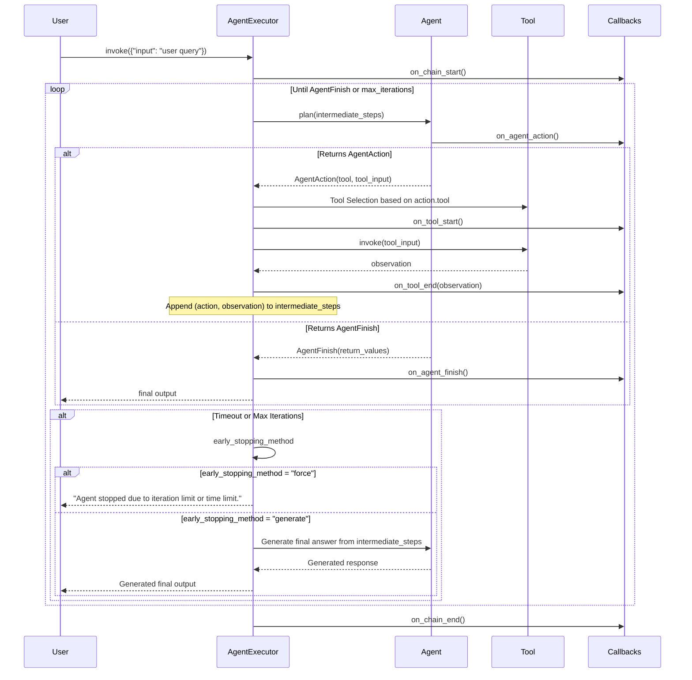

# Agent Types API Reference

## Overview

Agents are autonomous systems that use Large Language Models (LLMs) for decision-making with tool access. Unlike chains that follow predetermined execution paths, agents dynamically determine which actions to take based on observations and intermediate results. This enables agents to handle complex tasks requiring reasoning, planning, and tool usage.

**Agent Role in LangChain Ecosystem:**

Agents extend the LangChain ecosystem by providing an orchestration layer that:
- **Decision-Making**: Uses LLM reasoning to decide what action to take next
- **Tool Integration**: Connects to external tools and APIs for task execution
- **Iterative Refinement**: Processes observations and adjusts strategy dynamically
- **Goal-Oriented**: Works toward completing user objectives autonomously

**Relationship Between Agents and Tools:**

Tools are the capabilities agents can invoke to accomplish tasks. Each tool:
- Has a unique `name` for identification
- Provides a `description` explaining its purpose (used by LLM for selection)
- Defines an `args_schema` specifying input requirements using Pydantic models
- Implements execution logic via `_run()` (sync) or `_arun()` (async) methods

See [Tools API Reference](tools.md) for complete tool interface documentation.

**When to Use Agents vs Chains:**

Use **Agents** when:
- Task requires dynamic decision-making based on intermediate results
- Multiple tools available and agent must select appropriate ones
- Problem-solving requires iterative reasoning (observe → think → act loop)
- Path to solution is not predetermined

Use **Chains** when:
- Execution flow is deterministic and can be pre-defined
- Task requires simple sequential processing
- Predictable performance and latency are critical
- Problem domain is well-understood with fixed solution path

## Agent Decision Loop Architecture

The agent execution cycle follows an iterative observe-think-act pattern orchestrated by `AgentExecutor`:



**Execution Parameters:**

- **max_iterations** (default: 15): Maximum number of decision-action-observation cycles before forcing termination. Setting to `None` can lead to infinite loops.
- **max_execution_time** (default: None): Wall clock timeout in seconds. Agent stops when this limit is reached regardless of iteration count.
- **early_stopping_method** (default: "force"): Strategy when termination limits are reached:
  - `"force"`: Returns constant message "Agent stopped due to iteration limit or time limit."
  - `"generate"`: Calls agent's LLM one final time to generate answer from intermediate steps

Source: `libs/langchain/langchain_classic/agents/agent.py:1032-1050`

## AgentExecutor Class

`AgentExecutor` is the primary orchestration class for agent-based workflows. It manages the decision loop, tool execution, error handling, and termination conditions.

**Source:** `libs/langchain/langchain_classic/agents/agent.py:1021`

### Fields

#### agent
```python
agent: BaseSingleActionAgent | BaseMultiActionAgent | Runnable
```

The decision maker that determines which actions to take at each step. Can be:
- `BaseSingleActionAgent`: Returns single action per step
- `BaseMultiActionAgent`: Returns multiple actions for parallel execution
- `Runnable`: Automatically wrapped in `RunnableAgent` or `RunnableMultiActionAgent`

**Type:** `BaseSingleActionAgent | BaseMultiActionAgent | Runnable`

#### tools
```python
tools: Sequence[BaseTool]
```

List of tools available to the agent. Each tool must implement the `BaseTool` interface with `name`, `description`, and execution methods. Agent validates that allowed tools match provided tools during initialization.

**Type:** `Sequence[BaseTool]`

**Validation:** Checked via `validate_tools` model validator at line 1094

#### return_intermediate_steps
```python
return_intermediate_steps: bool = False
```

When `True`, includes agent's complete trajectory of actions and observations in output. Useful for debugging, logging, and understanding agent reasoning process.

**Type:** `bool`

**Default:** `False`

**Output Impact:** Adds `"intermediate_steps"` key to return dictionary containing `list[tuple[AgentAction, str]]`

#### max_iterations
```python
max_iterations: int | None = 15
```

Maximum number of decision-action-observation cycles before forcing termination. Prevents infinite loops in agent execution.

**Type:** `int | None`

**Default:** `15`

**Warning:** Setting to `None` can lead to infinite loops if agent never returns `AgentFinish`

Source: `libs/langchain/langchain_classic/agents/agent.py:1032-1036`

#### max_execution_time
```python
max_execution_time: float | None = None
```

Maximum wall clock time (in seconds) to spend in the execution loop. Provides timeout protection independent of iteration count.

**Type:** `float | None`

**Default:** `None` (no timeout)

Source: `libs/langchain/langchain_classic/agents/agent.py:1037-1040`

#### early_stopping_method
```python
early_stopping_method: str = "force"
```

Strategy for handling early termination when max_iterations or max_execution_time limits are reached:

- **"force"**: Returns constant string "Agent stopped due to iteration limit or time limit."
- **"generate"**: Calls agent's LLM one final time to generate answer based on intermediate steps

**Type:** `str`

**Default:** `"force"`

**Allowed Values:** `"force"`, `"generate"`

Source: `libs/langchain/langchain_classic/agents/agent.py:1041-1050`

#### handle_parsing_errors
```python
handle_parsing_errors: bool | str | Callable[[OutputParserException], str] = False
```

Configures error handling for agent output parser failures. Enables self-correction by feeding errors back to LLM:

- **`False`**: Raises `OutputParserException` immediately (fail-fast)
- **`True`**: Sends error message to LLM as observation, allowing agent to self-correct
- **`str`**: Sends custom error message to LLM
- **`Callable`**: Processes exception and returns custom observation string

**Type:** `bool | str | Callable[[OutputParserException], str]`

**Default:** `False`

**Use Case:** Enable LLM self-correction by setting to `True` for malformed output recovery

Source: `libs/langchain/langchain_classic/agents/agent.py:1051-1059`

#### trim_intermediate_steps
```python
trim_intermediate_steps: int | Callable[[list[tuple[AgentAction, str]]], list[tuple[AgentAction, str]]] = -1
```

Controls context window management by trimming intermediate steps before passing to agent:

- **`-1`**: No trimming (default)
- **`int > 0`**: Keep only last N steps
- **`Callable`**: Custom pruning function receiving and returning step list

**Type:** `int | Callable[[list[tuple[AgentAction, str]]], list[tuple[AgentAction, str]]]`

**Default:** `-1` (no trimming)

**Use Case:** Prevent context window overflow in long-running agent sessions

Source: `libs/langchain/langchain_classic/agents/agent.py:1060-1065`

### Methods

#### from_agent_and_tools
```python
@classmethod
def from_agent_and_tools(
    cls,
    agent: BaseSingleActionAgent | BaseMultiActionAgent | Runnable,
    tools: Sequence[BaseTool],
    callbacks: Callbacks = None,
    **kwargs: Any,
) -> AgentExecutor
```

Factory method to create `AgentExecutor` from agent and tools.

**Args:**
- `agent` (`BaseSingleActionAgent | BaseMultiActionAgent | Runnable`): The agent decision maker
- `tools` (`Sequence[BaseTool]`): Available tools for agent
- `callbacks` (`Callbacks`, optional): Callback handlers for execution events
- `**kwargs` (`Any`): Additional configuration (max_iterations, max_execution_time, etc.)

**Returns:**
- `AgentExecutor`: Configured agent executor instance

**Source:** `libs/langchain/langchain_classic/agents/agent.py:1068`

**Example:**
```python
from langchain_classic.agents import AgentExecutor, BaseSingleActionAgent
from langchain_core.tools import tool

@tool
def search(query: str) -> str:
    """Search for information."""
    return f"Results for: {query}"

# Assume custom_agent is a BaseSingleActionAgent instance
executor = AgentExecutor.from_agent_and_tools(
    agent=custom_agent,
    tools=[search],
    max_iterations=10,
    verbose=True
)
```

#### iter
```python
def iter(
    self,
    inputs: Any,
    callbacks: Callbacks = None,
    *,
    include_run_info: bool = False,
    async_: bool = False,
) -> AgentExecutorIterator
```

Enables step-by-step iteration over agent execution, yielding intermediate results.

**Args:**
- `inputs` (`Any`): Input dictionary for agent
- `callbacks` (`Callbacks`, optional): Callback handlers
- `include_run_info` (`bool`, optional): Whether to include run metadata
- `async_` (`bool`, optional): Kept for backwards compatibility but ignored

**Returns:**
- `AgentExecutorIterator`: Iterator yielding steps and final output

**Use Case:** Real-time streaming of agent decision-making process

**Source:** `libs/langchain/langchain_classic/agents/agent.py:1194`

**Example:**
```python
executor = AgentExecutor(agent=agent, tools=tools)
for step in executor.iter({"input": "What is the weather?"}):
    print(f"Step: {step}")
```

#### invoke / ainvoke
```python
def invoke(self, input: dict[str, Any], config: RunnableConfig | None = None) -> dict[str, Any]
async def ainvoke(self, input: dict[str, Any], config: RunnableConfig | None = None) -> dict[str, Any]
```

Execute agent via Runnable interface (inherited from `Chain` base class).

**Args:**
- `input` (`dict[str, Any]`): Input dictionary with user query
- `config` (`RunnableConfig | None`, optional): Execution configuration with callbacks, tags, metadata

**Returns:**
- `dict[str, Any]`: Dictionary with agent output and optional intermediate_steps

**Use Case:** Standard execution method for agent workflows

**Example:**
```python
result = executor.invoke({"input": "Analyze quarterly sales data"})
print(result["output"])
```

### Validators

#### validate_tools
```python
@model_validator(mode="after")
def validate_tools(self) -> Self
```

Validates that agent's allowed tools match provided tools list. Raises `ValueError` if mismatch detected.

**Validation Logic:**
- Retrieves `agent.get_allowed_tools()`
- Compares with `[tool.name for tool in tools]`
- Raises error if sets don't match

**Source:** `libs/langchain/langchain_classic/agents/agent.py:1094`

**Raises:**
- `ValueError`: If allowed tools differ from provided tools

#### validate_runnable_agent
```python
@model_validator(mode="before")
@classmethod
def validate_runnable_agent(cls, values: dict) -> Any
```

Automatically converts `Runnable` to `RunnableAgent` or `RunnableMultiActionAgent` based on output type:

- **Single Action**: `Runnable[dict, AgentAction | AgentFinish]` → `RunnableAgent`
- **Multi Action**: `Runnable[dict, list[AgentAction] | AgentFinish]` → `RunnableMultiActionAgent`

**Source:** `libs/langchain/langchain_classic/agents/agent.py:1121`

### Complete AgentExecutor Example

```python
from langchain_classic.agents import AgentExecutor
from langchain_core.agents import AgentAction, AgentFinish
from langchain_core.prompts import ChatPromptTemplate
from langchain_core.tools import tool
from langchain_openai import ChatOpenAI

# Define tools
@tool
def calculate(expression: str) -> str:
    """Evaluate mathematical expression."""
    try:
        result = eval(expression)
        return f"Result: {result}"
    except Exception as e:
        return f"Error: {str(e)}"

@tool
def search_database(query: str) -> str:
    """Search company database."""
    # Simulate database lookup
    return f"Database results for '{query}': [Record 1, Record 2]"

# Create LCEL agent using prompt | llm | output_parser
from langchain_core.output_parsers import JsonOutputParser

prompt = ChatPromptTemplate.from_messages([
    ("system", "You are a helpful assistant. Use tools to answer questions."),
    ("human", "{input}"),
    ("assistant", "Thought: {intermediate_steps}")
])

llm = ChatOpenAI(model="gpt-4", temperature=0)

# Define output parser that extracts action or finish
def parse_agent_output(output):
    # Custom parsing logic to return AgentAction or AgentFinish
    if "FINAL ANSWER" in output.content:
        return AgentFinish(
            return_values={"output": output.content.split("FINAL ANSWER:")[-1].strip()},
            log=output.content
        )
    # Extract tool and input from output
    return AgentAction(tool="search_database", tool_input="example", log=output.content)

agent_runnable = prompt | llm | parse_agent_output

# Create AgentExecutor
executor = AgentExecutor(
    agent=agent_runnable,
    tools=[calculate, search_database],
    max_iterations=5,
    max_execution_time=30.0,
    early_stopping_method="generate",
    handle_parsing_errors=True,
    return_intermediate_steps=True,
    verbose=True
)

# Execute agent
result = executor.invoke({
    "input": "Calculate 25 * 4 and then search database for Q1 results"
})

print("Final Output:", result["output"])
print("Steps Taken:", len(result["intermediate_steps"]))
```

**Expected Output:**
```
Final Output: The calculation 25 * 4 equals 100. Database search for Q1 results returned [Record 1, Record 2].
Steps Taken: 3
```

## BaseSingleActionAgent

`BaseSingleActionAgent` is the base class for agents that return one action per decision cycle.

**Source:** `libs/langchain/langchain_classic/agents/agent.py:55`

### Abstract Methods

#### plan
```python
@abstractmethod
def plan(
    self,
    intermediate_steps: list[tuple[AgentAction, str]],
    callbacks: Callbacks = None,
    **kwargs: Any,
) -> AgentAction | AgentFinish
```

Core decision-making method that determines next action based on history and inputs.

**Args:**
- `intermediate_steps` (`list[tuple[AgentAction, str]]`): Agent's trajectory - list of (action, observation) pairs from previous steps
- `callbacks` (`Callbacks`, optional): Callback handlers for execution events
- `**kwargs` (`Any`): User inputs including original query and any additional context

**Returns:**
- `AgentAction`: Specifies tool to invoke and input arguments when agent wants to take action
- `AgentFinish`: Contains final return values when agent completes task

**Source:** `libs/langchain/langchain_classic/agents/agent.py:68`

#### aplan
```python
@abstractmethod
async def aplan(
    self,
    intermediate_steps: list[tuple[AgentAction, str]],
    callbacks: Callbacks = None,
    **kwargs: Any,
) -> AgentAction | AgentFinish
```

Async version of `plan()` method for non-blocking agent execution.

**Args:** Same as `plan()`

**Returns:** Same as `plan()`

**Source:** `libs/langchain/langchain_classic/agents/agent.py:87`

### Properties and Methods

#### return_values
```python
@property
def return_values(self) -> list[str]
```

Output keys to include in final agent response.

**Returns:**
- `list[str]`: List of output keys (default: `["output"]`)

**Source:** `libs/langchain/langchain_classic/agents/agent.py:59`

#### get_allowed_tools
```python
def get_allowed_tools(self) -> list[str] | None
```

Returns list of tool names agent is permitted to use. Used for validation in `AgentExecutor`.

**Returns:**
- `list[str] | None`: Tool names or `None` if all tools allowed

**Source:** `libs/langchain/langchain_classic/agents/agent.py:63`

#### return_stopped_response
```python
def return_stopped_response(
    self,
    early_stopping_method: str,
    intermediate_steps: list[tuple[AgentAction, str]],
    **kwargs: Any,
) -> AgentFinish
```

Generates response when agent stops due to max iterations or timeout.

**Args:**
- `early_stopping_method` (`str`): Either "force" or "generate"
- `intermediate_steps` (`list[tuple[AgentAction, str]]`): Agent's trajectory
- `**kwargs` (`Any`): Additional context

**Returns:**
- `AgentFinish`: Finish object with appropriate message

**Raises:**
- `ValueError`: If early_stopping_method is not supported

**Source:** `libs/langchain/langchain_classic/agents/agent.py:113`

### Custom Agent Implementation Example

```python
from langchain_classic.agents import BaseSingleActionAgent
from langchain_core.agents import AgentAction, AgentFinish
from langchain_core.callbacks import Callbacks
from langchain_openai import ChatOpenAI
from typing import Any

class CustomReasoningAgent(BaseSingleActionAgent):
    """Custom agent with explicit reasoning logic."""
    
    llm: ChatOpenAI
    allowed_tool_names: list[str]
    
    @property
    def input_keys(self) -> list[str]:
        return ["input"]
    
    def get_allowed_tools(self) -> list[str] | None:
        return self.allowed_tool_names
    
    def plan(
        self,
        intermediate_steps: list[tuple[AgentAction, str]],
        callbacks: Callbacks = None,
        **kwargs: Any,
    ) -> AgentAction | AgentFinish:
        """Implement custom decision logic."""
        user_input = kwargs.get("input", "")
        
        # Build context from intermediate steps
        context = "\n".join([
            f"Action: {action.tool}({action.tool_input})\nObservation: {obs}"
            for action, obs in intermediate_steps
        ])
        
        # Create reasoning prompt
        prompt = f"""You are a helpful assistant with access to tools: {self.allowed_tool_names}

User Question: {user_input}

Previous Steps:
{context}

Based on the above, what should you do next?
- If you need more information, respond with: ACTION: <tool_name> INPUT: <tool_input>
- If you can answer, respond with: FINAL ANSWER: <your_answer>
"""
        
        # Get LLM response
        response = self.llm.invoke(prompt)
        response_text = response.content
        
        # Parse response
        if "FINAL ANSWER:" in response_text:
            answer = response_text.split("FINAL ANSWER:")[-1].strip()
            return AgentFinish(
                return_values={"output": answer},
                log=response_text
            )
        elif "ACTION:" in response_text and "INPUT:" in response_text:
            # Extract tool and input
            tool_part = response_text.split("ACTION:")[-1].split("INPUT:")[0].strip()
            input_part = response_text.split("INPUT:")[-1].strip()
            
            return AgentAction(
                tool=tool_part,
                tool_input=input_part,
                log=response_text
            )
        else:
            # Fallback to finish if parsing fails
            return AgentFinish(
                return_values={"output": response_text},
                log=response_text
            )
    
    async def aplan(
        self,
        intermediate_steps: list[tuple[AgentAction, str]],
        callbacks: Callbacks = None,
        **kwargs: Any,
    ) -> AgentAction | AgentFinish:
        """Async version - delegate to sync for simplicity."""
        return self.plan(intermediate_steps, callbacks, **kwargs)

# Usage
from langchain_core.tools import tool

@tool
def web_search(query: str) -> str:
    """Search the web."""
    return f"Web results for: {query}"

@tool
def calculator(expression: str) -> str:
    """Calculate math expression."""
    return str(eval(expression))

custom_agent = CustomReasoningAgent(
    llm=ChatOpenAI(model="gpt-4", temperature=0),
    allowed_tool_names=["web_search", "calculator"]
)

executor = AgentExecutor(
    agent=custom_agent,
    tools=[web_search, calculator],
    max_iterations=5,
    verbose=True
)

result = executor.invoke({"input": "What is 15 * 23 and where was Python created?"})
print(result["output"])
```

## BaseMultiActionAgent

`BaseMultiActionAgent` extends the agent interface to support returning multiple actions per decision cycle, enabling parallel tool execution.

**Source:** `libs/langchain/langchain_classic/agents/agent.py:224`

### Abstract Methods

#### plan
```python
@abstractmethod
def plan(
    self,
    intermediate_steps: list[tuple[AgentAction, str]],
    callbacks: Callbacks = None,
    **kwargs: Any,
) -> list[AgentAction] | AgentFinish
```

Returns multiple actions for concurrent execution or finish signal.

**Args:**
- `intermediate_steps` (`list[tuple[AgentAction, str]]`): Agent's trajectory
- `callbacks` (`Callbacks`, optional): Callback handlers
- `**kwargs` (`Any`): User inputs

**Returns:**
- `list[AgentAction]`: Multiple actions to execute in parallel
- `AgentFinish`: Final answer when task complete

**Difference from Single Action:** Returns `list[AgentAction]` instead of single `AgentAction`

**Source:** `libs/langchain/langchain_classic/agents/agent.py:241`

### Usage Scenarios

**When to Use BaseMultiActionAgent:**

1. **Independent Tool Calls**: When multiple tools can be invoked concurrently without dependencies
2. **Performance Optimization**: Parallel execution reduces total latency
3. **Batch Processing**: Processing multiple queries or data items simultaneously

**Example Use Case:**
```python
# Agent decides to search multiple sources in parallel
return [
    AgentAction(tool="web_search", tool_input="Python history", log=""),
    AgentAction(tool="web_search", tool_input="Python creator", log=""),
    AgentAction(tool="database_query", tool_input="Python stats", log="")
]
```

## RunnableAgent / RunnableMultiActionAgent

Wrapper classes that adapt LCEL `Runnable` compositions to the agent protocol, enabling modern chain-based agents.

### RunnableAgent

**Source:** `libs/langchain/langchain_classic/agents/agent.py:395`

```python
class RunnableAgent(BaseSingleActionAgent):
    runnable: Runnable[dict, AgentAction | AgentFinish]
    stream_runnable: bool = True
```

**Fields:**
- `runnable` (`Runnable[dict, AgentAction | AgentFinish]`): LCEL composition that produces agent decisions
- `input_keys_arg` (`list[str]`): Input keys for agent
- `return_keys_arg` (`list[str]`): Return keys for agent
- `stream_runnable` (`bool`, default `True`): Whether to stream LLM invocations

**Streaming Behavior:**

When `stream_runnable=True`, the underlying LLM is invoked in streaming fashion, making individual tokens accessible via `stream_log` on `AgentExecutor`. This enables real-time agent thought visibility.

### RunnableMultiActionAgent

**Source:** `libs/langchain/langchain_classic/agents/agent.py:503`

```python
class RunnableMultiActionAgent(BaseMultiActionAgent):
    runnable: Runnable[dict, list[AgentAction] | AgentFinish]
```

Same as `RunnableAgent` but for multi-action scenarios.

### Automatic Conversion

`AgentExecutor.validate_runnable_agent` automatically wraps `Runnable` instances:

**Conversion Logic:**
```python
if agent.OutputType == list[AgentAction] | AgentFinish:
    # Multi-action
    agent = RunnableMultiActionAgent(runnable=agent, stream_runnable=True)
else:
    # Single-action
    agent = RunnableAgent(runnable=agent, stream_runnable=True)
```

**Source:** `libs/langchain/langchain_classic/agents/agent.py:1121`

### LCEL Agent Example

```python
from langchain_core.agents import AgentAction, AgentFinish
from langchain_core.prompts import ChatPromptTemplate
from langchain_core.output_parsers import StrOutputParser
from langchain_core.tools import tool
from langchain_openai import ChatOpenAI
from langchain_classic.agents import AgentExecutor

# Define tools
@tool
def get_word_length(word: str) -> int:
    """Returns the length of a word."""
    return len(word)

@tool
def reverse_string(text: str) -> str:
    """Reverses a string."""
    return text[::-1]

# Create LCEL agent chain
prompt = ChatPromptTemplate.from_messages([
    ("system", """You are an agent with access to tools. Respond in this format:

If you need to use a tool:
TOOL: <tool_name>
INPUT: <tool_input>

If you have the final answer:
FINAL: <answer>
"""),
    ("human", "{input}\n\nPrevious steps: {intermediate_steps}")
])

llm = ChatOpenAI(model="gpt-4")

def parse_agent_decision(text: str) -> AgentAction | AgentFinish:
    """Parse LLM output into AgentAction or AgentFinish."""
    if "FINAL:" in text:
        answer = text.split("FINAL:")[-1].strip()
        return AgentFinish(return_values={"output": answer}, log=text)
    elif "TOOL:" in text and "INPUT:" in text:
        tool_name = text.split("TOOL:")[-1].split("INPUT:")[0].strip()
        tool_input = text.split("INPUT:")[-1].strip()
        return AgentAction(tool=tool_name, tool_input=tool_input, log=text)
    else:
        # Default to finish
        return AgentFinish(return_values={"output": text}, log=text)

# Build LCEL chain
agent_chain = prompt | llm | StrOutputParser() | parse_agent_decision

# Create executor (automatic RunnableAgent wrapping)
executor = AgentExecutor(
    agent=agent_chain,  # Automatically wrapped in RunnableAgent
    tools=[get_word_length, reverse_string],
    max_iterations=3,
    verbose=True,
    stream_runnable=True  # Enable token streaming
)

# Execute
result = executor.invoke({
    "input": "What is the length of 'LangChain' and what is it spelled backwards?"
})
print(result["output"])
```

**Expected Output:**
```
The word 'LangChain' has 9 letters and spelled backwards is 'niahCgnaL'.
```

## Agent Base Class (Deprecated)

**Source:** `libs/langchain/langchain_classic/agents/agent.py:710`

The `Agent` class is the legacy agent implementation that predates the LCEL and Runnable interfaces.

**Deprecation Notice:**

```python
AGENT_DEPRECATION_WARNING = """
The Agent class and related classes are deprecated.
Please use the new agent creation methods:
- For LCEL: create_react_agent, create_openai_functions_agent
- For custom agents: Use RunnableAgent with custom Runnable
"""
```

**Source:** `libs/langchain/langchain_classic/_api/deprecation.py:44`

### Migration Guidance

**Old Pattern (Deprecated):**
```python
from langchain_classic.agents import Agent, LLMSingleActionAgent

# Legacy agent implementation
agent = LLMSingleActionAgent(
    llm_chain=llm_chain,
    output_parser=parser,
    stop=["Observation:"]
)
```

**New Pattern (Modern LCEL):**
```python
from langchain_core.prompts import ChatPromptTemplate
from langchain_openai import ChatOpenAI

# Modern LCEL approach
agent_runnable = prompt | llm | output_parser

executor = AgentExecutor(
    agent=agent_runnable,  # Automatically wrapped in RunnableAgent
    tools=tools
)
```

### Historical Reference

The `Agent` class included:
- `llm_chain`: LLMChain for generating agent reasoning
- `output_parser`: Parser to extract AgentAction/AgentFinish from LLM output
- `allowed_tools`: Tool name whitelist
- `return_values`: Output keys

**Migration Checklist:**
1. Replace `Agent` instantiation with LCEL chain composition
2. Convert `output_parser` to function returning AgentAction/AgentFinish
3. Use `AgentExecutor` with Runnable agent (automatic wrapping)
4. Test equivalent behavior with new implementation

## Tool Integration

Agents interact with tools through a standardized interface defined by `BaseTool`. Understanding tool integration is critical for agent functionality.

### Tool Interface Contract

Each tool must implement:

**Required Attributes:**
- `name` (`str`): Unique identifier for tool selection by agent
- `description` (`str`): Natural language explanation of tool purpose and usage (used by LLM for decision-making)
- `args_schema` (`Type[BaseModel]`, optional): Pydantic model defining input parameters with types and validation

**Required Methods:**
- `_run(self, *args, **kwargs) -> str`: Synchronous tool execution
- `_arun(self, *args, **kwargs) -> str`: Asynchronous tool execution (optional, defaults to sync wrapper)

**See:** [Tools API Reference](tools.md) for complete tool interface documentation

### Tool Selection Logic

The agent decision loop uses tool selection based on:

1. **Agent Decision**: Agent's `plan()` method returns `AgentAction` specifying `tool` name
2. **Tool Lookup**: `AgentExecutor` looks up tool by name from provided tools list
3. **Validation**: Ensures tool name matches available tools (validated at initialization)
4. **Execution**: Invokes tool's `_run()` or `_arun()` method with provided input

**Source:** `libs/langchain/langchain_classic/agents/agent.py:1239-1248`

### Tool Validation

`AgentExecutor` validates tool compatibility during initialization:

```python
@model_validator(mode="after")
def validate_tools(self) -> Self:
    """Validate that tools are compatible with agent."""
    allowed_tools = self.agent.get_allowed_tools()
    if allowed_tools is not None:
        tool_names = {tool.name for tool in self.tools}
        if set(allowed_tools) != tool_names:
            raise ValueError(
                f"Allowed tools ({allowed_tools}) different than "
                f"provided tools ({tool_names})"
            )
    return self
```

**Source:** `libs/langchain/langchain_classic/agents/agent.py:1094`

### Tool Execution with Callbacks

Tool invocation triggers callback events:

1. **on_tool_start**: Called before tool execution with tool name and input
2. **Tool Execution**: Tool's `_run()` or `_arun()` method executes
3. **on_tool_end**: Called after successful execution with output
4. **on_tool_error**: Called if tool raises exception

**Example:**
```python
from langchain_core.callbacks import BaseCallbackHandler

class ToolLoggingCallback(BaseCallbackHandler):
    def on_tool_start(self, serialized, input_str, **kwargs):
        print(f"Tool Starting: {serialized.get('name')}")
        print(f"Input: {input_str}")
    
    def on_tool_end(self, output, **kwargs):
        print(f"Tool Output: {output}")
    
    def on_tool_error(self, error, **kwargs):
        print(f"Tool Error: {error}")

executor = AgentExecutor(
    agent=agent,
    tools=tools,
    callbacks=[ToolLoggingCallback()]
)
```

### Error Handling for Tool Failures

**ExceptionTool Pattern:**

When a tool raises an exception, `AgentExecutor` uses `ExceptionTool` to capture and format the error:

**Source:** `libs/langchain/langchain_classic/agents/agent.py:992`

Tool errors are handled based on tool's `handle_tool_error` configuration:
- **`False`** (default): Exception propagates to agent
- **`True`**: Exception message sent to agent as observation
- **`str`**: Custom error message sent to agent
- **`Callable`**: Function processes exception and returns observation

This enables agents to handle tool failures gracefully and potentially retry with corrected inputs.

## Error Handling

Comprehensive error handling is critical for robust agent deployments. `AgentExecutor` provides multiple error handling mechanisms.

### OutputParserException Handling

When agent's output parser fails to extract valid `AgentAction` or `AgentFinish`, `OutputParserException` is raised.

**Configuration via `handle_parsing_errors`:**

**Pattern 1: Fail Fast (Default)**
```python
executor = AgentExecutor(
    agent=agent,
    tools=tools,
    handle_parsing_errors=False  # Raises exception immediately
)
```

**Pattern 2: LLM Self-Correction**
```python
executor = AgentExecutor(
    agent=agent,
    tools=tools,
    handle_parsing_errors=True  # Sends error to LLM as observation
)
```

When `True`, the error message is fed back to the agent as an observation, allowing the LLM to self-correct:

```
Observation: Could not parse LLM output: `<malformed_output>`
Thought: I need to format my response correctly...
```

**Pattern 3: Custom Error Message**
```python
executor = AgentExecutor(
    agent=agent,
    tools=tools,
    handle_parsing_errors="Please format your response as: ACTION: <tool> INPUT: <input>"
)
```

**Pattern 4: Custom Error Handler**
```python
def custom_error_handler(exception: OutputParserException) -> str:
    """Process parsing errors and return helpful observation."""
    return f"Parsing failed. Error: {str(exception)}. Please use correct format."

executor = AgentExecutor(
    agent=agent,
    tools=tools,
    handle_parsing_errors=custom_error_handler
)
```

**Source:** `libs/langchain/langchain_classic/agents/agent.py:1051-1059`

### ToolException Handling

Tool execution failures are managed via `handle_tool_error` configuration on individual tools:

```python
from langchain_core.tools import tool

@tool
def risky_operation(param: str) -> str:
    """Operation that might fail."""
    if not param:
        raise ValueError("Parameter cannot be empty")
    return f"Processed: {param}"

# Configure tool-level error handling
risky_operation.handle_tool_error = True  # Send error to agent

executor = AgentExecutor(agent=agent, tools=[risky_operation])
```

Tool errors propagate to agent as observations, enabling recovery strategies.

### Timeout Handling

**max_execution_time** provides wall clock timeout protection:

```python
executor = AgentExecutor(
    agent=agent,
    tools=tools,
    max_execution_time=30.0,  # 30 seconds
    early_stopping_method="generate"  # Generate final answer on timeout
)
```

**Timeout Behavior:**
1. `AgentExecutor` tracks elapsed time from invocation start
2. Before each agent step, checks if time limit exceeded
3. If exceeded, triggers early stopping method:
   - `"force"`: Returns "Agent stopped due to iteration limit or time limit."
   - `"generate"`: Calls agent one final time to generate answer from intermediate steps

### Iteration Limit Handling

**max_iterations** prevents infinite loops:

```python
executor = AgentExecutor(
    agent=agent,
    tools=tools,
    max_iterations=10,  # Maximum 10 steps
    early_stopping_method="force"
)
```

**Warning:** Setting `max_iterations=None` can lead to infinite loops if agent never returns `AgentFinish`.

**Source:** `libs/langchain/langchain_classic/agents/agent.py:1032-1036`

### Production Error Handling Example

```python
from langchain_classic.agents import AgentExecutor
from langchain_core.callbacks import BaseCallbackHandler
from langchain_core.exceptions import OutputParserException
import logging

# Configure logging
logging.basicConfig(level=logging.INFO)
logger = logging.getLogger(__name__)

# Custom callback for error tracking
class ErrorTrackingCallback(BaseCallbackHandler):
    def on_tool_error(self, error, **kwargs):
        logger.error(f"Tool execution failed: {error}")
    
    def on_chain_error(self, error, **kwargs):
        logger.error(f"Agent execution failed: {error}")

# Custom parsing error handler
def parsing_error_handler(exception: OutputParserException) -> str:
    logger.warning(f"Output parsing failed: {exception}")
    return (
        "Your previous response could not be parsed. "
        "Please respond in the correct format:\n"
        "ACTION: <tool_name>\n"
        "INPUT: <tool_input>\n"
        "OR\n"
        "FINAL: <final_answer>"
    )

# Production-ready executor
executor = AgentExecutor(
    agent=agent_runnable,
    tools=tools,
    max_iterations=15,
    max_execution_time=60.0,
    early_stopping_method="generate",
    handle_parsing_errors=parsing_error_handler,
    return_intermediate_steps=True,  # For debugging
    trim_intermediate_steps=5,  # Keep only last 5 steps to manage context
    callbacks=[ErrorTrackingCallback()],
    verbose=True
)

# Execute with try-except
try:
    result = executor.invoke(
        {"input": "Complex multi-step query"},
        config={"max_concurrency": 3}  # Limit concurrent tool calls
    )
    logger.info(f"Agent completed successfully: {result['output']}")
    logger.info(f"Steps taken: {len(result.get('intermediate_steps', []))}")
except Exception as e:
    logger.exception(f"Agent execution failed: {e}")
    # Implement fallback or retry logic
```

## Intermediate Steps and Memory

### Intermediate Steps Structure

`intermediate_steps` stores the agent's complete trajectory as a list of `(action, observation)` tuples:

```python
intermediate_steps: list[tuple[AgentAction, str]]
```

**Structure:**
- **`AgentAction`**: Contains `tool`, `tool_input`, and `log` fields
- **`str`**: Tool observation (output from tool execution)

**Example:**
```python
intermediate_steps = [
    (AgentAction(tool="search", tool_input="Python", log="..."), "Search results: ..."),
    (AgentAction(tool="calculator", tool_input="15*23", log="..."), "Result: 345"),
]
```

### return_intermediate_steps

When `return_intermediate_steps=True`, the executor includes the complete trajectory in output:

```python
executor = AgentExecutor(
    agent=agent,
    tools=tools,
    return_intermediate_steps=True
)

result = executor.invoke({"input": "Multi-step query"})

# Access trajectory
for i, (action, observation) in enumerate(result["intermediate_steps"]):
    print(f"Step {i+1}:")
    print(f"  Tool: {action.tool}")
    print(f"  Input: {action.tool_input}")
    print(f"  Observation: {observation}")
```

**Use Cases:**
- **Debugging**: Understand agent decision-making process
- **Logging**: Track agent behavior for analysis
- **Auditing**: Maintain execution records for compliance
- **Training**: Generate training data from agent trajectories

### trim_intermediate_steps

Long-running agents accumulate many intermediate steps, potentially exceeding LLM context windows. `trim_intermediate_steps` manages this:

**Keep Last N Steps:**
```python
executor = AgentExecutor(
    agent=agent,
    tools=tools,
    trim_intermediate_steps=5  # Keep only last 5 steps
)
```

**Custom Pruning Function:**
```python
def smart_trim(steps: list[tuple[AgentAction, str]]) -> list[tuple[AgentAction, str]]:
    """Keep first step and last 3 steps."""
    if len(steps) <= 4:
        return steps
    return [steps[0]] + steps[-3:]

executor = AgentExecutor(
    agent=agent,
    tools=tools,
    trim_intermediate_steps=smart_trim
)
```

**Context Window Management Strategy:**
```python
def token_aware_trim(steps: list[tuple[AgentAction, str]]) -> list[tuple[AgentAction, str]]:
    """Trim based on approximate token count."""
    max_tokens = 2000
    estimated_tokens = 0
    kept_steps = []
    
    # Iterate from most recent
    for step in reversed(steps):
        action, observation = step
        # Rough estimate: 4 characters per token
        step_tokens = (len(action.log) + len(observation)) // 4
        
        if estimated_tokens + step_tokens > max_tokens:
            break
        
        kept_steps.insert(0, step)
        estimated_tokens += step_tokens
    
    return kept_steps

executor = AgentExecutor(
    agent=agent,
    tools=tools,
    trim_intermediate_steps=token_aware_trim
)
```

### Memory Integration Patterns

For stateful conversations, integrate memory systems with agents:

**Pattern 1: Explicit Memory in Inputs**
```python
from langchain_classic.memory import ConversationBufferMemory

memory = ConversationBufferMemory(return_messages=True)

# Store conversation history
memory.save_context(
    {"input": "Hello, I'm John"},
    {"output": "Hello John, how can I help?"}
)

# Load history and pass to agent
history = memory.load_memory_variables({})

result = executor.invoke({
    "input": "What's my name?",
    "chat_history": history["history"]  # Include memory in agent input
})
```

**Pattern 2: Memory-Enabled Executor (Custom Wrapper)**
```python
class MemoryAgentExecutor:
    """Agent executor with built-in memory."""
    
    def __init__(self, executor: AgentExecutor, memory: ConversationBufferMemory):
        self.executor = executor
        self.memory = memory
    
    def invoke(self, inputs: dict) -> dict:
        # Load memory
        memory_vars = self.memory.load_memory_variables(inputs)
        
        # Merge with inputs
        full_inputs = {**inputs, **memory_vars}
        
        # Execute agent
        result = self.executor.invoke(full_inputs)
        
        # Save to memory
        self.memory.save_context(
            {"input": inputs["input"]},
            {"output": result["output"]}
        )
        
        return result

# Usage
memory_executor = MemoryAgentExecutor(executor, memory)
result = memory_executor.invoke({"input": "Remember my name is Alice"})
```

**Pattern 3: Agent with Memory Tools**
```python
from langchain_core.tools import tool

# Memory storage
conversation_memory = {}

@tool
def store_memory(key: str, value: str) -> str:
    """Store information in memory."""
    conversation_memory[key] = value
    return f"Stored: {key} = {value}"

@tool
def recall_memory(key: str) -> str:
    """Retrieve information from memory."""
    return conversation_memory.get(key, "Not found")

# Agent can now manage its own memory
executor = AgentExecutor(
    agent=agent,
    tools=[store_memory, recall_memory, ...other_tools]
)

# Agent decides when to store/recall
result = executor.invoke({"input": "My favorite color is blue. What is it?"})
# Agent internally: stores "favorite_color"="blue", then recalls it
```

## Complete Examples

### Example 1: Basic AgentExecutor with Tools

```python
"""Basic agent with tool usage."""
from langchain_classic.agents import AgentExecutor
from langchain_core.agents import AgentAction, AgentFinish
from langchain_core.prompts import ChatPromptTemplate
from langchain_core.tools import tool
from langchain_openai import ChatOpenAI

# Define simple tools
@tool
def add(a: int, b: int) -> int:
    """Add two numbers."""
    return a + b

@tool
def multiply(a: int, b: int) -> int:
    """Multiply two numbers."""
    return a * b

# Create simple agent logic
prompt = ChatPromptTemplate.from_template("""
You are a math assistant. You have access to add and multiply tools.

User question: {input}
Previous steps: {intermediate_steps}

Respond with:
- TOOL: <tool_name> INPUT: a=<num> b=<num> (to use a tool)
- FINAL: <answer> (when done)
""")

llm = ChatOpenAI(model="gpt-4", temperature=0)

def parse_output(text: str) -> AgentAction | AgentFinish:
    """Simple output parser."""
    if "FINAL:" in text:
        answer = text.split("FINAL:")[-1].strip()
        return AgentFinish(return_values={"output": answer}, log=text)
    elif "TOOL:" in text:
        # Extract tool name and input
        tool_name = text.split("TOOL:")[-1].split("INPUT:")[0].strip()
        input_str = text.split("INPUT:")[-1].strip()
        # Parse input (simplified)
        return AgentAction(tool=tool_name, tool_input=input_str, log=text)
    return AgentFinish(return_values={"output": text}, log=text)

agent_chain = prompt | llm | (lambda x: parse_output(x.content))

# Create executor
executor = AgentExecutor(
    agent=agent_chain,
    tools=[add, multiply],
    max_iterations=5,
    verbose=True
)

# Execute
result = executor.invoke({"input": "What is (5 + 3) * 2?"})
print(f"Final Answer: {result['output']}")
```

**Expected Output:**
```
Final Answer: The result is 16. First, 5 + 3 = 8, then 8 * 2 = 16.
```

### Example 2: Custom Agent Implementation

```python
"""Custom agent with explicit reasoning."""
from langchain_classic.agents import BaseSingleActionAgent, AgentExecutor
from langchain_core.agents import AgentAction, AgentFinish
from langchain_core.callbacks import Callbacks
from langchain_core.tools import tool
from langchain_openai import ChatOpenAI
from typing import Any

class LogicAgent(BaseSingleActionAgent):
    """Agent with explicit logic-based reasoning."""
    
    llm: ChatOpenAI
    max_thought_steps: int = 3
    
    @property
    def input_keys(self) -> list[str]:
        return ["input", "context"]
    
    def plan(
        self,
        intermediate_steps: list[tuple[AgentAction, str]],
        callbacks: Callbacks = None,
        **kwargs: Any,
    ) -> AgentAction | AgentFinish:
        """Decide next action based on logic."""
        user_input = kwargs.get("input", "")
        context = kwargs.get("context", "")
        
        # Check if we have enough information
        if len(intermediate_steps) >= self.max_thought_steps:
            # Force finish after max steps
            summary = self._summarize_steps(intermediate_steps)
            return AgentFinish(
                return_values={"output": summary},
                log="Max steps reached"
            )
        
        # Determine what information we need
        if not intermediate_steps:
            # First step: gather initial data
            return AgentAction(
                tool="search",
                tool_input=user_input,
                log="Gathering initial information"
            )
        
        # Analyze previous results
        last_action, last_observation = intermediate_steps[-1]
        
        if "error" in last_observation.lower():
            # Handle errors
            return AgentFinish(
                return_values={"output": f"Encountered error: {last_observation}"},
                log="Error recovery"
            )
        
        # Use LLM for complex decision
        prompt = f"""Based on:
Question: {user_input}
Context: {context}
Previous: {last_observation}

What should I do next? Respond: TOOL: <name> INPUT: <input> OR FINAL: <answer>"""
        
        response = self.llm.invoke(prompt)
        return self._parse_llm_response(response.content)
    
    async def aplan(
        self,
        intermediate_steps: list[tuple[AgentAction, str]],
        callbacks: Callbacks = None,
        **kwargs: Any,
    ) -> AgentAction | AgentFinish:
        return self.plan(intermediate_steps, callbacks, **kwargs)
    
    def _summarize_steps(self, steps: list[tuple[AgentAction, str]]) -> str:
        """Create summary from steps."""
        summary = "Based on my investigation:\n"
        for action, observation in steps:
            summary += f"- {action.tool}: {observation[:100]}...\n"
        return summary
    
    def _parse_llm_response(self, text: str) -> AgentAction | AgentFinish:
        """Parse LLM output."""
        if "FINAL:" in text:
            return AgentFinish(
                return_values={"output": text.split("FINAL:")[-1].strip()},
                log=text
            )
        elif "TOOL:" in text:
            tool = text.split("TOOL:")[-1].split("INPUT:")[0].strip()
            tool_input = text.split("INPUT:")[-1].strip()
            return AgentAction(tool=tool, tool_input=tool_input, log=text)
        return AgentFinish(return_values={"output": text}, log=text)

# Define tools
@tool
def search(query: str) -> str:
    """Search for information."""
    return f"Search results for '{query}': Information about {query}..."

@tool
def analyze(data: str) -> str:
    """Analyze data."""
    return f"Analysis of '{data}': Key insights discovered..."

# Create agent
logic_agent = LogicAgent(
    llm=ChatOpenAI(model="gpt-4"),
    max_thought_steps=3
)

# Create executor
executor = AgentExecutor(
    agent=logic_agent,
    tools=[search, analyze],
    max_iterations=5,
    return_intermediate_steps=True,
    verbose=True
)

# Execute
result = executor.invoke({
    "input": "Research artificial intelligence trends",
    "context": "Technology industry focus"
})

print(f"\nFinal Output: {result['output']}")
print(f"\nSteps Taken: {len(result['intermediate_steps'])}")
for i, (action, obs) in enumerate(result['intermediate_steps']):
    print(f"  Step {i+1}: {action.tool} -> {obs[:50]}...")
```

### Example 3: LCEL Agent with RunnableAgent

```python
"""Modern LCEL-based agent with streaming."""
from langchain_core.agents import AgentAction, AgentFinish
from langchain_core.output_parsers import StrOutputParser
from langchain_core.prompts import ChatPromptTemplate
from langchain_core.runnables import RunnableLambda
from langchain_core.tools import tool
from langchain_openai import ChatOpenAI
from langchain_classic.agents import AgentExecutor

# Tools
@tool
def get_current_weather(location: str) -> str:
    """Get weather for a location."""
    # Simulate API call
    return f"Weather in {location}: Sunny, 72°F"

@tool
def get_forecast(location: str, days: int = 3) -> str:
    """Get weather forecast."""
    return f"{days}-day forecast for {location}: Mostly sunny"

# Create agent prompt
agent_prompt = ChatPromptTemplate.from_messages([
    ("system", """You are a helpful weather assistant. You have access to:
- get_current_weather(location): Get current weather
- get_forecast(location, days): Get forecast

Respond in JSON format:
{{"action": "tool_name", "action_input": "input_value"}}
OR
{{"final_answer": "your answer here"}}
"""),
    ("human", "{input}"),
    ("assistant", "Previous actions and observations:\n{intermediate_steps}")
])

# LLM
llm = ChatOpenAI(model="gpt-4", temperature=0)

# Output parser
def parse_agent_output(output: str) -> AgentAction | AgentFinish:
    """Parse JSON output from LLM."""
    import json
    try:
        parsed = json.loads(output)
        if "final_answer" in parsed:
            return AgentFinish(
                return_values={"output": parsed["final_answer"]},
                log=output
            )
        elif "action" in parsed:
            return AgentAction(
                tool=parsed["action"],
                tool_input=parsed.get("action_input", ""),
                log=output
            )
    except json.JSONDecodeError:
        pass
    
    # Fallback
    return AgentFinish(return_values={"output": output}, log=output)

# Build LCEL chain
agent_chain = (
    agent_prompt
    | llm
    | StrOutputParser()
    | RunnableLambda(parse_agent_output)
)

# Create executor (automatic RunnableAgent wrapping)
executor = AgentExecutor(
    agent=agent_chain,
    tools=[get_current_weather, get_forecast],
    max_iterations=3,
    verbose=True,
    stream_runnable=True,  # Enable streaming
    handle_parsing_errors=True  # Graceful error handling
)

# Execute
result = executor.invoke({
    "input": "What's the weather like in San Francisco and what's the forecast?"
})

print(f"Answer: {result['output']}")
```

**Expected Output:**
```
Answer: The current weather in San Francisco is sunny with a temperature of 72°F. The 3-day forecast shows mostly sunny conditions ahead.
```

### Example 4: Production Agent with Error Handling

```python
"""Production-ready agent with comprehensive error handling."""
from langchain_classic.agents import AgentExecutor
from langchain_core.agents import AgentAction, AgentFinish
from langchain_core.callbacks import BaseCallbackHandler
from langchain_core.exceptions import OutputParserException
from langchain_core.prompts import ChatPromptTemplate
from langchain_core.tools import tool
from langchain_openai import ChatOpenAI
import logging
from datetime import datetime
from typing import Any

# Configure logging
logging.basicConfig(
    level=logging.INFO,
    format='%(asctime)s - %(name)s - %(levelname)s - %(message)s'
)
logger = logging.getLogger(__name__)

# Custom callback for monitoring
class ProductionCallback(BaseCallbackHandler):
    """Callback for production monitoring."""
    
    def __init__(self):
        self.start_time = None
        self.tool_calls = 0
        self.errors = []
    
    def on_chain_start(self, serialized: dict[str, Any], inputs: dict[str, Any], **kwargs):
        self.start_time = datetime.now()
        logger.info(f"Agent started: {inputs.get('input', '')[:100]}")
    
    def on_chain_end(self, outputs: dict[str, Any], **kwargs):
        duration = (datetime.now() - self.start_time).total_seconds()
        logger.info(f"Agent completed in {duration:.2f}s with {self.tool_calls} tool calls")
    
    def on_tool_start(self, serialized: dict[str, Any], input_str: str, **kwargs):
        self.tool_calls += 1
        logger.info(f"Tool called: {serialized.get('name')} with input: {input_str[:100]}")
    
    def on_tool_error(self, error: Exception, **kwargs):
        self.errors.append(str(error))
        logger.error(f"Tool error: {error}")
    
    def on_chain_error(self, error: Exception, **kwargs):
        self.errors.append(str(error))
        logger.error(f"Agent error: {error}")

# Robust tools with error handling
@tool
def fetch_data(source: str) -> str:
    """Fetch data from source."""
    try:
        if not source:
            raise ValueError("Source cannot be empty")
        # Simulate data fetching
        logger.info(f"Fetching from {source}")
        return f"Data from {source}: [sample data]"
    except Exception as e:
        logger.exception(f"fetch_data failed: {e}")
        raise

@tool
def process_data(data: str) -> str:
    """Process data."""
    try:
        if len(data) < 10:
            raise ValueError("Insufficient data for processing")
        # Simulate processing
        return f"Processed: {data[:50]}..."
    except Exception as e:
        logger.exception(f"process_data failed: {e}")
        raise

# Custom error handler for parsing errors
def handle_parsing_error(exception: OutputParserException) -> str:
    """Handle output parsing errors gracefully."""
    logger.warning(f"Output parsing failed: {exception}")
    error_msg = str(exception)
    
    # Provide helpful feedback to LLM
    return f"""
Your previous response could not be parsed. Error: {error_msg}

Please respond in the correct format:
TOOL: <tool_name>
INPUT: <tool_input>
OR
FINAL: <your_final_answer>

Try again with correct formatting.
"""

# Context window management
def trim_steps_by_tokens(steps: list[tuple[AgentAction, str]]) -> list[tuple[AgentAction, str]]:
    """Keep steps within token budget."""
    max_tokens = 3000
    tokens = 0
    kept = []
    
    for step in reversed(steps):
        action, obs = step
        # Rough estimate
        step_tokens = (len(action.log) + len(obs)) // 4
        
        if tokens + step_tokens > max_tokens:
            break
        
        kept.insert(0, step)
        tokens += step_tokens
    
    logger.info(f"Trimmed to {len(kept)} steps (~{tokens} tokens)")
    return kept

# Create agent
prompt = ChatPromptTemplate.from_template("""
You are a data processing assistant with access to tools.

Question: {input}
Previous steps: {intermediate_steps}

Respond with:
TOOL: <name> INPUT: <input>
OR
FINAL: <answer>
""")

llm = ChatOpenAI(model="gpt-4", temperature=0, request_timeout=30)

def parse_output(text: str) -> AgentAction | AgentFinish:
    """Parse LLM output."""
    if "FINAL:" in text:
        return AgentFinish(
            return_values={"output": text.split("FINAL:")[-1].strip()},
            log=text
        )
    elif "TOOL:" in text and "INPUT:" in text:
        tool = text.split("TOOL:")[-1].split("INPUT:")[0].strip()
        tool_input = text.split("INPUT:")[-1].strip()
        return AgentAction(tool=tool, tool_input=tool_input, log=text)
    else:
        # Force parsing error for LLM to self-correct
        raise OutputParserException(f"Could not parse output: {text}")

agent_chain = prompt | llm | (lambda x: parse_output(x.content))

# Production callback
prod_callback = ProductionCallback()

# Create production executor
executor = AgentExecutor(
    agent=agent_chain,
    tools=[fetch_data, process_data],
    max_iterations=10,
    max_execution_time=60.0,  # 60 second timeout
    early_stopping_method="generate",  # Generate final answer on timeout
    handle_parsing_errors=handle_parsing_error,  # Custom error handling
    trim_intermediate_steps=trim_steps_by_tokens,  # Token-aware trimming
    return_intermediate_steps=True,  # For debugging
    callbacks=[prod_callback],
    verbose=True
)

# Execute with error handling
try:
    result = executor.invoke(
        {"input": "Fetch data from 'database' and process it"},
        config={
            "max_concurrency": 2,  # Limit concurrent operations
            "recursion_limit": 25  # Runnable recursion limit
        }
    )
    
    # Log results
    logger.info(f"Success! Output: {result['output']}")
    logger.info(f"Steps taken: {len(result.get('intermediate_steps', []))}")
    
    # Check for warnings
    if prod_callback.errors:
        logger.warning(f"Errors encountered: {prod_callback.errors}")
    
except TimeoutError:
    logger.error("Agent execution timed out")
except Exception as e:
    logger.exception(f"Agent execution failed: {e}")
    # Implement fallback logic here

print(f"\nFinal Answer: {result.get('output', 'No output')}")
print(f"Tool Calls: {prod_callback.tool_calls}")
print(f"Errors: {len(prod_callback.errors)}")
```

**Expected Output:**
```
Final Answer: Successfully fetched data from 'database' and processed it. The processed result contains [sample data].
Tool Calls: 2
Errors: 0
```

---

## See Also

- **[Tools API Reference](tools.md)**: Complete documentation on tool interface and implementation
- **[Callbacks Guide](../callbacks.md)**: Custom callback implementation for agent monitoring
- **[LCEL Guide](../../guides/lcel-composition.md)**: Modern chain composition patterns for agents
- **[Error Handling Guide](../../guides/error-handling.md)**: Comprehensive error handling strategies
- **[Production Deployment Guide](../../guides/production-deployment.md)**: Best practices for production agents

## Additional Resources

- **LangChain Documentation**: https://docs.langchain.com/
- **Agent Examples Repository**: https://github.com/langchain-ai/langchain/tree/master/cookbook
- **Community Discussions**: https://github.com/langchain-ai/langchain/discussions

---

**Last Updated**: 2024  
**LangChain Version**: 1.0.0+  
**Maintainer**: LangChain Documentation Team

