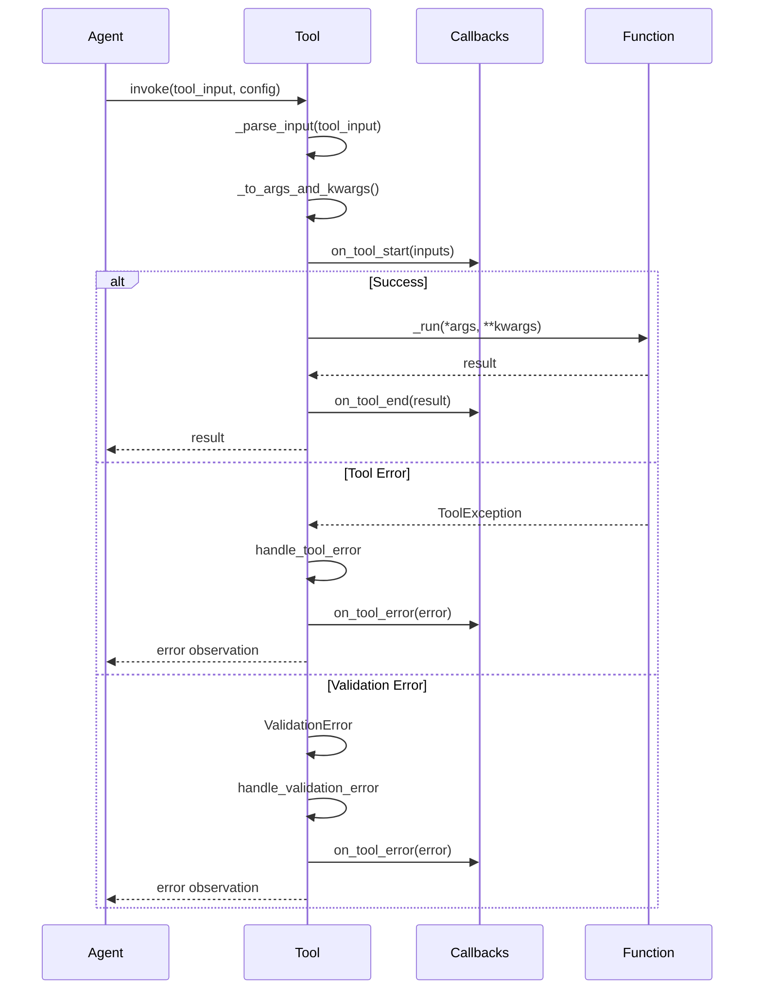

# Tool API Reference

## Overview

Tools are agent-callable functions with a standardized interface that enable LangChain agents to perform specific actions. Tools provide a contract between agents and external functionality, defining how inputs are validated, how functions are executed, and how results are returned.

**Tool Role in Agent Decision Loop:**

Agents use tools to interact with the world. During the agent decision loop, an agent:
1. Observes the current state
2. Reasons about which tool to use
3. Executes the selected tool with appropriate inputs
4. Receives the tool output as an observation
5. Continues reasoning or returns final answer

**When to Use Each Tool Type:**

- **BaseTool**: Use when you need full control over tool behavior, custom validation logic, or complex stateful operations. Requires subclassing and implementing abstract `_run()` method.

- **StructuredTool**: Use when you have an existing function that accepts multiple named arguments and want to quickly convert it to a tool. Best for tools with Pydantic schema validation.

- **@tool decorator**: Use for the simplest tool creation from functions. Ideal for single-argument tools or when you want automatic schema inference from function signatures.

## Tool Execution Flow

The following diagram illustrates the complete execution flow when an agent invokes a tool:



Source: libs/core/langchain_core/tools/base.py:749-850

## BaseTool Class

`BaseTool` is the abstract base class that defines the interface for all LangChain tools. It extends `RunnableSerializable` to provide invoke/ainvoke methods compatible with LCEL (LangChain Expression Language) composition.

Source: libs/core/langchain_core/tools/base.py:390

### Fields

#### name
- **Type**: `str`
- **Required**: Yes
- **Description**: The unique name of the tool that clearly communicates its purpose. This name is used by the LLM to identify and select the tool.
- **Constraints**: Must be unique among all tools provided to an agent.

Source: libs/core/langchain_core/tools/base.py:430

#### description
- **Type**: `str`
- **Required**: Yes
- **Description**: Used to tell the model how/when/why to use the tool. You can provide few-shot examples as a part of the description to guide the LLM's tool selection.
- **Best Practice**: Include specific use cases and example scenarios to improve tool selection accuracy.

Source: libs/core/langchain_core/tools/base.py:432-436

#### args_schema
- **Type**: `Type[BaseModel] | dict[str, Any] | None`
- **Required**: No (default: `None`)
- **Description**: Pydantic model class to validate and parse the tool's input arguments.
- **Valid Values**:
  - A subclass of `pydantic.BaseModel` (v2)
  - A subclass of `pydantic.v1.BaseModel` (if using pydantic v2 with v1 compatibility)
  - A JSON schema dict
  - `None` (schema will be inferred)
- **Validation**: If provided as class annotation, must use `Type[BaseModel]` annotation, not `BaseModel` directly, or `SchemaAnnotationError` will be raised.

Source: libs/core/langchain_core/tools/base.py:438-448, 410-428

#### return_direct
- **Type**: `bool`
- **Required**: No (default: `False`)
- **Description**: Whether to return the tool's output directly. Setting this to `True` means that after the tool is called, the AgentExecutor will stop looping and return the tool output as the final answer.
- **Use Case**: Set to `True` for tools that provide complete final answers (e.g., a search tool that returns the definitive answer to a question).

Source: libs/core/langchain_core/tools/base.py:449-454

#### handle_tool_error
- **Type**: `bool | str | Callable[[ToolException], str] | None`
- **Required**: No (default: `False`)
- **Description**: Controls how `ToolException` errors are handled during tool execution.
- **Valid Values**:
  - `False`: Raises the exception (default)
  - `True`: Sends exception message to LLM as observation
  - `str`: Sends custom error message to LLM
  - `Callable`: Processes exception and returns custom message

Source: libs/core/langchain_core/tools/base.py:474-475

#### handle_validation_error
- **Type**: `bool | str | Callable[[ValidationError], str] | None`
- **Required**: No (default: `False`)
- **Description**: Controls how Pydantic `ValidationError` errors are handled when input validation fails.
- **Valid Values**: Same as `handle_tool_error`

Source: libs/core/langchain_core/tools/base.py:477-480

#### response_format
- **Type**: `Literal["content", "content_and_artifact"]`
- **Required**: No (default: `"content"`)
- **Description**: The tool response format.
- **Valid Values**:
  - `"content"`: Tool output is interpreted as the contents of a `ToolMessage`
  - `"content_and_artifact"`: Tool output must be a two-tuple `(content, artifact)` where content is the string representation and artifact is the raw data structure

Source: libs/core/langchain_core/tools/base.py:482-488

### Methods

#### _run()
```python
@abstractmethod
def _run(self, *args: Any, **kwargs: Any) -> Any:
    """Use the tool."""
```

**Abstract method that must be implemented by all BaseTool subclasses.**

**Args:**
- `*args`: Positional arguments for the tool
- `**kwargs`: Keyword arguments for the tool
- `run_manager` (optional): `CallbackManagerForToolRun | None` - Add this parameter to child implementations to enable tracing

**Returns:**
- `Any`: The result of the tool execution

**Implementation Requirements:**
- Must be implemented in all subclasses
- Should include `run_manager: CallbackManagerForToolRun | None = None` parameter for callback tracing
- Can optionally accept `config: RunnableConfig` parameter for configuration

Source: libs/core/langchain_core/tools/base.py:684-693

#### _arun()
```python
async def _arun(self, *args: Any, **kwargs: Any) -> Any:
    """Use the tool asynchronously."""
```

**Async version of `_run()` for asynchronous tool execution.**

**Args:**
- `*args`: Positional arguments for the tool
- `**kwargs`: Keyword arguments for the tool
- `run_manager` (optional): `AsyncCallbackManagerForToolRun | None` - Add this parameter to child implementations to enable async tracing

**Returns:**
- `Any`: The result of the tool execution

**Default Behavior:**
- If not overridden, delegates to `_run()` on a separate thread using `run_in_executor()`
- Automatically converts sync `run_manager` to async if needed

**When to Override:**
- Override when your tool performs I/O operations that benefit from async/await
- Keep default behavior for CPU-bound operations

Source: libs/core/langchain_core/tools/base.py:695-708

#### invoke()
```python
def invoke(
    self,
    input: str | dict | ToolCall,
    config: RunnableConfig | None = None,
    **kwargs: Any,
) -> Any:
    """Invoke the tool with the given input."""
```

**Runnable interface method for synchronous tool execution.**

**Args:**
- `input`: Tool input as string, dict, or ToolCall object
- `config`: Optional configuration for the run
- `**kwargs`: Additional keyword arguments

**Returns:**
- Tool execution result according to `response_format`

**Usage:**
Use this method when composing tools in LCEL chains or when explicitly invoking from code.

Source: libs/core/langchain_core/tools/base.py (inherited from RunnableSerializable)

#### ainvoke()
```python
async def ainvoke(
    self,
    input: str | dict | ToolCall,
    config: RunnableConfig | None = None,
    **kwargs: Any,
) -> Any:
    """Asynchronously invoke the tool with the given input."""
```

**Runnable interface method for asynchronous tool execution.**

**Args:**
- `input`: Tool input as string, dict, or ToolCall object
- `config`: Optional configuration for the run
- `**kwargs`: Additional keyword arguments

**Returns:**
- Tool execution result according to `response_format`

Source: libs/core/langchain_core/tools/base.py (inherited from RunnableSerializable)

### Properties

#### is_single_input
```python
@property
def is_single_input(self) -> bool:
    """Check if the tool accepts only a single input argument."""
```

**Returns:**
- `True` if the tool has only one input argument, `False` otherwise

Source: libs/core/langchain_core/tools/base.py:514-522

#### args
```python
@property
def args(self) -> dict:
    """Get the tool's input arguments schema."""
```

**Returns:**
- Dictionary containing the tool's argument properties from the JSON schema

Source: libs/core/langchain_core/tools/base.py:524-538

#### tool_call_schema
```python
@property
def tool_call_schema(self) -> ArgsSchema:
    """Get the schema for tool calls, excluding injected arguments."""
```

**Returns:**
- The schema that should be used for tool calls from language models, with injected arguments (like `run_manager`, `callbacks`, `config`) filtered out

Source: libs/core/langchain_core/tools/base.py:540-563

### Complete Example: Custom BaseTool with Validation

```python
from typing import Optional, Type
from pydantic import BaseModel, Field, validator
from langchain_core.tools import BaseTool
from langchain_core.callbacks import CallbackManagerForToolRun

# Define args_schema with Pydantic validation
class CalculatorInput(BaseModel):
    """Input schema for calculator tool."""
    
    operation: str = Field(
        description="The operation to perform: add, subtract, multiply, divide"
    )
    a: float = Field(description="First number")
    b: float = Field(description="Second number")
    
    @validator("operation")
    def validate_operation(cls, v):
        """Validate operation is one of the allowed values."""
        allowed = ["add", "subtract", "multiply", "divide"]
        if v not in allowed:
            raise ValueError(f"operation must be one of {allowed}, got {v}")
        return v
    
    @validator("b")
    def validate_no_division_by_zero(cls, v, values):
        """Prevent division by zero."""
        if values.get("operation") == "divide" and v == 0:
            raise ValueError("Cannot divide by zero")
        return v


class CalculatorTool(BaseTool):
    """Tool for performing basic arithmetic operations."""
    
    name: str = "calculator"
    description: str = """Useful for performing arithmetic calculations.
    Input should specify the operation (add/subtract/multiply/divide) and two numbers.
    
    Example usage:
    - To add 5 and 3: operation='add', a=5, b=3
    - To multiply 10 and 2: operation='multiply', a=10, b=2
    """
    args_schema: Type[BaseModel] = CalculatorInput
    return_direct: bool = False
    
    def _run(
        self,
        operation: str,
        a: float,
        b: float,
        run_manager: Optional[CallbackManagerForToolRun] = None,
    ) -> str:
        """Execute the calculation.
        
        Args:
            operation: The arithmetic operation to perform
            a: First operand
            b: Second operand
            run_manager: Optional callback manager for tracing
            
        Returns:
            String representation of the calculation result
        """
        # Perform the operation
        if operation == "add":
            result = a + b
        elif operation == "subtract":
            result = a - b
        elif operation == "multiply":
            result = a * b
        elif operation == "divide":
            result = a / b
        else:
            # This should never happen due to Pydantic validation
            raise ValueError(f"Unknown operation: {operation}")
        
        # Log progress if callback manager provided
        if run_manager:
            run_manager.on_text(f"Calculating: {a} {operation} {b} = {result}\n")
        
        return f"The result of {a} {operation} {b} is {result}"
    
    async def _arun(
        self,
        operation: str,
        a: float,
        b: float,
        run_manager: Optional[CallbackManagerForToolRun] = None,
    ) -> str:
        """Async version - delegates to sync implementation."""
        # For CPU-bound operations, use the default thread delegation
        return self._run(operation, a, b, run_manager)


# Usage example
if __name__ == "__main__":
    calculator = CalculatorTool()
    
    # Valid invocation
    result = calculator.invoke({
        "operation": "multiply",
        "a": 7,
        "b": 6
    })
    print(result)  # Output: The result of 7 multiply 6 is 42
    
    # Error handling - validation will catch invalid operation
    try:
        result = calculator.invoke({
            "operation": "modulo",  # Invalid operation
            "a": 10,
            "b": 3
        })
    except Exception as e:
        print(f"Validation error caught: {e}")
    
    # Error handling - division by zero caught by validator
    try:
        result = calculator.invoke({
            "operation": "divide",
            "a": 10,
            "b": 0  # Will fail validation
        })
    except Exception as e:
        print(f"Validation error caught: {e}")
```

## StructuredTool Class

`StructuredTool` is a concrete implementation of `BaseTool` designed for tools that accept multiple named arguments. It wraps existing functions (sync or async) and automatically handles the tool interface contract.

Source: libs/core/langchain_core/tools/structured.py:36

### Key Fields

#### func
- **Type**: `Callable[..., Any] | None`
- **Required**: One of `func` or `coroutine` must be provided
- **Description**: The synchronous function to run when the tool is called
- **Constraints**: Function signature must match the provided `args_schema`

Source: libs/core/langchain_core/tools/structured.py:44

#### coroutine
- **Type**: `Callable[..., Awaitable[Any]] | None`
- **Required**: One of `func` or `coroutine` must be provided
- **Description**: The asynchronous version of the function
- **Constraints**: Coroutine signature must match the provided `args_schema`

Source: libs/core/langchain_core/tools/structured.py:46

#### args_schema
- **Type**: `Type[BaseModel] | dict`
- **Required**: Yes (for StructuredTool)
- **Description**: The tool's input argument schema. Unlike BaseTool, this is required for StructuredTool.

Source: libs/core/langchain_core/tools/structured.py:40-42

### Class Method: from_function()

```python
@classmethod
def from_function(
    cls,
    func: Callable | None = None,
    coroutine: Callable[..., Awaitable[Any]] | None = None,
    name: str | None = None,
    description: str | None = None,
    return_direct: bool = False,
    args_schema: ArgsSchema | None = None,
    infer_schema: bool = True,
    *,
    response_format: Literal["content", "content_and_artifact"] = "content",
    parse_docstring: bool = False,
    error_on_invalid_docstring: bool = False,
    **kwargs: Any,
) -> StructuredTool:
    """Create tool from a given function."""
```

**Factory method to create a StructuredTool from a function.**

**Args:**
- `func`: The synchronous function from which to create a tool
- `coroutine`: The async function from which to create a tool
- `name`: The name of the tool. Defaults to the function name
- `description`: The description of the tool. Defaults to the function docstring
- `return_direct`: Whether to return the result directly or as a callback
- `args_schema`: The schema of the tool's input arguments. If None and `infer_schema=True`, schema is inferred from function signature
- `infer_schema`: Whether to infer the schema from the function's signature
- `response_format`: The tool response format (`"content"` or `"content_and_artifact"`)
- `parse_docstring`: If `True` and `infer_schema=True`, will parse parameter descriptions from Google-style function docstrings
- `error_on_invalid_docstring`: If `parse_docstring=True`, whether to raise `ValueError` on invalid Google-style docstrings
- `**kwargs`: Additional arguments to pass to the tool constructor

**Returns:**
- `StructuredTool`: The created tool instance

**Raises:**
- `ValueError`: If neither function nor coroutine is provided
- `ValueError`: If the function does not have a docstring and description is not provided
- `TypeError`: If the `args_schema` is not a `BaseModel` subclass or dict

Source: libs/core/langchain_core/tools/structured.py:125-182

### Complete Example: StructuredTool from Function

```python
from typing import Optional
from pydantic import BaseModel, Field
from langchain_core.tools import StructuredTool
from langchain_core.callbacks import CallbackManagerForToolRun
import asyncio

# Define the args schema
class SearchInput(BaseModel):
    """Input for search tool."""
    query: str = Field(description="The search query string")
    max_results: int = Field(default=10, description="Maximum number of results to return")
    filter_domain: Optional[str] = Field(
        default=None, 
        description="Optional domain to filter results (e.g., 'wikipedia.org')"
    )

# Define sync function
def search_function(
    query: str,
    max_results: int = 10,
    filter_domain: Optional[str] = None,
    callbacks: Optional[CallbackManagerForToolRun] = None,
) -> str:
    """Search the web for information.
    
    Args:
        query: The search query string
        max_results: Maximum number of results to return
        filter_domain: Optional domain to filter results
        callbacks: Optional callback manager for tracing
        
    Returns:
        Formatted search results
    """
    # Simulate search operation
    results = []
    for i in range(min(max_results, 3)):  # Simulate up to 3 results
        domain = filter_domain if filter_domain else f"example{i}.com"
        results.append(f"Result {i+1}: Content from {domain} about '{query}'")
    
    if callbacks:
        callbacks.on_text(f"Found {len(results)} results for '{query}'\n")
    
    return "\n".join(results)

# Define async function
async def async_search_function(
    query: str,
    max_results: int = 10,
    filter_domain: Optional[str] = None,
    callbacks: Optional[CallbackManagerForToolRun] = None,
) -> str:
    """Async version of search function."""
    # Simulate async I/O operation
    await asyncio.sleep(0.1)
    
    results = []
    for i in range(min(max_results, 3)):
        domain = filter_domain if filter_domain else f"example{i}.com"
        results.append(f"Result {i+1}: Async content from {domain} about '{query}'")
    
    if callbacks:
        callbacks.on_text(f"Async search found {len(results)} results for '{query}'\n")
    
    return "\n".join(results)

# Create StructuredTool with both sync and async functions
search_tool = StructuredTool.from_function(
    func=search_function,
    coroutine=async_search_function,
    name="web_search",
    description="Search the web for information on any topic. Useful when you need current information or facts about a specific subject.",
    args_schema=SearchInput,
    return_direct=False,
)

# Usage example
if __name__ == "__main__":
    # Synchronous invocation
    result = search_tool.invoke({
        "query": "LangChain tools",
        "max_results": 5,
        "filter_domain": "langchain.com"
    })
    print("Sync result:")
    print(result)
    print()
    
    # Asynchronous invocation
    async def async_example():
        result = await search_tool.ainvoke({
            "query": "AI agents",
            "max_results": 3
        })
        print("Async result:")
        print(result)
    
    asyncio.run(async_example())
```

## @tool Decorator

The `@tool` decorator provides the simplest way to convert functions into tools. It automatically infers the schema from function signatures and supports both decorator syntax and function wrapper usage.

Source: libs/core/langchain_core/tools/convert.py:72

### Decorator Signature

```python
def tool(
    name_or_callable: str | Callable | None = None,
    runnable: Runnable | None = None,
    *args: Any,
    description: str | None = None,
    return_direct: bool = False,
    args_schema: ArgsSchema | None = None,
    infer_schema: bool = True,
    response_format: Literal["content", "content_and_artifact"] = "content",
    parse_docstring: bool = False,
    error_on_invalid_docstring: bool = True,
) -> BaseTool | Callable[[Callable | Runnable], BaseTool]:
    """Make tools out of Python functions."""
```

### Parameters

#### name_or_callable
- **Type**: `str | Callable | None`
- **Default**: `None`
- **Description**: Optional name of the tool or the callable to be converted. When used as a decorator without arguments, this receives the decorated function automatically.

#### description
- **Type**: `str | None`
- **Default**: `None`
- **Description**: Optional description for the tool. 
- **Precedence** (highest to lowest):
  1. `description` argument (used even if docstring and/or `args_schema` are provided)
  2. Tool function docstring (used even if `args_schema` is provided)
  3. `args_schema` description (used only if description/docstring are not provided)

#### return_direct
- **Type**: `bool`
- **Default**: `False`
- **Description**: Whether to return directly from the tool rather than continuing the agent loop

#### args_schema
- **Type**: `ArgsSchema | None`
- **Default**: `None`
- **Description**: Optional argument schema for user to specify. If not provided and `infer_schema=True`, schema is inferred from function signature.

#### infer_schema
- **Type**: `bool`
- **Default**: `True`
- **Description**: Whether to infer the schema of the arguments from the function's signature. This also makes the resultant tool accept a dictionary input to its `run()` function.

#### response_format
- **Type**: `Literal["content", "content_and_artifact"]`
- **Default**: `"content"`
- **Description**: The tool response format. If `"content"`, the output is interpreted as the contents of a `ToolMessage`. If `"content_and_artifact"`, the output is expected to be a two-tuple `(content, artifact)`.

#### parse_docstring
- **Type**: `bool`
- **Default**: `False`
- **Description**: If `infer_schema` and `parse_docstring` are both `True`, will attempt to parse parameter descriptions from Google-style function docstrings. The parsed descriptions are added to the generated `args_schema`.

#### error_on_invalid_docstring
- **Type**: `bool`
- **Default**: `True`
- **Description**: If `parse_docstring=True`, whether to raise `ValueError` on invalid Google-style docstrings. A docstring is invalid if it contains arguments not in the function signature or cannot be parsed into summary and "Args:" blocks.

Source: libs/core/langchain_core/tools/convert.py:86-115

### Usage Patterns

#### Pattern 1: Simple Decorator (No Arguments)

```python
from langchain_core.tools import tool

@tool
def multiply(a: int, b: int) -> int:
    """Multiply two numbers together."""
    return a * b

# Tool name: "multiply"
# Tool description: "Multiply two numbers together."
# Args schema: Inferred from function signature
```

#### Pattern 2: Decorator with Parameters

```python
@tool(return_direct=True)
def search_wikipedia(query: str) -> str:
    """Search Wikipedia for information."""
    # Implementation here
    return f"Wikipedia results for: {query}"

# Tool will return result directly, stopping agent loop
```

#### Pattern 3: Function Wrapper

```python
def my_function(x: int, y: int) -> int:
    """Add two numbers."""
    return x + y

my_tool = tool(my_function)
# or with custom name
my_tool = tool("adder", my_function, description="Custom description")
```

#### Pattern 4: Google-style Docstring Parsing

```python
@tool(parse_docstring=True)
def advanced_search(query: str, depth: int, filters: str) -> str:
    """Perform an advanced search with multiple parameters.
    
    Args:
        query: The search query to execute
        depth: How deep to search (1-10, where 10 is deepest)
        filters: Comma-separated list of filters to apply
        
    Returns:
        Formatted search results
    """
    return f"Searching for '{query}' with depth {depth} and filters: {filters}"

# The args_schema will include parameter descriptions from docstring
print(advanced_search.args_schema.model_json_schema())
# Output includes descriptions for each parameter
```

#### Pattern 5: Content and Artifact Response Format

```python
@tool(response_format="content_and_artifact")
def fetch_data(url: str) -> tuple[str, dict]:
    """Fetch data from a URL.
    
    Returns tuple of (summary, full_data)
    """
    # Simulate data fetch
    full_data = {
        "url": url,
        "status": 200,
        "headers": {"content-type": "application/json"},
        "body": {"key": "value"}
    }
    summary = f"Successfully fetched data from {url}"
    
    return summary, full_data

# When invoked, returns ToolMessage with both content and artifact
result = fetch_data.invoke({"url": "https://api.example.com/data"})
# result.content = "Successfully fetched data from https://api.example.com/data"
# result.artifact = {"url": "...", "status": 200, ...}
```

Source: libs/core/langchain_core/tools/convert.py:136-189

## Tool Interface Contracts

### Required Fields

All tools must provide the following fields to function correctly with LangChain agents:

#### name (Required)
- **Must**: Be a unique identifier among all tools provided to an agent
- **Should**: Clearly indicate the tool's purpose
- **Format**: Lowercase with underscores (e.g., `web_search`, `calculator`, `file_reader`)
- **Used By**: LLM to identify and select the appropriate tool for a task

#### description (Required)
- **Must**: Explain when and how the LLM should use the tool
- **Should**: Include few-shot examples showing typical usage patterns
- **Best Practice**: Be specific about input requirements and expected outputs
- **Format**: Clear, concise text optimized for LLM understanding
- **Impact**: Directly affects tool selection accuracy by the LLM

Example of effective description:
```python
description = """Search the web for current information on any topic.

Use this tool when you need:
- Recent news or events
- Current facts that may change over time
- Information not in your training data

Input: A clear, specific search query
Output: Top search results with summaries

Example queries:
- "latest developments in quantum computing 2024"
- "current weather in San Francisco"
- "recent news about artificial intelligence"
"""
```

#### args_schema (Conditionally Required)
- **Must**: Be either:
  - A subclass of `pydantic.BaseModel` (v2)
  - A subclass of `pydantic.v1.BaseModel` (if using pydantic 2 with v1 namespace)
  - A JSON schema dict
- **Type Annotation**: When annotating in a `BaseTool` subclass, must use `Type[BaseModel]`, not `BaseModel`
- **Validation**: Incorrect annotation raises `SchemaAnnotationError` on class definition

**Example of correct annotation:**
```python
from typing import Type
from pydantic import BaseModel, Field
from langchain_core.tools import BaseTool

class MyToolInput(BaseModel):
    query: str = Field(description="The search query")
    limit: int = Field(default=10, description="Max results")

class MyTool(BaseTool):
    name: str = "my_tool"
    description: str = "My tool description"
    args_schema: Type[BaseModel] = MyToolInput  # Correct: Type[BaseModel]
    # NOT: args_schema: BaseModel = MyToolInput  # Wrong: Raises SchemaAnnotationError
    
    def _run(self, query: str, limit: int = 10) -> str:
        return f"Results for {query}"
```

Source: libs/core/langchain_core/tools/base.py:410-428

### Implementation Requirements

#### _run() Method (Required for BaseTool)
- **Must**: Be implemented in all `BaseTool` subclasses (abstract method)
- **Signature**: Accept `*args` and `**kwargs`
- **Optional Parameters**:
  - `run_manager: CallbackManagerForToolRun | None = None` - for tracing/logging
  - `config: RunnableConfig | None = None` - for configuration
- **Return**: Any type appropriate for the tool's purpose
- **Thread Safety**: Should be thread-safe if tool may be used in concurrent contexts

Source: libs/core/langchain_core/tools/base.py:684-693

#### _arun() Method (Optional)
- **Default Behavior**: If not implemented, delegates to `_run()` on a separate thread
- **When to Implement**: When tool performs I/O operations that benefit from async/await
- **Signature**: Same as `_run()` but async
- **Optional Parameters**:
  - `run_manager: AsyncCallbackManagerForToolRun | None = None` - for async tracing
  - `config: RunnableConfig | None = None` - for configuration
- **Return**: Same as `_run()`

Source: libs/core/langchain_core/tools/base.py:695-708

### Callback Manager Parameters

Tools can optionally accept callback managers for integration with LangChain's tracing and logging system:

```python
from langchain_core.callbacks import CallbackManagerForToolRun, AsyncCallbackManagerForToolRun

def _run(
    self, 
    query: str,
    run_manager: CallbackManagerForToolRun | None = None
) -> str:
    """Execute tool with optional tracing."""
    if run_manager:
        # Log progress
        run_manager.on_text(f"Searching for: {query}\n")
        
        # Get child callback for sub-operations
        child_callbacks = run_manager.get_child()
    
    # Tool implementation
    result = perform_search(query)
    
    if run_manager:
        run_manager.on_text(f"Found {len(result)} results\n")
    
    return result
```

**Key Points:**
- The `run_manager` parameter name is special and automatically injected by the tool framework
- Similarly, `callbacks` parameter is automatically populated
- These parameters are filtered from the tool schema presented to the LLM
- They enable integration with LangChain's observability system

Source: libs/core/langchain_core/tools/base.py:685-710

## Exception Handling

### ToolException

`ToolException` is a special exception class that tools can raise to signal errors without stopping the agent execution loop. The exception handling behavior is controlled by the `handle_tool_error` configuration.

Source: libs/core/langchain_core/tools/base.py:377-384

#### Usage Pattern

```python
from langchain_core.tools import BaseTool, ToolException

class MyTool(BaseTool):
    name: str = "my_tool"
    description: str = "Example tool"
    handle_tool_error: bool = True  # Send error message to LLM as observation
    
    def _run(self, query: str) -> str:
        if not query:
            raise ToolException("Query cannot be empty")
        
        try:
            result = risky_operation(query)
            return result
        except ExternalAPIError as e:
            # Convert external errors to ToolException
            raise ToolException(f"External API failed: {str(e)}")
```

#### handle_tool_error Configuration

**False (default):**
```python
handle_tool_error = False
# Behavior: Exception is raised normally, stopping execution
```

**True:**
```python
handle_tool_error = True
# Behavior: Exception message is sent to LLM as observation
# LLM receives: "Tool 'my_tool' failed with error: Query cannot be empty"
```

**Custom String:**
```python
handle_tool_error = "An error occurred while using this tool. Please try a different approach."
# Behavior: Custom message is sent to LLM instead of actual error
```

**Custom Callable:**
```python
def format_error(error: ToolException) -> str:
    """Custom error formatting for LLM."""
    return f"Tool failed. Reason: {error}. Suggestion: Try simplifying your query."

handle_tool_error = format_error
# Behavior: Callable processes the exception and returns custom message
```

### ValidationError

Pydantic `ValidationError` is raised when tool input fails validation against the `args_schema`. Handling is controlled by the `handle_validation_error` configuration.

#### Usage Pattern

```python
from pydantic import BaseModel, Field, validator
from langchain_core.tools import BaseTool

class SearchInput(BaseModel):
    query: str = Field(..., min_length=1, max_length=500)
    max_results: int = Field(default=10, ge=1, le=100)
    
    @validator("query")
    def validate_query(cls, v):
        if "prohibited_word" in v.lower():
            raise ValueError("Query contains prohibited content")
        return v

class SearchTool(BaseTool):
    name: str = "search"
    description: str = "Search for information"
    args_schema: Type[BaseModel] = SearchInput
    handle_validation_error: bool = True  # Send validation errors to LLM
    
    def _run(self, query: str, max_results: int = 10) -> str:
        # If we get here, input is validated
        return f"Results for '{query}'"

# Usage
tool = SearchTool()

# This will trigger ValidationError (query too long)
# With handle_validation_error=True, error message sent to LLM
# With handle_validation_error=False, exception raised
result = tool.invoke({
    "query": "a" * 600,  # Exceeds max_length=500
    "max_results": 10
})
```

#### handle_validation_error Configuration

Configuration options are identical to `handle_tool_error`:
- `False`: Raises `ValidationError` (default)
- `True`: Sends validation error message to LLM as observation
- `str`: Sends custom error message to LLM
- `Callable[[ValidationError], str]`: Processes error and returns custom message

**Example with Custom Handler:**
```python
from pydantic import ValidationError

def friendly_validation_error(error: ValidationError) -> str:
    """Convert validation error to friendly message."""
    errors = error.errors()
    messages = []
    for err in errors:
        field = ".".join(str(loc) for loc in err["loc"])
        msg = err["msg"]
        messages.append(f"- {field}: {msg}")
    
    return "Input validation failed:\n" + "\n".join(messages) + "\n\nPlease correct the input and try again."

class MyTool(BaseTool):
    # ...
    handle_validation_error = friendly_validation_error
```

Source: libs/core/langchain_core/tools/base.py:477-480

### Error Handling Best Practices

1. **Use ToolException for Expected Errors**: When a tool encounters expected failure conditions (e.g., resource not found, rate limit), raise `ToolException` to allow agent recovery.

2. **Enable Error Handling in Production**: Set `handle_tool_error=True` in production to prevent single tool failures from crashing the entire agent.

3. **Provide Actionable Error Messages**: When using custom error handlers, include suggestions for how the agent can adjust its approach.

4. **Validate Early**: Use Pydantic validators in `args_schema` to catch invalid inputs before tool execution.

5. **Log Errors for Debugging**: Use `run_manager` callbacks to log errors for observability while still allowing agent to recover.

```python
def _run(self, query: str, run_manager=None) -> str:
    try:
        result = external_api_call(query)
        return result
    except APIError as e:
        # Log for debugging
        if run_manager:
            run_manager.on_text(f"API Error: {str(e)}\n", verbose=True)
        
        # Allow agent to recover
        raise ToolException(f"Unable to complete request: {str(e)}")
```

## Response Formats

Tools support two response formats that control how tool outputs are structured and presented to the agent.

### response_format="content" (Default)

In content-only format, the tool's return value is interpreted directly as the content of a `ToolMessage`.

**Usage:**
```python
from langchain_core.tools import tool

@tool
def get_weather(city: str) -> str:
    """Get weather for a city."""
    return f"The weather in {city} is sunny, 72°F"

result = get_weather.invoke({"city": "San Francisco"})
# result is a string: "The weather in San Francisco is sunny, 72°F"
```

**When to Use:**
- Simple tools with text output
- Tools where the complete result can be represented as a string
- Most common use case

Source: libs/core/langchain_core/tools/base.py:482-488

### response_format="content_and_artifact"

In content-and-artifact format, the tool must return a two-tuple `(content, artifact)` where:
- `content` (str): Human-readable summary or representation
- `artifact` (Any): Complete structured data, raw response, or additional metadata

**Usage:**
```python
from typing import Any
from langchain_core.tools import tool

@tool(response_format="content_and_artifact")
def fetch_user_data(user_id: int) -> tuple[str, dict[str, Any]]:
    """Fetch user data from database.
    
    Returns:
        Tuple of (summary, full_user_data)
    """
    # Simulate database fetch
    user_data = {
        "id": user_id,
        "name": "John Doe",
        "email": "john@example.com",
        "created_at": "2024-01-15",
        "preferences": {"theme": "dark", "notifications": True},
        "activity_log": [/* large list */]
    }
    
    # Create concise summary for LLM
    summary = f"User {user_data['name']} (ID: {user_id}), email: {user_data['email']}, " \
              f"account created: {user_data['created_at']}"
    
    # Return both summary and complete data
    return summary, user_data

result = fetch_user_data.invoke({"user_id": 42})
# result.content = "User John Doe (ID: 42), email: john@example.com, account created: 2024-01-15"
# result.artifact = {"id": 42, "name": "John Doe", ...}  # Complete data structure
```

**When to Use:**
- Tools that return large or complex data structures
- When you want to provide a summary for the LLM but preserve full data
- API wrappers where raw response should be preserved
- Tools where downstream code needs access to structured data

**Benefits:**
1. **LLM Efficiency**: LLM receives concise summary, reducing token usage
2. **Data Preservation**: Full data available for programmatic access
3. **Flexibility**: Downstream code can access artifact for detailed processing

**Example Use Case - Web Scraping:**
```python
@tool(response_format="content_and_artifact")
def scrape_page(url: str) -> tuple[str, dict]:
    """Scrape a web page and return summary + raw data."""
    # Simulate scraping
    raw_html = "<html>...</html>"  # Full HTML content
    parsed_data = {
        "title": "Example Page",
        "headings": ["Section 1", "Section 2"],
        "paragraphs": ["First paragraph...", "Second paragraph..."],
        "links": ["https://example.com/link1", "https://example.com/link2"],
        "images": ["image1.jpg", "image2.jpg"],
        "metadata": {"author": "Jane Doe", "date": "2024-01-15"},
        "raw_html": raw_html
    }
    
    # Create summary for LLM
    summary = f"Page '{parsed_data['title']}' contains {len(parsed_data['paragraphs'])} " \
              f"paragraphs, {len(parsed_data['links'])} links, and {len(parsed_data['images'])} images. " \
              f"Main sections: {', '.join(parsed_data['headings'])}"
    
    return summary, parsed_data

# LLM sees the summary, but code can access parsed_data.artifact for details
```

Source: libs/core/langchain_core/tools/base.py:482-488

## Complete Examples

### Example 1: Custom BaseTool with Validation

This example demonstrates a production-ready tool with comprehensive input validation, error handling, and callback integration.

```python
from typing import Optional, Type, Literal
from pydantic import BaseModel, Field, validator
from langchain_core.tools import BaseTool, ToolException
from langchain_core.callbacks import CallbackManagerForToolRun
import re

class FileOperationInput(BaseModel):
    """Input schema for file operation tool."""
    
    operation: Literal["read", "write", "append", "delete"] = Field(
        description="The file operation to perform"
    )
    filepath: str = Field(
        description="Path to the file (must be in allowed directory)"
    )
    content: Optional[str] = Field(
        default=None,
        description="Content to write/append (required for write/append operations)"
    )
    
    @validator("filepath")
    def validate_filepath(cls, v):
        """Ensure filepath is safe and in allowed directory."""
        # Prevent directory traversal
        if ".." in v or v.startswith("/"):
            raise ValueError("Filepath must be relative and cannot contain '..'")
        
        # Ensure safe characters
        if not re.match(r'^[a-zA-Z0-9_/\-\.]+$', v):
            raise ValueError("Filepath contains invalid characters")
        
        return v
    
    @validator("content")
    def validate_content_required(cls, v, values):
        """Ensure content is provided for write/append operations."""
        operation = values.get("operation")
        if operation in ("write", "append") and not v:
            raise ValueError(f"content is required for '{operation}' operation")
        return v


class FileOperationTool(BaseTool):
    """Tool for safe file operations within a sandboxed directory."""
    
    name: str = "file_operations"
    description: str = """Perform file operations (read, write, append, delete) on files.
    
    Use this tool when you need to:
    - Read the contents of a file
    - Write new content to a file
    - Append content to an existing file
    - Delete a file
    
    All operations are performed in a sandboxed directory for safety.
    
    Example usage:
    - Read: operation='read', filepath='data/notes.txt'
    - Write: operation='write', filepath='output/result.txt', content='Hello World'
    - Append: operation='append', filepath='logs/app.log', content='New log entry'
    - Delete: operation='delete', filepath='temp/cache.tmp'
    """
    args_schema: Type[BaseModel] = FileOperationInput
    return_direct: bool = False
    handle_tool_error: bool = True
    handle_validation_error: bool = True
    
    # Configuration
    base_directory: str = "./sandbox"
    max_file_size: int = 1_000_000  # 1MB
    
    def _run(
        self,
        operation: str,
        filepath: str,
        content: Optional[str] = None,
        run_manager: Optional[CallbackManagerForToolRun] = None,
    ) -> str:
        """Execute the file operation.
        
        Args:
            operation: The operation to perform
            filepath: Path to the file (relative to base_directory)
            content: Content for write/append operations
            run_manager: Optional callback manager for tracing
            
        Returns:
            String describing the operation result
            
        Raises:
            ToolException: If operation fails or file constraints violated
        """
        import os
        from pathlib import Path
        
        # Construct safe absolute path
        full_path = Path(self.base_directory) / filepath
        
        # Log operation start
        if run_manager:
            run_manager.on_text(
                f"File operation: {operation} on {filepath}\n",
                verbose=True
            )
        
        try:
            if operation == "read":
                # Check file exists
                if not full_path.exists():
                    raise ToolException(f"File not found: {filepath}")
                
                # Check file size
                if full_path.stat().st_size > self.max_file_size:
                    raise ToolException(
                        f"File too large (max {self.max_file_size} bytes): {filepath}"
                    )
                
                # Read file
                content_read = full_path.read_text(encoding="utf-8")
                
                if run_manager:
                    run_manager.on_text(
                        f"Read {len(content_read)} characters from {filepath}\n"
                    )
                
                return f"File contents of {filepath}:\n{content_read}"
            
            elif operation == "write":
                # Ensure directory exists
                full_path.parent.mkdir(parents=True, exist_ok=True)
                
                # Check content size
                if len(content) > self.max_file_size:
                    raise ToolException(
                        f"Content too large (max {self.max_file_size} bytes)"
                    )
                
                # Write file
                full_path.write_text(content, encoding="utf-8")
                
                if run_manager:
                    run_manager.on_text(
                        f"Wrote {len(content)} characters to {filepath}\n"
                    )
                
                return f"Successfully wrote {len(content)} characters to {filepath}"
            
            elif operation == "append":
                # Ensure directory and file exist
                full_path.parent.mkdir(parents=True, exist_ok=True)
                
                # Check resulting size
                existing_size = full_path.stat().st_size if full_path.exists() else 0
                if existing_size + len(content) > self.max_file_size:
                    raise ToolException(
                        f"Resulting file would exceed max size ({self.max_file_size} bytes)"
                    )
                
                # Append to file
                with full_path.open("a", encoding="utf-8") as f:
                    f.write(content)
                
                if run_manager:
                    run_manager.on_text(
                        f"Appended {len(content)} characters to {filepath}\n"
                    )
                
                return f"Successfully appended {len(content)} characters to {filepath}"
            
            elif operation == "delete":
                # Check file exists
                if not full_path.exists():
                    raise ToolException(f"File not found: {filepath}")
                
                # Delete file
                full_path.unlink()
                
                if run_manager:
                    run_manager.on_text(f"Deleted {filepath}\n")
                
                return f"Successfully deleted {filepath}"
            
            else:
                # This should never happen due to Pydantic validation
                raise ToolException(f"Unknown operation: {operation}")
                
        except ToolException:
            # Re-raise ToolException as-is
            raise
        except Exception as e:
            # Convert unexpected errors to ToolException
            error_msg = f"File operation failed: {str(e)}"
            if run_manager:
                run_manager.on_text(f"ERROR: {error_msg}\n", verbose=True)
            raise ToolException(error_msg)


# Usage example
if __name__ == "__main__":
    import os
    from pathlib import Path
    
    # Setup sandbox directory
    sandbox_dir = Path("./sandbox")
    sandbox_dir.mkdir(exist_ok=True)
    
    # Create tool
    file_tool = FileOperationTool()
    
    # Example 1: Write a file
    result = file_tool.invoke({
        "operation": "write",
        "filepath": "test/example.txt",
        "content": "Hello, this is a test file!"
    })
    print(result)
    # Output: Successfully wrote 28 characters to test/example.txt
    
    # Example 2: Read the file
    result = file_tool.invoke({
        "operation": "read",
        "filepath": "test/example.txt"
    })
    print(result)
    # Output: File contents of test/example.txt:
    #         Hello, this is a test file!
    
    # Example 3: Append to file
    result = file_tool.invoke({
        "operation": "append",
        "filepath": "test/example.txt",
        "content": "\nAppended line."
    })
    print(result)
    # Output: Successfully appended 16 characters to test/example.txt
    
    # Example 4: Error handling - invalid filepath
    try:
        result = file_tool.invoke({
            "operation": "read",
            "filepath": "../etc/passwd"  # Directory traversal attempt
        })
    except Exception as e:
        print(f"Caught validation error: {e}")
    
    # Example 5: Error handling - missing content
    try:
        result = file_tool.invoke({
            "operation": "write",
            "filepath": "test/empty.txt"
            # Missing content parameter
        })
    except Exception as e:
        print(f"Caught validation error: {e}")
```

### Example 2: StructuredTool with Async Support

This example shows a tool that performs async I/O operations with proper error handling and retry logic.

```python
from typing import Optional, List
from pydantic import BaseModel, Field, HttpUrl
from langchain_core.tools import StructuredTool
from langchain_core.callbacks import CallbackManagerForToolRun, AsyncCallbackManagerForToolRun
import asyncio
import aiohttp
from datetime import datetime

class WebFetchInput(BaseModel):
    """Input for web fetching tool."""
    url: HttpUrl = Field(description="The URL to fetch")
    timeout: int = Field(
        default=10,
        ge=1,
        le=60,
        description="Request timeout in seconds (1-60)"
    )
    headers: Optional[dict[str, str]] = Field(
        default=None,
        description="Optional HTTP headers to include"
    )

def sync_fetch_url(
    url: str,
    timeout: int = 10,
    headers: Optional[dict[str, str]] = None,
    callbacks: Optional[CallbackManagerForToolRun] = None,
) -> str:
    """Synchronous URL fetching (blocking)."""
    import requests
    
    if callbacks:
        callbacks.on_text(f"Fetching URL (sync): {url}\n")
    
    try:
        response = requests.get(
            url,
            timeout=timeout,
            headers=headers or {}
        )
        response.raise_for_status()
        
        result = f"Status: {response.status_code}\n"
        result += f"Content-Type: {response.headers.get('content-type', 'unknown')}\n"
        result += f"Content-Length: {len(response.text)} characters\n"
        result += f"Fetched at: {datetime.now().isoformat()}"
        
        if callbacks:
            callbacks.on_text(f"Successfully fetched {len(response.text)} characters\n")
        
        return result
        
    except requests.RequestException as e:
        error_msg = f"Failed to fetch {url}: {str(e)}"
        if callbacks:
            callbacks.on_text(f"ERROR: {error_msg}\n")
        return error_msg

async def async_fetch_url(
    url: str,
    timeout: int = 10,
    headers: Optional[dict[str, str]] = None,
    callbacks: Optional[AsyncCallbackManagerForToolRun] = None,
) -> str:
    """Asynchronous URL fetching with retry logic."""
    
    if callbacks:
        await callbacks.on_text_async(f"Fetching URL (async): {url}\n")
    
    max_retries = 3
    retry_delay = 1
    
    for attempt in range(max_retries):
        try:
            async with aiohttp.ClientSession() as session:
                async with session.get(
                    str(url),
                    timeout=aiohttp.ClientTimeout(total=timeout),
                    headers=headers or {}
                ) as response:
                    response.raise_for_status()
                    content = await response.text()
                    
                    result = f"Status: {response.status}\n"
                    result += f"Content-Type: {response.headers.get('content-type', 'unknown')}\n"
                    result += f"Content-Length: {len(content)} characters\n"
                    result += f"Fetched at: {datetime.now().isoformat()}"
                    result += f"\nAttempts: {attempt + 1}"
                    
                    if callbacks:
                        await callbacks.on_text_async(
                            f"Successfully fetched {len(content)} characters on attempt {attempt + 1}\n"
                        )
                    
                    return result
                    
        except aiohttp.ClientError as e:
            if attempt < max_retries - 1:
                if callbacks:
                    await callbacks.on_text_async(
                        f"Attempt {attempt + 1} failed, retrying in {retry_delay}s...\n"
                    )
                await asyncio.sleep(retry_delay)
                retry_delay *= 2  # Exponential backoff
            else:
                error_msg = f"Failed to fetch {url} after {max_retries} attempts: {str(e)}"
                if callbacks:
                    await callbacks.on_text_async(f"ERROR: {error_msg}\n")
                return error_msg
    
    return f"Failed to fetch {url}"

# Create the tool
web_fetch_tool = StructuredTool.from_function(
    func=sync_fetch_url,
    coroutine=async_fetch_url,
    name="web_fetch",
    description="""Fetch content from a web URL with timeout and custom headers support.
    
    Use this tool to:
    - Download web pages
    - Access web APIs
    - Verify URL accessibility
    - Retrieve HTTP headers and status
    
    Features:
    - Automatic retry with exponential backoff (async only)
    - Configurable timeout
    - Custom HTTP headers
    - Error handling
    
    Example:
    url='https://example.com', timeout=15, headers={'User-Agent': 'MyBot'}
    """,
    args_schema=WebFetchInput,
    return_direct=False,
)

# Usage examples
if __name__ == "__main__":
    # Synchronous usage
    print("=== Synchronous Fetch ===")
    result = web_fetch_tool.invoke({
        "url": "https://www.example.com",
        "timeout": 10
    })
    print(result)
    print()
    
    # Asynchronous usage
    async def async_example():
        print("=== Asynchronous Fetch ===")
        result = await web_fetch_tool.ainvoke({
            "url": "https://www.example.com",
            "timeout": 10,
            "headers": {"User-Agent": "LangChain-Tool/1.0"}
        })
        print(result)
        print()
        
        # Multiple concurrent requests
        print("=== Concurrent Fetches ===")
        urls = [
            "https://www.example.com",
            "https://www.python.org",
            "https://www.github.com",
        ]
        
        tasks = [
            web_fetch_tool.ainvoke({"url": url, "timeout": 15})
            for url in urls
        ]
        
        results = await asyncio.gather(*tasks)
        for url, result in zip(urls, results):
            print(f"\n{url}:")
            print(result)
    
    asyncio.run(async_example())
```

### Example 3: @tool Decorator with Google-style Docstring

This example demonstrates using the `@tool` decorator with docstring parsing to automatically generate argument descriptions.

```python
from typing import List, Optional
from langchain_core.tools import tool
from datetime import datetime, timedelta
import json

@tool(parse_docstring=True)
def analyze_text_sentiment(
    text: str,
    language: str = "en",
    include_keywords: bool = False
) -> str:
    """Analyze the sentiment of a given text.
    
    This tool performs sentiment analysis on input text and returns
    a sentiment score with optional keyword extraction.
    
    Args:
        text: The text to analyze for sentiment. Should be at least 10 characters long.
        language: The language code of the text (e.g., 'en' for English, 'es' for Spanish).
            Defaults to 'en'.
        include_keywords: Whether to include keyword extraction in the analysis.
            Set to True to get the top keywords that influenced the sentiment.
    
    Returns:
        JSON string containing sentiment analysis results including score,
        classification, and optionally top keywords.
    
    Examples:
        >>> analyze_text_sentiment("I love this product! It's amazing!")
        >>> analyze_text_sentiment("Este producto es terrible", language="es")
        >>> analyze_text_sentiment("Great quality", include_keywords=True)
    """
    # Simulate sentiment analysis
    text_lower = text.lower()
    
    # Simple sentiment scoring (mock implementation)
    positive_words = ["love", "amazing", "great", "excellent", "wonderful", "fantastic"]
    negative_words = ["hate", "terrible", "awful", "bad", "poor", "horrible"]
    
    positive_count = sum(1 for word in positive_words if word in text_lower)
    negative_count = sum(1 for word in negative_words if word in text_lower)
    
    # Calculate score (-1 to 1)
    total = positive_count + negative_count
    if total == 0:
        score = 0.0
    else:
        score = (positive_count - negative_count) / total
    
    # Classify sentiment
    if score > 0.2:
        classification = "positive"
    elif score < -0.2:
        classification = "negative"
    else:
        classification = "neutral"
    
    # Build result
    result = {
        "text_preview": text[:50] + "..." if len(text) > 50 else text,
        "language": language,
        "sentiment_score": round(score, 2),
        "classification": classification,
        "confidence": round(abs(score), 2),
        "analyzed_at": datetime.now().isoformat()
    }
    
    # Add keywords if requested
    if include_keywords:
        keywords = []
        if positive_count > 0:
            keywords.extend([w for w in positive_words if w in text_lower])
        if negative_count > 0:
            keywords.extend([w for w in negative_words if w in text_lower])
        result["keywords"] = keywords
    
    return json.dumps(result, indent=2)

@tool(
    parse_docstring=True,
    return_direct=False,
    response_format="content_and_artifact"
)
def fetch_recent_articles(
    topic: str,
    days: int = 7,
    max_articles: int = 10
) -> tuple[str, List[dict]]:
    """Fetch recent news articles about a specific topic.
    
    Searches for and retrieves recent news articles related to the given topic,
    returning both a summary and detailed article data.
    
    Args:
        topic: The topic or keyword to search for in articles. Should be specific
            for best results (e.g., "climate change policy" rather than "climate").
        days: Number of days to look back for articles. Must be between 1 and 30.
            Defaults to 7 days.
        max_articles: Maximum number of articles to return. Must be between 1 and 50.
            Defaults to 10 articles.
    
    Returns:
        Tuple of (summary_text, article_list) where:
        - summary_text: Human-readable summary of findings
        - article_list: List of article dictionaries with full metadata
    
    Examples:
        >>> fetch_recent_articles("artificial intelligence")
        >>> fetch_recent_articles("renewable energy", days=14, max_articles=20)
    """
    # Simulate article fetching
    start_date = datetime.now() - timedelta(days=days)
    
    # Mock article data
    articles = []
    for i in range(min(max_articles, 5)):  # Limit to 5 for example
        article = {
            "id": f"article_{i+1}",
            "title": f"Latest Developments in {topic.title()} - Part {i+1}",
            "source": f"News Source {i+1}",
            "published_date": (start_date + timedelta(days=i)).isoformat(),
            "url": f"https://example.com/articles/{i+1}",
            "summary": f"This article discusses recent trends and developments related to {topic}.",
            "author": f"Author {i+1}",
            "categories": [topic.lower(), "technology", "science"]
        }
        articles.append(article)
    
    # Create summary text
    summary = f"Found {len(articles)} articles about '{topic}' from the past {days} days.\n\n"
    summary += "Top articles:\n"
    for i, article in enumerate(articles[:3], 1):
        summary += f"{i}. {article['title']} - {article['source']} ({article['published_date'][:10]})\n"
    
    if len(articles) > 3:
        summary += f"\n...and {len(articles) - 3} more articles available in full results."
    
    return summary, articles

# Demonstrate the tools
if __name__ == "__main__":
    print("=== Tool 1: Sentiment Analysis ===")
    
    # Check the generated schema (includes descriptions from docstring)
    print("\nSentiment Analysis Tool Schema:")
    print(json.dumps(
        analyze_text_sentiment.args_schema.model_json_schema(),
        indent=2
    ))
    
    # Use the tool
    print("\nExample 1: Positive sentiment")
    result = analyze_text_sentiment.invoke({
        "text": "I absolutely love this product! It's amazing and wonderful!",
        "include_keywords": True
    })
    print(result)
    
    print("\nExample 2: Negative sentiment")
    result = analyze_text_sentiment.invoke({
        "text": "This is terrible and awful. Very poor quality.",
        "language": "en",
        "include_keywords": True
    })
    print(result)
    
    print("\n\n=== Tool 2: Article Fetching (Content and Artifact) ===")
    
    # Check the generated schema
    print("\nArticle Fetching Tool Schema:")
    print(json.dumps(
        fetch_recent_articles.args_schema.model_json_schema(),
        indent=2
    ))
    
    # Use the tool
    print("\nFetching articles:")
    result = fetch_recent_articles.invoke({
        "topic": "quantum computing",
        "days": 14,
        "max_articles": 5
    })
    
    # With content_and_artifact format, result has both content and artifact
    print("\nContent (summary shown to LLM):")
    print(result[0] if isinstance(result, tuple) else result)
    
    if isinstance(result, tuple):
        print("\nArtifact (full data for programmatic access):")
        print(json.dumps(result[1][:2], indent=2))  # Show first 2 articles
```

### Example 4: Production Tool with Comprehensive Error Handling

This example demonstrates a production-ready tool with logging, monitoring, error recovery, and full observability integration.

```python
from typing import Optional, Type, Any
from pydantic import BaseModel, Field, validator
from langchain_core.tools import BaseTool, ToolException
from langchain_core.callbacks import CallbackManagerForToolRun
from langchain_core.runnables import RunnableConfig
import logging
from datetime import datetime
from enum import Enum
import time

# Setup logging
logging.basicConfig(level=logging.INFO)
logger = logging.getLogger(__name__)

class DatabaseOperation(str, Enum):
    """Supported database operations."""
    SELECT = "select"
    INSERT = "insert"
    UPDATE = "update"
    DELETE = "delete"

class DatabaseQueryInput(BaseModel):
    """Input schema for database query tool."""
    
    operation: DatabaseOperation = Field(
        description="The database operation to perform"
    )
    table_name: str = Field(
        description="Name of the database table"
    )
    conditions: Optional[dict[str, Any]] = Field(
        default=None,
        description="Query conditions as key-value pairs (for SELECT/UPDATE/DELETE)"
    )
    data: Optional[dict[str, Any]] = Field(
        default=None,
        description="Data to insert or update (for INSERT/UPDATE)"
    )
    limit: int = Field(
        default=100,
        ge=1,
        le=1000,
        description="Maximum number of rows to return (for SELECT)"
    )
    
    @validator("table_name")
    def validate_table_name(cls, v):
        """Validate table name for SQL injection prevention."""
        import re
        if not re.match(r'^[a-zA-Z][a-zA-Z0-9_]*$', v):
            raise ValueError(
                "Table name must start with letter and contain only alphanumeric and underscore"
            )
        return v
    
    @validator("data")
    def validate_data_for_operation(cls, v, values):
        """Ensure data is provided for INSERT/UPDATE operations."""
        operation = values.get("operation")
        if operation in (DatabaseOperation.INSERT, DatabaseOperation.UPDATE):
            if not v:
                raise ValueError(f"data is required for {operation.value} operation")
        return v
    
    @validator("conditions")
    def validate_conditions_for_operation(cls, v, values):
        """Ensure conditions are provided for UPDATE/DELETE operations."""
        operation = values.get("operation")
        if operation in (DatabaseOperation.UPDATE, DatabaseOperation.DELETE):
            if not v:
                raise ValueError(
                    f"conditions are required for {operation.value} operation to prevent accidental mass operations"
                )
        return v

class DatabaseQueryTool(BaseTool):
    """Production-ready database query tool with comprehensive error handling."""
    
    name: str = "database_query"
    description: str = """Execute database queries with full error handling and observability.
    
    Supported operations:
    - SELECT: Query data from a table
    - INSERT: Add new rows to a table
    - UPDATE: Modify existing rows (requires conditions)
    - DELETE: Remove rows (requires conditions)
    
    Features:
    - SQL injection prevention
    - Query timeout protection
    - Transaction support
    - Comprehensive logging
    - Error recovery
    - Performance monitoring
    
    Safety features:
    - UPDATE/DELETE require explicit conditions to prevent mass operations
    - Table names validated
    - Query limits enforced
    - Timeout protection
    
    Example usage:
    SELECT: operation='select', table_name='users', conditions={'active': True}, limit=50
    INSERT: operation='insert', table_name='users', data={'name': 'John', 'email': 'john@example.com'}
    UPDATE: operation='update', table_name='users', conditions={'id': 123}, data={'active': False}
    DELETE: operation='delete', table_name='sessions', conditions={'expired': True}
    """
    args_schema: Type[BaseModel] = DatabaseQueryInput
    return_direct: bool = False
    handle_tool_error: bool = True
    handle_validation_error: bool = True
    
    # Configuration
    max_query_time: float = 30.0  # seconds
    enable_transactions: bool = True
    retry_on_deadlock: bool = True
    max_retries: int = 3
    
    def _execute_with_retry(
        self,
        operation_func,
        run_manager: Optional[CallbackManagerForToolRun] = None,
    ) -> Any:
        """Execute operation with retry logic for transient failures."""
        last_error = None
        
        for attempt in range(self.max_retries):
            try:
                return operation_func()
            except Exception as e:
                last_error = e
                error_str = str(e).lower()
                
                # Retry on specific transient errors
                if any(keyword in error_str for keyword in ["deadlock", "timeout", "connection"]):
                    if attempt < self.max_retries - 1:
                        retry_delay = (attempt + 1) * 0.5  # Exponential backoff
                        
                        if run_manager:
                            run_manager.on_text(
                                f"Transient error on attempt {attempt + 1}, "
                                f"retrying in {retry_delay}s: {str(e)}\n",
                                verbose=True
                            )
                        
                        time.sleep(retry_delay)
                        continue
                
                # Don't retry on non-transient errors
                break
        
        # All retries exhausted
        raise last_error
    
    def _run(
        self,
        operation: DatabaseOperation,
        table_name: str,
        conditions: Optional[dict[str, Any]] = None,
        data: Optional[dict[str, Any]] = None,
        limit: int = 100,
        run_manager: Optional[CallbackManagerForToolRun] = None,
        config: Optional[RunnableConfig] = None,
    ) -> str:
        """Execute database query with full error handling.
        
        Args:
            operation: Database operation to perform
            table_name: Name of the table
            conditions: Query conditions
            data: Data for INSERT/UPDATE
            limit: Maximum rows to return
            run_manager: Callback manager for tracing
            config: Runnable configuration
            
        Returns:
            String describing query results or operation outcome
            
        Raises:
            ToolException: If query fails or violates constraints
        """
        start_time = time.time()
        query_id = f"query_{int(start_time * 1000)}"
        
        # Log query start
        logger.info(
            f"[{query_id}] Starting {operation.value} operation on table '{table_name}'"
        )
        
        if run_manager:
            run_manager.on_text(
                f"Executing {operation.value} on {table_name}\n",
                verbose=True
            )
        
        try:
            # Define operation function for retry wrapper
            def execute_operation():
                # Simulate database operation
                import random
                
                # Simulate occasional transient failures
                if random.random() < 0.1:  # 10% chance
                    raise Exception("Deadlock detected - retrying")
                
                # Simulate query execution time
                execution_time = random.uniform(0.1, 0.5)
                time.sleep(execution_time)
                
                # Check timeout
                if time.time() - start_time > self.max_query_time:
                    raise ToolException(
                        f"Query exceeded maximum execution time ({self.max_query_time}s)"
                    )
                
                # Execute operation based on type
                if operation == DatabaseOperation.SELECT:
                    # Simulate SELECT
                    num_rows = min(limit, random.randint(0, 200))
                    result = f"SELECT returned {num_rows} rows from {table_name}"
                    
                    if conditions:
                        result += f" matching conditions: {conditions}"
                    
                    # Log to callbacks
                    if run_manager:
                        run_manager.on_text(
                            f"Query returned {num_rows} rows in {execution_time:.2f}s\n"
                        )
                    
                    return result
                
                elif operation == DatabaseOperation.INSERT:
                    # Simulate INSERT
                    result = f"INSERT added 1 row to {table_name} with data: {data}"
                    
                    if run_manager:
                        run_manager.on_text(
                            f"Inserted 1 row in {execution_time:.2f}s\n"
                        )
                    
                    return result
                
                elif operation == DatabaseOperation.UPDATE:
                    # Simulate UPDATE
                    num_updated = random.randint(0, 50)
                    result = f"UPDATE modified {num_updated} rows in {table_name}"
                    result += f" matching {conditions} with data: {data}"
                    
                    if run_manager:
                        run_manager.on_text(
                            f"Updated {num_updated} rows in {execution_time:.2f}s\n"
                        )
                    
                    return result
                
                elif operation == DatabaseOperation.DELETE:
                    # Simulate DELETE
                    num_deleted = random.randint(0, 30)
                    result = f"DELETE removed {num_deleted} rows from {table_name}"
                    result += f" matching conditions: {conditions}"
                    
                    if run_manager:
                        run_manager.on_text(
                            f"Deleted {num_deleted} rows in {execution_time:.2f}s\n"
                        )
                    
                    return result
                
                else:
                    raise ToolException(f"Unknown operation: {operation}")
            
            # Execute with retry logic
            result = self._execute_with_retry(execute_operation, run_manager)
            
            # Log success
            elapsed = time.time() - start_time
            logger.info(
                f"[{query_id}] Completed successfully in {elapsed:.2f}s"
            )
            
            return result
            
        except ToolException:
            # Re-raise ToolException as-is
            raise
            
        except Exception as e:
            # Log error
            elapsed = time.time() - start_time
            logger.error(
                f"[{query_id}] Failed after {elapsed:.2f}s: {str(e)}",
                exc_info=True
            )
            
            if run_manager:
                run_manager.on_text(
                    f"ERROR: Query failed - {str(e)}\n",
                    verbose=True
                )
            
            # Convert to ToolException with helpful message
            error_msg = f"Database operation failed: {str(e)}"
            if "timeout" in str(e).lower():
                error_msg += f". Consider reducing limit or simplifying conditions."
            elif "permission" in str(e).lower():
                error_msg += f". Check database permissions for {table_name} table."
            
            raise ToolException(error_msg)

# Usage examples
if __name__ == "__main__":
    db_tool = DatabaseQueryTool()
    
    print("=== Example 1: SELECT Query ===")
    result = db_tool.invoke({
        "operation": "select",
        "table_name": "users",
        "conditions": {"active": True, "role": "admin"},
        "limit": 50
    })
    print(result)
    print()
    
    print("=== Example 2: INSERT Operation ===")
    result = db_tool.invoke({
        "operation": "insert",
        "table_name": "users",
        "data": {
            "name": "Jane Doe",
            "email": "jane@example.com",
            "role": "user",
            "active": True
        }
    })
    print(result)
    print()
    
    print("=== Example 3: UPDATE with Conditions ===")
    result = db_tool.invoke({
        "operation": "update",
        "table_name": "users",
        "conditions": {"email": "jane@example.com"},
        "data": {"active": False, "last_login": datetime.now().isoformat()}
    })
    print(result)
    print()
    
    print("=== Example 4: DELETE with Conditions ===")
    result = db_tool.invoke({
        "operation": "delete",
        "table_name": "sessions",
        "conditions": {"expired": True, "created_before": "2024-01-01"}
    })
    print(result)
    print()
    
    print("=== Example 5: Error Handling - Missing Data ===")
    try:
        result = db_tool.invoke({
            "operation": "insert",
            "table_name": "users"
            # Missing required 'data' field
        })
    except Exception as e:
        print(f"Validation error caught: {e}")
    print()
    
    print("=== Example 6: Error Handling - Invalid Table Name ===")
    try:
        result = db_tool.invoke({
            "operation": "select",
            "table_name": "users; DROP TABLE users--",  # SQL injection attempt
            "limit": 10
        })
    except Exception as e:
        print(f"Validation error caught: {e}")
    print()
    
    print("=== Example 7: Error Handling - Unsafe DELETE ===")
    try:
        result = db_tool.invoke({
            "operation": "delete",
            "table_name": "users"
            # Missing required 'conditions' - would delete all rows!
        })
    except Exception as e:
        print(f"Validation error caught: {e}")
```

## Related Documentation

- [Agent Types API](agent-types.md) - AgentExecutor and Agent base classes
- [Callbacks Guide](../../guides/callbacks.md) - Custom callback implementation
- [LCEL Composition](../../guides/lcel-composition.md) - Using tools in LCEL chains
- [Error Handling Guide](../../guides/error-handling.md) - Error recovery strategies

---

**Last Updated**: 2024-01-15  
**Maintainer**: LangChain Documentation Team  
**Source Files**:
- libs/core/langchain_core/tools/base.py
- libs/core/langchain_core/tools/structured.py
- libs/core/langchain_core/tools/convert.py
