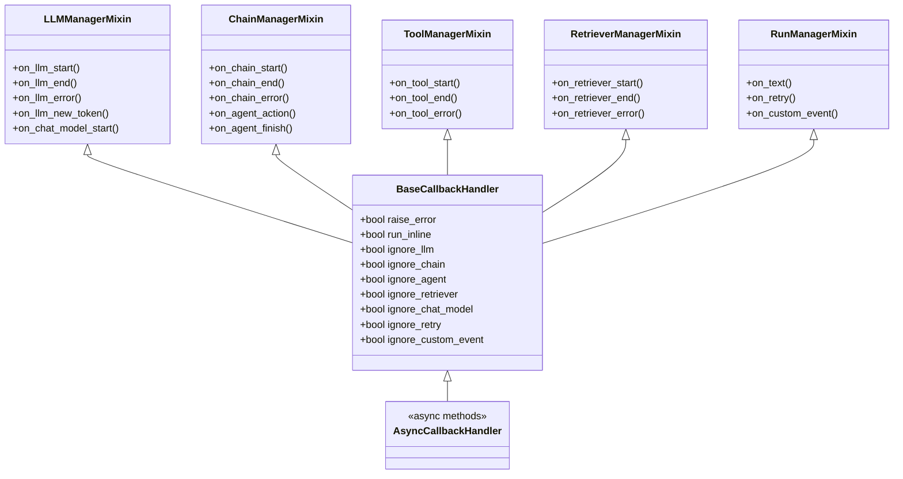
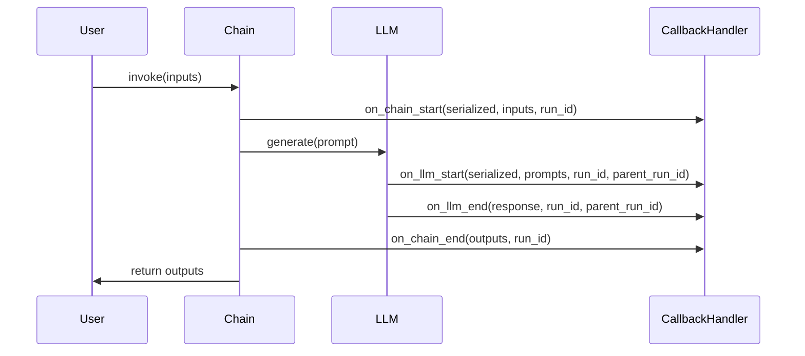
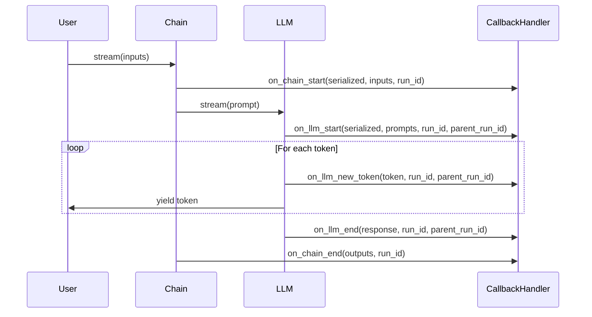
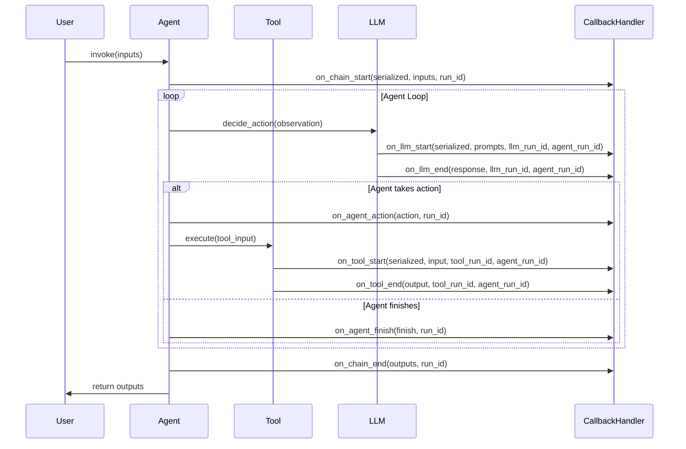
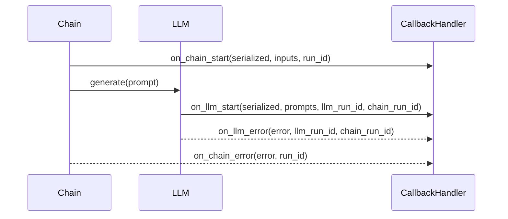

# Callback Handlers API Reference

## Overview

Callback handlers provide a powerful mechanism to hook into various stages of LangChain execution, enabling logging, monitoring, debugging, and custom behavior injection. The callback system supports both synchronous and asynchronous execution patterns with comprehensive coverage of LLM, chain, tool, agent, and retriever lifecycle events.

**Source**: `libs/core/langchain_core/callbacks/base.py`

## Core Concepts

### Callback Handler Hierarchy

LangChain's callback system is built on a mixin-based architecture that provides modular callback categories:



**Source**: `libs/core/langchain_core/callbacks/base.py:426-477`

### Run Tracking

Every callback method receives two critical UUID parameters:
- **run_id**: Unique identifier for the current operation
- **parent_run_id**: Identifier of the parent operation (for nested executions)

This hierarchical tracking enables:
- Nested chain execution monitoring
- Parent-child relationship reconstruction
- Distributed tracing integration
- Execution tree visualization

## BaseCallbackHandler

The base synchronous callback handler providing lifecycle hooks for all LangChain components.

**Source**: `libs/core/langchain_core/callbacks/base.py:426-477`

### Configuration Properties

#### raise_error

```python
raise_error: bool = False
```

Controls exception propagation behavior in callback methods.

**Type**: `bool`  
**Default**: `False`  
**Behavior**: 
- `False`: Exceptions in callbacks are logged but don't interrupt execution
- `True`: Exceptions in callbacks propagate and halt execution

**Use Cases**:
- Set to `True` for critical monitoring where failures must stop execution
- Keep `False` (default) for optional logging/observability handlers

**Example**:

```python
from langchain_core.callbacks.base import BaseCallbackHandler

class CriticalLoggingHandler(BaseCallbackHandler):
    raise_error = True  # Halt execution if logging fails
    
    def on_chain_start(self, serialized, inputs, **kwargs):
        # Critical operation - exceptions will propagate
        critical_audit_log(serialized, inputs)
```

**Source**: `libs/core/langchain_core/callbacks/base.py:436-437`

#### run_inline

```python
run_inline: bool = False
```

Determines whether callbacks execute inline (synchronously) or in background.

**Type**: `bool`  
**Default**: `False`  
**Behavior**:
- `False`: Callbacks may run in background threads/tasks
- `True`: Callbacks execute inline, blocking chain execution

**Use Cases**:
- Set to `True` when callbacks must complete before chain proceeds
- Keep `False` for performance when callback order doesn't matter

**Source**: `libs/core/langchain_core/callbacks/base.py:439-440`

### Selective Callback Filtering

Control which callback categories are processed using ignore properties:

#### ignore_llm

```python
@property
def ignore_llm(self) -> bool:
    """Whether to ignore LLM callbacks."""
    return False
```

**Returns**: `bool` - `True` to skip `on_llm_start`, `on_llm_end`, `on_llm_error`, `on_llm_new_token`  
**Source**: `libs/core/langchain_core/callbacks/base.py:442-445`

#### ignore_chain

```python
@property
def ignore_chain(self) -> bool:
    """Whether to ignore chain callbacks."""
    return False
```

**Returns**: `bool` - `True` to skip `on_chain_start`, `on_chain_end`, `on_chain_error`  
**Source**: `libs/core/langchain_core/callbacks/base.py:452-455`

#### ignore_agent

```python
@property
def ignore_agent(self) -> bool:
    """Whether to ignore agent callbacks."""
    return False
```

**Returns**: `bool` - `True` to skip `on_agent_action`, `on_agent_finish`  
**Source**: `libs/core/langchain_core/callbacks/base.py:457-460`

#### ignore_retriever

```python
@property
def ignore_retriever(self) -> bool:
    """Whether to ignore retriever callbacks."""
    return False
```

**Returns**: `bool` - `True` to skip `on_retriever_start`, `on_retriever_end`, `on_retriever_error`  
**Source**: `libs/core/langchain_core/callbacks/base.py:462-465`

#### ignore_chat_model

```python
@property
def ignore_chat_model(self) -> bool:
    """Whether to ignore chat model callbacks."""
    return False
```

**Returns**: `bool` - `True` to skip `on_chat_model_start`  
**Source**: `libs/core/langchain_core/callbacks/base.py:467-470`

#### ignore_retry

```python
@property
def ignore_retry(self) -> bool:
    """Whether to ignore retry callbacks."""
    return False
```

**Returns**: `bool` - `True` to skip `on_retry`  
**Source**: `libs/core/langchain_core/callbacks/base.py:447-450`

#### ignore_custom_event

```python
@property
def ignore_custom_event(self) -> bool:
    """Ignore custom event."""
    return False
```

**Returns**: `bool` - `True` to skip `on_custom_event`  
**Source**: `libs/core/langchain_core/callbacks/base.py:472-475`

**Example - Selective Callbacks**:

```python
from langchain_core.callbacks.base import BaseCallbackHandler

class ChainOnlyHandler(BaseCallbackHandler):
    """Handler that only processes chain events, ignoring LLMs and tools."""
    
    @property
    def ignore_llm(self) -> bool:
        return True  # Skip all LLM callbacks
    
    @property
    def ignore_agent(self) -> bool:
        return True  # Skip agent callbacks
    
    def on_chain_start(self, serialized, inputs, **kwargs):
        print(f"Chain started: {serialized.get('name')}")
    
    def on_chain_end(self, outputs, **kwargs):
        print(f"Chain completed: {outputs}")
```

## LLM Lifecycle Callbacks

Callbacks for language model invocation lifecycle.

### on_llm_start

```python
def on_llm_start(
    self,
    serialized: dict[str, Any],
    prompts: list[str],
    *,
    run_id: UUID,
    parent_run_id: UUID | None = None,
    tags: list[str] | None = None,
    metadata: dict[str, Any] | None = None,
    **kwargs: Any,
) -> Any:
```

Called when a non-chat LLM (legacy LLM) starts execution.

!!! warning
    This method is called for non-chat models (regular LLMs). For chat models, use `on_chat_model_start` instead.

**Args**:
- **serialized** (`dict[str, Any]`): Serialized LLM configuration containing model name, parameters
- **prompts** (`list[str]`): List of prompt strings being sent to the LLM
- **run_id** (`UUID`): Unique identifier for this LLM invocation
- **parent_run_id** (`UUID | None`): UUID of parent chain/operation, `None` for top-level calls
- **tags** (`list[str] | None`): User-defined tags for filtering/categorization
- **metadata** (`dict[str, Any] | None`): Additional context (user_id, session_id, etc.)
- ****kwargs**: Additional keyword arguments (may include `invocation_params`)

**Returns**: `Any` - Return value is typically ignored

**Example**:

```python
from uuid import UUID
from typing import Any
from langchain_core.callbacks.base import BaseCallbackHandler

class LLMLoggingHandler(BaseCallbackHandler):
    def on_llm_start(
        self,
        serialized: dict[str, Any],
        prompts: list[str],
        *,
        run_id: UUID,
        parent_run_id: UUID | None = None,
        tags: list[str] | None = None,
        metadata: dict[str, Any] | None = None,
        **kwargs: Any,
    ) -> Any:
        model_name = serialized.get("name", "unknown")
        print(f"[LLM START] Model: {model_name}, Run: {run_id}")
        print(f"[LLM START] Prompts: {len(prompts)} prompt(s)")
        for i, prompt in enumerate(prompts):
            print(f"  Prompt {i + 1}: {prompt[:100]}...")
```

**Source**: `libs/core/langchain_core/callbacks/base.py:234-260`

### on_chat_model_start

```python
def on_chat_model_start(
    self,
    serialized: dict[str, Any],
    messages: list[list[BaseMessage]],
    *,
    run_id: UUID,
    parent_run_id: UUID | None = None,
    tags: list[str] | None = None,
    metadata: dict[str, Any] | None = None,
    **kwargs: Any,
) -> Any:
```

Called when a chat model starts execution.

!!! warning
    This method is called for chat models. For non-chat models, use `on_llm_start` instead.

!!! note
    The default implementation raises `NotImplementedError` intentionally. The callback system will fall back to `on_llm_start` if this exception is raised, providing backward compatibility.

**Args**:
- **serialized** (`dict[str, Any]`): Serialized chat model configuration
- **messages** (`list[list[BaseMessage]]`): Batch of message lists (outer list = batch, inner list = conversation)
- **run_id** (`UUID`): Unique identifier for this chat model invocation
- **parent_run_id** (`UUID | None`): UUID of parent chain/operation
- **tags** (`list[str] | None`): User-defined tags
- **metadata** (`dict[str, Any] | None`): Additional context
- ****kwargs**: Additional keyword arguments

**Returns**: `Any` - Return value is typically ignored

**Raises**:
- **NotImplementedError**: Default implementation to trigger fallback to `on_llm_start`

**Example**:

```python
from typing import Any
from uuid import UUID
from langchain_core.callbacks.base import BaseCallbackHandler
from langchain_core.messages import BaseMessage

class ChatModelLoggingHandler(BaseCallbackHandler):
    def on_chat_model_start(
        self,
        serialized: dict[str, Any],
        messages: list[list[BaseMessage]],
        *,
        run_id: UUID,
        parent_run_id: UUID | None = None,
        tags: list[str] | None = None,
        metadata: dict[str, Any] | None = None,
        **kwargs: Any,
    ) -> Any:
        model_name = serialized.get("name", "unknown")
        print(f"[CHAT START] Model: {model_name}, Run: {run_id}")
        
        for batch_idx, conversation in enumerate(messages):
            print(f"  Conversation {batch_idx + 1}: {len(conversation)} messages")
            for msg in conversation:
                print(f"    {msg.__class__.__name__}: {msg.content[:50]}...")
```

**Source**: `libs/core/langchain_core/callbacks/base.py:262-291`

### on_llm_new_token

```python
def on_llm_new_token(
    self,
    token: str,
    *,
    chunk: GenerationChunk | ChatGenerationChunk | None = None,
    run_id: UUID,
    parent_run_id: UUID | None = None,
    **kwargs: Any,
) -> Any:
```

Called when a new token is generated during streaming. Only invoked when streaming is enabled.

Works for both chat models and non-chat models (legacy LLMs).

**Args**:
- **token** (`str`): The newly generated token string
- **chunk** (`GenerationChunk | ChatGenerationChunk | None`): Complete generation chunk with metadata, `None` for legacy LLMs
- **run_id** (`UUID`): Unique identifier for the current LLM invocation
- **parent_run_id** (`UUID | None`): UUID of parent operation
- ****kwargs**: Additional keyword arguments

**Returns**: `Any` - Return value is typically ignored

**Use Cases**:
- Real-time token streaming to UI
- Token-level latency monitoring
- Content moderation on partial outputs
- Progressive result rendering

**Example**:

```python
import sys
from uuid import UUID
from typing import Any
from langchain_core.callbacks.base import BaseCallbackHandler
from langchain_core.outputs import GenerationChunk, ChatGenerationChunk

class StreamingHandler(BaseCallbackHandler):
    def on_llm_new_token(
        self,
        token: str,
        *,
        chunk: GenerationChunk | ChatGenerationChunk | None = None,
        run_id: UUID,
        parent_run_id: UUID | None = None,
        **kwargs: Any,
    ) -> Any:
        # Stream tokens to stdout in real-time
        sys.stdout.write(token)
        sys.stdout.flush()
        
        # Access additional metadata from chunk if available
        if chunk and hasattr(chunk, 'generation_info'):
            finish_reason = chunk.generation_info.get('finish_reason')
            if finish_reason:
                print(f"\n[Finish Reason: {finish_reason}]")
```

**Source**: `libs/core/langchain_core/callbacks/base.py:65-84`

### on_llm_end

```python
def on_llm_end(
    self,
    response: LLMResult,
    *,
    run_id: UUID,
    parent_run_id: UUID | None = None,
    **kwargs: Any,
) -> Any:
```

Called when an LLM completes execution successfully.

**Args**:
- **response** (`LLMResult`): Complete LLM response containing:
  - `generations`: List of generation lists (batch dimension)
  - `llm_output`: Model-specific metadata (token counts, model name, etc.)
  - `run`: Optional run information
- **run_id** (`UUID`): Unique identifier for this LLM invocation
- **parent_run_id** (`UUID | None`): UUID of parent operation
- ****kwargs**: Additional keyword arguments

**Returns**: `Any` - Return value is typically ignored

**Example**:

```python
from uuid import UUID
from typing import Any
from langchain_core.callbacks.base import BaseCallbackHandler
from langchain_core.outputs import LLMResult

class LLMMetricsHandler(BaseCallbackHandler):
    def on_llm_end(
        self,
        response: LLMResult,
        *,
        run_id: UUID,
        parent_run_id: UUID | None = None,
        **kwargs: Any,
    ) -> Any:
        # Extract token usage
        llm_output = response.llm_output or {}
        token_usage = llm_output.get('token_usage', {})
        
        total_tokens = token_usage.get('total_tokens', 0)
        prompt_tokens = token_usage.get('prompt_tokens', 0)
        completion_tokens = token_usage.get('completion_tokens', 0)
        
        print(f"[LLM END] Run: {run_id}")
        print(f"  Tokens: {total_tokens} (prompt: {prompt_tokens}, "
              f"completion: {completion_tokens})")
        
        # Log generation count
        gen_count = sum(len(gens) for gens in response.generations)
        print(f"  Generations: {gen_count}")
```

**Source**: `libs/core/langchain_core/callbacks/base.py:86-101`

### on_llm_error

```python
def on_llm_error(
    self,
    error: BaseException,
    *,
    run_id: UUID,
    parent_run_id: UUID | None = None,
    **kwargs: Any,
) -> Any:
```

Called when an LLM invocation fails with an exception.

**Args**:
- **error** (`BaseException`): The exception that occurred (e.g., `RateLimitError`, `TimeoutError`, `APIError`)
- **run_id** (`UUID`): Unique identifier for the failed LLM invocation
- **parent_run_id** (`UUID | None`): UUID of parent operation
- ****kwargs**: Additional keyword arguments

**Returns**: `Any` - Return value is typically ignored

**Common Error Types**:
- `openai.RateLimitError`: API rate limits exceeded
- `openai.Timeout`: Request timeout
- `openai.APIError`: API service errors
- `ValidationError`: Invalid input parameters

**Example**:

```python
from uuid import UUID
from typing import Any
from langchain_core.callbacks.base import BaseCallbackHandler

class LLMErrorHandler(BaseCallbackHandler):
    def on_llm_error(
        self,
        error: BaseException,
        *,
        run_id: UUID,
        parent_run_id: UUID | None = None,
        **kwargs: Any,
    ) -> Any:
        error_type = type(error).__name__
        error_msg = str(error)
        
        print(f"[LLM ERROR] Run: {run_id}")
        print(f"  Type: {error_type}")
        print(f"  Message: {error_msg}")
        
        # Handle specific error types
        if "rate_limit" in error_msg.lower():
            print("  Action: Implement exponential backoff")
        elif "timeout" in error_msg.lower():
            print("  Action: Consider increasing timeout or reducing prompt size")
        
        # Log to monitoring system
        # monitoring.log_error(run_id, error_type, error_msg)
```

**Source**: `libs/core/langchain_core/callbacks/base.py:103-118`

## Chain Lifecycle Callbacks

Callbacks for chain execution lifecycle.

### on_chain_start

```python
def on_chain_start(
    self,
    serialized: dict[str, Any],
    inputs: dict[str, Any],
    *,
    run_id: UUID,
    parent_run_id: UUID | None = None,
    tags: list[str] | None = None,
    metadata: dict[str, Any] | None = None,
    **kwargs: Any,
) -> Any:
```

Called when a chain starts execution.

**Args**:
- **serialized** (`dict[str, Any]`): Serialized chain configuration containing:
  - `name`: Chain class name
  - `id`: Chain identifier list
  - Additional chain-specific configuration
- **inputs** (`dict[str, Any]`): Input dictionary passed to chain (keys depend on chain type)
- **run_id** (`UUID`): Unique identifier for this chain execution
- **parent_run_id** (`UUID | None`): UUID of parent chain (for nested chains)
- **tags** (`list[str] | None`): User-defined tags
- **metadata** (`dict[str, Any] | None`): Additional context
- ****kwargs**: Additional keyword arguments (may include `name` override)

**Returns**: `Any` - Return value is typically ignored

**Example**:

```python
from uuid import UUID
from typing import Any
from langchain_core.callbacks.base import BaseCallbackHandler

class ChainTracingHandler(BaseCallbackHandler):
    def __init__(self):
        self.chain_depth = 0
    
    def on_chain_start(
        self,
        serialized: dict[str, Any],
        inputs: dict[str, Any],
        *,
        run_id: UUID,
        parent_run_id: UUID | None = None,
        tags: list[str] | None = None,
        metadata: dict[str, Any] | None = None,
        **kwargs: Any,
    ) -> Any:
        indent = "  " * self.chain_depth
        chain_name = kwargs.get("name") or serialized.get("name", "Unknown")
        
        print(f"{indent}[CHAIN START] {chain_name}")
        print(f"{indent}  Run ID: {run_id}")
        print(f"{indent}  Parent: {parent_run_id}")
        print(f"{indent}  Inputs: {list(inputs.keys())}")
        
        if tags:
            print(f"{indent}  Tags: {tags}")
        
        self.chain_depth += 1
```

**Source**: `libs/core/langchain_core/callbacks/base.py:316-337`

### on_chain_end

```python
def on_chain_end(
    self,
    outputs: dict[str, Any],
    *,
    run_id: UUID,
    parent_run_id: UUID | None = None,
    **kwargs: Any,
) -> Any:
```

Called when a chain completes execution successfully.

**Args**:
- **outputs** (`dict[str, Any]`): Output dictionary from chain (keys depend on chain type)
- **run_id** (`UUID`): Unique identifier for this chain execution
- **parent_run_id** (`UUID | None`): UUID of parent chain
- ****kwargs**: Additional keyword arguments

**Returns**: `Any` - Return value is typically ignored

**Example**:

```python
from uuid import UUID
from typing import Any
from langchain_core.callbacks.base import BaseCallbackHandler

class ChainTracingHandler(BaseCallbackHandler):
    def __init__(self):
        self.chain_depth = 0
    
    def on_chain_end(
        self,
        outputs: dict[str, Any],
        *,
        run_id: UUID,
        parent_run_id: UUID | None = None,
        **kwargs: Any,
    ) -> Any:
        self.chain_depth -= 1
        indent = "  " * self.chain_depth
        
        print(f"{indent}[CHAIN END] Run ID: {run_id}")
        print(f"{indent}  Outputs: {list(outputs.keys())}")
        
        # Log output values (truncate for readability)
        for key, value in outputs.items():
            value_str = str(value)[:100]
            print(f"{indent}    {key}: {value_str}...")
```

**Source**: `libs/core/langchain_core/callbacks/base.py:124-139`

### on_chain_error

```python
def on_chain_error(
    self,
    error: BaseException,
    *,
    run_id: UUID,
    parent_run_id: UUID | None = None,
    **kwargs: Any,
) -> Any:
```

Called when a chain execution fails with an exception.

**Args**:
- **error** (`BaseException`): The exception that occurred
- **run_id** (`UUID`): Unique identifier for the failed chain execution
- **parent_run_id** (`UUID | None`): UUID of parent chain
- ****kwargs**: Additional keyword arguments

**Returns**: `Any` - Return value is typically ignored

**Example**:

```python
from uuid import UUID
from typing import Any
from langchain_core.callbacks.base import BaseCallbackHandler

class ChainErrorHandler(BaseCallbackHandler):
    def on_chain_error(
        self,
        error: BaseException,
        *,
        run_id: UUID,
        parent_run_id: UUID | None = None,
        **kwargs: Any,
    ) -> Any:
        print(f"[CHAIN ERROR] Run: {run_id}")
        print(f"  Error: {type(error).__name__}: {error}")
        
        if parent_run_id:
            print(f"  Parent Chain: {parent_run_id}")
            print("  Note: Error occurred in nested chain execution")
```

**Source**: `libs/core/langchain_core/callbacks/base.py:141-156`

## Tool Lifecycle Callbacks

Callbacks for tool execution lifecycle.

### on_tool_start

```python
def on_tool_start(
    self,
    serialized: dict[str, Any],
    input_str: str,
    *,
    run_id: UUID,
    parent_run_id: UUID | None = None,
    tags: list[str] | None = None,
    metadata: dict[str, Any] | None = None,
    inputs: dict[str, Any] | None = None,
    **kwargs: Any,
) -> Any:
```

Called when a tool starts execution.

**Args**:
- **serialized** (`dict[str, Any]`): Serialized tool configuration containing tool name and description
- **input_str** (`str`): String representation of tool input (legacy format)
- **run_id** (`UUID`): Unique identifier for this tool invocation
- **parent_run_id** (`UUID | None`): UUID of parent agent/chain
- **tags** (`list[str] | None`): User-defined tags
- **metadata** (`dict[str, Any] | None`): Additional context
- **inputs** (`dict[str, Any] | None`): Structured tool inputs (preferred over `input_str`)
- ****kwargs**: Additional keyword arguments

**Returns**: `Any` - Return value is typically ignored

**Example**:

```python
from uuid import UUID
from typing import Any
from langchain_core.callbacks.base import BaseCallbackHandler

class ToolLoggingHandler(BaseCallbackHandler):
    def on_tool_start(
        self,
        serialized: dict[str, Any],
        input_str: str,
        *,
        run_id: UUID,
        parent_run_id: UUID | None = None,
        tags: list[str] | None = None,
        metadata: dict[str, Any] | None = None,
        inputs: dict[str, Any] | None = None,
        **kwargs: Any,
    ) -> Any:
        tool_name = serialized.get("name", "unknown")
        
        print(f"[TOOL START] {tool_name}")
        print(f"  Run ID: {run_id}")
        
        # Prefer structured inputs if available
        if inputs:
            print(f"  Inputs: {inputs}")
        else:
            print(f"  Input String: {input_str}")
```

**Source**: `libs/core/langchain_core/callbacks/base.py:339-362`

### on_tool_end

```python
def on_tool_end(
    self,
    output: Any,
    *,
    run_id: UUID,
    parent_run_id: UUID | None = None,
    **kwargs: Any,
) -> Any:
```

Called when a tool completes execution successfully.

**Args**:
- **output** (`Any`): Tool output (can be string, dict, list, or custom type)
- **run_id** (`UUID`): Unique identifier for this tool invocation
- **parent_run_id** (`UUID | None`): UUID of parent agent/chain
- ****kwargs**: Additional keyword arguments

**Returns**: `Any` - Return value is typically ignored

**Example**:

```python
from uuid import UUID
from typing import Any
from langchain_core.callbacks.base import BaseCallbackHandler

class ToolLoggingHandler(BaseCallbackHandler):
    def on_tool_end(
        self,
        output: Any,
        *,
        run_id: UUID,
        parent_run_id: UUID | None = None,
        **kwargs: Any,
    ) -> Any:
        print(f"[TOOL END] Run ID: {run_id}")
        
        # Handle different output types
        if isinstance(output, str):
            print(f"  Output: {output[:200]}...")
        elif isinstance(output, dict):
            print(f"  Output Keys: {list(output.keys())}")
        else:
            print(f"  Output Type: {type(output).__name__}")
```

**Source**: `libs/core/langchain_core/callbacks/base.py:196-211`

### on_tool_error

```python
def on_tool_error(
    self,
    error: BaseException,
    *,
    run_id: UUID,
    parent_run_id: UUID | None = None,
    **kwargs: Any,
) -> Any:
```

Called when a tool execution fails with an exception.

**Args**:
- **error** (`BaseException`): The exception that occurred during tool execution
- **run_id** (`UUID`): Unique identifier for the failed tool invocation
- **parent_run_id** (`UUID | None`): UUID of parent agent/chain
- ****kwargs**: Additional keyword arguments

**Returns**: `Any` - Return value is typically ignored

**Example**:

```python
from uuid import UUID
from typing import Any
from langchain_core.callbacks.base import BaseCallbackHandler

class ToolErrorHandler(BaseCallbackHandler):
    def on_tool_error(
        self,
        error: BaseException,
        *,
        run_id: UUID,
        parent_run_id: UUID | None = None,
        **kwargs: Any,
    ) -> Any:
        print(f"[TOOL ERROR] Run: {run_id}")
        print(f"  Error: {type(error).__name__}: {error}")
        
        # Agent will handle tool errors gracefully
        print("  Note: Agent may retry with different tool or inputs")
```

**Source**: `libs/core/langchain_core/callbacks/base.py:213-228`

## Agent Lifecycle Callbacks

Callbacks for agent decision-making and actions.

### on_agent_action

```python
def on_agent_action(
    self,
    action: AgentAction,
    *,
    run_id: UUID,
    parent_run_id: UUID | None = None,
    **kwargs: Any,
) -> Any:
```

Called when an agent decides to take an action (invoke a tool).

**Args**:
- **action** (`AgentAction`): Agent's chosen action containing:
  - `tool`: Name of tool to invoke
  - `tool_input`: Input to pass to tool
  - `log`: Agent's reasoning/thought process
- **run_id** (`UUID`): Unique identifier for this agent action
- **parent_run_id** (`UUID | None`): UUID of parent agent executor
- ****kwargs**: Additional keyword arguments

**Returns**: `Any` - Return value is typically ignored

**Example**:

```python
from uuid import UUID
from typing import Any
from langchain_core.callbacks.base import BaseCallbackHandler
from langchain_core.agents import AgentAction

class AgentTracingHandler(BaseCallbackHandler):
    def on_agent_action(
        self,
        action: AgentAction,
        *,
        run_id: UUID,
        parent_run_id: UUID | None = None,
        **kwargs: Any,
    ) -> Any:
        print(f"[AGENT ACTION] Run: {run_id}")
        print(f"  Tool: {action.tool}")
        print(f"  Tool Input: {action.tool_input}")
        print(f"  Agent Reasoning:\n{action.log}")
```

**Source**: `libs/core/langchain_core/callbacks/base.py:158-173`

### on_agent_finish

```python
def on_agent_finish(
    self,
    finish: AgentFinish,
    *,
    run_id: UUID,
    parent_run_id: UUID | None = None,
    **kwargs: Any,
) -> Any:
```

Called when an agent decides to finish execution (provide final answer).

**Args**:
- **finish** (`AgentFinish`): Agent's final decision containing:
  - `return_values`: Final output dictionary (typically contains `output` key)
  - `log`: Agent's final reasoning/thought process
- **run_id** (`UUID`): Unique identifier for this agent finish
- **parent_run_id** (`UUID | None`): UUID of parent agent executor
- ****kwargs**: Additional keyword arguments

**Returns**: `Any` - Return value is typically ignored

**Example**:

```python
from uuid import UUID
from typing import Any
from langchain_core.callbacks.base import BaseCallbackHandler
from langchain_core.agents import AgentFinish

class AgentTracingHandler(BaseCallbackHandler):
    def on_agent_finish(
        self,
        finish: AgentFinish,
        *,
        run_id: UUID,
        parent_run_id: UUID | None = None,
        **kwargs: Any,
    ) -> Any:
        print(f"[AGENT FINISH] Run: {run_id}")
        print(f"  Return Values: {finish.return_values}")
        print(f"  Final Reasoning:\n{finish.log}")
```

**Source**: `libs/core/langchain_core/callbacks/base.py:175-190`

## Retriever Lifecycle Callbacks

Callbacks for document retrieval lifecycle.

### on_retriever_start

```python
def on_retriever_start(
    self,
    serialized: dict[str, Any],
    query: str,
    *,
    run_id: UUID,
    parent_run_id: UUID | None = None,
    tags: list[str] | None = None,
    metadata: dict[str, Any] | None = None,
    **kwargs: Any,
) -> Any:
```

Called when a retriever starts document retrieval.

**Args**:
- **serialized** (`dict[str, Any]`): Serialized retriever configuration
- **query** (`str`): Search query string
- **run_id** (`UUID`): Unique identifier for this retrieval operation
- **parent_run_id** (`UUID | None`): UUID of parent chain
- **tags** (`list[str] | None`): User-defined tags
- **metadata** (`dict[str, Any] | None`): Additional context
- ****kwargs**: Additional keyword arguments

**Returns**: `Any` - Return value is typically ignored

**Example**:

```python
from uuid import UUID
from typing import Any
from langchain_core.callbacks.base import BaseCallbackHandler

class RetrieverLoggingHandler(BaseCallbackHandler):
    def on_retriever_start(
        self,
        serialized: dict[str, Any],
        query: str,
        *,
        run_id: UUID,
        parent_run_id: UUID | None = None,
        tags: list[str] | None = None,
        metadata: dict[str, Any] | None = None,
        **kwargs: Any,
    ) -> Any:
        retriever_name = serialized.get("name", "unknown")
        print(f"[RETRIEVER START] {retriever_name}")
        print(f"  Query: {query}")
        print(f"  Run ID: {run_id}")
```

**Source**: `libs/core/langchain_core/callbacks/base.py:293-314`

### on_retriever_end

```python
def on_retriever_end(
    self,
    documents: Sequence[Document],
    *,
    run_id: UUID,
    parent_run_id: UUID | None = None,
    **kwargs: Any,
) -> Any:
```

Called when a retriever completes document retrieval successfully.

**Args**:
- **documents** (`Sequence[Document]`): Retrieved documents, each containing:
  - `page_content`: Document text content
  - `metadata`: Document metadata (source, page number, etc.)
- **run_id** (`UUID`): Unique identifier for this retrieval operation
- **parent_run_id** (`UUID | None`): UUID of parent chain
- ****kwargs**: Additional keyword arguments

**Returns**: `Any` - Return value is typically ignored

**Example**:

```python
from uuid import UUID
from typing import Any
from collections.abc import Sequence
from langchain_core.callbacks.base import BaseCallbackHandler
from langchain_core.documents import Document

class RetrieverLoggingHandler(BaseCallbackHandler):
    def on_retriever_end(
        self,
        documents: Sequence[Document],
        *,
        run_id: UUID,
        parent_run_id: UUID | None = None,
        **kwargs: Any,
    ) -> Any:
        print(f"[RETRIEVER END] Run: {run_id}")
        print(f"  Documents Retrieved: {len(documents)}")
        
        for i, doc in enumerate(documents):
            print(f"  Document {i + 1}:")
            print(f"    Content Length: {len(doc.page_content)} chars")
            print(f"    Metadata: {doc.metadata}")
```

**Source**: `libs/core/langchain_core/callbacks/base.py:44-59`

### on_retriever_error

```python
def on_retriever_error(
    self,
    error: BaseException,
    *,
    run_id: UUID,
    parent_run_id: UUID | None = None,
    **kwargs: Any,
) -> Any:
```

Called when a retriever fails during document retrieval.

**Args**:
- **error** (`BaseException`): The exception that occurred
- **run_id** (`UUID`): Unique identifier for the failed retrieval operation
- **parent_run_id** (`UUID | None`): UUID of parent chain
- ****kwargs**: Additional keyword arguments

**Returns**: `Any` - Return value is typically ignored

**Example**:

```python
from uuid import UUID
from typing import Any
from langchain_core.callbacks.base import BaseCallbackHandler

class RetrieverErrorHandler(BaseCallbackHandler):
    def on_retriever_error(
        self,
        error: BaseException,
        *,
        run_id: UUID,
        parent_run_id: UUID | None = None,
        **kwargs: Any,
    ) -> Any:
        print(f"[RETRIEVER ERROR] Run: {run_id}")
        print(f"  Error: {type(error).__name__}: {error}")
        
        # Common retrieval errors
        if "connection" in str(error).lower():
            print("  Possible Cause: Vector store connection failure")
        elif "index" in str(error).lower():
            print("  Possible Cause: Index not found or corrupted")
```

**Source**: `libs/core/langchain_core/callbacks/base.py:27-42`

## Utility Callbacks

General-purpose callbacks for text output, retries, and custom events.

### on_text

```python
def on_text(
    self,
    text: str,
    *,
    run_id: UUID,
    parent_run_id: UUID | None = None,
    **kwargs: Any,
) -> Any:
```

Called when arbitrary text is generated (generic text output hook).

**Args**:
- **text** (`str`): Generated text content
- **run_id** (`UUID`): Unique identifier for current operation
- **parent_run_id** (`UUID | None`): UUID of parent operation
- ****kwargs**: Additional keyword arguments (may include `end` for line endings)

**Returns**: `Any` - Return value is typically ignored

**Use Cases**:
- Logging intermediate agent thoughts
- Capturing chain-of-thought reasoning
- Streaming partial results

**Example**:

```python
from uuid import UUID
from typing import Any
from langchain_core.callbacks.base import BaseCallbackHandler

class TextLoggingHandler(BaseCallbackHandler):
    def on_text(
        self,
        text: str,
        *,
        run_id: UUID,
        parent_run_id: UUID | None = None,
        **kwargs: Any,
    ) -> Any:
        end_char = kwargs.get("end", "\n")
        print(f"[TEXT] {text}", end=end_char)
```

**Source**: `libs/core/langchain_core/callbacks/base.py:368-383`

### on_retry

```python
def on_retry(
    self,
    retry_state: RetryCallState,
    *,
    run_id: UUID,
    parent_run_id: UUID | None = None,
    **kwargs: Any,
) -> Any:
```

Called when a retry event occurs (using tenacity retry mechanism).

**Args**:
- **retry_state** (`RetryCallState`): Tenacity retry state containing:
  - `attempt_number`: Current attempt number
  - `outcome`: Result of the attempt (exception or return value)
  - `idle_for`: Time to wait before next retry
  - `next_action`: Next retry action
- **run_id** (`UUID`): Unique identifier for the operation being retried
- **parent_run_id** (`UUID | None`): UUID of parent operation
- ****kwargs**: Additional keyword arguments

**Returns**: `Any` - Return value is typically ignored

**Example**:

```python
from uuid import UUID
from typing import Any, TYPE_CHECKING
from langchain_core.callbacks.base import BaseCallbackHandler

if TYPE_CHECKING:
    from tenacity import RetryCallState

class RetryLoggingHandler(BaseCallbackHandler):
    def on_retry(
        self,
        retry_state: RetryCallState,
        *,
        run_id: UUID,
        parent_run_id: UUID | None = None,
        **kwargs: Any,
    ) -> Any:
        attempt = retry_state.attempt_number
        wait_time = retry_state.idle_for
        
        print(f"[RETRY] Attempt {attempt} failed for run {run_id}")
        print(f"  Waiting {wait_time:.2f}s before retry")
        
        # Log the error that triggered retry
        if retry_state.outcome and retry_state.outcome.failed:
            exception = retry_state.outcome.exception()
            print(f"  Error: {type(exception).__name__}: {exception}")
```

**Source**: `libs/core/langchain_core/callbacks/base.py:385-400`

### on_custom_event

```python
def on_custom_event(
    self,
    name: str,
    data: Any,
    *,
    run_id: UUID,
    tags: list[str] | None = None,
    metadata: dict[str, Any] | None = None,
    **kwargs: Any,
) -> Any:
```

Override to handle custom application-specific events.

**Args**:
- **name** (`str`): Custom event name
- **data** (`Any`): Event data in user-specified format
- **run_id** (`UUID`): Unique identifier for the operation emitting the event
- **tags** (`list[str] | None`): Tags associated with the event (includes inherited tags)
- **metadata** (`dict[str, Any] | None`): Metadata associated with the event (includes inherited metadata)
- ****kwargs**: Additional keyword arguments

**Returns**: `Any` - Return value is typically ignored

**Use Cases**:
- Application-specific telemetry
- Custom debugging events
- Business logic hooks
- Integration with external monitoring systems

**Example**:

```python
from uuid import UUID
from typing import Any
from langchain_core.callbacks.base import BaseCallbackHandler

class CustomEventHandler(BaseCallbackHandler):
    def on_custom_event(
        self,
        name: str,
        data: Any,
        *,
        run_id: UUID,
        tags: list[str] | None = None,
        metadata: dict[str, Any] | None = None,
        **kwargs: Any,
    ) -> Any:
        print(f"[CUSTOM EVENT] {name}")
        print(f"  Run ID: {run_id}")
        print(f"  Data: {data}")
        
        if tags:
            print(f"  Tags: {tags}")
        
        if metadata:
            print(f"  Metadata: {metadata}")
        
        # Route to specific handlers based on event name
        if name == "cost_threshold_exceeded":
            self._handle_cost_alert(data)
        elif name == "sensitive_data_detected":
            self._handle_pii_detection(data)
    
    def _handle_cost_alert(self, data: Any) -> None:
        print(f"  ALERT: Cost threshold exceeded: ${data.get('cost', 0):.2f}")
    
    def _handle_pii_detection(self, data: Any) -> None:
        print(f"  ALERT: Sensitive data detected: {data.get('type')}")
```

**Source**: `libs/core/langchain_core/callbacks/base.py:402-423`

## AsyncCallbackHandler

Async callback handler providing async/await versions of all callback methods.

**Source**: `libs/core/langchain_core/callbacks/base.py:478-883`

### Overview

`AsyncCallbackHandler` extends `BaseCallbackHandler` with async method implementations. All callback methods are `async def` and must be awaited.

**Key Differences from BaseCallbackHandler**:
- All methods are coroutines (async def)
- Must be used with async LLM/chain invocations (`ainvoke`, `astream`, etc.)
- Methods run in async context (event loop required)
- Enables non-blocking I/O operations in callbacks

### Event Loop Considerations

!!! warning "Event Loop Requirements"
    AsyncCallbackHandler methods require an active event loop. Ensure you're using async chain methods (`ainvoke`, `abatch`, `astream`) when using async callbacks.

**Example - Async vs Sync Usage**:

```python
from langchain_core.callbacks.base import AsyncCallbackHandler
from langchain_core.runnables import RunnableConfig

class MyAsyncHandler(AsyncCallbackHandler):
    async def on_chain_start(self, serialized, inputs, **kwargs):
        # Async operations allowed
        await async_log_to_db(serialized, inputs)

handler = MyAsyncHandler()

# ✅ CORRECT: Using async chain method
result = await chain.ainvoke(
    {"input": "test"},
    config=RunnableConfig(callbacks=[handler])
)

# ❌ INCORRECT: Using sync method with async handler
# This may cause event loop issues
# result = chain.invoke(
#     {"input": "test"},
#     config=RunnableConfig(callbacks=[handler])
# )
```

### Async Method Signatures

All async callback methods have identical signatures to their sync counterparts, with `async def` declaration:

```python
async def on_llm_start(
    self,
    serialized: dict[str, Any],
    prompts: list[str],
    *,
    run_id: UUID,
    parent_run_id: UUID | None = None,
    tags: list[str] | None = None,
    metadata: dict[str, Any] | None = None,
    **kwargs: Any,
) -> None:
    """Async version of on_llm_start."""
```

**Source**: `libs/core/langchain_core/callbacks/base.py:481-507`

### Complete Async Example

```python
import asyncio
from uuid import UUID
from typing import Any
from langchain_core.callbacks.base import AsyncCallbackHandler
from langchain_core.outputs import LLMResult
from langchain_core.messages import BaseMessage

class AsyncMetricsHandler(AsyncCallbackHandler):
    """Async handler with non-blocking database logging."""
    
    def __init__(self, db_client):
        self.db = db_client
    
    async def on_llm_start(
        self,
        serialized: dict[str, Any],
        prompts: list[str],
        *,
        run_id: UUID,
        parent_run_id: UUID | None = None,
        tags: list[str] | None = None,
        metadata: dict[str, Any] | None = None,
        **kwargs: Any,
    ) -> None:
        # Non-blocking database write
        await self.db.log_llm_start(
            run_id=str(run_id),
            model=serialized.get("name"),
            prompt_count=len(prompts)
        )
    
    async def on_llm_end(
        self,
        response: LLMResult,
        *,
        run_id: UUID,
        parent_run_id: UUID | None = None,
        tags: list[str] | None = None,
        **kwargs: Any,
    ) -> None:
        # Extract token usage
        llm_output = response.llm_output or {}
        token_usage = llm_output.get('token_usage', {})
        
        # Non-blocking database write
        await self.db.log_llm_end(
            run_id=str(run_id),
            total_tokens=token_usage.get('total_tokens', 0),
            completion_tokens=token_usage.get('completion_tokens', 0)
        )
    
    async def on_chain_start(
        self,
        serialized: dict[str, Any],
        inputs: dict[str, Any],
        *,
        run_id: UUID,
        parent_run_id: UUID | None = None,
        tags: list[str] | None = None,
        metadata: dict[str, Any] | None = None,
        **kwargs: Any,
    ) -> None:
        await self.db.log_chain_start(
            run_id=str(run_id),
            chain_name=serialized.get("name"),
            input_keys=list(inputs.keys())
        )
    
    async def on_chain_end(
        self,
        outputs: dict[str, Any],
        *,
        run_id: UUID,
        parent_run_id: UUID | None = None,
        tags: list[str] | None = None,
        **kwargs: Any,
    ) -> None:
        await self.db.log_chain_end(
            run_id=str(run_id),
            output_keys=list(outputs.keys())
        )
```

**Usage**:

```python
from langchain_core.runnables import RunnableConfig
from langchain_openai import ChatOpenAI
from langchain_core.prompts import ChatPromptTemplate

# Create async handler
handler = AsyncMetricsHandler(db_client=my_async_db)

# Build chain
prompt = ChatPromptTemplate.from_template("Tell me about {topic}")
model = ChatOpenAI()
chain = prompt | model

# Use with async invocation
result = await chain.ainvoke(
    {"topic": "LangChain callbacks"},
    config=RunnableConfig(callbacks=[handler])
)
```

## Callback Event Sequence

Understanding the order of callback invocations during chain execution.

### Simple Chain Execution



### Streaming Chain Execution



### Agent Execution with Tools



### Error Handling Flow



**Key Observations**:

1. **Parent-Child Relationships**: `parent_run_id` links nested operations (LLM runs have chain run as parent)
2. **Error Callbacks**: Error callbacks (`on_*_error`) replace end callbacks (`on_*_end`) on failure
3. **Streaming**: `on_llm_new_token` fires between `on_llm_start` and `on_llm_end` during streaming
4. **Agent Loops**: Agent callbacks may fire multiple times in loops until `on_agent_finish`

## Concrete Handler Implementations

LangChain provides concrete callback handler implementations for common use cases.

### StdOutCallbackHandler

Prints chain execution progress to standard output with formatted output.

**Source**: `libs/core/langchain_core/callbacks/stdout.py:16-124`

**Features**:
- Pretty-printed chain start/end messages
- Colored agent output support
- Tool observation formatting
- Final answer display

**Example**:

```python
from langchain_core.callbacks.stdout import StdOutCallbackHandler
from langchain_core.runnables import RunnableConfig
from langchain_openai import ChatOpenAI
from langchain_core.prompts import ChatPromptTemplate

# Create handler with optional color
handler = StdOutCallbackHandler(color="green")

# Build and run chain
prompt = ChatPromptTemplate.from_template("Tell me about {topic}")
model = ChatOpenAI()
chain = prompt | model

result = chain.invoke(
    {"topic": "callbacks"},
    config=RunnableConfig(callbacks=[handler])
)

# Output example:
# 
# > Entering new RunnableSequence chain...
# 
# > Finished chain.
```

**Implementation Reference**:

```python
class StdOutCallbackHandler(BaseCallbackHandler):
    """Callback Handler that prints to std out."""

    def __init__(self, color: str | None = None) -> None:
        """Initialize callback handler.

        Args:
            color: The color to use for the text.
        """
        self.color = color

    def on_chain_start(
        self, serialized: dict[str, Any], inputs: dict[str, Any], **kwargs: Any
    ) -> None:
        """Print out that we are entering a chain."""
        if "name" in kwargs:
            name = kwargs["name"]
        elif serialized:
            name = serialized.get("name", serialized.get("id", ["<unknown>"])[-1])
        else:
            name = "<unknown>"
        print(f"\n\n\033[1m> Entering new {name} chain...\033[0m")

    def on_chain_end(self, outputs: dict[str, Any], **kwargs: Any) -> None:
        """Print out that we finished a chain."""
        print("\n\033[1m> Finished chain.\033[0m")
```

**Source**: `libs/core/langchain_core/callbacks/stdout.py:16-54`

### StreamingStdOutCallbackHandler

Streams LLM tokens to standard output in real-time during generation.

**Source**: `libs/core/langchain_core/callbacks/streaming_stdout.py:18-150`

**Features**:
- Real-time token streaming
- Minimal overhead
- Automatic stdout flushing
- Works with both chat and non-chat models

**Example**:

```python
from langchain_core.callbacks.streaming_stdout import StreamingStdOutCallbackHandler
from langchain_core.runnables import RunnableConfig
from langchain_openai import ChatOpenAI

# Create streaming handler
handler = StreamingStdOutCallbackHandler()

# Model must support streaming
model = ChatOpenAI(streaming=True)

# Tokens will appear progressively
response = model.invoke(
    "Write a haiku about programming",
    config=RunnableConfig(callbacks=[handler])
)

# Output streams to stdout as tokens arrive:
# Code flows like rain
# Debugging in the dark night
# Coffee keeps me warm
```

**Implementation Reference**:

```python
class StreamingStdOutCallbackHandler(BaseCallbackHandler):
    """Callback handler for streaming. Only works with LLMs that support streaming."""

    def on_llm_new_token(self, token: str, **kwargs: Any) -> None:
        """Run on new LLM token. Only available when streaming is enabled.

        Args:
            token: The new token.
            **kwargs: Additional keyword arguments.
        """
        import sys
        sys.stdout.write(token)
        sys.stdout.flush()
```

**Source**: `libs/core/langchain_core/callbacks/streaming_stdout.py:47-55`

## Custom Handler Implementation Guide

### Basic Custom Handler

```python
from uuid import UUID
from typing import Any
from langchain_core.callbacks.base import BaseCallbackHandler
from langchain_core.outputs import LLMResult

class MyCustomHandler(BaseCallbackHandler):
    """Custom callback handler template."""
    
    def __init__(self):
        """Initialize handler state."""
        self.llm_calls = 0
        self.chain_calls = 0
    
    def on_llm_start(
        self,
        serialized: dict[str, Any],
        prompts: list[str],
        *,
        run_id: UUID,
        parent_run_id: UUID | None = None,
        tags: list[str] | None = None,
        metadata: dict[str, Any] | None = None,
        **kwargs: Any,
    ) -> Any:
        """Track LLM invocations."""
        self.llm_calls += 1
        print(f"LLM Call #{self.llm_calls} started")
    
    def on_llm_end(
        self,
        response: LLMResult,
        *,
        run_id: UUID,
        parent_run_id: UUID | None = None,
        **kwargs: Any,
    ) -> Any:
        """Log LLM results."""
        token_usage = response.llm_output.get('token_usage', {}) if response.llm_output else {}
        print(f"LLM Call #{self.llm_calls} completed - "
              f"Tokens: {token_usage.get('total_tokens', 0)}")
    
    def on_chain_start(
        self,
        serialized: dict[str, Any],
        inputs: dict[str, Any],
        *,
        run_id: UUID,
        parent_run_id: UUID | None = None,
        tags: list[str] | None = None,
        metadata: dict[str, Any] | None = None,
        **kwargs: Any,
    ) -> Any:
        """Track chain invocations."""
        self.chain_calls += 1
        chain_name = serialized.get("name", "Unknown")
        print(f"Chain '{chain_name}' started (#{self.chain_calls})")
    
    def on_chain_end(
        self,
        outputs: dict[str, Any],
        *,
        run_id: UUID,
        parent_run_id: UUID | None = None,
        **kwargs: Any,
    ) -> Any:
        """Log chain completion."""
        print(f"Chain #{self.chain_calls} completed")

# Usage
from langchain_core.runnables import RunnableConfig

handler = MyCustomHandler()
result = chain.invoke(
    inputs,
    config=RunnableConfig(callbacks=[handler])
)

print(f"\nTotal LLM calls: {handler.llm_calls}")
print(f"Total chain calls: {handler.chain_calls}")
```

### Advanced Handler with Selective Callbacks

```python
from uuid import UUID
from typing import Any
from langchain_core.callbacks.base import BaseCallbackHandler

class PerformanceMonitorHandler(BaseCallbackHandler):
    """Monitor chain performance with selective callback filtering."""
    
    def __init__(self, enable_llm_tracking: bool = True):
        self.enable_llm_tracking = enable_llm_tracking
        self.start_times = {}
        self.metrics = {
            "llm_calls": 0,
            "llm_total_time": 0,
            "chain_calls": 0,
            "chain_total_time": 0,
        }
    
    @property
    def ignore_llm(self) -> bool:
        """Skip LLM callbacks if disabled."""
        return not self.enable_llm_tracking
    
    @property
    def ignore_agent(self) -> bool:
        """We're not tracking agents in this handler."""
        return True
    
    @property
    def ignore_retriever(self) -> bool:
        """We're not tracking retrievers in this handler."""
        return True
    
    def on_llm_start(
        self,
        serialized: dict[str, Any],
        prompts: list[str],
        *,
        run_id: UUID,
        **kwargs: Any,
    ) -> Any:
        """Record LLM start time."""
        import time
        self.start_times[str(run_id)] = time.time()
        self.metrics["llm_calls"] += 1
    
    def on_llm_end(
        self,
        response: Any,
        *,
        run_id: UUID,
        **kwargs: Any,
    ) -> Any:
        """Calculate LLM duration."""
        import time
        start_time = self.start_times.pop(str(run_id), None)
        if start_time:
            duration = time.time() - start_time
            self.metrics["llm_total_time"] += duration
            print(f"LLM call took {duration:.3f}s")
    
    def on_chain_start(
        self,
        serialized: dict[str, Any],
        inputs: dict[str, Any],
        *,
        run_id: UUID,
        **kwargs: Any,
    ) -> Any:
        """Record chain start time."""
        import time
        self.start_times[str(run_id)] = time.time()
        self.metrics["chain_calls"] += 1
    
    def on_chain_end(
        self,
        outputs: dict[str, Any],
        *,
        run_id: UUID,
        **kwargs: Any,
    ) -> Any:
        """Calculate chain duration."""
        import time
        start_time = self.start_times.pop(str(run_id), None)
        if start_time:
            duration = time.time() - start_time
            self.metrics["chain_total_time"] += duration
            print(f"Chain completed in {duration:.3f}s")
    
    def get_report(self) -> str:
        """Generate performance report."""
        llm_avg = (self.metrics["llm_total_time"] / self.metrics["llm_calls"]
                   if self.metrics["llm_calls"] > 0 else 0)
        chain_avg = (self.metrics["chain_total_time"] / self.metrics["chain_calls"]
                     if self.metrics["chain_calls"] > 0 else 0)
        
        return f"""
Performance Report:
  LLM Calls: {self.metrics["llm_calls"]}
  LLM Total Time: {self.metrics["llm_total_time"]:.3f}s
  LLM Avg Time: {llm_avg:.3f}s
  
  Chain Calls: {self.metrics["chain_calls"]}
  Chain Total Time: {self.metrics["chain_total_time"]:.3f}s
  Chain Avg Time: {chain_avg:.3f}s
"""

# Usage
handler = PerformanceMonitorHandler(enable_llm_tracking=True)

chain.invoke(inputs, config=RunnableConfig(callbacks=[handler]))

print(handler.get_report())
```

### Async Custom Handler

```python
import asyncio
from uuid import UUID
from typing import Any
from langchain_core.callbacks.base import AsyncCallbackHandler

class AsyncDatabaseHandler(AsyncCallbackHandler):
    """Async handler with non-blocking database operations."""
    
    def __init__(self, db_connection):
        self.db = db_connection
    
    async def on_chain_start(
        self,
        serialized: dict[str, Any],
        inputs: dict[str, Any],
        *,
        run_id: UUID,
        parent_run_id: UUID | None = None,
        tags: list[str] | None = None,
        metadata: dict[str, Any] | None = None,
        **kwargs: Any,
    ) -> None:
        """Log chain start to database asynchronously."""
        await self.db.insert({
            "event": "chain_start",
            "run_id": str(run_id),
            "parent_run_id": str(parent_run_id) if parent_run_id else None,
            "chain_name": serialized.get("name"),
            "inputs": inputs,
            "timestamp": asyncio.get_event_loop().time(),
            "tags": tags,
            "metadata": metadata,
        })
    
    async def on_chain_end(
        self,
        outputs: dict[str, Any],
        *,
        run_id: UUID,
        parent_run_id: UUID | None = None,
        tags: list[str] | None = None,
        **kwargs: Any,
    ) -> None:
        """Log chain completion to database asynchronously."""
        await self.db.update({
            "run_id": str(run_id)
        }, {
            "event": "chain_end",
            "outputs": outputs,
            "end_timestamp": asyncio.get_event_loop().time(),
        })
    
    async def on_llm_start(
        self,
        serialized: dict[str, Any],
        prompts: list[str],
        *,
        run_id: UUID,
        parent_run_id: UUID | None = None,
        tags: list[str] | None = None,
        metadata: dict[str, Any] | None = None,
        **kwargs: Any,
    ) -> None:
        """Log LLM invocation to database asynchronously."""
        await self.db.insert({
            "event": "llm_start",
            "run_id": str(run_id),
            "parent_run_id": str(parent_run_id) if parent_run_id else None,
            "model": serialized.get("name"),
            "prompt_count": len(prompts),
            "timestamp": asyncio.get_event_loop().time(),
        })

# Usage with async chain
async def main():
    handler = AsyncDatabaseHandler(db_connection=my_async_db)
    
    result = await chain.ainvoke(
        inputs,
        config=RunnableConfig(callbacks=[handler])
    )
    
    return result

asyncio.run(main())
```

## Integration Patterns

### Registering Callbacks with Chains

**Method 1: Via RunnableConfig** (Recommended)

```python
from langchain_core.runnables import RunnableConfig
from langchain_core.callbacks.base import BaseCallbackHandler

handler = MyCustomHandler()

# Single handler
config = RunnableConfig(callbacks=[handler])
result = chain.invoke(inputs, config=config)

# Multiple handlers
handler1 = LoggingHandler()
handler2 = MetricsHandler()
config = RunnableConfig(callbacks=[handler1, handler2])
result = chain.invoke(inputs, config=config)
```

**Method 2: Via Constructor** (Legacy chains)

```python
from langchain_classic.chains import LLMChain

handler = MyCustomHandler()

# Pass callbacks during chain construction
chain = LLMChain(llm=llm, prompt=prompt, callbacks=[handler])
result = chain.invoke(inputs)
```

**Method 3: Via invoke() Parameter** (Legacy)

```python
handler = MyCustomHandler()

# Pass callbacks directly to invoke
result = chain.invoke(inputs, callbacks=[handler])
```

### Callback Propagation in Nested Chains

Callbacks automatically propagate to nested chains with proper `parent_run_id` tracking:

```python
from langchain_core.runnables import RunnableConfig
from langchain_core.callbacks.base import BaseCallbackHandler

class HierarchyHandler(BaseCallbackHandler):
    def __init__(self):
        self.depth = 0
    
    def on_chain_start(self, serialized, inputs, *, run_id, parent_run_id, **kwargs):
        indent = "  " * self.depth
        print(f"{indent}Chain Start: {run_id}")
        if parent_run_id:
            print(f"{indent}  Parent: {parent_run_id}")
        self.depth += 1
    
    def on_chain_end(self, outputs, *, run_id, **kwargs):
        self.depth -= 1
        indent = "  " * self.depth
        print(f"{indent}Chain End: {run_id}")

# Build nested chain
inner_chain = prompt1 | model1
outer_chain = prompt2 | inner_chain | output_parser

handler = HierarchyHandler()
result = outer_chain.invoke(
    inputs,
    config=RunnableConfig(callbacks=[handler])
)

# Output shows hierarchy:
# Chain Start: uuid-1
# Chain End: uuid-1
#   Chain Start: uuid-2
#     Parent: uuid-1
#   Chain End: uuid-2
```

### Multiple Callback Handlers

```python
from langchain_core.runnables import RunnableConfig

# Different handlers for different purposes
logging_handler = LoggingHandler()
metrics_handler = MetricsHandler()
debug_handler = DebugHandler()

# All handlers receive all events
config = RunnableConfig(
    callbacks=[logging_handler, metrics_handler, debug_handler]
)

result = chain.invoke(inputs, config=config)

# Handlers execute in order
# If logging_handler.raise_error = True and it throws, remaining handlers don't run
```

### Conditional Callback Usage

```python
import os
from langchain_core.runnables import RunnableConfig

# Enable debug handler only in development
handlers = [LoggingHandler()]

if os.getenv("ENVIRONMENT") == "development":
    handlers.append(DebugHandler())

config = RunnableConfig(callbacks=handlers)
result = chain.invoke(inputs, config=config)
```

## Troubleshooting

### Common Issues

#### Issue 1: Callbacks Not Firing

**Symptom**: Handler methods never called

**Possible Causes**:
- Handler not registered in config
- Using sync handler with async chain (or vice versa)
- `ignore_*` property returning `True`

**Solution**:

```python
# ✅ CORRECT: Handler properly registered
from langchain_core.runnables import RunnableConfig

handler = MyHandler()
config = RunnableConfig(callbacks=[handler])
result = chain.invoke(inputs, config=config)

# ✅ CORRECT: Async handler with async chain
async_handler = MyAsyncHandler()
config = RunnableConfig(callbacks=[async_handler])
result = await chain.ainvoke(inputs, config=config)

# ❌ INCORRECT: Missing config
handler = MyHandler()
result = chain.invoke(inputs)  # Handler never registered

# ❌ INCORRECT: Async handler with sync chain
async_handler = MyAsyncHandler()
result = chain.invoke(inputs, config=RunnableConfig(callbacks=[async_handler]))
```

#### Issue 2: Event Loop Errors with Async Handlers

**Symptom**: `RuntimeError: no running event loop` or `RuntimeError: Cannot run event loop while another loop is running`

**Cause**: Using async handler without proper async context

**Solution**:

```python
import asyncio
from langchain_core.callbacks.base import AsyncCallbackHandler
from langchain_core.runnables import RunnableConfig

handler = MyAsyncHandler()

# ✅ CORRECT: Proper async context
async def main():
    result = await chain.ainvoke(
        inputs,
        config=RunnableConfig(callbacks=[handler])
    )
    return result

asyncio.run(main())

# ❌ INCORRECT: Sync invoke with async handler
# result = chain.invoke(inputs, config=RunnableConfig(callbacks=[handler]))
```

#### Issue 3: Handler Exceptions Breaking Chain Execution

**Symptom**: Chain stops executing when handler throws exception

**Cause**: `raise_error = True` causing exception propagation

**Solution**:

```python
class SafeHandler(BaseCallbackHandler):
    # Default behavior: exceptions logged but don't halt execution
    raise_error = False  # Default value, can be omitted
    
    def on_llm_start(self, serialized, prompts, **kwargs):
        # Even if this raises, chain continues
        risky_operation()

class CriticalHandler(BaseCallbackHandler):
    # Exceptions halt execution (use for critical monitoring)
    raise_error = True
    
    def on_llm_start(self, serialized, prompts, **kwargs):
        # If this raises, chain stops immediately
        critical_audit_log(serialized, prompts)
```

#### Issue 4: Missing Callback Events

**Symptom**: Some callback methods fire, others don't

**Cause**: Selective filtering via `ignore_*` properties

**Solution**:

```python
class DebugHandler(BaseCallbackHandler):
    @property
    def ignore_llm(self) -> bool:
        # Return False to receive LLM callbacks
        return False
    
    @property
    def ignore_chain(self) -> bool:
        # Return False to receive chain callbacks
        return False
    
    # Ensure all ignore_* properties return False for full coverage
```

#### Issue 5: Run ID Tracking Issues

**Symptom**: Can't correlate parent and child operations

**Cause**: Not storing or tracking run_id relationships

**Solution**:

```python
from uuid import UUID
from typing import Any
from langchain_core.callbacks.base import BaseCallbackHandler

class HierarchyTracker(BaseCallbackHandler):
    def __init__(self):
        self.run_tree = {}  # run_id -> parent_run_id
        self.run_metadata = {}  # run_id -> metadata
    
    def on_chain_start(
        self,
        serialized: dict[str, Any],
        inputs: dict[str, Any],
        *,
        run_id: UUID,
        parent_run_id: UUID | None = None,
        **kwargs: Any,
    ) -> Any:
        # Store hierarchy
        self.run_tree[str(run_id)] = str(parent_run_id) if parent_run_id else None
        self.run_metadata[str(run_id)] = {
            "type": "chain",
            "name": serialized.get("name"),
            "inputs": inputs,
        }
    
    def get_ancestors(self, run_id: str) -> list[str]:
        """Get all ancestor run IDs."""
        ancestors = []
        current = run_id
        while current and current in self.run_tree:
            parent = self.run_tree[current]
            if parent:
                ancestors.append(parent)
            current = parent
        return ancestors
```

### Debugging Tips

**Enable Verbose Logging**:

```python
import logging

logging.basicConfig(level=logging.DEBUG)
logger = logging.getLogger("langchain_core.callbacks")
logger.setLevel(logging.DEBUG)
```

**Test Handler in Isolation**:

```python
from uuid import uuid4

handler = MyCustomHandler()

# Manually trigger callbacks to test
handler.on_chain_start(
    serialized={"name": "TestChain"},
    inputs={"test": "input"},
    run_id=uuid4(),
    parent_run_id=None,
)
```

**Use Debug Handler**:

```python
class DebugHandler(BaseCallbackHandler):
    """Print all callback invocations."""
    
    def __getattribute__(self, name):
        """Intercept all method calls."""
        attr = object.__getattribute__(self, name)
        
        if callable(attr) and name.startswith("on_"):
            def wrapper(*args, **kwargs):
                print(f"[DEBUG] {name} called")
                print(f"  Args: {args[:2]}")  # Print first 2 args
                print(f"  Kwargs: {list(kwargs.keys())}")
                return attr(*args, **kwargs)
            return wrapper
        
        return attr
```

## Best Practices

1. **Use Async Handlers for I/O Operations**: Avoid blocking operations in sync handlers
2. **Keep Handlers Lightweight**: Minimize processing time in callbacks to avoid slowing down chains
3. **Use Selective Filtering**: Set `ignore_*` properties to skip unnecessary callbacks
4. **Handle Errors Gracefully**: Set `raise_error = False` for non-critical handlers
5. **Track Run Hierarchies**: Store `parent_run_id` relationships for nested chain debugging
6. **Test Handlers Independently**: Unit test handlers before integrating with chains
7. **Use Multiple Handlers**: Separate concerns (logging, metrics, debugging) into different handlers
8. **Document Custom Events**: When using `on_custom_event`, document expected event names and data formats

## Related Documentation

- [Callback System Architecture](../architecture/callback-system.md)
- [Chain Lifecycle](../architecture/chain-lifecycle.md)
- [LCEL Composition Guide](../../guides/lcel-composition.md)
- [Production Deployment Guide](../../guides/production-deployment.md)

---

*Last Updated*: 2024-01-09  
*LangChain Version*: 1.0.1  
*Source Files*: `libs/core/langchain_core/callbacks/base.py`, `libs/core/langchain_core/callbacks/stdout.py`, `libs/core/langchain_core/callbacks/streaming_stdout.py`
