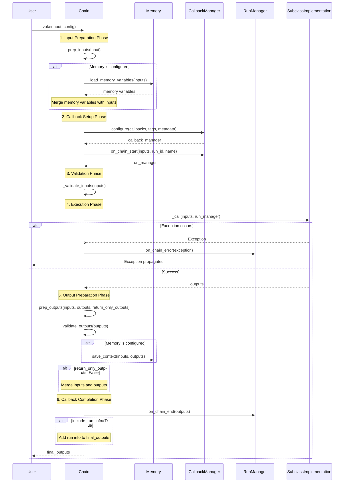

# Chain Base Class API Reference

## Overview

The `Chain` class is the abstract base class for creating structured sequences of calls to components in LangChain. It provides a standardized interface for composing and executing multi-step workflows that can include models, document retrievers, other chains, and more.

**Source:** `libs/langchain/langchain_classic/chains/base.py:52`

## Class Definition

```python
class Chain(RunnableSerializable[dict[str, Any], dict[str, Any]], ABC):
    """Abstract base class for creating structured sequences of calls to components."""
```

The Chain class inherits from `RunnableSerializable` with both input and output types as `dict[str, Any]`, making it compatible with the LCEL (LangChain Expression Language) composition system.

## Key Features

- **Stateful**: Add Memory to any Chain to give it state across invocations
- **Observable**: Pass Callbacks to execute additional functionality like logging
- **Composable**: Flexible API allows combining Chains with other components
- **Async Support**: Full support for both synchronous and asynchronous execution

## Properties

### Required Fields

#### memory

```python
memory: BaseMemory | None = None
```

Optional memory object that gets called at the start and end of every chain execution.

- **At Start**: Memory loads variables and passes them along in the chain
- **At End**: Memory saves any returned variables for future reference

**Source:** `libs/langchain/langchain_classic/chains/base.py:75`

#### callbacks

```python
callbacks: Callbacks = Field(default=None, exclude=True)
```

Optional list of callback handlers (or callback manager) called throughout the chain lifecycle:
- `on_chain_start`: Called when chain execution begins
- `on_chain_end`: Called when chain completes successfully
- `on_chain_error`: Called when chain encounters an error

**Source:** `libs/langchain/langchain_classic/chains/base.py:82`

#### verbose

```python
verbose: bool = Field(default_factory=_get_verbosity)
```

Whether to run in verbose mode. In verbose mode, intermediate logs are printed to console. Defaults to the global `verbose` value accessible via `langchain.globals.get_verbose()`.

**Source:** `libs/langchain/langchain_classic/chains/base.py:88`

#### tags

```python
tags: list[str] | None = None
```

Optional list of tags associated with the chain. Tags are passed to callback handlers and can be used to identify specific chain instances or use cases.

**Source:** `libs/langchain/langchain_classic/chains/base.py:92`

#### metadata

```python
metadata: dict[str, Any] | None = None
```

Optional metadata dictionary associated with the chain. Metadata is passed to callback handlers for tracking and logging purposes.

**Source:** `libs/langchain/langchain_classic/chains/base.py:98`

### Abstract Properties

Subclasses must implement these properties to define their input/output contracts.

#### input_keys

```python
@property
@abstractmethod
def input_keys(self) -> list[str]:
    """Keys expected to be in the chain input."""
```

List of dictionary keys that the chain expects in its input. These keys define the required input structure for the chain.

**Source:** `libs/langchain/langchain_classic/chains/base.py:280`

**Example:**
```python
class MyChain(Chain):
    @property
    def input_keys(self) -> list[str]:
        return ["question", "context"]
```

#### output_keys

```python
@property
@abstractmethod
def output_keys(self) -> list[str]:
    """Keys expected to be in the chain output."""
```

List of dictionary keys that the chain will produce in its output. These keys define the structure of the chain's results.

**Source:** `libs/langchain/langchain_classic/chains/base.py:285`

**Example:**
```python
class MyChain(Chain):
    @property
    def output_keys(self) -> list[str]:
        return ["answer"]
```

## Core Execution Methods

### invoke

```python
def invoke(
    self,
    input: dict[str, Any],
    config: RunnableConfig | None = None,
    **kwargs: Any,
) -> dict[str, Any]:
```

Synchronously execute the chain with the provided input.

**Args:**
- `input` (dict[str, Any]): Dictionary containing all required inputs as specified in `input_keys`, except for inputs that will be loaded from memory
- `config` (RunnableConfig | None): Optional configuration for this chain run including:
  - `callbacks`: Runtime callbacks to use
  - `tags`: Runtime tags to add
  - `metadata`: Runtime metadata
  - `run_name`: Name for this specific run
  - `run_id`: Unique identifier for this run
- `**kwargs`: Additional keyword arguments:
  - `include_run_info` (bool): Whether to include run info in response (default: False)
  - `return_only_outputs` (bool): Whether to return only outputs without inputs (default: False)

**Returns:**
- dict[str, Any]: Dictionary containing chain outputs. Structure depends on `return_only_outputs`:
  - If `True`: Only keys specified in `output_keys`
  - If `False`: Both input keys and output keys

**Raises:**
- ValueError: If required input keys are missing
- ValueError: If output validation fails
- BaseException: Any exception raised during chain execution (propagated after calling `on_chain_error`)

**Source:** `libs/langchain/langchain_classic/chains/base.py:131`

**Example:**
```python
from langchain_classic.chains import LLMChain
from langchain_classic.prompts import PromptTemplate
from langchain_openai import OpenAI

# Create a simple chain
llm = OpenAI(temperature=0.7)
prompt = PromptTemplate(
    input_variables=["topic"],
    template="Write a haiku about {topic}",
)
chain = LLMChain(llm=llm, prompt=prompt)

# Invoke the chain
result = chain.invoke({"topic": "artificial intelligence"})
print(result)
# Output: {"topic": "artificial intelligence", "text": "Silicon minds awake..."}

# Invoke with return_only_outputs=True
result = chain.invoke(
    {"topic": "nature"},
    return_only_outputs=True
)
print(result)
# Output: {"text": "Rivers flow gently..."}
```

### ainvoke

```python
async def ainvoke(
    self,
    input: dict[str, Any],
    config: RunnableConfig | None = None,
    **kwargs: Any,
) -> dict[str, Any]:
```

Asynchronously execute the chain with the provided input.

**Args:**
- `input` (dict[str, Any]): Dictionary containing all required inputs as specified in `input_keys`
- `config` (RunnableConfig | None): Optional configuration (same structure as `invoke`)
- `**kwargs`: Additional keyword arguments (same as `invoke`)

**Returns:**
- dict[str, Any]: Dictionary containing chain outputs

**Raises:**
- ValueError: If required input keys are missing
- ValueError: If output validation fails
- BaseException: Any exception raised during chain execution

**Source:** `libs/langchain/langchain_classic/chains/base.py:187`

**Example:**
```python
import asyncio
from langchain_classic.chains import LLMChain
from langchain_openai import OpenAI

async def run_chain():
    chain = LLMChain(llm=OpenAI(), prompt=prompt)
    result = await chain.ainvoke({"topic": "space"})
    return result

# Run async
result = asyncio.run(run_chain())
```

## Abstract Methods

Subclasses must implement these methods to define their execution logic.

### _call

```python
@abstractmethod
def _call(
    self,
    inputs: dict[str, Any],
    run_manager: CallbackManagerForChainRun | None = None,
) -> dict[str, Any]:
```

Execute the chain's core logic. This is a private method called within `invoke()`.

**Args:**
- `inputs` (dict[str, Any]): Dictionary of named inputs to the chain. Contains all inputs specified in `input_keys`, including any inputs added by memory
- `run_manager` (CallbackManagerForChainRun | None): Callbacks manager for this chain run. Use to trigger custom callback events

**Returns:**
- dict[str, Any]: Dictionary of named outputs. Must contain all outputs specified in `output_keys`

**Source:** `libs/langchain/langchain_classic/chains/base.py:318`

**Implementation Example:**
```python
class SimpleChain(Chain):
    @property
    def input_keys(self) -> list[str]:
        return ["input"]
    
    @property
    def output_keys(self) -> list[str]:
        return ["output"]
    
    def _call(
        self,
        inputs: dict[str, Any],
        run_manager: CallbackManagerForChainRun | None = None,
    ) -> dict[str, Any]:
        # Custom chain logic here
        result = self.process(inputs["input"])
        
        # Optional: Use run_manager for logging
        if run_manager:
            run_manager.on_text(f"Processed: {result}")
        
        return {"output": result}
```

### _acall

```python
async def _acall(
    self,
    inputs: dict[str, Any],
    run_manager: AsyncCallbackManagerForChainRun | None = None,
) -> dict[str, Any]:
```

Asynchronously execute the chain's core logic. Default implementation runs `_call` in an executor.

**Args:**
- `inputs` (dict[str, Any]): Dictionary of named inputs
- `run_manager` (AsyncCallbackManagerForChainRun | None): Async callbacks manager

**Returns:**
- dict[str, Any]: Dictionary of named outputs

**Source:** `libs/langchain/langchain_classic/chains/base.py:340`

**Note:** Override this method if your chain has native async operations. The default implementation uses `run_in_executor` to run the synchronous `_call` method.

## Input/Output Preparation Methods

### prep_inputs

```python
def prep_inputs(self, inputs: dict[str, Any] | Any) -> dict[str, str]:
```

Prepare chain inputs, including adding inputs from memory.

**Args:**
- `inputs` (dict[str, Any] | Any): Dictionary of raw inputs, or single input if chain expects only one parameter. Should contain all inputs specified in `input_keys` except for inputs that will be set by the chain's memory

**Returns:**
- dict[str, str]: Dictionary of all inputs, including those added by the chain's memory

**Source:** `libs/langchain/langchain_classic/chains/base.py:521`

**Behavior:**
1. If `inputs` is not a dict, converts it to dict using the single input key
2. If memory is configured, loads memory variables via `memory.load_memory_variables()`
3. Merges memory variables with provided inputs

**Example:**
```python
# Chain expects {"question": str}
# Memory provides {"history": str}

inputs = prep_inputs({"question": "What is AI?"})
# Returns: {"question": "What is AI?", "history": "Previous conversation..."}
```

### aprep_inputs

```python
async def aprep_inputs(self, inputs: dict[str, Any] | Any) -> dict[str, str]:
```

Asynchronously prepare chain inputs, including adding inputs from memory.

**Args:**
- `inputs` (dict[str, Any] | Any): Raw inputs

**Returns:**
- dict[str, str]: Dictionary of all inputs including memory variables

**Source:** `libs/langchain/langchain_classic/chains/base.py:545`

### prep_outputs

```python
def prep_outputs(
    self,
    inputs: dict[str, str],
    outputs: dict[str, str],
    return_only_outputs: bool = False,
) -> dict[str, str]:
```

Validate and prepare chain outputs, and save info about this run to memory.

**Args:**
- `inputs` (dict[str, str]): Dictionary of chain inputs, including any inputs added by chain memory
- `outputs` (dict[str, str]): Dictionary of initial chain outputs
- `return_only_outputs` (bool): Whether to only return the chain outputs. If `False`, inputs are also added to the final outputs (default: False)

**Returns:**
- dict[str, str]: Final chain outputs

**Source:** `libs/langchain/langchain_classic/chains/base.py:471`

**Behavior:**
1. Validates outputs contain all required keys via `_validate_outputs()`
2. If memory is configured, saves context via `memory.save_context(inputs, outputs)`
3. Returns outputs only or merged inputs+outputs based on `return_only_outputs`

### aprep_outputs

```python
async def aprep_outputs(
    self,
    inputs: dict[str, str],
    outputs: dict[str, str],
    return_only_outputs: bool = False,
) -> dict[str, str]:
```

Asynchronously validate and prepare chain outputs, and save info to memory.

**Args:**
- `inputs` (dict[str, str]): Chain inputs
- `outputs` (dict[str, str]): Chain outputs
- `return_only_outputs` (bool): Whether to return only outputs (default: False)

**Returns:**
- dict[str, str]: Final chain outputs

**Source:** `libs/langchain/langchain_classic/chains/base.py:496`

## Validation Methods

### _validate_inputs

```python
def _validate_inputs(self, inputs: Any) -> None:
```

Check that all required inputs are present.

**Args:**
- `inputs` (Any): Inputs to validate

**Raises:**
- ValueError: If inputs is not a dict when multiple input keys are expected
- ValueError: If any required input keys are missing

**Source:** `libs/langchain/langchain_classic/chains/base.py:289`

### _validate_outputs

```python
def _validate_outputs(self, outputs: dict[str, Any]) -> None:
```

Check that all required outputs are present.

**Args:**
- `outputs` (dict[str, Any]): Outputs to validate

**Raises:**
- ValueError: If any required output keys are missing

**Source:** `libs/langchain/langchain_classic/chains/base.py:311`

## Schema Methods

### get_input_schema

```python
def get_input_schema(
    self,
    config: RunnableConfig | None = None,
) -> type[BaseModel]:
```

Get a Pydantic model representing the input schema.

**Args:**
- `config` (RunnableConfig | None): Optional configuration

**Returns:**
- type[BaseModel]: Dynamically created Pydantic model with fields matching `input_keys`

**Source:** `libs/langchain/langchain_classic/chains/base.py:112`

### get_output_schema

```python
def get_output_schema(
    self,
    config: RunnableConfig | None = None,
) -> type[BaseModel]:
```

Get a Pydantic model representing the output schema.

**Args:**
- `config` (RunnableConfig | None): Optional configuration

**Returns:**
- type[BaseModel]: Dynamically created Pydantic model with fields matching `output_keys`

**Source:** `libs/langchain/langchain_classic/chains/base.py:120`

## Utility Methods

### dict

```python
def dict(self, **kwargs: Any) -> dict:
```

Get dictionary representation of the chain.

**Args:**
- `**kwargs`: Keyword arguments passed to Pydantic's `model_dump` method

**Returns:**
- dict: Dictionary representation including `_type` field if `_chain_type` is implemented

**Source:** `libs/langchain/langchain_classic/chains/base.py:735`

**Example:**
```python
chain_dict = chain.dict(exclude_unset=True)
# Returns: {"_type": "llm_chain", "verbose": False, ...}
```

### save

```python
def save(self, file_path: Path | str) -> None:
```

Save the chain to a file.

**Args:**
- `file_path` (Path | str): Path to save the chain to (`.json`, `.yaml`, or `.yml` extension)

**Raises:**
- ValueError: If chain has memory (saving memory not supported)
- NotImplementedError: If chain doesn't implement `_chain_type`
- ValueError: If file extension is not `.json`, `.yaml`, or `.yml`

**Source:** `libs/langchain/langchain_classic/chains/base.py:759`

**Example:**
```python
chain.save("path/to/chain.yaml")
```

## Deprecated Methods

### \_\_call\_\_ (Deprecated)

```python
@deprecated("0.1.0", alternative="invoke", removal="1.0")
def __call__(
    self,
    inputs: dict[str, Any] | Any,
    return_only_outputs: bool = False,
    callbacks: Callbacks = None,
    *,
    tags: list[str] | None = None,
    metadata: dict[str, Any] | None = None,
    run_name: str | None = None,
    include_run_info: bool = False,
) -> dict[str, Any]:
```

**Deprecated since:** 0.1.0  
**Removal planned:** 1.0  
**Alternative:** Use `invoke()` instead

Execute the chain using the callable interface.

**Source:** `libs/langchain/langchain_classic/chains/base.py:368`

**Migration Example:**
```python
# Old (deprecated)
result = chain({"input": "value"})

# New (recommended)
result = chain.invoke({"input": "value"})
```

### acall (Deprecated)

```python
@deprecated("0.1.0", alternative="ainvoke", removal="1.0")
async def acall(
    self,
    inputs: dict[str, Any] | Any,
    return_only_outputs: bool = False,
    callbacks: Callbacks = None,
    *,
    tags: list[str] | None = None,
    metadata: dict[str, Any] | None = None,
    run_name: str | None = None,
    include_run_info: bool = False,
) -> dict[str, Any]:
```

**Deprecated since:** 0.1.0  
**Removal planned:** 1.0  
**Alternative:** Use `ainvoke()` instead

**Source:** `libs/langchain/langchain_classic/chains/base.py:420`

### run (Deprecated)

```python
@deprecated("0.1.0", alternative="invoke", removal="1.0")
def run(
    self,
    *args: Any,
    callbacks: Callbacks = None,
    tags: list[str] | None = None,
    metadata: dict[str, Any] | None = None,
    **kwargs: Any,
) -> Any:
```

**Deprecated since:** 0.1.0  
**Removal planned:** 1.0  
**Alternative:** Use `invoke()` instead

Convenience method that accepts positional/keyword arguments instead of a dictionary.

**Source:** `libs/langchain/langchain_classic/chains/base.py:579`

**Migration Example:**
```python
# Old (deprecated)
result = chain.run("What is AI?")

# New (recommended)
result = chain.invoke({"question": "What is AI?"})["answer"]
```

### arun (Deprecated)

```python
@deprecated("0.1.0", alternative="ainvoke", removal="1.0")
async def arun(
    self,
    *args: Any,
    callbacks: Callbacks = None,
    tags: list[str] | None = None,
    metadata: dict[str, Any] | None = None,
    **kwargs: Any,
) -> Any:
```

**Deprecated since:** 0.1.0  
**Removal planned:** 1.0  
**Alternative:** Use `ainvoke()` instead

**Source:** `libs/langchain/langchain_classic/chains/base.py:653`

### apply (Deprecated)

```python
@deprecated("0.1.0", alternative="batch", removal="1.0")
def apply(
    self,
    input_list: list[dict[str, Any]],
    callbacks: Callbacks = None,
) -> list[dict[str, str]]:
```

**Deprecated since:** 0.1.0  
**Removal planned:** 1.0  
**Alternative:** Use `batch()` instead

Call the chain on all inputs in the list.

**Source:** `libs/langchain/langchain_classic/chains/base.py:799`

**Migration Example:**
```python
# Old (deprecated)
results = chain.apply([{"input": "1"}, {"input": "2"}])

# New (recommended)
results = chain.batch([{"input": "1"}, {"input": "2"}])
```

## Chain Execution Lifecycle

The following Mermaid sequence diagram illustrates the complete execution flow when a chain is invoked:



### Lifecycle Phases Explained

1. **Input Preparation Phase** (`prep_inputs`):
   - Converts single inputs to dictionary format if needed
   - Loads variables from memory if configured
   - Merges memory variables with provided inputs

2. **Callback Setup Phase**:
   - Configures callback manager with runtime and instance callbacks
   - Calls `on_chain_start` to signal chain execution beginning
   - Creates run manager for tracking this specific execution

3. **Validation Phase** (`_validate_inputs`):
   - Verifies all required input keys are present
   - Checks input format is correct
   - Raises ValueError if validation fails

4. **Execution Phase** (`_call`):
   - Invokes subclass-specific implementation
   - Passes run_manager for custom callback events
   - Captures any exceptions for error handling

5. **Output Preparation Phase** (`prep_outputs`):
   - Validates output structure via `_validate_outputs`
   - Saves context to memory if configured
   - Merges inputs with outputs (unless return_only_outputs=True)

6. **Callback Completion Phase**:
   - Calls `on_chain_end` to signal successful completion
   - Adds run info if requested
   - Returns final outputs to user

### Error Handling Flow

When an exception occurs during execution:

1. Exception is caught in the `invoke` method's try-except block
2. `run_manager.on_chain_error(exception)` is called to notify all callback handlers
3. Exception is re-raised to the caller
4. `on_chain_end` is NOT called (only `on_chain_error`)

## Memory Integration Patterns

### Memory Loading (at Chain Start)

```python
def prep_inputs(self, inputs: dict[str, Any] | Any) -> dict[str, str]:
    # ... input normalization ...
    
    if self.memory is not None:
        # Load memory variables (e.g., conversation history)
        external_context = self.memory.load_memory_variables(inputs)
        # Merge with provided inputs
        inputs = dict(inputs, **external_context)
    
    return inputs
```

**Use Case:** Add conversation history, retrieved context, or other stateful information before chain execution.

### Memory Saving (at Chain End)

```python
def prep_outputs(
    self,
    inputs: dict[str, str],
    outputs: dict[str, str],
    return_only_outputs: bool = False,
) -> dict[str, str]:
    self._validate_outputs(outputs)
    
    if self.memory is not None:
        # Save this interaction to memory
        self.memory.save_context(inputs, outputs)
    
    # ... prepare final outputs ...
```

**Use Case:** Store conversation turns, cache results, or update stateful information after chain execution.

### Memory Integration Example

```python
from langchain_classic.chains import LLMChain
from langchain_classic.memory import ConversationBufferMemory
from langchain_classic.prompts import PromptTemplate
from langchain_openai import OpenAI

# Create chain with memory
memory = ConversationBufferMemory(
    memory_key="chat_history",
    input_key="question",
    output_key="answer",
)

prompt = PromptTemplate(
    input_variables=["chat_history", "question"],
    template="""Previous conversation:
{chat_history}

Current question: {question}

Answer:""",
)

chain = LLMChain(
    llm=OpenAI(),
    prompt=prompt,
    memory=memory,
    output_key="answer",
)

# First invocation
result1 = chain.invoke({"question": "What is LangChain?"})
# Memory saves: {"question": "What is LangChain?", "answer": "LangChain is..."}

# Second invocation - memory automatically includes chat_history
result2 = chain.invoke({"question": "What are its key features?"})
# Input is enriched with chat_history from memory
# Output saves new turn to memory
```

## Callback Orchestration

### Callback Hierarchy

Callbacks are configured with a hierarchical merging strategy:

1. **Instance Callbacks**: Callbacks set during chain construction (`chain = Chain(callbacks=[...])`)
2. **Runtime Callbacks**: Callbacks passed to `invoke()` or `ainvoke()`
3. **Tags**: Both instance tags and runtime tags are combined
4. **Metadata**: Both instance metadata and runtime metadata are merged

### CallbackManagerForChainRun

The `run_manager` passed to `_call()` provides methods for custom callback events:

```python
def _call(
    self,
    inputs: dict[str, Any],
    run_manager: CallbackManagerForChainRun | None = None,
) -> dict[str, Any]:
    # Log intermediate text
    if run_manager:
        run_manager.on_text("Processing step 1...")
    
    # Process step 1
    intermediate_result = self.step1(inputs)
    
    # Log more intermediate information
    if run_manager:
        run_manager.on_text(f"Step 1 result: {intermediate_result}")
    
    # Continue processing...
    final_result = self.step2(intermediate_result)
    
    return {"output": final_result}
```

### Available Callback Methods in RunManager

- `on_text(text: str)`: Log arbitrary text during execution
- `on_chain_error(error: BaseException)`: Automatically called on error (don't call manually in `_call`)

### Callback Event Sequence

For a typical chain execution:

1. `on_chain_start(serialized, inputs)` - Chain execution begins
2. Custom events (via `run_manager.on_text()`) - During `_call()` execution
3. `on_chain_end(outputs)` - Chain completes successfully
   
OR (on error):

3. `on_chain_error(error)` - Chain encounters exception

## Implementation Guide

### Creating a Custom Chain

```python
from typing import Any
from langchain_classic.chains.base import Chain
from langchain_core.callbacks import CallbackManagerForChainRun

class CustomProcessingChain(Chain):
    """Custom chain that processes text through multiple steps."""
    
    # Define configuration fields
    processor_name: str = "default"
    max_length: int = 1000
    
    @property
    def input_keys(self) -> list[str]:
        """Chain expects 'text' input."""
        return ["text"]
    
    @property
    def output_keys(self) -> list[str]:
        """Chain produces 'processed_text' and 'metadata' outputs."""
        return ["processed_text", "metadata"]
    
    def _call(
        self,
        inputs: dict[str, Any],
        run_manager: CallbackManagerForChainRun | None = None,
    ) -> dict[str, Any]:
        """Execute processing steps."""
        text = inputs["text"]
        
        # Step 1: Clean text
        if run_manager:
            run_manager.on_text("Step 1: Cleaning text...")
        cleaned_text = self.clean_text(text)
        
        # Step 2: Process text
        if run_manager:
            run_manager.on_text("Step 2: Processing text...")
        processed_text = self.process_text(cleaned_text)
        
        # Step 3: Truncate if needed
        if len(processed_text) > self.max_length:
            if run_manager:
                run_manager.on_text(f"Step 3: Truncating to {self.max_length} chars...")
            processed_text = processed_text[:self.max_length]
        
        # Prepare outputs
        metadata = {
            "processor": self.processor_name,
            "original_length": len(text),
            "final_length": len(processed_text),
            "truncated": len(processed_text) >= self.max_length,
        }
        
        return {
            "processed_text": processed_text,
            "metadata": metadata,
        }
    
    def clean_text(self, text: str) -> str:
        """Clean text implementation."""
        return text.strip().lower()
    
    def process_text(self, text: str) -> str:
        """Process text implementation."""
        # Custom processing logic
        return text.replace("\n", " ")
    
    @property
    def _chain_type(self) -> str:
        """Return chain type for serialization."""
        return "custom_processing"

# Usage
chain = CustomProcessingChain(
    processor_name="v1",
    max_length=500,
    verbose=True,
)

result = chain.invoke({
    "text": "This is a long text that needs processing..."
})

print(result["processed_text"])
print(result["metadata"])
```

### Implementing Async Support

```python
import asyncio
from typing import Any
from langchain_classic.chains.base import Chain
from langchain_core.callbacks import (
    CallbackManagerForChainRun,
    AsyncCallbackManagerForChainRun,
)

class AsyncProcessingChain(Chain):
    """Chain with native async support."""
    
    @property
    def input_keys(self) -> list[str]:
        return ["text"]
    
    @property
    def output_keys(self) -> list[str]:
        return ["result"]
    
    def _call(
        self,
        inputs: dict[str, Any],
        run_manager: CallbackManagerForChainRun | None = None,
    ) -> dict[str, Any]:
        """Synchronous implementation."""
        # Fallback sync implementation
        return {"result": self.sync_process(inputs["text"])}
    
    async def _acall(
        self,
        inputs: dict[str, Any],
        run_manager: AsyncCallbackManagerForChainRun | None = None,
    ) -> dict[str, Any]:
        """Async implementation with native async operations."""
        text = inputs["text"]
        
        if run_manager:
            await run_manager.on_text("Starting async processing...")
        
        # Use actual async operations
        result = await self.async_process(text)
        
        if run_manager:
            await run_manager.on_text("Async processing complete")
        
        return {"result": result}
    
    def sync_process(self, text: str) -> str:
        """Synchronous processing."""
        return text.upper()
    
    async def async_process(self, text: str) -> str:
        """Asynchronous processing."""
        await asyncio.sleep(0.1)  # Simulate async I/O
        return text.upper()

# Usage
chain = AsyncProcessingChain()

# Async invocation
async def main():
    result = await chain.ainvoke({"text": "hello world"})
    print(result)

asyncio.run(main())
```

## Best Practices

### 1. Always Implement Required Abstract Methods

```python
# ✅ Good: All required methods implemented
class MyChain(Chain):
    @property
    def input_keys(self) -> list[str]:
        return ["input"]
    
    @property
    def output_keys(self) -> list[str]:
        return ["output"]
    
    def _call(self, inputs, run_manager=None):
        return {"output": self.process(inputs["input"])}

# ❌ Bad: Missing required implementations
class IncompleteChain(Chain):
    def _call(self, inputs, run_manager=None):
        return {"output": "result"}
    # Missing input_keys and output_keys properties!
```

### 2. Use run_manager for Observable Chains

```python
# ✅ Good: Logging intermediate steps
def _call(self, inputs, run_manager=None):
    if run_manager:
        run_manager.on_text("Starting processing...")
    
    result = self.process(inputs)
    
    if run_manager:
        run_manager.on_text(f"Processed {len(result)} items")
    
    return {"output": result}

# ❌ Bad: No observability
def _call(self, inputs, run_manager=None):
    result = self.process(inputs)  # Black box execution
    return {"output": result}
```

### 3. Validate Inputs and Outputs

```python
# ✅ Good: Validation is automatic via _validate_inputs/_validate_outputs
# Just ensure your input_keys and output_keys are correct

@property
def input_keys(self) -> list[str]:
    return ["question", "context"]  # Both required

@property
def output_keys(self) -> list[str]:
    return ["answer"]  # Required output

def _call(self, inputs, run_manager=None):
    # inputs is guaranteed to have "question" and "context"
    answer = self.generate_answer(
        inputs["question"],
        inputs["context"]
    )
    # Must return dict with "answer" key
    return {"answer": answer}
```

### 4. Handle Memory Correctly

```python
# ✅ Good: Memory is handled automatically by prep_inputs/prep_outputs
# Just configure it during chain initialization

chain = MyChain(
    memory=ConversationBufferMemory(
        memory_key="history",
        input_key="question",
        output_key="answer",
    )
)

# ❌ Bad: Don't manually call memory methods in _call
def _call(self, inputs, run_manager=None):
    # DON'T DO THIS - prep_inputs already loaded memory
    history = self.memory.load_memory_variables(inputs)
    
    result = self.process(inputs, history)
    
    # DON'T DO THIS - prep_outputs will save memory
    self.memory.save_context(inputs, result)
    
    return result
```

### 5. Prefer invoke/ainvoke Over Deprecated Methods

```python
# ✅ Good: Use modern invoke API
result = chain.invoke({"input": "value"})

# ❌ Bad: Using deprecated __call__
result = chain({"input": "value"})  # Deprecated

# ❌ Bad: Using deprecated run
result = chain.run("value")  # Deprecated
```

### 6. Implement _chain_type for Serialization

```python
# ✅ Good: Enable saving/loading
class MyChain(Chain):
    @property
    def _chain_type(self) -> str:
        return "my_custom_chain"
    
    # ... other methods ...

# Now you can save the chain
chain.save("chain.yaml")

# ❌ Bad: No _chain_type means can't save
class MyChain(Chain):
    # Missing _chain_type property
    pass

chain.save("chain.yaml")  # Raises NotImplementedError
```

## Common Pitfalls

### Pitfall 1: Incorrect Input/Output Keys

```python
# ❌ Problem: input_keys don't match _call expectations
class BrokenChain(Chain):
    @property
    def input_keys(self) -> list[str]:
        return ["query"]  # Says it needs "query"
    
    def _call(self, inputs, run_manager=None):
        # But tries to access "question"!
        question = inputs["question"]  # KeyError!
        return {"answer": self.process(question)}

# ✅ Solution: Keep input_keys and _call in sync
class FixedChain(Chain):
    @property
    def input_keys(self) -> list[str]:
        return ["question"]  # Matches what _call uses
    
    def _call(self, inputs, run_manager=None):
        question = inputs["question"]  # ✓ Consistent
        return {"answer": self.process(question)}
```

### Pitfall 2: Not Returning All Output Keys

```python
# ❌ Problem: Declared output_keys but didn't return all
class BrokenChain(Chain):
    @property
    def output_keys(self) -> list[str]:
        return ["answer", "confidence"]  # Promises two outputs
    
    def _call(self, inputs, run_manager=None):
        return {"answer": "result"}  # Only returns one! ValueError

# ✅ Solution: Return all declared outputs
class FixedChain(Chain):
    @property
    def output_keys(self) -> list[str]:
        return ["answer", "confidence"]
    
    def _call(self, inputs, run_manager=None):
        return {
            "answer": "result",
            "confidence": 0.95,  # All declared keys present
        }
```

### Pitfall 3: Blocking Async Implementation

```python
# ❌ Problem: Sync operations in async method
class BrokenAsyncChain(Chain):
    async def _acall(self, inputs, run_manager=None):
        # Blocking I/O in async method!
        result = self.blocking_api_call()  # Blocks event loop
        return {"output": result}

# ✅ Solution: Use native async operations
class FixedAsyncChain(Chain):
    async def _acall(self, inputs, run_manager=None):
        # Non-blocking async I/O
        result = await self.async_api_call()
        return {"output": result}
```

### Pitfall 4: Catching Exceptions Without Re-raising

```python
# ❌ Problem: Swallowing exceptions prevents proper callback handling
class BrokenChain(Chain):
    def _call(self, inputs, run_manager=None):
        try:
            result = self.risky_operation()
        except Exception as e:
            # Swallowing exception - callbacks won't be notified!
            return {"output": "error"}

# ✅ Solution: Let exceptions propagate (invoke will handle them)
class FixedChain(Chain):
    def _call(self, inputs, run_manager=None):
        # Let exceptions bubble up - invoke's try/except will:
        # 1. Call run_manager.on_chain_error(e)
        # 2. Re-raise the exception
        result = self.risky_operation()
        return {"output": result}
```

## Related Documentation

- [LLMChain API Reference](./llm-chain.md) - Most common chain implementation
- [Sequential Chain API Reference](./sequential.md) - Composing multiple chains
- [Retrieval Chain API Reference](./retrieval.md) - Chains with document retrieval
- [LCEL Composition Guide](../../guides/lcel-composition.md) - Modern chain composition patterns
- [Memory Integration Guide](../../guides/memory-integration.md) - Using memory with chains
- [Callbacks Guide](../../guides/callbacks.md) - Implementing custom callbacks
- [Chain Lifecycle Architecture](../../architecture/chain-lifecycle.md) - Deep dive into execution flow

## Version Information

- **Introduced**: LangChain Classic 0.1.0
- **Current Status**: Stable API
- **Deprecation Notes**: 
  - `__call__`, `acall`, `run`, `arun`, `apply` methods deprecated in 0.1.0
  - Removal planned in 1.0
  - Use `invoke`, `ainvoke`, `batch` instead

**Last Updated**: 2024  
**Source File**: `libs/langchain/langchain_classic/chains/base.py`
