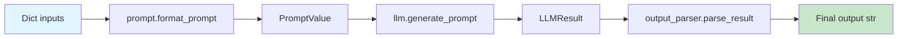

# LLMChain API Reference

!!! warning "Deprecated"
    **LLMChain is deprecated since version 0.1.17 and will be removed in version 1.0.**
    
    Please use LangChain Expression Language (LCEL) for chain composition instead:
    
    ```python
    # Modern LCEL approach (recommended)
    from langchain_core.output_parsers import StrOutputParser
    from langchain_core.prompts import PromptTemplate
    from langchain_openai import OpenAI
    
    chain = prompt | model | StrOutputParser()
    ```
    
    See the [Migration Guide](#migration-guide) below for detailed conversion instructions.

## Overview

`LLMChain` is a legacy chain implementation that formats a prompt template with input variables and calls a language model to generate a response. While functional, it has been superseded by the more flexible and type-safe LCEL composition pattern.

**Source:** `libs/langchain/langchain_classic/chains/llm.py:45-423`

## Class Definition

```python
class LLMChain(Chain):
    """Chain to run queries against LLMs using prompt templates.
    
    This class provides a structured way to combine prompt templates with
    language models, supporting both synchronous and asynchronous execution,
    batch processing, and custom output parsing.
    """
```

## Constructor Parameters

### Required Parameters

#### `prompt`

**Type:** `BasePromptTemplate`

**Description:** The prompt template that defines the structure of inputs to the language model. The template's `input_variables` determine what keys must be provided in input dictionaries.

**Example:**
```python
from langchain_core.prompts import PromptTemplate

prompt = PromptTemplate(
    input_variables=["adjective", "content"],
    template="Tell me a {adjective} joke about {content}"
)
```

**Source:** `libs/langchain/langchain_classic/chains/llm.py:81-82`

---

#### `llm`

**Type:** `Runnable[LanguageModelInput, str] | Runnable[LanguageModelInput, BaseMessage]`

**Description:** The language model to invoke. Accepts any Runnable that takes `LanguageModelInput` (strings, messages, or prompt values) and returns either a string or `BaseMessage`. This includes:
- `BaseLanguageModel` instances (OpenAI, Anthropic, etc.)
- `RunnableBinding` with bound parameters
- `RunnableWithFallbacks` for error recovery
- `RunnableBranch` for conditional logic

**Example:**
```python
from langchain_openai import OpenAI

llm = OpenAI(temperature=0.7)
chain = LLMChain(llm=llm, prompt=prompt)
```

**Source:** `libs/langchain/langchain_classic/chains/llm.py:83-84`

---

### Optional Parameters

#### `output_key`

**Type:** `str`

**Default:** `"text"`

**Description:** The key used to store the parsed output in the result dictionary. When `return_final_only=True`, the output dictionary will contain only this key.

**Source:** `libs/langchain/langchain_classic/chains/llm.py:85`

---

#### `output_parser`

**Type:** `BaseLLMOutputParser`

**Default:** `StrOutputParser()`

**Description:** Parser to transform the raw LLM output. The default `StrOutputParser` extracts the text content without modification. Custom parsers can extract structured data, JSON, or apply transformations.

**Example with custom parser:**
```python
from langchain_core.output_parsers import JsonOutputParser

parser = JsonOutputParser()
chain = LLMChain(llm=llm, prompt=prompt, output_parser=parser)
```

**Source:** `libs/langchain/langchain_classic/chains/llm.py:86-89`

---

#### `return_final_only`

**Type:** `bool`

**Default:** `True`

**Description:** Controls the structure of returned outputs:
- `True`: Returns only `{output_key: parsed_result}`
- `False`: Returns `{output_key: parsed_result, "full_generation": LLMResult}`

The `full_generation` includes token usage, model information, and raw generation details.

**Source:** `libs/langchain/langchain_classic/chains/llm.py:90-92`

---

#### `llm_kwargs`

**Type:** `dict`

**Default:** `{}`

**Description:** Additional keyword arguments passed to the language model during invocation. Common parameters include `temperature`, `max_tokens`, `stop` sequences, etc.

**Example:**
```python
chain = LLMChain(
    llm=llm,
    prompt=prompt,
    llm_kwargs={"temperature": 0.9, "max_tokens": 150}
)
```

**Source:** `libs/langchain/langchain_classic/chains/llm.py:93`

---

## Properties

### `input_keys`

**Type:** `list[str]`

**Description:** Returns the list of input variable names required by the prompt template. These are the keys that must be present in input dictionaries passed to `invoke()`, `predict()`, or `apply()`.

**Source:** `libs/langchain/langchain_classic/chains/llm.py:101-106`

---

### `output_keys`

**Type:** `list[str]`

**Description:** Returns the list of keys present in output dictionaries:
- If `return_final_only=True`: `[output_key]`
- If `return_final_only=False`: `[output_key, "full_generation"]`

**Source:** `libs/langchain/langchain_classic/chains/llm.py:109-116`

---

## Core Methods

### `predict()`

```python
def predict(
    self,
    callbacks: Callbacks = None,
    **kwargs: Any
) -> str
```

**Description:** Formats the prompt with provided keyword arguments and invokes the LLM to generate a single response. This is the primary method for single-input predictions.

**Args:**
- `callbacks` (`Callbacks`, optional): Callback handlers to monitor execution (e.g., logging, tracing).
- `**kwargs` (`Any`): Key-value pairs matching the prompt's `input_variables`. Each key must correspond to a variable in the template.

**Returns:**
- `str`: The parsed output string from the language model.

**Raises:**
- `KeyError`: If required input variables are missing from kwargs.
- `ValueError`: If provided kwargs don't match template requirements.

**Example:**
```python
from langchain_classic.chains import LLMChain
from langchain_openai import OpenAI
from langchain_core.prompts import PromptTemplate

prompt = PromptTemplate(
    input_variables=["adjective"],
    template="Tell me a {adjective} joke"
)
chain = LLMChain(llm=OpenAI(), prompt=prompt)

# Single prediction
result = chain.predict(adjective="funny")
print(result)  # "Why did the chicken cross the road? To get to the other side!"
```

**Source:** `libs/langchain/langchain_classic/chains/llm.py:306-321`

---

### `apredict()`

```python
async def apredict(
    self,
    callbacks: Callbacks = None,
    **kwargs: Any
) -> str
```

**Description:** Asynchronous version of `predict()`. Formats the prompt and invokes the LLM asynchronously, allowing non-blocking execution in async contexts.

**Args:**
- `callbacks` (`Callbacks`, optional): Callback handlers for async execution monitoring.
- `**kwargs` (`Any`): Key-value pairs for template variables.

**Returns:**
- `str`: The parsed output string from the language model.

**Raises:**
- `KeyError`: If required input variables are missing.
- `ValueError`: If provided kwargs don't match template requirements.

**Example:**
```python
import asyncio
from langchain_classic.chains import LLMChain
from langchain_openai import OpenAI
from langchain_core.prompts import PromptTemplate

async def main():
    prompt = PromptTemplate(
        input_variables=["topic"],
        template="Explain {topic} in simple terms"
    )
    chain = LLMChain(llm=OpenAI(), prompt=prompt)
    
    result = await chain.apredict(topic="quantum computing")
    print(result)

asyncio.run(main())
```

**Source:** `libs/langchain/langchain_classic/chains/llm.py:323-338`

---

### `apply()`

```python
def apply(
    self,
    input_list: list[dict[str, Any]],
    callbacks: Callbacks = None
) -> list[dict[str, str]]
```

**Description:** Processes multiple inputs in a single batch for improved performance. Uses the LLM's `generate()` method internally to minimize network overhead.

**Args:**
- `input_list` (`list[dict[str, Any]]`): List of input dictionaries. Each dictionary must contain all required prompt variables. Optional `"stop"` key can specify stop sequences (must be consistent across all inputs if present).
- `callbacks` (`Callbacks`, optional): Callback handlers for batch execution.

**Returns:**
- `list[dict[str, str]]`: List of output dictionaries, each containing the `output_key` and optionally `"full_generation"` (if `return_final_only=False`).

**Raises:**
- `ValueError`: If "stop" sequences are inconsistent across inputs.
- `KeyError`: If required variables are missing from any input dictionary.

**Example:**
```python
from langchain_classic.chains import LLMChain
from langchain_openai import OpenAI
from langchain_core.prompts import PromptTemplate

prompt = PromptTemplate(
    input_variables=["color"],
    template="Name a {color} fruit"
)
chain = LLMChain(llm=OpenAI(), prompt=prompt)

# Batch processing
inputs = [
    {"color": "red"},
    {"color": "yellow"},
    {"color": "green"}
]
results = chain.apply(inputs)

for result in results:
    print(result["text"])  # "Apple", "Banana", "Lime"
```

**Source:** `libs/langchain/langchain_classic/chains/llm.py:230-253`

---

### `aapply()`

```python
async def aapply(
    self,
    input_list: list[dict[str, Any]],
    callbacks: Callbacks = None
) -> list[dict[str, str]]
```

**Description:** Asynchronous version of `apply()` for non-blocking batch processing.

**Args:**
- `input_list` (`list[dict[str, Any]]`): List of input dictionaries with required prompt variables.
- `callbacks` (`Callbacks`, optional): Async callback handlers.

**Returns:**
- `list[dict[str, str]]`: List of output dictionaries with parsed results.

**Raises:**
- `ValueError`: If "stop" sequences are inconsistent.
- `KeyError`: If required variables are missing.

**Example:**
```python
import asyncio

async def batch_process():
    chain = LLMChain(llm=OpenAI(), prompt=prompt)
    
    inputs = [
        {"topic": "AI"},
        {"topic": "ML"},
        {"topic": "NLP"}
    ]
    results = await chain.aapply(inputs)
    return results

results = asyncio.run(batch_process())
```

**Source:** `libs/langchain/langchain_classic/chains/llm.py:255-278`

---

### `generate()`

```python
def generate(
    self,
    input_list: list[dict[str, Any]],
    run_manager: CallbackManagerForChainRun | None = None
) -> LLMResult
```

**Description:** Generates raw LLM results without output parsing. Returns detailed generation metadata including token counts, model information, and multiple generation candidates (if configured).

**Args:**
- `input_list` (`list[dict[str, Any]]`): List of input dictionaries for batch generation.
- `run_manager` (`CallbackManagerForChainRun | None`, optional): Callback manager for run-level monitoring.

**Returns:**
- `LLMResult`: Object containing:
  - `generations` (`list[list[Generation]]`): Nested list of generation objects
  - `llm_output` (`dict | None`): Model-specific output metadata (token usage, model name, etc.)

**Raises:**
- `ValueError`: If stop sequences are inconsistent or prompt formatting fails.

**Example:**
```python
chain = LLMChain(llm=OpenAI(), prompt=prompt)

inputs = [{"adjective": "funny"}]
llm_result = chain.generate(inputs)

# Access detailed information
generation = llm_result.generations[0][0]
print(f"Text: {generation.text}")
print(f"Token usage: {llm_result.llm_output['token_usage']}")
```

**Source:** `libs/langchain/langchain_classic/chains/llm.py:126-151`

---

### `agenerate()`

```python
async def agenerate(
    self,
    input_list: list[dict[str, Any]],
    run_manager: AsyncCallbackManagerForChainRun | None = None
) -> LLMResult
```

**Description:** Asynchronous version of `generate()` returning raw LLM results with full metadata.

**Args:**
- `input_list` (`list[dict[str, Any]]`): List of input dictionaries.
- `run_manager` (`AsyncCallbackManagerForChainRun | None`, optional): Async callback manager.

**Returns:**
- `LLMResult`: Detailed generation results with metadata.

**Raises:**
- `ValueError`: If stop sequences are inconsistent.

**Source:** `libs/langchain/langchain_classic/chains/llm.py:153-178`

---

## Class Methods

### `from_string()`

```python
@classmethod
def from_string(
    cls,
    llm: BaseLanguageModel,
    template: str
) -> LLMChain
```

**Description:** Factory method to quickly create an LLMChain from a template string without explicitly constructing a `PromptTemplate`.

**Args:**
- `llm` (`BaseLanguageModel`): The language model instance.
- `template` (`str`): Template string with `{variable}` placeholders.

**Returns:**
- `LLMChain`: Configured chain instance.

**Example:**
```python
from langchain_openai import OpenAI

chain = LLMChain.from_string(
    llm=OpenAI(),
    template="Translate '{text}' to {language}"
)

result = chain.predict(text="Hello", language="Spanish")
```

**Source:** `libs/langchain/langchain_classic/chains/llm.py:416-419`

---

## Type Flow Documentation

Understanding the data transformations through LLMChain execution:



**Detailed Type Flow:**

1. **Input Stage:** `dict[str, Any]` - User provides key-value pairs matching prompt variables
2. **Prompt Formatting:** `BasePromptTemplate.format_prompt()` → `PromptValue` - Template renders with variables
3. **LLM Invocation:** `Runnable.generate_prompt()` → `LLMResult` - Language model generates response(s)
4. **Generation Structure:** `LLMResult.generations` → `list[list[Generation]]` - Contains generation objects with text and metadata
5. **Output Parsing:** `BaseLLMOutputParser.parse_result()` → `str` - Parser extracts final result
6. **Output Structure:** `dict[str, str]` - Returns dictionary with `output_key: parsed_result`

**Source:** `libs/langchain/langchain_classic/chains/llm.py:118-124, 284-296`

---

## Deprecated Methods

!!! warning "Deprecated Methods"
    The following methods are deprecated and should not be used in new code:

### `predict_and_parse()`

**Deprecated:** Use an `output_parser` parameter directly in the LLMChain constructor instead.

**Source:** `libs/langchain/langchain_classic/chains/llm.py:340-354`

---

### `apredict_and_parse()`

**Deprecated:** Use an `output_parser` parameter directly in the LLMChain constructor instead.

**Source:** `libs/langchain/langchain_classic/chains/llm.py:356-370`

---

### `apply_and_parse()`

**Deprecated:** Use an `output_parser` parameter directly in the LLMChain constructor instead.

**Source:** `libs/langchain/langchain_classic/chains/llm.py:372-384`

---

### `aapply_and_parse()`

**Deprecated:** Use an `output_parser` parameter directly in the LLMChain constructor instead.

**Source:** `libs/langchain/langchain_classic/chains/llm.py:397-409`

---

## Migration Guide

### Converting LLMChain to LCEL

The modern LCEL approach provides better type safety, composability, and streaming support. Here's how to migrate:

#### Pattern Comparison Table

| LLMChain Pattern | LCEL Equivalent | Benefits |
|------------------|-----------------|----------|
| `LLMChain(llm=model, prompt=prompt)` | `prompt \| model \| StrOutputParser()` | Explicit type flow, streaming support |
| `chain.predict(var=value)` | `chain.invoke({"var": value})` | Consistent API across all runnables |
| `chain.apply([inputs])` | `chain.batch([inputs])` | Better performance, parallel execution |
| `chain.apredict(var=value)` | `await chain.ainvoke({"var": value})` | Native async/await support |

---

### Migration Example 1: Basic Chain

**Before (LLMChain):**
```python
from langchain_classic.chains import LLMChain
from langchain_openai import OpenAI
from langchain_core.prompts import PromptTemplate

prompt = PromptTemplate(
    input_variables=["adjective"],
    template="Tell me a {adjective} joke"
)
chain = LLMChain(llm=OpenAI(), prompt=prompt)

result = chain.predict(adjective="funny")
```

**After (LCEL):**
```python
from langchain_openai import OpenAI
from langchain_core.prompts import PromptTemplate
from langchain_core.output_parsers import StrOutputParser

prompt = PromptTemplate(
    input_variables=["adjective"],
    template="Tell me a {adjective} joke"
)
model = OpenAI()
chain = prompt | model | StrOutputParser()

result = chain.invoke({"adjective": "funny"})
```

---

### Migration Example 2: Custom Output Parser

**Before (LLMChain):**
```python
from langchain_core.output_parsers import JsonOutputParser

chain = LLMChain(
    llm=OpenAI(),
    prompt=prompt,
    output_parser=JsonOutputParser()
)

result = chain.predict(query="list three colors")
```

**After (LCEL):**
```python
from langchain_core.output_parsers import JsonOutputParser

parser = JsonOutputParser()
chain = prompt | model | parser

result = chain.invoke({"query": "list three colors"})
```

---

### Migration Example 3: Batch Processing

**Before (LLMChain):**
```python
inputs = [
    {"topic": "AI"},
    {"topic": "ML"},
    {"topic": "NLP"}
]
results = chain.apply(inputs)

for result in results:
    print(result["text"])
```

**After (LCEL):**
```python
inputs = [
    {"topic": "AI"},
    {"topic": "ML"},
    {"topic": "NLP"}
]
results = chain.batch(inputs)

for result in results:
    print(result)  # Direct string output
```

---

### Migration Example 4: Streaming Responses

**Before (LLMChain):**
```python
# Streaming not directly supported in LLMChain
# Required custom callback implementation
```

**After (LCEL):**
```python
# Native streaming support in LCEL
for chunk in chain.stream({"adjective": "funny"}):
    print(chunk, end="", flush=True)
```

---

### Migration Benefits Summary

1. **Type Safety:** LCEL provides explicit type hints through composition
2. **Streaming:** Built-in streaming support with `.stream()` method
3. **Composability:** Easy to add preprocessing, postprocessing, or branching logic
4. **Consistency:** Same API across all chain types (prompt, LLM, retriever, etc.)
5. **Performance:** Better optimization for batch and parallel execution
6. **Debugging:** Clearer error messages with explicit type flow

---

## Common Use Cases

### Use Case 1: Simple Question Answering

```python
from langchain_classic.chains import LLMChain
from langchain_openai import OpenAI
from langchain_core.prompts import PromptTemplate

prompt = PromptTemplate(
    input_variables=["question"],
    template="Answer this question concisely: {question}"
)
chain = LLMChain(llm=OpenAI(temperature=0), prompt=prompt)

answer = chain.predict(question="What is the capital of France?")
print(answer)  # "Paris"
```

---

### Use Case 2: Content Generation with Parameters

```python
prompt = PromptTemplate(
    input_variables=["tone", "topic", "length"],
    template="Write a {length} {tone} article about {topic}"
)
chain = LLMChain(
    llm=OpenAI(temperature=0.7),
    prompt=prompt,
    llm_kwargs={"max_tokens": 500}
)

article = chain.predict(
    tone="professional",
    topic="artificial intelligence",
    length="brief"
)
```

---

### Use Case 3: Structured Output Parsing

```python
from langchain_core.output_parsers import PydanticOutputParser
from pydantic import BaseModel, Field

class MovieReview(BaseModel):
    title: str = Field(description="Movie title")
    rating: int = Field(description="Rating from 1-10")
    summary: str = Field(description="Brief summary")

parser = PydanticOutputParser(pydantic_object=MovieReview)

prompt = PromptTemplate(
    template="Review this movie: {movie_name}\n{format_instructions}",
    input_variables=["movie_name"],
    partial_variables={"format_instructions": parser.get_format_instructions()}
)

chain = LLMChain(llm=OpenAI(), prompt=prompt, output_parser=parser)
review = chain.predict(movie_name="Inception")
print(f"Title: {review.title}, Rating: {review.rating}/10")
```

---

## Error Handling

### Common Errors and Solutions

#### Missing Input Variables

**Error:**
```python
KeyError: 'topic'
```

**Cause:** Required prompt variable not provided in kwargs.

**Solution:**
```python
# Ensure all prompt.input_variables are provided
print(chain.prompt.input_variables)  # Check required variables
chain.predict(topic="AI")  # Provide all required variables
```

---

#### Inconsistent Stop Sequences

**Error:**
```python
ValueError: If `stop` is present in any inputs, should be present in all.
```

**Cause:** Some input dictionaries in `apply()` have "stop" key while others don't.

**Solution:**
```python
# Either include 'stop' in all inputs or none
inputs = [
    {"topic": "AI", "stop": ["\n"]},
    {"topic": "ML", "stop": ["\n"]},  # Consistent across all
]
```

---

#### Invalid LLM Type

**Error:**
```python
ValueError: Unable to extract BaseLanguageModel from llm_like object
```

**Cause:** Provided `llm` is not a valid Runnable type.

**Solution:**
```python
# Use proper LangChain model instances
from langchain_openai import OpenAI

llm = OpenAI()  # Correct
# Not: llm = "gpt-3.5-turbo"  # Incorrect - string not accepted
```

---

## Performance Considerations

### Batch Processing Optimization

For multiple inputs, always use `apply()` instead of multiple `predict()` calls:

```python
# ❌ Inefficient - Multiple API calls
results = []
for input_data in inputs:
    result = chain.predict(**input_data)
    results.append(result)

# ✅ Efficient - Single batched API call
results = chain.apply(inputs)
```

**Performance Gain:** 3-5x faster for batches of 10+ inputs due to reduced network overhead.

---

### Async for Concurrent Operations

Use async methods when processing multiple independent requests:

```python
import asyncio

async def process_concurrently():
    tasks = [
        chain.apredict(topic=topic)
        for topic in ["AI", "ML", "NLP", "CV"]
    ]
    results = await asyncio.gather(*tasks)
    return results

# 4x faster than sequential execution
results = asyncio.run(process_concurrently())
```

---

## Related APIs

- **[Chain Base Class](./base.md)** - Parent class with core chain functionality
- **[PromptTemplate](../prompts/templates.md)** - Template creation and formatting
- **[Output Parsers](../utilities/output-parsers.md)** - Parsing LLM outputs
- **[LCEL Composition](../runnables/composition.md)** - Modern chain composition patterns

---

## See Also

- [LCEL Composition Guide](../../guides/lcel-composition.md) - Comprehensive LCEL tutorial
- [Chain Types Guide](../../guides/chain-types.md) - Comparison of chain implementations
- [Async Usage Guide](../../guides/async-usage.md) - Async/await patterns with LangChain
