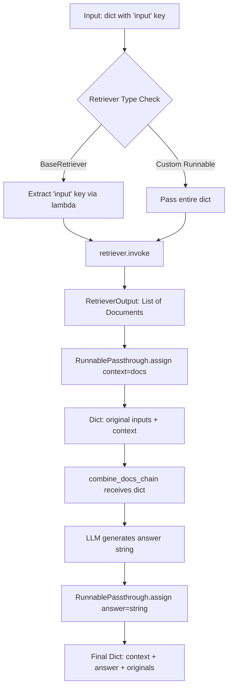

# Retrieval Chain API Reference

## Overview

The `create_retrieval_chain` factory function implements the **Retrieval-Augmented Generation (RAG)** pattern, combining document retrieval with language model generation. This function creates a composable LCEL chain that first retrieves relevant documents based on a query, then passes those documents along with the original inputs to a document combination chain for answer generation.

**Source**: `libs/langchain/langchain_classic/chains/retrieval.py`

**Key Features**:
- Flexible retriever interface (BaseRetriever or custom Runnable)
- LCEL-composable chain architecture
- Automatic context injection into combine chain
- Conversational retrieval support with chat history
- Type-safe input/output contracts

---

## Function Signature

```python
def create_retrieval_chain(
    retriever: BaseRetriever | Runnable[dict, RetrieverOutput],
    combine_docs_chain: Runnable[dict[str, Any], str],
) -> Runnable
```

**Source**: Lines 12-15 of `libs/langchain/langchain_classic/chains/retrieval.py`

---

## Parameters

### retriever

**Type**: `BaseRetriever | Runnable[dict, RetrieverOutput]`

**Description**: The retriever component responsible for fetching relevant documents based on input queries. Accepts two types of retrievers:

1. **BaseRetriever subclass**: Standard LangChain retrievers (e.g., vector store retrievers, multi-query retrievers)
   - Expected input: Dictionary with `'input'` key containing the search query string
   - The function automatically extracts the `'input'` key and passes it to the retriever
   - Example: `VectorStoreRetriever`, `ContextualCompressionRetriever`

2. **Custom Runnable**: Any Runnable that accepts a dictionary and returns `RetrieverOutput` (list of documents)
   - Expected input: Entire input dictionary passed through without modification
   - Allows custom retrieval logic with access to all input parameters
   - Use case: Complex retrieval strategies requiring multiple input fields

**Constraints**:
- Must return `RetrieverOutput` (list of `Document` objects)
- For BaseRetriever: Input dict MUST contain `'input'` key
- For custom Runnable: Must handle dict input appropriately

**Source**: Lines 19-26 of `libs/langchain/langchain_classic/chains/retrieval.py`

### combine_docs_chain

**Type**: `Runnable[dict[str, Any], str]`

**Description**: The document combination chain that processes retrieved documents and generates a final answer. This chain receives the original inputs plus additional keys injected by the retrieval chain.

**Input Structure**: The combine_docs_chain receives a dictionary containing:
- All original input keys (e.g., `'input'`, user-provided parameters)
- `'context'`: List of retrieved `Document` objects
- `'chat_history'`: Empty list `[]` if not present in original inputs (enables conversational retrieval)

**Output**: String containing the generated answer

**Common Implementation**: Typically created using `create_stuff_documents_chain()` which formats documents and passes them to an LLM with a prompt template.

**Source**: Lines 27-31 of `libs/langchain/langchain_classic/chains/retrieval.py`

---

## Returns

**Type**: `Runnable`

**Description**: An LCEL-composable Runnable that orchestrates the retrieval and generation pipeline.

**Output Schema**: The returned Runnable produces a dictionary containing at minimum:

| Key | Type | Description |
|-----|------|-------------|
| `context` | `List[Document]` | Retrieved documents from the retriever |
| `answer` | `str` | Generated answer from combine_docs_chain |
| *[original inputs]* | `Any` | All original input keys are passed through |

**Example Output**:
```python
{
    "input": "What is LangChain?",
    "context": [
        Document(page_content="LangChain is a framework...", metadata={...}),
        Document(page_content="Key features include...", metadata={...})
    ],
    "answer": "LangChain is a framework for developing applications powered by language models..."
}
```

**Source**: Lines 33-35 of `libs/langchain/langchain_classic/chains/retrieval.py`

---

## Type Flow Documentation

The `create_retrieval_chain` function creates a complex LCEL composition with multiple data transformation stages. Understanding the type flow is critical for debugging and customization.

### Type Flow Diagram



### Detailed Type Progression

**Stage 1: Input Processing**
```python
Input: dict[str, Any]
# Example: {"input": "What is LangChain?", "user_id": "123"}
```

**Stage 2: Retriever Invocation** (Source: Lines 59-62)
```python
if isinstance(retriever, BaseRetriever):
    # Extract 'input' key and pass to retriever
    retrieval_docs = (lambda x: x["input"]) | retriever
    # Type: str → BaseRetriever → RetrieverOutput
else:
    # Pass entire dict to custom Runnable
    retrieval_docs = retriever
    # Type: dict → Runnable → RetrieverOutput
```

**Stage 3: Context Assignment** (Source: Lines 64-66)
```python
RunnablePassthrough.assign(context=retrieval_docs)
# Input: {"input": "...", "user_id": "123"}
# Output: {"input": "...", "user_id": "123", "context": [Document(...), Document(...)]}
```

**Stage 4: Combine Docs Chain** (Source: Line 67)
```python
.assign(answer=combine_docs_chain)
# Input: {"input": "...", "user_id": "123", "context": [...]}
# Output: {"input": "...", "user_id": "123", "context": [...], "answer": "LangChain is..."}
```

### LCEL Composition Structure

The function returns this LCEL composition (Source: Lines 64-68):

```python
return (
    RunnablePassthrough.assign(
        context=retrieval_docs.with_config(run_name="retrieve_documents"),
    ).assign(answer=combine_docs_chain)
).with_config(run_name="retrieval_chain")
```

**Breakdown**:
1. `RunnablePassthrough.assign(context=...)`: Passes through all input keys while adding `'context'` key
2. `.assign(answer=...)`: Adds `'answer'` key to the dict (combine_docs_chain receives dict with context)
3. `.with_config(run_name=...)`: Sets run names for observability and callback tracking

---

## Usage Examples

### Example 1: Basic Retrieval Chain with Vector Store

Complete, executable example demonstrating standard RAG pattern with OpenAI and Chroma vector store.

```python
"""Basic retrieval chain example with vector store retriever.

Prerequisites:
- pip install langchain-core langchain-classic langchain-openai langchain-chroma chromadb
- Set OPENAI_API_KEY environment variable
"""
import os
from langchain_community.vectorstores import Chroma
from langchain_core.documents import Document
from langchain_core.prompts import ChatPromptTemplate
from langchain_openai import ChatOpenAI, OpenAIEmbeddings
from langchain_classic.chains import create_retrieval_chain
from langchain_classic.chains.combine_documents import create_stuff_documents_chain


def main():
    # Check for API key
    if not os.getenv("OPENAI_API_KEY"):
        print("Error: OPENAI_API_KEY environment variable not set")
        return

    # Step 1: Create sample documents for retrieval
    documents = [
        Document(
            page_content="LangChain is a framework for developing applications powered by language models.",
            metadata={"source": "docs", "page": 1}
        ),
        Document(
            page_content="LangChain provides components for working with language models, including prompt templates, chains, and agents.",
            metadata={"source": "docs", "page": 2}
        ),
        Document(
            page_content="LCEL (LangChain Expression Language) enables type-safe composition of chains using the pipe operator.",
            metadata={"source": "docs", "page": 3}
        ),
    ]

    # Step 2: Create vector store retriever
    embeddings = OpenAIEmbeddings()
    vectorstore = Chroma.from_documents(documents, embeddings)
    retriever = vectorstore.as_retriever(search_kwargs={"k": 2})

    # Step 3: Create combine documents chain
    llm = ChatOpenAI(model="gpt-3.5-turbo", temperature=0)
    
    prompt = ChatPromptTemplate.from_messages([
        ("system", "Answer the user's question based on the context below:\n\n{context}"),
        ("human", "{input}")
    ])
    
    combine_docs_chain = create_stuff_documents_chain(llm, prompt)

    # Step 4: Create retrieval chain
    retrieval_chain = create_retrieval_chain(retriever, combine_docs_chain)

    # Step 5: Invoke the chain
    result = retrieval_chain.invoke({"input": "What is LangChain?"})

    # Step 6: Display results
    print("Question:", result["input"])
    print("\nRetrieved Documents:")
    for i, doc in enumerate(result["context"], 1):
        print(f"  {i}. {doc.page_content[:100]}...")
    print("\nAnswer:", result["answer"])


if __name__ == "__main__":
    main()
```

**Expected Output**:
```
Question: What is LangChain?

Retrieved Documents:
  1. LangChain is a framework for developing applications powered by language models....
  2. LangChain provides components for working with language models, including prompt templates, chai...

Answer: LangChain is a framework for developing applications powered by language models. It provides components for working with language models, including prompt templates, chains, and agents.
```

### Example 2: Custom Runnable Retriever

Demonstrates using a custom Runnable as the retriever with access to multiple input parameters.

```python
"""Custom retriever example with multi-parameter input processing.

Prerequisites:
- pip install langchain-core langchain-classic langchain-openai
- Set OPENAI_API_KEY environment variable
"""
import os
from typing import Any
from langchain_core.documents import Document
from langchain_core.prompts import ChatPromptTemplate
from langchain_core.runnables import RunnableLambda
from langchain_openai import ChatOpenAI
from langchain_classic.chains import create_retrieval_chain
from langchain_classic.chains.combine_documents import create_stuff_documents_chain


# Simulated document database
DOCUMENT_DB = {
    "python": [
        Document(page_content="Python is a high-level programming language.", metadata={"lang": "python"}),
        Document(page_content="Python supports multiple programming paradigms.", metadata={"lang": "python"}),
    ],
    "javascript": [
        Document(page_content="JavaScript is the language of the web.", metadata={"lang": "javascript"}),
        Document(page_content="JavaScript runs in browsers and Node.js.", metadata={"lang": "javascript"}),
    ],
}


def custom_retriever_logic(inputs: dict[str, Any]) -> list[Document]:
    """Custom retriever that uses both 'input' and 'language' parameters.
    
    Args:
        inputs: Dictionary with 'input' (query) and 'language' (filter) keys
        
    Returns:
        Filtered list of documents matching the language parameter
    """
    query = inputs.get("input", "")
    language = inputs.get("language", "python")
    
    # Retrieve documents for specified language
    docs = DOCUMENT_DB.get(language, [])
    
    # Simple keyword filtering based on query
    if query:
        filtered_docs = [doc for doc in docs if query.lower() in doc.page_content.lower()]
        return filtered_docs if filtered_docs else docs
    return docs


def main():
    if not os.getenv("OPENAI_API_KEY"):
        print("Error: OPENAI_API_KEY environment variable not set")
        return

    # Step 1: Create custom Runnable retriever
    custom_retriever = RunnableLambda(custom_retriever_logic)

    # Step 2: Create combine documents chain
    llm = ChatOpenAI(model="gpt-3.5-turbo", temperature=0)
    
    prompt = ChatPromptTemplate.from_messages([
        ("system", "Answer the question about {language} based on:\n\n{context}"),
        ("human", "{input}")
    ])
    
    combine_docs_chain = create_stuff_documents_chain(llm, prompt)

    # Step 3: Create retrieval chain with custom retriever
    retrieval_chain = create_retrieval_chain(custom_retriever, combine_docs_chain)

    # Step 4: Invoke with multiple parameters
    result = retrieval_chain.invoke({
        "input": "What is this language?",
        "language": "javascript"
    })

    # Step 5: Display results
    print(f"Language Filter: {result['language']}")
    print(f"Question: {result['input']}")
    print(f"\nRetrieved {len(result['context'])} documents")
    print(f"Answer: {result['answer']}")


if __name__ == "__main__":
    main()
```

**Expected Output**:
```
Language Filter: javascript
Question: What is this language?

Retrieved 2 documents
Answer: JavaScript is the language of the web that runs in browsers and Node.js environments.
```

### Example 3: Conversational Retrieval with Chat History

Shows how the retrieval chain automatically supports conversational patterns with chat history.

```python
"""Conversational retrieval example with chat history tracking.

Prerequisites:
- pip install langchain-core langchain-classic langchain-openai langchain-chroma chromadb
- Set OPENAI_API_KEY environment variable
"""
import os
from langchain_community.vectorstores import Chroma
from langchain_core.documents import Document
from langchain_core.messages import HumanMessage, AIMessage
from langchain_core.prompts import ChatPromptTemplate, MessagesPlaceholder
from langchain_openai import ChatOpenAI, OpenAIEmbeddings
from langchain_classic.chains import create_retrieval_chain
from langchain_classic.chains.combine_documents import create_stuff_documents_chain


def main():
    if not os.getenv("OPENAI_API_KEY"):
        print("Error: OPENAI_API_KEY environment variable not set")
        return

    # Setup documents and retriever
    documents = [
        Document(page_content="LangChain was created by Harrison Chase in 2022."),
        Document(page_content="LangChain raised $25M in Series A funding in 2023."),
        Document(page_content="LangChain supports Python and JavaScript/TypeScript."),
    ]
    
    embeddings = OpenAIEmbeddings()
    vectorstore = Chroma.from_documents(documents, embeddings)
    retriever = vectorstore.as_retriever()

    # Create combine chain with chat history support
    llm = ChatOpenAI(model="gpt-3.5-turbo", temperature=0)
    
    prompt = ChatPromptTemplate.from_messages([
        ("system", "Answer based on the context:\n\n{context}"),
        MessagesPlaceholder(variable_name="chat_history"),
        ("human", "{input}")
    ])
    
    combine_docs_chain = create_stuff_documents_chain(llm, prompt)
    retrieval_chain = create_retrieval_chain(retriever, combine_docs_chain)

    # Simulate conversation
    chat_history = []
    
    # Turn 1
    print("=== Turn 1 ===")
    result1 = retrieval_chain.invoke({
        "input": "Who created LangChain?",
        "chat_history": chat_history
    })
    print(f"Q: {result1['input']}")
    print(f"A: {result1['answer']}\n")
    
    chat_history.extend([
        HumanMessage(content=result1['input']),
        AIMessage(content=result1['answer'])
    ])

    # Turn 2 - uses context from previous turn
    print("=== Turn 2 ===")
    result2 = retrieval_chain.invoke({
        "input": "When was it created?",
        "chat_history": chat_history
    })
    print(f"Q: {result2['input']}")
    print(f"A: {result2['answer']}")


if __name__ == "__main__":
    main()
```

**Expected Output**:
```
=== Turn 1 ===
Q: Who created LangChain?
A: LangChain was created by Harrison Chase.

=== Turn 2 ===
Q: When was it created?
A: LangChain was created in 2022.
```

---

## Integration with create_stuff_documents_chain

The `combine_docs_chain` parameter is typically created using the `create_stuff_documents_chain()` factory function, which implements the "stuff" strategy (inserting all documents into the prompt context).

### Integration Pattern

**Source**: Lines 38-56 of `libs/langchain/langchain_classic/chains/retrieval.py` (example section)

```python
from langchain_classic.chains.combine_documents import create_stuff_documents_chain
from langchain_core.prompts import ChatPromptTemplate
from langchain_openai import ChatOpenAI

# Create the combine chain
llm = ChatOpenAI()
prompt = ChatPromptTemplate.from_messages([
    ("system", "Answer based on the context:\n\n{context}"),
    ("human", "{input}")
])
combine_docs_chain = create_stuff_documents_chain(llm, prompt)

# Use with retrieval chain
retrieval_chain = create_retrieval_chain(retriever, combine_docs_chain)
```

### Why create_stuff_documents_chain?

The `create_stuff_documents_chain` function:
1. Formats the list of `Document` objects into a string suitable for the prompt
2. Injects the formatted documents into the `{context}` placeholder
3. Passes the prompt to the LLM for generation
4. Returns the LLM's string output

This is the most straightforward document combination strategy and works well when:
- Retrieved documents fit within the LLM's context window
- All retrieved documents are relevant to answering the question
- Simple concatenation of document content is sufficient

For large document sets, consider alternative strategies like MapReduce or Refine patterns.

---

## Troubleshooting

### Common Issue 1: Missing 'input' Key Error

**Symptom**:
```
KeyError: 'input'
```

**Cause**: When using a `BaseRetriever` subclass, the function expects the input dictionary to contain an `'input'` key. This error occurs when invoking the chain without this required key.

**Source**: Line 62 extracts `x["input"]` via lambda function

**Solution**:
```python
# ❌ Incorrect - missing 'input' key
result = retrieval_chain.invoke({"query": "What is LangChain?"})

# ✅ Correct - includes 'input' key
result = retrieval_chain.invoke({"input": "What is LangChain?"})
```

**Alternative**: Use a custom Runnable retriever that handles different key names:
```python
custom_retriever = RunnableLambda(
    lambda x: vector_store_retriever.invoke(x.get("query") or x.get("input"))
)
retrieval_chain = create_retrieval_chain(custom_retriever, combine_docs_chain)
```

### Common Issue 2: Empty Retrieval Results

**Symptom**: The `context` key contains an empty list `[]`, and the answer is generic or states "no information available."

**Cause**: The retriever found no documents matching the query. Common reasons:
- Vector store is empty or not properly initialized
- Query embedding doesn't match document embeddings
- Retriever `k` parameter set to 0
- Similarity threshold too restrictive

**Diagnosis**:
```python
# Test retriever independently
docs = retriever.invoke("test query")
print(f"Retrieved {len(docs)} documents")
for doc in docs:
    print(f"  - {doc.page_content[:100]}")
```

**Solutions**:
1. **Verify vector store has documents**:
   ```python
   # For Chroma
   print(f"Vector store contains {vectorstore._collection.count()} documents")
   ```

2. **Adjust retriever parameters**:
   ```python
   retriever = vectorstore.as_retriever(
       search_kwargs={
           "k": 5,  # Increase number of results
           "score_threshold": 0.5  # Lower threshold for more results
       }
   )
   ```

3. **Improve query formulation**: Rephrase queries to better match document content

### Common Issue 3: Type Mismatch in combine_docs_chain

**Symptom**:
```
TypeError: Expected str output from combine_docs_chain, got dict
```

**Cause**: The `combine_docs_chain` must return a string (`Runnable[dict[str, Any], str]`), but the provided chain returns a different type.

**Solution**: Ensure your combine chain returns a string:
```python
# ❌ Incorrect - returns dict
bad_chain = prompt | llm  # Returns AIMessage or dict

# ✅ Correct - returns string
from langchain_core.output_parsers import StrOutputParser
good_chain = prompt | llm | StrOutputParser()

# ✅ Or use create_stuff_documents_chain
combine_docs_chain = create_stuff_documents_chain(llm, prompt)
```

### Common Issue 4: Chat History Not Working

**Symptom**: Conversational context from previous turns is ignored in follow-up questions.

**Cause**: The `chat_history` key is not being passed correctly, or the prompt template doesn't include `MessagesPlaceholder` for chat history.

**Solution**:
1. **Include chat_history in prompt**:
   ```python
   from langchain_core.prompts import MessagesPlaceholder
   
   prompt = ChatPromptTemplate.from_messages([
       ("system", "Answer based on context:\n\n{context}"),
       MessagesPlaceholder(variable_name="chat_history"),  # Required
       ("human", "{input}")
   ])
   ```

2. **Pass chat_history in inputs**:
   ```python
   from langchain_core.messages import HumanMessage, AIMessage
   
   chat_history = [
       HumanMessage(content="Previous question"),
       AIMessage(content="Previous answer")
   ]
   
   result = retrieval_chain.invoke({
       "input": "Follow-up question",
       "chat_history": chat_history  # Must include this key
   })
   ```

3. **Note**: If `chat_history` is not in inputs, the chain automatically adds `chat_history=[]` (Source: Lines 29-31)

### Common Issue 5: Context Not Passed to Combine Chain

**Symptom**: The combine chain doesn't receive the `context` key with retrieved documents.

**Cause**: This is typically due to misconfiguration or incorrect understanding of how `RunnablePassthrough.assign()` works.

**Diagnosis**:
```python
# Add debug callback to inspect intermediate values
from langchain_core.callbacks import StdOutCallbackHandler

result = retrieval_chain.invoke(
    {"input": "test"},
    config={"callbacks": [StdOutCallbackHandler()]}
)
```

**Verification**: The `context` key should always be present in the output:
```python
assert "context" in result, "Context key missing from output"
assert isinstance(result["context"], list), "Context should be a list of documents"
```

**Solution**: Ensure the retriever returns `RetrieverOutput` (list of documents):
```python
# Retriever must return List[Document]
def my_retriever(inputs: dict) -> list[Document]:
    # ... retrieval logic ...
    return [Document(page_content="...", metadata={})]
```

### Debugging Best Practices

**Enable Verbose Logging**:
```python
import logging
logging.basicConfig(level=logging.DEBUG)

# Or use LangChain's debug mode
from langchain.globals import set_debug
set_debug(True)

result = retrieval_chain.invoke({"input": "test"})
```

**Inspect Chain Structure**:
```python
# View the chain's composition
print(retrieval_chain)

# Get detailed chain graph
from langchain_core.runnables.graph import Graph
graph = retrieval_chain.get_graph()
print(graph)
```

**Use Callbacks for Granular Monitoring**:
```python
from langchain_core.callbacks import BaseCallbackHandler

class DebugCallbackHandler(BaseCallbackHandler):
    def on_retriever_start(self, serialized, query, **kwargs):
        print(f"Retriever started with query: {query}")
    
    def on_retriever_end(self, documents, **kwargs):
        print(f"Retriever returned {len(documents)} documents")

result = retrieval_chain.invoke(
    {"input": "test"},
    config={"callbacks": [DebugCallbackHandler()]}
)
```

---

## Related APIs

- **[create_stuff_documents_chain](./combine-documents.md)**: Create the combine_docs_chain parameter
- **[BaseRetriever](../retrievers/base.md)**: Base class for retriever implementations
- **[VectorStoreRetriever](../retrievers/vector-store.md)**: Retriever backed by vector stores
- **[RunnablePassthrough](../runnables/utilities.md#runnablepassthrough)**: LCEL utility for passing through inputs
- **[Runnable](../runnables/base.md)**: Core Runnable protocol
- **[ChatPromptTemplate](../prompts/templates.md#chatprompttemplate)**: Prompt template for chat models

---

## Best Practices

### 1. Choose the Right Retriever Type

**Use BaseRetriever** when:
- Working with standard LangChain retrievers (vector stores, search APIs)
- Simple query-based retrieval is sufficient
- Input is always a single query string

**Use Custom Runnable** when:
- Need access to multiple input parameters for retrieval logic
- Implementing complex retrieval strategies (multi-step, filtered)
- Building domain-specific retrieval with business logic

### 2. Optimize Retrieval Parameters

```python
# Tune k (number of documents) based on context window
retriever = vectorstore.as_retriever(
    search_kwargs={
        "k": 5,  # Start with 3-5, adjust based on results
        "score_threshold": 0.7  # Filter low-relevance docs
    }
)
```

### 3. Handle Missing Documents Gracefully

```python
# Add fallback behavior for empty retrievals
from langchain_core.runnables import RunnablePassthrough

def retriever_with_fallback(inputs):
    docs = retriever.invoke(inputs)
    if not docs:
        # Return a default document indicating no results
        return [Document(page_content="No relevant information found.")]
    return docs

custom_retriever = RunnableLambda(retriever_with_fallback)
```

### 4. Monitor Retrieval Quality

```python
# Log retrieval metrics for monitoring
def log_retrieval_metrics(inputs):
    docs = retriever.invoke(inputs)
    print(f"Query: {inputs['input']}")
    print(f"Retrieved: {len(docs)} documents")
    if docs:
        print(f"Top score: {docs[0].metadata.get('score', 'N/A')}")
    return docs

monitored_retriever = RunnableLambda(log_retrieval_metrics)
retrieval_chain = create_retrieval_chain(monitored_retriever, combine_docs_chain)
```

### 5. Structure Prompts for RAG

```python
# Effective RAG prompt structure
prompt = ChatPromptTemplate.from_messages([
    ("system", """You are a helpful assistant. Answer the question based on the context below.
    
Context:
{context}

Instructions:
- Only use information from the context
- If the context doesn't contain relevant information, say so
- Cite specific parts of the context when possible"""),
    ("human", "{input}")
])
```

---

## Performance Considerations

### Memory Usage

The retrieval chain keeps all retrieved documents and intermediate results in memory. For large document sets:

- Limit `k` parameter to retrieve fewer documents
- Use document compression or summarization before storage
- Consider streaming responses to reduce peak memory usage

### Latency Optimization

```python
# Parallel execution for independent operations
from langchain_core.runnables import RunnableParallel

# If you need multiple retrievers, run them in parallel
multi_retriever = RunnableParallel(
    vector_docs=vector_retriever,
    keyword_docs=keyword_retriever
)
```

### Cost Management

For API-based LLMs:
- Reduce `k` to minimize context size and token usage
- Use cheaper models for initial retrieval, expensive models only for final generation
- Cache retrieval results for repeated queries

---

## Version Compatibility

**Introduced**: LangChain 0.1.0  
**Current Stable**: LangChain 1.0.0+  
**Breaking Changes**: None since introduction

**Dependencies**:
- `langchain-core >= 1.0.0`
- `langchain-classic >= 1.0.0` (for this implementation)

**Python Version**: Requires Python >= 3.10

---

## Additional Resources

- **[User Guide: LCEL Composition](../../guides/lcel-composition.md)**: Learn about LCEL composition patterns
- **[User Guide: Chain Types](../../guides/chain-types.md)**: Compare different chain types and use cases
- **[Architecture: Chain Lifecycle](../../architecture/chain-lifecycle.md)**: Understand chain execution flow
- **[Examples: Retrieval Chains](../../../examples/advanced_chains/retrieval_qa_chain.py)**: More executable examples

---

*Last Updated: 2024-01-09*  
*Source: libs/langchain/langchain_classic/chains/retrieval.py*
