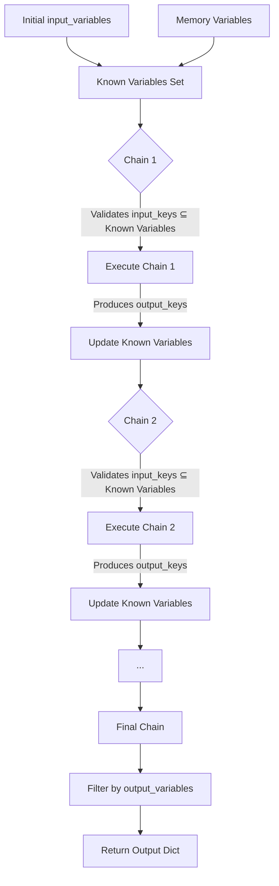
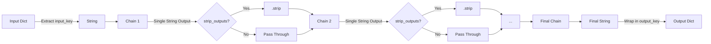

# Sequential Chains API Reference

## Overview

Sequential chains enable pipeline-style composition where the outputs of one chain feed directly into the next chain's inputs. LangChain provides two sequential chain implementations optimized for different use cases:

- **`SequentialChain`**: Multi-variable chain pipeline with explicit input/output variable mapping and validation
- **`SimpleSequentialChain`**: Single-string chain pipeline optimized for linear text transformations

Both classes inherit from the base `Chain` class and support synchronous and asynchronous execution with full callback integration.

**Source**: `libs/langchain/langchain_classic/chains/sequential.py`

## When to Use Sequential Chains

Use sequential chains when you need to:

- Build multi-step data processing pipelines
- Pass outputs from one LLM call as inputs to subsequent calls
- Compose multiple specialized chains into a complex workflow
- Maintain explicit control over variable flow between steps

## SequentialChain

### Class Definition

```python
class SequentialChain(Chain):
    """Chain where the outputs of one chain feed directly into next.
    
    SequentialChain enables multi-variable pipeline composition with automatic
    validation of input/output variable flows. Each chain in the sequence can
    produce multiple output variables that become available to subsequent chains.
    """
```

**Source**: `libs/langchain/langchain_classic/chains/sequential.py:16-17`

### Constructor Parameters

#### chains

- **Type**: `list[Chain]`
- **Required**: Yes
- **Description**: List of Chain instances to execute in sequence. Each chain's input requirements must be satisfied by either the initial `input_variables` or outputs from previous chains in the list.
- **Validation**: At initialization, SequentialChain validates that each chain's `input_keys` can be satisfied by known variables (initial inputs + all prior chain outputs). Missing variables raise `ValueError`.

**Source**: `libs/langchain/langchain_classic/chains/sequential.py:19, 66-76`

#### input_variables

- **Type**: `list[str]`
- **Required**: Yes
- **Description**: List of variable names that must be provided when invoking the chain. These form the initial set of known variables available to the first chain(s).
- **Constraints**: Cannot overlap with memory keys if memory is configured (raises `ValueError` if overlap detected).

**Source**: `libs/langchain/langchain_classic/chains/sequential.py:20, 55-62`

#### output_variables

- **Type**: `list[str]`
- **Required**: No (auto-computed if omitted)
- **Description**: List of variable names to include in the final output dictionary. Controls which variables from the accumulated outputs are returned.
- **Auto-computation behavior**:
  - If `return_all=True` and `output_variables` not specified: Returns all variables produced by chains (excludes initial input_variables)
  - If `return_all=False` and `output_variables` not specified: Returns only the last chain's output keys
- **Validation**: If explicitly provided, all specified variables must exist in the accumulated outputs after all chains execute (raises `ValueError` if missing).

**Source**: `libs/langchain/langchain_classic/chains/sequential.py:21, 84-94`

#### return_all

- **Type**: `bool`
- **Required**: No
- **Default**: `False`
- **Description**: Controls automatic `output_variables` computation when `output_variables` is not explicitly specified.
  - `False`: Return only the final chain's outputs
  - `True`: Return all intermediate outputs produced by any chain

**Source**: `libs/langchain/langchain_classic/chains/sequential.py:22, 85-86`

#### memory

- **Type**: `BaseMemory | None`
- **Required**: No
- **Default**: `None`
- **Description**: Optional memory instance for maintaining conversation state. Memory variables are added to the known variables set and become available to all chains.
- **Validation**: Memory keys cannot overlap with `input_variables` (raises `ValueError` if collision detected).

**Source**: `libs/langchain/langchain_classic/chains/sequential.py:52-62`

### Type Flow Documentation

SequentialChain implements sophisticated variable flow tracking to ensure type safety across chain boundaries:



**Variable Propagation Algorithm** (Source: `libs/langchain/langchain_classic/chains/sequential.py:64-82`):

1. **Initialize known variables**: `known_variables = set(input_variables + memory_keys)`
2. **For each chain in sequence**:
   - Validate: `chain.input_keys ⊆ known_variables` (raises `ValueError` if missing keys)
   - Validate: `chain.output_keys ∩ known_variables = ∅` (raises `ValueError` if key collision)
   - Execute chain to produce outputs
   - Update: `known_variables |= set(chain.output_keys)`
3. **Return outputs**: Filter accumulated variables by `output_variables`

### Execution Methods

#### invoke() / __call__()

```python
def __call__(
    self,
    inputs: dict[str, str],
    return_only_outputs: bool = False,
    callbacks: Callbacks | None = None,
    **kwargs
) -> dict[str, str]:
    """Execute the sequential chain synchronously.
    
    Args:
        inputs: Dictionary with keys matching self.input_variables. Values
            are the initial inputs to feed into the chain pipeline.
        return_only_outputs: If True, return only output_variables. If False,
            return both inputs and outputs merged.
        callbacks: Optional callback handlers for monitoring execution.
        **kwargs: Additional keyword arguments passed to underlying chains.
    
    Returns:
        Dictionary containing the variables specified in self.output_variables.
        If return_only_outputs=False, also includes original input variables.
    
    Raises:
        ValueError: If inputs dictionary is missing required input_variables.
        ValueError: If any chain in the sequence fails validation or execution.
    
    Example:
        ```python
        from langchain_classic.chains import SequentialChain, LLMChain
        from langchain_classic.prompts import PromptTemplate
        from langchain_openai import OpenAI
        
        llm = OpenAI(temperature=0.7)
        
        # Chain 1: Generate a topic
        chain1 = LLMChain(
            llm=llm,
            prompt=PromptTemplate(
                input_variables=["product"],
                template="What is a good name for a company that makes {product}?"
            ),
            output_key="company_name"
        )
        
        # Chain 2: Generate a slogan using the company name
        chain2 = LLMChain(
            llm=llm,
            prompt=PromptTemplate(
                input_variables=["company_name"],
                template="Write a catchy slogan for {company_name}."
            ),
            output_key="slogan"
        )
        
        # Compose into sequential chain
        overall_chain = SequentialChain(
            chains=[chain1, chain2],
            input_variables=["product"],
            output_variables=["company_name", "slogan"],
            verbose=True
        )
        
        # Execute
        result = overall_chain({"product": "colorful socks"})
        print(result)
        # Output: {"company_name": "VibrantSoles", "slogan": "Step into Color!"}
        ```
    """
```

**Implementation Details** (Source: `libs/langchain/langchain_classic/chains/sequential.py:98-109`):

- Maintains `known_values` dictionary accumulating all outputs
- Executes each chain with `return_only_outputs=True` to get clean outputs
- Updates `known_values` with each chain's outputs via `dict.update()`
- Returns filtered dictionary containing only `self.output_variables` keys

#### ainvoke() / acall()

```python
async def acall(
    self,
    inputs: dict[str, Any],
    return_only_outputs: bool = False,
    callbacks: Callbacks | None = None,
    **kwargs
) -> dict[str, Any]:
    """Execute the sequential chain asynchronously.
    
    Args:
        inputs: Dictionary with keys matching self.input_variables.
        return_only_outputs: If True, return only output_variables.
        callbacks: Optional async callback handlers.
        **kwargs: Additional keyword arguments.
    
    Returns:
        Dictionary containing the variables specified in self.output_variables.
    
    Raises:
        ValueError: If inputs dictionary is missing required input_variables.
        ValueError: If any chain in the sequence fails.
    
    Example:
        ```python
        import asyncio
        from langchain_classic.chains import SequentialChain
        
        async def run_async_chain():
            result = await overall_chain.acall({"product": "eco-friendly bottles"})
            print(result)
        
        asyncio.run(run_async_chain())
        ```
    """
```

**Source**: `libs/langchain/langchain_classic/chains/sequential.py:111-126`

### Properties

#### input_keys

- **Type**: `list[str]`
- **Description**: Returns the list of required input variable names (same as `input_variables`).
- **Source**: `libs/langchain/langchain_classic/chains/sequential.py:29-35`

#### output_keys

- **Type**: `list[str]`
- **Description**: Returns the list of output variable names (same as `output_variables`).
- **Source**: `libs/langchain/langchain_classic/chains/sequential.py:37-43`

### Error Handling

SequentialChain performs comprehensive validation at initialization:

| Error Scenario | Exception | Trigger Condition | Source |
|----------------|-----------|-------------------|--------|
| **Memory key collision** | `ValueError` | `input_variables ∩ memory.memory_variables ≠ ∅` | Lines 55-62 |
| **Missing input variables** | `ValueError` | `chain.input_keys ⊄ known_variables` for any chain | Lines 67-76 |
| **Output key collision** | `ValueError` | `chain.output_keys ∩ known_variables ≠ ∅` for any chain | Lines 77-80 |
| **Missing output variables** | `ValueError` | Specified `output_variables` contains keys not in `known_variables` after execution | Lines 91-94 |

## SimpleSequentialChain

### Class Definition

```python
class SimpleSequentialChain(Chain):
    """Simple chain where the outputs of one step feed directly into next.
    
    Optimized for linear string transformation pipelines where each chain
    takes a single string input and produces a single string output. The
    complete output of Chain N becomes the complete input to Chain N+1.
    """
```

**Source**: `libs/langchain/langchain_classic/chains/sequential.py:129-130`

### Constructor Parameters

#### chains

- **Type**: `list[Chain]`
- **Required**: Yes
- **Description**: List of Chain instances to execute in sequence. Each chain MUST have exactly one input key and exactly one output key.
- **Validation**: At initialization, validates that every chain has `len(chain.input_keys) == 1` and `len(chain.output_keys) == 1`. Raises `ValueError` if any chain violates this constraint.

**Source**: `libs/langchain/langchain_classic/chains/sequential.py:132, 158-174`

#### input_key

- **Type**: `str`
- **Required**: No
- **Default**: `"input"`
- **Description**: The key name expected in the input dictionary when invoking the chain.

**Source**: `libs/langchain/langchain_classic/chains/sequential.py:134`

#### output_key

- **Type**: `str`
- **Required**: No
- **Default**: `"output"`
- **Description**: The key name used in the output dictionary to return the final result.

**Source**: `libs/langchain/langchain_classic/chains/sequential.py:135`

#### strip_outputs

- **Type**: `bool`
- **Required**: No
- **Default**: `False`
- **Description**: If `True`, applies `.strip()` to remove leading/trailing whitespace from each chain's output before passing to the next chain. Useful for cleaning up LLM outputs.

**Source**: `libs/langchain/langchain_classic/chains/sequential.py:133, 189-190, 212-213`

### Type Flow Documentation

SimpleSequentialChain implements a linear string transformation pipeline:



**String Flow Algorithm** (Source: `libs/langchain/langchain_classic/chains/sequential.py:176-197`):

1. Extract string from input: `current_string = inputs[self.input_key]`
2. **For each chain in sequence**:
   - Execute: `current_string = chain.run(current_string, callbacks=...)`
   - Optionally strip: `if self.strip_outputs: current_string = current_string.strip()`
   - Log intermediate output with color coding
3. Return: `{self.output_key: current_string}`

### Execution Methods

#### invoke() / __call__()

```python
def __call__(
    self,
    inputs: dict[str, str],
    return_only_outputs: bool = False,
    callbacks: Callbacks | None = None,
    **kwargs
) -> dict[str, str]:
    """Execute the simple sequential chain synchronously.
    
    Args:
        inputs: Dictionary containing the input_key with a string value.
        return_only_outputs: If True, return only the output_key.
        callbacks: Optional callback handlers.
        **kwargs: Additional keyword arguments.
    
    Returns:
        Dictionary with single key (self.output_key) containing the final
        string result after all chain transformations.
    
    Raises:
        KeyError: If inputs dictionary does not contain self.input_key.
        ValueError: If any chain in the sequence fails execution.
    
    Example:
        ```python
        from langchain_classic.chains import SimpleSequentialChain, LLMChain
        from langchain_classic.prompts import PromptTemplate
        from langchain_openai import OpenAI
        
        llm = OpenAI(temperature=0.7)
        
        # Chain 1: Generate a synopsis
        synopsis_chain = LLMChain(
            llm=llm,
            prompt=PromptTemplate(
                input_variables=["title"],
                template="Write a synopsis for a play titled '{title}'."
            )
        )
        
        # Chain 2: Generate a review from synopsis
        review_chain = LLMChain(
            llm=llm,
            prompt=PromptTemplate(
                input_variables=["synopsis"],
                template="Write a review of this play synopsis:\\n\\n{synopsis}"
            )
        )
        
        # Compose chains - synopsis becomes input to review
        overall_chain = SimpleSequentialChain(
            chains=[synopsis_chain, review_chain],
            strip_outputs=True,
            verbose=True
        )
        
        # Execute
        result = overall_chain({"input": "The Lost Key"})
        print(result["output"])
        # Output: Full review text based on generated synopsis
        ```
    """
```

**Source**: `libs/langchain/langchain_classic/chains/sequential.py:176-197`

#### ainvoke() / acall()

```python
async def acall(
    self,
    inputs: dict[str, Any],
    return_only_outputs: bool = False,
    callbacks: Callbacks | None = None,
    **kwargs
) -> dict[str, Any]:
    """Execute the simple sequential chain asynchronously.
    
    Args:
        inputs: Dictionary containing the input_key with a string value.
        return_only_outputs: If True, return only the output_key.
        callbacks: Optional async callback handlers.
        **kwargs: Additional keyword arguments.
    
    Returns:
        Dictionary with single key (self.output_key) containing final result.
    
    Raises:
        KeyError: If inputs dictionary does not contain self.input_key.
        ValueError: If any chain fails execution.
    
    Example:
        ```python
        import asyncio
        
        async def run_async():
            result = await overall_chain.acall({"input": "The Forgotten Dream"})
            print(result["output"])
        
        asyncio.run(run_async())
        ```
    """
```

**Source**: `libs/langchain/langchain_classic/chains/sequential.py:199-220`

### Properties

#### input_keys

- **Type**: `list[str]`
- **Description**: Returns `[self.input_key]` as a single-element list.
- **Source**: `libs/langchain/langchain_classic/chains/sequential.py:142-148`

#### output_keys

- **Type**: `list[str]`
- **Description**: Returns `[self.output_key]` as a single-element list.
- **Source**: `libs/langchain/langchain_classic/chains/sequential.py:150-156`

### Error Handling

SimpleSequentialChain validates chain structure at initialization:

| Error Scenario | Exception | Trigger Condition | Source |
|----------------|-----------|-------------------|--------|
| **Multiple input keys** | `ValueError` | `len(chain.input_keys) != 1` for any chain | Lines 161-166 |
| **Multiple output keys** | `ValueError` | `len(chain.output_keys) != 1` for any chain | Lines 168-173 |
| **Missing input key** | `KeyError` | Input dict does not contain `self.input_key` at execution | Line 182, 205 |

## Comparison: SequentialChain vs SimpleSequentialChain

### Decision Matrix

| Criterion | SequentialChain | SimpleSequentialChain |
|-----------|----------------|----------------------|
| **Input/Output Complexity** | Multi-variable: Each chain can have multiple inputs/outputs | Single-variable: Each chain must have exactly 1 input and 1 output |
| **Variable Tracking** | Explicit variable names, full validation of variable flow | Implicit string passing, no variable name tracking |
| **Use Case** | Complex pipelines with parallel data flows, multiple derived variables | Linear text transformation pipelines (synopsis → review → summary) |
| **Setup Complexity** | Higher: Must specify input_variables and output_variables | Lower: Just provide list of single-I/O chains |
| **Debugging** | Easier: Named variables make intermediate values traceable | Harder: Only sees string transformations |
| **Performance** | Slight overhead from variable tracking | Minimal overhead, optimized for string passing |
| **Memory Support** | Full support with validation of memory key conflicts | Standard memory support (inherited from Chain) |
| **Intermediate Outputs** | Can return all intermediate variables via `return_all=True` | Only returns final output, intermediate values logged |

### When to Choose SequentialChain

Use `SequentialChain` when:

- Chains need to share multiple pieces of information (e.g., entity extraction → sentiment analysis → summary generation)
- You need explicit control over which variables are passed between chains
- You want validation that input requirements are satisfied at each step
- Debugging requires inspecting intermediate variable values
- Some chains need access to variables from non-adjacent chains (e.g., Chain 3 needs outputs from both Chain 1 and Chain 2)

**Example Use Case**: Customer feedback processing pipeline
```
Input: {customer_feedback}
Chain 1: Extract entities → {entities, categories}
Chain 2: Analyze sentiment → {sentiment_score, sentiment_label}
Chain 3: Generate response using {entities, sentiment_label} → {response}
Output: {entities, sentiment_score, response}
```

### When to Choose SimpleSequentialChain

Use `SimpleSequentialChain` when:

- Each step performs a single string transformation (generate, refine, format)
- The complete output of step N becomes the complete input to step N+1
- You want minimal configuration and setup
- The pipeline is linear with no branching or rejoining
- Intermediate string outputs should be logged/displayed during execution

**Example Use Case**: Content generation pipeline
```
Input: {title}
Chain 1: Generate outline from title → outline_text
Chain 2: Expand outline into draft → draft_text
Chain 3: Polish and format draft → final_text
Output: {final_text}
```

## Complete Working Examples

### Example 1: Multi-Step Research Pipeline (SequentialChain)

```python
"""Complete executable example of SequentialChain for research pipeline."""

from langchain_classic.chains import LLMChain, SequentialChain
from langchain_classic.prompts import PromptTemplate
from langchain_openai import OpenAI
import os

# Ensure API key is set
if not os.environ.get("OPENAI_API_KEY"):
    raise ValueError("Please set OPENAI_API_KEY environment variable")

# Initialize LLM
llm = OpenAI(temperature=0.7)

# Step 1: Generate research questions from a topic
question_chain = LLMChain(
    llm=llm,
    prompt=PromptTemplate(
        input_variables=["topic"],
        template="Generate 3 research questions about {topic}. Return only the questions, one per line."
    ),
    output_key="questions"
)

# Step 2: Generate methodology using the questions
methodology_chain = LLMChain(
    llm=llm,
    prompt=PromptTemplate(
        input_variables=["topic", "questions"],
        template=(
            "Given the research topic '{topic}' and these questions:\n{questions}\n\n"
            "Propose a research methodology in 2-3 sentences."
        )
    ),
    output_key="methodology"
)

# Step 3: Generate expected outcomes using topic and methodology
outcomes_chain = LLMChain(
    llm=llm,
    prompt=PromptTemplate(
        input_variables=["topic", "methodology"],
        template=(
            "For a research project on '{topic}' using this methodology:\n{methodology}\n\n"
            "Describe 3 expected outcomes or findings."
        )
    ),
    output_key="expected_outcomes"
)

# Compose into sequential chain
research_pipeline = SequentialChain(
    chains=[question_chain, methodology_chain, outcomes_chain],
    input_variables=["topic"],
    output_variables=["questions", "methodology", "expected_outcomes"],
    verbose=True
)

# Execute the pipeline
if __name__ == "__main__":
    result = research_pipeline({"topic": "impact of remote work on team collaboration"})
    
    print("\n=== Research Pipeline Results ===")
    print(f"\nResearch Questions:\n{result['questions']}")
    print(f"\nMethodology:\n{result['methodology']}")
    print(f"\nExpected Outcomes:\n{result['expected_outcomes']}")
```

### Example 2: Text Refinement Pipeline (SimpleSequentialChain)

```python
"""Complete executable example of SimpleSequentialChain for text refinement."""

from langchain_classic.chains import LLMChain, SimpleSequentialChain
from langchain_classic.prompts import PromptTemplate
from langchain_openai import OpenAI
import os

if not os.environ.get("OPENAI_API_KEY"):
    raise ValueError("Please set OPENAI_API_KEY environment variable")

llm = OpenAI(temperature=0.7)

# Step 1: Expand a brief idea into a paragraph
expand_chain = LLMChain(
    llm=llm,
    prompt=PromptTemplate(
        input_variables=["idea"],
        template="Expand this brief idea into a detailed paragraph:\n\n{idea}"
    )
)

# Step 2: Make the paragraph more professional
professionalize_chain = LLMChain(
    llm=llm,
    prompt=PromptTemplate(
        input_variables=["text"],
        template="Rewrite this text in a more professional tone:\n\n{text}"
    )
)

# Step 3: Add a compelling conclusion sentence
conclusion_chain = LLMChain(
    llm=llm,
    prompt=PromptTemplate(
        input_variables=["text"],
        template="Add a compelling conclusion sentence to this text:\n\n{text}\n\nReturn the complete text with the added conclusion."
    )
)

# Compose into simple sequential chain
refinement_pipeline = SimpleSequentialChain(
    chains=[expand_chain, professionalize_chain, conclusion_chain],
    strip_outputs=True,  # Clean whitespace between steps
    verbose=True
)

# Execute the pipeline
if __name__ == "__main__":
    brief_idea = "AI can help improve customer service response times"
    
    result = refinement_pipeline({"input": brief_idea})
    
    print("\n=== Text Refinement Results ===")
    print(f"\nOriginal Idea:\n{brief_idea}")
    print(f"\nRefined Text:\n{result['output']}")
```

### Example 3: Async Sequential Chain Execution

```python
"""Complete executable example demonstrating async sequential chain execution."""

import asyncio
import os
from langchain_classic.chains import LLMChain, SequentialChain
from langchain_classic.prompts import PromptTemplate
from langchain_openai import OpenAI

async def run_async_research_chain():
    """Execute research chain asynchronously."""
    if not os.environ.get("OPENAI_API_KEY"):
        raise ValueError("Please set OPENAI_API_KEY environment variable")
    
    llm = OpenAI(temperature=0.7)
    
    # Define chains
    topic_analysis = LLMChain(
        llm=llm,
        prompt=PromptTemplate(
            input_variables=["domain"],
            template="Identify the most important trend in {domain}."
        ),
        output_key="trend"
    )
    
    impact_analysis = LLMChain(
        llm=llm,
        prompt=PromptTemplate(
            input_variables=["trend", "domain"],
            template="Analyze the impact of this trend on {domain}:\n{trend}"
        ),
        output_key="impact"
    )
    
    # Sequential chain
    analysis_chain = SequentialChain(
        chains=[topic_analysis, impact_analysis],
        input_variables=["domain"],
        output_variables=["trend", "impact"],
        verbose=True
    )
    
    # Execute asynchronously
    result = await analysis_chain.acall({"domain": "healthcare technology"})
    
    print("\n=== Async Analysis Results ===")
    print(f"\nTrend: {result['trend']}")
    print(f"\nImpact: {result['impact']}")

if __name__ == "__main__":
    asyncio.run(run_async_research_chain())
```

## Best Practices

### Variable Naming Conventions

- Use descriptive variable names that reflect content: `customer_feedback`, `extracted_entities`, `sentiment_score`
- Avoid generic names like `output1`, `result`, `data` which make pipelines hard to understand
- Keep variable names consistent across related chains

### Error Prevention

1. **Test chains individually** before composing into SequentialChain:
   ```python
   # Test each chain works independently
   result1 = chain1({"input_var": "test"})
   result2 = chain2({**result1, "input_var": "test"})
   # Then compose
   ```

2. **Use verbose=True during development** to see intermediate outputs
3. **Validate output_keys match expected input_keys** for next chain
4. **For SimpleSequentialChain**, ensure each chain has exactly one input and output key

### Performance Optimization

- Sequential chains execute serially (Chain 1 → Chain 2 → Chain 3). For parallel execution of independent chains, consider using `RunnableParallel` from LangChain Expression Language (LCEL).
- Use `return_all=False` (default) if you only need final outputs to reduce memory usage
- For large pipelines, consider breaking into smaller SequentialChains and caching intermediate results

### Migration to LCEL

Modern LangChain applications should consider using LCEL (LangChain Expression Language) for chain composition:

```python
# Sequential Chain (Classic)
sequential = SequentialChain(
    chains=[chain1, chain2, chain3],
    input_variables=["input"],
    output_variables=["output"]
)

# LCEL Equivalent (Modern)
from langchain_core.runnables import RunnablePassthrough

lcel_chain = (
    chain1
    | RunnablePassthrough.assign(extra_context=chain2)
    | chain3
)
```

LCEL provides better type safety, streaming support, and more flexible composition patterns. However, SequentialChain remains useful for explicit variable flow control and validation.

## See Also

- [Chain Base Class](./base.md) - Base class documentation for all chains
- [LLMChain](./llm-chain.md) - Single-prompt LLM chain for use in sequential pipelines
- [LCEL Composition Guide](../../guides/lcel-composition.md) - Modern chain composition patterns
- [Chain Types Guide](../../guides/chain-types.md) - Choosing the right chain type

## Troubleshooting

### Common Issues

**Issue**: `ValueError: Missing required input keys: {'variable_name'}`

- **Cause**: A chain in the sequence requires an input variable that hasn't been produced by prior chains or included in `input_variables`
- **Solution**: Check that the variable is either in `input_variables` or produced by a previous chain's `output_keys`

**Issue**: `ValueError: Chain returned keys that already exist: {'variable_name'}`

- **Cause**: A chain is trying to output a variable name that already exists (from inputs or previous chain)
- **Solution**: Use unique output key names in your chains with `output_key="unique_name"` parameter

**Issue**: `ValueError: Expected output variables that were not found`

- **Cause**: Specified `output_variables` includes a variable that no chain produces
- **Solution**: Either remove the variable from `output_variables` or ensure a chain produces it

**Issue**: SimpleSequentialChain error: "Chains used in SimplePipeline should all have one input"

- **Cause**: One of the chains has multiple `input_keys`
- **Solution**: Use `SequentialChain` instead for multi-variable chains, or modify chains to have single inputs

## Reference

**Module**: `langchain_classic.chains.sequential`  
**Source File**: `libs/langchain/langchain_classic/chains/sequential.py`  
**Base Class**: `langchain_classic.chains.base.Chain`  
**Pydantic Config**: `arbitrary_types_allowed=True`, `extra="forbid"`
