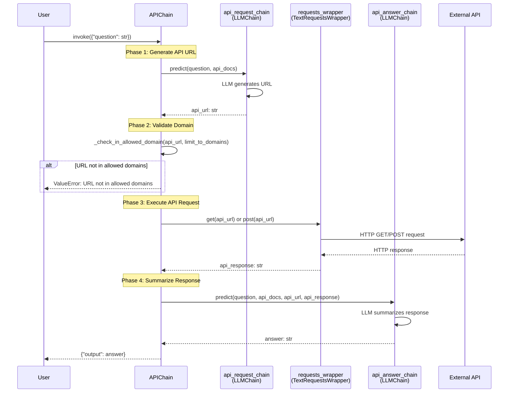

# APIChain API Reference

!!! danger "Security Warning"
    **APIChain makes arbitrary HTTP requests on behalf of the server hosting your application.**
    
    This chain executes GET, POST, PATCH, PUT, and DELETE requests to any API the LLM generates. This poses significant security risks:
    
    - **Private API Access**: Users can ask the server to make requests to private APIs that are only accessible from within your network
    - **Arbitrary Requests**: The LLM generates API URLs, which could be manipulated to access unintended endpoints
    - **Server-Side Request Forgery (SSRF)**: Potential for SSRF attacks if domain restrictions are not properly configured
    
    **Required Security Measures:**
    - Always use `limit_to_domains` to whitelist allowed API domains
    - Never expose this chain to untrusted users without strict access controls
    - Implement network isolation for the server running this chain
    - Review API documentation passed to the LLM to prevent unauthorized access patterns
    
    See [LangChain Security Documentation](https://python.langchain.com/docs/security) for more information.

!!! warning "Deprecated"
    **APIChain is deprecated since version 0.2.13 and will be removed in version 1.0.**
    
    This class is deprecated in favor of **LangGraph with RequestsToolkit**, which provides:
    
    - **Better reliability**: Uses LLM tool calling for properly-formatted API requests
    - **Streaming support**: Both token-by-token and step-by-step streaming
    - **Memory and checkpointing**: Built-in support for conversation history
    - **Easier extensibility**: Simple to add tools, modify logic, or add structured responses
    
    See the [Migration Guide](#migration-to-langgraph) below for complete replacement implementation.

## Overview

`APIChain` is a deprecated chain implementation that makes REST API calls and summarizes the responses to answer user questions. It uses a two-phase workflow:

1. **API Request Generation**: LLM generates an API URL based on the user's question and API documentation
2. **Response Summarization**: The API response is summarized by another LLM to answer the original question

While functional, this approach has been superseded by the more robust and secure LangGraph + RequestsToolkit pattern.

**Source:** `libs/langchain/langchain_classic/chains/api/base.py:68-386`

## Class Definition

```python
from langchain_classic.chains.api.base import APIChain

class APIChain(Chain):
    """Chain that makes API calls and summarizes responses to answer questions.
    
    Deprecated: Use LangGraph with RequestsToolkit instead.
    """
```

**Inheritance:** Inherits from [`Chain`](../base.md), providing standard chain execution methods (`invoke`, `ainvoke`, `batch`, `stream`).

## Constructor Parameters

### Required Parameters

#### `api_request_chain`

**Type:** [`LLMChain`](../llm-chain.md)

**Description:** An LLMChain that generates API URLs from user questions. This chain must use a prompt with exactly two input variables: `question` and `api_docs`.

The LLM is expected to produce a complete API URL (including scheme, domain, path, and query parameters) that will be called to retrieve data for answering the question.

**Validation:** The chain automatically validates that the prompt has the required `{question, api_docs}` input variables (enforced via model validator).

**Example:**
```python
from langchain_classic.chains.llm import LLMChain
from langchain_classic.chains.api.prompt import API_URL_PROMPT
from langchain_openai import OpenAI

api_request_chain = LLMChain(
    llm=OpenAI(temperature=0),
    prompt=API_URL_PROMPT  # Expects {question, api_docs}
)
```

**Source:** `libs/langchain/langchain_classic/chains/api/base.py:198`

---

#### `api_answer_chain`

**Type:** [`LLMChain`](../llm-chain.md)

**Description:** An LLMChain that summarizes API responses to answer the original user question. This chain must use a prompt with exactly four input variables: `question`, `api_docs`, `api_url`, and `api_response`.

The LLM receives the original question, the API documentation, the generated API URL, and the raw API response, then produces a natural language answer.

**Validation:** The chain automatically validates that the prompt has the required `{question, api_docs, api_url, api_response}` input variables.

**Example:**
```python
from langchain_classic.chains.api.prompt import API_RESPONSE_PROMPT

api_answer_chain = LLMChain(
    llm=OpenAI(temperature=0),
    prompt=API_RESPONSE_PROMPT  # Expects {question, api_docs, api_url, api_response}
)
```

**Source:** `libs/langchain/langchain_classic/chains/api/base.py:199`

---

#### `requests_wrapper`

**Type:** `TextRequestsWrapper` (from `langchain_community.utilities.requests`)

**Description:** A wrapper for making HTTP requests. This component performs the actual GET or POST requests to the generated API URL.

**Security Requirement:** Must be instantiated with `allow_dangerous_request=True` to explicitly acknowledge the security risks of making arbitrary HTTP requests.

**Example:**
```python
from langchain_community.utilities.requests import TextRequestsWrapper

requests_wrapper = TextRequestsWrapper(
    headers={"Authorization": "Bearer YOUR_API_TOKEN"},
    allow_dangerous_request=True  # Required
)
```

**Source:** `libs/langchain/langchain_classic/chains/api/base.py:200`

---

#### `api_docs`

**Type:** `str`

**Description:** API documentation or specification (e.g., OpenAPI/Swagger spec) that describes the available API endpoints, parameters, and expected responses. This documentation is provided to the LLM to help it generate valid API requests.

**Format:** Can be any text format, but structured formats like OpenAPI YAML work best:

**Example:**
```python
api_docs = """
openapi: 3.0.0
info:
  title: JSONPlaceholder API
  version: 1.0.0
servers:
  - url: https://jsonplaceholder.typicode.com
paths:
  /posts:
    get:
      summary: Get posts
      parameters:
        - name: _limit
          in: query
          schema:
            type: integer
          description: Limit the number of results
  /posts/{id}:
    get:
      summary: Get a specific post
      parameters:
        - name: id
          in: path
          required: true
          schema:
            type: integer
"""
```

**Source:** `libs/langchain/langchain_classic/chains/api/base.py:201`

---

#### `limit_to_domains`

**Type:** `Sequence[str] | None`

**Description:** **CRITICAL SECURITY PARAMETER.** A whitelist of allowed domains that the chain can make requests to. Only URLs matching the exact scheme and domain of an entry in this list will be allowed.

**Security Behavior:**
- **Default:** Empty list `[]` (raises ValueError on instantiation - you must explicitly set this)
- **Whitelist mode:** Provide list of allowed domains (e.g., `["https://api.example.com"]`)
- **Unrestricted mode:** Set to `None` to allow all domains (NOT RECOMMENDED - severe security risk)

**Domain Matching:** Requires exact match of both URL scheme (http/https) and domain (netloc):
- ✅ URL `https://api.example.com/posts` matches `["https://api.example.com"]`
- ❌ URL `https://api.example.com/posts` does NOT match `["http://api.example.com"]` (scheme mismatch)
- ❌ URL `https://api.example.com/posts` does NOT match `["https://example.com"]` (domain mismatch)

**Example:**
```python
# Recommended: Strict domain whitelist
limit_to_domains = [
    "https://jsonplaceholder.typicode.com",
    "https://api.github.com"
]

# Dangerous: Allow all domains (not recommended)
limit_to_domains = None
```

**Raises:** `ValueError` at instantiation if `limit_to_domains` is not provided, or if it's an empty list.

**Raises:** `ValueError` during execution if the LLM generates a URL outside the allowed domains.

**Source:** `libs/langchain/langchain_classic/chains/api/base.py:204-216, 246-265, 291-298`

---

### Optional Parameters

#### `question_key`

**Type:** `str`

**Default:** `"question"`

**Description:** The dictionary key used to extract the user's question from the input dictionary passed to `invoke()` or `ainvoke()`.

**Source:** `libs/langchain/langchain_classic/chains/api/base.py:202`

---

#### `output_key`

**Type:** `str`

**Default:** `"output"`

**Description:** The dictionary key used to store the final answer in the output dictionary returned by `invoke()` or `ainvoke()`.

**Source:** `libs/langchain/langchain_classic/chains/api/base.py:203`

---

## Class Methods

### `invoke()`

Inherited from [`Chain`](../base.md). Executes the APIChain synchronously.

**Input:** `dict[str, Any]` with key matching `question_key` (default: `"question"`)

**Output:** `dict[str, str]` with key matching `output_key` (default: `"output"`)

**Example:**
```python
result = api_chain.invoke({"question": "What are the top 2 posts?"})
print(result["output"])
```

---

### `ainvoke()`

Inherited from [`Chain`](../base.md). Executes the APIChain asynchronously.

**Input:** `dict[str, Any]` with key matching `question_key`

**Output:** `dict[str, str]` with key matching `output_key`

**Example:**
```python
result = await api_chain.ainvoke({"question": "What are the top 2 posts?"})
print(result["output"])
```

**Source:** `libs/langchain/langchain_classic/chains/api/base.py:315-358`

---

### `from_llm_and_api_docs()` (Class Method)

Factory method to create an APIChain from an LLM and API documentation, using default prompts.

#### Parameters

- **`llm`** (`BaseLanguageModel`): The language model to use for both API request generation and response summarization
- **`api_docs`** (`str`): API documentation string
- **`headers`** (`dict | None`, default: `None`): Optional HTTP headers to include in API requests (e.g., authentication tokens)
- **`api_url_prompt`** (`BasePromptTemplate`, default: `API_URL_PROMPT`): Custom prompt for API URL generation
- **`api_response_prompt`** (`BasePromptTemplate`, default: `API_RESPONSE_PROMPT`): Custom prompt for response summarization
- **`limit_to_domains`** (`Sequence[str] | None`, default: `()`): Domain whitelist (empty tuple triggers validation error - must be explicitly set)
- **`**kwargs`**: Additional keyword arguments passed to the APIChain constructor

#### Returns

**Type:** `APIChain`

**Description:** Fully initialized APIChain instance with default prompts.

#### Example

```python
from langchain_classic.chains.api.base import APIChain
from langchain_openai import OpenAI

api_docs = """
openapi: 3.0.0
servers:
  - url: https://api.example.com
paths:
  /users:
    get:
      summary: List users
"""

chain = APIChain.from_llm_and_api_docs(
    llm=OpenAI(temperature=0),
    api_docs=api_docs,
    headers={"Authorization": "Bearer token123"},
    limit_to_domains=["https://api.example.com"]
)

result = chain.invoke({"question": "How many users are there?"})
```

**Source:** `libs/langchain/langchain_classic/chains/api/base.py:360-382`

---

## Execution Workflow

APIChain executes in three distinct phases:

### Type Flow Diagram



### Phase 1: API URL Generation

**Input:** `Dict[str, str]` with key `question`

**Process:**
1. Extract question from input dictionary using `question_key`
2. Call `api_request_chain.predict(question=question, api_docs=api_docs)`
3. LLM generates complete API URL based on question and API documentation
4. Strip whitespace from generated URL

**Output:** `api_url: str` (e.g., `"https://api.example.com/posts?_limit=2"`)

**Source:** `libs/langchain/langchain_classic/chains/api/base.py:283-290`

### Phase 2: Domain Validation (Security Check)

**Input:** `api_url: str` from Phase 1

**Process:**
1. If `limit_to_domains` is set (not `None`):
   - Parse URL into scheme and domain (netloc)
   - Check if `(scheme, netloc)` matches any entry in `limit_to_domains`
   - If no match found, raise `ValueError`

**Security Note:** This validation prevents the LLM from generating requests to unauthorized domains.

**Raises:** `ValueError` if URL is not in allowed domains

**Source:** `libs/langchain/langchain_classic/chains/api/base.py:291-298, 37-53`

### Phase 3: API Request Execution

**Input:** Validated `api_url: str`

**Process:**
1. Call `requests_wrapper.get(api_url)` (or `.post()` for POST requests)
2. HTTP request is made to the external API
3. Response text is captured

**Output:** `api_response: str` (raw API response body)

**Source:** `libs/langchain/langchain_classic/chains/api/base.py:299-305`

### Phase 4: Response Summarization

**Input:** Original `question`, `api_docs`, generated `api_url`, and `api_response`

**Process:**
1. Call `api_answer_chain.predict(question=question, api_docs=api_docs, api_url=api_url, api_response=api_response)`
2. LLM summarizes the API response to answer the original question
3. Store answer in output dictionary with `output_key`

**Output:** `Dict[str, str]` with key `output` containing the final answer

**Source:** `libs/langchain/langchain_classic/chains/api/base.py:306-313`

---

## Default Prompts

APIChain uses two default prompts defined in `langchain_classic.chains.api.prompt`:

### API_URL_PROMPT

**Purpose:** Generates API URLs from user questions

**Template:**
```
You are given the below API Documentation:
{api_docs}
Using this documentation, generate the full API url to call for answering the user question.
You should build the API url in order to get a response that is as short as possible, while still getting the necessary information to answer the question. Pay attention to deliberately exclude any unnecessary pieces of data in the API call.

Question:{question}
API url:
```

**Input Variables:** `api_docs`, `question`

**Source:** `libs/langchain/langchain_classic/chains/api/prompt.py:3-17`

---

### API_RESPONSE_PROMPT

**Purpose:** Summarizes API responses to answer user questions

**Template:**
```
You are given the below API Documentation:
{api_docs}
Using this documentation, generate the full API url to call for answering the user question.
You should build the API url in order to get a response that is as short as possible, while still getting the necessary information to answer the question. Pay attention to deliberately exclude any unnecessary pieces of data in the API call.

Question:{question}
API url: {api_url}

Here is the response from the API:

{api_response}

Summarize this response to answer the original question.

Summary:
```

**Input Variables:** `api_docs`, `question`, `api_url`, `api_response`

**Source:** `libs/langchain/langchain_classic/chains/api/prompt.py:19-35`

---

## Complete Example

```python
"""Complete example demonstrating APIChain usage with security best practices.

This example uses the JSONPlaceholder API for demonstration purposes.
"""

from langchain_classic.chains.api.base import APIChain
from langchain_openai import OpenAI

# Define API documentation (OpenAPI format recommended)
api_docs = """
openapi: 3.0.0
info:
  title: JSONPlaceholder API
  version: 1.0.0
servers:
  - url: https://jsonplaceholder.typicode.com
paths:
  /posts:
    get:
      summary: Get posts
      parameters:
        - name: _limit
          in: query
          required: false
          schema:
            type: integer
          example: 2
          description: Limit the number of results
  /posts/{id}:
    get:
      summary: Get a specific post by ID
      parameters:
        - name: id
          in: path
          required: true
          schema:
            type: integer
"""

# Create APIChain with strict domain whitelist
chain = APIChain.from_llm_and_api_docs(
    llm=OpenAI(temperature=0, model="gpt-3.5-turbo-instruct"),
    api_docs=api_docs,
    limit_to_domains=["https://jsonplaceholder.typicode.com"],  # Strict whitelist
    verbose=True
)

# Execute chain
try:
    result = chain.invoke({
        "question": "Fetch the top 2 posts. What are their titles?"
    })
    print("Answer:", result["output"])
    
    # Example output:
    # Answer: The titles of the top 2 posts are:
    # 1. "sunt aut facere repellat provident occaecati excepturi optio reprehenderit"
    # 2. "qui est esse"
    
except ValueError as e:
    print(f"Security error: {e}")
except Exception as e:
    print(f"Error: {e}")
```

**Output:**
```
Answer: The titles of the top 2 posts are:
1. "sunt aut facere repellat provident occaecati excepturi optio reprehenderit"
2. "qui est esse"
```

---

## Migration to LangGraph

The recommended replacement for APIChain is **LangGraph with RequestsToolkit**, which provides superior reliability, security, and extensibility.

### Installation

```bash
pip install -U langgraph langchain-community
```

### Complete LangGraph Replacement

```python
"""Modern replacement for APIChain using LangGraph with RequestsToolkit.

Benefits over APIChain:
- LLM tool calling ensures properly-formatted API requests
- Token-by-token and step-by-step streaming support
- Built-in checkpointing and conversation memory
- Easier to extend with additional tools and logic
"""

from typing import Annotated, Sequence
from typing_extensions import TypedDict

from langchain_classic.chains.api.prompt import API_URL_PROMPT
from langchain_community.agent_toolkits.openapi.toolkit import RequestsToolkit
from langchain_community.utilities.requests import TextRequestsWrapper
from langchain_core.messages import BaseMessage
from langchain_core.prompts import ChatPromptTemplate
from langchain_openai import ChatOpenAI
from langchain_core.runnables import RunnableConfig
from langgraph.graph import END, StateGraph
from langgraph.graph.message import add_messages
from langgraph.prebuilt.tool_node import ToolNode

# Security: Explicit opt-in to dangerous requests
ALLOW_DANGEROUS_REQUESTS = True

# API specification (OpenAPI format)
api_spec = """
openapi: 3.0.0
info:
  title: JSONPlaceholder API
  version: 1.0.0
servers:
  - url: https://jsonplaceholder.typicode.com
paths:
  /posts:
    get:
      summary: Get posts
      parameters:
        - name: _limit
          in: query
          required: false
          schema:
            type: integer
          example: 2
          description: Limit the number of results
"""

# Initialize model with tool calling
model = ChatOpenAI(model="gpt-4o-mini", temperature=0)

# Create RequestsToolkit for API operations
toolkit = RequestsToolkit(
    requests_wrapper=TextRequestsWrapper(headers={}),
    allow_dangerous_requests=ALLOW_DANGEROUS_REQUESTS,
)
tools = toolkit.get_tools()

# Create API request chain with tool binding
api_request_chain = (
    API_URL_PROMPT.partial(api_docs=api_spec)
    | model.bind_tools(tools, tool_choice="any")
)

# Define LangGraph state
class ChainState(TypedDict):
    """State for the LangGraph chain."""
    messages: Annotated[Sequence[BaseMessage], add_messages]


# Define graph nodes
async def acall_request_chain(state: ChainState, config: RunnableConfig):
    """Generate API request with tool calling."""
    last_message = state["messages"][-1]
    response = await api_request_chain.ainvoke(
        {"question": last_message.content}, config
    )
    return {"messages": [response]}


async def acall_model(state: ChainState, config: RunnableConfig):
    """Summarize API response."""
    response = await model.ainvoke(state["messages"], config)
    return {"messages": [response]}


# Build the graph
graph_builder = StateGraph(ChainState)
graph_builder.add_node("call_tool", acall_request_chain)
graph_builder.add_node("execute_tool", ToolNode(tools))
graph_builder.add_node("call_model", acall_model)
graph_builder.set_entry_point("call_tool")
graph_builder.add_edge("call_tool", "execute_tool")
graph_builder.add_edge("execute_tool", "call_model")
graph_builder.add_edge("call_model", END)
chain = graph_builder.compile()

# Execute with streaming
example_query = "Fetch the top two posts. What are their titles?"

events = chain.astream(
    {"messages": [("user", example_query)]},
    stream_mode="values",
)
async for event in events:
    event["messages"][-1].pretty_print()
```

### Migration Steps

1. **Install LangGraph**: `pip install -U langgraph`
2. **Replace APIChain with StateGraph**: Use LangGraph's StateGraph for workflow orchestration
3. **Use RequestsToolkit**: Leverage tool calling for structured API requests
4. **Add streaming**: Optionally enable token-by-token or step-by-step streaming
5. **Add checkpointing**: Optionally add memory and conversation history

**Source:** `libs/langchain/langchain_classic/chains/api/base.py:101-195`

---

## Troubleshooting

### Domain Validation Errors

**Symptom:** `ValueError: {url} is not in the allowed domains: {limit_to_domains}`

**Cause:** The LLM generated a URL that doesn't match the `limit_to_domains` whitelist.

**Solutions:**
- Ensure `limit_to_domains` includes the exact scheme (http/https) and domain
- Check that API documentation clearly specifies the correct base URL
- Verify the LLM isn't generating URLs to redirected domains or alternate endpoints
- Example fix:
  ```python
  # ❌ Won't match https URLs
  limit_to_domains = ["http://api.example.com"]
  
  # ✅ Correct scheme
  limit_to_domains = ["https://api.example.com"]
  ```

---

### Empty or Invalid API Responses

**Symptom:** The chain completes but returns unhelpful answers like "No information available"

**Cause:** The API returned an empty response, error response, or non-text content.

**Solutions:**
- Verify the API endpoint is accessible and returning valid responses
- Check API authentication in `requests_wrapper` headers
- Ensure API documentation accurately describes available endpoints
- Add error handling in custom `requests_wrapper` implementation

---

### Token Limit Exceeded

**Symptom:** `OpenAIError: This model's maximum context length is...`

**Cause:** Large API responses exceed the LLM's token limit when combined with the prompt.

**Solutions:**
- Use API parameters to limit response size (e.g., `_limit=10` query parameter)
- Update `api_docs` to emphasize requesting minimal data
- Use a model with larger context window (e.g., GPT-4 Turbo)
- Implement response truncation in a custom `requests_wrapper`
- Example:
  ```python
  # Modify API docs to emphasize minimal data
  api_docs = """
  ...
  IMPORTANT: Always use pagination and limit parameters to minimize response size.
  Prefer smaller page sizes (e.g., _limit=5) unless specifically asked for more.
  """
  ```

---

### LLM Generates Invalid URLs

**Symptom:** `requests.exceptions.MissingSchema` or `requests.exceptions.InvalidURL`

**Cause:** The LLM output isn't a valid URL (missing scheme, malformed syntax, etc.).

**Solutions:**
- Improve `api_docs` clarity with explicit URL examples
- Lower LLM temperature to reduce creativity: `OpenAI(temperature=0)`
- Add URL format examples to the prompt template
- Implement URL validation and retry logic in custom chain

---

### `allow_dangerous_request` Error

**Symptom:** `ValueError: This tool requires allow_dangerous_request=True`

**Cause:** `TextRequestsWrapper` instantiated without the required security flag.

**Solution:**
```python
from langchain_community.utilities.requests import TextRequestsWrapper

requests_wrapper = TextRequestsWrapper(
    headers={},
    allow_dangerous_request=True  # Required to acknowledge security risks
)
```

---

### Prompt Template Validation Errors

**Symptom:** `ValueError: Input variables should be {'question', 'api_docs'}, got...`

**Cause:** Custom prompts don't have the required input variables.

**Solutions:**
- Ensure `api_request_chain.prompt` has exactly `{question, api_docs}` variables
- Ensure `api_answer_chain.prompt` has exactly `{question, api_docs, api_url, api_response}` variables
- Use the default `API_URL_PROMPT` and `API_RESPONSE_PROMPT` templates
- Example:
  ```python
  from langchain_core.prompts import PromptTemplate
  
  # Correct custom prompt
  custom_url_prompt = PromptTemplate(
      input_variables=["question", "api_docs"],  # Must have both
      template="API Docs: {api_docs}\n\nQuestion: {question}\n\nAPI URL:"
  )
  ```

---

## See Also

- [Chain Base Class](../base.md) - Base class API reference and execution lifecycle
- [LLMChain](../llm-chain.md) - Deprecated LLM chain used internally by APIChain
- [LangChain Security Guide](https://python.langchain.com/docs/security) - Security best practices
- [LangGraph Documentation](https://langchain-ai.github.io/langgraph/) - Modern replacement approach
- [RequestsToolkit](https://python.langchain.com/docs/integrations/toolkits/requests/) - Tool calling for API requests

---

## Related Examples

- [Basic Chain Examples](../../../../examples/basic_chains/) - Simple chain composition patterns
- [Advanced Chain Examples](../../../../examples/advanced_chains/) - Complex multi-step workflows
- [Debugging Guide](../../../debugging/common-issues.md) - Troubleshooting chain failures
