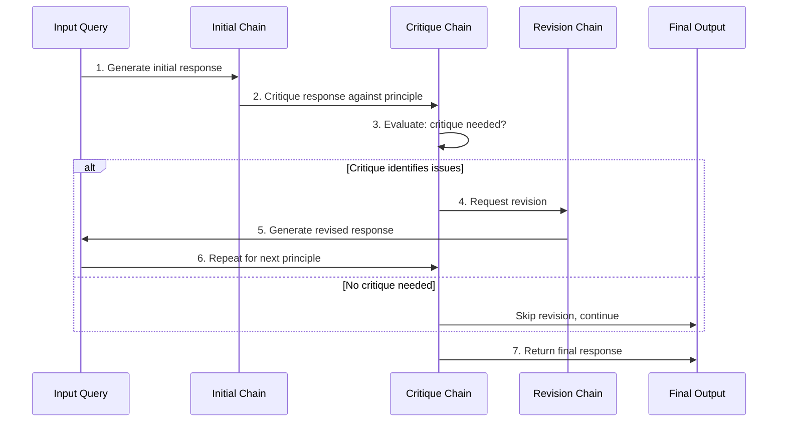
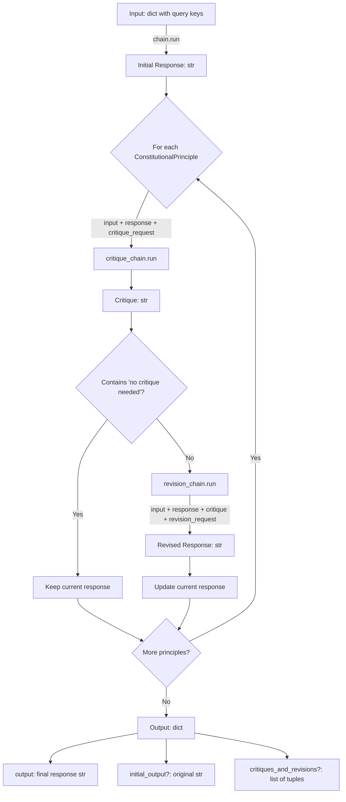

# ConstitutionalChain API Reference

!!! warning "Deprecated"
    **ConstitutionalChain is deprecated since version 0.2.13 and will be removed in version 1.0.**
    
    Please use LangGraph with structured output for constitutional AI patterns instead:
    
    ```python
    # Modern LangGraph approach (recommended)
    from langgraph.graph import StateGraph, START, END
    from langchain_core.output_parsers import StrOutputParser
    
    # See Migration Guide below for complete implementation
    ```
    
    See the [Migration Guide](#migration-guide) below for detailed conversion instructions.

## Overview

`ConstitutionalChain` is a legacy chain implementation that applies constitutional AI principles through an iterative self-critique and revision loop. The chain generates an initial response, then critiques and revises it according to a list of constitutional principles, producing outputs that better align with specified ethical and quality guidelines.

**Source:** `libs/langchain/langchain_classic/chains/constitutional_ai/base.py:29-333`

## Key Concepts

### Constitutional AI

Constitutional AI is an approach to aligning AI systems by having the model critique and revise its own outputs based on a set of principles or "constitution". This enables:

- **Self-correction**: The model identifies and fixes issues in its own responses
- **Ethical alignment**: Responses are revised to conform to specified ethical principles
- **Iterative refinement**: Multiple principles can be applied sequentially for comprehensive improvement
- **Transparency**: The critique and revision history provides insight into the refinement process

### Workflow

The ConstitutionalChain follows a three-phase execution workflow:



**Source:** `libs/langchain/langchain_classic/chains/constitutional_ai/base.py:249-323`

## Class Definition

```python
class ConstitutionalChain(Chain):
    """Chain for applying constitutional principles to model outputs through
    iterative critique and revision loops.
    
    This chain takes an initial response from a base chain and applies a series
    of constitutional principles. For each principle, it generates a critique
    and conditionally revises the response based on that critique.
    """
```

The ConstitutionalChain inherits from `Chain`, making it compatible with the standard Chain interface including memory, callbacks, and LCEL composition.

## Constructor Parameters

### Required Parameters

#### `chain`

**Type:** `LLMChain`

**Description:** The LLM chain responsible for generating the initial response to the input query. This chain is invoked first before any constitutional principles are applied.

**Example:**
```python
from langchain_classic.chains import LLMChain
from langchain_core.prompts import PromptTemplate
from langchain_openai import OpenAI

llm = OpenAI(temperature=0.7)
qa_prompt = PromptTemplate(
    template="Q: {question} A:",
    input_variables=["question"]
)
chain = LLMChain(llm=llm, prompt=qa_prompt)
```

**Source:** `libs/langchain/langchain_classic/chains/constitutional_ai/base.py:197`

---

#### `constitutional_principles`

**Type:** `list[ConstitutionalPrinciple]`

**Description:** A list of constitutional principles to apply to the initial response. Each principle contains a critique request and a revision request. The principles are applied sequentially, with each revision becoming the input for the next principle's critique.

**Structure:** Each `ConstitutionalPrinciple` contains:
- `critique_request` (str): Instructions for the critique chain on how to evaluate the response
- `revision_request` (str): Instructions for the revision chain on how to improve the response
- `name` (str, optional): A descriptive name for the principle (default: "Constitutional Principle")

**Example:**
```python
from langchain_classic.chains.constitutional_ai.models import ConstitutionalPrinciple

constitutional_principles = [
    ConstitutionalPrinciple(
        name="ethical-check",
        critique_request="Identify specific ways in which the response is harmful, unethical, racist, sexist, toxic, dangerous, or illegal.",
        revision_request="Please rewrite the response to remove any harmful, unethical, racist, sexist, toxic, dangerous, or illegal content."
    ),
    ConstitutionalPrinciple(
        name="helpful-check",
        critique_request="Evaluate whether the response is helpful and addresses the user's question.",
        revision_request="Revise the response to be more helpful and directly address the user's question."
    )
]
```

**Source:** `libs/langchain/langchain_classic/chains/constitutional_ai/base.py:198`

---

#### `critique_chain`

**Type:** `LLMChain`

**Description:** The LLM chain responsible for generating critiques of responses based on constitutional principles. This chain receives the original input, the current response, and the critique request from each principle.

**Default Behavior:** If not provided via `from_llm()` class method, defaults to an `LLMChain` with `CRITIQUE_PROMPT` template.

**Input Variables:**
- `input_prompt` (str): The formatted original input to the chain
- `output_from_model` (str): The current response being evaluated
- `critique_request` (str): The critique instructions from the constitutional principle

**Output:** A string critique that should end with either "No critique needed." or "Critique needed." to indicate whether revision is necessary.

**Example:**
```python
from langchain_classic.chains import LLMChain
from langchain_classic.chains.constitutional_ai.prompts import CRITIQUE_PROMPT
from langchain_openai import OpenAI

critique_chain = LLMChain(llm=OpenAI(temperature=0), prompt=CRITIQUE_PROMPT)
```

**Source:** `libs/langchain/langchain_classic/chains/constitutional_ai/base.py:199,228`

---

#### `revision_chain`

**Type:** `LLMChain`

**Description:** The LLM chain responsible for generating revised responses based on critiques. This chain receives the original input, the current response, the critique, and the revision request from each principle.

**Default Behavior:** If not provided via `from_llm()` class method, defaults to an `LLMChain` with `REVISION_PROMPT` template.

**Input Variables:**
- `input_prompt` (str): The formatted original input to the chain
- `output_from_model` (str): The current response being revised
- `critique_request` (str): The critique instructions from the constitutional principle
- `critique` (str): The critique generated by the critique chain
- `revision_request` (str): The revision instructions from the constitutional principle

**Output:** A string containing the revised response.

**Example:**
```python
from langchain_classic.chains import LLMChain
from langchain_classic.chains.constitutional_ai.prompts import REVISION_PROMPT
from langchain_openai import OpenAI

revision_chain = LLMChain(llm=OpenAI(temperature=0.7), prompt=REVISION_PROMPT)
```

**Source:** `libs/langchain/langchain_classic/chains/constitutional_ai/base.py:200,229`

---

### Optional Parameters

#### `return_intermediate_steps`

**Type:** `bool`

**Default:** `False`

**Description:** Whether to return intermediate critique and revision steps in the output. When `True`, the output dictionary includes:
- `initial_output`: The initial response before any constitutional principles were applied
- `critiques_and_revisions`: A list of `(critique, revision)` tuples for each principle applied

When `False`, only the final revised output is returned.

**Example:**
```python
constitutional_chain = ConstitutionalChain.from_llm(
    llm=llm,
    chain=qa_chain,
    constitutional_principles=principles,
    return_intermediate_steps=True  # Include all critique/revision history
)

result = constitutional_chain({"question": "What is AI ethics?"})
# result contains: {"output": "...", "initial_output": "...", "critiques_and_revisions": [...]}
```

**Source:** `libs/langchain/langchain_classic/chains/constitutional_ai/base.py:201,245-246,320-322`

---

## ConstitutionalPrinciple Model

### Class Definition

```python
class ConstitutionalPrinciple(BaseModel):
    """Pydantic model representing a single constitutional principle with
    critique and revision instructions.
    """
    
    critique_request: str
    revision_request: str
    name: str = "Constitutional Principle"
```

**Source:** `libs/langchain/langchain_classic/chains/constitutional_ai/models.py:6-12`

### Fields

#### `critique_request`

**Type:** `str`

**Required:** Yes

**Description:** Instructions for how to critique a model's response. This text is passed to the critique chain along with the response to be evaluated. Should clearly specify what aspects to look for (harmful content, factual errors, missing information, etc.).

**Example:**
```python
critique_request = "Identify specific ways in which the response is harmful, unethical, racist, sexist, toxic, dangerous, or illegal."
```

---

#### `revision_request`

**Type:** `str`

**Required:** Yes

**Description:** Instructions for how to revise a model's response based on the critique. This text is passed to the revision chain along with the critique to guide the revision process.

**Example:**
```python
revision_request = "Please rewrite the response to remove any harmful, unethical, racist, sexist, toxic, dangerous, or illegal content."
```

---

#### `name`

**Type:** `str`

**Required:** No

**Default:** `"Constitutional Principle"`

**Description:** A descriptive name for the principle. Used in logging and for principle identification. Helpful when applying multiple principles or retrieving specific principles.

**Example:**
```python
name = "ethical-check"
```

---

## Predefined Constitutional Principles

The ConstitutionalChain package includes 50+ predefined constitutional principles from research papers on AI alignment. These can be accessed via the `PRINCIPLES` dictionary or the `get_principles()` class method.

**Sources:**
- Bai et al. 2022: "Constitutional AI: Harmlessness from AI Feedback" ([arXiv:2212.08073](https://arxiv.org/pdf/2212.08073.pdf))
- Samwald et al. 2023: "Unified Objectives v0.2" (https://examine.dev/docs/Unified_objectives.pdf)

**Source:** `libs/langchain/langchain_classic/chains/constitutional_ai/principles.py:1-280`

### Available Principle Categories

#### Harmfulness Principles (`harmful1` - `harmful7`)

Focus on identifying and removing harmful, unethical, racist, sexist, toxic, dangerous, or illegal content.

**Example Principles:**
- `harmful1`: General harm identification
- `harmful2`: Harm to humans or others
- `harmful3`: Ethical and social bias concerns
- `harmful4`: Harmful assumptions in human queries

#### Insensitivity and Offense (`insensitive`, `offensive`)

Detect insensitive, offensive, or socially inappropriate content.

#### Age-Inappropriate Content (`age-inappropriate`)

Identify content unsuitable for children.

#### Derogatory Content (`derogatory`)

Detect derogatory, toxic, racist, sexist, or socially harmful language.

#### Illegal Activity (`illegal`, `criminal`)

Identify advice or encouragement of illegal or criminal activities.

#### Controversial Content (`controversial`)

Evaluate content that may be controversial based on ethical standards.

#### Thoughtfulness (`thoughtful`)

Assess whether responses are thoughtful, empathetic, and caring.

#### Misogyny (`misogynistic`)

Identify misogynistic or gender-biased content.

#### UnifiedObjectives Principles (`uo-*`)

Advanced principles covering:
- **Assumptions** (`uo-assumptions-1` to `uo-assumptions-3`): Underlying assumptions, viewpoints, objectivity
- **Reasoning** (`uo-reasoning-1` to `uo-reasoning-9`): Logical validity, reasoning structure, concept clarity, cognitive biases, formal reasoning correctness
- **Evidence** (`uo-evidence-1` to `uo-evidence-5`): Factual accuracy, information relevance, evidence support
- **Security** (`uo-security-1` to `uo-security-4`): Handling problematic inputs, honesty, content clarity
- **Ethics** (`uo-ethics-1` to `uo-ethics-6`): Harmful consequences, social biases, privacy, plagiarism, evasiveness
- **Utility** (`uo-utility-1` to `uo-utility-8`): Helpfulness, formatting, understandability, insights, causal relationships
- **Implications** (`uo-implications-1` to `uo-implications-3`): Consequences, suggestions, completion indicators

### Example: Using Predefined Principles

```python
from langchain_classic.chains import ConstitutionalChain

# Retrieve specific principles by name
principles = ConstitutionalChain.get_principles(
    names=["harmful1", "insensitive", "uo-ethics-1"]
)

# Get all available principles
all_principles = ConstitutionalChain.get_principles()

constitutional_chain = ConstitutionalChain.from_llm(
    llm=llm,
    chain=qa_chain,
    constitutional_principles=principles
)
```

**Source:** `libs/langchain/langchain_classic/chains/constitutional_ai/principles.py:9-280`

---

## Class Methods

### `from_llm()`

Factory method to create a ConstitutionalChain from a language model, automatically initializing critique and revision chains.

**Signature:**
```python
@classmethod
def from_llm(
    cls,
    llm: BaseLanguageModel,
    chain: LLMChain,
    critique_prompt: BasePromptTemplate = CRITIQUE_PROMPT,
    revision_prompt: BasePromptTemplate = REVISION_PROMPT,
    **kwargs: Any,
) -> "ConstitutionalChain"
```

**Args:**
- `llm` (BaseLanguageModel): The language model to use for critique and revision chains
- `chain` (LLMChain): The initial chain that generates responses to be evaluated
- `critique_prompt` (BasePromptTemplate, optional): Custom prompt template for the critique chain. Defaults to `CRITIQUE_PROMPT`
- `revision_prompt` (BasePromptTemplate, optional): Custom prompt template for the revision chain. Defaults to `REVISION_PROMPT`
- `**kwargs`: Additional arguments passed to the ConstitutionalChain constructor (e.g., `constitutional_principles`, `return_intermediate_steps`)

**Returns:**
- `ConstitutionalChain`: A fully configured constitutional chain instance

**Example:**
```python
from langchain_openai import OpenAI
from langchain_classic.chains import LLMChain, ConstitutionalChain
from langchain_core.prompts import PromptTemplate
from langchain_classic.chains.constitutional_ai.models import ConstitutionalPrinciple

llm = OpenAI(temperature=0.7)

qa_prompt = PromptTemplate(
    template="Q: {question} A:",
    input_variables=["question"]
)
qa_chain = LLMChain(llm=llm, prompt=qa_prompt)

constitutional_chain = ConstitutionalChain.from_llm(
    llm=llm,
    chain=qa_chain,
    constitutional_principles=[
        ConstitutionalPrinciple(
            name="helpfulness",
            critique_request="Is this response helpful and accurate?",
            revision_request="Make the response more helpful and accurate."
        )
    ],
    return_intermediate_steps=True
)

result = constitutional_chain({"question": "What is machine learning?"})
```

**Source:** `libs/langchain/langchain_classic/chains/constitutional_ai/base.py:218-235`

---

### `get_principles()`

Retrieve predefined constitutional principles by name.

**Signature:**
```python
@classmethod
def get_principles(
    cls,
    names: list[str] | None = None,
) -> list[ConstitutionalPrinciple]
```

**Args:**
- `names` (list[str] | None): List of principle names to retrieve. If `None`, returns all available principles.

**Returns:**
- `list[ConstitutionalPrinciple]`: List of constitutional principle objects

**Raises:**
- `KeyError`: If any requested principle name is not found in the PRINCIPLES dictionary

**Example:**
```python
# Get specific principles
principles = ConstitutionalChain.get_principles(
    names=["harmful1", "insensitive", "thoughtful"]
)

# Get all principles
all_principles = ConstitutionalChain.get_principles()
print(f"Found {len(all_principles)} predefined principles")
```

**Source:** `libs/langchain/langchain_classic/chains/constitutional_ai/base.py:203-216`

---

## Properties

### `input_keys`

**Type:** `list[str]`

**Description:** Returns the input keys expected by the chain, which are the same as the input keys of the wrapped `chain` parameter. These keys define what dictionary keys must be provided when invoking the constitutional chain.

**Example:**
```python
constitutional_chain = ConstitutionalChain.from_llm(
    llm=llm,
    chain=qa_chain,  # Has input_keys = ["question"]
    constitutional_principles=principles
)

print(constitutional_chain.input_keys)  # Output: ["question"]
```

**Source:** `libs/langchain/langchain_classic/chains/constitutional_ai/base.py:237-240`

---

### `output_keys`

**Type:** `list[str]`

**Description:** Returns the output keys that will be present in the chain's response dictionary. The keys vary based on the `return_intermediate_steps` parameter:

- **When `return_intermediate_steps=False` (default):** `["output"]`
- **When `return_intermediate_steps=True`:** `["output", "critiques_and_revisions", "initial_output"]`

**Output Structure:**
- `output` (str): The final revised response after all constitutional principles have been applied
- `initial_output` (str, optional): The original response before any critiques or revisions
- `critiques_and_revisions` (list[tuple[str, str]], optional): List of (critique, revision) pairs for each principle

**Example:**
```python
# With return_intermediate_steps=False
chain1 = ConstitutionalChain.from_llm(llm=llm, chain=qa_chain, constitutional_principles=principles)
print(chain1.output_keys)  # Output: ["output"]

# With return_intermediate_steps=True
chain2 = ConstitutionalChain.from_llm(
    llm=llm, 
    chain=qa_chain, 
    constitutional_principles=principles,
    return_intermediate_steps=True
)
print(chain2.output_keys)  # Output: ["output", "critiques_and_revisions", "initial_output"]
```

**Source:** `libs/langchain/langchain_classic/chains/constitutional_ai/base.py:242-247`

---

## Execution Methods

### `__call__()` / `invoke()`

Execute the constitutional chain synchronously with the given inputs.

**Inherited from Chain base class.** See [Chain API Reference](../base.md#invoke) for full details.

**Input:**
- Dictionary with keys matching `input_keys` (typically the keys expected by the initial `chain`)

**Output:**
- Dictionary with keys matching `output_keys` (see [output_keys property](#output_keys) above)

**Example:**
```python
result = constitutional_chain.invoke({"question": "What is the meaning of life?"})
print(result["output"])  # Final revised response

# With intermediate steps
result_detailed = constitutional_chain_verbose.invoke({"question": "Tell me about AI safety"})
print(result_detailed["initial_output"])  # Original response
print(result_detailed["critiques_and_revisions"])  # [(critique1, revision1), ...]
print(result_detailed["output"])  # Final response
```

---

## Type Flow Documentation

The ConstitutionalChain follows a complex multi-stage type flow with iterative critique and revision loops:



### Detailed Execution Flow

#### Phase 1: Initial Response Generation

```
Input: Dict[str, Any]  # Keys match chain.input_keys
    ↓
chain.run(**inputs)
    ↓
initial_response: str
```

**Source:** `libs/langchain/langchain_classic/chains/constitutional_ai/base.py:255-259`

---

#### Phase 2: Iterative Critique Loop

For each `ConstitutionalPrinciple` in `constitutional_principles`:

```
critique_chain.run(
    input_prompt=formatted_input,       # str
    output_from_model=current_response, # str
    critique_request=principle.critique_request  # str
) → raw_critique: str
    ↓
Parse critique (remove "Revision request:" if present)
    ↓
parsed_critique: str
```

**Source:** `libs/langchain/langchain_classic/chains/constitutional_ai/base.py:268-279,325-332`

---

#### Phase 3: Conditional Revision

```
if "no critique needed" in parsed_critique.lower():
    critiques_and_revisions.append((parsed_critique, ""))
    # Skip to next principle
else:
    revision_chain.run(
        input_prompt=formatted_input,
        output_from_model=current_response,
        critique_request=principle.critique_request,
        critique=parsed_critique,
        revision_request=principle.revision_request
    ) → revision: str
    
    current_response = revision  # Update for next iteration
    critiques_and_revisions.append((parsed_critique, revision))
```

**Source:** `libs/langchain/langchain_classic/chains/constitutional_ai/base.py:284-299`

---

#### Phase 4: Output Construction

```
if return_intermediate_steps:
    output = {
        "output": final_response,                      # str
        "initial_output": initial_response,            # str
        "critiques_and_revisions": critiques_and_revisions  # list[tuple[str, str]]
    }
else:
    output = {
        "output": final_response  # str
    }

return output: Dict[str, Any]
```

**Source:** `libs/langchain/langchain_classic/chains/constitutional_ai/base.py:319-323`

---

## Migration Guide

### Why Migrate?

The ConstitutionalChain class is deprecated in favor of LangGraph implementations because:

1. **Better type safety**: LangGraph uses structured output with Pydantic models instead of string parsing
2. **Improved streaming**: Support for both token-by-token and step-by-step streaming
3. **State management**: Built-in checkpointing and conversation memory
4. **Easier extensibility**: Simple to add new nodes, modify logic, or integrate additional tools
5. **Clearer control flow**: Explicit state transitions instead of implicit iteration

### Modern LangGraph Implementation

**Installation:**
```bash
pip install -U langgraph
```

**Complete Example:**

```python
from typing import List, Tuple
from typing_extensions import Annotated, TypedDict

from langchain_classic.chains.constitutional_ai.models import ConstitutionalPrinciple
from langchain_classic.chains.constitutional_ai.prompts import (
    CRITIQUE_PROMPT,
    REVISION_PROMPT,
)
from langchain_core.output_parsers import StrOutputParser
from langchain_core.prompts import ChatPromptTemplate
from langchain_openai import ChatOpenAI
from langgraph.graph import END, START, StateGraph

# Initialize model
model = ChatOpenAI(model="gpt-4o-mini")

# Define structured output for critiques
class Critique(TypedDict):
    """Structured critique output."""
    critique_needed: Annotated[bool, ..., "Whether or not a critique is needed."]
    critique: Annotated[str, ..., "If needed, the critique."]

# Create prompts using modern ChatPromptTemplate
critique_prompt = ChatPromptTemplate.from_template(
    "Critique this response according to the critique request. "
    "If no critique is needed, specify that.\n\n"
    "Query: {query}\n\n"
    "Response: {response}\n\n"
    "Critique request: {critique_request}"
)

revision_prompt = ChatPromptTemplate.from_template(
    "Revise this response according to the critique and revision request.\n\n"
    "Query: {query}\n\n"
    "Response: {response}\n\n"
    "Critique request: {critique_request}\n\n"
    "Critique: {critique}\n\n"
    "If the critique does not identify anything worth changing, ignore the "
    "revision request and return 'No revisions needed'. If the critique "
    "does identify something worth changing, revise the response based on "
    "the revision request.\n\n"
    "Revision Request: {revision_request}"
)

# Create chains using LCEL
chain = model | StrOutputParser()
critique_chain = critique_prompt | model.with_structured_output(Critique)
revision_chain = revision_prompt | model | StrOutputParser()

# Define state schema
class State(TypedDict):
    query: str
    constitutional_principles: List[ConstitutionalPrinciple]
    initial_response: str
    critiques_and_revisions: List[Tuple[str, str]]
    response: str

# Define graph nodes
async def generate_response(state: State):
    """Generate initial response."""
    response = await chain.ainvoke(state["query"])
    return {"response": response, "initial_response": response}

async def critique_and_revise(state: State):
    """Critique and revise response according to principles."""
    critiques_and_revisions = []
    response = state["initial_response"]
    
    for principle in state["constitutional_principles"]:
        # Generate critique using structured output
        critique = await critique_chain.ainvoke({
            "query": state["query"],
            "response": response,
            "critique_request": principle.critique_request,
        })
        
        # Only revise if critique is needed
        if critique["critique_needed"]:
            revision = await revision_chain.ainvoke({
                "query": state["query"],
                "response": response,
                "critique_request": principle.critique_request,
                "critique": critique["critique"],
                "revision_request": principle.revision_request,
            })
            response = revision
            critiques_and_revisions.append((critique["critique"], revision))
        else:
            critiques_and_revisions.append((critique["critique"], ""))
    
    return {
        "critiques_and_revisions": critiques_and_revisions,
        "response": response,
    }

# Build graph
graph = StateGraph(State)
graph.add_node("generate_response", generate_response)
graph.add_node("critique_and_revise", critique_and_revise)

graph.add_edge(START, "generate_response")
graph.add_edge("generate_response", "critique_and_revise")
graph.add_edge("critique_and_revise", END)

# Compile graph
app = graph.compile()
```

**Usage:**

```python
from langchain_classic.chains.constitutional_ai.models import ConstitutionalPrinciple

# Define constitutional principles
constitutional_principles = [
    ConstitutionalPrinciple(
        name="helpfulness",
        critique_request="Tell if this answer is good.",
        revision_request="Give a better answer.",
    )
]

# Execute with streaming
query = "What is the meaning of life? Answer in 10 words or fewer."

async for step in app.astream(
    {"query": query, "constitutional_principles": constitutional_principles},
    stream_mode="values",
):
    subset = ["initial_response", "critiques_and_revisions", "response"]
    print({k: v for k, v in step.items() if k in subset})
```

**Key Differences:**

| Aspect | ConstitutionalChain (Deprecated) | LangGraph (Modern) |
|--------|----------------------------------|-------------------|
| Critique Output | String parsing (`"No critique needed"`) | Structured output with `critique_needed` boolean |
| State Management | Implicit in method | Explicit TypedDict state |
| Streaming | Limited | Full support (token and step streaming) |
| Extensibility | Subclass or modify prompts | Add nodes to graph |
| Type Safety | String-based | Pydantic models |
| Async Support | Basic | Full async with checkpointing |

**Source:** `libs/langchain/langchain_classic/chains/constitutional_ai/base.py:20-164`

---

## Troubleshooting

### Common Issues

#### 1. Critique Chain Not Identifying Issues

**Symptom:** All critiques return "No critique needed" even when issues are present.

**Cause:** The critique chain's output doesn't match the expected format, or the LLM is being too lenient.

**Solutions:**
- Ensure critique_chain produces output ending with "No critique needed." or "Critique needed."
- Use a lower temperature for the critique LLM (e.g., `temperature=0`)
- Make critique requests more specific and directive
- Provide few-shot examples in custom critique prompts

---

#### 2. Token Limit Exceeded

**Symptom:** `openai.error.InvalidRequestError: This model's maximum context length is...`

**Cause:** With many constitutional principles, the accumulated context (input + response + critiques + revisions) exceeds model token limits.

**Solutions:**
- Reduce the number of constitutional principles
- Use a model with larger context window (e.g., GPT-4 with 32k tokens)
- Implement chunking for very long responses
- Use `return_intermediate_steps=False` to reduce output size

---

#### 3. Revision Chain Not Making Changes

**Symptom:** Revisions are identical to original responses despite valid critiques.

**Cause:** Revision prompt is not directive enough, or LLM is ignoring revision requests.

**Solutions:**
- Increase revision_chain LLM temperature for more creative revisions
- Make revision_request more specific about desired changes
- Ensure revision_request aligns with critique_request
- Provide few-shot examples of good revisions

---

#### 4. Slow Execution with Many Principles

**Symptom:** Chain takes very long to complete when many principles are applied.

**Cause:** Sequential application of principles requires multiple LLM calls per principle.

**Solutions:**
- Reduce number of principles (consolidate similar ones)
- Use faster LLMs for critique/revision (e.g., GPT-3.5 instead of GPT-4)
- Consider parallel critique evaluation (requires custom implementation)
- Migrate to LangGraph for better async handling

---

#### 5. Inconsistent Critique Format

**Symptom:** `_parse_critique()` extracts unexpected content from critiques.

**Cause:** LLM is not following the expected critique format from the prompt.

**Solutions:**
- Use the default `CRITIQUE_PROMPT` which includes few-shot examples
- Explicitly instruct the LLM to end critiques with "Critique needed." or "No critique needed."
- Implement custom parsing logic in a subclass if needed
- Use structured output (migrate to LangGraph solution)

---

## Complete Usage Example

Here's a comprehensive example demonstrating the full capabilities of ConstitutionalChain:

```python
from langchain_openai import OpenAI
from langchain_classic.chains import LLMChain, ConstitutionalChain
from langchain_core.prompts import PromptTemplate
from langchain_classic.chains.constitutional_ai.models import ConstitutionalPrinciple

# Initialize LLM
llm = OpenAI(temperature=0.7)

# Create initial QA chain
qa_prompt = PromptTemplate(
    template="Question: {question}\n\nAnswer:",
    input_variables=["question"]
)
qa_chain = LLMChain(llm=llm, prompt=qa_prompt)

# Define custom constitutional principles
principles = [
    ConstitutionalPrinciple(
        name="accuracy",
        critique_request=(
            "Identify any factual inaccuracies or misleading statements in the response. "
            "Check if claims are supported by evidence."
        ),
        revision_request=(
            "Revise the response to correct any factual errors and ensure all claims "
            "are accurate and well-supported."
        )
    ),
    ConstitutionalPrinciple(
        name="completeness",
        critique_request=(
            "Evaluate whether the response fully addresses all aspects of the question. "
            "Identify any missing information or unexplored angles."
        ),
        revision_request=(
            "Expand the response to comprehensively address all aspects of the question "
            "and provide complete information."
        )
    ),
    ConstitutionalPrinciple(
        name="clarity",
        critique_request=(
            "Assess the clarity and readability of the response. "
            "Identify any confusing language, jargon, or poorly explained concepts."
        ),
        revision_request=(
            "Rewrite the response to be clearer and more accessible, "
            "defining technical terms and improving explanation quality."
        )
    ),
]

# Create constitutional chain with intermediate steps
constitutional_chain = ConstitutionalChain.from_llm(
    llm=llm,
    chain=qa_chain,
    constitutional_principles=principles,
    return_intermediate_steps=True,
    verbose=True  # Enable verbose logging to see the process
)

# Execute chain
question = "What is quantum computing and why is it important?"
result = constitutional_chain({"question": question})

# Access results
print("=" * 80)
print("INITIAL RESPONSE (before constitutional principles):")
print("=" * 80)
print(result["initial_output"])
print()

print("=" * 80)
print("CRITIQUES AND REVISIONS:")
print("=" * 80)
for i, (critique, revision) in enumerate(result["critiques_and_revisions"], 1):
    print(f"\nPrinciple {i}: {principles[i-1].name}")
    print(f"Critique: {critique[:200]}..." if len(critique) > 200 else f"Critique: {critique}")
    if revision:
        print(f"Revision: {revision[:200]}..." if len(revision) > 200 else f"Revision: {revision}")
    else:
        print("Revision: (No revision needed)")
print()

print("=" * 80)
print("FINAL RESPONSE (after all constitutional principles):")
print("=" * 80)
print(result["output"])
```

**Expected Output Structure:**

```
================================================================================
INITIAL RESPONSE (before constitutional principles):
================================================================================
Quantum computing is a type of computing that uses quantum-mechanical phenomena...

================================================================================
CRITIQUES AND REVISIONS:
================================================================================

Principle 1: accuracy
Critique: The response provides generally accurate information about quantum computing...
Revision: Quantum computing is a revolutionary computing paradigm that leverages...

Principle 2: completeness
Critique: While the response covers basic concepts, it doesn't fully explore...
Revision: Quantum computing represents a fundamental shift in computational...

Principle 3: clarity
Critique: Some technical terms like "superposition" and "entanglement" are used...
Revision: Quantum computing is an advanced form of computing that operates on...

================================================================================
FINAL RESPONSE (after all constitutional principles):
================================================================================
Quantum computing is an advanced form of computing that operates on fundamentally...
```

---

## See Also

- [Chain Base Class](../base.md) - Core Chain interface and methods
- [LLMChain](../llm-chain.md) - The base chain used for generating initial responses
- [LangGraph Documentation](https://langchain-ai.github.io/langgraph/) - Modern replacement for complex chains
- [Constitutional AI Paper](https://arxiv.org/pdf/2212.08073.pdf) - Original research on constitutional AI
- [LCEL Guide](../../../guides/lcel-composition.md) - LangChain Expression Language composition patterns

---

## API Summary

### Classes

- `ConstitutionalChain` - Main chain class for applying constitutional principles
- `ConstitutionalPrinciple` - Pydantic model representing a single principle

### Class Methods

- `from_llm()` - Factory method to create chain from a language model
- `get_principles()` - Retrieve predefined constitutional principles

### Instance Methods (Inherited from Chain)

- `__call__()` / `invoke()` - Execute chain synchronously
- `run()` - Execute chain and return only the primary output value
- `apply()` - Execute chain on multiple inputs
- See [Chain Base Class](../base.md) for complete method list

### Properties

- `input_keys` - List of required input dictionary keys
- `output_keys` - List of output dictionary keys
- `chain` - The wrapped initial response chain
- `constitutional_principles` - List of principles to apply
- `critique_chain` - Chain for generating critiques
- `revision_chain` - Chain for generating revisions
- `return_intermediate_steps` - Whether to include critique/revision history

### Predefined Principles Dictionary

Access via `PRINCIPLES` constant or `get_principles()` class method. Contains 50+ principles including:
- Harmfulness detection (`harmful1`-`harmful7`)
- Insensitivity and offense (`insensitive`, `offensive`)
- Illegal activity (`illegal`, `criminal`)
- UnifiedObjectives principles (`uo-assumptions-*`, `uo-reasoning-*`, `uo-evidence-*`, `uo-security-*`, `uo-ethics-*`, `uo-utility-*`, `uo-implications-*`)

---

**Last Updated:** 2024
**API Version:** langchain-classic 1.0 (deprecated)
**Replacement:** LangGraph with structured output
