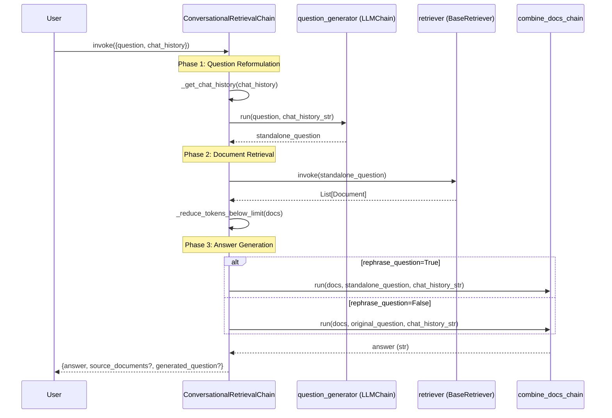

# ConversationalRetrievalChain API Reference

> **⚠️ DEPRECATION NOTICE**  
> `ConversationalRetrievalChain` is deprecated since version **0.1.17** and will be removed in version **1.0**.  
> **Migration Required**: Use `create_history_aware_retriever` + `create_retrieval_chain` instead.  
> See [Migration Guide](#migration-to-modern-lcel-pattern) below for complete examples.

---

## Overview

`ConversationalRetrievalChain` implements a question-answering system over retrieved documents with chat history context integration. This chain enables conversational interactions where follow-up questions can reference previous conversation turns, with automatic question reformulation to create standalone queries for effective document retrieval.

**Source**: `libs/langchain/langchain_classic/chains/conversational_retrieval/base.py:266`

**Key Features**:
- Automatic question reformulation using chat history context
- Flexible chat history format support (tuples or BaseMessage objects)
- Token-limited document retrieval for large document sets
- Optional source document and generated question returns
- Dual async/sync API support

**Alternative Documentation**: https://python.langchain.com/docs/use_cases/question_answering/chat_history

---

## Architecture and Execution Flow

### Three-Phase Execution Workflow

The `ConversationalRetrievalChain` executes through three distinct phases:



### Detailed Phase Descriptions

**Phase 1: Standalone Question Generation**
- **Input**: Original question + chat history (list of message tuples or BaseMessage objects)
- **Process**: Chat history is formatted into a string using `_get_chat_history()` or custom `get_chat_history` function
- **Action**: `question_generator` LLMChain combines chat context with the new question to produce a standalone question
- **Purpose**: Create a self-contained question that can be understood without chat history, improving retrieval accuracy
- **Source**: Lines 152-164 in `base.py`

**Phase 2: Document Retrieval**
- **Input**: Standalone question from Phase 1
- **Process**: Retriever fetches relevant documents based on the standalone question
- **Optional**: If `max_tokens_limit` is set and `combine_docs_chain` is `StuffDocumentsChain`, documents are pruned to stay under token limit
- **Output**: List of relevant Document objects
- **Source**: Lines 419-423 in `base.py`

**Phase 3: Answer Generation**
- **Input**: Retrieved documents + question (standalone or original based on `rephrase_question` flag) + formatted chat history
- **Process**: `combine_docs_chain` generates answer from documents and question context
- **Output**: Dictionary containing answer string and optional source documents/generated question
- **Source**: Lines 176-191 in `base.py`

---

## Class Definition

```python
class ConversationalRetrievalChain(BaseConversationalRetrievalChain):
    """Chain for having a conversation based on retrieved documents."""
```

**Inheritance**: 
- `BaseConversationalRetrievalChain` → `Chain` → `RunnableSerializable[dict, dict]`

**Source**: `libs/langchain/langchain_classic/chains/conversational_retrieval/base.py:266`

---

## Constructor Parameters

### retriever

**Type**: `BaseRetriever`

**Required**: Yes

**Description**: The retriever component responsible for fetching relevant documents based on the standalone question generated from chat history and user input. Any LangChain retriever implementation can be used (vector store retrievers, multi-query retrievers, contextual compression retrievers, etc.).

**Usage**:
```python
from langchain_community.vectorstores import FAISS
from langchain_openai import OpenAIEmbeddings

vectorstore = FAISS.from_texts(texts, OpenAIEmbeddings())
retriever = vectorstore.as_retriever(search_kwargs={"k": 4})
```

**Source**: Lines 384-385 in `base.py`

### combine_docs_chain

**Type**: `BaseCombineDocumentsChain`

**Required**: Yes

**Description**: The chain used to combine retrieved documents and generate the final answer. This chain receives the documents, question, and chat history as inputs and produces the answer string.

**Common Implementations**:
- `StuffDocumentsChain`: Stuffs all documents into a single prompt (supports `max_tokens_limit`)
- `MapReduceDocumentsChain`: Maps over documents individually, then reduces to final answer
- `RefineDocumentsChain`: Iteratively refines answer with each document

**Input Variables Expected**:
- `input_documents`: List of Document objects
- `question`: Question string (standalone or original based on `rephrase_question`)
- `chat_history`: Formatted chat history string
- Additional custom variables passed in original input

**Source**: Lines 80-81 in `base.py`

### question_generator

**Type**: `LLMChain`

**Required**: Yes

**Description**: The LLM chain used to generate a standalone question from the current question and chat history. This chain must accept `question` and `chat_history` as input variables in its prompt template.

**Required Input Variables**:
- `question`: The current user question (str)
- `chat_history`: Formatted chat history (str)

**Default Prompt**: `CONDENSE_QUESTION_PROMPT` from `conversational_retrieval/prompts.py`

**Example**:
```python
from langchain_classic.chains import LLMChain
from langchain_core.prompts import PromptTemplate
from langchain_openai import OpenAI

template = """Given the following conversation and a follow up question, rephrase the follow up question to be a standalone question, in its original language.

Chat History:
{chat_history}
Follow Up Input: {question}
Standalone question:"""

prompt = PromptTemplate.from_template(template)
question_generator = LLMChain(llm=OpenAI(), prompt=prompt)
```

**Source**: Lines 82-86 in `base.py`

### output_key

**Type**: `str`

**Default**: `"answer"`

**Description**: The dictionary key used to store the final answer in the output dictionary. Customize this if you need the answer under a different key name.

**Source**: Lines 87-88 in `base.py`

### rephrase_question

**Type**: `bool`

**Default**: `True`

**Description**: Controls which question is passed to `combine_docs_chain` for answer generation.

- **`True`**: Pass the standalone question generated by `question_generator` (default behavior)
- **`False`**: Pass the original user question

**Use Case for False**: When you want the combine chain to see the exact user phrasing, even though retrieval used the standalone question.

**Source**: Lines 89-93 in `base.py`

### return_source_documents

**Type**: `bool`

**Default**: `False`

**Description**: If `True`, includes the retrieved source documents in the output dictionary under the `"source_documents"` key. Useful for citation, transparency, or debugging retrieval quality.

**Output Impact**: Adds `"source_documents": List[Document]` to output dictionary.

**Source**: Lines 94-95 in `base.py`

### return_generated_question

**Type**: `bool`

**Default**: `False`

**Description**: If `True`, includes the standalone question generated by `question_generator` in the output dictionary under the `"generated_question"` key. Useful for understanding how the chain reformulated the user's question.

**Output Impact**: Adds `"generated_question": str` to output dictionary.

**Source**: Lines 96-97 in `base.py`

### max_tokens_limit

**Type**: `int | None`

**Default**: `None`

**Description**: If set, enforces that the total tokens in retrieved documents stay below this limit. Documents are truncated from the end of the list until the token count is acceptable.

**Important Constraints**:
- **Only works** when `combine_docs_chain` is an instance of `StuffDocumentsChain`
- Ignored for other chain types (MapReduce, Refine, etc.)
- Token counting uses `llm_chain._get_num_tokens()` from the StuffDocumentsChain

**Use Case**: Prevent exceeding context window limits when dealing with large document sets.

**Source**: Lines 386-390 in `base.py`

### get_chat_history

**Type**: `Callable[[list[CHAT_TURN_TYPE]], str] | None`

**Default**: `None`

**Description**: Optional custom function to format chat history into a string. If `None`, uses the default `_get_chat_history()` function.

**Function Signature**: `(list[tuple[str, str] | BaseMessage]) -> str`

**Default Formatting** (when `None`):
- Tuple format `(human, ai)`: Formatted as `"Human: {human}\nAssistant: {ai}"`
- BaseMessage format: Formatted as `"{message.type}: {message.content}"`

**Custom Example**:
```python
def custom_formatter(chat_history):
    return "\n".join([f"Q: {h}\nA: {a}" for h, a in chat_history])

chain = ConversationalRetrievalChain(
    get_chat_history=custom_formatter,
    # ... other parameters
)
```

**Source**: Lines 98-100 in `base.py`

### response_if_no_docs_found

**Type**: `str | None`

**Default**: `None`

**Description**: If specified and the retriever returns zero documents, the chain returns this fixed response instead of calling `combine_docs_chain`.

**Use Case**: Provide a helpful fallback message when no relevant documents are found.

**Example**:
```python
chain = ConversationalRetrievalChain(
    response_if_no_docs_found="I couldn't find any relevant information to answer your question.",
    # ... other parameters
)
```

**Source**: Lines 101-103 in `base.py`

---

## Input Schema

### Required Input Keys

The chain expects a dictionary input with the following keys:

| Key | Type | Description |
|-----|------|-------------|
| `question` | `str` | The current user question or follow-up question |
| `chat_history` | `list[tuple[str, str] \| BaseMessage]` | Previous conversation turns |

**Source**: Lines 112-114 in `base.py`

### Chat History Format Options

`ConversationalRetrievalChain` accepts two chat history formats:

**Format 1: Tuple Format** (most common)
```python
chat_history = [
    ("What is LangChain?", "LangChain is a framework for building LLM applications."),
    ("What languages does it support?", "It primarily supports Python and JavaScript."),
]
```

**Format 2: BaseMessage Format**
```python
from langchain_core.messages import HumanMessage, AIMessage

chat_history = [
    HumanMessage(content="What is LangChain?"),
    AIMessage(content="LangChain is a framework for building LLM applications."),
    HumanMessage(content="What languages does it support?"),
    AIMessage(content="It primarily supports Python and JavaScript."),
]
```

**Type Definition**: `CHAT_TURN_TYPE = tuple[str, str] | BaseMessage`

**Source**: Lines 39, 68-74 in `base.py`

---

## Output Schema

The chain returns a dictionary with the following structure:

| Key | Type | Always Present | Description |
|-----|------|----------------|-------------|
| `answer` (or custom `output_key`) | `str` | Yes | The generated answer from combine_docs_chain |
| `source_documents` | `List[Document]` | Only if `return_source_documents=True` | Retrieved documents used for answer generation |
| `generated_question` | `str` | Only if `return_generated_question=True` | Standalone question created by question_generator |

**Example Output**:
```python
{
    "answer": "LangChain supports both Python and JavaScript/TypeScript.",
    "source_documents": [
        Document(page_content="LangChain offers SDKs for Python...", metadata={}),
        Document(page_content="The JavaScript version is called LangChain.js...", metadata={})
    ],
    "generated_question": "What programming languages does LangChain support?"
}
```

**Source**: Lines 124-134, 172-191 in `base.py`

---

## Factory Method: from_llm()

### Method Signature

```python
@classmethod
def from_llm(
    cls,
    llm: BaseLanguageModel,
    retriever: BaseRetriever,
    condense_question_prompt: BasePromptTemplate = CONDENSE_QUESTION_PROMPT,
    chain_type: str = "stuff",
    verbose: bool = False,
    condense_question_llm: BaseLanguageModel | None = None,
    combine_docs_chain_kwargs: dict | None = None,
    callbacks: Callbacks = None,
    **kwargs: Any,
) -> BaseConversationalRetrievalChain
```

**Source**: Lines 440-452 in `base.py`

### Parameters

#### llm

**Type**: `BaseLanguageModel`

**Description**: The default language model used for both question generation and answer generation (unless `condense_question_llm` is specified).

#### retriever

**Type**: `BaseRetriever`

**Description**: The retriever to use for fetching relevant documents.

#### condense_question_prompt

**Type**: `BasePromptTemplate`

**Default**: `CONDENSE_QUESTION_PROMPT`

**Description**: The prompt template for the question generator chain. Must include `{chat_history}` and `{question}` variables.

**Default Prompt Text**:
```
Given the following conversation and a follow up question, rephrase the follow up question to be a standalone question, in its original language.

Chat History:
{chat_history}
Follow Up Input: {question}
Standalone question:
```

**Source**: Lines 3-9 in `prompts.py`

#### chain_type

**Type**: `str`

**Default**: `"stuff"`

**Description**: The type of combine documents chain to create. Passed to `load_qa_chain()`.

**Valid Options**:
- `"stuff"`: StuffDocumentsChain (all docs in one prompt)
- `"map_reduce"`: MapReduceDocumentsChain (parallel processing)
- `"refine"`: RefineDocumentsChain (iterative refinement)
- `"map_rerank"`: MapRerankDocumentsChain (ranked responses)

#### verbose

**Type**: `bool`

**Default**: `False`

**Description**: If `True`, prints intermediate steps and chain execution details to stdout.

#### condense_question_llm

**Type**: `BaseLanguageModel | None`

**Default**: `None`

**Description**: Optional separate language model for question generation. If `None`, uses the main `llm` parameter.

**Use Case**: Use a faster/cheaper model for question reformulation and a more powerful model for answer generation.

#### combine_docs_chain_kwargs

**Type**: `dict | None`

**Default**: `None`

**Description**: Additional keyword arguments passed to `load_qa_chain()` when constructing the combine documents chain.

**Example**:
```python
combine_docs_chain_kwargs = {
    "prompt": custom_qa_prompt,
    "document_variable_name": "context"
}
```

#### callbacks

**Type**: `Callbacks`

**Default**: `None`

**Description**: Callback handlers passed to all subchains (question generator and combine docs chain).

#### **kwargs

**Type**: `Any`

**Description**: Additional parameters passed to the `ConversationalRetrievalChain` constructor (e.g., `return_source_documents`, `max_tokens_limit`).

### Returns

**Type**: `BaseConversationalRetrievalChain`

**Description**: Fully configured conversational retrieval chain with automatically created question generator and combine documents chain.

### Example Usage

```python
from langchain_classic.chains import ConversationalRetrievalChain
from langchain_community.vectorstores import FAISS
from langchain_openai import ChatOpenAI, OpenAIEmbeddings

# Setup
vectorstore = FAISS.from_texts(["doc1", "doc2"], OpenAIEmbeddings())
retriever = vectorstore.as_retriever()
llm = ChatOpenAI(model="gpt-3.5-turbo")

# Create chain using from_llm factory
chain = ConversationalRetrievalChain.from_llm(
    llm=llm,
    retriever=retriever,
    return_source_documents=True,
    verbose=True
)

# Use the chain
chat_history = []
result = chain.invoke({
    "question": "What is in the documents?",
    "chat_history": chat_history
})
print(result["answer"])

# Continue conversation
chat_history.append((result["question"], result["answer"]))
result = chain.invoke({
    "question": "Tell me more about that",
    "chat_history": chat_history
})
```

**Source**: Lines 440-498 in `base.py`

---

## Migration to Modern LCEL Pattern

The modern LCEL pattern provides better composability, type safety, and integration with LangChain's streaming and async capabilities. Below is a complete migration example.

### Deprecated Pattern (ConversationalRetrievalChain)

```python
from langchain_classic.chains import ConversationalRetrievalChain
from langchain_community.vectorstores import FAISS
from langchain_openai import ChatOpenAI, OpenAIEmbeddings

# Setup retriever
vectorstore = FAISS.from_texts(document_texts, OpenAIEmbeddings())
retriever = vectorstore.as_retriever()

# Create deprecated chain
chain = ConversationalRetrievalChain.from_llm(
    llm=ChatOpenAI(),
    retriever=retriever,
    return_source_documents=True
)

# Usage
chat_history = []
result = chain.invoke({
    "question": "What is LangChain?",
    "chat_history": chat_history
})
```

### Modern LCEL Pattern (Recommended)

```python
from langchain_classic.chains import (
    create_history_aware_retriever,
    create_retrieval_chain,
)
from langchain_classic.chains.combine_documents import (
    create_stuff_documents_chain,
)
from langchain_core.prompts import ChatPromptTemplate, MessagesPlaceholder
from langchain_openai import ChatOpenAI
from langchain_community.vectorstores import FAISS
from langchain_openai import OpenAIEmbeddings

# Setup retriever (same as before)
vectorstore = FAISS.from_texts(document_texts, OpenAIEmbeddings())
retriever = vectorstore.as_retriever()

model = ChatOpenAI()

# Step 1: Create history-aware retriever
# This replaces question_generator functionality
contextualize_q_system_prompt = (
    "Given a chat history and the latest user question "
    "which might reference context in the chat history, "
    "formulate a standalone question which can be understood "
    "without the chat history. Do NOT answer the question, just "
    "reformulate it if needed and otherwise return it as is."
)
contextualize_q_prompt = ChatPromptTemplate.from_messages(
    [
        ("system", contextualize_q_system_prompt),
        MessagesPlaceholder("chat_history"),
        ("human", "{input}"),
    ]
)
history_aware_retriever = create_history_aware_retriever(
    model, retriever, contextualize_q_prompt
)

# Step 2: Create question-answering chain
# This replaces combine_docs_chain functionality
qa_system_prompt = (
    "You are an assistant for question-answering tasks. Use "
    "the following pieces of retrieved context to answer the "
    "question. If you don't know the answer, just say that you "
    "don't know. Use three sentences maximum and keep the answer "
    "concise."
    "\n\n"
    "{context}"
)
qa_prompt = ChatPromptTemplate.from_messages(
    [
        ("system", qa_system_prompt),
        MessagesPlaceholder("chat_history"),
        ("human", "{input}"),
    ]
)
question_answer_chain = create_stuff_documents_chain(model, qa_prompt)

# Step 3: Combine into retrieval chain
rag_chain = create_retrieval_chain(history_aware_retriever, question_answer_chain)

# Usage (note: uses "input" instead of "question")
chat_history = []  # List of BaseMessage objects
result = rag_chain.invoke({"input": "What is LangChain?", "chat_history": chat_history})
print(result["answer"])

# Continue conversation (append HumanMessage and AIMessage objects)
from langchain_core.messages import HumanMessage, AIMessage
chat_history.append(HumanMessage(content="What is LangChain?"))
chat_history.append(AIMessage(content=result["answer"]))

result = rag_chain.invoke({"input": "Tell me more", "chat_history": chat_history})
```

**Source**: Lines 273-333 in `base.py`

### Key Migration Differences

| Aspect | ConversationalRetrievalChain | Modern LCEL Pattern |
|--------|------------------------------|---------------------|
| **Input Key** | `"question"` | `"input"` |
| **Chat History Format** | `list[tuple[str, str]]` or `list[BaseMessage]` | `list[BaseMessage]` (recommended) |
| **Composition** | Single monolithic chain | Composable: history_aware_retriever + question_answer_chain |
| **Question Generator** | Separate `LLMChain` with custom prompt | Integrated in `create_history_aware_retriever` |
| **Combine Docs** | `BaseCombineDocumentsChain` (complex) | `create_stuff_documents_chain` (simplified) |
| **Streaming** | Limited support | Full streaming support via LCEL |
| **Type Safety** | Dict[str, Any] | Strongly typed Runnable chains |
| **Output Key** | Configurable via `output_key` parameter | Always `"answer"` |

---

## Complete Usage Examples

### Example 1: Basic Conversational QA

```python
from langchain_classic.chains import ConversationalRetrievalChain, LLMChain
from langchain_classic.chains.question_answering import load_qa_chain
from langchain_core.prompts import PromptTemplate
from langchain_community.vectorstores import FAISS
from langchain_openai import ChatOpenAI, OpenAIEmbeddings

# Initialize vector store with documents
documents = [
    "LangChain is a framework for developing applications powered by language models.",
    "It enables developers to create context-aware applications.",
    "LangChain supports both Python and JavaScript implementations."
]
vectorstore = FAISS.from_texts(documents, OpenAIEmbeddings())
retriever = vectorstore.as_retriever(search_kwargs={"k": 2})

# Create question generator chain
condense_template = """Given the following conversation and a follow up question, rephrase the follow up question to be a standalone question.

Chat History:
{chat_history}
Follow Up Input: {question}
Standalone question:"""
condense_prompt = PromptTemplate.from_template(condense_template)
question_generator = LLMChain(
    llm=ChatOpenAI(temperature=0),
    prompt=condense_prompt
)

# Create combine docs chain
combine_docs_chain = load_qa_chain(
    ChatOpenAI(temperature=0),
    chain_type="stuff"
)

# Create conversational retrieval chain
chain = ConversationalRetrievalChain(
    retriever=retriever,
    combine_docs_chain=combine_docs_chain,
    question_generator=question_generator,
    return_source_documents=True,
    return_generated_question=True,
)

# First question
chat_history = []
response = chain.invoke({
    "question": "What is LangChain?",
    "chat_history": chat_history
})
print(f"Answer: {response['answer']}")
print(f"Generated Question: {response['generated_question']}")
print(f"Source Docs: {len(response['source_documents'])}")

# Follow-up question
chat_history.append(("What is LangChain?", response['answer']))
response = chain.invoke({
    "question": "What languages does it support?",
    "chat_history": chat_history
})
print(f"Answer: {response['answer']}")
print(f"Generated Question: {response['generated_question']}")
```

### Example 2: Using from_llm() Factory with Custom Settings

```python
from langchain_classic.chains import ConversationalRetrievalChain
from langchain_core.prompts import PromptTemplate
from langchain_community.vectorstores import Chroma
from langchain_openai import ChatOpenAI, OpenAIEmbeddings

# Setup vector store
vectorstore = Chroma.from_documents(documents, OpenAIEmbeddings())
retriever = vectorstore.as_retriever(
    search_type="mmr",  # Maximum Marginal Relevance
    search_kwargs={"k": 4, "fetch_k": 10}
)

# Custom question condensing prompt
custom_condense_prompt = PromptTemplate.from_template(
    "Combine the chat history and question into a standalone question.\n"
    "Chat History: {chat_history}\n"
    "Question: {question}\n"
    "Standalone question:"
)

# Custom QA prompt
custom_qa_prompt = PromptTemplate.from_template(
    "Use the following context to answer the question.\n"
    "Context: {context}\n"
    "Question: {question}\n"
    "Answer:"
)

# Create chain with custom settings
chain = ConversationalRetrievalChain.from_llm(
    llm=ChatOpenAI(model="gpt-4", temperature=0.7),
    retriever=retriever,
    condense_question_prompt=custom_condense_prompt,
    chain_type="stuff",
    return_source_documents=True,
    max_tokens_limit=3000,  # Limit context size
    combine_docs_chain_kwargs={
        "prompt": custom_qa_prompt,
        "document_variable_name": "context"
    },
    verbose=True
)

# Use the chain
chat_history = []
result = chain.invoke({
    "question": "Summarize the key concepts",
    "chat_history": chat_history
})
```

### Example 3: Custom Chat History Formatter

```python
from langchain_classic.chains import ConversationalRetrievalChain
from langchain_core.messages import BaseMessage

# Custom formatter for special formatting requirements
def custom_chat_history_formatter(chat_history):
    """Format chat history with timestamps and user IDs (example)."""
    formatted = []
    for i, turn in enumerate(chat_history):
        if isinstance(turn, tuple):
            human_msg, ai_msg = turn
            formatted.append(f"[Turn {i+1}]")
            formatted.append(f"User: {human_msg}")
            formatted.append(f"Assistant: {ai_msg}")
        elif isinstance(turn, BaseMessage):
            role = "User" if turn.type == "human" else "Assistant"
            formatted.append(f"{role}: {turn.content}")
    return "\n".join(formatted)

# Create chain with custom formatter
chain = ConversationalRetrievalChain.from_llm(
    llm=ChatOpenAI(),
    retriever=retriever,
    get_chat_history=custom_chat_history_formatter,
    return_source_documents=True
)

# Usage remains the same
chat_history = [
    ("What is retrieval?", "Retrieval is the process of finding relevant documents."),
]
result = chain.invoke({
    "question": "How does it work?",
    "chat_history": chat_history
})
```

### Example 4: Handling No Documents Found

```python
from langchain_classic.chains import ConversationalRetrievalChain

chain = ConversationalRetrievalChain.from_llm(
    llm=ChatOpenAI(),
    retriever=retriever,
    response_if_no_docs_found=(
        "I apologize, but I couldn't find any relevant information "
        "in the knowledge base to answer your question. "
        "Could you rephrase or ask something else?"
    ),
    return_source_documents=True
)

# If retriever returns no documents, chain returns the fallback response
result = chain.invoke({
    "question": "What is quantum computing?",  # Assuming not in docs
    "chat_history": []
})
print(result["answer"])  # Prints fallback message
print(len(result.get("source_documents", [])))  # Prints 0
```

---

## Common Issues and Troubleshooting

### Issue 1: Chat History Format Mismatch

**Symptom**: `ValueError: Unsupported chat history format`

**Cause**: Chat history contains objects that are neither tuples nor BaseMessage instances.

**Solution**: Ensure chat history uses one of the supported formats:
```python
# ✓ Correct: Tuple format
chat_history = [("question1", "answer1"), ("question2", "answer2")]

# ✓ Correct: BaseMessage format
from langchain_core.messages import HumanMessage, AIMessage
chat_history = [
    HumanMessage(content="question1"),
    AIMessage(content="answer1")
]

# ✗ Incorrect: Mixed or invalid types
chat_history = ["question1", "answer1"]  # Wrong!
chat_history = [{"q": "question1", "a": "answer1"}]  # Wrong!
```

**Source**: Lines 45-65 in `base.py`

### Issue 2: Question Generator Prompt Missing Variables

**Symptom**: `KeyError: 'chat_history'` or `KeyError: 'question'`

**Cause**: Custom `condense_question_prompt` doesn't include required variables.

**Solution**: Ensure your prompt template includes both `{chat_history}` and `{question}` variables:
```python
# ✓ Correct template
template = """Given this context:
Chat History: {chat_history}
New Question: {question}
Standalone question:"""

# ✗ Missing variable
template = """Rephrase this question: {question}"""  # Missing {chat_history}
```

**Source**: Lines 158-162 in `base.py`

### Issue 3: Combine Docs Chain Input Key Mismatch

**Symptom**: Chain execution fails with key errors in combine_docs_chain

**Cause**: The `combine_docs_chain` expects different input variable names than what ConversationalRetrievalChain provides.

**Standard Keys Provided**:
- `input_documents`: List of retrieved Document objects
- `question`: Question string (standalone or original based on `rephrase_question`)
- `chat_history`: Formatted chat history string
- All original input keys

**Solution**: Ensure your combine_docs_chain prompt uses compatible variable names:
```python
# ✓ Compatible prompt
qa_prompt = PromptTemplate.from_template(
    "Context: {context}\nQuestion: {question}\nAnswer:"
)

# If using "context" instead of "input_documents"
combine_docs_chain_kwargs = {"document_variable_name": "context"}
```

### Issue 4: max_tokens_limit Not Working

**Symptom**: Documents not being truncated despite setting `max_tokens_limit`

**Cause**: `max_tokens_limit` only works with `StuffDocumentsChain`, not with MapReduce or Refine chains.

**Solution**: Use `chain_type="stuff"` when creating the chain:
```python
chain = ConversationalRetrievalChain.from_llm(
    llm=llm,
    retriever=retriever,
    chain_type="stuff",  # Required for max_tokens_limit
    max_tokens_limit=3000
)
```

**Source**: Lines 395-398 in `base.py`

### Issue 5: Memory Leak with Large Chat Histories

**Symptom**: Chain execution becomes slow or runs out of memory with long conversations

**Cause**: Entire chat history is formatted and passed to LLM on every turn, growing unbounded.

**Solution 1**: Implement chat history truncation:
```python
def truncate_chat_history(chat_history, max_turns=10):
    """Keep only the last N conversation turns."""
    return chat_history[-max_turns:]

result = chain.invoke({
    "question": question,
    "chat_history": truncate_chat_history(full_chat_history)
})
```

**Solution 2**: Use summarization for old history:
```python
# Summarize old turns and keep only recent ones
summarized_history = summarize_old_turns(chat_history[:-5])
recent_history = chat_history[-5:]
combined_history = [(summarized_history, "")] + recent_history
```

### Issue 6: Retriever Returning Irrelevant Documents

**Symptom**: Generated answers are off-topic or incorrect

**Cause**: Standalone question generation is not reformulating questions effectively, leading to poor retrieval.

**Debug Step 1**: Enable `return_generated_question=True` to inspect reformulated questions:
```python
chain = ConversationalRetrievalChain.from_llm(
    llm=llm,
    retriever=retriever,
    return_generated_question=True,
    return_source_documents=True
)

result = chain.invoke({"question": question, "chat_history": chat_history})
print(f"Original: {question}")
print(f"Reformulated: {result['generated_question']}")
print(f"Retrieved docs: {result['source_documents']}")
```

**Solution**: Improve the `condense_question_prompt` or use a more powerful model for `condense_question_llm`:
```python
chain = ConversationalRetrievalChain.from_llm(
    llm=ChatOpenAI(model="gpt-3.5-turbo"),  # For answer generation
    retriever=retriever,
    condense_question_llm=ChatOpenAI(model="gpt-4"),  # Better reformulation
)
```

---

## Related Resources

### Related API Documentation
- [Chain Base Class](../base.md) - Base class for all chains
- [Retrieval Chain](../retrieval.md) - Modern LCEL retrieval chain
- [LLMChain](../llm-chain.md) - Basic LLM chain for question generation
- [Combine Documents Chains](../combine-documents.md) - Document combination strategies

### Related Guides
- [Memory Integration Guide](../../../guides/memory-integration.md) - Adding memory to chains
- [LCEL Composition Guide](../../../guides/lcel-composition.md) - Modern chain composition patterns
- [Retrieval-Augmented Generation](../../../guides/rag-patterns.md) - RAG implementation patterns

### External Resources
- [LangChain Conversational Retrieval Tutorial](https://python.langchain.com/docs/use_cases/question_answering/chat_history)
- [Retrieval Best Practices](https://python.langchain.com/docs/use_cases/question_answering/)
- [Chat History Management](https://python.langchain.com/docs/expression_language/how_to/message_history)

---

## Summary

`ConversationalRetrievalChain` provides a complete solution for conversational question-answering over document collections, with automatic question reformulation and chat history integration. While deprecated, it remains functional and well-documented for legacy systems.

**When to Use** (legacy systems only):
- Existing codebases already using ConversationalRetrievalChain
- Simple conversational QA over document collections
- Need for tuple-based chat history format

**When to Migrate**:
- New projects or features
- Need for streaming responses
- Advanced LCEL composition requirements
- Better type safety and composability

**Migration Path**: Follow the [Migration Guide](#migration-to-modern-lcel-pattern) above to transition to `create_history_aware_retriever` + `create_retrieval_chain` pattern.

---

*Last Updated: 2024*  
*LangChain Version: 0.1.17+ (deprecated)*  
*Removal Target: 1.0*

