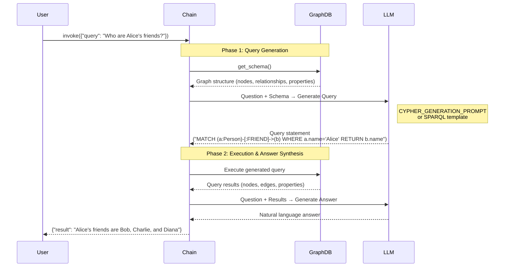

# Graph QA Chains API Reference

## Overview

Graph QA chains enable question-answering over knowledge graph databases by generating and executing graph query languages (Cypher, SPARQL, Gremlin) from natural language questions. These chains implement a two-phase workflow: (1) generate a database query from the user's question and graph schema, then (2) execute the query and synthesize a natural language answer from the results.

**⚠️ DEPRECATION NOTICE**: All Graph QA chain implementations in `langchain_classic.chains.graph_qa` are re-exported from `langchain_community.chains.graph_qa` via dynamic import mechanism. These re-exports will be removed in LangChain version 1.0. **Import directly from `langchain_community.chains.graph_qa` for latest implementations and ongoing support.**

**Source:** `libs/langchain/langchain_classic/chains/graph_qa/cypher.py:1-40`, `libs/langchain/langchain_classic/chains/graph_qa/sparql.py:1-24`

## Available Chain Types

### Property Graph Chains (Cypher)

#### GraphCypherQAChain

The primary chain for question-answering over property graph databases using Cypher query language.

```python
from langchain_community.chains.graph_qa.cypher import GraphCypherQAChain
```

**Supported Databases:**
- Neo4j (primary target)
- FalkorDB
- HugeGraph
- KuzuDB
- NebulaGraph

**Source:** `libs/langchain/langchain_classic/chains/graph_qa/cypher.py:6-9`

#### Database-Specific Variants

These variants provide specialized schema handling and query optimization for specific graph databases:

| Chain Class | Target Database | Import Path | Special Features |
|-------------|----------------|-------------|------------------|
| `ArangoDBQAChain` | ArangoDB | `langchain_community.chains.graph_qa.arangodb` | Multi-model support (graph, document, key-value) |
| `FalkorDBQAChain` | FalkorDB | `langchain_community.chains.graph_qa.falkordb` | Redis-compatible graph database support |
| `HugeGraphQAChain` | HugeGraph | `langchain_community.chains.graph_qa.hugegraph` | Apache HugeGraph optimizations |
| `KuzuQAChain` | KuzuDB | `langchain_community.chains.graph_qa.kuzu` | Embedded graph database patterns |
| `NebulaGraphQAChain` | NebulaGraph | `langchain_community.chains.graph_qa.nebulagraph` | Distributed graph database support |
| `NeptuneOpenCypherQAChain` | AWS Neptune | `langchain_community.chains.graph_qa.neptune_cypher` | Neptune's OpenCypher dialect |

**Source:** `libs/langchain/langchain_classic/chains/graph_qa/` (various implementation files)

### RDF Triple Store Chains (SPARQL)

#### GraphSparqlQAChain

Chain for question-answering over RDF triple stores using SPARQL query language.

```python
from langchain_community.chains.graph_qa.sparql import GraphSparqlQAChain
```

**Supported Triple Stores:**
- Any SPARQL 1.1 compliant endpoint
- Apache Jena Fuseki
- Blazegraph
- GraphDB
- Stardog
- Virtuoso

**Source:** `libs/langchain/langchain_classic/chains/graph_qa/sparql.py:6`

#### RDF-Specific Variants

| Chain Class | Target Database | Import Path | Special Features |
|-------------|----------------|-------------|------------------|
| `NeptuneRdfGraphQAChain` | AWS Neptune RDF | `langchain_community.chains.graph_qa.neptune_sparql` | Neptune RDF optimizations |
| `OntoTextGraphDBQAChain` | Ontotext GraphDB | `langchain_community.chains.graph_qa.ontotext_graphdb` | GraphDB-specific SPARQL features |

### Base Class

#### GraphQAChain

Abstract base class providing common functionality for all graph QA chain implementations.

```python
from langchain_community.chains.graph_qa.base import GraphQAChain
```

**Source:** `libs/langchain/langchain_classic/chains/graph_qa/base.py:6`

## Two-Phase Execution Workflow

All Graph QA chains follow a standardized two-phase execution pattern:



### Phase 1: Query Generation

**Input Type Flow:**
```
Dict[str, str] with {"query": <user_question>}
  → graph.get_schema() retrieves graph structure
  → Dict with graph_schema + user_question
  → LLM with CYPHER_GENERATION_PROMPT / SPARQL template
  → str (query language statement)
```

**Query Language Examples:**

**Cypher (Property Graphs):**
```cypher
MATCH (n:Person)-[:WORKS_AT]->(c:Company)
WHERE c.name = 'Acme Corp'
RETURN n.name, n.role
```

**SPARQL (RDF Triple Stores):**
```sparql
SELECT ?person ?role
WHERE {
  ?person rdf:type :Person .
  ?person :worksAt :AcmeCorp .
  ?person :hasRole ?role .
}
```

**Gremlin (Other Graph Databases):**
```gremlin
g.V().hasLabel('Person').has('company', 'Acme Corp').values('name', 'role')
```

**Source:** `libs/langchain/langchain_classic/chains/graph_qa/prompts.py:10-11` (CYPHER_GENERATION_PROMPT, CYPHER_GENERATION_TEMPLATE)

### Phase 2: Answer Synthesis

**Input Type Flow:**
```
str (generated query)
  → graph.execute(query)
  → List[Dict] (query results)
  → Dict with query_results + original_question
  → LLM with QA_PROMPT
  → str (natural language answer)
```

**Output Schema:**
```python
{
    "result": str,  # Natural language answer
    "intermediate_steps": Optional[List[Dict]]  # If return_intermediate_steps=True
}
```

The `intermediate_steps` key (when enabled) contains:
- `{"query": <generated_query_string>}`
- `{"context": <raw_query_results>}`

**Source:** `libs/langchain/langchain_classic/chains/graph_qa/cypher.py:8` (INTERMEDIATE_STEPS_KEY constant)

## API Reference

### GraphCypherQAChain

#### Constructor Parameters

```python
GraphCypherQAChain(
    llm: BaseLanguageModel,
    graph: Graph,
    cypher_generation_prompt: BasePromptTemplate = CYPHER_GENERATION_PROMPT,
    qa_prompt: BasePromptTemplate = CYPHER_QA_PROMPT,
    return_intermediate_steps: bool = False,
    return_direct: bool = False,
    verbose: bool = False,
    **kwargs
)
```

**Args:**

- **llm** (`BaseLanguageModel`): Language model for both query generation and answer synthesis. Recommended: GPT-4, Claude 2+, or other models with strong code generation capabilities.

- **graph** (`Graph`): Graph database wrapper instance. Must provide:
  - `get_schema()` method returning graph structure description
  - `execute(query: str)` method executing Cypher queries
  - Examples: `Neo4jGraph`, `FalkorDBGraph`, `KuzuGraph`

- **cypher_generation_prompt** (`BasePromptTemplate`, optional): Custom prompt template for Cypher query generation. Defaults to `CYPHER_GENERATION_PROMPT` which includes instructions for generating valid Cypher syntax. Template variables must include:
  - `{schema}`: Graph schema description
  - `{question}`: User's natural language question

- **qa_prompt** (`BasePromptTemplate`, optional): Custom prompt template for answer synthesis. Defaults to `CYPHER_QA_PROMPT`. Template variables must include:
  - `{question}`: Original user question
  - `{context}`: Query execution results

- **return_intermediate_steps** (`bool`, default `False`): If `True`, includes generated query and raw results in output under `intermediate_steps` key. Useful for debugging and transparency.

- **return_direct** (`bool`, default `False`): If `True`, returns raw query results directly without LLM answer synthesis. Bypasses Phase 2.

- **verbose** (`bool`, default `False`): If `True`, prints intermediate steps to console including generated queries and execution results.

- **kwargs**: Additional keyword arguments passed to parent `Chain` class (memory, callbacks, tags, metadata).

**Returns:**

`GraphCypherQAChain` instance ready for invocation.

**Raises:**

- `ValueError`: If `llm` is not a valid `BaseLanguageModel` instance
- `ValueError`: If `graph` does not implement required `get_schema()` and `execute()` methods
- `ImportError`: If `langchain_community` is not installed (triggers deprecation warning with migration instructions)

**Example:**

```python
from langchain_community.chains.graph_qa.cypher import GraphCypherQAChain
from langchain_community.graphs import Neo4jGraph
from langchain_openai import ChatOpenAI

# Initialize graph database connection
graph = Neo4jGraph(
    url="bolt://localhost:7687",
    username="neo4j",
    password="your_password"
)

# Initialize LLM
llm = ChatOpenAI(model="gpt-4", temperature=0)

# Create chain
chain = GraphCypherQAChain.from_llm(
    llm=llm,
    graph=graph,
    return_intermediate_steps=True,  # Include query in output
    verbose=True  # Print intermediate steps
)

# Execute query
result = chain.invoke({"query": "Who are the founders of companies in San Francisco?"})

print(result["result"])
# Output: "The founders of companies in San Francisco include Alice (FounderCo), 
#          Bob (StartupXYZ), and Charlie (TechCorp)."

print(result["intermediate_steps"])
# Output: [
#     {"query": "MATCH (p:Person)-[:FOUNDED]->(c:Company) WHERE c.city = 'San Francisco' RETURN p.name, c.name"},
#     {"context": [{"p.name": "Alice", "c.name": "FounderCo"}, ...]}
# ]
```

**Source:** `libs/langchain/langchain_classic/chains/graph_qa/cypher.py:9` (GraphCypherQAChain re-export)

#### Methods

##### from_llm (Class Method)

```python
@classmethod
def from_llm(
    cls,
    llm: BaseLanguageModel,
    graph: Graph,
    **kwargs
) -> GraphCypherQAChain
```

Factory method for creating chain instances with default prompts.

**Args:**
- **llm** (`BaseLanguageModel`): Language model instance
- **graph** (`Graph`): Graph database wrapper
- **kwargs**: Additional constructor parameters

**Returns:**
- `GraphCypherQAChain` instance with default `CYPHER_GENERATION_PROMPT` and `CYPHER_QA_PROMPT`

**Example:**

```python
chain = GraphCypherQAChain.from_llm(
    llm=ChatOpenAI(model="gpt-4"),
    graph=Neo4jGraph(url="bolt://localhost:7687"),
    return_intermediate_steps=True
)
```

##### invoke

```python
def invoke(
    self,
    input: Dict[str, Any],
    config: Optional[RunnableConfig] = None
) -> Dict[str, Any]
```

Execute the graph QA chain synchronously.

**Args:**
- **input** (`Dict[str, Any]`): Must contain `"query"` key with natural language question string
- **config** (`Optional[RunnableConfig]`): Runtime configuration for callbacks, tags, metadata

**Returns:**
- `Dict[str, Any]` with keys:
  - `"result"`: Natural language answer (str)
  - `"intermediate_steps"`: Query and results (List[Dict]) if `return_intermediate_steps=True`

**Raises:**
- `KeyError`: If input dict does not contain `"query"` key
- `GraphDatabaseError`: If query execution fails (invalid Cypher syntax, connection issues)
- `ValueError`: If LLM generates malformed query that cannot be parsed

##### ainvoke

```python
async def ainvoke(
    self,
    input: Dict[str, Any],
    config: Optional[RunnableConfig] = None
) -> Dict[str, Any]
```

Execute the graph QA chain asynchronously. Same parameters and return value as `invoke()`.

**Note:** Requires async-compatible LLM and graph database implementations.

### GraphSparqlQAChain

SPARQL-based chain for RDF triple stores. API similar to `GraphCypherQAChain` with SPARQL-specific differences:

```python
GraphSparqlQAChain(
    llm: BaseLanguageModel,
    graph: RdfGraph,  # RDF-specific graph wrapper
    sparql_generation_prompt: BasePromptTemplate = SPARQL_GENERATION_SELECT_TEMPLATE,
    qa_prompt: BasePromptTemplate = SPARQL_QA_TEMPLATE,
    return_intermediate_steps: bool = False,
    verbose: bool = False,
    **kwargs
)
```

**Key Differences from GraphCypherQAChain:**

- **graph** parameter expects `RdfGraph` wrapper (implements SPARQL endpoint interface)
- **sparql_generation_prompt** defaults to `SPARQL_GENERATION_SELECT_TEMPLATE` for SELECT queries
- Generated queries use SPARQL syntax instead of Cypher
- Supports both SELECT queries (read-only) and UPDATE queries (with `SPARQL_GENERATION_UPDATE_TEMPLATE`)

**Example:**

```python
from langchain_community.chains.graph_qa.sparql import GraphSparqlQAChain
from langchain_community.graphs import RdfGraph
from langchain_openai import ChatOpenAI

# Connect to SPARQL endpoint
graph = RdfGraph(
    endpoint="http://localhost:3030/dataset/sparql",
    update_endpoint="http://localhost:3030/dataset/update"
)

llm = ChatOpenAI(model="gpt-4", temperature=0)

chain = GraphSparqlQAChain.from_llm(
    llm=llm,
    graph=graph,
    return_intermediate_steps=True
)

result = chain.invoke({"query": "What are all the subjects with rdf:type Person?"})
# Generated SPARQL: "SELECT ?s WHERE { ?s rdf:type :Person }"
```

**Source:** `libs/langchain/langchain_classic/chains/graph_qa/sparql.py:6` (GraphSparqlQAChain re-export)

## Utility Functions

### construct_schema

```python
def construct_schema(
    structured_schema: Dict[str, Any]
) -> str
```

Formats a structured graph schema dictionary into a human-readable string for LLM consumption.

**Args:**
- **structured_schema** (`Dict[str, Any]`): Graph schema dictionary typically returned by `graph.get_structured_schema()`. Expected keys:
  - `"node_props"`: Dict mapping node labels to property lists
  - `"rel_props"`: Dict mapping relationship types to property lists
  - `"relationships"`: List of relationship triples `(start_node, rel_type, end_node)`

**Returns:**
- `str`: Formatted schema description suitable for inclusion in prompts. Example format:
  ```
  Node properties:
  Person {name: STRING, age: INTEGER}
  Company {name: STRING, founded: DATE}
  
  Relationships:
  (Person)-[:WORKS_AT]->(Company)
  (Person)-[:FRIEND]->(Person)
  ```

**Example:**

```python
from langchain_community.chains.graph_qa.cypher import construct_schema

structured_schema = {
    "node_props": {
        "Person": [{"property": "name", "type": "STRING"}, {"property": "age", "type": "INTEGER"}],
        "Company": [{"property": "name", "type": "STRING"}]
    },
    "rel_props": {},
    "relationships": [
        ("Person", "WORKS_AT", "Company"),
        ("Person", "FRIEND", "Person")
    ]
}

schema_str = construct_schema(structured_schema)
# Use in custom prompt template
```

**Source:** `libs/langchain/langchain_classic/chains/graph_qa/cypher.py:10` (construct_schema re-export)

### extract_cypher

```python
def extract_cypher(
    text: str
) -> str
```

Extracts Cypher query from LLM response text, removing markdown code block formatting and explanatory text.

**Args:**
- **text** (`str`): Raw LLM output potentially containing Cypher query wrapped in markdown code blocks (` ```cypher ... ``` `) or with explanatory text

**Returns:**
- `str`: Cleaned Cypher query ready for execution

**Raises:**
- `ValueError`: If no valid Cypher query can be extracted from text

**Example:**

```python
from langchain_community.chains.graph_qa.cypher import extract_cypher

llm_output = """
Here's the Cypher query to find Alice's friends:

```cypher
MATCH (a:Person {name: 'Alice'})-[:FRIEND]->(friend)
RETURN friend.name
```

This query finds all Person nodes connected to Alice via FRIEND relationships.
"""

query = extract_cypher(llm_output)
# Returns: "MATCH (a:Person {name: 'Alice'})-[:FRIEND]->(friend)\nRETURN friend.name"
```

**Source:** `libs/langchain/langchain_classic/chains/graph_qa/cypher.py:11` (extract_cypher re-export)

## Prompt Templates

The `graph_qa.prompts` module provides pre-built prompt templates for various query languages and databases:

### Cypher Templates

| Constant | Purpose | Template Variables |
|----------|---------|-------------------|
| `CYPHER_GENERATION_TEMPLATE` | Basic Cypher query generation | `{schema}`, `{question}` |
| `CYPHER_GENERATION_PROMPT` | Full prompt with instructions | `{schema}`, `{question}` |
| `CYPHER_QA_TEMPLATE` | Answer synthesis from results | `{question}`, `{context}` |
| `CYPHER_QA_PROMPT` | Full QA prompt | `{question}`, `{context}` |

### SPARQL Templates

| Constant | Purpose | Template Variables |
|----------|---------|-------------------|
| `SPARQL_GENERATION_SELECT_TEMPLATE` | SELECT query generation | `{schema}`, `{question}` |
| `SPARQL_GENERATION_UPDATE_TEMPLATE` | UPDATE query generation | `{schema}`, `{question}` |
| `SPARQL_INTENT_TEMPLATE` | Classify intent (SELECT vs UPDATE) | `{question}` |
| `SPARQL_QA_TEMPLATE` | Answer synthesis | `{question}`, `{context}` |

### Database-Specific Templates

| Constant | Target Database | Purpose |
|----------|----------------|---------|
| `AQL_GENERATION_TEMPLATE` | ArangoDB | AQL query generation |
| `AQL_FIX_TEMPLATE` | ArangoDB | Query syntax error correction |
| `GREMLIN_GENERATION_TEMPLATE` | Gremlin-compatible | Gremlin query generation |
| `KUZU_GENERATION_TEMPLATE` | KuzuDB | Cypher with Kuzu-specific features |
| `KUZU_EXTRA_INSTRUCTIONS` | KuzuDB | Additional instructions for Kuzu |
| `NGQL_GENERATION_TEMPLATE` | NebulaGraph | nGQL query generation |
| `NEBULAGRAPH_EXTRA_INSTRUCTIONS` | NebulaGraph | NebulaGraph-specific instructions |
| `NEPTUNE_OPENCYPHER_GENERATION_TEMPLATE` | AWS Neptune | OpenCypher for Neptune |
| `NEPTUNE_OPENCYPHER_GENERATION_SIMPLE_TEMPLATE` | AWS Neptune | Simplified Neptune queries |
| `NEPTUNE_OPENCYPHER_EXTRA_INSTRUCTIONS` | AWS Neptune | Neptune OpenCypher guidelines |
| `GRAPHDB_SPARQL_GENERATION_TEMPLATE` | Ontotext GraphDB | GraphDB SPARQL generation |
| `GRAPHDB_SPARQL_FIX_TEMPLATE` | Ontotext GraphDB | SPARQL syntax error correction |
| `GRAPHDB_QA_TEMPLATE` | Ontotext GraphDB | Answer synthesis |

**Source:** `libs/langchain/langchain_classic/chains/graph_qa/prompts.py:6-29` (all template imports)

### Custom Prompt Example

```python
from langchain_core.prompts import PromptTemplate
from langchain_community.chains.graph_qa.cypher import GraphCypherQAChain

# Create custom Cypher generation prompt with domain-specific instructions
custom_cypher_prompt = PromptTemplate(
    input_variables=["schema", "question"],
    template="""
You are a Neo4j Cypher expert for a social network database.

Database Schema:
{schema}

Rules:
- Always use case-insensitive matching with toLower()
- Limit results to 10 unless otherwise specified
- Return full node properties, not just names

Question: {question}

Cypher Query:"""
)

chain = GraphCypherQAChain.from_llm(
    llm=llm,
    graph=graph,
    cypher_generation_prompt=custom_cypher_prompt
)
```

## Security Considerations

### Query Injection Risks

Generated queries can access all data in the graph database, similar to SQL injection vulnerabilities:

**Risk:** User input like `"Show me all users"` could generate:
```cypher
MATCH (u:User) RETURN u.password, u.email, u.credit_card
```

**Mitigations:**

1. **Read-Only Permissions**: Configure graph database user with read-only access:
```python
# Neo4j example: create read-only user
# CREATE USER readonly SET PASSWORD 'password';
# GRANT READ ON GRAPH * TO readonly;

graph = Neo4jGraph(
    url="bolt://localhost:7687",
    username="readonly",  # Use read-only user
    password="password"
)
```

2. **Input Validation**: Sanitize user questions before processing:
```python
def sanitize_question(question: str) -> str:
    """Remove potentially dangerous keywords from questions."""
    dangerous_keywords = ["DELETE", "DROP", "DETACH", "REMOVE", "SET", "CREATE"]
    question_upper = question.upper()
    
    if any(keyword in question_upper for keyword in dangerous_keywords):
        raise ValueError(f"Question contains disallowed keyword: {question}")
    
    return question

# Use in chain invocation
safe_question = sanitize_question(user_input)
result = chain.invoke({"query": safe_question})
```

3. **Query Review**: Enable `return_intermediate_steps=True` and log generated queries:
```python
chain = GraphCypherQAChain.from_llm(
    llm=llm,
    graph=graph,
    return_intermediate_steps=True
)

result = chain.invoke({"query": user_question})

# Log generated query for security audit
generated_query = result["intermediate_steps"][0]["query"]
logger.info(f"Generated query: {generated_query}")

# Optionally implement query approval workflow before execution
```

4. **Rate Limiting**: Implement rate limits to prevent abuse:
```python
from langchain_core.rate_limiters import InMemoryRateLimiter

rate_limiter = InMemoryRateLimiter(
    requests_per_second=0.1,  # Max 1 query per 10 seconds per user
    check_every_n_seconds=1
)

# Apply to chain invocations
chain.invoke(
    {"query": user_question},
    config={"rate_limiter": rate_limiter}
)
```

### Data Exposure

**Risk:** LLM answer synthesis may reveal sensitive information even if not explicitly requested.

**Mitigation:** Implement post-processing filter to redact sensitive fields:
```python
def filter_sensitive_data(result: Dict[str, Any]) -> Dict[str, Any]:
    """Remove sensitive information from chain results."""
    sensitive_patterns = [
        r"\b\d{3}-\d{2}-\d{4}\b",  # SSN
        r"\b\d{16}\b",  # Credit card
        r"\b[A-Za-z0-9._%+-]+@[A-Za-z0-9.-]+\.[A-Z|a-z]{2,}\b"  # Email
    ]
    
    # Redact sensitive patterns from answer
    answer = result["result"]
    for pattern in sensitive_patterns:
        answer = re.sub(pattern, "[REDACTED]", answer)
    
    result["result"] = answer
    return result

result = chain.invoke({"query": user_question})
safe_result = filter_sensitive_data(result)
```

## Troubleshooting

### Common Issues

#### 1. Generated Query Syntax Errors

**Symptom:** `GraphDatabaseError: Invalid Cypher syntax`

**Causes:**
- LLM generates invalid query language syntax
- Schema description is ambiguous or incomplete
- Model not trained on Cypher/SPARQL syntax

**Solutions:**

**A. Use models with strong code generation capabilities:**
```python
# Recommended models for Cypher generation
llm = ChatOpenAI(model="gpt-4-turbo", temperature=0)  # Best accuracy
# OR
llm = ChatAnthropic(model="claude-3-opus-20240229", temperature=0)
```

**B. Improve schema descriptions:**
```python
# Provide detailed schema with examples
enhanced_prompt = PromptTemplate(
    input_variables=["schema", "question"],
    template="""
Generate valid Neo4j Cypher query.

Schema:
{schema}

Example valid queries:
MATCH (p:Person)-[:FRIEND]->(f:Person) RETURN p.name, f.name
MATCH (p:Person) WHERE p.age > 25 RETURN p

Question: {question}

Cypher Query (return ONLY the query, no explanation):"""
)
```

**C. Implement query validation and retry:**
```python
from neo4j.exceptions import CypherSyntaxError

def validate_and_retry_chain(chain, question: str, max_retries: int = 3):
    """Retry chain invocation if query syntax is invalid."""
    for attempt in range(max_retries):
        try:
            result = chain.invoke({"query": question})
            return result
        except CypherSyntaxError as e:
            if attempt < max_retries - 1:
                # Add error feedback to next attempt
                question = f"{question}\n\nPrevious attempt generated invalid syntax: {str(e)}"
                continue
            else:
                raise ValueError(f"Failed to generate valid query after {max_retries} attempts")
```

#### 2. Schema Retrieval Performance Issues

**Symptom:** `graph.get_schema()` takes >30 seconds on large graphs

**Causes:**
- Graph contains millions of nodes/relationships
- Schema introspection queries are not optimized
- Full property sampling is too expensive

**Solutions:**

**A. Cache schema between invocations:**
```python
from functools import lru_cache

@lru_cache(maxsize=1)
def get_cached_schema(graph_url: str) -> str:
    """Cache schema for reuse across chain invocations."""
    graph = Neo4jGraph(url=graph_url)
    return graph.get_schema()

# Use cached schema
schema = get_cached_schema("bolt://localhost:7687")

chain = GraphCypherQAChain.from_llm(
    llm=llm,
    graph=graph,
    # Schema will be retrieved once and reused
)
```

**B. Provide pre-computed schema:**
```python
# Manually define schema instead of auto-introspection
manual_schema = """
Node properties:
- Person: name (STRING), age (INTEGER), email (STRING)
- Company: name (STRING), industry (STRING)

Relationships:
- (Person)-[:WORKS_AT]->(Company)
- (Person)-[:FRIEND]->(Person)
"""

# Override graph's get_schema method
class CachedSchemaGraph(Neo4jGraph):
    def get_schema(self) -> str:
        return manual_schema

graph = CachedSchemaGraph(url="bolt://localhost:7687")
```

#### 3. LLM Context Window Exceeded

**Symptom:** `InvalidRequestError: maximum context length exceeded`

**Causes:**
- Graph schema too large (>100k tokens)
- Query results contain too many rows (>10k results)

**Solutions:**

**A. Simplify schema representation:**
```python
def truncate_schema(full_schema: str, max_chars: int = 10000) -> str:
    """Truncate schema to fit within context limits."""
    if len(full_schema) <= max_chars:
        return full_schema
    
    # Keep node types and relationships, drop detailed properties
    lines = full_schema.split("\n")
    essential_lines = [line for line in lines if ":" in line or "-[" in line]
    return "\n".join(essential_lines[:50])  # Limit to 50 most important lines

truncated_schema = truncate_schema(graph.get_schema())
```

**B. Limit query results:**
```python
# Modify generation prompt to always include LIMIT
limited_prompt = PromptTemplate(
    input_variables=["schema", "question"],
    template="""
Generate Cypher query for:
{question}

Schema: {schema}

IMPORTANT: Always include "LIMIT 100" to prevent large result sets.

Cypher Query:"""
)
```

**C. Use streaming for long outputs:**
```python
# For chains that support streaming
for chunk in chain.stream({"query": user_question}):
    print(chunk, end="", flush=True)
```

#### 4. Empty or Irrelevant Results

**Symptom:** Chain returns "I don't have information about that" despite relevant data existing

**Causes:**
- Generated query filters too aggressively
- Property names or node labels don't match exactly
- LLM misunderstands graph structure

**Solutions:**

**A. Add fuzzy matching to prompts:**
```python
fuzzy_prompt = PromptTemplate(
    input_variables=["schema", "question"],
    template="""
Generate Cypher using case-insensitive matching and partial string matching.

Examples:
- Use toLower() for case-insensitive: WHERE toLower(p.name) CONTAINS toLower('alice')
- Use CONTAINS for partial matching: WHERE p.name CONTAINS 'alice'

Schema: {schema}
Question: {question}

Cypher Query:"""
)
```

**B. Enable verbose mode to debug:**
```python
chain = GraphCypherQAChain.from_llm(
    llm=llm,
    graph=graph,
    verbose=True,  # Prints generated query and results
    return_intermediate_steps=True
)

result = chain.invoke({"query": "Find Alice"})

# Inspect what query was generated
print(result["intermediate_steps"][0]["query"])
# Check what results were returned
print(result["intermediate_steps"][1]["context"])
```

#### 5. Authentication and Connection Failures

**Symptom:** `ServiceUnavailable: Unable to connect to bolt://localhost:7687`

**Causes:**
- Graph database not running
- Incorrect credentials
- Network/firewall issues

**Solutions:**

```python
from neo4j.exceptions import ServiceUnavailable, AuthError

def create_robust_graph_connection(url: str, username: str, password: str, max_retries: int = 3):
    """Create graph connection with retry logic."""
    for attempt in range(max_retries):
        try:
            graph = Neo4jGraph(
                url=url,
                username=username,
                password=password,
                timeout=10  # 10 second timeout
            )
            # Test connection
            graph.query("RETURN 1")
            return graph
        except ServiceUnavailable:
            if attempt < max_retries - 1:
                time.sleep(2 ** attempt)  # Exponential backoff
                continue
            else:
                raise ConnectionError(f"Cannot connect to graph database at {url}")
        except AuthError:
            raise ValueError(f"Authentication failed for user {username}")
```

## Migration Guidance

### Importing from langchain_community

**Old Pattern (Deprecated):**
```python
# Will trigger deprecation warning
from langchain.chains.graph_qa.cypher import GraphCypherQAChain
from langchain.chains.graph_qa.sparql import GraphSparqlQAChain
```

**New Pattern (Recommended):**
```python
# Import directly from langchain_community
from langchain_community.chains.graph_qa.cypher import GraphCypherQAChain
from langchain_community.chains.graph_qa.sparql import GraphSparqlQAChain
from langchain_community.graphs import Neo4jGraph, RdfGraph
```

### Installation

Ensure `langchain-community` is installed:

```bash
# Using pip
pip install langchain-community

# Using uv
uv pip install langchain-community

# With graph database drivers
pip install langchain-community neo4j  # For Neo4j
pip install langchain-community rdflib  # For SPARQL/RDF
```

### Timeline

- **Current (v0.x)**: `langchain_classic.chains.graph_qa` re-exports work with deprecation warnings
- **Version 1.0**: Re-exports will be removed; imports must use `langchain_community` directly

### API Compatibility

The API in `langchain_community.chains.graph_qa` is **identical** to the re-exported APIs. Migration only requires changing import statements—no code changes to chain usage.

## Complete Working Example

```python
"""
Complete example: Question-answering over a company knowledge graph using Neo4j.
"""

from langchain_community.chains.graph_qa.cypher import GraphCypherQAChain
from langchain_community.graphs import Neo4jGraph
from langchain_openai import ChatOpenAI
import os

# Step 1: Set up Neo4j connection
graph = Neo4jGraph(
    url=os.environ.get("NEO4J_URL", "bolt://localhost:7687"),
    username=os.environ.get("NEO4J_USERNAME", "neo4j"),
    password=os.environ["NEO4J_PASSWORD"]  # Required
)

# Step 2: Populate sample data (one-time setup)
graph.query("""
    // Create people
    CREATE (alice:Person {name: 'Alice', age: 30, role: 'Engineer'})
    CREATE (bob:Person {name: 'Bob', age: 35, role: 'Manager'})
    CREATE (charlie:Person {name: 'Charlie', age: 28, role: 'Designer'})
    
    // Create companies
    CREATE (acme:Company {name: 'Acme Corp', industry: 'Technology'})
    CREATE (widgets:Company {name: 'Widgets Inc', industry: 'Manufacturing'})
    
    // Create relationships
    CREATE (alice)-[:WORKS_AT]->(acme)
    CREATE (bob)-[:WORKS_AT]->(acme)
    CREATE (charlie)-[:WORKS_AT]->(widgets)
    CREATE (alice)-[:FRIEND]->(bob)
    CREATE (bob)-[:FRIEND]->(charlie)
""")

# Step 3: Initialize LLM
llm = ChatOpenAI(
    model="gpt-4",
    temperature=0,  # Deterministic for query generation
    api_key=os.environ["OPENAI_API_KEY"]
)

# Step 4: Create Graph QA Chain
chain = GraphCypherQAChain.from_llm(
    llm=llm,
    graph=graph,
    return_intermediate_steps=True,  # Show generated queries
    verbose=True  # Print progress
)

# Step 5: Ask questions
questions = [
    "Who works at Acme Corp?",
    "How old are the engineers?",
    "Who are Bob's friends?",
    "Which companies are in the technology industry?"
]

for question in questions:
    print(f"\n{'='*60}")
    print(f"Question: {question}")
    print(f"{'='*60}")
    
    result = chain.invoke({"query": question})
    
    # Show generated Cypher query
    generated_query = result["intermediate_steps"][0]["query"]
    print(f"\nGenerated Cypher:\n{generated_query}")
    
    # Show raw results
    raw_results = result["intermediate_steps"][1]["context"]
    print(f"\nRaw Results:\n{raw_results}")
    
    # Show final answer
    print(f"\nAnswer:\n{result['result']}")

# Expected Output:
# Question: Who works at Acme Corp?
# Generated Cypher: MATCH (p:Person)-[:WORKS_AT]->(c:Company {name: 'Acme Corp'}) RETURN p.name
# Raw Results: [{'p.name': 'Alice'}, {'p.name': 'Bob'}]
# Answer: Alice and Bob work at Acme Corp.
```

## See Also

- [Chain Base Class API Reference](../base.md) - Base `Chain` class documentation with lifecycle methods
- [LangChain Graph Integrations](https://python.langchain.com/docs/integrations/graphs/) - Supported graph databases and setup guides
- [LCEL Composition Guide](../../guides/lcel-composition.md) - Composing graph QA chains with other runnables
- [Prompt Engineering for Graphs](https://neo4j.com/developer/llm-graph-rag/) - Best practices for graph query generation
- [Cypher Query Language Reference](https://neo4j.com/docs/cypher-manual/current/) - Neo4j Cypher syntax documentation
- [SPARQL 1.1 Specification](https://www.w3.org/TR/sparql11-query/) - W3C SPARQL query language specification

---

**Document Version:** 1.0  
**Last Updated:** 2024  
**Maintained By:** LangChain Documentation Team  
**LangChain Version Compatibility:** 0.1.0+  
**Deprecation Status:** Re-exports deprecated; migrate to `langchain_community.chains.graph_qa`
