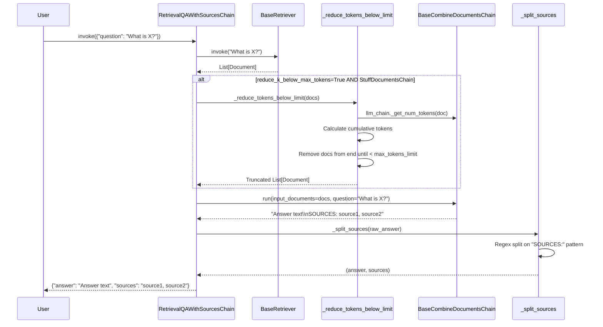

# Question Answering with Sources Chain API Reference

## ⚠️ Deprecation Notice

**All classes in this module are deprecated since version 0.2.13 and will be removed in version 1.0.**

**Migration Guide:** Refer to the modern retrieval and question answering with sources pattern at:
- [How to do QA with Sources](https://python.langchain.com/docs/how_to/qa_sources/)
- [Stuff Documents Chain Migration](https://python.langchain.com/docs/versions/migrating_chains/stuff_docs_chain)
- [Map Reduce Chain Migration](https://python.langchain.com/docs/versions/migrating_chains/map_reduce_chain)
- [Refine Chain Migration](https://python.langchain.com/docs/versions/migrating_chains/refine_chain)
- [Map Rerank Chain Migration](https://python.langchain.com/docs/versions/migrating_chains/map_rerank_docs_chain)

## Overview

The QA with Sources chain family enables question answering over documents while returning cited sources for the generated answers. These chains automatically extract source references from the LLM output and structure them in a standardized format.

**Key Distinction from Standard QA Chains:** These chains not only generate answers but also track and return the specific documents or source identifiers that support each answer, enabling verification and citation workflows.

---

## BaseQAWithSourcesChain

Abstract base class for question answering chains that return cited sources alongside answers.

**Source:** `libs/langchain/langchain_classic/chains/qa_with_sources/base.py:46`

### Class Definition

```python
class BaseQAWithSourcesChain(Chain, ABC):
    """Question answering chain with sources over documents."""
```

### Parameters

#### combine_documents_chain

```python
combine_documents_chain: BaseCombineDocumentsChain
```

**Type:** `BaseCombineDocumentsChain`

The chain used to combine and process retrieved documents to generate the final answer. This can be any combine documents chain type:
- `StuffDocumentsChain`: Concatenates all documents into a single prompt
- `MapReduceDocumentsChain`: Processes documents in parallel then combines results
- `RefineDocumentsChain`: Iteratively refines answer across documents
- `MapRerankDocumentsChain`: Scores each document and uses the highest-ranked

**Source:** `libs/langchain/langchain_classic/chains/qa_with_sources/base.py:49`

#### question_key

```python
question_key: str = "question"
```

**Type:** `str`  
**Default:** `"question"`

The dictionary key for the question string in the input dict.

**Source:** `libs/langchain/langchain_classic/chains/qa_with_sources/base.py:51`

#### input_docs_key

```python
input_docs_key: str = "docs"
```

**Type:** `str`  
**Default:** `"docs"`

The dictionary key for the input documents list (used by `QAWithSourcesChain` subclass).

**Source:** `libs/langchain/langchain_classic/chains/qa_with_sources/base.py:52`

#### answer_key

```python
answer_key: str = "answer"
```

**Type:** `str`  
**Default:** `"answer"`

The dictionary key for the generated answer string in the output dict.

**Source:** `libs/langchain/langchain_classic/chains/qa_with_sources/base.py:53`

#### sources_answer_key

```python
sources_answer_key: str = "sources"
```

**Type:** `str`  
**Default:** `"sources"`

The dictionary key for the extracted sources string in the output dict. Sources are formatted as a comma-separated or pipe-delimited string of source identifiers.

**Source:** `libs/langchain/langchain_classic/chains/qa_with_sources/base.py:54`

#### return_source_documents

```python
return_source_documents: bool = False
```

**Type:** `bool`  
**Default:** `False`

Whether to include the full `Document` objects in the output under the `"source_documents"` key. When `True`, the output dict includes a `"source_documents"` key containing the `List[Document]` used to generate the answer.

**Source:** `libs/langchain/langchain_classic/chains/qa_with_sources/base.py:55`

### Factory Methods

#### from_llm

```python
@classmethod
def from_llm(
    cls,
    llm: BaseLanguageModel,
    document_prompt: BasePromptTemplate = EXAMPLE_PROMPT,
    question_prompt: BasePromptTemplate = QUESTION_PROMPT,
    combine_prompt: BasePromptTemplate = COMBINE_PROMPT,
    **kwargs: Any,
) -> BaseQAWithSourcesChain
```

Constructs the chain from a language model with a default `MapReduceDocumentsChain` configuration.

**Args:**
- `llm` (`BaseLanguageModel`): The language model to use for both map and combine phases
- `document_prompt` (`BasePromptTemplate`, optional): Template for formatting individual documents. Defaults to `EXAMPLE_PROMPT`
- `question_prompt` (`BasePromptTemplate`, optional): Template for the map phase (processing individual documents). Defaults to `QUESTION_PROMPT`
- `combine_prompt` (`BasePromptTemplate`, optional): Template for the combine phase (merging results). Defaults to `COMBINE_PROMPT`
- `**kwargs`: Additional arguments passed to the chain constructor (e.g., `retriever` for `RetrievalQAWithSourcesChain`)

**Returns:**  
`BaseQAWithSourcesChain`: Configured chain instance with MapReduceDocumentsChain

**Implementation Details:**  
Creates a two-tier MapReduceDocumentsChain:
1. **Map Phase**: Each document is processed with `question_prompt` via `llm_question_chain`
2. **Reduce Phase**: Document summaries are combined using `llm_combine_chain` with `combine_prompt`

**Source:** `libs/langchain/langchain_classic/chains/qa_with_sources/base.py:59-86`

**Example:**

```python
from langchain_openai import ChatOpenAI
from langchain_classic.chains.qa_with_sources.retrieval import RetrievalQAWithSourcesChain
from langchain_core.retrievers import BaseRetriever

# Assuming you have a retriever configured
llm = ChatOpenAI(model="gpt-3.5-turbo", temperature=0)
chain = RetrievalQAWithSourcesChain.from_llm(
    llm=llm,
    retriever=your_retriever  # Must be provided for RetrievalQAWithSourcesChain
)

result = chain.invoke({"question": "What is the main topic?"})
print(f"Answer: {result['answer']}")
print(f"Sources: {result['sources']}")
```

#### from_chain_type

```python
@classmethod
def from_chain_type(
    cls,
    llm: BaseLanguageModel,
    chain_type: str = "stuff",
    chain_type_kwargs: dict | None = None,
    **kwargs: Any,
) -> BaseQAWithSourcesChain
```

Loads a pre-configured chain of the specified type using default prompts.

**Args:**
- `llm` (`BaseLanguageModel`): The language model to use in the chain
- `chain_type` (`str`, optional): Type of document combining chain. Must be one of:
  - `"stuff"`: Concatenates all documents into a single prompt (best for small document sets)
  - `"map_reduce"`: Processes documents in parallel then combines (good for large document sets)
  - `"refine"`: Iteratively refines answer document-by-document (good for detailed analysis)
  - `"map_rerank"`: Scores each document and uses highest-ranked (good for finding best single source)
  
  Default: `"stuff"`
- `chain_type_kwargs` (`dict | None`, optional): Additional keyword arguments passed to the chain type loader function
- `**kwargs`: Additional arguments passed to the chain constructor

**Returns:**  
`BaseQAWithSourcesChain`: Configured chain instance with the specified combine documents chain

**Raises:**
- `ValueError`: If `chain_type` is not one of the supported types

**Source:** `libs/langchain/langchain_classic/chains/qa_with_sources/base.py:88-103`

**Example:**

```python
from langchain_openai import ChatOpenAI
from langchain_classic.chains.qa_with_sources.retrieval import RetrievalQAWithSourcesChain

llm = ChatOpenAI(model="gpt-3.5-turbo")

# Create with stuff chain (simple concatenation)
chain = RetrievalQAWithSourcesChain.from_chain_type(
    llm=llm,
    chain_type="stuff",
    retriever=your_retriever
)

# Create with map_reduce for larger document sets
chain = RetrievalQAWithSourcesChain.from_chain_type(
    llm=llm,
    chain_type="map_reduce",
    retriever=your_retriever
)
```

### Core Methods

#### _split_sources

```python
def _split_sources(self, answer: str) -> tuple[str, str]
```

Extracts source citations from the combined answer string using regex pattern matching.

**Args:**
- `answer` (`str`): The raw answer string from the combine documents chain, potentially containing a "SOURCES:" or "SOURCE:" section

**Returns:**  
`tuple[str, str]`: A tuple of `(answer, sources)` where:
- `answer`: The answer text with sources section removed
- `sources`: Extracted source identifiers (pipe-delimited or comma-separated string)

**Implementation Details:**
- Searches for case-insensitive `SOURCES?:` or `QUESTION:` markers using regex
- Splits the answer at the marker and extracts the first line of sources
- Returns empty string for sources if no marker found

**Source:** `libs/langchain/langchain_classic/chains/qa_with_sources/base.py:137-148`

#### _call

```python
def _call(
    self,
    inputs: dict[str, Any],
    run_manager: CallbackManagerForChainRun | None = None,
) -> dict[str, str]
```

Executes the chain synchronously with callback support.

**Args:**
- `inputs` (`dict[str, Any]`): Input dictionary containing at minimum the question key (default `"question"`). Subclass-specific implementations may require additional keys
- `run_manager` (`CallbackManagerForChainRun | None`, optional): Callback manager for handling chain lifecycle events

**Returns:**  
`dict[str, str]`: Output dictionary containing:
- `answer_key` (default `"answer"`): The generated answer string
- `sources_answer_key` (default `"sources"`): Extracted source identifiers
- `"source_documents"` (optional): List of `Document` objects if `return_source_documents=True`

**Execution Flow:**
1. Calls subclass `_get_docs()` to retrieve documents
2. Runs `combine_documents_chain` on retrieved documents with input question
3. Extracts sources using `_split_sources()` regex parsing
4. Constructs output dict with answer and sources

**Source:** `libs/langchain/langchain_classic/chains/qa_with_sources/base.py:159-185`

#### _acall

```python
async def _acall(
    self,
    inputs: dict[str, Any],
    run_manager: AsyncCallbackManagerForChainRun | None = None,
) -> dict[str, Any]
```

Executes the chain asynchronously with callback support.

**Args:**
- `inputs` (`dict[str, Any]`): Input dictionary (same structure as `_call`)
- `run_manager` (`AsyncCallbackManagerForChainRun | None`, optional): Async callback manager for handling chain lifecycle events

**Returns:**  
`dict[str, Any]`: Output dictionary (same structure as `_call`)

**Execution Flow:**  
Identical to `_call` but uses async variants:
1. Calls `_aget_docs()` (async document retrieval)
2. Runs `combine_documents_chain.arun()` (async chain execution)
3. Extracts sources and constructs output

**Source:** `libs/langchain/langchain_classic/chains/qa_with_sources/base.py:196-221`

### Abstract Methods

Subclasses must implement these methods to define document retrieval behavior.

#### _get_docs

```python
@abstractmethod
def _get_docs(
    self,
    inputs: dict[str, Any],
    *,
    run_manager: CallbackManagerForChainRun,
) -> list[Document]
```

Retrieves the documents to be used for question answering (synchronous).

**Args:**
- `inputs` (`dict[str, Any]`): The chain input dictionary
- `run_manager` (`CallbackManagerForChainRun`): Callback manager for propagating callbacks to document retrieval

**Returns:**  
`list[Document]`: List of documents to process for answering the question

**Source:** `libs/langchain/langchain_classic/chains/qa_with_sources/base.py:151-157`

#### _aget_docs

```python
@abstractmethod
async def _aget_docs(
    self,
    inputs: dict[str, Any],
    *,
    run_manager: AsyncCallbackManagerForChainRun,
) -> list[Document]
```

Retrieves the documents to be used for question answering (asynchronous).

**Args:**
- `inputs` (`dict[str, Any]`): The chain input dictionary
- `run_manager` (`AsyncCallbackManagerForChainRun`): Async callback manager for propagating callbacks

**Returns:**  
`list[Document]`: List of documents to process for answering the question

**Source:** `libs/langchain/langchain_classic/chains/qa_with_sources/base.py:188-194`

---

## RetrievalQAWithSourcesChain

Question answering with sources over a retriever-backed index. This is the most commonly used subclass that automatically fetches relevant documents using a retriever.

**Source:** `libs/langchain/langchain_classic/chains/qa_with_sources/retrieval.py:17`

### Class Definition

```python
class RetrievalQAWithSourcesChain(BaseQAWithSourcesChain):
    """Question-answering with sources over an index."""
```

### Parameters

Inherits all parameters from `BaseQAWithSourcesChain`, plus:

#### retriever

```python
retriever: BaseRetriever = Field(exclude=True)
```

**Type:** `BaseRetriever`  
**Required:** Yes

The retriever used to fetch relevant documents based on the question. Can be any retriever implementation (vector store retriever, keyword retriever, ensemble retriever, etc.).

**Note:** Field is excluded from serialization due to `exclude=True`.

**Source:** `libs/langchain/langchain_classic/chains/qa_with_sources/retrieval.py:20`

#### reduce_k_below_max_tokens

```python
reduce_k_below_max_tokens: bool = False
```

**Type:** `bool`  
**Default:** `False`

When `True`, automatically reduces the number of retrieved documents to stay under `max_tokens_limit`. This feature is **only enforced when using `StuffDocumentsChain`** as the combine_documents_chain.

**Use Case:** Prevents token limit errors when retrievers return large document sets.

**Source:** `libs/langchain/langchain_classic/chains/qa_with_sources/retrieval.py:22`

#### max_tokens_limit

```python
max_tokens_limit: int = 3375
```

**Type:** `int`  
**Default:** `3375`

Maximum total token count for all documents combined. When `reduce_k_below_max_tokens=True` and using `StuffDocumentsChain`, documents are progressively removed from the end of the list until total tokens fall below this limit.

**Token Calculation:** Uses `combine_documents_chain.llm_chain._get_num_tokens()` to count tokens per document.

**Source:** `libs/langchain/langchain_classic/chains/qa_with_sources/retrieval.py:24-26`

### Methods

#### _reduce_tokens_below_limit

```python
def _reduce_tokens_below_limit(self, docs: list[Document]) -> list[Document]
```

Reduces document list to stay under the maximum token limit.

**Args:**
- `docs` (`list[Document]`): The full list of retrieved documents

**Returns:**  
`list[Document]`: Truncated list of documents that fit within `max_tokens_limit`

**Algorithm:**
1. Checks if `reduce_k_below_max_tokens=True` and `combine_documents_chain` is `StuffDocumentsChain`
2. Calculates token count for each document using the LLM's tokenizer
3. Sums tokens from start of list, removing documents from end until under limit
4. Returns truncated list (preserves order, removes from end)

**Important:** This method does nothing if:
- `reduce_k_below_max_tokens=False`, OR
- `combine_documents_chain` is not `StuffDocumentsChain`

**Source:** `libs/langchain/langchain_classic/chains/qa_with_sources/retrieval.py:28-44`

#### _get_docs

```python
def _get_docs(
    self,
    inputs: dict[str, Any],
    *,
    run_manager: CallbackManagerForChainRun,
) -> list[Document]
```

Retrieves relevant documents using the retriever (synchronous).

**Args:**
- `inputs` (`dict[str, Any]`): Input dict containing the question at `question_key`
- `run_manager` (`CallbackManagerForChainRun`): Callback manager propagated to retriever

**Returns:**  
`list[Document]`: Retrieved documents, potentially reduced to fit token limit

**Execution Flow:**
1. Extracts question from inputs using `question_key`
2. Invokes `retriever.invoke(question)` with callbacks
3. Applies `_reduce_tokens_below_limit()` if configured
4. Returns final document list

**Source:** `libs/langchain/langchain_classic/chains/qa_with_sources/retrieval.py:46-57`

#### _aget_docs

```python
async def _aget_docs(
    self,
    inputs: dict[str, Any],
    *,
    run_manager: AsyncCallbackManagerForChainRun,
) -> list[Document]
```

Retrieves relevant documents using the retriever (asynchronous).

**Args:**
- `inputs` (`dict[str, Any]`): Input dict containing the question
- `run_manager` (`AsyncCallbackManagerForChainRun`): Async callback manager

**Returns:**  
`list[Document]`: Retrieved documents, potentially reduced to fit token limit

**Execution Flow:**  
Same as `_get_docs` but uses `retriever.ainvoke()` for async execution.

**Source:** `libs/langchain/langchain_classic/chains/qa_with_sources/retrieval.py:59-70`

---

## QAWithSourcesChain

Question answering with sources when documents are provided directly in the input dict (no retrieval).

**Source:** `libs/langchain/langchain_classic/chains/qa_with_sources/base.py:233`

### Class Definition

```python
class QAWithSourcesChain(BaseQAWithSourcesChain):
    """Question answering with sources over documents."""
```

### Key Differences from RetrievalQAWithSourcesChain

- **No Retriever**: Documents must be provided in the input dict
- **Input Structure**: Requires both `question` and `docs` keys in input
- **Use Case**: When documents are already available or pre-filtered by custom logic

### Input/Output Specification

#### Input Schema

```python
{
    "question": str,  # The question to answer
    "docs": list[Document]  # List of documents to search over
}
```

#### Output Schema

```python
{
    "answer": str,  # Generated answer
    "sources": str,  # Extracted source identifiers
    "source_documents": list[Document]  # Optional, if return_source_documents=True
}
```

### Methods

#### _get_docs

```python
def _get_docs(
    self,
    inputs: dict[str, Any],
    *,
    run_manager: CallbackManagerForChainRun,
) -> list[Document]
```

Extracts documents from the input dict.

**Args:**
- `inputs` (`dict[str, Any]`): Input dict with `docs` key
- `run_manager` (`CallbackManagerForChainRun`): Callback manager (unused for this implementation)

**Returns:**  
`list[Document]`: The documents from `inputs[input_docs_key]` (default `"docs"`)

**Source:** `libs/langchain/langchain_classic/chains/qa_with_sources/base.py:247-254`

#### _aget_docs

```python
async def _aget_docs(
    self,
    inputs: dict[str, Any],
    *,
    run_manager: AsyncCallbackManagerForChainRun,
) -> list[Document]
```

Extracts documents from the input dict (async variant, same behavior as sync).

**Source:** `libs/langchain/langchain_classic/chains/qa_with_sources/base.py:257-264`

---

## Type Flow Documentation

### Complete Execution Flow for RetrievalQAWithSourcesChain



### Type Transformations

```mermaid
graph LR
    A["Dict{question: str}"] --> B["str (question)"]
    B --> C["retriever.invoke()"]
    C --> D["List[Document]"]
    D --> E["Token Filtering<br/>(if enabled)"]
    E --> F["Filtered List[Document]"]
    F --> G["combine_documents_chain.run()"]
    G --> H["str (raw answer with sources)"]
    H --> I["_split_sources()"]
    I --> J["Tuple[str, str]<br/>(answer, sources)"]
    J --> K["Dict{answer: str,<br/>sources: str}"]
```



### Chain Type Comparison

| Chain Type | Strategy | Best For | Document Limit | Latency |
|-----------|----------|----------|----------------|---------|
| **stuff** | Concatenate all docs into single prompt | Small doc sets (<10 docs) | LLM context window | Lowest |
| **map_reduce** | Process docs in parallel, then combine | Large doc sets | No limit (parallelizable) | Medium |
| **refine** | Iteratively refine answer across docs | Detailed sequential analysis | No limit | Highest (sequential) |
| **map_rerank** | Score each doc, use highest-ranked | Finding single best source | No limit | Medium |

---

## Complete Examples

### Example 1: Basic RetrievalQAWithSourcesChain Usage

```python
from langchain_openai import ChatOpenAI, OpenAIEmbeddings
from langchain_chroma import Chroma
from langchain_core.documents import Document
from langchain_classic.chains.qa_with_sources.retrieval import (
    RetrievalQAWithSourcesChain
)

# Setup: Create a vector store with documents
documents = [
    Document(
        page_content="Python was created by Guido van Rossum in 1991.",
        metadata={"source": "python_history.txt"}
    ),
    Document(
        page_content="Python 3.0 was released in 2008 with breaking changes.",
        metadata={"source": "python_versions.txt"}
    ),
]

embeddings = OpenAIEmbeddings()
vectorstore = Chroma.from_documents(documents, embeddings)
retriever = vectorstore.as_retriever()

# Create chain
llm = ChatOpenAI(model="gpt-3.5-turbo", temperature=0)
chain = RetrievalQAWithSourcesChain.from_chain_type(
    llm=llm,
    chain_type="stuff",
    retriever=retriever,
    return_source_documents=True
)

# Execute
result = chain.invoke({"question": "Who created Python?"})

print(f"Answer: {result['answer']}")
# Output: "Python was created by Guido van Rossum."

print(f"Sources: {result['sources']}")
# Output: "python_history.txt"

print(f"Source Documents: {len(result['source_documents'])}")
# Output: 1 or more documents
```

### Example 2: Token Limiting with reduce_k_below_max_tokens

```python
from langchain_openai import ChatOpenAI
from langchain_classic.chains.qa_with_sources.retrieval import (
    RetrievalQAWithSourcesChain
)

llm = ChatOpenAI(model="gpt-3.5-turbo")

# Enable automatic token limiting
chain = RetrievalQAWithSourcesChain.from_chain_type(
    llm=llm,
    chain_type="stuff",  # Token limiting only works with stuff chain
    retriever=your_retriever,
    reduce_k_below_max_tokens=True,
    max_tokens_limit=2000  # Custom limit (default 3375)
)

result = chain.invoke({"question": "Summarize the main points"})

# Chain automatically removes docs from end until total tokens < 2000
print(result['answer'])
print(result['sources'])
```

### Example 3: QAWithSourcesChain with Pre-Fetched Documents

```python
from langchain_openai import ChatOpenAI
from langchain_core.documents import Document
from langchain_classic.chains.qa_with_sources.base import QAWithSourcesChain

llm = ChatOpenAI(model="gpt-3.5-turbo", temperature=0)

# Create chain without retriever
chain = QAWithSourcesChain.from_chain_type(
    llm=llm,
    chain_type="map_reduce"  # Good for processing multiple docs
)

# Provide documents directly in input
documents = [
    Document(
        page_content="Machine learning is a subset of AI.",
        metadata={"source": "ml_intro.pdf"}
    ),
    Document(
        page_content="Deep learning uses neural networks with multiple layers.",
        metadata={"source": "dl_basics.pdf"}
    ),
]

result = chain.invoke({
    "question": "What is machine learning?",
    "docs": documents  # Documents provided directly
})

print(result['answer'])
print(result['sources'])
```

### Example 4: Custom Prompts with from_llm

```python
from langchain_openai import ChatOpenAI
from langchain_core.prompts import PromptTemplate
from langchain_classic.chains.qa_with_sources.retrieval import (
    RetrievalQAWithSourcesChain
)

llm = ChatOpenAI(model="gpt-4", temperature=0)

# Custom prompts for map and combine phases
question_prompt = PromptTemplate(
    template="Extract key facts from this context:\n{context}\n\nQuestion: {question}",
    input_variables=["context", "question"]
)

combine_prompt = PromptTemplate(
    template=(
        "Given these summaries:\n{summaries}\n\n"
        "Provide a detailed answer to: {question}\n"
        "Format your answer with sources at the end like:\n"
        "SOURCES: source1, source2"
    ),
    input_variables=["summaries", "question"]
)

chain = RetrievalQAWithSourcesChain.from_llm(
    llm=llm,
    question_prompt=question_prompt,
    combine_prompt=combine_prompt,
    retriever=your_retriever
)

result = chain.invoke({"question": "Your question here"})
```

---

## Troubleshooting

### Issue: Sources Not Extracted

**Symptom:** `result['sources']` is an empty string

**Causes:**
1. The LLM output does not include "SOURCES:" or "SOURCE:" marker
2. The combine_documents_chain prompts don't instruct the LLM to format sources

**Solutions:**
- Ensure your combine_prompt includes explicit instructions to format sources
- Default prompts include source formatting instructions, but custom prompts may not
- Check the raw LLM output by setting `verbose=True`

```python
# Verify sources in output
chain = RetrievalQAWithSourcesChain.from_chain_type(
    llm=llm,
    chain_type="stuff",
    retriever=retriever,
    verbose=True  # Prints raw LLM output
)
```

### Issue: max_tokens_limit Not Enforced

**Symptom:** Chain still uses all retrieved documents despite `reduce_k_below_max_tokens=True`

**Cause:** Token limiting only works with `StuffDocumentsChain`, not with `map_reduce`, `refine`, or `map_rerank` chain types

**Solution:**
```python
# Must use chain_type="stuff" for token limiting
chain = RetrievalQAWithSourcesChain.from_chain_type(
    llm=llm,
    chain_type="stuff",  # Required for token limiting
    retriever=retriever,
    reduce_k_below_max_tokens=True,
    max_tokens_limit=2000
)
```

**Source:** `libs/langchain/langchain_classic/chains/qa_with_sources/retrieval.py:31-33`

### Issue: Source Documents Missing from Output

**Symptom:** `result` dict does not include `"source_documents"` key

**Cause:** `return_source_documents` defaults to `False`

**Solution:**
```python
chain = RetrievalQAWithSourcesChain.from_chain_type(
    llm=llm,
    chain_type="stuff",
    retriever=retriever,
    return_source_documents=True  # Enable source document return
)
```

### Issue: Incorrect Source Format

**Symptom:** Sources extracted incorrectly or with extra text

**Cause:** The regex pattern expects specific formatting from the LLM:
- Must contain case-insensitive "SOURCES:" or "SOURCE:" marker
- Sources should be on the first line after the marker

**Implementation:** `libs/langchain/langchain_classic/chains/qa_with_sources/base.py:139-145`

**Regex Pattern:**
```python
re.search(r"SOURCES?:", answer, re.IGNORECASE)
re.split(r"SOURCES?:|QUESTION:\s", answer, flags=re.IGNORECASE)
```

**Solution:** Ensure your LLM consistently formats sources on a single line after "SOURCES:"

---

## Migration to Modern Pattern

The modern approach uses LCEL composition for better control and flexibility:

### Old Pattern (Deprecated)

```python
from langchain_classic.chains.qa_with_sources.retrieval import (
    RetrievalQAWithSourcesChain
)

chain = RetrievalQAWithSourcesChain.from_chain_type(
    llm=llm,
    chain_type="stuff",
    retriever=retriever
)
result = chain.invoke({"question": "What is X?"})
```

### New Pattern (Recommended)

```python
from langchain_core.prompts import ChatPromptTemplate
from langchain_core.runnables import RunnablePassthrough
from langchain_core.output_parsers import StrOutputParser

# Define prompt that requests sources
prompt = ChatPromptTemplate.from_template(
    """Answer the question based on the following context. 
    Include source citations at the end.
    
    Context: {context}
    
    Question: {question}
    
    Format your answer as:
    Answer: <your answer>
    Sources: <source citations>
    """
)

# Create LCEL chain with retrieval
chain = (
    {
        "context": retriever | (lambda docs: "\n\n".join(doc.page_content for doc in docs)),
        "question": RunnablePassthrough()
    }
    | prompt
    | llm
    | StrOutputParser()
)

# Execute
result = chain.invoke("What is X?")

# Parse sources manually or use structured output
```

**Benefits of Modern Pattern:**
- Explicit type flow (visible transformations)
- Easier debugging and customization
- Better streaming support
- More composable with other LCEL components

**See:** [How to do QA with Sources](https://python.langchain.com/docs/how_to/qa_sources/)

---

## See Also

- [Chain Base Class](../base.md) - Base chain interface documentation
- [Combine Documents Chains](../../utilities/combine-documents.md) - Details on combine documents chain types
- [Retrievers](../../retrievers/base.md) - Retriever interface documentation
- [Modern QA with Sources Guide](https://python.langchain.com/docs/how_to/qa_sources/) - Recommended modern implementation
