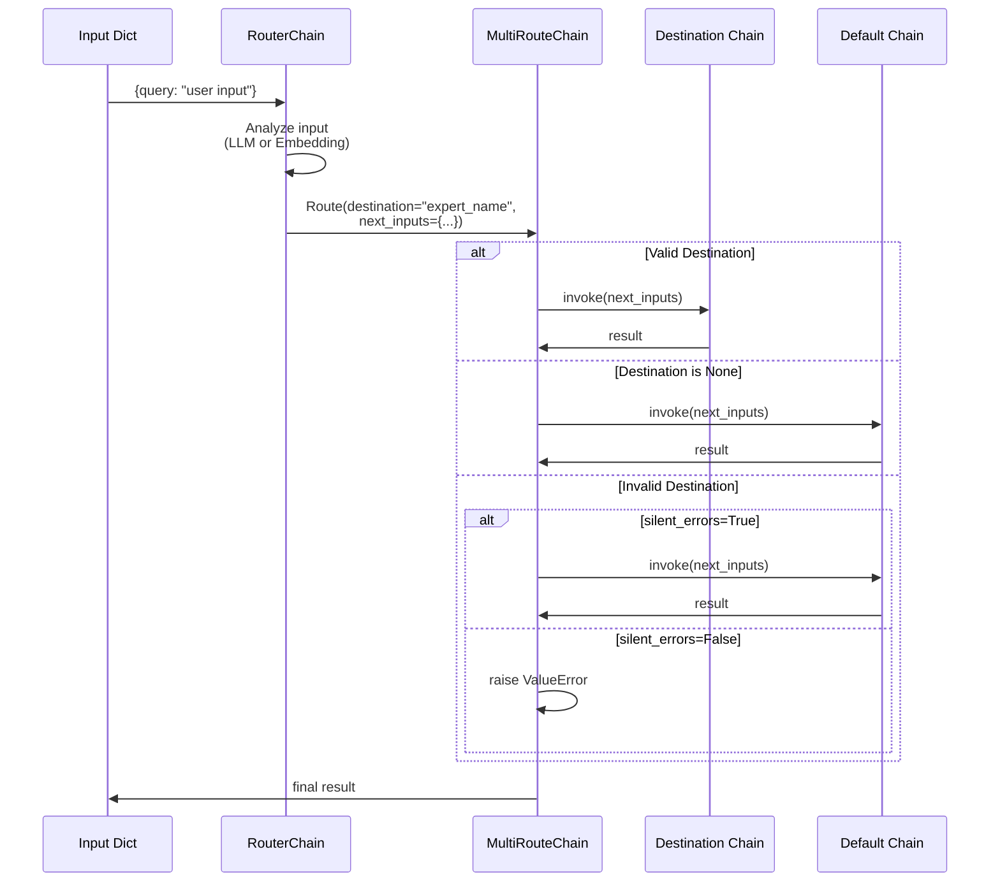

# Router Chains API Reference

## Overview

Router chains enable dynamic selection between multiple destination chains based on input content. They analyze the input and route it to the most appropriate specialized chain, enabling modular and scalable chain architectures.

**Key Concepts:**
- **Router Chain**: Analyzes input and produces routing decision (destination name + processed inputs)
- **Destination Chains**: Specialized chains that handle specific types of queries
- **Default Chain**: Fallback chain used when no destination matches or routing fails
- **Routing Decision**: Returns `{destination: str, next_inputs: dict}` indicating which chain to execute

**Source:** `libs/langchain/langchain_classic/chains/router/base.py`

## Router Chain Types

LangChain provides three router chain implementations:

| Router Type | Routing Method | Status | Use Case |
|------------|----------------|--------|----------|
| **LLMRouterChain** | LLM analyzes input and generates JSON routing decision | Deprecated (0.2.12, removal 1.0) | Legacy applications requiring LLM-based routing |
| **EmbeddingRouterChain** | Semantic similarity search using embeddings | Active | Production use for semantic routing based on query similarity |
| **MultiPromptChain** | LLM router with multiple prompt-based destination chains | Deprecated (0.2.12, removal 1.0) | Legacy multi-expert systems |

---

## LLMRouterChain

**Deprecation Notice:** This class is deprecated since version 0.2.12 and will be removed in version 1.0. Use the modern RunnableLambda pattern described below.

### Class Definition

```python
class LLMRouterChain(RouterChain):
    """A router chain that uses an LLM chain to perform routing.
    
    The LLM analyzes the input and generates a JSON response containing
    the destination chain name and processed inputs.
    """
    
    llm_chain: LLMChain
    """LLM chain used to perform routing. Must have an output parser that
    converts LLM text output to a dictionary with 'destination' and 
    'next_inputs' keys."""
```

**Source:** `libs/langchain/langchain_classic/chains/router/llm_router.py:33`

### Constructor Parameters

#### llm_chain

- **Type:** `LLMChain`
- **Required:** Yes
- **Description:** LLM chain that analyzes input and produces routing decisions
- **Requirements:**
  - Must have a prompt with an `output_parser` configured
  - Output parser must convert LLM text to dict with keys: `destination`, `next_inputs`
  - Typically uses `RouterOutputParser` for JSON markdown parsing

**Validation:** The constructor validates that `llm_chain.prompt.output_parser` is not None, raising `ValueError` if missing.

**Source:** `libs/langchain/langchain_classic/chains/router/llm_router.py:106-117`

### Methods

#### from_llm (classmethod)

Factory method to create an LLMRouterChain from components.

```python
@classmethod
def from_llm(
    cls,
    llm: BaseLanguageModel,
    prompt: BasePromptTemplate,
    **kwargs: Any,
) -> LLMRouterChain:
    """Convenience constructor for creating LLMRouterChain.
    
    Args:
        llm: Language model to use for routing decisions
        prompt: Prompt template with output_parser configured
        **kwargs: Additional arguments passed to LLMRouterChain constructor
    
    Returns:
        Configured LLMRouterChain instance
    
    Example:
        ```python
        from langchain_core.prompts import PromptTemplate
        from langchain_openai import ChatOpenAI
        from langchain_classic.chains.router.llm_router import (
            LLMRouterChain,
            RouterOutputParser
        )
        
        router_prompt = PromptTemplate(
            template="Route to appropriate expert: {input}",
            input_variables=["input"],
            output_parser=RouterOutputParser()
        )
        llm = ChatOpenAI(model="gpt-4o-mini")
        router_chain = LLMRouterChain.from_llm(llm, router_prompt)
        ```
    """
```

**Source:** `libs/langchain/langchain_classic/chains/router/llm_router.py:158-167`

### Migration to Modern Pattern

**Recommended Replacement:** Use `RunnableLambda` with tool calling for structured output.

#### Modern Implementation Example

```python
from operator import itemgetter
from typing import Literal
from typing_extensions import TypedDict

from langchain_core.output_parsers import StrOutputParser
from langchain_core.prompts import ChatPromptTemplate
from langchain_core.runnables import RunnableLambda
from langchain_openai import ChatOpenAI

# Initialize model
model = ChatOpenAI(model="gpt-4o-mini")

# Define destination chain prompts
prompt_1 = ChatPromptTemplate.from_messages([
    ("system", "You are an expert on animals."),
    ("human", "{query}"),
])
prompt_2 = ChatPromptTemplate.from_messages([
    ("system", "You are an expert on vegetables."),
    ("human", "{query}"),
])

# Create destination chains
chain_1 = prompt_1 | model | StrOutputParser()
chain_2 = prompt_2 | model | StrOutputParser()

# Define routing prompt
route_system = "Route the user's query to either the animal or vegetable expert."
route_prompt = ChatPromptTemplate.from_messages([
    ("system", route_system),
    ("human", "{query}"),
])

# Define routing schema with structured output
class RouteQuery(TypedDict):
    """Route query to destination."""
    destination: Literal["animal", "vegetable"]

# Create routing chain with structured output
route_chain = (
    route_prompt
    | model.with_structured_output(RouteQuery)
    | itemgetter("destination")
)

# Compose complete chain with dynamic routing
chain = {
    "destination": route_chain,  # Returns "animal" or "vegetable"
    "query": lambda x: x["query"],  # Pass through input query
} | RunnableLambda(
    # Select chain based on destination
    lambda x: chain_1 if x["destination"] == "animal" else chain_2
)

# Execute
result = chain.invoke({"query": "what color are carrots"})
print(result)  # Output: Carrots are typically orange...
```

**Migration Benefits:**
- ✅ **Streaming Support**: Modern pattern supports token-by-token streaming
- ✅ **Batch Operations**: Process multiple inputs efficiently with `.batch()`
- ✅ **Type Safety**: Structured output with `Literal` types prevents routing errors
- ✅ **Simplified Error Handling**: No need for custom output parsers
- ✅ **Better Composability**: Full LCEL compatibility

**Source:** `libs/langchain/langchain_classic/chains/router/llm_router.py:42-99`

---

## RouterOutputParser

Helper class for parsing LLM routing decisions in legacy LLMRouterChain.

### Class Definition

```python
class RouterOutputParser(BaseOutputParser[dict[str, str]]):
    """Parser for output of router chain in the multi-prompt chain.
    
    Expects LLM to return JSON markdown with 'destination' and 'next_inputs' keys.
    """
    
    default_destination: str = "DEFAULT"
    """Destination name that triggers routing to default chain (case-insensitive)."""
    
    next_inputs_type: type = str
    """Expected type for next_inputs value (validated during parsing)."""
    
    next_inputs_inner_key: str = "input"
    """Key name used to wrap next_inputs value in output dictionary."""
```

**Source:** `libs/langchain/langchain_classic/chains/router/llm_router.py:170-176`

### Methods

#### parse

```python
def parse(self, text: str) -> dict[str, Any]:
    """Parse LLM output text into routing decision dictionary.
    
    Args:
        text: LLM output text containing JSON markdown block with routing decision
    
    Returns:
        Dictionary with structure:
        {
            'destination': str | None,  # Chain name or None for default
            'next_inputs': dict[str, Any]  # Inputs for destination chain
        }
    
    Raises:
        OutputParserException: If text is not valid JSON markdown, missing required
            keys, or has incorrect value types
        TypeError: If 'destination' is not a string or 'next_inputs' has wrong type
    
    Example:
        ```python
        from langchain_classic.chains.router.llm_router import RouterOutputParser
        
        parser = RouterOutputParser(next_inputs_inner_key="query")
        
        # Valid LLM output
        llm_output = '''```json
        {
            "destination": "animal_expert",
            "next_inputs": "Tell me about elephants"
        }
        ```'''
        
        result = parser.parse(llm_output)
        # Returns: {
        #     'destination': 'animal_expert',
        #     'next_inputs': {'query': 'Tell me about elephants'}
        # }
        
        # Default destination (case-insensitive)
        default_output = '''```json
        {
            "destination": "DEFAULT",
            "next_inputs": "General question"
        }
        ```'''
        
        result = parser.parse(default_output)
        # Returns: {
        #     'destination': None,  # Triggers default chain
        #     'next_inputs': {'query': 'General question'}
        # }
        ```
    """
```

**Parsing Logic:**
1. Extracts JSON from markdown code blocks using `parse_and_check_json_markdown`
2. Validates presence of `destination` and `next_inputs` keys
3. Type-checks `destination` (must be string) and `next_inputs` (must match `next_inputs_type`)
4. Wraps `next_inputs` value in dictionary: `{next_inputs_inner_key: value}`
5. Converts destination to `None` if it matches `default_destination` (case-insensitive)
6. Strips whitespace from destination name

**Source:** `libs/langchain/langchain_classic/chains/router/llm_router.py:177-199`

---

## EmbeddingRouterChain

Routes inputs based on semantic similarity using embedding search.

### Class Definition

```python
class EmbeddingRouterChain(RouterChain):
    """Chain that uses embeddings to route between options.
    
    Routes by finding the most semantically similar destination based on
    input content and pre-populated routing descriptions in a vector store.
    """
    
    vectorstore: VectorStore
    """Vector store pre-populated with routing options as documents.
    Each document must have metadata with 'name' key containing destination."""
    
    routing_keys: list[str] = ["query"]
    """Input dictionary keys to join and use for similarity search.
    Default: ['query']"""
```

**Source:** `libs/langchain/langchain_classic/chains/router/embedding_router.py:19-28`

### Constructor Parameters

#### vectorstore

- **Type:** `VectorStore`
- **Required:** Yes
- **Description:** Vector store containing routing options as embedded documents
- **Requirements:**
  - Must be pre-populated with documents representing routing destinations
  - Each document's `metadata` must contain `'name'` key with destination chain name
  - Documents should have meaningful content for semantic matching

#### routing_keys

- **Type:** `list[str]`
- **Required:** No (default: `["query"]`)
- **Description:** Input dictionary keys whose values are joined with ", " separator for similarity search
- **Example:** `["question", "context"]` would join `inputs["question"]` and `inputs["context"]`

### Routing Logic

When invoked, EmbeddingRouterChain:
1. Extracts values from input dict using `routing_keys`
2. Joins extracted values with ", " separator: `_input = ", ".join([inputs[k] for k in routing_keys])`
3. Performs similarity search: `vectorstore.similarity_search(_input, k=1)`
4. Extracts destination from top result: `results[0].metadata["name"]`
5. Returns: `{"next_inputs": inputs, "destination": name}`

**Source:** `libs/langchain/langchain_classic/chains/router/embedding_router.py:44-46`

### Methods

#### from_names_and_descriptions (classmethod)

Factory method to create EmbeddingRouterChain from routing option descriptions.

```python
@classmethod
def from_names_and_descriptions(
    cls,
    names_and_descriptions: Sequence[tuple[str, Sequence[str]]],
    vectorstore_cls: type[VectorStore],
    embeddings: Embeddings,
    **kwargs: Any,
) -> EmbeddingRouterChain:
    """Create EmbeddingRouterChain from destination names and descriptions.
    
    Args:
        names_and_descriptions: Sequence of (name, descriptions) tuples where:
            - name (str): Destination chain name
            - descriptions (Sequence[str]): Multiple description strings for
              semantic matching (e.g., example queries, use case descriptions)
        vectorstore_cls: VectorStore class to instantiate (e.g., Chroma, FAISS)
        embeddings: Embeddings model for encoding descriptions
        **kwargs: Additional arguments passed to EmbeddingRouterChain constructor
    
    Returns:
        Configured EmbeddingRouterChain with populated vector store
    
    Example:
        ```python
        from langchain_community.vectorstores import Chroma
        from langchain_openai import OpenAIEmbeddings
        from langchain_classic.chains.router.embedding_router import (
            EmbeddingRouterChain
        )
        
        # Define routing options with multiple descriptions per destination
        routing_options = [
            (
                "animal_expert",
                [
                    "questions about animals",
                    "wildlife information",
                    "zoology queries",
                    "pet care questions"
                ]
            ),
            (
                "vegetable_expert",
                [
                    "questions about vegetables",
                    "plant-based food information",
                    "gardening and crops",
                    "nutrition of vegetables"
                ]
            ),
        ]
        
        embeddings = OpenAIEmbeddings()
        router = EmbeddingRouterChain.from_names_and_descriptions(
            routing_options,
            Chroma,
            embeddings
        )
        
        # Route based on semantic similarity
        result = router.invoke({"query": "what do elephants eat"})
        # Returns: {
        #     'destination': 'animal_expert',
        #     'next_inputs': {'query': 'what do elephants eat'}
        # }
        ```
    """
```

**Implementation:** Creates `Document` objects with each description as `page_content` and `metadata={"name": destination_name}`, then initializes vector store with all documents.

**Source:** `libs/langchain/langchain_classic/chains/router/embedding_router.py:58-76`

#### afrom_names_and_descriptions (classmethod)

Async variant of `from_names_and_descriptions` for vector stores supporting async initialization.

```python
@classmethod
async def afrom_names_and_descriptions(
    cls,
    names_and_descriptions: Sequence[tuple[str, Sequence[str]]],
    vectorstore_cls: type[VectorStore],
    embeddings: Embeddings,
    **kwargs: Any,
) -> EmbeddingRouterChain:
    """Async factory method to create EmbeddingRouterChain.
    
    Args:
        names_and_descriptions: Sequence of (name, descriptions) tuples
        vectorstore_cls: VectorStore class supporting async initialization
        embeddings: Embeddings model for encoding descriptions
        **kwargs: Additional arguments passed to EmbeddingRouterChain constructor
    
    Returns:
        Configured EmbeddingRouterChain with populated vector store
    
    Example:
        ```python
        import asyncio
        from langchain_community.vectorstores import Chroma
        from langchain_openai import OpenAIEmbeddings
        from langchain_classic.chains.router.embedding_router import (
            EmbeddingRouterChain
        )
        
        async def setup_router():
            routing_options = [
                ("physics", ["physics questions", "mechanics", "thermodynamics"]),
                ("chemistry", ["chemistry questions", "molecules", "reactions"]),
            ]
            
            embeddings = OpenAIEmbeddings()
            router = await EmbeddingRouterChain.afrom_names_and_descriptions(
                routing_options,
                Chroma,
                embeddings
            )
            return router
        
        router = asyncio.run(setup_router())
        ```
    """
```

**Source:** `libs/langchain/langchain_classic/chains/router/embedding_router.py:79-96`

### EmbeddingRouterChain Usage Example

Complete example demonstrating semantic routing:

```python
from langchain_community.vectorstores import Chroma
from langchain_core.output_parsers import StrOutputParser
from langchain_core.prompts import ChatPromptTemplate
from langchain_openai import ChatOpenAI, OpenAIEmbeddings
from langchain_classic.chains.router.embedding_router import EmbeddingRouterChain
from langchain_classic.chains.router.base import MultiRouteChain
from langchain_classic.chains import LLMChain

# Setup embedding-based router
routing_options = [
    (
        "technical_support",
        [
            "technical issues",
            "troubleshooting",
            "error messages",
            "software problems",
            "configuration help"
        ]
    ),
    (
        "billing_support",
        [
            "billing questions",
            "payment issues",
            "subscription management",
            "invoice inquiries",
            "refund requests"
        ]
    ),
    (
        "general_inquiry",
        [
            "general questions",
            "information requests",
            "product features",
            "company information"
        ]
    )
]

embeddings = OpenAIEmbeddings()
router_chain = EmbeddingRouterChain.from_names_and_descriptions(
    routing_options,
    Chroma,
    embeddings,
    routing_keys=["user_message"]  # Custom input key
)

# Create destination chains
model = ChatOpenAI(model="gpt-4o-mini")

technical_chain = (
    ChatPromptTemplate.from_messages([
        ("system", "You are a technical support specialist."),
        ("human", "{user_message}")
    ])
    | model
    | StrOutputParser()
)

billing_chain = (
    ChatPromptTemplate.from_messages([
        ("system", "You are a billing support specialist."),
        ("human", "{user_message}")
    ])
    | model
    | StrOutputParser()
)

general_chain = (
    ChatPromptTemplate.from_messages([
        ("system", "You are a customer service representative."),
        ("human", "{user_message}")
    ])
    | model
    | StrOutputParser()
)

# Note: For production use with modern patterns, consider using
# RunnableBranch or conditional routing instead of MultiRouteChain

# Test routing
route_result = router_chain.invoke({
    "user_message": "My application keeps crashing when I click save"
})
print(route_result)
# Output: {
#     'destination': 'technical_support',
#     'next_inputs': {'user_message': 'My application keeps crashing...'}
# }
```

---

## MultiPromptChain

**Deprecation Notice:** This class is deprecated since version 0.2.12 and will be removed in version 1.0. Use the LangGraph pattern described below.

### Class Definition

```python
class MultiPromptChain(MultiRouteChain):
    """A multi-route chain that uses an LLM router chain to choose amongst prompts.
    
    Specialized implementation of MultiRouteChain where:
    - Router is typically an LLMRouterChain
    - Destination chains are prompt-based (usually LLMChain instances)
    - Routing decision selects which expert/prompt to use based on input
    """
```

Inherits from `MultiRouteChain`, which provides the core routing infrastructure.

**Source:** `libs/langchain/langchain_classic/chains/router/multi_prompt.py:33`

### MultiRouteChain Base Class

MultiPromptChain inherits routing logic from MultiRouteChain:

```python
class MultiRouteChain(Chain):
    """Use a single chain to route an input to one of multiple candidate chains."""
    
    router_chain: RouterChain
    """Chain that routes inputs to destination chains."""
    
    destination_chains: Mapping[str, Chain]
    """Chains that return final answer to inputs."""
    
    default_chain: Chain
    """Default chain to use when none of the destination chains are suitable."""
    
    silent_errors: bool = False
    """If True, use default_chain when an invalid destination name is provided.
    If False, raise ValueError on invalid destination."""
```

**Source:** `libs/langchain/langchain_classic/chains/router/base.py:66-76`

### Constructor Parameters

#### router_chain

- **Type:** `RouterChain` (typically `LLMRouterChain`)
- **Required:** Yes
- **Description:** Chain that analyzes input and returns routing decision
- **Returns:** `{destination: str, next_inputs: dict}`

#### destination_chains

- **Type:** `Mapping[str, Chain]`
- **Required:** Yes
- **Description:** Dictionary mapping destination names to specialized chains
- **Keys:** Must match destination names returned by router_chain
- **Values:** Chain objects (often `LLMChain` with specialized prompts)

#### default_chain

- **Type:** `Chain`
- **Required:** Yes
- **Description:** Fallback chain used when:
  - Router returns `destination=None`
  - Router returns invalid destination name (when `silent_errors=True`)
  - No matching destination found

#### silent_errors

- **Type:** `bool`
- **Required:** No (default: `False`)
- **Description:** Error handling mode:
  - `False`: Raise `ValueError` on invalid destination
  - `True`: Route to default_chain on invalid destination

### Routing Flow

**Execution Sequence (sync):**
1. `MultiRouteChain._call()` receives inputs
2. Calls `router_chain.route(inputs)` → returns `Route(destination, next_inputs)`
3. Decision logic:
   - If `destination is None` → execute `default_chain(next_inputs)`
   - Else if `destination in destination_chains` → execute `destination_chains[destination](next_inputs)`
   - Else if `silent_errors=True` → execute `default_chain(next_inputs)`
   - Else → raise `ValueError(f"Received invalid destination chain name '{destination}'")`
4. Returns result from executed chain

**Source:** `libs/langchain/langchain_classic/chains/router/base.py:99-122`

**Async Variant:** `MultiRouteChain._acall()` follows identical logic using async methods.

**Source:** `libs/langchain/langchain_classic/chains/router/base.py:124-153`

### Methods

#### from_prompts (classmethod)

Factory method to create MultiPromptChain from prompt configurations.

```python
@classmethod
def from_prompts(
    cls,
    llm: BaseLanguageModel,
    prompt_infos: list[dict[str, str]],
    default_chain: Chain | None = None,
    **kwargs: Any,
) -> MultiPromptChain:
    """Convenience constructor for instantiating from destination prompts.
    
    Args:
        llm: Language model to use for router and destination chains
        prompt_infos: List of prompt configuration dictionaries, each containing:
            - 'name' (str): Destination chain identifier
            - 'description' (str): Description for router to match against
            - 'prompt_template' (str): Template string for destination chain
        default_chain: Optional default chain (creates ConversationChain if None)
        **kwargs: Additional arguments passed to MultiPromptChain constructor
    
    Returns:
        Configured MultiPromptChain instance
    
    Example:
        ```python
        from langchain_openai import ChatOpenAI
        from langchain_classic.chains.router.multi_prompt import MultiPromptChain
        
        llm = ChatOpenAI(model="gpt-4o-mini")
        
        prompt_infos = [
            {
                "name": "physics",
                "description": "Good for answering physics questions",
                "prompt_template": "You are a physics expert. {input}"
            },
            {
                "name": "math",
                "description": "Good for answering math questions",
                "prompt_template": "You are a math expert. {input}"
            },
            {
                "name": "history",
                "description": "Good for answering history questions",
                "prompt_template": "You are a history expert. {input}"
            }
        ]
        
        multi_prompt_chain = MultiPromptChain.from_prompts(
            llm,
            prompt_infos,
            verbose=True
        )
        
        result = multi_prompt_chain.invoke({
            "input": "What is Newton's second law?"
        })
        # Routes to physics chain and returns expert answer
        ```
    """
```

**Implementation Details:**
1. Constructs router prompt from descriptions: `"physics: Good for answering physics questions\n..."`
2. Creates `LLMRouterChain` with `RouterOutputParser`
3. Creates `LLMChain` for each prompt_info with specified template
4. Uses `ConversationChain` as default if not provided

**Source:** `libs/langchain/langchain_classic/chains/router/multi_prompt.py:157-190`

### Migration to LangGraph

**Recommended Replacement:** Use LangGraph's `StateGraph` for complex routing with state management.

#### LangGraph Implementation Example

```python
from operator import itemgetter
from typing import Literal

from langchain_core.output_parsers import StrOutputParser
from langchain_core.prompts import ChatPromptTemplate
from langchain_core.runnables import RunnableConfig
from langchain_openai import ChatOpenAI
from langgraph.graph import END, START, StateGraph
from typing_extensions import TypedDict

model = ChatOpenAI(model="gpt-4o-mini")

# Define the prompts we will route to
prompt_1 = ChatPromptTemplate.from_messages([
    ("system", "You are an expert on animals."),
    ("human", "{input}"),
])
prompt_2 = ChatPromptTemplate.from_messages([
    ("system", "You are an expert on vegetables."),
    ("human", "{input}"),
])

# Construct the chains we will route to
chain_1 = prompt_1 | model | StrOutputParser()
chain_2 = prompt_2 | model | StrOutputParser()

# Define the chain that selects which branch to route to
route_system = "Route the user's query to either the animal or vegetable expert."
route_prompt = ChatPromptTemplate.from_messages([
    ("system", route_system),
    ("human", "{input}"),
])

# Define routing schema
class RouteQuery(TypedDict):
    """Route query to destination expert."""
    destination: Literal["animal", "vegetable"]

route_chain = route_prompt | model.with_structured_output(RouteQuery)

# Define state for the graph
class State(TypedDict):
    query: str
    destination: RouteQuery
    answer: str

# Define node functions
async def route_query(state: State, config: RunnableConfig):
    destination = await route_chain.ainvoke(state["query"], config)
    return {"destination": destination}

async def prompt_1(state: State, config: RunnableConfig):
    return {"answer": await chain_1.ainvoke(state["query"], config)}

async def prompt_2(state: State, config: RunnableConfig):
    return {"answer": await chain_2.ainvoke(state["query"], config)}

# Define conditional logic for routing
def select_node(state: State) -> Literal["prompt_1", "prompt_2"]:
    if state["destination"]["destination"] == "animal":
        return "prompt_1"
    else:
        return "prompt_2"

# Assemble the graph
graph = StateGraph(State)
graph.add_node("route_query", route_query)
graph.add_node("prompt_1", prompt_1)
graph.add_node("prompt_2", prompt_2)

graph.add_edge(START, "route_query")
graph.add_conditional_edges("route_query", select_node)
graph.add_edge("prompt_1", END)
graph.add_edge("prompt_2", END)

app = graph.compile()

# Execute
import asyncio
result = asyncio.run(app.ainvoke({"query": "what color are carrots"}))
print(result["destination"])  # {'destination': 'vegetable'}
print(result["answer"])       # Carrots are typically orange...
```

**LangGraph Migration Benefits:**
- ✅ **State Management**: Explicit state tracking through execution
- ✅ **Complex Routing**: Support for conditional edges and multi-step routing
- ✅ **Visualization**: Built-in graph visualization capabilities
- ✅ **Debugging**: Clear state transitions and node execution tracking
- ✅ **Flexibility**: Easy to add additional routing conditions or nodes

**Source:** `libs/langchain/langchain_classic/chains/router/multi_prompt.py:39-148`

---

## Type Flow Documentation

### Routing Decision Type Flow



### LLMRouterChain Type Flow

**Input** → **LLMChain** → **LLM Text Output** → **RouterOutputParser** → **Route Decision** → **Destination Selection**

**Detailed Type Progression:**

```python
# Step 1: Input (dict[str, Any])
inputs = {"query": "What do elephants eat?", "context": "..."}

# Step 2: LLMChain processes with prompt template
# Returns raw LLM text with JSON markdown

# Step 3: RouterOutputParser.parse() extracts JSON
# Expected format:
# ```json
# {
#     "destination": "animal_expert",
#     "next_inputs": "What do elephants eat?"
# }
# ```

# Step 4: Parsed output (dict[str, Any])
parsed = {
    "destination": "animal_expert",  # str | None
    "next_inputs": {"input": "What do elephants eat?"}  # dict[str, Any]
}

# Step 5: Route object created
route = Route(
    destination="animal_expert",
    next_inputs={"input": "What do elephants eat?"}
)

# Step 6: Destination chain selected and executed
result = destination_chains["animal_expert"](route.next_inputs)
```

### EmbeddingRouterChain Type Flow

**Input** → **Routing Keys Extraction** → **Similarity Search** → **Route Decision** → **Destination Selection**

**Detailed Type Progression:**

```python
# Step 1: Input (dict[str, Any])
inputs = {"query": "My bill is incorrect", "user_id": "12345"}

# Step 2: Extract routing key values
routing_keys = ["query"]
_input = ", ".join([inputs[k] for k in routing_keys])
# _input = "My bill is incorrect"

# Step 3: Vectorstore similarity search
results = vectorstore.similarity_search(_input, k=1)
# results[0] = Document(
#     page_content="billing questions",
#     metadata={"name": "billing_support"}
# )

# Step 4: Extract destination from metadata
destination = results[0].metadata["name"]  # "billing_support"

# Step 5: Return route decision
return {
    "destination": "billing_support",
    "next_inputs": inputs  # Original inputs passed through unchanged
}
```

---

## Error Handling

### LLMRouterChain Errors

#### OutputParserException

**Trigger:** LLM output is not valid JSON markdown or missing required keys.

**Cause Examples:**
- LLM returns plain text instead of JSON markdown
- JSON missing `destination` or `next_inputs` keys
- Malformed JSON syntax

**Example:**
```python
from langchain_core.exceptions import OutputParserException
from langchain_classic.chains.router.llm_router import RouterOutputParser

parser = RouterOutputParser()

# Invalid: Missing JSON markdown
try:
    parser.parse("The answer is animal expert")
except OutputParserException as e:
    print(f"Parser error: {e}")
    # Parser error: Parsing text... raised following error:...

# Invalid: Missing required key
try:
    parser.parse('```json\n{"destination": "expert"}\n```')
except OutputParserException as e:
    print(f"Missing key: {e}")
```

**Solution:** Ensure LLM prompt clearly instructs JSON markdown output format with required keys.

**Source:** `libs/langchain/langchain_classic/chains/router/llm_router.py:196-198`

#### TypeError

**Trigger:** Parsed values have incorrect types.

**Cause Examples:**
- `destination` is not a string
- `next_inputs` doesn't match `next_inputs_type`

**Example:**
```python
# Invalid: destination is not string
invalid_json = '''```json
{
    "destination": ["expert1", "expert2"],
    "next_inputs": "query text"
}
```'''

try:
    parser.parse(invalid_json)
except OutputParserException as e:
    print(f"Type error wrapped: {e}")
    # Original TypeError: Expected 'destination' to be a string.
```

**Solution:** Validate prompt template produces correctly typed output. Consider using structured output with Pydantic models in modern patterns.

**Source:** `libs/langchain/langchain_classic/chains/router/llm_router.py:182-187`

### MultiRouteChain Errors

#### ValueError: Invalid Destination

**Trigger:** Router returns destination name not in `destination_chains` (when `silent_errors=False`).

**Example:**
```python
from langchain_classic.chains.router.base import MultiRouteChain

# Assume router returns destination="unknown_expert"
# but destination_chains only has {"physics": ..., "math": ...}

try:
    result = multi_route_chain.invoke({"input": "query"})
except ValueError as e:
    print(e)
    # Received invalid destination chain name 'unknown_expert'
```

**Solutions:**
1. Set `silent_errors=True` to route to default_chain on invalid destinations
2. Ensure router is properly constrained to valid destination names
3. Use structured output with `Literal` types in modern patterns

**Source:** `libs/langchain/langchain_classic/chains/router/base.py:121-122`

### EmbeddingRouterChain Errors

#### IndexError

**Trigger:** Similarity search returns empty results or vectorstore is empty.

**Example:**
```python
# Empty vectorstore
try:
    result = embedding_router.invoke({"query": "test"})
except IndexError as e:
    print("Error: Vectorstore returned no results")
    # results[0] fails because results is empty
```

**Solution:** Ensure vectorstore is properly populated with routing option documents before use.

**Source:** `libs/langchain/langchain_classic/chains/router/embedding_router.py:46`

#### KeyError

**Trigger:** Input dict missing keys specified in `routing_keys`.

**Example:**
```python
# routing_keys = ["query", "context"]
# Input only has "query"

try:
    result = embedding_router.invoke({"query": "test"})
    # Missing "context" key
except KeyError as e:
    print(f"Missing routing key: {e}")
```

**Solution:** Ensure input dict contains all keys specified in `routing_keys`, or adjust `routing_keys` to match available inputs.

#### KeyError: Missing 'name' in Metadata

**Trigger:** Vectorstore documents missing `metadata['name']` key.

**Example:**
```python
# Document without proper metadata
from langchain_core.documents import Document

# Invalid: Missing 'name' in metadata
doc = Document(page_content="description", metadata={"id": 1})
# Will fail when router tries: results[0].metadata["name"]
```

**Solution:** Ensure all documents in vectorstore have `metadata` with `'name'` key containing destination chain name.

**Source:** `libs/langchain/langchain_classic/chains/router/embedding_router.py:46`

---

## Troubleshooting

### LLM Routing Issues

**Problem:** LLM inconsistently returns valid JSON format.

**Symptoms:**
- Frequent `OutputParserException` errors
- Router sometimes works, sometimes fails

**Diagnosis:**
```python
# Enable verbose mode to see LLM outputs
llm_router_chain = LLMRouterChain.from_llm(
    llm,
    router_prompt,
    verbose=True
)

# Check raw LLM output before parsing
result = llm_router_chain.llm_chain.predict(input="test query")
print(f"Raw LLM output:\n{result}")
```

**Solutions:**
1. **Improve Prompt Clarity:**
   ```python
   router_template = """Given the input, select the appropriate expert.
   
   Available experts:
   {destinations}
   
   Respond ONLY with valid JSON markdown in this exact format:
   ```json
   {{
       "destination": "expert_name",
       "next_inputs": "processed input text"
   }}
   ```
   
   Input: {input}
   """
   ```

2. **Use Modern Structured Output:**
   Replace `LLMRouterChain` with `model.with_structured_output()` pattern for guaranteed schema compliance.

3. **Add Few-Shot Examples:**
   Include example inputs and expected JSON outputs in the prompt.

**Problem:** Router selects wrong destination.

**Symptoms:**
- Questions routed to incorrect expert chains
- Routing decisions seem random

**Diagnosis:**
```python
# Test router in isolation
route_result = router_chain.route({"input": "test query"})
print(f"Destination: {route_result.destination}")
print(f"Next inputs: {route_result.next_inputs}")
```

**Solutions:**
1. **Improve Destination Descriptions:**
   ```python
   # Bad: Vague descriptions
   destinations = [
       "physics: physics questions",
       "chemistry: chemistry questions"
   ]
   
   # Good: Specific descriptions with examples
   destinations = [
       "physics: Questions about motion, forces, energy, thermodynamics. "
       "Examples: 'What is Newton's law?', 'How does gravity work?'",
       "chemistry: Questions about atoms, molecules, reactions, compounds. "
       "Examples: 'What is H2O?', 'How do acids work?'"
   ]
   ```

2. **Use More Capable Model:**
   ```python
   # Upgrade to more capable model for routing
   llm = ChatOpenAI(model="gpt-4o")  # Instead of gpt-4o-mini
   ```

### Embedding Routing Issues

**Problem:** Semantic routing selects unexpected destinations.

**Symptoms:**
- Queries routed to seemingly unrelated destinations
- Inconsistent routing for similar queries

**Diagnosis:**
```python
# Test similarity search directly
_input = "test query"
results = embedding_router.vectorstore.similarity_search(_input, k=3)
for i, doc in enumerate(results):
    print(f"{i+1}. {doc.metadata['name']}: {doc.page_content}")
    
# Check if top result makes sense
```

**Solutions:**
1. **Add More Diverse Descriptions:**
   ```python
   routing_options = [
       (
           "technical_support",
           [
               "technical issues",
               "error messages",
               "software crashes",
               "installation problems",
               "configuration help",
               "system not working",
               "application freezing",
               "performance issues"
           ]
       ),
       # ... more destinations with 5-10 descriptions each
   ]
   ```

2. **Use Better Embeddings Model:**
   ```python
   # Upgrade to more capable embeddings
   from langchain_openai import OpenAIEmbeddings
   embeddings = OpenAIEmbeddings(model="text-embedding-3-large")
   ```

3. **Tune routing_keys:**
   ```python
   # Include more context in similarity search
   router = EmbeddingRouterChain.from_names_and_descriptions(
       routing_options,
       Chroma,
       embeddings,
       routing_keys=["query", "context", "user_intent"]
   )
   ```

**Problem:** Empty vectorstore or initialization failures.

**Symptoms:**
- `IndexError` on invoke
- "No results" errors

**Diagnosis:**
```python
# Check vectorstore population
docs = embedding_router.vectorstore.similarity_search("test", k=10)
print(f"Vectorstore has {len(docs)} documents")

# Verify metadata
for doc in docs:
    print(f"Name: {doc.metadata.get('name', 'MISSING')}")
```

**Solutions:**
1. **Verify Initialization:**
   ```python
   # Ensure from_names_and_descriptions completed successfully
   try:
       router = EmbeddingRouterChain.from_names_and_descriptions(
           routing_options,
           Chroma,
           embeddings
       )
       print("Router initialized successfully")
   except Exception as e:
       print(f"Initialization failed: {e}")
   ```

2. **Check Embeddings API Key:**
   ```python
   import os
   if not os.getenv("OPENAI_API_KEY"):
       raise ValueError("OPENAI_API_KEY not set")
   ```

### MultiPromptChain Issues

**Problem:** Default chain always executes instead of destination chains.

**Symptoms:**
- Routing seems to work but default chain always runs
- Destination chains never invoked

**Diagnosis:**
```python
# Test router directly
route = multi_prompt_chain.router_chain.route({"input": "test"})
print(f"Destination: {route.destination}")
print(f"Is None: {route.destination is None}")
print(f"In chains: {route.destination in multi_prompt_chain.destination_chains}")
print(f"Available: {list(multi_prompt_chain.destination_chains.keys())}")
```

**Solutions:**
1. **Check Destination Name Matching:**
   ```python
   # Ensure router destination names exactly match dictionary keys
   # Case-sensitive!
   
   # Router returns: "Physics"
   # But destination_chains has: {"physics": ...}
   # Result: Mismatch! Default chain runs
   
   # Fix: Use consistent casing
   prompt_infos = [
       {"name": "physics", ...},  # Lowercase to match router
       {"name": "chemistry", ...}
   ]
   ```

2. **Check RouterOutputParser default_destination:**
   ```python
   parser = RouterOutputParser(default_destination="DEFAULT")
   # If LLM returns "DEFAULT" (case-insensitive), destination becomes None
   ```

---

## Best Practices

### When to Use Each Router Type

**Use EmbeddingRouterChain when:**
- ✅ Routing based on semantic similarity
- ✅ Need fast, deterministic routing
- ✅ Have clear, distinct topic areas
- ✅ Want to avoid LLM costs for routing
- ✅ Routing logic is straightforward classification

**Use LLMRouterChain when:**
- ⚠️ **DEPRECATED** - Use modern RunnableLambda pattern instead
- Legacy code requires LLM-based routing logic
- Complex routing decisions requiring reasoning

**Use Modern Patterns (RunnableLambda/LangGraph) when:**
- ✅ **New Development** - Always prefer for new implementations
- ✅ Need streaming or batch support
- ✅ Want type safety with structured output
- ✅ Require complex multi-step routing
- ✅ Need state management across routing

### Performance Optimization

**Embedding Router Optimization:**
```python
# 1. Limit similarity search results
# Only need top result for routing
results = vectorstore.similarity_search(query, k=1)

# 2. Use efficient vector store
from langchain_community.vectorstores import FAISS  # Fast for small-medium datasets
# or
from langchain_community.vectorstores import Chroma  # Good balance of speed/features

# 3. Cache embeddings model
embeddings = OpenAIEmbeddings()  # Reuse same instance
```

**LLM Router Optimization:**
```python
# 1. Use faster models for routing
router_llm = ChatOpenAI(model="gpt-4o-mini", temperature=0)

# 2. Keep routing prompts concise
# Shorter prompts = faster inference + lower cost

# 3. Use streaming for destination chains (not router)
# Router needs full output, but destination chains can stream
```

### Error Handling Patterns

**Robust MultiRouteChain Setup:**
```python
from langchain_classic.chains.router.base import MultiRouteChain
from langchain_classic.chains import ConversationChain

# Always provide default chain
default_chain = ConversationChain(
    llm=llm,
    output_key="text",
    verbose=True
)

# Use silent_errors for production resilience
multi_route_chain = MultiRouteChain(
    router_chain=router,
    destination_chains=destinations,
    default_chain=default_chain,
    silent_errors=True,  # Gracefully handle routing failures
    verbose=True  # Log routing decisions
)
```

**Validation Before Execution:**
```python
# Validate router setup
def validate_router_setup(multi_route: MultiRouteChain) -> list[str]:
    """Validate router configuration and return issues."""
    issues = []
    
    # Test router produces valid destinations
    test_inputs = [{"input": "test query 1"}, {"input": "test query 2"}]
    for test_input in test_inputs:
        try:
            route = multi_route.router_chain.route(test_input)
            if route.destination and route.destination not in multi_route.destination_chains:
                issues.append(f"Router produced invalid destination: {route.destination}")
        except Exception as e:
            issues.append(f"Router failed: {e}")
    
    # Verify default chain exists
    if multi_route.default_chain is None:
        issues.append("No default chain configured")
    
    return issues

# Run validation
issues = validate_router_setup(multi_route_chain)
if issues:
    print("Router setup issues:")
    for issue in issues:
        print(f"  - {issue}")
```

### Security Considerations

**Input Validation:**
```python
def safe_route_invoke(chain: MultiRouteChain, inputs: dict[str, Any]) -> dict[str, Any]:
    """Safely invoke router chain with input validation."""
    # Validate required keys present
    required_keys = chain.input_keys
    for key in required_keys:
        if key not in inputs:
            raise ValueError(f"Missing required input key: {key}")
    
    # Sanitize string inputs (prevent injection)
    sanitized = {}
    for key, value in inputs.items():
        if isinstance(value, str):
            # Remove potential injection patterns
            sanitized[key] = value.strip()[:1000]  # Limit length
        else:
            sanitized[key] = value
    
    return chain.invoke(sanitized)
```

**Rate Limiting:**
```python
from datetime import datetime, timedelta

class RateLimitedRouter:
    """Wrapper for rate-limited routing."""
    
    def __init__(self, router: MultiRouteChain, max_requests: int = 10, 
                 window_seconds: int = 60):
        self.router = router
        self.max_requests = max_requests
        self.window_seconds = window_seconds
        self.requests: list[datetime] = []
    
    def invoke(self, inputs: dict[str, Any]) -> dict[str, Any]:
        now = datetime.now()
        cutoff = now - timedelta(seconds=self.window_seconds)
        
        # Remove old requests
        self.requests = [req for req in self.requests if req > cutoff]
        
        # Check rate limit
        if len(self.requests) >= self.max_requests:
            raise Exception(f"Rate limit exceeded: {self.max_requests} requests per "
                          f"{self.window_seconds}s")
        
        self.requests.append(now)
        return self.router.invoke(inputs)
```

---

## Related Documentation

- **[Chain Base Class](../base.md)** - Core Chain interface and lifecycle methods
- **[LLMChain API](../llm-chain.md)** - LLMChain used in router implementations  
- **[LCEL Composition Guide](../../../guides/lcel-composition.md)** - Modern chain composition patterns
- **[Callbacks Guide](../../../guides/callbacks.md)** - Callback integration for monitoring routing decisions

---

## Summary

Router chains provide dynamic routing between specialized chains based on input analysis:

- **LLMRouterChain**: Deprecated LLM-based routing; migrate to RunnableLambda with structured output
- **EmbeddingRouterChain**: Production-ready semantic routing using embedding similarity
- **MultiPromptChain**: Deprecated multi-expert system; migrate to LangGraph for complex routing

**Migration Priority:** Replace LLMRouterChain and MultiPromptChain with modern patterns (RunnableLambda or LangGraph) for new development. EmbeddingRouterChain remains suitable for semantic routing use cases.

**Key Takeaway:** Router chains enable modular, scalable architectures by delegating specialized queries to appropriate expert chains, with modern patterns offering better streaming, typing, and state management.

