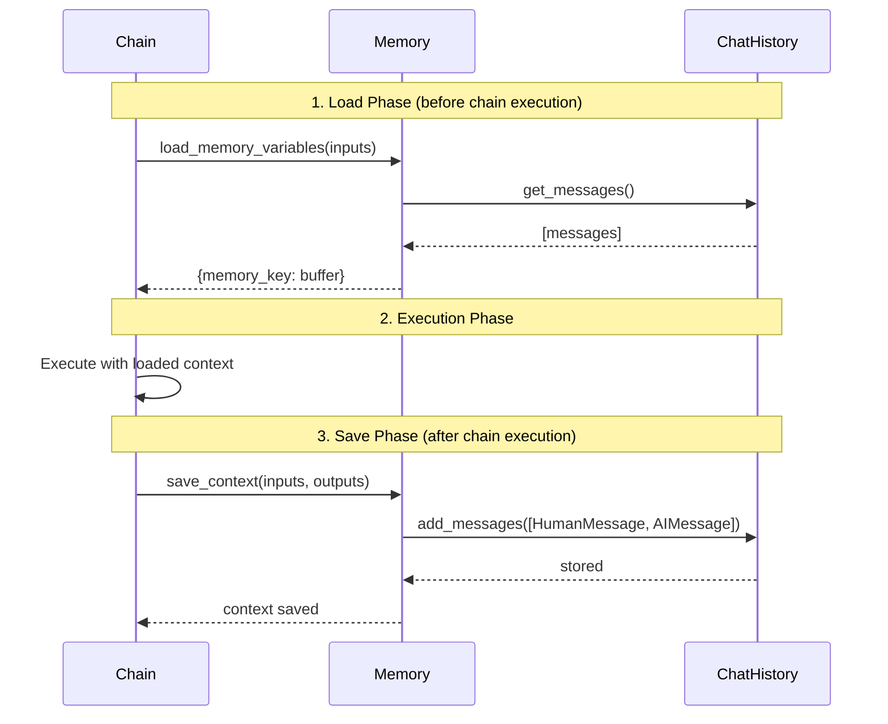

# Buffer Memory API Reference

## Overview

This document provides comprehensive API reference documentation for LangChain's buffer-based memory implementations: `ConversationBufferMemory` and `ConversationBufferWindowMemory`. These classes provide conversation history storage for chains that require context from previous interactions.

!!! warning "Deprecation Notice"
    Both `ConversationBufferMemory` and `ConversationBufferWindowMemory` are deprecated since version 0.3.1 and will be removed in version 1.0.0. These abstractions were created prior to when chat models had native tool calling capabilities and do **NOT** support native tool calling.
    
    **Please migrate to the new patterns described in the [migration guide](https://python.langchain.com/docs/versions/migrating_memory/).**
    
    Source: libs/langchain/langchain_classic/memory/buffer.py:13-19  
    Source: libs/langchain/langchain_classic/memory/buffer_window.py:10-16

## Memory Architecture

The buffer memory classes inherit from `BaseChatMemory`, which provides the core memory interface for storing and retrieving conversation context. The memory lifecycle during chain execution follows this pattern:



Source: libs/langchain/langchain_classic/memory/chat_memory.py:74-96

---

## ConversationBufferMemory

### Class Definition

```python
class ConversationBufferMemory(BaseChatMemory):
    """A basic memory implementation that simply stores the conversation history.
    
    This stores the entire conversation history in memory without any
    additional processing.
    
    Note that additional processing may be required in some situations when the
    conversation history is too large to fit in the context window of the model.
    """
```

Source: libs/langchain/langchain_classic/memory/buffer.py:21-29

### Description

`ConversationBufferMemory` maintains the complete conversation history without truncation or summarization. It stores all messages from the conversation and returns them when requested by a chain. This is the simplest memory implementation, suitable for short conversations where the full context fits within the model's context window.

**When to Use:**
- Short conversations (< 10 exchanges)
- Applications where full context is required
- Debugging and development scenarios
- When token limits are not a concern

**When NOT to Use:**
- Long conversations that exceed model context windows
- Production applications with token cost concerns
- High-volume applications requiring memory optimization

### Configuration Parameters

#### `human_prefix`

- **Type:** `str`
- **Default:** `"Human"`
- **Description:** Prefix label for human/user messages when formatting the conversation buffer as a string.

Source: libs/langchain/langchain_classic/memory/buffer.py:31

#### `ai_prefix`

- **Type:** `str`
- **Default:** `"AI"`
- **Description:** Prefix label for AI/assistant messages when formatting the conversation buffer as a string.

Source: libs/langchain/langchain_classic/memory/buffer.py:32

#### `memory_key`

- **Type:** `str`
- **Default:** `"history"`
- **Description:** The key name under which memory contents will be stored in the chain's input dictionary.

Source: libs/langchain/langchain_classic/memory/buffer.py:33

#### `chat_memory`

- **Type:** `BaseChatMessageHistory`
- **Default:** `InMemoryChatMessageHistory()`
- **Description:** The underlying chat message storage backend. Defaults to in-memory storage but can be replaced with persistent storage implementations.

Source: libs/langchain/langchain_classic/memory/chat_memory.py:36-38

#### `input_key`

- **Type:** `str | None`
- **Default:** `None`
- **Description:** Explicit key to use for extracting user input from chain inputs. If `None`, the key is automatically determined from the chain inputs.

Source: libs/langchain/langchain_classic/memory/chat_memory.py:40

#### `output_key`

- **Type:** `str | None`
- **Default:** `None`
- **Description:** Explicit key to use for extracting chain output. If `None`, the key is automatically determined (uses "output" if present, or the only available key).

Source: libs/langchain/langchain_classic/memory/chat_memory.py:39

#### `return_messages`

- **Type:** `bool`
- **Default:** `False`
- **Description:** If `True`, returns conversation history as a list of `BaseMessage` objects. If `False`, returns history as a formatted string.

Source: libs/langchain/langchain_classic/memory/chat_memory.py:41

### Properties

#### `memory_variables`

```python
@property
def memory_variables(self) -> list[str]:
    """Will always return list of memory variables."""
```

**Returns:**
- Type: `list[str]`
- Description: A list containing the single memory key that this memory class will inject into chain inputs.
- Example: `["history"]` (by default)

Source: libs/langchain/langchain_classic/memory/buffer.py:74-80

#### `buffer`

```python
@property
def buffer(self) -> Any:
    """String buffer of memory."""
```

**Returns:**
- Type: `list[BaseMessage]` if `return_messages=True`, else `str`
- Description: The conversation buffer in the format determined by the `return_messages` setting.

**Example:**
```python
# With return_messages=False (default)
memory = ConversationBufferMemory()
# ... after conversation ...
print(memory.buffer)
# Output: "Human: Hello\nAI: Hi there!\nHuman: How are you?\nAI: I'm doing well!"

# With return_messages=True
memory = ConversationBufferMemory(return_messages=True)
# ... after conversation ...
print(memory.buffer)
# Output: [HumanMessage(content="Hello"), AIMessage(content="Hi there!"), ...]
```

Source: libs/langchain/langchain_classic/memory/buffer.py:35-38

#### `abuffer()`

```python
async def abuffer(self) -> Any:
    """String buffer of memory."""
```

**Returns:**
- Type: `list[BaseMessage]` if `return_messages=True`, else `str`
- Description: Async version of `buffer` property. Returns the conversation buffer asynchronously.

Source: libs/langchain/langchain_classic/memory/buffer.py:40-46

#### `buffer_as_str`

```python
@property
def buffer_as_str(self) -> str:
    """Exposes the buffer as a string in case return_messages is True."""
```

**Returns:**
- Type: `str`
- Description: The conversation buffer formatted as a string, regardless of the `return_messages` setting. Messages are formatted with the configured `human_prefix` and `ai_prefix`.

**Example:**
```python
memory = ConversationBufferMemory(human_prefix="User", ai_prefix="Assistant")
# ... after conversation ...
print(memory.buffer_as_str)
# Output: "User: Hello\nAssistant: Hi there!\nUser: How are you?\nAssistant: I'm doing well!"
```

Source: libs/langchain/langchain_classic/memory/buffer.py:55-58

#### `abuffer_as_str()`

```python
async def abuffer_as_str(self) -> str:
    """Exposes the buffer as a string in case return_messages is True."""
```

**Returns:**
- Type: `str`
- Description: Async version of `buffer_as_str`. Returns the formatted string buffer asynchronously.

Source: libs/langchain/langchain_classic/memory/buffer.py:60-63

#### `buffer_as_messages`

```python
@property
def buffer_as_messages(self) -> list[BaseMessage]:
    """Exposes the buffer as a list of messages in case return_messages is False."""
```

**Returns:**
- Type: `list[BaseMessage]`
- Description: The conversation buffer as a list of message objects, regardless of the `return_messages` setting.

Source: libs/langchain/langchain_classic/memory/buffer.py:65-68

#### `abuffer_as_messages()`

```python
async def abuffer_as_messages(self) -> list[BaseMessage]:
    """Exposes the buffer as a list of messages in case return_messages is False."""
```

**Returns:**
- Type: `list[BaseMessage]`
- Description: Async version of `buffer_as_messages`. Returns the message list asynchronously.

Source: libs/langchain/langchain_classic/memory/buffer.py:70-72

### Methods

#### `load_memory_variables`

```python
def load_memory_variables(self, inputs: dict[str, Any]) -> dict[str, Any]:
    """Return history buffer."""
```

**Args:**
- `inputs` (dict[str, Any]): The current inputs to the chain. This parameter is accepted for interface compatibility but is not used by ConversationBufferMemory.

**Returns:**
- Type: `dict[str, Any]`
- Structure: A dictionary with a single key (the `memory_key`) containing the buffer.
- Example: `{"history": "Human: Hello\nAI: Hi there!"}` or `{"history": [HumanMessage(...), AIMessage(...)]}`

**Description:**
Loads the conversation history and returns it in a dictionary format suitable for injection into chain inputs. The format of the history depends on the `return_messages` setting.

**Example:**
```python
memory = ConversationBufferMemory()
memory.save_context({"input": "Hello"}, {"output": "Hi there!"})

loaded = memory.load_memory_variables({})
print(loaded)
# Output: {"history": "Human: Hello\nAI: Hi there!"}
```

Source: libs/langchain/langchain_classic/memory/buffer.py:82-85

#### `aload_memory_variables`

```python
async def aload_memory_variables(self, inputs: dict[str, Any]) -> dict[str, Any]:
    """Return key-value pairs given the text input to the chain."""
```

**Args:**
- `inputs` (dict[str, Any]): The current inputs to the chain.

**Returns:**
- Type: `dict[str, Any]`
- Structure: Same as `load_memory_variables`.

**Description:**
Async version of `load_memory_variables`. Loads conversation history asynchronously.

Source: libs/langchain/langchain_classic/memory/buffer.py:87-91

#### `save_context`

```python
def save_context(self, inputs: dict[str, Any], outputs: dict[str, str]) -> None:
    """Save context from this conversation to buffer."""
```

**Args:**
- `inputs` (dict[str, Any]): The inputs dictionary from the chain execution. The user's input is extracted using `input_key` (if set) or automatically determined.
- `outputs` (dict[str, str]): The outputs dictionary from the chain execution. The AI's response is extracted using `output_key` (if set) or automatically determined.

**Returns:**
- Type: `None`

**Raises:**
- `ValueError`: If `output_key` is `None` and multiple output keys exist without a default "output" key.

**Description:**
Saves the current conversation turn to the chat history. Extracts the user input and AI output from the provided dictionaries and stores them as `HumanMessage` and `AIMessage` objects.

**Example:**
```python
memory = ConversationBufferMemory()
memory.save_context(
    inputs={"input": "What is the capital of France?"},
    outputs={"output": "The capital of France is Paris."}
)
print(memory.buffer_as_str)
# Output: "Human: What is the capital of France?\nAI: The capital of France is Paris."
```

Source: libs/langchain/langchain_classic/memory/chat_memory.py:74-82

#### `asave_context`

```python
async def asave_context(self, inputs: dict[str, Any], outputs: dict[str, str]) -> None:
    """Save context from this conversation to buffer."""
```

**Args:**
- `inputs` (dict[str, Any]): The inputs dictionary from the chain execution.
- `outputs` (dict[str, str]): The outputs dictionary from the chain execution.

**Returns:**
- Type: `None`

**Raises:**
- `ValueError`: Same as `save_context`.

**Description:**
Async version of `save_context`. Saves conversation context asynchronously.

Source: libs/langchain/langchain_classic/memory/chat_memory.py:84-96

#### `clear`

```python
def clear(self) -> None:
    """Clear memory contents."""
```

**Returns:**
- Type: `None`

**Description:**
Clears all stored conversation history from the chat memory, resetting it to an empty state.

**Example:**
```python
memory = ConversationBufferMemory()
memory.save_context({"input": "Hello"}, {"output": "Hi!"})
print(len(memory.buffer_as_messages))  # Output: 2

memory.clear()
print(len(memory.buffer_as_messages))  # Output: 0
```

Source: libs/langchain/langchain_classic/memory/chat_memory.py:98-100

#### `aclear`

```python
async def aclear(self) -> None:
    """Clear memory contents."""
```

**Returns:**
- Type: `None`

**Description:**
Async version of `clear`. Clears conversation history asynchronously.

Source: libs/langchain/langchain_classic/memory/chat_memory.py:102-104

---

## ConversationBufferWindowMemory

### Class Definition

```python
class ConversationBufferWindowMemory(BaseChatMemory):
    """Use to keep track of the last k turns of a conversation.
    
    If the number of messages in the conversation is more than the maximum number
    of messages to keep, the oldest messages are dropped.
    """
```

Source: libs/langchain/langchain_classic/memory/buffer_window.py:18-23

### Description

`ConversationBufferWindowMemory` implements a sliding window approach to conversation history, maintaining only the most recent `k` conversation turns. This prevents token limit issues in long conversations while preserving recent context.

**Context Window Calculation:**
- A "turn" consists of one human message and one AI message (2 messages total)
- With `k=5`, the memory stores the last 5 turns = 10 messages (5 human + 5 AI)
- Formula: `total_messages_stored = k * 2`

**When to Use:**
- Long conversations that exceed model context windows
- Production applications with token cost concerns
- Chatbots and conversational agents
- Applications where only recent context is relevant

**When NOT to Use:**
- Short conversations where full history is manageable
- Applications requiring complete conversation history
- Scenarios where distant context affects current responses

### Configuration Parameters

#### `k`

- **Type:** `int`
- **Default:** `5`
- **Description:** Number of conversation turns to store in the buffer. Each turn consists of one human message and one AI message, so the total number of stored messages is `k * 2`.

**Example:**
```python
# Store last 3 turns (6 messages)
memory = ConversationBufferWindowMemory(k=3)

# After 5 turns of conversation, only the last 3 are retained
for i in range(5):
    memory.save_context({"input": f"Message {i}"}, {"output": f"Response {i}"})

print(len(memory.buffer_as_messages))  # Output: 6 (3 turns * 2 messages)
# Messages 0-1 (first 2 turns) are dropped, messages 2-4 are retained
```

Source: libs/langchain/langchain_classic/memory/buffer_window.py:28-29

#### Other Parameters

`ConversationBufferWindowMemory` supports all the same configuration parameters as `ConversationBufferMemory`:

- `human_prefix` (default: `"Human"`) - Source: buffer_window.py:25
- `ai_prefix` (default: `"AI"`) - Source: buffer_window.py:26
- `memory_key` (default: `"history"`) - Source: buffer_window.py:27
- `chat_memory` (default: `InMemoryChatMessageHistory()`)
- `input_key` (default: `None`)
- `output_key` (default: `None`)
- `return_messages` (default: `False`)

### Properties

#### `memory_variables`

```python
@property
def memory_variables(self) -> list[str]:
    """Will always return list of memory variables."""
```

**Returns:**
- Type: `list[str]`
- Description: A list containing the single memory key.
- Example: `["history"]`

Source: libs/langchain/langchain_classic/memory/buffer_window.py:51-57

#### `buffer`

```python
@property
def buffer(self) -> str | list[BaseMessage]:
    """String buffer of memory."""
```

**Returns:**
- Type: `list[BaseMessage]` if `return_messages=True`, else `str`
- Description: The conversation buffer containing only the last `k` turns, in the format determined by `return_messages`.

**Window Behavior:**
- If `k > 0`: Returns the last `k * 2` messages
- If `k = 0`: Returns empty list or empty string

Source: libs/langchain/langchain_classic/memory/buffer_window.py:31-34

#### `buffer_as_str`

```python
@property
def buffer_as_str(self) -> str:
    """Exposes the buffer as a string in case return_messages is False."""
```

**Returns:**
- Type: `str`
- Description: The windowed conversation buffer formatted as a string with configured prefixes.

**Implementation Detail:**
The window is applied using Python list slicing: `messages[-k*2:]` retrieves the last `k*2` messages.

**Example:**
```python
memory = ConversationBufferWindowMemory(k=2)
# After 4 conversation turns...
print(memory.buffer_as_str)
# Output: Only shows the last 2 turns (4 messages)
# "Human: Message 2\nAI: Response 2\nHuman: Message 3\nAI: Response 3"
```

Source: libs/langchain/langchain_classic/memory/buffer_window.py:36-44

#### `buffer_as_messages`

```python
@property
def buffer_as_messages(self) -> list[BaseMessage]:
    """Exposes the buffer as a list of messages in case return_messages is True."""
```

**Returns:**
- Type: `list[BaseMessage]`
- Description: The windowed conversation buffer as a list of message objects. Returns the last `k * 2` messages, or an empty list if `k = 0`.

Source: libs/langchain/langchain_classic/memory/buffer_window.py:46-49

### Methods

#### `load_memory_variables`

```python
def load_memory_variables(self, inputs: dict[str, Any]) -> dict[str, Any]:
    """Return history buffer."""
```

**Args:**
- `inputs` (dict[str, Any]): The current inputs to the chain (not used by this implementation).

**Returns:**
- Type: `dict[str, Any]`
- Structure: A dictionary with the `memory_key` containing the windowed buffer.
- Example: `{"history": "Human: Recent msg\nAI: Recent response"}` (only last k turns)

**Description:**
Loads only the most recent `k` conversation turns and returns them in a dictionary. Older messages beyond the window are automatically excluded.

**Example:**
```python
memory = ConversationBufferWindowMemory(k=2)
for i in range(5):
    memory.save_context({"input": f"Q{i}"}, {"output": f"A{i}"})

loaded = memory.load_memory_variables({})
# Only contains the last 2 turns (Q3, A3, Q4, A4)
print(loaded["history"])
# Output: "Human: Q3\nAI: A3\nHuman: Q4\nAI: A4"
```

Source: libs/langchain/langchain_classic/memory/buffer_window.py:59-62

#### Other Methods

`ConversationBufferWindowMemory` inherits the following methods from `BaseChatMemory` with identical behavior to `ConversationBufferMemory`:

- `aload_memory_variables` - Async version of `load_memory_variables`
- `save_context` - Saves conversation context (window is applied on load, not save)
- `asave_context` - Async version of `save_context`
- `clear` - Clears all stored messages
- `aclear` - Async version of `clear`

**Important Note:** The windowing logic is applied during **load** operations (via `buffer` properties), not during `save_context`. All messages are saved to the underlying `chat_memory`, and only the most recent `k * 2` messages are retrieved when loading.

---

## Memory Interface Contracts

### BaseMemory Abstract Interface

Both `ConversationBufferMemory` and `ConversationBufferWindowMemory` implement the `BaseMemory` abstract interface, which defines the core memory contract for LangChain chains.

Source: libs/langchain/langchain_classic/base_memory.py:27-57

### Required Interface Methods

All memory implementations must provide:

1. **`memory_variables` property** - Returns list of variable names the memory will add to chain inputs
2. **`load_memory_variables(inputs)`** - Retrieves memory state for injection into chain execution
3. **`save_context(inputs, outputs)`** - Persists conversation turn after chain execution
4. **`clear()`** - Resets memory to empty state

### Async Support

Both classes provide async variants of all I/O operations:
- `aload_memory_variables` - Async memory loading
- `asave_context` - Async context saving
- `aclear` - Async memory clearing
- `abuffer` / `abuffer_as_str` / `abuffer_as_messages` - Async buffer access

**When to Use Async Methods:**
- In async chain implementations
- When using async chat history backends (e.g., async database connections)
- When event loop integration is required
- For non-blocking I/O in concurrent applications

---

## Integration Patterns

### Pattern 1: Basic Chain Integration

```python
from langchain_classic.memory.buffer import ConversationBufferMemory
from langchain_classic.chains import ConversationChain
from langchain_openai import ChatOpenAI

# Initialize memory
memory = ConversationBufferMemory()

# Create chain with memory
chain = ConversationChain(
    llm=ChatOpenAI(model="gpt-3.5-turbo"),
    memory=memory,
    verbose=True
)

# First conversation turn
response1 = chain.run("Hi, my name is Alice")
# Memory automatically stores: HumanMessage("Hi, my name is Alice"), AIMessage(response1)

# Second conversation turn with context
response2 = chain.run("What's my name?")
# The chain receives the full conversation history
# AI can respond: "Your name is Alice"

# Inspect memory state
print(memory.buffer_as_str)
# Output:
# Human: Hi, my name is Alice
# AI: Hello Alice! It's nice to meet you.
# Human: What's my name?
# AI: Your name is Alice.
```

### Pattern 2: Manual Memory Management

```python
from langchain_classic.memory.buffer import ConversationBufferMemory

# Initialize memory with custom configuration
memory = ConversationBufferMemory(
    memory_key="chat_history",
    human_prefix="User",
    ai_prefix="Assistant",
    return_messages=True
)

# Manually save conversation turns
memory.save_context(
    inputs={"input": "What is machine learning?"},
    outputs={"output": "Machine learning is a subset of AI..."}
)

memory.save_context(
    inputs={"input": "Give me an example"},
    outputs={"output": "An example is email spam filtering..."}
)

# Load memory for custom chain logic
conversation_history = memory.load_memory_variables({})
print(conversation_history["chat_history"])
# Output: [HumanMessage(...), AIMessage(...), HumanMessage(...), AIMessage(...)]

# Clear memory when needed
memory.clear()
```

### Pattern 3: Window Memory for Long Conversations

```python
from langchain_classic.memory.buffer_window import ConversationBufferWindowMemory
from langchain_classic.chains import ConversationChain
from langchain_openai import ChatOpenAI

# Initialize window memory to keep only last 3 turns
memory = ConversationBufferWindowMemory(
    k=3,
    return_messages=False
)

chain = ConversationChain(
    llm=ChatOpenAI(model="gpt-3.5-turbo"),
    memory=memory
)

# Simulate a long conversation
for i in range(10):
    response = chain.run(f"Tell me fact number {i}")

# Check how many messages are retained
print(f"Total turns: 10")
print(f"Messages in memory: {len(memory.buffer_as_messages)}")
# Output: Messages in memory: 6 (last 3 turns * 2 messages per turn)

# Only recent context is available
print(memory.buffer_as_str)
# Output shows only the last 3 conversation turns
```

### Pattern 4: Async Memory Operations

```python
import asyncio
from langchain_classic.memory.buffer import ConversationBufferMemory

async def async_conversation():
    memory = ConversationBufferMemory()
    
    # Async save context
    await memory.asave_context(
        inputs={"input": "Hello"},
        outputs={"output": "Hi there!"}
    )
    
    # Async load memory
    history = await memory.aload_memory_variables({})
    print(history)
    
    # Async buffer access
    buffer_str = await memory.abuffer_as_str()
    print(buffer_str)
    
    # Async clear
    await memory.aclear()

# Run async conversation
asyncio.run(async_conversation())
```

### Pattern 5: Custom Input/Output Keys

```python
from langchain_classic.memory.buffer import ConversationBufferMemory

# For chains with non-standard input/output keys
memory = ConversationBufferMemory(
    input_key="user_query",  # Specify which key contains user input
    output_key="bot_response",  # Specify which key contains bot output
    memory_key="conversation"
)

# Save context with custom keys
memory.save_context(
    inputs={"user_query": "Hello", "metadata": "..."},
    outputs={"bot_response": "Hi!", "confidence": 0.95}
)

# Memory correctly extracts "Hello" and "Hi!" from specified keys
```

### Pattern 6: Message Format vs String Format

```python
from langchain_classic.memory.buffer import ConversationBufferMemory

# String format (default) - for chains expecting string input
memory_str = ConversationBufferMemory(return_messages=False)
memory_str.save_context({"input": "Hello"}, {"output": "Hi"})
loaded_str = memory_str.load_memory_variables({})
print(type(loaded_str["history"]))  # <class 'str'>
print(loaded_str["history"])  # "Human: Hello\nAI: Hi"

# Message format - for chains expecting List[BaseMessage]
memory_msg = ConversationBufferMemory(return_messages=True)
memory_msg.save_context({"input": "Hello"}, {"output": "Hi"})
loaded_msg = memory_msg.load_memory_variables({})
print(type(loaded_msg["history"]))  # <class 'list'>
print(loaded_msg["history"])  # [HumanMessage(content="Hello"), AIMessage(content="Hi")]
```

---

## Complete Executable Example

Below is a complete, self-contained example demonstrating buffer memory integration with a conversational chain:

```python
#!/usr/bin/env python3
"""
Complete example demonstrating ConversationBufferMemory and 
ConversationBufferWindowMemory usage with LangChain chains.

Prerequisites:
    pip install langchain-classic langchain-openai python-dotenv

Environment Variables:
    OPENAI_API_KEY=your-openai-api-key
"""

import os
from dotenv import load_dotenv
from langchain_classic.memory.buffer import ConversationBufferMemory
from langchain_classic.memory.buffer_window import ConversationBufferWindowMemory
from langchain_classic.chains import ConversationChain
from langchain_openai import ChatOpenAI

# Load environment variables
load_dotenv()

def example_buffer_memory():
    """Demonstrate ConversationBufferMemory with full history retention."""
    print("=" * 60)
    print("Example 1: ConversationBufferMemory (Full History)")
    print("=" * 60)
    
    # Initialize memory that stores complete conversation
    memory = ConversationBufferMemory()
    
    # Create conversational chain
    chain = ConversationChain(
        llm=ChatOpenAI(model="gpt-3.5-turbo", temperature=0),
        memory=memory,
        verbose=False
    )
    
    # Simulate conversation
    print("\n[Turn 1]")
    response1 = chain.run("Hi, I'm working on a Python project")
    print(f"User: Hi, I'm working on a Python project")
    print(f"AI: {response1}")
    
    print("\n[Turn 2]")
    response2 = chain.run("What language am I using?")
    print(f"User: What language am I using?")
    print(f"AI: {response2}")
    
    # Inspect full memory
    print("\n[Memory Contents - Full History]")
    print(memory.buffer_as_str)
    print(f"\nTotal messages in memory: {len(memory.buffer_as_messages)}")


def example_window_memory():
    """Demonstrate ConversationBufferWindowMemory with limited history."""
    print("\n" + "=" * 60)
    print("Example 2: ConversationBufferWindowMemory (Last 2 Turns)")
    print("=" * 60)
    
    # Initialize memory that keeps only last 2 turns (4 messages)
    memory = ConversationBufferWindowMemory(k=2)
    
    # Manually simulate 5 conversation turns
    conversations = [
        ("What is Python?", "Python is a programming language."),
        ("Who created it?", "Guido van Rossum created Python."),
        ("When was it created?", "Python was first released in 1991."),
        ("Is it popular?", "Yes, Python is very popular."),
        ("What's it used for?", "Python is used for web dev, data science, AI, etc."),
    ]
    
    for i, (user_msg, ai_msg) in enumerate(conversations, 1):
        memory.save_context(
            inputs={"input": user_msg},
            outputs={"output": ai_msg}
        )
        print(f"\n[Turn {i}] Saved: '{user_msg}' -> '{ai_msg}'")
    
    # Load memory - only last 2 turns are retained
    print("\n[Memory Contents - Window of Last 2 Turns]")
    loaded = memory.load_memory_variables({})
    print(loaded["history"])
    print(f"\nTotal messages in memory: {len(memory.buffer_as_messages)} (expected: 4)")
    print("Note: Turns 1-3 were automatically dropped due to k=2 window size")


def example_message_format():
    """Demonstrate return_messages parameter for different output formats."""
    print("\n" + "=" * 60)
    print("Example 3: String vs Message Format")
    print("=" * 60)
    
    # String format
    memory_str = ConversationBufferMemory(return_messages=False)
    memory_str.save_context({"input": "Hello"}, {"output": "Hi there!"})
    loaded_str = memory_str.load_memory_variables({})
    
    print("\n[String Format - return_messages=False]")
    print(f"Type: {type(loaded_str['history'])}")
    print(f"Content:\n{loaded_str['history']}")
    
    # Message format
    memory_msg = ConversationBufferMemory(return_messages=True)
    memory_msg.save_context({"input": "Hello"}, {"output": "Hi there!"})
    loaded_msg = memory_msg.load_memory_variables({})
    
    print("\n[Message Format - return_messages=True]")
    print(f"Type: {type(loaded_msg['history'])}")
    print(f"Content: {loaded_msg['history']}")
    print(f"First message type: {type(loaded_msg['history'][0])}")


def example_memory_clearing():
    """Demonstrate memory clearing functionality."""
    print("\n" + "=" * 60)
    print("Example 4: Memory Clearing")
    print("=" * 60)
    
    memory = ConversationBufferMemory()
    
    # Add some conversation history
    for i in range(3):
        memory.save_context(
            inputs={"input": f"Message {i}"},
            outputs={"output": f"Response {i}"}
        )
    
    print(f"\nMessages before clear: {len(memory.buffer_as_messages)}")
    print(memory.buffer_as_str)
    
    # Clear memory
    memory.clear()
    
    print(f"\nMessages after clear: {len(memory.buffer_as_messages)}")
    print(f"Buffer is empty: {len(memory.buffer_as_str) == 0}")


if __name__ == "__main__":
    # Check for API key
    if not os.getenv("OPENAI_API_KEY"):
        print("Warning: OPENAI_API_KEY not set. Example 1 will be skipped.")
        print("Set it in .env file or environment to run full examples.\n")
    else:
        example_buffer_memory()
    
    # Examples that don't require API calls
    example_window_memory()
    example_message_format()
    example_memory_clearing()
    
    print("\n" + "=" * 60)
    print("Examples completed successfully!")
    print("=" * 60)
```

**Expected Output:**
```
============================================================
Example 1: ConversationBufferMemory (Full History)
============================================================

[Turn 1]
User: Hi, I'm working on a Python project
AI: Hello! That's great. How can I assist you with your Python project?

[Turn 2]
User: What language am I using?
AI: You're using Python for your project.

[Memory Contents - Full History]
Human: Hi, I'm working on a Python project
AI: Hello! That's great. How can I assist you with your Python project?
Human: What language am I using?
AI: You're using Python for your project.

Total messages in memory: 4

============================================================
Example 2: ConversationBufferWindowMemory (Last 2 Turns)
============================================================

[Turn 1] Saved: 'What is Python?' -> 'Python is a programming language.'
[Turn 2] Saved: 'Who created it?' -> 'Guido van Rossum created Python.'
[Turn 3] Saved: 'When was it created?' -> 'Python was first released in 1991.'
[Turn 4] Saved: 'Is it popular?' -> 'Yes, Python is very popular.'
[Turn 5] Saved: 'What's it used for?' -> 'Python is used for web dev, data science, AI, etc.'

[Memory Contents - Window of Last 2 Turns]
Human: Is it popular?
AI: Yes, Python is very popular.
Human: What's it used for?
AI: Python is used for web dev, data science, AI, etc.

Total messages in memory: 4 (expected: 4)
Note: Turns 1-3 were automatically dropped due to k=2 window size

============================================================
Example 3: String vs Message Format
============================================================

[String Format - return_messages=False]
Type: <class 'str'>
Content:
Human: Hello
AI: Hi there!

[Message Format - return_messages=True]
Type: <class 'list'>
Content: [HumanMessage(content='Hello'), AIMessage(content='Hi there!')]
First message type: <class 'langchain_core.messages.human.HumanMessage'>

============================================================
Example 4: Memory Clearing
============================================================

Messages before clear: 6
Human: Message 0
AI: Response 0
Human: Message 1
AI: Response 1
Human: Message 2
AI: Response 2

Messages after clear: 0
Buffer is empty: True

============================================================
Examples completed successfully!
============================================================
```

---

## Type Flow Documentation

### Input/Output Type Transformations

#### ConversationBufferMemory Type Flow

```
Chain Inputs (dict[str, Any])
    ↓
load_memory_variables(inputs)
    ↓
{memory_key: buffer}
    ├─ if return_messages=False → {memory_key: str}
    └─ if return_messages=True  → {memory_key: list[BaseMessage]}
    ↓
[Chain execution with loaded memory]
    ↓
Chain Outputs (dict[str, str])
    ↓
save_context(inputs, outputs)
    ↓
Extract input_str and output_str
    ↓
Store as [HumanMessage(input_str), AIMessage(output_str)]
    ↓
Appended to chat_memory.messages
```

#### ConversationBufferWindowMemory Type Flow

```
Chain Inputs (dict[str, Any])
    ↓
load_memory_variables(inputs)
    ↓
Apply window: messages[-k*2:]  (last k turns only)
    ↓
{memory_key: windowed_buffer}
    ├─ if return_messages=False → {memory_key: str}
    └─ if return_messages=True  → {memory_key: list[BaseMessage]}
    ↓
[Chain execution with windowed memory]
    ↓
Chain Outputs (dict[str, str])
    ↓
save_context(inputs, outputs)
    ↓
Store ALL messages (no window applied on save)
    ↓
Full history maintained in chat_memory
    ↓
Window applied only during load operations
```

---

## State Management Lifecycle

### Memory State During Chain Execution

1. **Pre-Execution (Load Phase)**
   - Chain calls `memory.load_memory_variables(inputs)`
   - Memory retrieves stored messages from `chat_memory`
   - For `ConversationBufferWindowMemory`: Window filter is applied
   - Messages formatted according to `return_messages` setting
   - Formatted history returned in dictionary under `memory_key`
   - Chain merges memory variables into execution inputs

2. **Execution Phase**
   - Chain executes with loaded conversation context
   - Memory is not accessed during this phase
   - LLM receives conversation history as part of input

3. **Post-Execution (Save Phase)**
   - Chain calls `memory.save_context(inputs, outputs)`
   - Memory extracts user input using `input_key` (or auto-determines)
   - Memory extracts AI output using `output_key` (or auto-determines)
   - Creates `HumanMessage(input_str)` and `AIMessage(output_str)`
   - Appends both messages to `chat_memory`
   - For `ConversationBufferWindowMemory`: All messages saved (no truncation)

4. **State Persistence**
   - Messages persist in `chat_memory` (default: in-memory)
   - Can be configured with persistent backends (Redis, databases)
   - `clear()` method resets state to empty

---

## Common Issues and Troubleshooting

### Issue 1: Context Window Overflow

**Symptom:** Chain fails with token limit errors in long conversations

**Cause:** `ConversationBufferMemory` stores complete history, which can exceed model context limits

**Solution:**
```python
# Switch to window memory
memory = ConversationBufferWindowMemory(
    k=5,  # Keep only last 5 turns
    return_messages=False
)
```

### Issue 2: Missing Output Key Error

**Symptom:** `ValueError: Got multiple output keys: ..., cannot determine which to store`

**Cause:** Chain returns multiple outputs and `output_key` not specified

**Solution:**
```python
memory = ConversationBufferMemory(
    output_key="answer",  # Explicitly specify which output to store
    input_key="question"  # Optional: specify input key too
)
```

### Issue 3: Memory Not Persisting Across Sessions

**Symptom:** Conversation history lost between application restarts

**Cause:** Default `InMemoryChatMessageHistory` is ephemeral

**Solution:**
```python
from langchain_core.chat_history import FileChatMessageHistory

memory = ConversationBufferMemory(
    chat_memory=FileChatMessageHistory("conversation_history.json")
)
```

### Issue 4: Type Mismatch in Chain Input

**Symptom:** Chain expects `List[BaseMessage]` but receives string (or vice versa)

**Cause:** Incorrect `return_messages` setting

**Solution:**
```python
# For chains expecting message list (e.g., ChatPromptTemplate)
memory = ConversationBufferMemory(return_messages=True)

# For chains expecting string (e.g., PromptTemplate)
memory = ConversationBufferMemory(return_messages=False)
```

### Issue 5: Window Too Small for Context

**Symptom:** Model seems to "forget" recent context or gives inconsistent responses

**Cause:** `k` value too small, important context dropped from window

**Solution:**
```python
# Increase window size
memory = ConversationBufferWindowMemory(
    k=10,  # Increase from default 5 to 10 turns
)

# Monitor memory size
print(f"Messages in window: {len(memory.buffer_as_messages)}")
```

---

## Migration Guide Reference

As these classes are deprecated, refer to the official migration guide for modern alternatives:

**Migration Guide URL:** https://python.langchain.com/docs/versions/migrating_memory/

**Key Migration Paths:**

1. **For Simple Stateful Conversations:**
   - Use `RunnableWithMessageHistory` from `langchain_core.runnables.history`
   - Provides message history management with LCEL chains
   - Native support for chat models with tool calling

2. **For Advanced State Management:**
   - Use LangGraph for complex state machines
   - Provides checkpointing, state persistence, and branching logic
   - Better suited for production applications

3. **For Custom Memory Patterns:**
   - Implement custom `BaseChatMessageHistory` for storage
   - Use `RunnableWithMessageHistory` wrapper with custom history
   - Leverage async support in modern abstractions

---

## Related API Documentation

- [Chain Base Class](../chains/base.md) - Core chain abstractions
- [Chat Message Types](../prompts/message-types.md) - Message type definitions
- [Conversation Chains](../chains/llm-chain.md) - Chains that use memory
- [Async Patterns Guide](../../guides/async-usage.md) - Async memory usage patterns

---

## Summary

`ConversationBufferMemory` and `ConversationBufferWindowMemory` provide simple but effective conversation history management for LangChain chains. While deprecated, they remain functional for backward compatibility. For new projects, refer to the migration guide for modern alternatives with enhanced capabilities.

**Key Takeaways:**

- **ConversationBufferMemory**: Stores complete conversation history, suitable for short conversations
- **ConversationBufferWindowMemory**: Maintains sliding window of last k turns, prevents context overflow
- **Window Calculation**: `k` turns = `k * 2` messages (human + AI per turn)
- **Async Support**: All methods have async variants for non-blocking operations
- **Format Flexibility**: Choose string or message list format via `return_messages` parameter
- **Migration Path**: Use `RunnableWithMessageHistory` or LangGraph for new implementations
