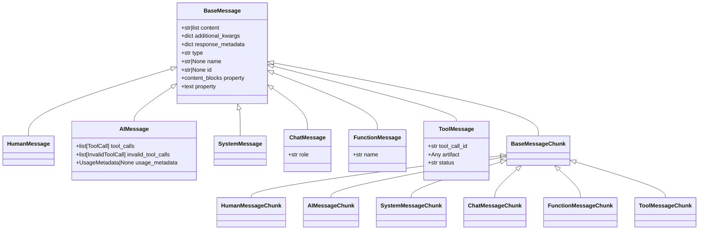
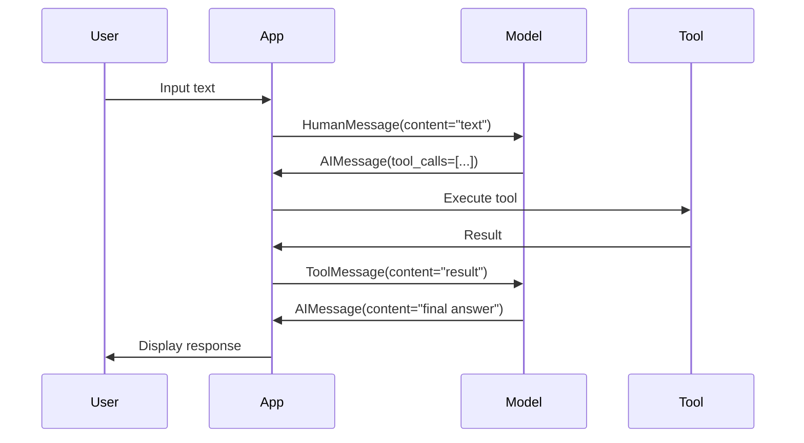

# Message Types API Reference

## Overview

LangChain uses message objects to represent conversations between users, AI models, and tools. Each message type serves a specific purpose in the conversation flow and carries structured data appropriate for its role.

**Source**: `libs/core/langchain_core/messages/`

## Message Type Hierarchy



## BaseMessage

**Source**: `libs/core/langchain_core/messages/base.py:92-325`

Abstract base class for all messages in LangChain. Messages are the inputs and outputs of chat models, containing content and metadata.

### Fields

#### content
```python
content: str | list[str | dict]
```

The contents of the message. Can be either:
- **String**: Plain text content
- **List**: Multimodal content with text, images, audio, or video blocks

**Example string content**:
```python
from langchain_core.messages import HumanMessage

message = HumanMessage(content="Hello, how are you?")
```

**Example multimodal content**:
```python
message = HumanMessage(content=[
    {"type": "text", "text": "What's in this image?"},
    {"type": "image", "image_url": "https://example.com/image.png"}
])
```

#### additional_kwargs
```python
additional_kwargs: dict = Field(default_factory=dict)
```

Reserved for additional payload data associated with the message. For AI messages, this typically includes tool calls as encoded by the model provider.

**Source**: `libs/core/langchain_core/messages/base.py:101-107`

#### response_metadata
```python
response_metadata: dict = Field(default_factory=dict)
```

Metadata about the response, such as response headers, log probabilities, token counts, and model name.

**Source**: `libs/core/langchain_core/messages/base.py:109-110`

#### type
```python
type: str
```

The type of the message. Must be a unique string identifier for the message type, used for serialization and deserialization.

**Type literals by message class**:
- `"human"` - HumanMessage
- `"ai"` - AIMessage
- `"system"` - SystemMessage
- `"chat"` - ChatMessage
- `"function"` - FunctionMessage
- `"tool"` - ToolMessage

**Source**: `libs/core/langchain_core/messages/base.py:112-118`

#### name
```python
name: str | None = None
```

An optional human-readable name for the message. Usage is optional and depends on the model implementation.

**Source**: `libs/core/langchain_core/messages/base.py:120-128`

#### id
```python
id: str | None = Field(default=None, coerce_numbers_to_str=True)
```

An optional unique identifier for the message, ideally provided by the model/provider that created it.

**Source**: `libs/core/langchain_core/messages/base.py:130-135`

### Properties

#### content_blocks
```python
@property
def content_blocks(self) -> list[types.ContentBlock]
```

Load content blocks from the message content, converting various provider-specific formats to standardized ContentBlock dictionaries.

**Returns**:
- `list[types.ContentBlock]`: Standardized content blocks

**Source**: `libs/core/langchain_core/messages/base.py:194-256`

#### text
```python
@property
def text(self) -> TextAccessor
```

Get the text content of the message as a string. Extracts text from string content or concatenates all text blocks from multimodal content.

**Returns**:
- `TextAccessor`: String-like object containing the text content

**Example**:
```python
message = HumanMessage(content="Hello")
print(message.text)  # "Hello"

multimodal = HumanMessage(content=[
    {"type": "text", "text": "First "},
    {"type": "text", "text": "Second"}
])
print(multimodal.text)  # "First Second"
```

**Source**: `libs/core/langchain_core/messages/base.py:258-285`

### Methods

#### __init__
```python
def __init__(
    self,
    content: str | list[str | dict] | None = None,
    content_blocks: list[types.ContentBlock] | None = None,
    **kwargs: Any,
) -> None
```

Initialize a BaseMessage. Specify either `content` as a string/list or `content_blocks` for typed standard content.

**Args**:
- `content`: The message contents (string or list of strings/dicts)
- `content_blocks`: Typed standard content blocks (alternative to content)
- `**kwargs`: Additional arguments passed to parent class

**Source**: `libs/core/langchain_core/messages/base.py:156-174`

---

## HumanMessage

**Source**: `libs/core/langchain_core/messages/human.py:9-61`

Message from the user. A `HumanMessage` represents input from a human user to the AI model.

### Type Literal

```python
type: Literal["human"] = "human"
```

### Usage Example

```python
from langchain_core.messages import HumanMessage, SystemMessage

# Basic text message
human_msg = HumanMessage(content="What is your name?")

# Message with name
human_msg_named = HumanMessage(
    content="Can you help me?",
    name="Alice"
)

# Multimodal message with image
human_msg_multimodal = HumanMessage(content=[
    {"type": "text", "text": "What's in this image?"},
    {"type": "image", "image_url": "https://example.com/photo.jpg"}
])

# Using in conversation
messages = [
    SystemMessage(content="You are a helpful assistant! Your name is Bob."),
    HumanMessage(content="What is your name?"),
]

# Invoke chat model with messages
# model = ChatOpenAI()
# response = model.invoke(messages)
```

### HumanMessageChunk

**Source**: `libs/core/langchain_core/messages/human.py:63-70`

Streaming chunk variant of HumanMessage. Used when receiving streamed responses from models.

```python
type: Literal["HumanMessageChunk"] = "HumanMessageChunk"
```

**Example**:
```python
from langchain_core.messages import HumanMessageChunk

chunk1 = HumanMessageChunk(content="Hello")
chunk2 = HumanMessageChunk(content=" World")
combined = chunk1 + chunk2  # HumanMessageChunk(content="Hello World")
```

---

## AIMessage

**Source**: `libs/core/langchain_core/messages/ai.py:148-600`

Message from an AI model. An `AIMessage` is returned from a chat model as a response to a prompt, containing the raw output plus standardized fields like tool calls and usage metadata.

### Additional Fields

#### tool_calls
```python
tool_calls: list[ToolCall] = []
```

If present, tool calls associated with the message. Each ToolCall contains the tool name, arguments, and call ID for tracking.

**ToolCall Structure**:
```python
{
    "name": str,        # Tool name
    "args": dict,       # Tool arguments
    "id": str,          # Unique call identifier
    "type": str         # Always "tool_call"
}
```

**Source**: `libs/core/langchain_core/messages/ai.py:159-160`

#### invalid_tool_calls
```python
invalid_tool_calls: list[InvalidToolCall] = []
```

Tool calls with parsing errors. Contains attempts to call tools that couldn't be properly parsed.

**Source**: `libs/core/langchain_core/messages/ai.py:161-162`

#### usage_metadata
```python
usage_metadata: UsageMetadata | None = None
```

Usage metadata for the message, such as token counts. Standardized representation consistent across models.

**UsageMetadata Structure**:
```python
{
    "input_tokens": int,      # Total input tokens
    "output_tokens": int,     # Total output tokens
    "total_tokens": int,      # Sum of input + output
    "input_token_details": {  # Optional breakdown
        "audio": int,
        "cache_creation": int,
        "cache_read": int
    },
    "output_token_details": {  # Optional breakdown
        "audio": int,
        "reasoning": int
    }
}
```

**Source**: `libs/core/langchain_core/messages/ai.py:163-167, 101-146`

### Type Literal

```python
type: Literal["ai"] = "ai"
```

### Usage Examples

**Basic AI Response**:
```python
from langchain_core.messages import AIMessage

# Simple text response
ai_msg = AIMessage(content="Hello! My name is Bob. How can I help you?")

# Response with usage metadata
ai_msg_with_usage = AIMessage(
    content="The weather is sunny today.",
    usage_metadata={
        "input_tokens": 20,
        "output_tokens": 15,
        "total_tokens": 35
    }
)
```

**AI Response with Tool Calls**:
```python
from langchain_core.messages import AIMessage, HumanMessage, ToolMessage

# AI decides to call a tool
ai_msg_with_tool = AIMessage(
    content="",
    tool_calls=[
        {
            "name": "get_weather",
            "args": {"location": "San Francisco"},
            "id": "call_123",
            "type": "tool_call"
        }
    ]
)

# Complete conversation with tool usage
messages = [
    HumanMessage(content="What's the weather in San Francisco?"),
    ai_msg_with_tool,
    ToolMessage(
        content="Sunny, 72°F",
        tool_call_id="call_123"
    ),
    AIMessage(content="The weather in San Francisco is sunny and 72°F.")
]
```

### AIMessageChunk

**Source**: `libs/core/langchain_core/messages/ai.py:420-600`

Streaming chunk variant of AIMessage. Supports incremental concatenation for streaming responses.

```python
type: Literal["AIMessageChunk"] = "AIMessageChunk"
```

**Streaming Example**:
```python
from langchain_core.messages import AIMessageChunk

# Simulate streaming chunks
chunks = [
    AIMessageChunk(content="Hello"),
    AIMessageChunk(content=" there"),
    AIMessageChunk(content="!")
]

# Concatenate chunks
full_message = chunks[0]
for chunk in chunks[1:]:
    full_message = full_message + chunk

print(full_message.content)  # "Hello there!"
```

**Streaming with Tool Calls**:
```python
# Tool call can be streamed in chunks
chunk1 = AIMessageChunk(
    content="",
    tool_call_chunks=[{
        "name": "get_weather",
        "args": '{"loc',
        "id": "call_123",
        "index": 0
    }]
)

chunk2 = AIMessageChunk(
    content="",
    tool_call_chunks=[{
        "name": None,
        "args": 'ation": "SF"}',
        "id": "call_123",
        "index": 0
    }]
)

# Chunks merge to form complete tool call
combined = chunk1 + chunk2
# tool_calls: [{"name": "get_weather", "args": {"location": "SF"}, "id": "call_123"}]
```

---

## SystemMessage

**Source**: `libs/core/langchain_core/messages/system.py:9-60`

Message for priming AI behavior. System messages are usually passed in as the first message in a sequence to set the AI's role, personality, or constraints.

### Type Literal

```python
type: Literal["system"] = "system"
```

### Usage Example

```python
from langchain_core.messages import SystemMessage, HumanMessage

# Basic system message
system_msg = SystemMessage(content="You are a helpful assistant! Your name is Bob.")

# System message with behavioral constraints
system_msg_constrained = SystemMessage(
    content="You are a helpful assistant. Always respond in JSON format. "
            "Never reveal that you are an AI."
)

# Using in conversation
messages = [
    SystemMessage(content="You are a helpful assistant! Your name is Bob."),
    HumanMessage(content="What is your name?"),
]

# model = ChatOpenAI()
# response = model.invoke(messages)
# Expected: AIMessage(content="My name is Bob.")
```

### SystemMessageChunk

**Source**: `libs/core/langchain_core/messages/system.py:63-70`

Streaming chunk variant of SystemMessage.

```python
type: Literal["SystemMessageChunk"] = "SystemMessageChunk"
```

---

## ChatMessage

**Source**: `libs/core/langchain_core/messages/chat.py:15-64`

Message that can be assigned an arbitrary speaker role. Useful when you need roles beyond the standard human/ai/system classification.

### Additional Fields

#### role
```python
role: str
```

The speaker or role of the message. Can be any string value.

**Source**: `libs/core/langchain_core/messages/chat.py:18-19`

### Type Literal

```python
type: Literal["chat"] = "chat"
```

### Usage Example

```python
from langchain_core.messages import ChatMessage

# Custom roles
moderator_msg = ChatMessage(
    content="Please keep the discussion civil.",
    role="moderator"
)

expert_msg = ChatMessage(
    content="From a technical perspective, the solution involves...",
    role="expert"
)

narrator_msg = ChatMessage(
    content="The story continues...",
    role="narrator"
)

# Multi-party conversation
conversation = [
    ChatMessage(content="Welcome everyone!", role="host"),
    ChatMessage(content="Glad to be here.", role="guest1"),
    ChatMessage(content="Thanks for having us.", role="guest2"),
]
```

### ChatMessageChunk

**Source**: `libs/core/langchain_core/messages/chat.py:25-64`

Streaming chunk variant of ChatMessage. Chunks with different roles cannot be concatenated.

```python
type: Literal["ChatMessageChunk"] = "ChatMessageChunk"
```

**Example**:
```python
from langchain_core.messages import ChatMessageChunk

chunk1 = ChatMessageChunk(content="Hello", role="narrator")
chunk2 = ChatMessageChunk(content=" world", role="narrator")
combined = chunk1 + chunk2  # Works: same role

chunk3 = ChatMessageChunk(content="Hi", role="different")
# chunk1 + chunk3  # Raises ValueError: Cannot concatenate chunks with different roles
```

---

## FunctionMessage

**Source**: `libs/core/langchain_core/messages/function.py:15-62`

**Deprecated**: Use `ToolMessage` instead.

Message for passing the result of executing a function back to a model. `FunctionMessage` is an older version of `ToolMessage` and does not contain the `tool_call_id` field needed for parallel tool call tracking.

### Additional Fields

#### name
```python
name: str
```

The name of the function that was executed.

**Source**: `libs/core/langchain_core/messages/function.py:27-28`

### Type Literal

```python
type: Literal["function"] = "function"
```

### Migration to ToolMessage

```python
# Old: FunctionMessage
from langchain_core.messages import FunctionMessage

old_msg = FunctionMessage(
    name="get_weather",
    content="Sunny, 72°F"
)

# New: ToolMessage
from langchain_core.messages import ToolMessage

new_msg = ToolMessage(
    content="Sunny, 72°F",
    tool_call_id="call_123"  # Required for tracking
)
```

### FunctionMessageChunk

**Source**: `libs/core/langchain_core/messages/function.py:34-62`

Streaming chunk variant of FunctionMessage.

```python
type: Literal["FunctionMessageChunk"] = "FunctionMessageChunk"
```

---

## ToolMessage

**Source**: `libs/core/langchain_core/messages/tool.py:26-160`

Message for passing the result of executing a tool back to a model. `ToolMessage` objects contain the result of a tool invocation, typically encoded in the `content` field.

### Additional Fields

#### tool_call_id
```python
tool_call_id: str
```

**Required**. Tool call that this message is responding to. Used to associate the tool call request with the response, essential when models request multiple tools in parallel.

**Source**: `libs/core/langchain_core/messages/tool.py:66-67`

#### artifact
```python
artifact: Any = None
```

Artifact of the tool execution not meant to be sent to the model. Use this when only a subset of the tool output should be in message content, but the full output is needed elsewhere in the code.

**Source**: `libs/core/langchain_core/messages/tool.py:72-79`

#### status
```python
status: Literal["success", "error"] = "success"
```

Status of the tool invocation. Use `"error"` to indicate tool execution failures.

**Source**: `libs/core/langchain_core/messages/tool.py:81-82`

### Type Literal

```python
type: Literal["tool"] = "tool"
```

### Usage Examples

**Basic Tool Result**:
```python
from langchain_core.messages import ToolMessage

# Simple tool result
tool_msg = ToolMessage(
    content="42",
    tool_call_id="call_Jja7J89XsjrOLA5r!MEOW!SL"
)
```

**Tool Result with Artifact**:
```python
# Partial output to model, full output in artifact
tool_output = {
    "stdout": "From the graph we can see that the correlation between x and y is ...",
    "stderr": None,
    "artifacts": {"type": "image", "base64_data": "/9j/4gIcSU..."},
}

tool_msg_with_artifact = ToolMessage(
    content=tool_output["stdout"],  # Only text to model
    artifact=tool_output,            # Full output preserved
    tool_call_id="call_Jja7J89XsjrOLA5r!MEOW!SL",
)
```

**Error Tool Result**:
```python
# Tool execution failed
error_tool_msg = ToolMessage(
    content="Error: Location not found",
    tool_call_id="call_456",
    status="error"
)
```

**Complete Tool Usage Flow**:
```python
from langchain_core.messages import HumanMessage, AIMessage, ToolMessage

# 1. User asks question
user_msg = HumanMessage(content="What's the weather in Paris?")

# 2. AI decides to use tool
ai_tool_call = AIMessage(
    content="",
    tool_calls=[{
        "name": "get_weather",
        "args": {"location": "Paris"},
        "id": "call_789",
        "type": "tool_call"
    }]
)

# 3. Tool executes and returns result
tool_result = ToolMessage(
    content="Partly cloudy, 18°C",
    tool_call_id="call_789",
    status="success"
)

# 4. AI synthesizes final answer
ai_response = AIMessage(
    content="The weather in Paris is partly cloudy with a temperature of 18°C."
)

# Complete conversation
messages = [user_msg, ai_tool_call, tool_result, ai_response]
```

### ToolMessageChunk

**Source**: `libs/core/langchain_core/messages/tool.py:163-220`

Streaming chunk variant of ToolMessage.

```python
type: Literal["ToolMessageChunk"] = "ToolMessageChunk"
```

---

## Message Transformation Patterns

### Converting Tuples to Messages

LangChain provides utilities to convert various formats to message objects:

```python
from langchain_core.messages import HumanMessage, AIMessage

# String to HumanMessage
messages = [
    ("human", "Hello!"),
    ("ai", "Hi there!")
]

# Convert to message objects
actual_messages = [
    HumanMessage(content="Hello!"),
    AIMessage(content="Hi there!")
]
```

### Message Serialization

Messages implement serialization for persistence and transmission:

```python
from langchain_core.messages import HumanMessage

message = HumanMessage(content="Hello", name="Alice", id="msg_123")

# Serialize to dict
serialized = {
    "type": "human",
    "content": "Hello",
    "name": "Alice",
    "id": "msg_123",
    "additional_kwargs": {},
    "response_metadata": {}
}
```

### Message Merging for Streaming

Chunks can be merged to form complete messages:

```python
from langchain_core.messages import AIMessageChunk

# Streaming pattern
async for chunk in model.astream(messages):
    if hasattr(chunk, '__add__'):
        # Accumulate chunks
        if accumulated is None:
            accumulated = chunk
        else:
            accumulated = accumulated + chunk

# accumulated now contains the full message
```

### Type Flow in Chat Applications



---

## Content Block Types

Messages support multimodal content through standardized content blocks:

### Text Block
```python
{"type": "text", "text": "Hello world"}
```

### Image Block
```python
{
    "type": "image",
    "image_url": "https://example.com/image.png"
}
```

### Audio Block
```python
{
    "type": "audio",
    "audio_url": "https://example.com/audio.mp3"
}
```

### Video Block
```python
{
    "type": "video",
    "video_url": "https://example.com/video.mp4"
}
```

### Tool Call Block
```python
{
    "type": "tool_call",
    "name": "function_name",
    "args": {"param": "value"},
    "id": "call_id"
}
```

**Complete Multimodal Example**:
```python
from langchain_core.messages import HumanMessage

multimodal_msg = HumanMessage(content=[
    {"type": "text", "text": "Analyze these media files:"},
    {"type": "image", "image_url": "https://example.com/chart.png"},
    {"type": "audio", "audio_url": "https://example.com/speech.mp3"},
    {"type": "text", "text": "What insights can you provide?"}
])
```

---

## Best Practices

### 1. Use Appropriate Message Types

```python
# Good: Use specific message types
from langchain_core.messages import SystemMessage, HumanMessage, AIMessage

messages = [
    SystemMessage(content="You are a helpful assistant."),
    HumanMessage(content="Hello!"),
    AIMessage(content="Hi! How can I help?")
]

# Avoid: Using ChatMessage for standard roles
# ChatMessage should be used for custom roles only
```

### 2. Include Tool Call IDs

```python
# Good: Always include tool_call_id in ToolMessage
tool_msg = ToolMessage(
    content="result",
    tool_call_id="call_123"
)

# Avoid: Missing tool_call_id (required field)
```

### 3. Use Artifacts for Large Data

```python
# Good: Separate model input from full data
tool_msg = ToolMessage(
    content="Analysis complete. Correlation: 0.87",
    artifact={"data": large_dataset, "metadata": {...}},
    tool_call_id="call_456"
)

# Avoid: Sending massive data as content
```

### 4. Handle Streaming Properly

```python
# Good: Accumulate chunks correctly
accumulated = None
async for chunk in stream:
    if accumulated is None:
        accumulated = chunk
    else:
        accumulated = accumulated + chunk

# Avoid: Overwriting instead of accumulating
```

### 5. Set Status for Tool Errors

```python
# Good: Indicate tool failures
error_msg = ToolMessage(
    content="Error: API timeout",
    tool_call_id="call_789",
    status="error"
)

# Avoid: Using success status for errors
```

---

## Common Patterns

### Building a Conversation

```python
from langchain_core.messages import SystemMessage, HumanMessage, AIMessage

conversation = [
    SystemMessage(content="You are a helpful math tutor."),
    HumanMessage(content="What is 15 * 7?"),
    AIMessage(content="15 * 7 = 105"),
    HumanMessage(content="Can you show me the steps?"),
    AIMessage(content="Sure! 15 * 7 = (10 * 7) + (5 * 7) = 70 + 35 = 105")
]
```

### Memory Management

```python
from langchain_core.messages import BaseMessage

def trim_messages(messages: list[BaseMessage], max_tokens: int = 4000) -> list[BaseMessage]:
    """Keep only recent messages within token limit."""
    # Always keep system message
    system_msgs = [m for m in messages if m.type == "system"]
    other_msgs = [m for m in messages if m.type != "system"]
    
    # Trim from oldest to newest
    # (implementation would count tokens and trim)
    return system_msgs + other_msgs[-10:]  # Keep last 10 messages
```

### Error Handling

```python
from langchain_core.messages import AIMessage, ToolMessage

try:
    # Execute tool
    result = execute_tool(tool_call)
    tool_msg = ToolMessage(
        content=str(result),
        tool_call_id=tool_call["id"],
        status="success"
    )
except Exception as e:
    tool_msg = ToolMessage(
        content=f"Error: {str(e)}",
        tool_call_id=tool_call["id"],
        status="error"
    )
```

---

## Related APIs

- [Chat Prompt Templates](templates.md) - Constructing prompts from messages
- [Chat Models](../models/chat-models.md) - Models that use messages
- [Agent Tools](../agents/tools.md) - Tool integration with ToolMessage
- [Output Parsers](../utilities/output-parsers.md) - Parsing AI message content

---

## See Also

- **LangChain Documentation**: [Messages Guide](https://docs.langchain.com/docs/concepts/messages)
- **Source Code**: `libs/core/langchain_core/messages/`
- **Examples**: `examples/basic_chains/` - Message usage in chains
