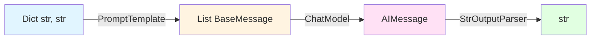
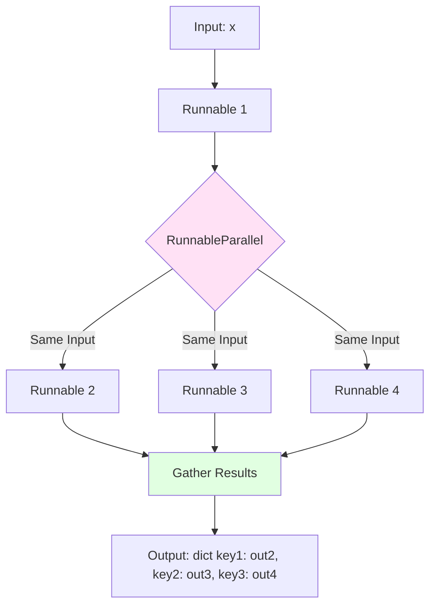
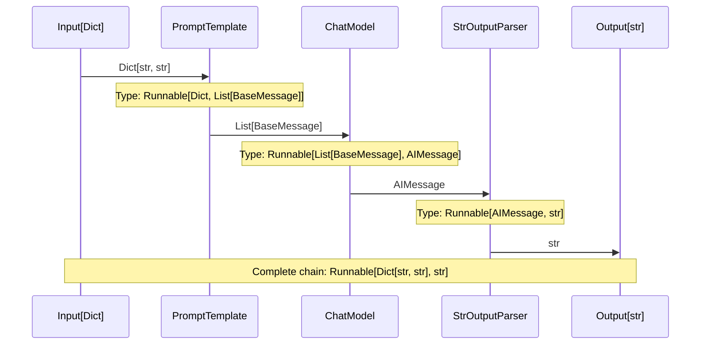
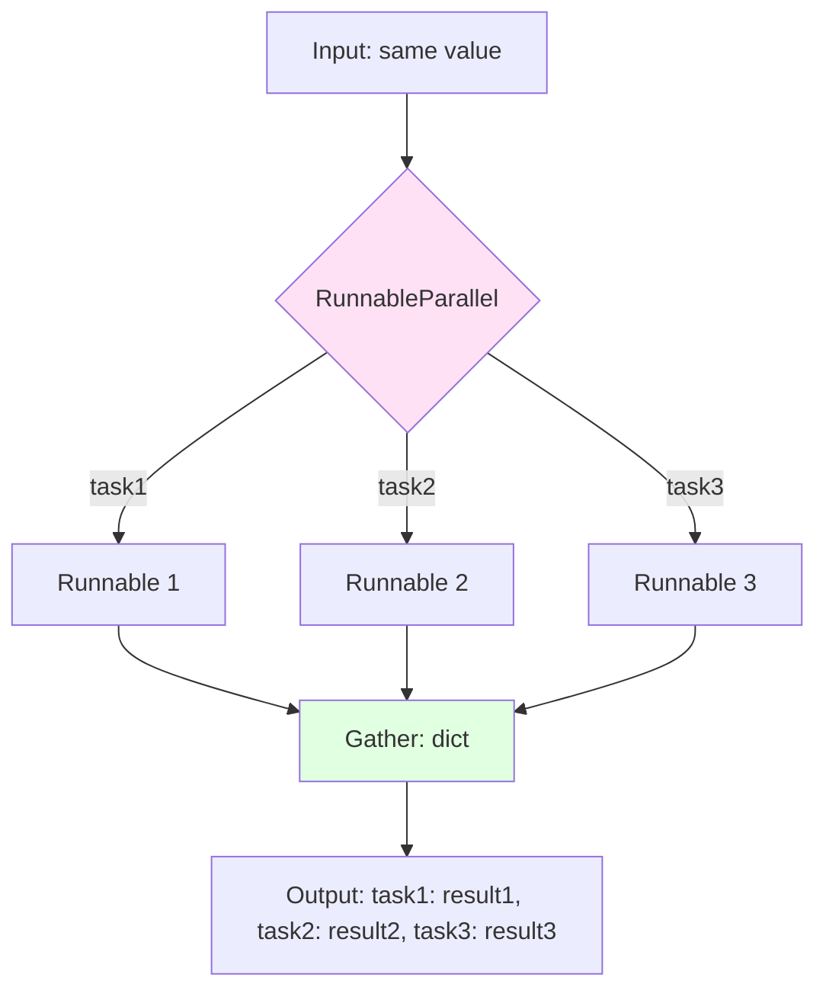

# LCEL Composition API Reference

Comprehensive API reference for LangChain Expression Language (LCEL) composition operators and patterns. This document covers the pipe operator (`|`), sequential composition with `RunnableSequence`, parallel execution with `RunnableParallel`, and helper functions for building complex chains.

**Source**: `libs/core/langchain_core/runnables/base.py:608-627, 629-648, 2753-2850, 3498-3600`

---

## Overview

LCEL composition allows you to declaratively build complex chains by connecting `Runnable` objects using operators and classes that handle type transformations, execution orchestration, and streaming automatically.

### Core Composition Primitives

1. **Sequential Composition** (`|` operator, `RunnableSequence`): Connect runnables where the output of one becomes the input of the next
2. **Parallel Composition** (`RunnableParallel`, dict literals): Execute multiple runnables concurrently with the same input
3. **Coercion Helpers** (`coerce_to_runnable`): Convert callables, dicts, and generators to `Runnable` instances

### Type Safety in Composition

LCEL provides compile-time type checking through generic type parameters:

```python
from typing import TypeVar

Input = TypeVar("Input")
Output = TypeVar("Output")

# Runnable[Input, Output] specifies what types flow through the chain
```

**Type Flow Example**:



When you write `prompt | model | parser`, LCEL automatically validates that:
- The output type of `prompt` matches the input type of `model`
- The output type of `model` matches the input type of `parser`

---

## Sequential Composition

### Pipe Operator (`|`)

**Source**: `libs/core/langchain_core/runnables/base.py:608-627`

The pipe operator (`|`) is the primary way to compose runnables sequentially. It creates a `RunnableSequence` that executes each runnable in order, passing the output of one as the input to the next.

#### Type Signature

```python
def __or__(
    self,
    other: Runnable[Any, Other]
    | Callable[[Iterator[Any]], Iterator[Other]]
    | Callable[[AsyncIterator[Any]], AsyncIterator[Other]]
    | Callable[[Any], Other]
    | Mapping[str, Runnable[Any, Other] | Callable[[Any], Other] | Any],
) -> RunnableSerializable[Input, Other]:
    """Compose this Runnable with another object to create a RunnableSequence.
    
    Args:
        other: Another Runnable or Runnable-like object (callable, dict, generator).
               This will be coerced to a Runnable via coerce_to_runnable().
    
    Returns:
        A RunnableSerializable[Input, Other] that sequences this runnable with other.
        The output type of self becomes the input type of other, and the final
        output type is Other.
    """
```

#### Type Flow Behavior

The pipe operator implements type composition following this rule:

```
Runnable[A, B] | Runnable[B, C] → Runnable[A, C]
```

**Detailed Type Transformation**:

```python
from langchain_core.prompts import PromptTemplate
from langchain_openai import ChatOpenAI
from langchain_core.output_parsers import StrOutputParser

# Stage 1: PromptTemplate is Runnable[Dict[str, Any], List[BaseMessage]]
prompt = PromptTemplate.from_template("Tell me about {topic}")

# Stage 2: ChatOpenAI is Runnable[List[BaseMessage], AIMessage]
model = ChatOpenAI()

# Stage 3: StrOutputParser is Runnable[AIMessage, str]
parser = StrOutputParser()

# Composition: Runnable[Dict[str, Any], str]
chain = prompt | model | parser
#       ^^^^^^   ^^^^^   ^^^^^^
#       [Dict,   [List,  [AI,
#        List]    AI]     str]
#
# Final type: Runnable[Dict[str, Any], str]

# Usage with correct types
result: str = chain.invoke({"topic": "Python"})
```

#### Coercion Behavior

When using the `|` operator, the `other` operand is automatically coerced to a `Runnable` via `coerce_to_runnable()`:

| Input Type | Coerced To | Example |
|------------|------------|---------|
| `Runnable` | Unchanged | `prompt \| model` |
| `Callable[[Input], Output]` | `RunnableLambda` | `prompt \| (lambda x: x.upper())` |
| `dict[str, Runnable]` | `RunnableParallel` | `prompt \| {"a": model1, "b": model2}` |
| Generator function | `RunnableGenerator` | `prompt \| my_generator_func` |

**Source**: `libs/core/langchain_core/runnables/base.py:5970-5994`

#### Examples

**Example 1: Simple Lambda Composition**

```python
from langchain_core.runnables import RunnableLambda

def add_one(x: int) -> int:
    return x + 1

def multiply_by_two(x: int) -> int:
    return x * 2

# Create runnables
runnable_1 = RunnableLambda(add_one)
runnable_2 = RunnableLambda(multiply_by_two)

# Compose with pipe operator
# Type: Runnable[int, int]
sequence = runnable_1 | runnable_2

# Execute
result = sequence.invoke(5)  # (5 + 1) * 2 = 12
print(result)  # Output: 12
```

**Example 2: Complex LLM Chain with Type Annotations**

```python
from langchain_core.prompts import ChatPromptTemplate
from langchain_openai import ChatOpenAI
from langchain_core.output_parsers import StrOutputParser
from typing import Dict

# Stage 1: Dict[str, str] → List[BaseMessage]
prompt = ChatPromptTemplate.from_messages([
    ("system", "You are a helpful assistant."),
    ("human", "{question}")
])

# Stage 2: List[BaseMessage] → AIMessage
model = ChatOpenAI(temperature=0)

# Stage 3: AIMessage → str
parser = StrOutputParser()

# Full chain: Dict[str, str] → str
chain = prompt | model | parser

# Type-safe invocation
input_data: Dict[str, str] = {"question": "What is LCEL?"}
response: str = chain.invoke(input_data)
```

**Example 3: Mixed Composition with Callables**

```python
from langchain_core.prompts import PromptTemplate
from langchain_openai import ChatOpenAI

# Runnable → Callable (auto-coerced to RunnableLambda)
chain = (
    PromptTemplate.from_template("Summarize: {text}")
    | ChatOpenAI()
    | (lambda msg: msg.content.upper())  # Callable automatically wrapped
)

result = chain.invoke({"text": "LangChain is a framework for LLMs"})
# Result is uppercase string
```

### Reverse Pipe Operator (`__ror__`)

**Source**: `libs/core/langchain_core/runnables/base.py:629-648`

The reverse pipe operator enables natural left-to-right composition when the left operand is not a `Runnable` but can be coerced to one.

#### Type Signature

```python
def __ror__(
    self,
    other: Runnable[Other, Any]
    | Callable[[Iterator[Other]], Iterator[Any]]
    | Callable[[AsyncIterator[Other]], AsyncIterator[Any]]
    | Callable[[Other], Any]
    | Mapping[str, Runnable[Other, Any] | Callable[[Other], Any] | Any],
) -> RunnableSerializable[Other, Output]:
    """Compose another object with this Runnable to create a RunnableSequence.
    
    Args:
        other: Another Runnable or Runnable-like object that will execute first.
    
    Returns:
        A RunnableSerializable[Other, Output] where other executes first, then self.
    """
```

#### Usage

The `__ror__` method is invoked when a non-Runnable appears on the left side of the `|` operator:

```python
from langchain_core.runnables import RunnableLambda

def preprocess(x: str) -> str:
    return x.strip().lower()

runnable = RunnableLambda(lambda x: x + "!")

# This triggers __ror__ on runnable because preprocess is not a Runnable
chain = preprocess | runnable
# Equivalent to: RunnableSequence(RunnableLambda(preprocess), runnable)

result = chain.invoke("  Hello  ")  # "hello!"
```

### pipe() Method

**Source**: `libs/core/langchain_core/runnables/base.py:650-697`

The `.pipe()` method provides an explicit, method-chaining alternative to the `|` operator.

#### Type Signature

```python
def pipe(
    self,
    *others: Runnable[Any, Other] | Callable[[Any], Other],
    name: str | None = None,
) -> RunnableSerializable[Input, Other]:
    """Pipe Runnable objects sequentially.
    
    Args:
        *others: One or more Runnable or callable objects to compose.
        name: Optional name for the resulting RunnableSequence.
    
    Returns:
        A RunnableSerializable that sequences self with others.
    """
```

#### Usage

```python
from langchain_core.runnables import RunnableLambda

runnable_1 = RunnableLambda(lambda x: x + 1)
runnable_2 = RunnableLambda(lambda x: x * 2)
runnable_3 = RunnableLambda(lambda x: x - 3)

# Using pipe() method
sequence = runnable_1.pipe(runnable_2, runnable_3, name="my_sequence")

# Equivalent to:
# sequence = runnable_1 | runnable_2 | runnable_3
# Or: sequence = RunnableSequence(runnable_1, runnable_2, runnable_3, name="my_sequence")

result = sequence.invoke(5)  # ((5 + 1) * 2) - 3 = 9
```

---

## RunnableSequence

**Source**: `libs/core/langchain_core/runnables/base.py:2753-2850`

`RunnableSequence` is the explicit class representation of sequential composition created by the `|` operator. It executes a series of runnables in order, passing the output of each as the input to the next.

### Class Definition

```python
class RunnableSequence(RunnableSerializable[Input, Output]):
    """Sequence of Runnable objects where output of one is input of the next.
    
    RunnableSequence is the most important composition operator in LangChain
    as it is used in virtually every chain.
    
    Attributes:
        first: The first Runnable in the sequence (type: Runnable[Input, Any])
        middle: List of middle Runnables (type: list[Runnable[Any, Any]])
        last: The last Runnable in the sequence (type: Runnable[Any, Output])
    """
```

### Type Parameters

The sequence preserves type information through three attributes:

- **`first: Runnable[Input, Any]`**: Defines the input type for the entire sequence
- **`middle: list[Runnable[Any, Any]]`**: Intermediate transformations
- **`last: Runnable[Any, Output]`**: Defines the output type for the entire sequence

This structure allows type checkers to validate the input and output types while treating intermediate types as `Any`.

### Constructor

```python
def __init__(
    self,
    *steps: RunnableLike,
    name: str | None = None,
) -> None:
    """Create a RunnableSequence.
    
    Args:
        *steps: Two or more Runnable or Runnable-like objects to sequence.
        name: Optional name for the sequence.
    
    Raises:
        ValueError: If fewer than 2 steps are provided.
    """
```

### Execution Behavior

**Sequential Processing**: Each runnable executes completely before the next begins

```python
# Given: runnable_1 | runnable_2 | runnable_3
# Execution order:
# 1. input → runnable_1 → intermediate_1
# 2. intermediate_1 → runnable_2 → intermediate_2
# 3. intermediate_2 → runnable_3 → output
```

**Batch Processing**: `batch()` and `abatch()` use threadpools and `asyncio.gather()` for efficient parallel batch execution

```python
sequence = prompt | model | parser

# Batching processes each input through the full sequence
results = sequence.batch([
    {"topic": "Python"},
    {"topic": "Rust"},
    {"topic": "Go"}
])
# Each input flows through: prompt → model → parser
# Parallelized at each stage for all inputs
```

**Streaming**: If all components implement `transform()`, streaming works end-to-end. Otherwise, streaming begins after the last blocking component.

```python
# All components support streaming
chain = prompt | ChatOpenAI() | StrOutputParser()

for chunk in chain.stream({"topic": "AI"}):
    print(chunk, end="", flush=True)
# Output streams token-by-token through entire chain
```

### Examples

**Example 1: Explicit RunnableSequence Construction**

```python
from langchain_core.runnables import RunnableSequence, RunnableLambda

def add_one(x: int) -> int:
    return x + 1

def mul_two(x: int) -> int:
    return x * 2

runnable_1 = RunnableLambda(add_one)
runnable_2 = RunnableLambda(mul_two)

# Explicit construction
sequence = RunnableSequence(runnable_1, runnable_2)

# Equivalent to:
# sequence = runnable_1 | runnable_2

result = sequence.invoke(5)  # (5 + 1) * 2 = 12
batch_results = sequence.batch([1, 2, 3])  # [4, 6, 8]
```

**Example 2: LLM Chain with Streaming**

```python
from langchain_core.prompts import PromptTemplate, ChatPromptTemplate
from langchain_core.output_parsers.json import SimpleJsonOutputParser
from langchain_openai import ChatOpenAI

prompt = ChatPromptTemplate.from_template(
    "In JSON format, give me a list of {topic} and their "
    "corresponding names in French, Spanish and in a Cat Language."
)

model = ChatOpenAI()
chain = prompt | model | SimpleJsonOutputParser()

# Streaming JSON output
async for chunk in chain.astream({"topic": "colors"}):
    print(chunk, sep="", flush=True)
```

### Performance Characteristics

| Operation | Behavior | Performance Notes |
|-----------|----------|-------------------|
| `invoke()` | Sequential execution | Blocking, single input |
| `ainvoke()` | Sequential async execution | Non-blocking, single input |
| `batch()` | Parallel batch processing | Uses threadpool, IO-bound optimization |
| `abatch()` | Async parallel batch | Uses `asyncio.gather()`, highly efficient |
| `stream()` | Streaming if all support `transform()` | End-to-end streaming when possible |
| `astream()` | Async streaming | Lowest latency for token-by-token output |

### Streaming Limitations

**Important**: `RunnableLambda` does not support `transform()` by default. If you place a `RunnableLambda` in a sequence, streaming will be blocked until that component completes.

**Solution**: For custom logic with streaming support, subclass `Runnable` and implement the `transform()` method.

```python
from langchain_core.runnables import Runnable
from typing import Iterator

class StreamingUpperCase(Runnable[str, str]):
    def invoke(self, input: str) -> str:
        return input.upper()
    
    def transform(self, input: Iterator[str]) -> Iterator[str]:
        for chunk in input:
            yield chunk.upper()

# This chain can stream end-to-end
chain = prompt | model | parser | StreamingUpperCase()
```

---

## Parallel Composition

### RunnableParallel

**Source**: `libs/core/langchain_core/runnables/base.py:3498-3600`

`RunnableParallel` executes multiple runnables concurrently, providing the same input to each, and returns a dictionary mapping keys to outputs.

### Class Definition

```python
class RunnableParallel(RunnableSerializable[Input, dict[str, Any]]):
    """Runnable that runs a mapping of Runnables in parallel.
    
    RunnableParallel is one of the two main composition primitives for LCEL,
    alongside RunnableSequence. It invokes Runnables concurrently, providing
    the same input to each.
    
    Attributes:
        steps__: Mapping of string keys to Runnable objects.
    """
```

### Type Signature

```python
steps__: Mapping[str, Runnable[Input, Any]]
```

**Output Type**: Always `dict[str, Any]` where keys match the input mapping keys and values are the outputs from each runnable.

### Constructor

```python
def __init__(
    self,
    steps__: Mapping[
        str,
        Runnable[Input, Any]
        | Callable[[Input], Any]
        | Mapping[str, Runnable[Input, Any] | Callable[[Input], Any]],
    ]
    | None = None,
    **kwargs: Runnable[Input, Any]
    | Callable[[Input], Any]
    | Mapping[str, Runnable[Input, Any] | Callable[[Input], Any]],
) -> None:
    """Create a RunnableParallel.
    
    Args:
        steps__: Mapping of keys to runnables. If provided, kwargs are ignored.
        **kwargs: Alternative way to specify steps as keyword arguments.
    """
```

### Usage Patterns

**Pattern 1: Dict Literal in LCEL Chain (Most Common)**

```python
from langchain_core.runnables import RunnableLambda

def add_one(x: int) -> int:
    return x + 1

def mul_two(x: int) -> int:
    return x * 2

def mul_three(x: int) -> int:
    return x * 3

runnable_1 = RunnableLambda(add_one)
runnable_2 = RunnableLambda(mul_two)
runnable_3 = RunnableLambda(mul_three)

# Dict literal is automatically coerced to RunnableParallel
sequence = runnable_1 | {
    "mul_two": runnable_2,
    "mul_three": runnable_3,
}

result = sequence.invoke(1)
# Step 1: 1 → add_one → 2
# Step 2: 2 is sent to BOTH runnable_2 and runnable_3 in parallel
# Output: {"mul_two": 4, "mul_three": 6}
```

**Pattern 2: Explicit RunnableParallel with Dict**

```python
from langchain_core.runnables import RunnableParallel, RunnableLambda

sequence = runnable_1 | RunnableParallel({
    "mul_two": runnable_2,
    "mul_three": runnable_3,
})

# Equivalent to pattern 1
```

**Pattern 3: RunnableParallel with Keyword Arguments**

```python
sequence = runnable_1 | RunnableParallel(
    mul_two=runnable_2,
    mul_three=runnable_3,
)

# Equivalent to patterns 1 and 2
```

### Execution Flow



**Key Characteristics**:
1. **Same Input**: All runnables receive identical input
2. **Concurrent Execution**: Runnables execute in parallel (asyncio for async, threadpool for sync)
3. **Dict Output**: Results are gathered into a dictionary with the same keys

### Examples

**Example 1: Simple Parallel Processing**

```python
from langchain_core.runnables import RunnableLambda

def add_one(x: int) -> int:
    return x + 1

def mul_two(x: int) -> int:
    return x * 2

def mul_three(x: int) -> int:
    return x * 3

runnable_1 = RunnableLambda(add_one)
runnable_2 = RunnableLambda(mul_two)
runnable_3 = RunnableLambda(mul_three)

# Parallel execution
sequence = runnable_1 | {
    "mul_two": runnable_2,
    "mul_three": runnable_3,
}

result = sequence.invoke(1)
print(result)
# Output: {"mul_two": 4, "mul_three": 6}

batch_result = sequence.batch([1, 2, 3])
print(batch_result)
# Output: [
#     {"mul_two": 4, "mul_three": 6},
#     {"mul_two": 6, "mul_three": 9},
#     {"mul_two": 8, "mul_three": 12}
# ]
```

**Example 2: Parallel LLM Chains**

```python
from langchain_core.prompts import ChatPromptTemplate
from langchain_core.runnables import RunnableParallel
from langchain_openai import ChatOpenAI

model = ChatOpenAI()

joke_chain = (
    ChatPromptTemplate.from_template("Tell me a joke about {topic}")
    | model
)
poem_chain = (
    ChatPromptTemplate.from_template("Write a 2-line poem about {topic}")
    | model
)

# Parallel execution of two LLM chains
runnable = RunnableParallel(joke=joke_chain, poem=poem_chain)

# Both chains receive {"topic": "bears"} simultaneously
result = runnable.invoke({"topic": "bears"})
print(result)
# Output: {
#     "joke": AIMessage(content="Why do bears have hairy coats? ..."),
#     "poem": AIMessage(content="In forests deep where shadows play...")
# }
```

**Example 3: Streaming Parallel Output**

```python
from langchain_core.prompts import ChatPromptTemplate
from langchain_core.runnables import RunnableParallel
from langchain_openai import ChatOpenAI

model = ChatOpenAI()
joke_chain = (
    ChatPromptTemplate.from_template("tell me a joke about {topic}") | model
)
poem_chain = (
    ChatPromptTemplate.from_template("write a 2-line poem about {topic}") | model
)

runnable = RunnableParallel(joke=joke_chain, poem=poem_chain)

# Stream output from both chains simultaneously
output = {key: "" for key in runnable.output_schema()}
for chunk in runnable.stream({"topic": "bear"}):
    for key in chunk:
        output[key] = output[key] + chunk[key].content
    print(output)  # Progressively updated with chunks from both chains
```

### Performance Characteristics

| Operation | Behavior | Concurrency Mechanism |
|-----------|----------|----------------------|
| `invoke()` | Parallel execution | ThreadPoolExecutor for sync runnables |
| `ainvoke()` | Async parallel execution | `asyncio.gather()` for true concurrency |
| `batch()` | Batching with parallelization | Per-input parallel execution, batched across inputs |
| `stream()` | Streaming parallel output | Chunks interleaved from all runnables |

**Performance Note**: `ainvoke()` with `RunnableParallel` provides true concurrent execution for async runnables (e.g., multiple API calls), significantly reducing total latency compared to sequential execution.

---

## Composition Helper Functions

### coerce_to_runnable()

**Source**: `libs/core/langchain_core/runnables/base.py:5970-5994`

Converts Runnable-like objects to proper `Runnable` instances. This function is called automatically by the `|` operator and composition methods.

#### Type Signature

```python
def coerce_to_runnable(thing: RunnableLike) -> Runnable[Input, Output]:
    """Coerce a Runnable-like object into a Runnable.
    
    Args:
        thing: A Runnable-like object (Runnable, callable, dict, or generator).
    
    Returns:
        A Runnable instance.
    
    Raises:
        TypeError: If the object cannot be coerced to a Runnable.
    """
```

#### Coercion Rules

| Input Type | Output Type | Behavior |
|------------|-------------|----------|
| `Runnable` | Unchanged | Returns the input as-is |
| `Callable[[Input], Output]` | `RunnableLambda` | Wraps function in RunnableLambda |
| `dict[str, Runnable \| Callable]` | `RunnableParallel` | Creates parallel execution mapping |
| Generator function | `RunnableGenerator` | Wraps generator for streaming |
| Other types | Raises `TypeError` | Unsupported type |

#### Example

```python
from langchain_core.runnables.base import coerce_to_runnable

# Callable coercion
def uppercase(s: str) -> str:
    return s.upper()

runnable = coerce_to_runnable(uppercase)
print(type(runnable))  # <class 'RunnableLambda'>
print(runnable.invoke("hello"))  # "HELLO"

# Dict coercion
parallel = coerce_to_runnable({
    "upper": uppercase,
    "lower": lambda s: s.lower(),
})
print(type(parallel))  # <class 'RunnableParallel'>
print(parallel.invoke("HeLLo"))  # {"upper": "HELLO", "lower": "hello"}
```

---

## Complex Composition Patterns

### Pattern 1: Sequential → Parallel → Sequential

Combine sequential and parallel composition for complex workflows:

```python
from langchain_core.prompts import ChatPromptTemplate
from langchain_openai import ChatOpenAI
from langchain_core.output_parsers import StrOutputParser

model = ChatOpenAI()
parser = StrOutputParser()

# Stage 1: Sequential (input → formatted prompt)
prompt = ChatPromptTemplate.from_template("Analyze: {text}")

# Stage 2: Parallel (send to two different specialized analyzers)
sentiment_chain = ChatPromptTemplate.from_template(
    "What is the sentiment of: {text}"
) | model | parser

topics_chain = ChatPromptTemplate.from_template(
    "What are the main topics in: {text}"
) | model | parser

# Stage 3: Sequential (summarize both analyses)
summarize_chain = ChatPromptTemplate.from_template(
    "Summarize these analyses:\nSentiment: {sentiment}\nTopics: {topics}"
) | model | parser

# Full composition: Sequential → Parallel → Sequential
full_chain = prompt | {
    "sentiment": sentiment_chain,
    "topics": topics_chain,
} | summarize_chain

result = full_chain.invoke({"text": "LangChain makes building LLM apps easy!"})
```

### Pattern 2: Conditional Branching with RunnableBranch

Use `RunnableBranch` for conditional logic in compositions:

```python
from langchain_core.runnables import RunnableBranch, RunnableLambda

def is_long(text: str) -> bool:
    return len(text) > 100

summarize = RunnableLambda(lambda x: x[:50] + "...")
passthrough = RunnableLambda(lambda x: x)

# Conditional chain
chain = prompt | model | parser | RunnableBranch(
    (is_long, summarize),    # If condition is true, use this runnable
    passthrough,             # Default runnable
)
```

### Pattern 3: Nested Parallel Execution

Create hierarchical parallel structures:

```python
from langchain_core.prompts import ChatPromptTemplate
from langchain_openai import ChatOpenAI

model = ChatOpenAI()

# Nested parallel: Outer parallel contains inner parallel structures
chain = prompt | {
    "creative": {
        "poem": ChatPromptTemplate.from_template("Write a poem about {topic}") | model,
        "story": ChatPromptTemplate.from_template("Write a story about {topic}") | model,
    },
    "analytical": {
        "facts": ChatPromptTemplate.from_template("List facts about {topic}") | model,
        "analysis": ChatPromptTemplate.from_template("Analyze {topic}") | model,
    },
}

result = chain.invoke({"topic": "ocean"})
# Output structure:
# {
#     "creative": {
#         "poem": AIMessage(...),
#         "story": AIMessage(...)
#     },
#     "analytical": {
#         "facts": AIMessage(...),
#         "analysis": AIMessage(...)
#     }
# }
```

---

## Type Flow Diagrams

### Sequential Composition Type Flow



### Parallel Composition Execution Flow



---

## Troubleshooting

### Type Mismatch Errors

**Problem**: Type error when composing runnables with incompatible input/output types.

**Symptoms**:
```python
chain = prompt | parser | model  # Wrong order!
# TypeError: StrOutputParser output (str) doesn't match ChatModel input (List[BaseMessage])
```

**Solution**: Ensure the output type of each runnable matches the input type of the next:

```python
# Correct order
chain = prompt | model | parser
#       Dict→List  List→AI  AI→str
```

**Debugging Tip**: Inspect the schemas of each runnable:

```python
print(prompt.output_schema())  # Shows: List[BaseMessage]
print(model.input_schema())    # Shows: List[BaseMessage] ✓
print(model.output_schema())   # Shows: AIMessage
print(parser.input_schema())   # Shows: AIMessage ✓
```

### Streaming Not Working

**Problem**: Chain doesn't stream output despite calling `.stream()`.

**Cause**: One or more runnables in the sequence don't implement `transform()` method.

**Solution 1**: Check if `RunnableLambda` is blocking streaming:

```python
# This blocks streaming
chain = prompt | model | RunnableLambda(lambda x: x.content.upper()) | parser

# Solution: Use streaming-compatible parsers or custom Runnables
chain = prompt | model | parser  # All support streaming
```

**Solution 2**: Implement custom `Runnable` with `transform()` for custom logic:

```python
from langchain_core.runnables import Runnable
from typing import Iterator

class StreamingProcessor(Runnable[str, str]):
    def transform(self, input: Iterator[str]) -> Iterator[str]:
        for chunk in input:
            yield self.process_chunk(chunk)
    
    def process_chunk(self, chunk: str) -> str:
        return chunk.upper()
```

### Parallel Execution Not Concurrent

**Problem**: `RunnableParallel` isn't executing concurrently.

**Cause**: Using synchronous `invoke()` instead of `ainvoke()` with IO-bound operations.

**Solution**: Use `ainvoke()` for true concurrent execution:

```python
# Synchronous: Limited concurrency (threadpool)
result = parallel_chain.invoke(input_data)

# Asynchronous: True concurrent execution
result = await parallel_chain.ainvoke(input_data)
```

### Dict Coercion Unexpected Behavior

**Problem**: Dict literal in chain creates parallel execution when sequential was intended.

**Example**:
```python
# This creates parallel execution!
chain = prompt | {"formatted": parser}
# Input is sent to parser, output is {"formatted": parsed_result}
```

**Solution**: If you want to add a key to the output, use `RunnablePassthrough.assign()`:

```python
from langchain_core.runnables import RunnablePassthrough

chain = prompt | model | RunnablePassthrough.assign(parsed=parser)
# Preserves model output and adds "parsed" key
```

---

## Summary

### Key Takeaways

1. **Sequential Composition**: Use `|` operator or `RunnableSequence` for step-by-step processing
2. **Type Safety**: LCEL validates type compatibility at composition time
3. **Parallel Composition**: Use dict literals or `RunnableParallel` for concurrent execution
4. **Automatic Coercion**: Callables and dicts are automatically converted to Runnables
5. **Streaming**: All components must support `transform()` for end-to-end streaming
6. **Async Advantage**: Use `ainvoke()` with `RunnableParallel` for true concurrent IO operations

### When to Use Each Pattern

| Pattern | Use When | Example |
|---------|----------|---------|
| `a \| b \| c` | Sequential processing | `prompt \| model \| parser` |
| `a \| {key: b, ...}` | Parallel processing with same input | Multiple analyses of same text |
| `RunnableSequence(...)` | Explicit sequential, need custom name | Building reusable named sequences |
| `RunnableParallel(...)` | Explicit parallel, need custom configuration | Complex parallel workflows |
| `a.pipe(b, c)` | Method chaining style preference | Fluent API pattern |

### Related Documentation

- [Runnable Protocol API Reference](base.md) - Core Runnable interface
- [LCEL Composition Guide](../../guides/lcel-composition.md) - Comprehensive composition guide
- [LCEL Type System Architecture](../../architecture/lcel-type-system.md) - Deep dive into type system
- [Glossary: LCEL](../../glossary.md#lcel-langchain-expression-language) - LCEL definition

---

**Last Updated**: 2024-01-09  
**Maintainer**: LangChain Documentation Team  
**LangChain Version Compatibility**: langchain-core >= 1.0.0

