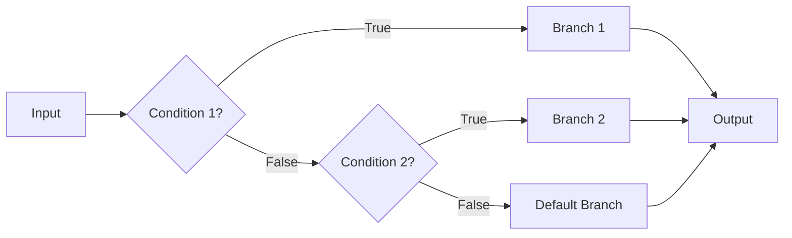
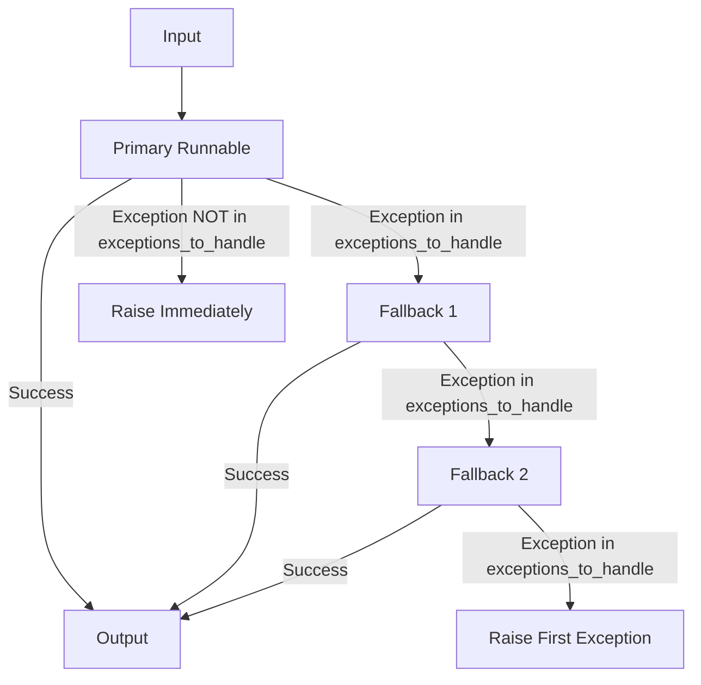
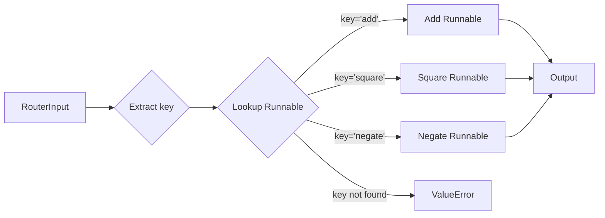

# Runnable Utilities API Reference

Complete API reference for utility Runnable classes that provide specialized behaviors for conditional routing, error recovery, data passthrough, and dynamic routing within LCEL chains.

---

## Overview

Utility Runnables extend the core Runnable protocol with specialized functionality for common composition patterns:

| Utility Class | Purpose | Use Case |
|--------------|---------|----------|
| [RunnableBranch](#runnablebranch) | Conditional routing | Execute different logic based on input conditions |
| [RunnableWithFallbacks](#runnablewithfallbacks) | Error recovery | Retry with alternative implementations when failures occur |
| [RunnablePassthrough](#runnablepassthrough) | Identity passthrough | Pass input unchanged or augment with computed values |
| [RunnableAssign](#runnableassign) | Dictionary augmentation | Add new key-value pairs to dictionary inputs |
| [RunnablePick](#runnablepick) | Key selection | Extract specific keys from dictionary inputs |
| [RouterRunnable](#routerrunnable) | Dynamic routing | Route to different runnables based on explicit routing key |

**Navigation**:
- [Core Runnable API](base.md) - Foundation protocol and base classes
- [Composition Operators](composition.md) - LCEL pipe operators and composition patterns
- [Glossary](../../glossary.md) - Key LangChain concepts and terminology

---

## RunnableBranch

**Source**: `libs/core/langchain_core/runnables/branch.py:40`

A Runnable that selects which branch to execute based on conditional predicates. Evaluates conditions in order and runs the corresponding Runnable for the first condition that returns `True`. If no conditions match, executes the default branch.

### Type Signature

```python
class RunnableBranch(RunnableSerializable[Input, Output]):
    branches: Sequence[tuple[Runnable[Input, bool], Runnable[Input, Output]]]
    default: Runnable[Input, Output]
```

**Generic Parameters**:
- `Input`: Type of input accepted by all condition checks and branch runnables
- `Output`: Type of output produced by all branch runnables (must be consistent)

### Constructor

```python
def __init__(
    self,
    *branches: tuple[
        Runnable[Input, bool] | Callable[[Input], bool] | Callable[[Input], Awaitable[bool]],
        RunnableLike,
    ] | RunnableLike,
) -> None
```

**Parameters**:

- **branches** (`*args`): Variable-length argument list where:
  - All arguments except the last are `(condition, runnable)` tuples:
    - `condition`: A `Runnable`, `Callable`, or async `Callable` that returns `bool`
    - `runnable`: A `RunnableLike` to execute if condition evaluates to `True`
  - The last argument is the default `RunnableLike` executed when no conditions match

**Raises**:
- **ValueError**: If fewer than 2 branches provided
- **TypeError**: If default branch is not `Runnable`, `Callable`, or `Mapping`
- **TypeError**: If a branch is not a tuple or list
- **ValueError**: If a branch tuple/list does not have exactly 2 elements

### Behavior

**Execution Flow**:
1. Evaluates conditions sequentially in the order provided
2. When a condition returns `True`, executes corresponding Runnable and returns output
3. If all conditions return `False`, executes default Runnable
4. Short-circuits on first matching condition (subsequent conditions not evaluated)

**Type Flow**:


### Core Methods

All standard Runnable methods are supported: `invoke()`, `ainvoke()`, `batch()`, `abatch()`, `stream()`, `astream()`.

#### invoke()

**Source**: `libs/core/langchain_core/runnables/branch.py:187`

```python
def invoke(
    self,
    input: Input,
    config: RunnableConfig | None = None,
    **kwargs: Any,
) -> Output
```

**Parameters**:
- **input** (`Input`): The input value to pass to condition checks and selected branch
- **config** (`RunnableConfig | None`): Configuration for callbacks, tags, metadata
- **kwargs** (`Any`): Additional keyword arguments passed to the selected branch

**Returns**: `Output` - Output from the first matching branch or default branch

**Raises**:
- Any exceptions raised by condition evaluation or branch execution

### Examples

**Example 1: Type-Based Routing**

```python
from langchain_core.runnables import RunnableBranch, RunnableLambda

# Define branches with type-checking conditions
branch = RunnableBranch(
    (lambda x: isinstance(x, str), lambda x: x.upper()),
    (lambda x: isinstance(x, int), lambda x: x + 1),
    (lambda x: isinstance(x, float), lambda x: x * 2),
    lambda x: "goodbye",  # default
)

# String input matches first condition
result1 = branch.invoke("hello")
print(result1)  # Output: "HELLO"

# Integer input matches second condition
result2 = branch.invoke(5)
print(result2)  # Output: 6

# List input matches no conditions, uses default
result3 = branch.invoke([1, 2, 3])
print(result3)  # Output: "goodbye"
```

**Example 2: Conditional LLM Chain Routing**

```python
from langchain_core.runnables import RunnableBranch, RunnableLambda
from langchain_core.prompts import ChatPromptTemplate
from langchain_openai import ChatOpenAI

# Different prompts for different input types
technical_prompt = ChatPromptTemplate.from_template(
    "Provide a technical explanation of {topic}"
)
simple_prompt = ChatPromptTemplate.from_template(
    "Explain {topic} in simple terms for beginners"
)

model = ChatOpenAI(model="gpt-3.5-turbo")

# Route based on expertise level in input
branch = RunnableBranch(
    (
        lambda x: x.get("expertise") == "advanced",
        technical_prompt | model
    ),
    (
        lambda x: x.get("expertise") == "beginner",
        simple_prompt | model
    ),
    simple_prompt | model  # default to simple explanation
)

# Advanced user gets technical explanation
result = branch.invoke({
    "topic": "quantum computing",
    "expertise": "advanced"
})
```

**Example 3: Async Condition Evaluation**

```python
import asyncio
from langchain_core.runnables import RunnableBranch

async def check_api_status() -> bool:
    """Async condition check"""
    # Simulate API health check
    await asyncio.sleep(0.1)
    return True

async def primary_api_call(x):
    return f"Primary: {x}"

async def fallback_call(x):
    return f"Fallback: {x}"

# Branch with async condition
branch = RunnableBranch(
    (check_api_status, primary_api_call),
    fallback_call
)

# Use async invocation
result = await branch.ainvoke("test")
```

### Common Use Cases

1. **Input Type Routing**: Direct different data types to specialized handlers
2. **Feature Flagging**: Enable/disable features based on configuration predicates
3. **Conditional Chain Logic**: Execute different LLM chains based on input attributes
4. **Load Balancing**: Route requests based on system state conditions
5. **A/B Testing**: Select different implementations based on experiment conditions

### Performance Considerations

- **Condition Evaluation Cost**: All conditions before the matching one are evaluated sequentially
- **Optimization**: Place most frequently matching conditions first
- **Parallel Conditions**: Not supported; conditions always evaluate sequentially
- **Callback Overhead**: Each condition and branch gets separate callback managers (child tags: `condition:N`, `branch:N`)

---

## RunnableWithFallbacks

**Source**: `libs/core/langchain_core/runnables/fallbacks.py:37`

A Runnable wrapper that provides automatic error recovery by trying fallback implementations when the primary Runnable fails. Essential for building resilient chains that handle API degradation, rate limiting, and transient failures.

### Type Signature

```python
class RunnableWithFallbacks(RunnableSerializable[Input, Output]):
    runnable: Runnable[Input, Output]
    fallbacks: Sequence[Runnable[Input, Output]]
    exceptions_to_handle: tuple[type[BaseException], ...] = (Exception,)
    exception_key: str | None = None
```

**Generic Parameters**:
- `Input`: Type of input accepted by primary and all fallback runnables
- `Output`: Type of output produced by primary and all fallback runnables

### Constructor Parameters

- **runnable** (`Runnable[Input, Output]`): The primary Runnable to execute first
- **fallbacks** (`Sequence[Runnable[Input, Output]]`): Ordered list of fallback Runnables to try on failure
- **exceptions_to_handle** (`tuple[type[BaseException], ...]`): Exception types that trigger fallback attempts. Any exception not in this tuple is re-raised immediately. Default: `(Exception,)`
- **exception_key** (`str | None`): If specified, the exception from the previous attempt is passed to the next fallback under this dictionary key. Requires all runnables to accept dictionary inputs. Default: `None`

### Factory Method

Most commonly instantiated using the `with_fallbacks()` method on any Runnable:

```python
def with_fallbacks(
    self,
    fallbacks: Sequence[Runnable[Input, Output]],
    *,
    exceptions_to_handle: tuple[type[BaseException], ...] = (Exception,),
    exception_key: str | None = None,
) -> RunnableWithFallbacks[Input, Output]
```

### Behavior

**Execution Flow**:
1. Attempts to execute the primary `runnable` with the input
2. If execution succeeds, returns the output immediately
3. If an exception in `exceptions_to_handle` occurs:
   - Attempts the first fallback
   - If fallback succeeds, returns its output
   - If fallback fails, tries the next fallback
   - Continues until a fallback succeeds or all fallbacks exhausted
4. If all fallbacks fail, raises the first exception encountered
5. If an exception NOT in `exceptions_to_handle` occurs, raises immediately without trying fallbacks

**Exception Passing**:
- When `exception_key` is set, each fallback receives the previous exception in the input dictionary
- Useful for fallbacks that need error context to adjust behavior
- Requires input type to be `dict[str, Any]`

**Type Flow with Fallbacks**:


### Core Methods

Supports all standard Runnable methods: `invoke()`, `ainvoke()`, `batch()`, `abatch()`, `stream()`, `astream()`.

#### invoke()

**Source**: `libs/core/langchain_core/runnables/fallbacks.py:164`

```python
def invoke(
    self,
    input: Input,
    config: RunnableConfig | None = None,
    **kwargs: Any,
) -> Output
```

**Parameters**:
- **input** (`Input`): Input to pass to primary and fallback runnables
- **config** (`RunnableConfig | None`): Configuration for execution
- **kwargs** (`Any`): Additional keyword arguments

**Returns**: `Output` - Output from first successful runnable (primary or fallback)

**Raises**:
- First exception encountered if all runnables fail
- Immediate exception if not in `exceptions_to_handle`
- **ValueError**: If `exception_key` is set but input is not a dictionary

### Examples

**Example 1: LLM Provider Fallback**

```python
from langchain_openai import ChatOpenAI
from langchain_anthropic import ChatAnthropic

# Primary model with fallback to alternative provider
primary_model = ChatAnthropic(model="claude-3-haiku-20240307")
fallback_model = ChatOpenAI(model="gpt-3.5-turbo-0125")

# Create model with automatic fallback
model = primary_model.with_fallbacks([fallback_model])

# Will use Claude, but fallback to GPT if Claude is unavailable
response = model.invoke("Tell me a joke about programming")
# Seamlessly handles API downtime or rate limiting
```

**Example 2: Chain-Level Fallback with Hardcoded Response**

```python
from langchain_core.prompts import ChatPromptTemplate
from langchain_core.output_parsers import StrOutputParser
from langchain_core.runnables import RunnableLambda
from langchain_openai import ChatOpenAI

def emergency_response(inputs):
    """Fallback when all LLM providers fail"""
    return (
        "Our AI services are temporarily unavailable. "
        "Please try again in a few moments. 🦜"
    )

# Complete chain with fallback
chain = (
    ChatPromptTemplate.from_template("Tell me a joke about {topic}")
    | ChatOpenAI(model="gpt-3.5-turbo")
    | StrOutputParser()
).with_fallbacks([
    RunnableLambda(emergency_response)
])

# If OpenAI fails, returns friendly error message
result = chain.invoke({"topic": "Python"})
```

**Example 3: Multiple Fallbacks with Exception Filtering**

```python
from langchain_core.runnables import RunnableWithFallbacks
from langchain_openai import ChatOpenAI
import httpx

# Only fallback on specific exceptions (rate limits, timeouts)
model = RunnableWithFallbacks(
    runnable=ChatOpenAI(model="gpt-4", request_timeout=5.0),
    fallbacks=[
        ChatOpenAI(model="gpt-3.5-turbo", request_timeout=5.0),
        ChatOpenAI(model="gpt-3.5-turbo", request_timeout=10.0),  # More timeout
    ],
    exceptions_to_handle=(
        httpx.TimeoutException,
        httpx.HTTPStatusError,
    )
)

# Falls back only on network issues, not on other errors
result = model.invoke("Write a haiku about resilience")
```

**Example 4: Passing Exception Context to Fallbacks**

```python
from langchain_core.runnables import RunnableLambda

def primary_processor(input_dict):
    raise ValueError("Primary service failed")

def fallback_with_context(input_dict):
    """Fallback that uses exception information"""
    exception = input_dict.get("error")
    original_input = input_dict.get("data")
    
    return f"Handled error ({type(exception).__name__}) for: {original_input}"

# Pass exception to fallback under "error" key
chain = RunnableWithFallbacks(
    runnable=primary_processor,
    fallbacks=[RunnableLambda(fallback_with_context)],
    exception_key="error"
)

# Exception passed to fallback in input dict
result = chain.invoke({"data": "test input"})
print(result)
# Output: "Handled error (ValueError) for: test input"
```

### Common Use Cases

1. **Multi-Provider LLM Resilience**: Fallback between OpenAI, Anthropic, Google, etc.
2. **Cost Optimization**: Try expensive model first, fallback to cheaper alternatives
3. **Latency Management**: Fallback to cached/simpler responses on timeout
4. **Graceful Degradation**: Return partial results when full pipeline fails
5. **Rate Limit Handling**: Automatically retry with different API keys or providers

### Performance Considerations

- **Latency Impact**: Each fallback attempt adds latency on failure path
- **Exception Handling Overhead**: Minimal - only captured exceptions trigger fallbacks
- **Callback Tracing**: Each runnable attempt gets separate callback manager for observability
- **Batch Operations**: Fallbacks apply per-item in batch, enabling partial success

---

## RunnablePassthrough

**Source**: `libs/core/langchain_core/runnables/passthrough.py:74`

A Runnable that returns its input unchanged (identity function) or augments dictionary inputs with additional computed key-value pairs. Essential for maintaining context while adding new data in LCEL chains.

### Type Signature

```python
class RunnablePassthrough(RunnableSerializable[Other, Other]):
    input_type: type[Other] | None = None
    func: Callable[[Other], None] | Callable[[Other, RunnableConfig], None] | None = None
    afunc: Callable[[Other], Awaitable[None]] | Callable[[Other, RunnableConfig], Awaitable[None]] | None = None
```

**Generic Parameters**:
- `Other`: Type of input and output (same type - identity transformation)

### Constructor

```python
def __init__(
    self,
    func: Callable[[Other], None] | Callable[[Other, RunnableConfig], None] | None = None,
    afunc: Callable[[Other], Awaitable[None]] | Callable[[Other, RunnableConfig], Awaitable[None]] | None = None,
    *,
    input_type: type[Other] | None = None,
) -> None
```

**Parameters**:
- **func** (`Callable | None`): Optional sync function called with input as side effect. Return value ignored. Default: `None`
- **afunc** (`Callable | None`): Optional async function called with input as side effect. Return value ignored. Default: `None`
- **input_type** (`type | None`): Optional type hint for input validation. Default: `None`

### Class Method: assign()

**Source**: `libs/core/langchain_core/runnables/passthrough.py:207`

Creates a `RunnableAssign` that merges the input dictionary with computed values from the provided mapping.

```python
@classmethod
def assign(
    cls,
    **kwargs: Runnable[dict[str, Any], Any] 
            | Callable[[dict[str, Any]], Any]
            | Mapping[str, Runnable | Callable],
) -> RunnableAssign
```

**Parameters**:
- **kwargs**: Key-value pairs where keys are new dict keys to add, and values are:
  - `Runnable[dict, Any]`: Runnable that computes the value
  - `Callable[[dict], Any]`: Function that computes the value
  - `Mapping`: Nested mapping of Runnables/Callables

**Returns**: `RunnableAssign` - A runnable that merges input dict with computed values

### Behavior

**Identity Mode (no func/afunc)**:
- Returns input unchanged
- Useful in `RunnableParallel` to preserve original input alongside transformations

**Side Effect Mode (with func/afunc)**:
- Calls func/afunc with input for side effects (logging, caching, etc.)
- Returns input unchanged after side effect execution
- Side effect failures propagate as exceptions

**Augmentation Mode (via .assign())**:
- Requires dictionary input
- Computes new key-value pairs using provided runnables/callables
- Merges computed values into input dictionary
- Original keys preserved, new keys added
- Overwrites existing keys if names conflict

### Core Methods

Supports all standard Runnable methods: `invoke()`, `ainvoke()`, `batch()`, `abatch()`, `stream()`, `astream()`, `transform()`, `atransform()`.

### Examples

**Example 1: Identity Passthrough in Parallel**

```python
from langchain_core.runnables import RunnableParallel, RunnablePassthrough

# Preserve original input while adding transformations
runnable = RunnableParallel(
    origin=RunnablePassthrough(),
    modified=lambda x: x + 1,
    doubled=lambda x: x * 2,
)

result = runnable.invoke(5)
print(result)
# Output: {'origin': 5, 'modified': 6, 'doubled': 10}
```

**Example 2: Side Effect for Logging**

```python
from langchain_core.runnables import RunnablePassthrough

def log_input(x):
    """Side effect: log the input"""
    print(f"Processing: {x}")
    # Return value is ignored

# Passthrough with logging side effect
passthrough_with_log = RunnablePassthrough(func=log_input)

result = passthrough_with_log.invoke("test data")
# Console output: "Processing: test data"
# Returns: "test data"
```

**Example 3: Dictionary Augmentation with assign()**

```python
from langchain_core.runnables import RunnablePassthrough, RunnableLambda

def fake_llm(prompt: str) -> str:
    return "completion text"

# Chain that preserves original input and adds LLM outputs
chain = RunnableLambda(fake_llm) | {
    "original": RunnablePassthrough(),  # Original LLM output
    "parsed": lambda text: text[::-1],   # Reversed text
    "length": lambda text: len(text),    # Text length
}

result = chain.invoke("hello")
print(result)
# Output: {
#     'original': 'completion text',
#     'parsed': 'txet noitelpmoc',
#     'length': 15
# }
```

**Example 4: Adding Computed Fields with assign()**

```python
from langchain_core.runnables import RunnablePassthrough

def fake_llm(prompt: str) -> str:
    return "completion"

# Start with multiple LLM calls
runnable = {
    "llm1": fake_llm,
    "llm2": fake_llm,
} | RunnablePassthrough.assign(
    # Add computed field based on existing fields
    total_chars=lambda inputs: len(inputs["llm1"] + inputs["llm2"]),
    concatenated=lambda inputs: inputs["llm1"] + " " + inputs["llm2"],
)

result = runnable.invoke("hello")
print(result)
# Output: {
#     'llm1': 'completion',
#     'llm2': 'completion',
#     'total_chars': 20,
#     'concatenated': 'completion completion'
# }
```

**Example 5: Retrieval with Context Augmentation**

```python
from langchain_core.runnables import RunnablePassthrough
from langchain_core.prompts import ChatPromptTemplate
from langchain_openai import ChatOpenAI

# Assume we have a retriever
retriever = ...  # BaseRetriever implementation

template = """Answer the question based on the context:
Context: {context}
Question: {question}
"""

prompt = ChatPromptTemplate.from_template(template)
model = ChatOpenAI()

# Augment input with retrieved documents
chain = (
    RunnablePassthrough.assign(
        context=lambda x: retriever.get_relevant_documents(x["question"])
    )
    | prompt
    | model
)

# Input only has "question", chain adds "context" via retriever
result = chain.invoke({"question": "What is LCEL?"})
```

### Common Use Cases

1. **Context Preservation**: Keep original input alongside transformations in parallel compositions
2. **Retrieved Context Addition**: Augment user queries with retrieved documents
3. **Intermediate State Logging**: Add side-effect logging without modifying data flow
4. **Multi-Step Augmentation**: Progressively add computed fields through chain
5. **Input Debugging**: Log/inspect inputs at specific chain stages

---

## RunnableAssign

**Source**: `libs/core/langchain_core/runnables/passthrough.py:352`

A Runnable that merges dictionary inputs with computed key-value pairs produced by a `RunnableParallel` mapper. Typically created via `RunnablePassthrough.assign()` rather than direct instantiation.

### Type Signature

```python
class RunnableAssign(RunnableSerializable[dict[str, Any], dict[str, Any]]):
    mapper: RunnableParallel
```

**Input Type**: `dict[str, Any]`
**Output Type**: `dict[str, Any]`

### Constructor

```python
def __init__(self, mapper: RunnableParallel[dict[str, Any]], **kwargs: Any) -> None
```

**Parameters**:
- **mapper** (`RunnableParallel[dict[str, Any]]`): A `RunnableParallel` that computes new key-value pairs from the input dictionary

### Behavior

**Execution Flow**:
1. Receives dictionary input
2. Passes input to `mapper` (RunnableParallel) to compute new key-value pairs
3. Merges computed values into original input dictionary
4. Returns merged dictionary
5. New keys overwrite existing keys with same names
6. Keys not computed by mapper are preserved from input

**Streaming Behavior**:
- Input dictionary is streamed through unchanged (except for keys being computed)
- Computed values from mapper are streamed as they become available
- Enables efficient streaming of augmented dictionaries

### Core Methods

Supports: `invoke()`, `ainvoke()`, `batch()`, `abatch()`, `stream()`, `astream()`, `transform()`, `atransform()`.

### Examples

**Example 1: Direct Instantiation**

```python
from langchain_core.runnables import RunnableAssign, RunnableParallel, RunnableLambda

def add_ten(x: dict[str, int]) -> dict[str, int]:
    return {"added": x["input"] + 10}

# Create RunnableParallel mapper
mapper = RunnableParallel({
    "add_step": RunnableLambda(add_ten),
})

# Create RunnableAssign
runnable_assign = RunnableAssign(mapper)

# Augments input with computed values
result = runnable_assign.invoke({"input": 5})
print(result)
# Output: {'input': 5, 'add_step': {'added': 15}}
```

**Example 2: Typical Usage via RunnablePassthrough.assign()**

```python
from langchain_core.runnables import RunnablePassthrough

# More idiomatic usage pattern
chain = RunnablePassthrough.assign(
    squared=lambda x: x["num"] ** 2,
    cubed=lambda x: x["num"] ** 3,
)

result = chain.invoke({"num": 3})
print(result)
# Output: {'num': 3, 'squared': 9, 'cubed': 27}
```

### Common Use Cases

1. **Progressive Data Enrichment**: Add fields step-by-step through chain
2. **Computed Metadata**: Add derived fields like timestamps, checksums, scores
3. **Multi-Source Aggregation**: Combine data from multiple async sources
4. **Context Building**: Accumulate context for downstream LLM prompts

---

## RunnablePick

**Source**: `libs/core/langchain_core/runnables/passthrough.py:671`

A Runnable that extracts specific keys from dictionary inputs, producing a new dictionary with only the selected keys. Useful for filtering and projecting dictionary data in LCEL chains.

### Type Signature

```python
class RunnablePick(RunnableSerializable[dict[str, Any], dict[str, Any]]):
    keys: str | list[str]
```

**Input Type**: `dict[str, Any]`
**Output Type**: `dict[str, Any]` (single key → dict with one entry, multiple keys → dict with multiple entries)

### Constructor

```python
def __init__(self, keys: str | list[str], **kwargs: Any) -> None
```

**Parameters**:
- **keys** (`str | list[str]`): Single key name (str) or list of key names to extract from input dictionary

### Behavior

**Single Key Mode** (`keys` is `str`):
- Extracts the single specified key from input dictionary
- Returns new dictionary containing only that key-value pair
- Raises `KeyError` if key not present in input

**Multiple Keys Mode** (`keys` is `list[str]`):
- Extracts all specified keys from input dictionary
- Returns new dictionary containing only the selected key-value pairs
- Raises `KeyError` if any specified key not present in input

**Key Validation**:
- Keys must exist in input dictionary
- No default values or optional key handling
- Missing keys always raise `KeyError`

### Core Methods

Supports: `invoke()`, `ainvoke()`, `batch()`, `abatch()`, `stream()`, `astream()`.

### Examples

**Example 1: Single Key Selection**

```python
from langchain_core.runnables import RunnablePick

input_data = {
    "name": "John",
    "age": 30,
    "city": "New York",
    "country": "USA",
}

# Select only the name
runnable = RunnablePick(keys="name")
result = runnable.invoke(input_data)

print(result)
# Output: {'name': 'John'}
```

**Example 2: Multiple Keys Selection**

```python
from langchain_core.runnables import RunnablePick

input_data = {
    "name": "John",
    "age": 30,
    "city": "New York",
    "country": "USA",
    "postal_code": "10001",
}

# Select name and age only
runnable = RunnablePick(keys=["name", "age"])
result = runnable.invoke(input_data)

print(result)
# Output: {'name': 'John', 'age': 30}
```

**Example 3: Filtering Chain Output**

```python
from langchain_core.runnables import RunnablePassthrough, RunnablePick

# Chain that generates many fields but only needs a few downstream
chain = (
    RunnablePassthrough.assign(
        field_a=lambda x: x["input"] * 2,
        field_b=lambda x: x["input"] * 3,
        field_c=lambda x: x["input"] * 4,
        temp_calc=lambda x: x["input"] ** 2,  # Not needed downstream
    )
    | RunnablePick(keys=["input", "field_a", "field_b"])  # Drop field_c and temp_calc
)

result = chain.invoke({"input": 5})
print(result)
# Output: {'input': 5, 'field_a': 10, 'field_b': 15}
```

**Example 4: Extracting LLM Response Fields**

```python
from langchain_core.runnables import RunnablePick
from langchain_core.output_parsers import JsonOutputParser
from langchain_openai import ChatOpenAI

# LLM returns JSON with many fields
llm_chain = (
    prompt
    | ChatOpenAI()
    | JsonOutputParser()
)

# Only extract specific fields for next stage
filtered_chain = llm_chain | RunnablePick(keys=["summary", "sentiment"])

# Result only contains the fields we care about
result = filtered_chain.invoke({"topic": "product reviews"})
# Output: {'summary': '...', 'sentiment': 'positive'}
```

### Common Use Cases

1. **Output Filtering**: Remove unnecessary fields before next chain stage
2. **API Response Projection**: Extract relevant fields from large API responses
3. **Privacy Filtering**: Remove sensitive fields before logging or storage
4. **Interface Simplification**: Reduce complex nested dicts to essential fields
5. **Prompt Template Input Preparation**: Select only required template variables

### Error Handling

**KeyError on Missing Keys**:
```python
from langchain_core.runnables import RunnablePick

runnable = RunnablePick(keys="missing_key")

try:
    result = runnable.invoke({"existing_key": "value"})
except KeyError as e:
    print(f"Key not found: {e}")
    # Output: Key not found: 'missing_key'
```

---

## RouterRunnable

**Source**: `libs/core/langchain_core/runnables/router.py:46`

A Runnable that dynamically selects and executes one of multiple Runnables based on an explicit routing key provided in the input. Unlike `RunnableBranch` which evaluates conditions, `RouterRunnable` requires the caller to specify which Runnable to execute.

### Type Signature

```python
class RouterInput(TypedDict):
    key: str
    input: Any

class RouterRunnable(RunnableSerializable[RouterInput, Output]):
    runnables: Mapping[str, Runnable[Any, Output]]
```

**Input Type**: `RouterInput` - TypedDict with required keys:
- `key` (str): The routing key indicating which Runnable to execute
- `input` (Any): The actual input to pass to the selected Runnable

**Output Type**: `Output` - Output type of the selected Runnable (all runnables must have compatible output types)

### Constructor

```python
def __init__(
    self,
    runnables: Mapping[str, Runnable[Any, Output] | Callable[[Any], Output]],
) -> None
```

**Parameters**:
- **runnables** (`Mapping[str, Runnable | Callable]`): Dictionary mapping routing keys (str) to Runnables or Callables. All runnables should produce compatible output types.

### Behavior

**Execution Flow**:
1. Extracts `key` from input dictionary
2. Looks up Runnable in `runnables` mapping using the key
3. Extracts `input` from input dictionary
4. Invokes the selected Runnable with the extracted input
5. Returns the output from the selected Runnable

**Error Handling**:
- Raises `ValueError` if `key` not found in `runnables` mapping
- Propagates any exceptions from selected Runnable execution

**Type Flow**:


### Core Methods

Supports: `invoke()`, `ainvoke()`, `batch()`, `abatch()`, `stream()`, `astream()`.

#### invoke()

**Source**: `libs/core/langchain_core/runnables/router.py:107`

```python
def invoke(
    self,
    input: RouterInput,
    config: RunnableConfig | None = None,
    **kwargs: Any,
) -> Output
```

**Parameters**:
- **input** (`RouterInput`): Dictionary with `key` and `input` fields
- **config** (`RunnableConfig | None`): Configuration for execution
- **kwargs** (`Any`): Additional keyword arguments

**Returns**: `Output` - Output from the selected Runnable

**Raises**:
- **ValueError**: If routing key not found in `runnables` mapping

### Examples

**Example 1: Simple Mathematical Operations Router**

```python
from langchain_core.runnables.router import RouterRunnable
from langchain_core.runnables import RunnableLambda

# Define different operations
add = RunnableLambda(func=lambda x: x + 1)
square = RunnableLambda(func=lambda x: x ** 2)
negate = RunnableLambda(func=lambda x: -x)

# Create router
router = RouterRunnable(runnables={
    "add": add,
    "square": square,
    "negate": negate,
})

# Route to square operation
result1 = router.invoke({"key": "square", "input": 3})
print(result1)  # Output: 9

# Route to add operation
result2 = router.invoke({"key": "add", "input": 5})
print(result2)  # Output: 6
```

**Example 2: Multi-Model LLM Router**

```python
from langchain_core.runnables.router import RouterRunnable
from langchain_openai import ChatOpenAI
from langchain_anthropic import ChatAnthropic
from langchain_core.prompts import ChatPromptTemplate

# Different models for different use cases
gpt4_chain = ChatPromptTemplate.from_template("{prompt}") | ChatOpenAI(model="gpt-4")
gpt35_chain = ChatPromptTemplate.from_template("{prompt}") | ChatOpenAI(model="gpt-3.5-turbo")
claude_chain = ChatPromptTemplate.from_template("{prompt}") | ChatAnthropic(model="claude-3-haiku-20240307")

# Router for model selection
router = RouterRunnable(runnables={
    "gpt4": gpt4_chain,
    "gpt35": gpt35_chain,
    "claude": claude_chain,
})

# Application code determines model based on user preferences
def process_request(prompt: str, user_tier: str):
    if user_tier == "premium":
        model_key = "gpt4"
    elif user_tier == "standard":
        model_key = "gpt35"
    else:
        model_key = "claude"
    
    return router.invoke({
        "key": model_key,
        "input": {"prompt": prompt}
    })

result = process_request("Explain quantum computing", user_tier="premium")
```

**Example 3: Document Processing Pipeline Router**

```python
from langchain_core.runnables.router import RouterRunnable

# Different processors for different document types
pdf_processor = ...  # Runnable for PDF processing
docx_processor = ...  # Runnable for DOCX processing
txt_processor = ...  # Runnable for plain text processing

# Route based on file extension
router = RouterRunnable(runnables={
    "pdf": pdf_processor,
    "docx": docx_processor,
    "txt": txt_processor,
})

def process_document(file_path: str, content: bytes):
    extension = file_path.split(".")[-1].lower()
    
    return router.invoke({
        "key": extension,
        "input": content
    })
```

**Example 4: Async Routing**

```python
import asyncio
from langchain_core.runnables.router import RouterRunnable
from langchain_core.runnables import RunnableLambda

async def fast_operation(x):
    await asyncio.sleep(0.1)
    return f"Fast: {x}"

async def slow_operation(x):
    await asyncio.sleep(1.0)
    return f"Slow: {x}"

router = RouterRunnable(runnables={
    "fast": RunnableLambda(fast_operation),
    "slow": RunnableLambda(slow_operation),
})

# Use async invocation
result = await router.ainvoke({"key": "fast", "input": "test"})
print(result)  # Output: "Fast: test"
```

### Common Use Cases

1. **Model Selection**: Route to different LLM models based on cost, performance, or feature requirements
2. **Pipeline Branching**: Select different processing pipelines based on data type or classification
3. **A/B Testing**: Dynamically route to experiment variants based on user assignment
4. **Capability Routing**: Direct requests to specialized handlers (translation, summarization, etc.)
5. **Load Distribution**: Route to different backend implementations for load balancing

### Comparison with RunnableBranch

| Feature | RouterRunnable | RunnableBranch |
|---------|---------------|----------------|
| **Selection Method** | Explicit key in input | Evaluated conditions |
| **Decision Location** | Caller decides | Internal condition evaluation |
| **Input Format** | `{"key": str, "input": Any}` | Any type (passed to conditions) |
| **Performance** | O(1) dictionary lookup | O(n) condition evaluation |
| **Use Case** | External routing logic | Internal conditional logic |
| **Flexibility** | Routing key externally controlled | Conditions fixed at construction |

**When to Use RouterRunnable**:
- Routing decision is made outside the chain (API parameter, user preference, feature flag)
- Need O(1) routing performance with many branches
- Routing logic changes dynamically without chain reconstruction

**When to Use RunnableBranch**:
- Routing decision based on input properties/content
- Conditions are intrinsic to chain logic
- Want self-contained routing logic within chain

---

## Performance Characteristics

### Comparison Matrix

| Utility | Overhead | Latency Impact | Best For |
|---------|----------|----------------|----------|
| RunnableBranch | O(n) condition eval | Low (short-circuits) | <10 branches with simple conditions |
| RunnableWithFallbacks | Minimal on success | High on failures (multiplicative) | Rare failures, 2-3 fallbacks max |
| RunnablePassthrough | Minimal | Near-zero | All compositions (zero cost) |
| RunnableAssign | Parallel mapper cost | Depends on mapper | Adding 1-5 computed fields |
| RunnablePick | O(k) key extraction | Near-zero | Frequent (very low cost) |
| RouterRunnable | O(1) lookup | Near-zero | Many branches (>10) |

### Optimization Tips

1. **RunnableBranch**: Order conditions by match frequency (most common first)
2. **RunnableWithFallbacks**: Limit fallback chain length to 2-3, use specific exception types
3. **RunnablePassthrough**: Prefer over identity lambda for clarity and tracing
4. **RunnableAssign**: Avoid deeply nested mappers, prefer flat structure
5. **RunnablePick**: No optimization needed, already minimal overhead
6. **RouterRunnable**: Use when branch count >10 for better performance than RunnableBranch

---

## Error Handling Patterns

### Common Exceptions

| Exception Type | Utility | Trigger Condition | Mitigation |
|---------------|---------|-------------------|------------|
| ValueError | RunnableBranch | <2 branches provided | Provide at least 1 branch + default |
| TypeError | RunnableBranch | Invalid branch format | Use (condition, runnable) tuples |
| ValueError | RunnableWithFallbacks | exception_key with non-dict input | Ensure input is dict or remove exception_key |
| ValueError | RunnableAssign | Non-dict input | Validate input type upstream |
| KeyError | RunnablePick | Missing required key | Validate keys exist or use RunnablePassthrough.assign() |
| ValueError | RouterRunnable | Unknown routing key | Validate key exists or provide fallback |

### Exception Handling Example

```python
from langchain_core.runnables.router import RouterRunnable

router = RouterRunnable(runnables={
    "op_a": lambda x: x + 1,
    "op_b": lambda x: x * 2,
})

def safe_invoke(key: str, input_value):
    try:
        return router.invoke({"key": key, "input": input_value})
    except ValueError as e:
        print(f"Invalid routing key '{key}': {e}")
        # Fallback to default operation
        return input_value + 1

result = safe_invoke("op_unknown", 5)
# Prints error and returns fallback result
```

---

## See Also

### Related Documentation

- **[Runnable Protocol API](base.md)** - Foundation protocol and core methods
- **[LCEL Composition](composition.md)** - Pipe operators and composition patterns
- **[Glossary](../../glossary.md)** - LangChain concepts and terminology

### Guides

- **[LCEL Composition Guide](../../guides/lcel-composition.md)** - Complete guide to building LCEL chains
- **[Error Handling Guide](../../guides/error-handling.md)** - Error recovery and fallback strategies
- **[Production Deployment Guide](../../guides/production-deployment.md)** - Best practices for production

### Architecture Documentation

- **[LCEL Type System](../../architecture/lcel-type-system.md)** - Type flow and composition rules
- **[Chain Lifecycle](../../architecture/chain-lifecycle.md)** - Execution flow and callbacks

---

**Document Version**: 1.0  
**Last Updated**: 2024  
**Source Files**:
- `libs/core/langchain_core/runnables/branch.py`
- `libs/core/langchain_core/runnables/fallbacks.py`
- `libs/core/langchain_core/runnables/passthrough.py`
- `libs/core/langchain_core/runnables/router.py`
