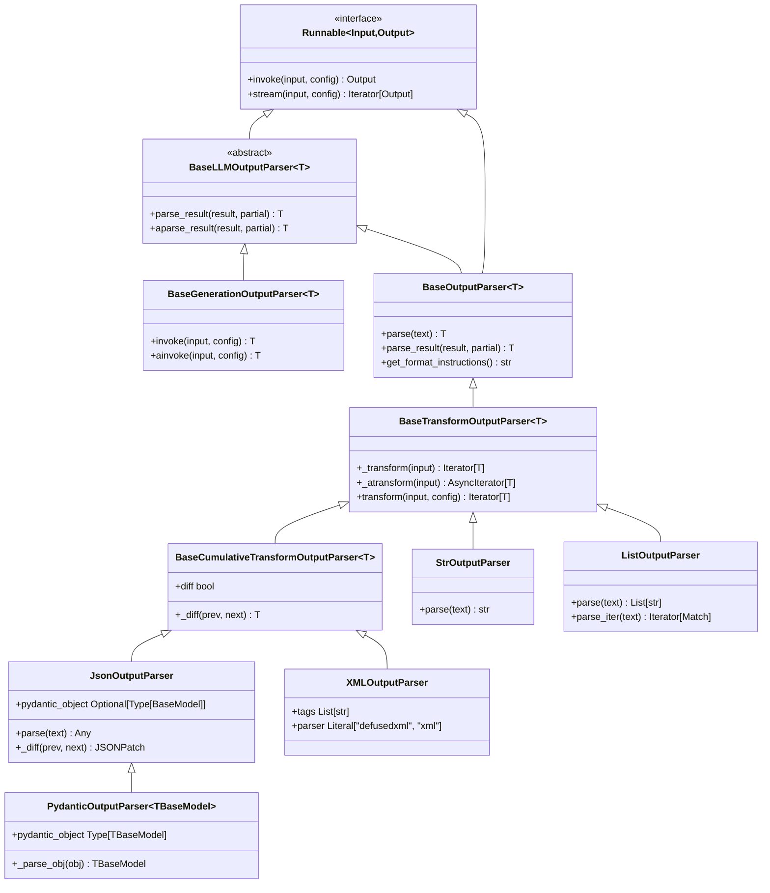
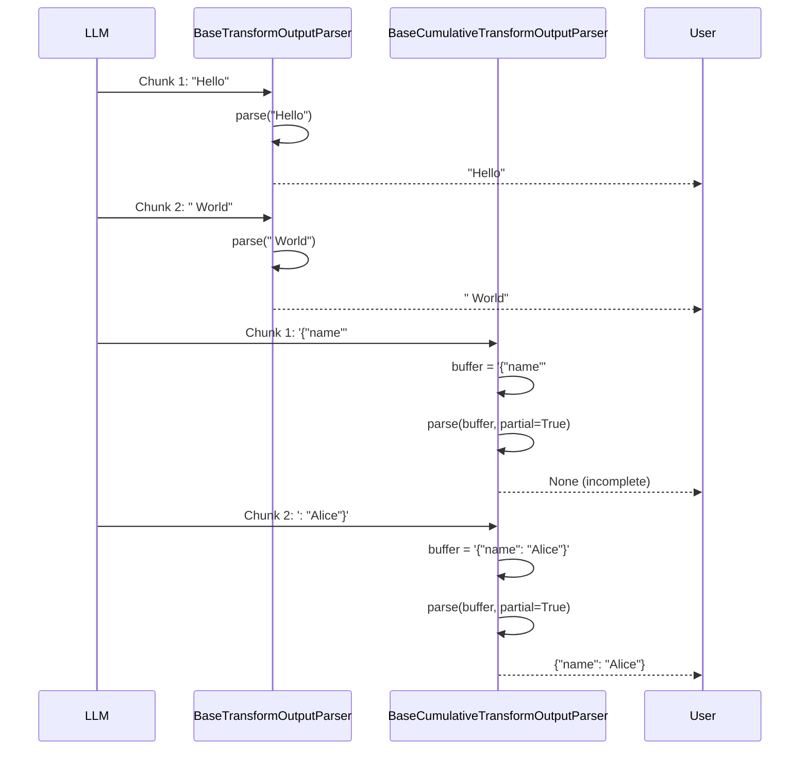

# Output Parsers API Reference

Comprehensive API reference for LangChain output parser utilities that transform LLM text outputs into structured data formats.

**Module**: `langchain_core.output_parsers`

**Primary Source Files**:
- `libs/core/langchain_core/output_parsers/base.py` - Base parser abstractions
- `libs/core/langchain_core/output_parsers/string.py` - String passthrough parser
- `libs/core/langchain_core/output_parsers/json.py` - JSON extraction and validation
- `libs/core/langchain_core/output_parsers/pydantic.py` - Pydantic model validation
- `libs/core/langchain_core/output_parsers/list.py` - List parsing implementations
- `libs/core/langchain_core/output_parsers/xml.py` - XML parsing with security
- `libs/core/langchain_core/output_parsers/openai_functions.py` - OpenAI function call parsing
- `libs/core/langchain_core/output_parsers/transform.py` - Streaming transformation bases

---

## Table of Contents

1. [Overview](#overview)
2. [Base Classes](#base-classes)
   - [BaseLLMOutputParser](#basellmoutputparser)
   - [BaseGenerationOutputParser](#basegenerationoutputparser)
   - [BaseOutputParser](#baseoutputparser)
   - [BaseTransformOutputParser](#basetransformoutputparser)
   - [BaseCumulativeTransformOutputParser](#basecumulativetransformoutputparser)
3. [Core Parsers](#core-parsers)
   - [StrOutputParser](#stroutputparser)
   - [JsonOutputParser](#jsonoutputparser)
   - [PydanticOutputParser](#pydanticoutputparser)
4. [List Parsers](#list-parsers)
   - [ListOutputParser](#listoutputparser)
   - [CommaSeparatedListOutputParser](#commaseparatedlistoutputparser)
   - [NumberedListOutputParser](#numberedlistoutputparser)
   - [MarkdownListOutputParser](#markdownlistoutputparser)
5. [XML Parser](#xml-parser)
   - [XMLOutputParser](#xmloutputparser)
6. [OpenAI Parsers](#openai-parsers)
   - [OutputFunctionsParser](#outputfunctionsparser)
   - [JsonOutputFunctionsParser](#jsonoutputfunctionsparser)
   - [PydanticOutputFunctionsParser](#pydanticoutputfunctionsparser)
7. [LCEL Integration Patterns](#lcel-integration-patterns)
8. [Error Handling](#error-handling)
9. [Streaming Behavior](#streaming-behavior)

---

## Overview

### What are Output Parsers?

Output parsers transform unstructured text responses from Language Models into structured, type-safe data formats. They bridge the gap between natural language generation and programmatic data structures, enabling reliable integration of LLM outputs into applications.

**Key Capabilities**:
- **Type Transformation**: Convert raw text to structured types (JSON, Pydantic models, lists, XML)
- **Validation**: Ensure outputs conform to expected schemas
- **Streaming Support**: Parse partial outputs incrementally during streaming
- **LCEL Integration**: Seamlessly compose with chains using the pipe operator
- **Error Recovery**: Provide detailed error messages with context for debugging

### Common Use Cases

| Use Case | Recommended Parser | Example |
|----------|-------------------|---------|
| Extract plain text response | `StrOutputParser` | Chain terminal for text extraction |
| Parse JSON object | `JsonOutputParser` | API response structuring |
| Validate against Pydantic model | `PydanticOutputParser` | Type-safe data structures |
| Extract comma-separated values | `CommaSeparatedListOutputParser` | List generation |
| Parse XML responses | `XMLOutputParser` | Structured document processing |
| Handle OpenAI function calls | `JsonOutputFunctionsParser` | Function calling workflows |

### Type Flow in LCEL Chains

Output parsers enable type transformations at the end of LCEL chains:

```
LLM Output (str/BaseMessage) → Parser → Structured Output
```

**Example Type Flow**:
```
PromptTemplate → ChatModel → AIMessage → JsonOutputParser → Dict[str, Any]
PromptTemplate → ChatModel → AIMessage → PydanticOutputParser → UserModel
PromptTemplate → ChatModel → AIMessage → StrOutputParser → str
```

**Source**: `libs/core/langchain_core/output_parsers/base.py:29-81`

---

## Parser Hierarchy

The output parser system is built on a layered inheritance hierarchy:



---

## Base Classes

### BaseLLMOutputParser

Abstract base class defining the core parsing contract for transforming model outputs.

**Source**: `libs/core/langchain_core/output_parsers/base.py:29`

```python
from abc import ABC, abstractmethod
from typing import Generic, TypeVar
from langchain_core.outputs import Generation

T = TypeVar("T")

class BaseLLMOutputParser(ABC, Generic[T]):
    """Abstract base class for parsing the outputs of a model."""
    
    @abstractmethod
    def parse_result(
        self, 
        result: list[Generation], 
        *, 
        partial: bool = False
    ) -> T:
        """Parse a list of candidate model Generation objects."""
```

**Type Parameters**:
- `T`: The output type produced by the parser

**Methods**:

#### parse_result()

Parse a list of candidate model `Generation` objects into a specific format.

**Parameters**:
- **result** (`list[Generation]`): List of Generation objects to parse. Assumed to be different candidate outputs for a single model input.
- **partial** (`bool`, optional): Whether to parse the output as a partial result. Default: `False`
  - When `True`: Enables partial parsing for streaming scenarios, may return `None` for incomplete data
  - When `False`: Requires complete, valid output or raises exception

**Returns**: `T` - Structured output in the parser's target type

**Usage Notes**:
- Typically processes only the first Generation (highest likelihood)
- Subclasses must implement this method to define parsing logic
- Partial parsing enables streaming use cases where output arrives incrementally

**Source**: `libs/core/langchain_core/output_parsers/base.py:33`

#### aparse_result()

Async version of `parse_result()`. Default implementation runs `parse_result()` in executor.

**Parameters**: Same as `parse_result()`

**Returns**: `T` - Structured output

**Source**: `libs/core/langchain_core/output_parsers/base.py:46`

---

### BaseGenerationOutputParser

Base class that integrates `BaseLLMOutputParser` with the Runnable protocol for LCEL composition.

**Source**: `libs/core/langchain_core/output_parsers/base.py:63`

```python
from langchain_core.runnables import RunnableSerializable
from langchain_core.language_models import LanguageModelOutput

class BaseGenerationOutputParser(
    BaseLLMOutputParser, 
    RunnableSerializable[LanguageModelOutput, T]
):
    """Base class to parse the output of an LLM call with Runnable integration."""
```

**Key Features**:
- Implements `Runnable` protocol enabling LCEL composition
- Accepts `str` or `BaseMessage` as input
- Automatically wraps inputs in `Generation` or `ChatGeneration` objects
- Supports callbacks, tags, and metadata through `RunnableConfig`

**Type Properties**:
- **InputType**: `str | AnyMessage` - Accepts both raw text and message objects
- **OutputType**: `type[T]` - The parser's output type

**Methods**:

#### invoke()

Transform a single input into an output synchronously.

**Parameters**:
- **input** (`str | BaseMessage`): The input to transform
- **config** (`RunnableConfig | None`, optional): Configuration for execution (callbacks, tags, metadata)
- **kwargs** (`Any`): Additional keyword arguments

**Returns**: `T` - Parsed output

**Behavior**:
- Wraps `str` input in `Generation(text=input)`
- Wraps `BaseMessage` input in `ChatGeneration(message=input)`
- Calls `parse_result()` on wrapped input

**Source**: `libs/core/langchain_core/output_parsers/base.py:83`

#### ainvoke()

Async version of `invoke()`.

**Parameters**: Same as `invoke()`

**Returns**: `T` - Parsed output

**Source**: `libs/core/langchain_core/output_parsers/base.py:106`

---

### BaseOutputParser

The primary base class for output parsers, combining parsing logic with the Runnable protocol.

**Source**: `libs/core/langchain_core/output_parsers/base.py:129`

```python
class BaseOutputParser(
    BaseLLMOutputParser, 
    RunnableSerializable[LanguageModelOutput, T]
):
    """Base class to parse the output of an LLM call.
    
    Output parsers help structure language model responses.
    """
    
    @abstractmethod
    def parse(self, text: str) -> T:
        """Parse a single string model output into some structure."""
```

**Abstract Methods**:

#### parse()

Parse a single string model output into structured format.

**Parameters**:
- **text** (`str`): String output of a language model

**Returns**: `T` - Structured output

**Implementation Notes**:
- This is the primary method subclasses must implement
- Default `parse_result()` implementation calls `parse(result[0].text)`
- Simpler interface than `parse_result()` for text-only parsing

**Source**: `libs/core/langchain_core/output_parsers/base.py:254`

**Optional Methods**:

#### get_format_instructions()

Return instructions for the LLM on how to format its output.

**Returns**: `str` - Format instructions to include in prompts

**Usage**:
```python
parser = CommaSeparatedListOutputParser()
instructions = parser.get_format_instructions()
# "Your response should be a list of comma separated values, eg: `foo, bar, baz`"

prompt = f"List three colors.\n\n{instructions}"
```

**Source**: Various parser implementations

---

### BaseTransformOutputParser

Base class for parsers that support streaming input.

**Source**: `libs/core/langchain_core/output_parsers/transform.py:28`

```python
class BaseTransformOutputParser(BaseOutputParser[T]):
    """Base class for an output parser that can handle streaming input."""
    
    def _transform(
        self, 
        input: Iterator[str | BaseMessage]
    ) -> Iterator[T]:
        """Transform streaming input into streaming output."""
```

**Streaming Capabilities**:
- Processes input as an iterator of chunks
- Yields parsed results incrementally
- Enables real-time processing of LLM streaming responses
- Default implementation parses each chunk independently

**Methods**:

#### transform()

Transform streaming input into streaming output with config support.

**Parameters**:
- **input** (`Iterator[str | BaseMessage]`): Streaming input chunks
- **config** (`RunnableConfig | None`, optional): Configuration for execution
- **kwargs** (`Any`): Additional keyword arguments

**Yields**: `T` - Parsed outputs as they become available

**Source**: `libs/core/langchain_core/output_parsers/transform.py:56`

#### _transform()

Internal method implementing the transformation logic.

**Parameters**:
- **input** (`Iterator[str | BaseMessage]`): Streaming input chunks

**Yields**: `T` - Parsed outputs

**Default Behavior**:
- Wraps each chunk in `Generation` or `ChatGeneration`
- Calls `parse_result()` on each wrapped chunk
- Subclasses can override for custom streaming behavior

**Source**: `libs/core/langchain_core/output_parsers/transform.py:31`

---

### BaseCumulativeTransformOutputParser

Base class for parsers that accumulate streaming input before parsing.

**Source**: `libs/core/langchain_core/output_parsers/transform.py:99`

```python
class BaseCumulativeTransformOutputParser(BaseTransformOutputParser[T]):
    """Base class for parser that accumulates streaming chunks."""
    
    diff: bool = False
    """Whether to yield diffs between parsed outputs in streaming mode."""
    
    def _diff(self, prev: T | None, next: T) -> T:
        """Convert parsed outputs into a diff format."""
```

**Key Features**:
- Accumulates all streamed chunks into a single buffer
- Parses accumulated content with `partial=True` after each chunk
- Yields only when parsed output changes
- Optionally yields diffs instead of full outputs

**Configuration**:
- **diff** (`bool`): When `True`, yields JSONPatch diffs between outputs. When `False`, yields complete parsed objects.

**Methods**:

#### _diff()

Convert consecutive parsed outputs into a diff format.

**Parameters**:
- **prev** (`T | None`): Previous parsed output (None for first output)
- **next** (`T`): Current parsed output

**Returns**: `T` - Diff between previous and current output

**Implementation Notes**:
- Subclasses must implement this method if `diff=True` is supported
- JsonOutputParser uses `jsonpatch.make_patch(prev, next).patch`
- Enables efficient streaming of large structured outputs

**Source**: `libs/core/langchain_core/output_parsers/transform.py:107`

**Streaming Behavior**:
```python
# Without diff mode (diff=False):
# Yields: {"name": "Alice"}
# Yields: {"name": "Alice", "age": 30}
# Yields: {"name": "Alice", "age": 30, "city": "NYC"}

# With diff mode (diff=True):
# Yields: [{"op": "add", "path": "/name", "value": "Alice"}]
# Yields: [{"op": "add", "path": "/age", "value": 30}]
# Yields: [{"op": "add", "path": "/city", "value": "NYC"}]
```

---

## Core Parsers

### StrOutputParser

The simplest output parser that passes through the input text unchanged. Acts as an identity function for text extraction.

**Source**: `libs/core/langchain_core/output_parsers/string.py:8`

```python
from langchain_core.output_parsers.transform import BaseTransformOutputParser

class StrOutputParser(BaseTransformOutputParser[str]):
    """OutputParser that parses LLMResult into the top likely string."""
```

**Use Cases**:
- Terminal step in LCEL chains to extract text from messages
- Converting `AIMessage` objects to raw strings
- Simplest parser when no structure extraction is needed

**Methods**:

#### parse()

Returns the input text with no modifications.

**Parameters**:
- **text** (`str`): The output of an LLM call

**Returns**: `str` - The input text unchanged

**Source**: `libs/core/langchain_core/output_parsers/string.py:35`

**Properties**:
- **is_lc_serializable**: Returns `True` (can be serialized/deserialized)
- **_type**: Returns `"default"` for serialization registry

**LCEL Integration Example**:

```python
from langchain_core.prompts import ChatPromptTemplate
from langchain_openai import ChatOpenAI
from langchain_core.output_parsers import StrOutputParser

# Create chain: prompt | model | parser
prompt = ChatPromptTemplate.from_messages([
    ("system", "You are a helpful assistant."),
    ("human", "{question}")
])
model = ChatOpenAI(model="gpt-4")
parser = StrOutputParser()

chain = prompt | model | parser

# Result is automatically extracted as string
result = chain.invoke({"question": "What is LCEL?"})
print(result)  # "LCEL stands for LangChain Expression Language..."
print(type(result))  # <class 'str'>
```

**Type Flow**:
```
Dict[str, str] → ChatPromptTemplate → List[BaseMessage] → ChatOpenAI → AIMessage → StrOutputParser → str
```

**Streaming Example**:

```python
# Stream text chunks as they arrive
for chunk in chain.stream({"question": "Count to 5"}):
    print(chunk, end="", flush=True)
# Output: "1, 2, 3, 4, 5"
```

---

### JsonOutputParser

Parse LLM output into JSON objects with optional Pydantic model validation and streaming support.

**Source**: `libs/core/langchain_core/output_parsers/json.py:31`

```python
from typing import Any
from langchain_core.output_parsers.transform import BaseCumulativeTransformOutputParser

class JsonOutputParser(BaseCumulativeTransformOutputParser[Any]):
    """Parse the output of an LLM call to a JSON object.
    
    When used in streaming mode, yields partial JSON objects containing
    all keys that have been returned so far.
    
    In streaming, if `diff` is set to True, yields JSONPatch operations
    describing the difference between the previous and current object.
    """
    
    pydantic_object: type[BaseModel] | None = None
    """The Pydantic object to use for validation. If None, no validation."""
```

**Configuration**:
- **pydantic_object** (`type[BaseModel] | None`): Optional Pydantic model for validation. When provided, validates parsed JSON against the model schema but does not instantiate the model.
- **diff** (`bool`): Whether to yield JSONPatch diffs in streaming mode. Default: `False`

**Methods**:

#### parse()

Parse the output of an LLM call to a JSON object.

**Parameters**:
- **text** (`str`): The output of an LLM call

**Returns**: `Any` - Parsed JSON object (typically `dict[str, Any]`)

**Raises**:
- **OutputParserException**: If the output is not valid JSON

**Behavior**:
- Automatically handles JSON in markdown code blocks (```json...```)
- Uses `parse_json_markdown()` to extract JSON from formatted text
- Returns Python dict or list depending on JSON structure

**Source**: `libs/core/langchain_core/output_parsers/json.py:86`

#### parse_result()

Parse the result of an LLM call with partial parsing support for streaming.

**Parameters**:
- **result** (`list[Generation]`): The result of the LLM call
- **partial** (`bool`, optional): Whether to parse partial JSON. Default: `False`
  - When `True`: Returns `None` if JSON is incomplete (for streaming)
  - When `False`: Raises `OutputParserException` on invalid JSON

**Returns**: `Any` - Parsed JSON object, or `None` if partial and incomplete

**Raises**:
- **OutputParserException**: If `partial=False` and output is not valid JSON

**Source**: `libs/core/langchain_core/output_parsers/json.py:56`

#### get_format_instructions()

Return format instructions for the LLM on how to format JSON output.

**Returns**: `str` - Format instructions to include in prompts

**Behavior**:
- Without `pydantic_object`: Returns generic `"Return a JSON object."`
- With `pydantic_object`: Returns schema-based instructions with example

**Example Output** (with Pydantic model):
```
Return a JSON object conforming to the schema:
{"properties": {"name": {"type": "string"}, "age": {"type": "integer"}}, "required": ["name"]}
```

**Source**: `libs/core/langchain_core/output_parsers/json.py:97`

#### _diff()

Generate JSONPatch diff between consecutive outputs.

**Parameters**:
- **prev** (`Any | None`): Previous parsed output
- **next** (`Any`): Current parsed output

**Returns**: `list[dict]` - JSONPatch operations

**Source**: `libs/core/langchain_core/output_parsers/json.py:46`

**LCEL Integration Example**:

```python
from langchain_core.prompts import ChatPromptTemplate
from langchain_openai import ChatOpenAI
from langchain_core.output_parsers import JsonOutputParser

# Create JSON extraction chain
prompt = ChatPromptTemplate.from_messages([
    ("system", "Extract user information as JSON."),
    ("human", "{user_description}")
])
model = ChatOpenAI(model="gpt-4")
parser = JsonOutputParser()

chain = prompt | model | parser

result = chain.invoke({
    "user_description": "Alice is 30 years old and lives in NYC"
})
print(result)
# Output: {'name': 'Alice', 'age': 30, 'city': 'NYC'}
print(type(result))  # <class 'dict'>
```

**With Pydantic Validation**:

```python
from pydantic import BaseModel, Field

class User(BaseModel):
    name: str = Field(description="User's full name")
    age: int = Field(description="User's age")
    city: str = Field(description="City of residence")

# Validate against schema but return dict
parser = JsonOutputParser(pydantic_object=User)
chain = prompt | model | parser

result = chain.invoke({"user_description": "Bob, 25, SF"})
# Validation ensures JSON matches User schema
print(result)  # {'name': 'Bob', 'age': 25, 'city': 'SF'}
```

**Streaming with Partial Parsing**:

```python
# Stream partial JSON as it's generated
for chunk in chain.stream({"user_description": "Carol, 28, LA"}):
    print(chunk)
# Output:
# {'name': 'Carol'}
# {'name': 'Carol', 'age': 28}
# {'name': 'Carol', 'age': 28, 'city': 'LA'}
```

**Streaming with Diff Mode**:

```python
parser_diff = JsonOutputParser(diff=True)
chain_diff = prompt | model | parser_diff

for diff in chain_diff.stream({"user_description": "Dave, 35, Boston"}):
    print(diff)
# Output:
# [{'op': 'add', 'path': '/name', 'value': 'Dave'}]
# [{'op': 'add', 'path': '/age', 'value': 35}]
# [{'op': 'add', 'path': '/city', 'value': 'Boston'}]
```

**Error Handling**:

```python
from langchain_core.exceptions import OutputParserException

try:
    result = parser.parse("This is not valid JSON")
except OutputParserException as e:
    print(f"Parse error: {e}")
    print(f"LLM output was: {e.llm_output}")
```

---

### PydanticOutputParser

Parse LLM output into validated Pydantic model instances with full type safety.

**Source**: `libs/core/langchain_core/output_parsers/pydantic.py:19`

```python
from typing import Generic
from pydantic import BaseModel
from langchain_core.utils.pydantic import TBaseModel

class PydanticOutputParser(JsonOutputParser, Generic[TBaseModel]):
    """Parse an output using a Pydantic model.
    
    Validates JSON output against a Pydantic model schema and returns
    a model instance.
    """
    
    pydantic_object: type[TBaseModel]
    """The Pydantic model to parse. Required field."""
```

**Type Parameters**:
- **TBaseModel**: The Pydantic model type (bound to `pydantic.BaseModel | pydantic.v1.BaseModel`)

**Key Differences from JsonOutputParser**:
- **Returns**: Pydantic model instance (not dict)
- **Validation**: Always validates (pydantic_object is required)
- **Type Safety**: Generic type provides static type checking

**Methods**:

#### parse()

Parse the output of an LLM call to a Pydantic model instance.

**Parameters**:
- **text** (`str`): The output of an LLM call

**Returns**: `TBaseModel` - Validated Pydantic model instance

**Raises**:
- **OutputParserException**: If JSON is invalid or doesn't conform to model schema

**Source**: `libs/core/langchain_core/output_parsers/pydantic.py:71`

#### parse_result()

Parse with partial support for streaming.

**Parameters**:
- **result** (`list[Generation]`): The result of the LLM call
- **partial** (`bool`, optional): Whether to parse partial JSON. Default: `False`
  - When `True`: Returns `None` if parsing fails (incomplete data)
  - When `False`: Raises `OutputParserException` on failure

**Returns**: `TBaseModel | None` - Validated model instance or None if partial and incomplete

**Raises**:
- **OutputParserException**: If validation fails and `partial=False`

**Source**: `libs/core/langchain_core/output_parsers/pydantic.py:45`

#### _parse_obj()

Internal method to parse dictionary into Pydantic model.

**Parameters**:
- **obj** (`dict`): Parsed JSON dictionary

**Returns**: `TBaseModel` - Model instance

**Raises**:
- **OutputParserException**: Wraps Pydantic ValidationError with context

**Behavior**:
- Supports both Pydantic v1 and v2 models
- Uses `model_validate()` for Pydantic v2
- Uses `parse_obj()` for Pydantic v1
- Wraps validation errors with LLM output context

**Source**: `libs/core/langchain_core/output_parsers/pydantic.py:25`

#### get_format_instructions()

Return format instructions with Pydantic model schema.

**Returns**: `str` - Detailed instructions with JSON schema

**Example Output**:
```
The output should be formatted as a JSON instance that conforms to the JSON schema below.

As an example, for the schema {"properties": {"foo": {"title": "Foo", "description": "a list of strings", "type": "array", "items": {"type": "string"}}}, "required": ["foo"]}
the object {"foo": ["bar", "baz"]} is a well-formatted instance of the schema. The object {"properties": {"foo": ["bar", "baz"]}} is not well-formatted.

Here is the output schema:
```
{schema}
```
```

**Source**: `libs/core/langchain_core/output_parsers/pydantic.py:82`

**LCEL Integration Example**:

```python
from pydantic import BaseModel, Field
from langchain_core.prompts import ChatPromptTemplate
from langchain_openai import ChatOpenAI
from langchain_core.output_parsers import PydanticOutputParser

# Define Pydantic model
class Person(BaseModel):
    name: str = Field(description="Person's full name")
    age: int = Field(description="Person's age in years", ge=0, le=150)
    occupation: str = Field(description="Person's occupation")
    city: str = Field(description="City where person lives")

# Create parser with model
parser = PydanticOutputParser(pydantic_object=Person)

# Create chain with format instructions
prompt = ChatPromptTemplate.from_messages([
    ("system", "Extract person information.\n\n{format_instructions}"),
    ("human", "{description}")
])

model = ChatOpenAI(model="gpt-4")
chain = prompt | model | parser

# Invoke with format instructions injected
result = chain.invoke({
    "description": "John Smith is a 35-year-old software engineer living in Seattle",
    "format_instructions": parser.get_format_instructions()
})

print(result)
# Output: Person(name='John Smith', age=35, occupation='software engineer', city='Seattle')
print(type(result))  # <class 'Person'>
print(result.name)   # 'John Smith'
print(result.age)    # 35
```

**Validation Error Handling**:

```python
from langchain_core.exceptions import OutputParserException

try:
    # Age exceeds validation constraint
    result = parser.parse('{"name": "Alice", "age": 200, "occupation": "Doctor", "city": "NYC"}')
except OutputParserException as e:
    print(f"Validation error: {e}")
    # Output: Failed to parse Person from completion {...}. Got: 1 validation error for Person
    # age: Input should be less than or equal to 150
```

**Streaming with Partial Models**:

```python
# Partial mode returns None until valid complete object
for partial_result in chain.stream({"description": "Emma, 28, Teacher, Boston"}):
    if partial_result is not None:
        print(partial_result)
# Output: Person(name='Emma', age=28, occupation='Teacher', city='Boston')
# (Only prints when complete valid object is received)
```

---

## List Parsers

### ListOutputParser

Abstract base class for parsers that extract lists of strings from LLM outputs.

**Source**: `libs/core/langchain_core/output_parsers/list.py:43`

```python
from langchain_core.output_parsers.transform import BaseTransformOutputParser

class ListOutputParser(BaseTransformOutputParser[list[str]]):
    """Parse the output of an LLM call to a list."""
```

**Abstract Methods**:

#### parse()

Parse the output of an LLM call into a list of strings.

**Parameters**:
- **text** (`str`): The output of an LLM call

**Returns**: `list[str]` - Extracted list of strings

**Source**: `libs/core/langchain_core/output_parsers/list.py:51`

#### parse_iter()

Parse the output yielding regex match objects for streaming.

**Parameters**:
- **text** (`str`): The output of an LLM call

**Yields**: `re.Match` - Match object for each list item

**Implementation Notes**:
- Subclasses should implement this for optimized streaming
- Default raises `NotImplementedError`
- Used by `_transform()` for incremental parsing

**Source**: `libs/core/langchain_core/output_parsers/list.py:61`

**Streaming Behavior**:

The base class provides sophisticated streaming support via `_transform()`:
- Buffers incoming chunks
- Uses `droplastn(n=1)` to avoid yielding incomplete matches
- Yields complete list items as they become parseable
- Handles both regex-based (`parse_iter`) and fallback (`parse`) approaches

**Source**: `libs/core/langchain_core/output_parsers/list.py:73`

---

### CommaSeparatedListOutputParser

Parse LLM output into a list of comma-separated values.

**Source**: `libs/core/langchain_core/output_parsers/list.py:139`

```python
class CommaSeparatedListOutputParser(ListOutputParser):
    """Parse the output of an LLM call to a comma-separated list."""
```

**Parsing Logic**:
- Uses Python's `csv.reader` with configurable quoting and delimiters
- Supports both strict CSV format and relaxed comma splitting
- Handles quoted strings with embedded commas
- Strips leading/trailing whitespace

**Methods**:

#### parse()

Parse comma-separated values into a list.

**Parameters**:
- **text** (`str`): The output of an LLM call

**Returns**: `list[str]` - List of parsed values

**Behavior**:
- Primary: Uses `csv.reader` with `delimiter=","`, `quotechar='"'`, `skipinitialspace=True`
- Fallback: On csv.Error, falls back to simple `text.split(",")` with strip

**Examples**:
```python
parser = CommaSeparatedListOutputParser()

# Simple comma-separated
parser.parse("apple, banana, cherry")
# Returns: ['apple', 'banana', 'cherry']

# Quoted strings with embedded commas
parser.parse('apple, "banana, plantain", cherry')
# Returns: ['apple', 'banana, plantain', 'cherry']

# Irregular spacing
parser.parse("red,  green  ,blue")
# Returns: ['red', 'green', 'blue']
```

**Source**: `libs/core/langchain_core/output_parsers/list.py:165`

#### get_format_instructions()

Return format instructions for comma-separated output.

**Returns**: `str` - Instructions to include in prompts

**Output**: `"Your response should be a list of comma separated values, eg: \`foo, bar, baz\` or \`foo,bar,baz\`"`

**Source**: `libs/core/langchain_core/output_parsers/list.py:157`

**LCEL Integration Example**:

```python
from langchain_core.prompts import ChatPromptTemplate
from langchain_openai import ChatOpenAI
from langchain_core.output_parsers import CommaSeparatedListOutputParser

parser = CommaSeparatedListOutputParser()

prompt = ChatPromptTemplate.from_messages([
    ("system", "You are a helpful assistant."),
    ("human", "{question}\n\n{format_instructions}")
])

model = ChatOpenAI(model="gpt-4")
chain = prompt | model | parser

result = chain.invoke({
    "question": "List 5 programming languages",
    "format_instructions": parser.get_format_instructions()
})

print(result)
# Output: ['Python', 'JavaScript', 'Java', 'C++', 'Go']
print(type(result))  # <class 'list'>
```

---

### NumberedListOutputParser

Parse LLM output into a list extracted from numbered items.

**Source**: `libs/core/langchain_core/output_parsers/list.py:188`

```python
class NumberedListOutputParser(ListOutputParser):
    """Parse a numbered list."""
    
    pattern: str = r"\d+\.\s([^\n]+)"
    """The pattern to match a numbered list item."""
```

**Configuration**:
- **pattern** (`str`): Regex pattern for numbered items. Default: `r"\d+\.\s([^\n]+)"`
  - Matches: `1. Item`, `2. Item`, `123. Item`
  - Captures: Text after number and period until newline

**Methods**:

#### parse()

Extract numbered list items using regex.

**Parameters**:
- **text** (`str`): The output of an LLM call

**Returns**: `list[str]` - Extracted list items (without numbers)

**Examples**:
```python
parser = NumberedListOutputParser()

text = """
Here are some fruits:
1. Apple
2. Banana
3. Cherry
"""

result = parser.parse(text)
print(result)  # ['Apple', 'Banana', 'Cherry']
```

**Source**: `libs/core/langchain_core/output_parsers/list.py:201`

#### parse_iter()

Yield regex match objects for streaming support.

**Parameters**:
- **text** (`str`): The output of an LLM call

**Yields**: `re.Match` - Match object for each numbered item

**Source**: `libs/core/langchain_core/output_parsers/list.py:213`

#### get_format_instructions()

Return format instructions for numbered list output.

**Returns**: `str` - Instructions to include in prompts

**Output**: `"Your response should be a numbered list with each item on a new line. For example: \n\n1. foo\n\n2. bar\n\n3. baz"`

**Source**: `libs/core/langchain_core/output_parsers/list.py:195`

**LCEL Integration Example**:

```python
from langchain_core.output_parsers.list import NumberedListOutputParser

parser = NumberedListOutputParser()

prompt = ChatPromptTemplate.from_messages([
    ("system", "You are a helpful assistant."),
    ("human", "{question}\n\n{format_instructions}")
])

chain = prompt | model | parser

result = chain.invoke({
    "question": "List the steps to make coffee",
    "format_instructions": parser.get_format_instructions()
})

print(result)
# Output: ['Boil water', 'Grind coffee beans', 'Add coffee to filter', 'Pour hot water over coffee', 'Wait and enjoy']
```

**Custom Pattern Example**:

```python
# Match Roman numerals
custom_parser = NumberedListOutputParser(pattern=r"[IVX]+\.\s([^\n]+)")

text = """
I. First item
II. Second item
III. Third item
"""

result = custom_parser.parse(text)
print(result)  # ['First item', 'Second item', 'Third item']
```

---

### MarkdownListOutputParser

Parse LLM output into a list extracted from Markdown bullet points.

**Source**: `libs/core/langchain_core/output_parsers/list.py:221`

```python
class MarkdownListOutputParser(ListOutputParser):
    """Parse a Markdown list."""
    
    pattern: str = r"^\s*[-*]\s([^\n]+)$"
    """The pattern to match a Markdown list item."""
```

**Configuration**:
- **pattern** (`str`): Regex pattern for Markdown bullets. Default: `r"^\s*[-*]\s([^\n]+)$"`
  - Matches: `- Item`, `* Item`, `  - Nested Item`
  - Uses MULTILINE flag for line-by-line matching

**Methods**:

#### parse()

Extract Markdown list items using regex with MULTILINE flag.

**Parameters**:
- **text** (`str`): The output of an LLM call

**Returns**: `list[str]` - Extracted list items (without bullet markers)

**Examples**:
```python
parser = MarkdownListOutputParser()

text = """
Shopping list:
- Eggs
- Milk
- Bread
* Butter
"""

result = parser.parse(text)
print(result)  # ['Eggs', 'Milk', 'Bread', 'Butter']
```

**Source**: `libs/core/langchain_core/output_parsers/list.py:232`

#### parse_iter()

Yield regex match objects for streaming support with MULTILINE flag.

**Parameters**:
- **text** (`str`): The output of an LLM call

**Yields**: `re.Match` - Match object for each bullet item

**Source**: `libs/core/langchain_core/output_parsers/list.py:244`

#### get_format_instructions()

Return format instructions for Markdown list output.

**Returns**: `str` - Instructions to include in prompts

**Output**: `"Your response should be a markdown list, eg: \`- foo\n- bar\n- baz\`"`

**Source**: `libs/core/langchain_core/output_parsers/list.py:228`

**LCEL Integration Example**:

```python
from langchain_core.output_parsers.list import MarkdownListOutputParser

parser = MarkdownListOutputParser()

prompt = ChatPromptTemplate.from_messages([
    ("system", "You are a helpful assistant."),
    ("human", "{question}\n\n{format_instructions}")
])

chain = prompt | model | parser

result = chain.invoke({
    "question": "What are the benefits of exercise?",
    "format_instructions": parser.get_format_instructions()
})

print(result)
# Output: ['Improves cardiovascular health', 'Builds muscle strength', 'Reduces stress', 'Enhances mood', 'Promotes better sleep']
```

**Streaming Example**:

```python
# Stream list items as they are generated
for item in chain.stream({"question": "List 3 colors"}):
    print(f"Received: {item}")

# Output:
# Received: ['Red']
# Received: ['Blue']
# Received: ['Green']
```

---

## XML Parser

### XMLOutputParser

Parse LLM output into nested dictionaries from XML with security-focused parsing.

**Source**: `libs/core/langchain_core/output_parsers/xml.py:163`

```python
from typing import Any, Literal
from langchain_core.output_parsers.transform import BaseTransformOutputParser

class XMLOutputParser(BaseTransformOutputParser[dict[str, str | list[Any]]]):
    """Parse LLM output into XML format with secure parsing."""
    
    tags: list[str] | None = None
    """Expected XML tags. If provided, included in format instructions."""
    
    parser: Literal["defusedxml", "xml"] = "defusedxml"
    """Parser to use: 'defusedxml' (default, secure) or 'xml' (standard library)."""
```

**Security Considerations**:

**⚠️ XML Vulnerabilities**: Python's standard library XML parser is vulnerable to several attacks:
- Billion laughs attack (exponential entity expansion)
- Quadratic blowup attack (nested entity expansion)
- External entity injection (XXE)

**Recommended Parser**: `"defusedxml"` (default)
- Wraps standard library parser with secure defaults
- Prevents XML vulnerabilities
- Requires: `pip install defusedxml`

**Standard Parser**: `"xml"`
- Use only if your Python distribution is patched
- Check: https://docs.python.org/3/library/xml.html#xml-vulnerabilities
- Suitable for trusted input only

**Source**: `libs/core/langchain_core/output_parsers/xml.py:172-190`

**Configuration**:
- **tags** (`list[str] | None`): List of expected XML tags. Used to generate format instructions. Example: `["person", "name", "age"]`
- **parser** (`Literal["defusedxml", "xml"]`): Parser backend selection

**Methods**:

#### parse()

Parse XML text into nested dictionary structure.

**Parameters**:
- **text** (`str`): The output of an LLM call

**Returns**: `dict[str, str | list[Any]]` - Nested dictionary representing XML structure
  - Element text content becomes string values
  - Child elements become nested dictionaries
  - Multiple children with same tag become lists

**Raises**:
- **OutputParserException**: If XML is malformed
- **ImportError**: If `parser="defusedxml"` but defusedxml not installed

**Behavior**:
- Automatically extracts XML from markdown code blocks (```xml...```)
- Removes XML encoding declarations
- Converts ElementTree to dictionary via `_root_to_dict()`

**Source**: `libs/core/langchain_core/output_parsers/xml.py:196`

**XML to Dict Conversion Rules**:

```python
# Simple element with text
<name>Alice</name>
# Result: {"name": "Alice"}

# Nested elements
<person>
  <name>Alice</name>
  <age>30</age>
</person>
# Result: {"person": {"name": "Alice", "age": "30"}}

# Multiple children with same tag
<people>
  <person>Alice</person>
  <person>Bob</person>
</people>
# Result: {"people": {"person": ["Alice", "Bob"]}}

# Mixed content (text + children)
<root>
  Text content
  <child>Value</child>
</root>
# Result: {"root": {"child": "Value"}}  # Text ignored when children present
```

#### get_format_instructions()

Return format instructions for XML output.

**Returns**: `str` - Instructions including expected tags if configured

**Example Output** (with tags configured):
```
The output should be formatted as a XML file.
1. Output should conform to the tags below.
2. If tags are not given, make them on your own.
3. Remember to always open and close all the tags.

As an example, for the tags ["foo", "bar", "baz"]:
1. String "<foo>\n   <bar>\n      <baz></baz>\n   </bar>\n</foo>" is a well-formatted instance.
2. String "<foo>\n   <bar>\n   </foo>" is a badly-formatted instance.

Here are the output tags:
```
["person", "name", "age"]
```
```

**Source**: `libs/core/langchain_core/output_parsers/xml.py:192`

**Streaming Support**:

XMLOutputParser uses `_StreamingParser` internally for incremental parsing:
- Accumulates chunks until valid XML tags detected
- Uses `XMLPullParser` for event-driven parsing
- Yields `AddableDict` objects as elements become complete
- Handles incomplete XML gracefully during streaming

**Source**: `libs/core/langchain_core/output_parsers/xml.py:42-76`

**LCEL Integration Example**:

```python
from langchain_core.prompts import ChatPromptTemplate
from langchain_openai import ChatOpenAI
from langchain_core.output_parsers.xml import XMLOutputParser

# Configure parser with expected tags
parser = XMLOutputParser(tags=["person", "name", "age", "occupation"])

prompt = ChatPromptTemplate.from_messages([
    ("system", "Extract person information as XML.\n\n{format_instructions}"),
    ("human", "{description}")
])

model = ChatOpenAI(model="gpt-4")
chain = prompt | model | parser

result = chain.invoke({
    "description": "Alice is 30 years old and works as a software engineer",
    "format_instructions": parser.get_format_instructions()
})

print(result)
# Output: {
#   'person': {
#     'name': 'Alice',
#     'age': '30',
#     'occupation': 'software engineer'
#   }
# }
```

**Secure Parsing Example**:

```python
# Default: Uses defusedxml for security
secure_parser = XMLOutputParser(parser="defusedxml")

# Only use standard library parser if distribution is secure
unsafe_parser = XMLOutputParser(parser="xml")  # Use with caution
```

**Error Handling**:

```python
from langchain_core.exceptions import OutputParserException

try:
    result = parser.parse("<person><name>Alice</person>")  # Missing closing </name>
except OutputParserException as e:
    print(f"XML parse error: {e}")
    print(f"LLM output: {e.llm_output}")
```

**Streaming Example**:

```python
# Stream parsed XML elements as they complete
for chunk in chain.stream({"description": "Bob, 25, teacher"}):
    print(chunk)
# Output (incremental):
# AddableDict({'person': {'name': 'Bob'}})
# AddableDict({'person': {'name': 'Bob', 'age': '25'}})
# AddableDict({'person': {'name': 'Bob', 'age': '25', 'occupation': 'teacher'}})
```

---

## OpenAI Parsers

### OutputFunctionsParser

Parse OpenAI function call outputs from chat messages.

**Source**: `libs/core/langchain_core/output_parsers/openai_functions.py:22`

```python
from langchain_core.output_parsers import BaseGenerationOutputParser

class OutputFunctionsParser(BaseGenerationOutputParser[Any]):
    """Parse an output that is one of sets of values."""
    
    args_only: bool = True
    """Whether to only return the arguments to the function call."""
```

**Configuration**:
- **args_only** (`bool`): Whether to return only function arguments. Default: `True`
  - When `True`: Returns arguments dict
  - When `False`: Returns full function call dict with name and arguments

**Methods**:

#### parse_result()

Extract function call from ChatGeneration message.

**Parameters**:
- **result** (`list[Generation]`): The result of the LLM call
- **partial** (`bool`, optional): Not used for this parser

**Returns**: `Any` - Function arguments dict (if `args_only=True`) or full function call dict

**Raises**:
- **OutputParserException**: If Generation is not ChatGeneration or function_call not present

**Behavior**:
- Extracts `message.additional_kwargs["function_call"]`
- Returns `func_call["arguments"]` if `args_only=True`
- Returns full `func_call` dict if `args_only=False`

**Source**: `libs/core/langchain_core/output_parsers/openai_functions.py:29`

**Example Usage**:

```python
from langchain_openai import ChatOpenAI
from langchain_core.output_parsers.openai_functions import OutputFunctionsParser
from langchain_core.messages import HumanMessage

# Define function schema
function_schema = {
    "name": "get_weather",
    "description": "Get weather for a location",
    "parameters": {
        "type": "object",
        "properties": {
            "location": {"type": "string", "description": "City name"},
            "unit": {"type": "string", "enum": ["celsius", "fahrenheit"]}
        },
        "required": ["location"]
    }
}

model = ChatOpenAI(model="gpt-4").bind(functions=[function_schema])
parser = OutputFunctionsParser()

chain = model | parser

result = chain.invoke([HumanMessage(content="What's the weather in NYC?")])
print(result)
# Output: {'location': 'NYC', 'unit': 'celsius'}
```

---

### JsonOutputFunctionsParser

Parse OpenAI function call outputs with JSON parsing and optional diff support.

**Source**: `libs/core/langchain_core/output_parsers/openai_functions.py:58`

```python
from langchain_core.output_parsers import BaseCumulativeTransformOutputParser

class JsonOutputFunctionsParser(BaseCumulativeTransformOutputParser[Any]):
    """Parse an output as the JSON object."""
    
    strict: bool = False
    """Whether to allow non-JSON-compliant strings."""
    
    args_only: bool = True
    """Whether to only return the arguments to the function call."""
```

**Configuration**:
- **strict** (`bool`): JSON parsing strictness. Default: `False`
  - When `False`: Allows unicode and newlines
  - When `True`: Enforces strict JSON compliance
- **args_only** (`bool`): Whether to return only arguments. Default: `True`
- **diff** (`bool`): Whether to yield JSONPatch diffs in streaming. Inherited from base.

**Methods**:

#### parse_result()

Parse function call with partial JSON support for streaming.

**Parameters**:
- **result** (`list[Generation]`): The result of the LLM call
- **partial** (`bool`, optional): Whether to parse partial JSON

**Returns**: `Any` - Parsed JSON arguments or full function call

**Raises**:
- **OutputParserException**: If not ChatGeneration or parsing fails

**Behavior**:
- Extracts function call arguments string
- Uses `parse_partial_json()` for streaming support
- Returns `None` if partial and JSON incomplete

**Source**: `libs/core/langchain_core/output_parsers/openai_functions.py:80`

**LCEL Integration Example**:

```python
from langchain_core.output_parsers.openai_functions import JsonOutputFunctionsParser

parser = JsonOutputFunctionsParser()
chain = model | parser

# Streaming with partial JSON parsing
for chunk in chain.stream([HumanMessage(content="Get weather for SF, LA, NYC")]):
    print(chunk)
# Output (incremental):
# {'locations': ['SF']}
# {'locations': ['SF', 'LA']}
# {'locations': ['SF', 'LA', 'NYC']}
```

**With Diff Mode**:

```python
parser_diff = JsonOutputFunctionsParser(diff=True)
chain_diff = model | parser_diff

for diff in chain_diff.stream([HumanMessage(content="List three colors")]):
    print(diff)
# Output:
# [{'op': 'add', 'path': '/colors', 'value': ['red']}]
# [{'op': 'add', 'path': '/colors/1', 'value': 'green'}]
# [{'op': 'add', 'path': '/colors/2', 'value': 'blue'}]
```

---

### PydanticOutputFunctionsParser

Parse OpenAI function call outputs into validated Pydantic models.

**Source**: `libs/core/langchain_core/output_parsers/openai_tools.py` (related implementation)

```python
from pydantic import BaseModel

class PydanticOutputFunctionsParser(JsonOutputFunctionsParser, Generic[TBaseModel]):
    """Parse function call outputs into Pydantic models."""
    
    pydantic_schema: type[TBaseModel]
    """The Pydantic model to validate against."""
```

**Key Features**:
- Combines function call parsing with Pydantic validation
- Returns validated model instances
- Supports OpenAI tool calls and function calls
- Type-safe outputs with static typing support

**Usage Pattern**:

```python
from pydantic import BaseModel, Field
from langchain_core.output_parsers.openai_functions import PydanticOutputFunctionsParser

class WeatherRequest(BaseModel):
    location: str = Field(description="City name")
    unit: str = Field(description="Temperature unit", pattern="^(celsius|fahrenheit)$")
    days: int = Field(description="Forecast days", ge=1, le=7)

parser = PydanticOutputFunctionsParser(pydantic_schema=WeatherRequest)
chain = model | parser

result = chain.invoke([HumanMessage(content="Weather for Seattle, 3 days, celsius")])
print(result)
# Output: WeatherRequest(location='Seattle', unit='celsius', days=3)
print(type(result))  # <class 'WeatherRequest'>
```

---

## LCEL Integration Patterns

### Basic Chain Composition

Output parsers integrate seamlessly with LCEL using the pipe operator:

```python
from langchain_core.prompts import ChatPromptTemplate
from langchain_openai import ChatOpenAI
from langchain_core.output_parsers import StrOutputParser

# Pattern: prompt | model | parser
chain = ChatPromptTemplate.from_template("Tell me a joke") | ChatOpenAI() | StrOutputParser()

result = chain.invoke({})
print(result)  # "Why did the chicken cross the road?..."
```

### Type Flow Through Chains

Understanding type transformations through parser chains:

```mermaid
graph LR
    A[Input: Dict] --> B[PromptTemplate]
    B --> C[ChatModel]
    C --> D[Parser]
    D --> E[Output]
    
    style A fill:#e1f5ff
    style E fill:#e1f5ff
    
    B -.->|List[BaseMessage]| C
    C -.->|AIMessage| D
    D -.->|Structured Data| E
```

**Example Type Flows**:

| Parser | Input Type | Output Type | Use Case |
|--------|-----------|-------------|----------|
| `StrOutputParser` | `str \| BaseMessage` | `str` | Text extraction |
| `JsonOutputParser` | `str \| BaseMessage` | `dict[str, Any]` | JSON objects |
| `PydanticOutputParser[T]` | `str \| BaseMessage` | `T` | Validated models |
| `CommaSeparatedListOutputParser` | `str \| BaseMessage` | `list[str]` | CSV lists |
| `XMLOutputParser` | `str \| BaseMessage` | `dict[str, str \| list]` | XML documents |

### Format Instructions Injection

Parsers provide format instructions to guide LLM output:

```python
from langchain_core.output_parsers import PydanticOutputParser
from pydantic import BaseModel, Field

class Recipe(BaseModel):
    name: str = Field(description="Recipe name")
    ingredients: list[str] = Field(description="List of ingredients")
    steps: list[str] = Field(description="Cooking steps")

parser = PydanticOutputParser(pydantic_object=Recipe)

prompt = ChatPromptTemplate.from_messages([
    ("system", "You are a helpful cooking assistant.\n\n{format_instructions}"),
    ("human", "Give me a recipe for {dish}")
])

chain = prompt | ChatOpenAI() | parser

result = chain.invoke({
    "dish": "chocolate chip cookies",
    "format_instructions": parser.get_format_instructions()
})

print(result.name)  # "Chocolate Chip Cookies"
print(len(result.ingredients))  # 8
```

### Fallback Chains with Parsers

Combine parsers with fallback logic for robustness:

```python
from langchain_core.runnables import RunnableWithFallbacks
from langchain_core.output_parsers import JsonOutputParser, StrOutputParser

# Try JSON parsing, fall back to string extraction
json_chain = prompt | model | JsonOutputParser()
fallback_chain = prompt | model | StrOutputParser()

robust_chain = json_chain.with_fallbacks([fallback_chain])

result = robust_chain.invoke({"question": "What is AI?"})
# Returns dict if JSON parseable, otherwise returns string
```

### Streaming with Parsers

All parsers support streaming via the `stream()` method:

```python
# Stream parsed chunks as they arrive
chain = prompt | model | JsonOutputParser()

for chunk in chain.stream({"question": "Describe a person"}):
    print(chunk)
    # Incremental outputs: {'name': 'Alice'}, {'name': 'Alice', 'age': 30}, ...
```

### Batch Processing with Parsers

Process multiple inputs efficiently:

```python
chain = prompt | model | StrOutputParser()

results = chain.batch([
    {"question": "What is Python?"},
    {"question": "What is JavaScript?"},
    {"question": "What is Rust?"}
])

for i, result in enumerate(results, 1):
    print(f"{i}. {result[:50]}...")
```

### Async Invocation with Parsers

Use async methods for concurrent processing:

```python
import asyncio

chain = prompt | model | JsonOutputParser()

async def process_queries():
    tasks = [
        chain.ainvoke({"query": "User 1 info"}),
        chain.ainvoke({"query": "User 2 info"}),
        chain.ainvoke({"query": "User 3 info"})
    ]
    results = await asyncio.gather(*tasks)
    return results

results = asyncio.run(process_queries())
```

---

## Error Handling

### OutputParserException

The primary exception raised by parsers when parsing fails.

**Source**: `libs/core/langchain_core/exceptions.py`

```python
from langchain_core.exceptions import OutputParserException

class OutputParserException(ValueError):
    """Exception raised when output parsing fails."""
    
    llm_output: str
    """The raw output from the LLM that failed to parse."""
```

**Attributes**:
- **llm_output** (`str`): The raw LLM output that caused the parsing failure
- **message** (`str`): Error description

### Common Error Scenarios

#### Invalid JSON

```python
from langchain_core.output_parsers import JsonOutputParser
from langchain_core.exceptions import OutputParserException

parser = JsonOutputParser()

try:
    result = parser.parse("This is not valid JSON")
except OutputParserException as e:
    print(f"Error: {e}")
    print(f"LLM output was: {e.llm_output}")
    # Error: Invalid json output: This is not valid JSON
    # LLM output was: This is not valid JSON
```

#### Pydantic Validation Failure

```python
from pydantic import BaseModel, Field
from langchain_core.output_parsers import PydanticOutputParser

class Person(BaseModel):
    name: str
    age: int = Field(ge=0, le=150)

parser = PydanticOutputParser(pydantic_object=Person)

try:
    result = parser.parse('{"name": "Alice", "age": 200}')
except OutputParserException as e:
    print(f"Validation error: {e}")
    # Output: Failed to parse Person from completion {...}. Got: 1 validation error
```

#### Missing Function Call

```python
from langchain_core.output_parsers.openai_functions import OutputFunctionsParser

parser = OutputFunctionsParser()

try:
    # ChatGeneration without function_call in additional_kwargs
    result = parser.parse_result([ChatGeneration(message=AIMessage(content="Hello"))])
except OutputParserException as e:
    print(f"Error: {e}")
    # Error: Could not parse function call: 'function_call'
```

#### Malformed XML

```python
from langchain_core.output_parsers.xml import XMLOutputParser

parser = XMLOutputParser()

try:
    result = parser.parse("<person><name>Alice</person>")  # Missing </name>
except OutputParserException as e:
    print(f"XML error: {e}")
    # XML error: Failed to parse XML format from completion <person>...
```

### Error Recovery Strategies

#### Try-Catch with Fallback

```python
def parse_with_fallback(text: str) -> dict | str:
    """Try JSON parsing, fall back to string."""
    json_parser = JsonOutputParser()
    try:
        return json_parser.parse(text)
    except OutputParserException:
        return text  # Return raw string on failure
```

#### Retry with Modified Prompt

```python
from langchain_core.prompts import ChatPromptTemplate

def parse_with_retry(chain, input_data, max_retries=3):
    """Retry parsing with error feedback."""
    for attempt in range(max_retries):
        try:
            return chain.invoke(input_data)
        except OutputParserException as e:
            if attempt == max_retries - 1:
                raise
            # Add error feedback to prompt
            input_data["error_feedback"] = f"Previous output was invalid: {e}. Please retry with correct format."
```

#### Partial Parsing in Streaming

```python
# Gracefully handle incomplete streaming data
parser = JsonOutputParser()
chain = prompt | model | parser

accumulated_result = None
for chunk in chain.stream({"query": "Generate user data"}):
    if chunk is not None:  # Parser returns None for incomplete data
        accumulated_result = chunk
    
print(accumulated_result)  # Final complete result
```

---

## Streaming Behavior

### Transform vs. Cumulative Transform

**BaseTransformOutputParser** (Independent Chunk Processing):
- Parses each chunk independently
- Suitable for parsers where each chunk is self-contained
- Examples: `StrOutputParser`, `ListOutputParser`

**BaseCumulativeTransformOutputParser** (Accumulated Processing):
- Accumulates all chunks into a buffer
- Parses accumulated content with `partial=True`
- Yields when parsed output changes
- Examples: `JsonOutputParser`, `XMLOutputParser`, `PydanticOutputParser`

### Streaming Comparison



### Partial Parsing Support

Parsers supporting `partial=True` can handle incomplete data:

| Parser | Partial Support | Streaming Behavior |
|--------|----------------|-------------------|
| `StrOutputParser` | N/A | Yields each chunk as-is |
| `JsonOutputParser` | ✅ Yes | Yields when valid JSON extracted |
| `PydanticOutputParser` | ✅ Yes | Yields when valid model instance possible |
| `XMLOutputParser` | ✅ Yes | Yields as XML elements complete |
| `CommaSeparatedListOutputParser` | Limited | Yields complete items, buffers last |
| `NumberedListOutputParser` | Limited | Yields complete items, buffers last |

### Diff Mode for Efficient Streaming

JsonOutputParser and related parsers support diff mode for large outputs:

```python
# Regular streaming: Yields complete objects
parser = JsonOutputParser(diff=False)
for chunk in chain.stream(input_data):
    print(chunk)
# Output: {"a": 1}
# Output: {"a": 1, "b": 2}
# Output: {"a": 1, "b": 2, "c": 3}

# Diff streaming: Yields only changes
parser_diff = JsonOutputParser(diff=True)
for diff in chain.stream(input_data):
    print(diff)
# Output: [{"op": "add", "path": "/a", "value": 1}]
# Output: [{"op": "add", "path": "/b", "value": 2}]
# Output: [{"op": "add", "path": "/c", "value": 3}]
```

### Streaming Best Practices

**1. Use Appropriate Parser for Use Case**:
- Simple text extraction → `StrOutputParser`
- Structured data that arrives incrementally → `JsonOutputParser` with `partial=True`
- Validated models → `PydanticOutputParser` with `partial=True`

**2. Handle None Returns in Streaming**:
```python
for chunk in chain.stream(input_data):
    if chunk is not None:  # Guard against partial=True returning None
        process(chunk)
```

**3. Buffer Management for Custom Parsers**:
```python
class CustomStreamingParser(BaseTransformOutputParser[str]):
    def _transform(self, input: Iterator[str | BaseMessage]) -> Iterator[str]:
        buffer = ""
        for chunk in input:
            buffer += chunk if isinstance(chunk, str) else chunk.content
            # Yield only when condition met
            if buffer.endswith("\n"):
                yield buffer
                buffer = ""
        # Don't forget final buffer
        if buffer:
            yield buffer
```

**4. Monitor Streaming Performance**:
```python
import time

start = time.time()
chunks_received = 0

for chunk in chain.stream(input_data):
    chunks_received += 1
    print(f"Chunk {chunks_received} at {time.time() - start:.2f}s: {chunk}")
```

---

## See Also

- **[Runnable Protocol API Reference](../runnables/base.md)** - Core LCEL abstraction
- **[LCEL Composition Guide](../../guides/lcel-composition.md)** - Chain composition patterns
- **[Prompt Templates API Reference](../prompts/templates.md)** - Prompt construction
- **[Glossary](../../glossary.md)** - Key term definitions

---

## Quick Reference

### Common Import Statements

```python
# Core parsers
from langchain_core.output_parsers import (
    StrOutputParser,
    JsonOutputParser,
    PydanticOutputParser,
)

# List parsers
from langchain_core.output_parsers.list import (
    CommaSeparatedListOutputParser,
    NumberedListOutputParser,
    MarkdownListOutputParser,
)

# XML parser
from langchain_core.output_parsers.xml import XMLOutputParser

# OpenAI parsers
from langchain_core.output_parsers.openai_functions import (
    OutputFunctionsParser,
    JsonOutputFunctionsParser,
)

# Exception handling
from langchain_core.exceptions import OutputParserException
```

### Parser Selection Guide

```python
# Choose parser based on requirements:

# Plain text → StrOutputParser()
chain = prompt | model | StrOutputParser()

# JSON object → JsonOutputParser()
chain = prompt | model | JsonOutputParser()

# Validated Pydantic model → PydanticOutputParser(pydantic_object=Model)
chain = prompt | model | PydanticOutputParser(pydantic_object=MyModel)

# Comma-separated list → CommaSeparatedListOutputParser()
chain = prompt | model | CommaSeparatedListOutputParser()

# Numbered list → NumberedListOutputParser()
chain = prompt | model | NumberedListOutputParser()

# XML document → XMLOutputParser(tags=["root", "item"])
chain = prompt | model | XMLOutputParser(tags=["data", "item"])

# OpenAI function calls → JsonOutputFunctionsParser()
chain = model.bind(functions=[schema]) | JsonOutputFunctionsParser()
```

---

**Documentation Version**: 1.0  
**Last Updated**: 2024  
**Compatibility**: LangChain Core >=1.0.0  
**Python Version**: >=3.10

