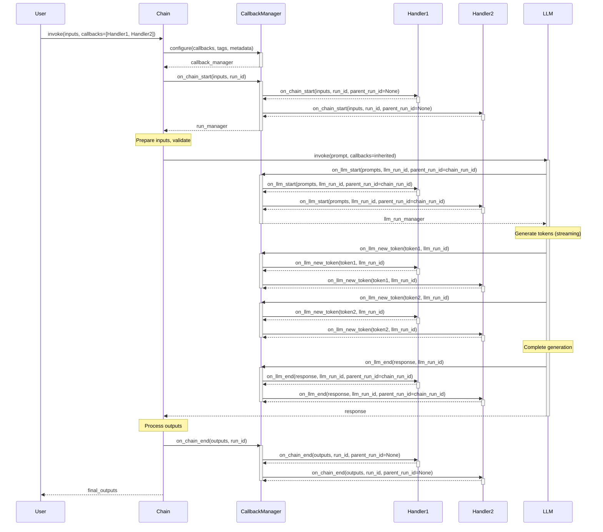

# Callback System Architecture

## Overview

The LangChain callback system provides a powerful mechanism for observability, tracing, and extending the behavior of chains, LLMs, tools, retrievers, and agents. Callbacks enable you to hook into various stages of execution to log events, collect metrics, stream outputs, debug issues, or integrate with external monitoring systems.

**Key Capabilities:**

- **Observability**: Track chain execution flow, LLM calls, tool invocations, and retriever operations
- **Streaming**: Receive token-by-token updates from LLM responses in real-time
- **Debugging**: Capture intermediate results, timing information, and error details
- **Integration**: Connect to external logging, monitoring, and tracing platforms
- **Custom Logic**: Execute custom code at specific points in the execution lifecycle

**Core Components:**

1. **Callback Handlers**: Classes that implement callback methods for specific events
2. **Callback Managers**: Orchestrate multiple handlers and manage callback propagation
3. **Run Managers**: Provide scoped callback execution for specific operations
4. **Configuration**: Pass callbacks through `RunnableConfig` for LCEL chains

Source: libs/core/langchain_core/callbacks/base.py, libs/core/langchain_core/callbacks/manager.py

## Callback Handler Interfaces

### BaseCallbackHandler

The `BaseCallbackHandler` class is the foundation for all callback handlers. It provides methods for every event type in the LangChain execution lifecycle.

**Key Properties:**

```python
raise_error: bool = False
# Whether to raise exceptions that occur in callback methods

run_inline: bool = False
# Whether to run callbacks synchronously in the main execution flow
```

**Ignore Properties** (control which events the handler processes):

- `ignore_llm`: Skip LLM-related events
- `ignore_chain`: Skip chain-related events
- `ignore_agent`: Skip agent-related events
- `ignore_retriever`: Skip retriever-related events
- `ignore_chat_model`: Skip chat model-related events
- `ignore_retry`: Skip retry events
- `ignore_custom_event`: Skip custom events

Source: libs/core/langchain_core/callbacks/base.py:426-476

### AsyncCallbackHandler

The `AsyncCallbackHandler` extends `BaseCallbackHandler` with async/await support for all callback methods. Use this when your callback logic involves asynchronous operations (e.g., async database writes, HTTP requests).

**Key Differences from BaseCallbackHandler:**

- All callback methods are `async def` instead of `def`
- Methods must be awaited when called
- Supports concurrent execution of callbacks without blocking

Source: libs/core/langchain_core/callbacks/base.py:478

## Lifecycle Events

### Chain Events

Chain events fire during the execution of any chain or runnable sequence.

**on_chain_start**

Invoked when a chain begins execution, before any processing occurs.

```python
def on_chain_start(
    self,
    serialized: dict[str, Any],
    inputs: dict[str, Any],
    *,
    run_id: UUID,
    parent_run_id: UUID | None = None,
    tags: list[str] | None = None,
    metadata: dict[str, Any] | None = None,
    **kwargs: Any,
) -> Any:
    """Run when a chain starts running.
    
    Args:
        serialized: Serialized representation of the chain
        inputs: Input dictionary to the chain
        run_id: Unique identifier for this chain run
        parent_run_id: ID of parent run if this is a nested chain
        tags: Tags associated with the chain execution
        metadata: Additional metadata for the chain execution
    """
```

**on_chain_end**

Invoked when a chain completes successfully.

```python
def on_chain_end(
    self,
    outputs: dict[str, Any],
    *,
    run_id: UUID,
    parent_run_id: UUID | None = None,
    **kwargs: Any,
) -> Any:
    """Run when chain ends running.
    
    Args:
        outputs: Output dictionary from the chain
        run_id: Unique identifier for this chain run
        parent_run_id: ID of parent run if this is a nested chain
    """
```

**on_chain_error**

Invoked when a chain encounters an error during execution.

```python
def on_chain_error(
    self,
    error: BaseException,
    *,
    run_id: UUID,
    parent_run_id: UUID | None = None,
    **kwargs: Any,
) -> Any:
    """Run when chain errors.
    
    Args:
        error: The exception that occurred
        run_id: Unique identifier for this chain run
        parent_run_id: ID of parent run if this is a nested chain
    """
```

Source: libs/core/langchain_core/callbacks/base.py:316-338, 124-156

### LLM Events

LLM events track interactions with language models, including both traditional LLMs and chat models.

**on_llm_start**

Invoked when an LLM (non-chat model) begins processing.

```python
def on_llm_start(
    self,
    serialized: dict[str, Any],
    prompts: list[str],
    *,
    run_id: UUID,
    parent_run_id: UUID | None = None,
    tags: list[str] | None = None,
    metadata: dict[str, Any] | None = None,
    **kwargs: Any,
) -> Any:
    """Run when LLM starts running.
    
    Args:
        serialized: Serialized representation of the LLM
        prompts: List of prompt strings sent to the LLM
        run_id: Unique identifier for this LLM run
        parent_run_id: ID of parent run (e.g., the calling chain)
        tags: Tags associated with the LLM call
        metadata: Additional metadata for the LLM call
    """
```

**on_chat_model_start**

Invoked when a chat model begins processing.

```python
def on_chat_model_start(
    self,
    serialized: dict[str, Any],
    messages: list[list[BaseMessage]],
    *,
    run_id: UUID,
    parent_run_id: UUID | None = None,
    tags: list[str] | None = None,
    metadata: dict[str, Any] | None = None,
    **kwargs: Any,
) -> Any:
    """Run when a chat model starts running.
    
    Args:
        serialized: Serialized representation of the chat model
        messages: List of message lists sent to the chat model
        run_id: Unique identifier for this chat model run
        parent_run_id: ID of parent run (e.g., the calling chain)
        tags: Tags associated with the chat model call
        metadata: Additional metadata for the chat model call
    """
```

**on_llm_new_token**

Invoked each time the LLM generates a new token (only available when streaming is enabled).

```python
def on_llm_new_token(
    self,
    token: str,
    *,
    chunk: GenerationChunk | ChatGenerationChunk | None = None,
    run_id: UUID,
    parent_run_id: UUID | None = None,
    **kwargs: Any,
) -> Any:
    """Run on new output token (streaming only).
    
    Args:
        token: The new token string
        chunk: Full generation chunk with content and metadata
        run_id: Unique identifier for this LLM run
        parent_run_id: ID of parent run
    """
```

**on_llm_end**

Invoked when the LLM completes successfully.

```python
def on_llm_end(
    self,
    response: LLMResult,
    *,
    run_id: UUID,
    parent_run_id: UUID | None = None,
    **kwargs: Any,
) -> Any:
    """Run when LLM ends running.
    
    Args:
        response: The complete LLM response with generations
        run_id: Unique identifier for this LLM run
        parent_run_id: ID of parent run
    """
```

**on_llm_error**

Invoked when the LLM encounters an error.

```python
def on_llm_error(
    self,
    error: BaseException,
    *,
    run_id: UUID,
    parent_run_id: UUID | None = None,
    **kwargs: Any,
) -> Any:
    """Run when LLM errors.
    
    Args:
        error: The exception that occurred
        run_id: Unique identifier for this LLM run
        parent_run_id: ID of parent run
    """
```

Source: libs/core/langchain_core/callbacks/base.py:234-260, 262-291, 65-119

### Tool Events

Tool events track agent tool executions.

**on_tool_start**

Invoked when a tool begins execution.

```python
def on_tool_start(
    self,
    serialized: dict[str, Any],
    input_str: str,
    *,
    run_id: UUID,
    parent_run_id: UUID | None = None,
    tags: list[str] | None = None,
    metadata: dict[str, Any] | None = None,
    inputs: dict[str, Any] | None = None,
    **kwargs: Any,
) -> Any:
    """Run when the tool starts running.
    
    Args:
        serialized: Serialized representation of the tool
        input_str: String input to the tool
        run_id: Unique identifier for this tool run
        parent_run_id: ID of parent run (typically the agent)
        tags: Tags associated with the tool execution
        metadata: Additional metadata for the tool execution
        inputs: Full input dictionary if available
    """
```

**on_tool_end**

Invoked when a tool completes successfully.

```python
def on_tool_end(
    self,
    output: Any,
    *,
    run_id: UUID,
    parent_run_id: UUID | None = None,
    **kwargs: Any,
) -> Any:
    """Run when the tool ends running.
    
    Args:
        output: The tool's output (any type)
        run_id: Unique identifier for this tool run
        parent_run_id: ID of parent run
    """
```

**on_tool_error**

Invoked when a tool encounters an error.

```python
def on_tool_error(
    self,
    error: BaseException,
    *,
    run_id: UUID,
    parent_run_id: UUID | None = None,
    **kwargs: Any,
) -> Any:
    """Run when tool errors.
    
    Args:
        error: The exception that occurred
        run_id: Unique identifier for this tool run
        parent_run_id: ID of parent run
    """
```

Source: libs/core/langchain_core/callbacks/base.py:339-363, 196-228

### Retriever Events

Retriever events track document retrieval operations.

**on_retriever_start**

Invoked when a retriever begins fetching documents.

```python
def on_retriever_start(
    self,
    serialized: dict[str, Any],
    query: str,
    *,
    run_id: UUID,
    parent_run_id: UUID | None = None,
    tags: list[str] | None = None,
    metadata: dict[str, Any] | None = None,
    **kwargs: Any,
) -> Any:
    """Run when the Retriever starts running.
    
    Args:
        serialized: Serialized representation of the retriever
        query: The query string
        run_id: Unique identifier for this retriever run
        parent_run_id: ID of parent run
        tags: Tags associated with the retrieval
        metadata: Additional metadata for the retrieval
    """
```

**on_retriever_end**

Invoked when a retriever successfully returns documents.

```python
def on_retriever_end(
    self,
    documents: Sequence[Document],
    *,
    run_id: UUID,
    parent_run_id: UUID | None = None,
    **kwargs: Any,
) -> Any:
    """Run when Retriever ends running.
    
    Args:
        documents: List of retrieved documents
        run_id: Unique identifier for this retriever run
        parent_run_id: ID of parent run
    """
```

**on_retriever_error**

Invoked when a retriever encounters an error.

```python
def on_retriever_error(
    self,
    error: BaseException,
    *,
    run_id: UUID,
    parent_run_id: UUID | None = None,
    **kwargs: Any,
) -> Any:
    """Run when Retriever errors.
    
    Args:
        error: The exception that occurred
        run_id: Unique identifier for this retriever run
        parent_run_id: ID of parent run
    """
```

Source: libs/core/langchain_core/callbacks/base.py:293-315, 24-60

### Agent Events

Agent events track agent reasoning and decision-making.

**on_agent_action**

Invoked when an agent decides to take an action (e.g., call a tool).

```python
def on_agent_action(
    self,
    action: AgentAction,
    *,
    run_id: UUID,
    parent_run_id: UUID | None = None,
    **kwargs: Any,
) -> Any:
    """Run on agent action.
    
    Args:
        action: The agent action containing tool, tool_input, and log
        run_id: Unique identifier for this agent run
        parent_run_id: ID of parent run
    """
```

**on_agent_finish**

Invoked when an agent completes its reasoning and provides a final answer.

```python
def on_agent_finish(
    self,
    finish: AgentFinish,
    *,
    run_id: UUID,
    parent_run_id: UUID | None = None,
    **kwargs: Any,
) -> Any:
    """Run on the agent end.
    
    Args:
        finish: The agent finish containing return values and log
        run_id: Unique identifier for this agent run
        parent_run_id: ID of parent run
    """
```

Source: libs/core/langchain_core/callbacks/base.py:158-190

### Additional Events

**on_text**

Invoked for arbitrary text outputs during execution.

```python
def on_text(
    self,
    text: str,
    *,
    run_id: UUID,
    parent_run_id: UUID | None = None,
    **kwargs: Any,
) -> Any:
    """Run on arbitrary text.
    
    Args:
        text: The text content
        run_id: Unique identifier for the current run
        parent_run_id: ID of parent run
    """
```

**on_retry**

Invoked when a retry operation occurs (e.g., with tenacity retry logic).

```python
def on_retry(
    self,
    retry_state: RetryCallState,
    *,
    run_id: UUID,
    parent_run_id: UUID | None = None,
    **kwargs: Any,
) -> Any:
    """Run on a retry event.
    
    Args:
        retry_state: State information about the retry
        run_id: Unique identifier for the current run
        parent_run_id: ID of parent run
    """
```

**on_custom_event**

Invoked for custom events defined by your application.

```python
def on_custom_event(
    self,
    name: str,
    data: Any,
    *,
    run_id: UUID,
    tags: list[str] | None = None,
    metadata: dict[str, Any] | None = None,
    **kwargs: Any,
) -> Any:
    """Override to define a handler for a custom event.
    
    Args:
        name: The name of the custom event
        data: Event data (format specified by user)
        run_id: Unique identifier for the current run
        tags: Tags associated with the custom event
        metadata: Metadata associated with the custom event
    """
```

Source: libs/core/langchain_core/callbacks/base.py:368-424

## Callback Managers

Callback managers orchestrate the execution of multiple callback handlers. They handle callback configuration, propagation through nested operations, and exception management.

### CallbackManager

The `CallbackManager` coordinates synchronous callback handlers.

**Key Responsibilities:**

- Manage a list of callback handlers
- Configure callback propagation (callbacks, tags, metadata)
- Create run managers for scoped execution
- Handle exceptions in callback methods gracefully

**Configuration Method:**

```python
CallbackManager.configure(
    callbacks: Callbacks = None,
    inheritable_callbacks: Callbacks = None,
    verbose: bool = False,
    tags: list[str] | None = None,
    inheritable_tags: list[str] | None = None,
    metadata: dict[str, Any] | None = None,
    inheritable_metadata: dict[str, Any] | None = None,
)
```

**Usage in Chain Execution:**

```python
callback_manager = CallbackManager.configure(
    callbacks=self.callbacks,
    verbose=self.verbose,
    tags=tags,
    metadata=metadata,
)

run_manager = callback_manager.on_chain_start(
    serialized=None,
    inputs=inputs,
    run_id=run_id,
    name=run_name,
)
```

Source: libs/core/langchain_core/callbacks/manager.py, libs/langchain/langchain_classic/chains/base.py:203-218

### AsyncCallbackManager

The `AsyncCallbackManager` coordinates asynchronous callback handlers with the same responsibilities as `CallbackManager` but with async/await support.

**Key Differences:**

- All callback methods return coroutines
- Callbacks can execute concurrently
- Handles both sync and async callback handlers
- Manages event loop interactions

Source: libs/core/langchain_core/callbacks/manager.py

## Run Managers

Run managers provide scoped callback execution for specific operation types. They are created by callback managers and passed to the execution methods of chains, LLMs, tools, and retrievers.

### CallbackManagerForChainRun

Manages callbacks during a chain execution.

**Available Methods:**

- `on_chain_end(outputs)`: Signal successful chain completion
- `on_chain_error(error)`: Signal chain error
- `on_text(text)`: Log arbitrary text
- `on_agent_action(action)`: Signal agent action
- `on_agent_finish(finish)`: Signal agent completion

**Usage Pattern:**

```python
def _call(
    self,
    inputs: dict[str, Any],
    run_manager: CallbackManagerForChainRun | None = None,
) -> dict[str, Any]:
    # Chain logic here
    outputs = {"result": "value"}
    
    # Callbacks are automatically triggered by the framework
    # No manual on_chain_end call needed
    return outputs
```

Source: libs/core/langchain_core/callbacks/manager.py:842, libs/langchain/langchain_classic/chains/base.py:318-338

### CallbackManagerForLLMRun

Manages callbacks during an LLM execution.

**Available Methods:**

- `on_llm_new_token(token, chunk=None)`: Signal new token generation (streaming)
- `on_llm_end(response)`: Signal successful LLM completion
- `on_llm_error(error)`: Signal LLM error

**Streaming Usage:**

```python
async def _astream(
    self,
    prompt: str,
    run_manager: AsyncCallbackManagerForLLMRun | None = None,
) -> AsyncIterator[str]:
    for token in generate_tokens(prompt):
        if run_manager:
            await run_manager.on_llm_new_token(token)
        yield token
```

Source: libs/core/langchain_core/callbacks/manager.py:660-737, 739-839

### CallbackManagerForToolRun

Manages callbacks during a tool execution.

**Available Methods:**

- `on_tool_end(output)`: Signal successful tool completion
- `on_tool_error(error)`: Signal tool error

**Usage Pattern:**

```python
def _run(
    self,
    query: str,
    run_manager: CallbackManagerForToolRun | None = None,
) -> str:
    try:
        result = execute_tool_logic(query)
        # Framework handles on_tool_end automatically
        return result
    except Exception as e:
        # Framework handles on_tool_error automatically
        raise
```

Source: libs/core/langchain_core/callbacks/manager.py

### CallbackManagerForRetrieverRun

Manages callbacks during a retriever execution.

**Available Methods:**

- `on_retriever_end(documents)`: Signal successful document retrieval
- `on_retriever_error(error)`: Signal retriever error

Source: libs/core/langchain_core/callbacks/manager.py

### Async Run Managers

Each synchronous run manager has an async equivalent:

- `AsyncCallbackManagerForChainRun`
- `AsyncCallbackManagerForLLMRun`
- `AsyncCallbackManagerForToolRun`
- `AsyncCallbackManagerForRetrieverRun`

These provide the same methods as their synchronous counterparts but return coroutines that must be awaited.

Source: libs/core/langchain_core/callbacks/manager.py

## Configuration and Propagation

### Passing Callbacks via RunnableConfig

LCEL chains accept callbacks through the `RunnableConfig` parameter:

```python
from langchain_core.runnables import RunnableConfig

config = RunnableConfig(
    callbacks=[my_handler],
    tags=["my-chain", "production"],
    metadata={"user_id": "12345"},
)

chain = prompt | llm | parser
result = chain.invoke({"input": "Hello"}, config=config)
```

**RunnableConfig Callback Fields:**

- `callbacks`: List of callback handlers or a callback manager
- `tags`: List of tags for the run (inheritable to nested operations)
- `metadata`: Dictionary of metadata (inheritable to nested operations)

Source: libs/core/langchain_core/runnables/config.py

### Callback Inheritance

Callbacks, tags, and metadata are automatically propagated to nested operations:

```
Chain A (callbacks=[handler1], tags=["main"])
  └─> Chain B (inherits: callbacks=[handler1], tags=["main"])
       └─> LLM Call (inherits: callbacks=[handler1], tags=["main"])
```

**Inheritable vs Non-Inheritable:**

- **Inheritable**: Tags and metadata propagate to all child operations
- **Non-Inheritable**: Callbacks are specific to the operation where they're defined (but handlers see all events via run_id hierarchy)

Source: libs/core/langchain_core/callbacks/manager.py:203-218

### Legacy Chain Callbacks

Classic chains also accept callbacks via constructor or method parameters:

```python
from langchain_classic.chains import LLMChain

# Constructor-level callbacks (apply to all invocations)
chain = LLMChain(
    llm=llm,
    prompt=prompt,
    callbacks=[my_handler],
    tags=["legacy-chain"],
)

# Method-level callbacks (apply to single invocation)
result = chain.invoke(
    {"input": "Hello"},
    config={"callbacks": [another_handler]}
)
```

Source: libs/langchain/langchain_classic/chains/base.py:82-87

## Callback Event Flow

The following sequence diagram illustrates the complete callback event flow during a chain execution that calls an LLM:



**Event Flow Notes:**

1. **Initialization**: `CallbackManager.configure()` creates a manager with the provided handlers
2. **Chain Start**: `on_chain_start()` fires before any chain logic, providing `run_id`
3. **Nested Operations**: LLM calls inherit callbacks and set `parent_run_id=chain_run_id`
4. **Token Streaming**: `on_llm_new_token()` fires for each token when streaming is enabled
5. **Completion**: `on_llm_end()` fires after LLM completes, then `on_chain_end()` fires after chain completes
6. **Error Handling**: If any operation fails, `on_*_error()` fires instead of `on_*_end()`
7. **Parallel Execution**: Multiple handlers receive events concurrently (async mode) or sequentially (sync mode)

## Best Practices

### Implementing Custom Handlers

**Minimal Handler Example:**

```python
from langchain_core.callbacks.base import BaseCallbackHandler
from typing import Any
from uuid import UUID

class MyCustomHandler(BaseCallbackHandler):
    """Custom handler for logging chain execution."""
    
    def on_chain_start(
        self,
        serialized: dict[str, Any],
        inputs: dict[str, Any],
        *,
        run_id: UUID,
        **kwargs: Any,
    ) -> None:
        print(f"Chain started: {run_id}")
        print(f"Inputs: {inputs}")
    
    def on_chain_end(
        self,
        outputs: dict[str, Any],
        *,
        run_id: UUID,
        **kwargs: Any,
    ) -> None:
        print(f"Chain ended: {run_id}")
        print(f"Outputs: {outputs}")
    
    def on_llm_start(
        self,
        serialized: dict[str, Any],
        prompts: list[str],
        *,
        run_id: UUID,
        **kwargs: Any,
    ) -> None:
        print(f"LLM called with prompts: {prompts}")
```

### Async Handler Example

```python
from langchain_core.callbacks.base import AsyncCallbackHandler
import aiofiles

class AsyncFileLogHandler(AsyncCallbackHandler):
    """Async handler that writes logs to a file."""
    
    def __init__(self, log_file: str):
        self.log_file = log_file
    
    async def on_chain_start(
        self,
        serialized: dict[str, Any],
        inputs: dict[str, Any],
        *,
        run_id: UUID,
        **kwargs: Any,
    ) -> None:
        async with aiofiles.open(self.log_file, mode='a') as f:
            await f.write(f"Chain {run_id} started with inputs: {inputs}\n")
    
    async def on_llm_new_token(
        self,
        token: str,
        *,
        run_id: UUID,
        **kwargs: Any,
    ) -> None:
        # Stream tokens to file as they arrive
        async with aiofiles.open(self.log_file, mode='a') as f:
            await f.write(token)
```

### Error Handling

**Set `raise_error=True` for Critical Handlers:**

```python
class CriticalMetricsHandler(BaseCallbackHandler):
    raise_error = True  # Fail the chain if metrics cannot be recorded
    
    def on_chain_end(self, outputs: dict[str, Any], **kwargs: Any) -> None:
        # If this raises an exception, the entire chain will fail
        record_metrics_to_database(outputs)
```

**Set `raise_error=False` for Non-Critical Handlers:**

```python
class BestEffortLoggingHandler(BaseCallbackHandler):
    raise_error = False  # Don't fail the chain if logging fails
    
    def on_chain_end(self, outputs: dict[str, Any], **kwargs: Any) -> None:
        # If this raises an exception, it will be logged but won't fail the chain
        log_to_external_service(outputs)
```

### Performance Considerations

**Use `run_inline=False` for Expensive Operations:**

```python
class ExpensiveHandler(BaseCallbackHandler):
    run_inline = False  # Run in thread pool executor (sync) or task (async)
    
    def on_llm_end(self, response: LLMResult, **kwargs: Any) -> None:
        # Expensive operation won't block main execution
        send_to_analytics_platform(response)
```

**Use Ignore Properties to Filter Events:**

```python
class LLMOnlyHandler(BaseCallbackHandler):
    @property
    def ignore_chain(self) -> bool:
        return True  # Skip all chain events
    
    @property
    def ignore_agent(self) -> bool:
        return True  # Skip all agent events
    
    # Only LLM events will be processed
    def on_llm_start(self, serialized, prompts, **kwargs):
        track_llm_call(prompts)
```

## Related Documentation

- [Chain Lifecycle](./chain-lifecycle.md) - Detailed chain execution flow
- [Custom Callback Implementation Guide](../guides/callbacks.md) - Step-by-step callback development
- [Debugging Guide](../debugging/logging.md) - Using callbacks for debugging
- [LCEL Guide](../guides/lcel-composition.md) - Passing callbacks to LCEL chains

## Example: Complete Custom Callback Handler

See [examples/debugging/callback_debugger.py](../../examples/debugging/callback_debugger.py) for a complete, executable example of a custom callback handler that captures all events for debugging purposes.
