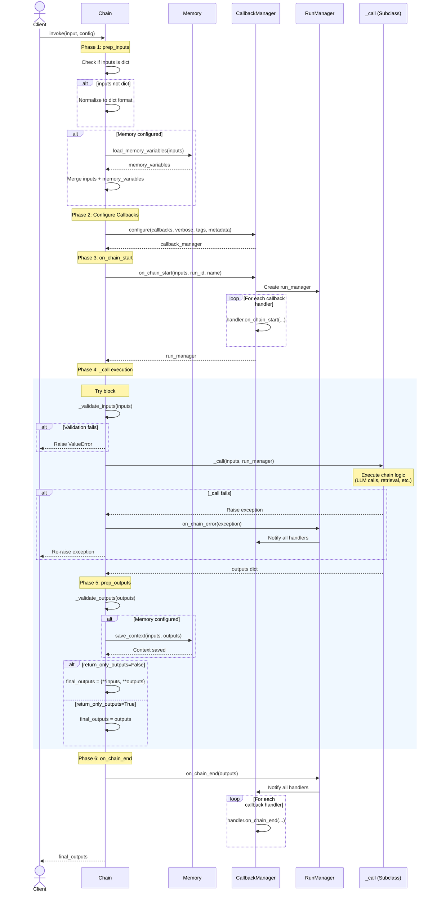

# Chain Execution Lifecycle

## Overview

The Chain execution lifecycle defines the complete flow from chain invocation to final output. Understanding this lifecycle is critical for:

- **Debugging chain failures**: Identify which lifecycle phase is causing issues
- **Implementing custom chains**: Know which methods to override and their responsibilities
- **Integrating callbacks**: Understand when callback events fire
- **Managing memory**: Know when memory loads and saves occur
- **Error handling**: Comprehend exception propagation through the lifecycle

This document provides a comprehensive reference for the Chain base class execution flow, covering both synchronous and asynchronous execution paths.

**Source**: `libs/langchain/langchain_classic/chains/base.py`

## Chain Base Class Foundation

The `Chain` class is the abstract base class for all LangChain chains. It extends `RunnableSerializable[dict[str, Any], dict[str, Any]]`, making chains compatible with the LCEL (LangChain Expression Language) composition system.

**Key Characteristics**:

- **Type signature**: `Chain` accepts `dict[str, Any]` as input and returns `dict[str, Any]` as output
- **Abstract methods**: Subclasses must implement `_call()`, `input_keys`, and `output_keys`
- **Memory integration**: Optional `memory` attribute for stateful chains
- **Callback support**: Built-in callback manager integration for observability
- **Dual API**: Both synchronous (`invoke`) and asynchronous (`ainvoke`) execution paths

**Source**: `libs/langchain/langchain_classic/chains/base.py:52-73`

## Lifecycle Phases

The chain execution lifecycle consists of six distinct phases executed in sequence:

### 1. Input Preparation (prep_inputs)

**Purpose**: Normalize and enrich input data before chain execution.

**Responsibilities**:
- **Input normalization**: Convert single-value inputs to dict format
- **Memory variable loading**: Retrieve conversation history or context from memory
- **Input merging**: Combine raw inputs with memory-provided variables

**Method Signature**:
```python
def prep_inputs(self, inputs: dict[str, Any] | Any) -> dict[str, str]:
    """Prepare chain inputs, including adding inputs from memory.
    
    Args:
        inputs: Dictionary of raw inputs, or single input if chain expects
            only one param. Should contain all inputs specified in
            `Chain.input_keys` except for inputs that will be set by the chain's
            memory.
    
    Returns:
        A dictionary of all inputs, including those added by the chain's memory.
    """
```

**Execution Flow**:

1. **Input Type Check**: If input is not a dict, determine the expected input key
   - Examines `self.input_keys` to find expected keys
   - If memory is configured, subtracts memory-provided keys to find user-provided key
   - Wraps single value in dict: `{input_key: value}`

2. **Memory Loading** (if memory is configured):
   - Calls `self.memory.load_memory_variables(inputs)`
   - Merges memory variables into inputs dict
   - Common memory variables: `history`, `context`, `chat_history`

3. **Return Merged Inputs**: Returns dict containing both user inputs and memory variables

**Example**:
```python
# User provides: {"question": "What is AI?"}
# Memory provides: {"history": "Previous: User asked about ML..."}
# Result: {"question": "What is AI?", "history": "Previous: User asked about ML..."}
```

**Source**: `libs/langchain/langchain_classic/chains/base.py:521-543`

**Async Variant**: `aprep_inputs()` (lines 545-567) follows identical logic using `await self.memory.aload_memory_variables()`

### 2. Callback Manager Configuration

**Purpose**: Set up callback handlers for observability and logging throughout chain execution.

**Responsibilities**:
- **Callback merging**: Combine runtime callbacks with chain-configured callbacks
- **Verbosity handling**: Respect chain's verbose setting for logging
- **Tag/metadata propagation**: Merge tags and metadata from multiple sources
- **Run manager creation**: Create callback manager instance for this execution

**Configuration Sources** (in priority order):

1. Runtime config callbacks (passed to `invoke()`)
2. Chain instance callbacks (`self.callbacks`)
3. Global verbosity setting (`self.verbose`)
4. Runtime tags/metadata
5. Chain instance tags/metadata (`self.tags`, `self.metadata`)

**Code**:
```python
callback_manager = CallbackManager.configure(
    callbacks,           # Runtime callbacks
    self.callbacks,      # Chain instance callbacks
    self.verbose,        # Verbosity flag
    tags,                # Runtime tags
    self.tags,           # Chain instance tags
    metadata,            # Runtime metadata
    self.metadata,       # Chain instance metadata
)
```

**Source**: `libs/langchain/langchain_classic/chains/base.py:147-155`

**Async Variant**: Uses `AsyncCallbackManager.configure()` with identical parameters (line 203-211)

### 3. Chain Start Callback (on_chain_start)

**Purpose**: Notify callback handlers that chain execution is beginning.

**Responsibilities**:
- **Tracing initialization**: Start trace for this chain run
- **Logging**: Log chain start with inputs and metadata
- **Run manager creation**: Return `CallbackManagerForChainRun` instance
- **Run ID assignment**: Generate or use provided run ID for tracking

**Method Call**:
```python
run_manager = callback_manager.on_chain_start(
    None,        # Serialized chain (deprecated parameter)
    inputs,      # Prepared inputs dict
    run_id,      # Optional run ID for tracking
    name=run_name,  # Chain name for logging
)
```

**Callback Payload**:
- **inputs**: Complete input dict (after prep_inputs)
- **run_name**: Chain name (from config or `self.get_name()`)
- **run_id**: Unique identifier for this execution
- **tags**: Merged list of tags
- **metadata**: Merged metadata dict

**Common Use Cases**:
- **Logging callbacks**: Write chain start event to logs
- **Tracing callbacks**: Start span in distributed trace
- **Metrics callbacks**: Record chain invocation counter
- **Debug callbacks**: Print inputs for debugging

**Source**: `libs/langchain/langchain_classic/chains/base.py:158-163`

**Async Variant**: `await callback_manager.on_chain_start(...)` (lines 213-218)

### 4. Core Chain Execution (_call)

**Purpose**: Execute the chain's core logic to transform inputs into outputs.

**Responsibilities**:
- **Input validation**: Verify all required input keys are present
- **Business logic**: Implement chain-specific transformation
- **Output generation**: Produce dict with all required output keys
- **Error handling**: Raise exceptions for execution failures

**Abstract Method Signature**:
```python
@abstractmethod
def _call(
    self,
    inputs: dict[str, Any],
    run_manager: CallbackManagerForChainRun | None = None,
) -> dict[str, Any]:
    """Execute the chain.
    
    This is a private method that is not user-facing. It is only called within
    `Chain.__call__`, which is the user-facing wrapper method that handles
    callbacks configuration and some input/output processing.
    
    Args:
        inputs: A dict of named inputs to the chain. Assumed to contain all inputs
            specified in `Chain.input_keys`, including any inputs added by memory.
        run_manager: The callbacks manager that contains the callback handlers for
            this run of the chain.
    
    Returns:
        A dict of named outputs. Should contain all outputs specified in
            `Chain.output_keys`.
    """
```

**Execution Flow**:

1. **Input Validation**: `self._validate_inputs(inputs)` - checks all required keys present
2. **Signature Detection**: Inspect `_call` signature to determine if it accepts `run_manager`
3. **Call Execution**:
   - If `run_manager` parameter exists: `self._call(inputs, run_manager=run_manager)`
   - Otherwise (legacy chains): `self._call(inputs)`
4. **Return Outputs**: Dict containing all keys specified in `self.output_keys`

**Run Manager Usage in _call**:

Subclasses can use the `run_manager` parameter to:
- Emit intermediate callbacks (e.g., `on_llm_start`, `on_llm_end`)
- Log progress for long-running operations
- Propagate callbacks to nested chain/LLM calls

**Example Implementation** (from a hypothetical chain):
```python
def _call(
    self,
    inputs: dict[str, Any],
    run_manager: CallbackManagerForChainRun | None = None,
) -> dict[str, Any]:
    question = inputs["question"]
    
    # Use run_manager to notify about LLM call
    if run_manager:
        run_manager.on_text("Processing question...")
    
    # Core logic
    result = self.llm.predict(question)
    
    return {"answer": result}
```

**Source**: `libs/langchain/langchain_classic/chains/base.py:317-338` (abstract method), `lines 164-170` (invocation)

**Async Variant**: `_acall()` (lines 340-366) - by default runs `_call()` in executor, but can be overridden for native async

### 5. Output Preparation (prep_outputs)

**Purpose**: Validate outputs and save execution context to memory.

**Responsibilities**:
- **Output validation**: Verify all required output keys are present
- **Memory saving**: Store inputs/outputs in memory for future context
- **Input/output merging**: Optionally combine inputs with outputs
- **Final output formatting**: Return the final result dict

**Method Signature**:
```python
def prep_outputs(
    self,
    inputs: dict[str, str],
    outputs: dict[str, str],
    return_only_outputs: bool = False,
) -> dict[str, str]:
    """Validate and prepare chain outputs, and save info about this run to memory.
    
    Args:
        inputs: Dictionary of chain inputs, including any inputs added by chain
            memory.
        outputs: Dictionary of initial chain outputs.
        return_only_outputs: Whether to only return the chain outputs. If `False`,
            inputs are also added to the final outputs.
    
    Returns:
        A dict of the final chain outputs.
    """
```

**Execution Flow**:

1. **Output Validation**: `self._validate_outputs(outputs)` - checks all required keys present
2. **Memory Saving** (if memory is configured):
   - Calls `self.memory.save_context(inputs, outputs)`
   - Stores conversation turn for future retrieval
   - Example: ConversationBufferMemory appends to history list
3. **Output Formatting**:
   - If `return_only_outputs=True`: Return only `outputs` dict
   - If `return_only_outputs=False`: Return `{**inputs, **outputs}` (merged dict)

**Memory Saving Example**:
```python
# After chain execution:
# inputs: {"question": "What is AI?", "history": "..."}
# outputs: {"answer": "AI is artificial intelligence..."}
# Memory stores: HumanMessage("What is AI?") + AIMessage("AI is artificial intelligence...")
```

**Source**: `libs/langchain/langchain_classic/chains/base.py:471-494`

**Async Variant**: `aprep_outputs()` (lines 496-519) uses `await self.memory.asave_context()`

### 6. Chain End Callback (on_chain_end)

**Purpose**: Notify callback handlers that chain execution completed successfully.

**Responsibilities**:
- **Completion notification**: Signal successful chain execution
- **Output logging**: Log final outputs
- **Trace finalization**: End trace span for this chain run
- **Metrics recording**: Record execution time, success metrics

**Method Call**:
```python
run_manager.on_chain_end(outputs)
```

**Callback Payload**:
- **outputs**: Raw outputs from `_call()` (before prep_outputs merging)

**Common Use Cases**:
- **Logging callbacks**: Write chain completion event with outputs
- **Tracing callbacks**: End span with success status
- **Metrics callbacks**: Record chain execution time
- **Debug callbacks**: Print outputs for debugging

**Timing**: Called AFTER `_call()` completes but BEFORE `prep_outputs()` (memory saving happens after callback)

**Source**: `libs/langchain/langchain_classic/chains/base.py:180`

**Async Variant**: `await run_manager.on_chain_end(outputs)` (line 234)

## Error Handling Flow

When an exception occurs during chain execution, the lifecycle handles it through a try/except block:

**Error Handling Code**:
```python
try:
    self._validate_inputs(inputs)
    outputs = (
        self._call(inputs, run_manager=run_manager)
        if new_arg_supported
        else self._call(inputs)
    )
    final_outputs: dict[str, Any] = self.prep_outputs(
        inputs,
        outputs,
        return_only_outputs,
    )
except BaseException as e:
    run_manager.on_chain_error(e)
    raise
run_manager.on_chain_end(outputs)
```

**Error Callback (on_chain_error)**:

**Purpose**: Notify callback handlers that chain execution failed.

**Responsibilities**:
- **Error notification**: Signal chain execution failure
- **Exception logging**: Log exception details and stack trace
- **Trace error marking**: Mark trace span as failed
- **Cleanup**: Allow callbacks to perform cleanup actions

**Method Call**: `run_manager.on_chain_error(e)`

**Exception Propagation**: After calling `on_chain_error`, the original exception is re-raised (`raise`)

**Error Scenarios**:
- **Input validation failure**: Missing required input keys
- **_call execution error**: Business logic failure (API errors, timeouts, etc.)
- **Output validation failure**: Missing required output keys
- **Memory errors**: Memory load/save failures
- **Callback errors**: Exceptions in callback handlers themselves

**Source**: `libs/langchain/langchain_classic/chains/base.py:177-179`

**Async Variant**: `await run_manager.on_chain_error(e)` (line 232-233)

## Complete Lifecycle Sequence Diagram

The following Mermaid sequence diagram illustrates the complete chain execution lifecycle with all components and their interactions:



**Diagram Key**:

- **Blue rectangle**: Try/except error handling scope
- **alt blocks**: Conditional logic branches
- **loop blocks**: Iteration over multiple items
- **Notes**: Lifecycle phase indicators

## Synchronous vs Asynchronous Execution

The Chain class provides dual execution paths: synchronous (`invoke`) and asynchronous (`ainvoke`).

### Synchronous Execution (invoke)

**Method**: `Chain.invoke(input, config, **kwargs)`

**Characteristics**:
- **Blocking**: Waits for chain execution to complete
- **Thread-safe**: Can be called from any thread
- **Simple**: No event loop or async/await required
- **Use case**: Scripts, notebooks, synchronous web frameworks

**Lifecycle Methods**:
- `prep_inputs()` - synchronous input preparation
- `_call()` - synchronous chain execution
- `prep_outputs()` - synchronous output preparation
- `memory.load_memory_variables()` / `memory.save_context()` - synchronous memory operations

**Source**: `libs/langchain/langchain_classic/chains/base.py:131-184`

### Asynchronous Execution (ainvoke)

**Method**: `Chain.ainvoke(input, config, **kwargs)`

**Characteristics**:
- **Non-blocking**: Returns awaitable coroutine
- **Event loop required**: Must be called with `await` in async context
- **Concurrent**: Enables parallel chain execution
- **Use case**: Async web frameworks (FastAPI, aiohttp), concurrent processing

**Lifecycle Methods**:
- `aprep_inputs()` - async input preparation with `await`
- `_acall()` - async chain execution
- `aprep_outputs()` - async output preparation with `await`
- `memory.aload_memory_variables()` / `memory.asave_context()` - async memory operations

**Default _acall Implementation**:

By default, `_acall()` runs the synchronous `_call()` in a thread pool executor:

```python
async def _acall(
    self,
    inputs: dict[str, Any],
    run_manager: AsyncCallbackManagerForChainRun | None = None,
) -> dict[str, Any]:
    """Default async implementation runs sync _call in executor."""
    return await run_in_executor(
        None,
        self._call,
        inputs,
        run_manager.get_sync() if run_manager else None,
    )
```

**Custom Async Implementation**:

Chains can override `_acall()` for native async execution:

```python
async def _acall(
    self,
    inputs: dict[str, Any],
    run_manager: AsyncCallbackManagerForChainRun | None = None,
) -> dict[str, Any]:
    """Native async implementation."""
    question = inputs["question"]
    
    # Use async LLM methods
    result = await self.llm.apredict(question)
    
    return {"answer": result}
```

**Source**: `libs/langchain/langchain_classic/chains/base.py:186-238` (ainvoke), `lines 340-366` (_acall)

### Choosing Between Sync and Async

| Scenario | Recommendation | Rationale |
|----------|---------------|-----------|
| Jupyter notebooks | Use `invoke()` | Notebooks support top-level blocking calls |
| Simple scripts | Use `invoke()` | Simpler code without async complexity |
| FastAPI endpoints | Use `ainvoke()` | Non-blocking for high concurrency |
| Multiple concurrent chains | Use `ainvoke()` with `asyncio.gather()` | Parallel execution improves throughput |
| Batch processing | Use `batch()` (Runnable method) | Optimized for multiple inputs |
| Legacy code integration | Use `invoke()` | No async refactoring required |

## Memory Integration Patterns

Memory integration occurs at two lifecycle points:

### 1. Memory Loading (prep_inputs)

**When**: Before chain execution
**Purpose**: Provide conversation history/context to chain

**Code**:
```python
if self.memory is not None:
    external_context = self.memory.load_memory_variables(inputs)
    inputs = dict(inputs, **external_context)
```

**Common Memory Variables**:
- `history`: Conversation history string
- `chat_history`: List of message objects
- `context`: Retrieved context from vector store

**Example**:
```python
# ConversationBufferMemory
memory.load_memory_variables({})
# Returns: {"history": "Human: Hi\nAI: Hello! How can I help?"}

# ConversationBufferWindowMemory(k=3)
memory.load_memory_variables({})
# Returns: {"history": "... (last 3 conversation turns)"}
```

**Source**: `libs/langchain/langchain_classic/chains/base.py:540-542`

### 2. Memory Saving (prep_outputs)

**When**: After successful chain execution
**Purpose**: Store conversation turn for future retrieval

**Code**:
```python
if self.memory is not None:
    self.memory.save_context(inputs, outputs)
```

**Stored Data**:
- **inputs**: User inputs (e.g., `{"question": "What is AI?"}`)
- **outputs**: Chain outputs (e.g., `{"answer": "AI is..."}`)

**Memory Types and Behavior**:

| Memory Type | save_context Behavior |
|------------|----------------------|
| ConversationBufferMemory | Appends to full history |
| ConversationBufferWindowMemory | Appends to history, keeps last k turns |
| ConversationSummaryMemory | Generates summary of conversation |
| VectorStoreRetrieverMemory | Embeds and stores in vector database |

**Source**: `libs/langchain/langchain_classic/chains/base.py:490-491`

## Callback Propagation

Callbacks propagate through the chain lifecycle in a hierarchical manner:

### Callback Configuration Hierarchy

1. **Runtime callbacks** (passed to `invoke()`) - Highest priority
2. **Chain instance callbacks** (`self.callbacks`) - Configured during chain creation
3. **Global verbose setting** (`self.verbose`) - Determines default logging behavior

### Callback Manager Configuration

```python
callback_manager = CallbackManager.configure(
    callbacks,        # Runtime: invoke(callbacks=[handler])
    self.callbacks,   # Instance: Chain(..., callbacks=[handler])
    self.verbose,     # Logging: Chain(..., verbose=True)
    tags,             # Runtime: invoke(tags=["production"])
    self.tags,        # Instance: Chain(..., tags=["qa-chain"])
    metadata,         # Runtime: invoke(metadata={"user": "alice"})
    self.metadata,    # Instance: Chain(..., metadata={"version": "1.0"})
)
```

### Callback Events Fired

During chain execution, the following callback events are fired:

| Event | When | Payload |
|-------|------|---------|
| `on_chain_start` | Before _call execution | inputs, run_id, name, tags, metadata |
| `on_chain_end` | After successful _call | outputs |
| `on_chain_error` | After _call exception | exception object |

**Nested Callbacks**:

If `_call()` invokes LLMs or other chains, additional callbacks fire:
- `on_llm_start` - LLM invocation begins
- `on_llm_new_token` - Streaming token received
- `on_llm_end` - LLM invocation completes
- `on_llm_error` - LLM invocation fails

**Run Manager in _call**:

The `run_manager` parameter enables `_call()` implementations to emit custom callbacks:

```python
def _call(
    self,
    inputs: dict[str, Any],
    run_manager: CallbackManagerForChainRun | None = None,
) -> dict[str, Any]:
    if run_manager:
        run_manager.on_text("Processing started...")
    
    # Execute logic
    result = self.process(inputs)
    
    if run_manager:
        run_manager.on_text("Processing complete.")
    
    return result
```

## Lifecycle Timing and Performance

Understanding lifecycle timing helps optimize chain performance:

### Phase Execution Times (Typical)

| Phase | Typical Duration | Factors |
|-------|-----------------|---------|
| prep_inputs | <1ms | Memory load time (if configured) |
| Callback configuration | <1ms | Number of callback handlers |
| on_chain_start | <5ms | Handler complexity, logging I/O |
| _call | Variable (100ms-30s) | LLM API latency, retrieval, business logic |
| prep_outputs | <5ms | Memory save time (if configured) |
| on_chain_end | <5ms | Handler complexity, logging I/O |

### Performance Optimization Tips

1. **Minimize memory operations**: Use windowed memory to avoid loading large histories
2. **Optimize callbacks**: Avoid expensive I/O in callback handlers (use async logging)
3. **Cache _call results**: Implement caching for deterministic chains
4. **Use batch operations**: Prefer `batch()` over multiple `invoke()` calls
5. **Profile _call**: Focus optimization on _call logic (dominant execution time)

### Execution Time Measurement

Use callbacks to measure execution time:

```python
from langchain_core.callbacks import BaseCallbackHandler
import time

class TimingCallback(BaseCallbackHandler):
    def __init__(self):
        self.start_time = None
    
    def on_chain_start(self, serialized, inputs, **kwargs):
        self.start_time = time.time()
    
    def on_chain_end(self, outputs, **kwargs):
        duration = time.time() - self.start_time
        print(f"Chain executed in {duration:.2f}s")

chain.invoke(inputs, config={"callbacks": [TimingCallback()]})
```

## Debugging the Lifecycle

Common debugging strategies for each phase:

### Phase 1: prep_inputs Issues

**Symptoms**: Missing input keys, unexpected input values

**Debug Approach**:
```python
# Add print before _call
inputs = self.prep_inputs(input)
print(f"Prepared inputs: {inputs}")
```

**Common Issues**:
- Memory not loading expected variables
- Input normalization error (single value vs dict)
- Memory variables overwriting user inputs

### Phase 4: _call Execution Failures

**Symptoms**: Exceptions during chain execution

**Debug Approach**:
```python
def _call(self, inputs, run_manager=None):
    print(f"_call received: {inputs}")
    try:
        result = self.execute_logic(inputs)
        print(f"_call returning: {result}")
        return result
    except Exception as e:
        print(f"_call failed: {e}")
        raise
```

**Common Issues**:
- LLM API errors (rate limits, authentication)
- Missing input keys in _call implementation
- Timeout errors for long-running operations

### Phase 5: prep_outputs Issues

**Symptoms**: Missing output keys, memory save failures

**Debug Approach**:
```python
# Check outputs before validation
print(f"Outputs before prep: {outputs}")
self._validate_outputs(outputs)  # Will raise if keys missing
```

**Common Issues**:
- _call returning incomplete output dict
- Memory save_context failing
- Output key mismatch (expected vs actual)

### Callback Debugging

**Debug Callback Handler**:

```python
from langchain_core.callbacks import BaseCallbackHandler

class DebugCallback(BaseCallbackHandler):
    def on_chain_start(self, serialized, inputs, **kwargs):
        print(f"[START] Chain: {kwargs.get('name')}")
        print(f"  Inputs: {inputs}")
    
    def on_chain_end(self, outputs, **kwargs):
        print(f"[END] Chain")
        print(f"  Outputs: {outputs}")
    
    def on_chain_error(self, error, **kwargs):
        print(f"[ERROR] Chain failed: {error}")
    
    def on_llm_start(self, serialized, prompts, **kwargs):
        print(f"[LLM START] Prompts: {prompts}")
    
    def on_llm_end(self, response, **kwargs):
        print(f"[LLM END] Response: {response}")

chain.invoke(inputs, config={"callbacks": [DebugCallback()]})
```

## Related Documentation

- **[Chain Types Guide](../guides/chain-types.md)**: Overview of different chain implementations
- **[Memory Integration Guide](../guides/memory-integration.md)**: Detailed memory patterns
- **[Callbacks Guide](../guides/callbacks.md)**: Custom callback implementation
- **[Error Handling Guide](../guides/error-handling.md)**: Retry logic and fallback patterns
- **[LCEL Composition](../guides/lcel-composition.md)**: Using chains in LCEL pipelines

## Summary

The Chain execution lifecycle follows a well-defined six-phase pattern:

1. **prep_inputs**: Normalize inputs and load memory variables
2. **Configure callbacks**: Set up observability handlers
3. **on_chain_start**: Notify start of execution
4. **_call**: Execute core chain logic
5. **prep_outputs**: Validate outputs and save to memory
6. **on_chain_end**: Notify successful completion (or on_chain_error on failure)

Understanding this lifecycle enables:
- **Effective debugging**: Pinpoint failure location
- **Custom chain development**: Know which methods to override
- **Performance optimization**: Identify bottlenecks
- **Observability**: Implement comprehensive logging and tracing

The lifecycle is consistent across all chain types, providing a stable foundation for building complex LangChain applications.
