# LCEL Type System

## Overview

The LangChain Expression Language (LCEL) type system provides a powerful, composable framework for building chains through a generic protocol-based architecture. At its core, LCEL enables type-safe composition of processing steps where the output type of one component automatically becomes the input type of the next.

**Source**: libs/core/langchain_core/runnables/base.py

## The Runnable Protocol

### Foundation: Generic Type Parameters

The `Runnable` class is the foundation of LCEL, defined as a generic abstract base class with two type parameters:

```python
class Runnable(ABC, Generic[Input, Output]):
    """A unit of work that can be invoked, batched, streamed, transformed and composed."""
```

**Type Parameters**:
- `Input`: The type of data this Runnable accepts as input
- `Output`: The type of data this Runnable produces as output

**Source**: libs/core/langchain_core/runnables/base.py:122

### Type Properties

Every Runnable exposes its type information through properties:

```python
@property
def InputType(self) -> type[Input]:
    """Input type - The type of input this Runnable accepts."""

@property
def OutputType(self) -> type[Output]:
    """Output type - The type of output this Runnable produces."""
```

These properties enable runtime type introspection and validation, allowing LCEL to verify type compatibility during chain composition.

**Source**: libs/core/langchain_core/runnables/base.py:298-355

### Schema Generation

Runnables automatically generate Pydantic schemas for their inputs and outputs:

```python
@property
def input_schema(self) -> type[BaseModel]:
    """The type of input this Runnable accepts specified as a Pydantic model."""

@property
def output_schema(self) -> type[BaseModel]:
    """The type of output this Runnable produces specified as a Pydantic model."""
```

These schemas enable:
- **Validation**: Automatic input/output validation using Pydantic
- **Documentation**: Self-describing APIs with JSON schemas
- **Serialization**: Type-safe serialization and deserialization

**Source**: libs/core/langchain_core/runnables/base.py:358-478

## Core Runnable Methods

### Synchronous Execution

#### invoke()

```python
@abstractmethod
def invoke(
    self,
    input: Input,
    config: RunnableConfig | None = None,
    **kwargs: Any,
) -> Output:
    """Transform a single input into an output.
    
    Args:
        input: The input to the Runnable.
        config: Configuration supporting 'tags', 'metadata', 'max_concurrency', etc.
    
    Returns:
        The output of the Runnable.
    """
```

The fundamental synchronous execution method that every Runnable must implement.

**Source**: libs/core/langchain_core/runnables/base.py:810-828

#### batch()

```python
def batch(
    self,
    inputs: list[Input],
    config: RunnableConfig | list[RunnableConfig] | None = None,
    *,
    return_exceptions: bool = False,
    **kwargs: Any | None,
) -> list[Output]:
    """Default implementation runs invoke in parallel using a thread pool executor.
    
    Args:
        inputs: A list of inputs to the Runnable.
        config: Configuration for execution.
        return_exceptions: Whether to return exceptions instead of raising them.
    
    Returns:
        A list of outputs from the Runnable.
    """
```

Efficiently process multiple inputs in parallel. The default implementation uses thread pools for IO-bound operations, but subclasses can override for native batch API support.

**Source**: libs/core/langchain_core/runnables/base.py:851-898

#### stream()

```python
def stream(
    self,
    input: Input,
    config: RunnableConfig | None = None,
    **kwargs: Any | None,
) -> Iterator[Output]:
    """Default implementation of stream, which calls invoke.
    
    Subclasses must override this method if they support streaming output.
    
    Yields:
        The output of the Runnable.
    """
```

Stream outputs as they're produced. The default implementation simply yields the final result, but streaming-aware Runnables can emit intermediate results.

**Source**: libs/core/langchain_core/runnables/base.py:1107-1126

### Asynchronous Execution

#### ainvoke()

```python
async def ainvoke(
    self,
    input: Input,
    config: RunnableConfig | None = None,
    **kwargs: Any,
) -> Output:
    """Transform a single input into an output asynchronously.
    
    Args:
        input: The input to the Runnable.
        config: Configuration for execution.
    
    Returns:
        The output of the Runnable.
    """
```

Asynchronous version of `invoke()`. Default implementation runs the sync version in a thread pool, but native async implementations should override for better performance.

**Source**: libs/core/langchain_core/runnables/base.py:830-849

#### abatch()

```python
async def abatch(
    self,
    inputs: list[Input],
    config: RunnableConfig | list[RunnableConfig] | None = None,
    *,
    return_exceptions: bool = False,
    **kwargs: Any | None,
) -> list[Output]:
    """Default implementation runs ainvoke in parallel using asyncio.gather.
    
    Returns:
        A list of outputs from the Runnable.
    """
```

Asynchronous batch processing using `asyncio.gather` for concurrent execution.

**Source**: libs/core/langchain_core/runnables/base.py:983-1023

#### astream()

```python
async def astream(
    self,
    input: Input,
    config: RunnableConfig | None = None,
    **kwargs: Any | None,
) -> AsyncIterator[Output]:
    """Default implementation of astream, which calls ainvoke.
    
    Subclasses must override this method if they support streaming output.
    
    Yields:
        The output of the Runnable.
    """
```

Asynchronous streaming interface for real-time output generation.

**Source**: libs/core/langchain_core/runnables/base.py:1128-1147

## Runnable Hierarchy

### RunnableSerializable

```python
class RunnableSerializable(Serializable, Runnable[Input, Output]):
    """Runnable that can be serialized to JSON."""
```

Extends `Runnable` with serialization capabilities, enabling:
- **Persistence**: Save and load chains to/from disk
- **Configuration**: Runtime configuration via `configurable_fields()` and `configurable_alternatives()`
- **Debugging**: Enhanced tracing with serializable representations

**Key Methods**:
- `to_json()`: Serialize to JSON-compatible format
- `configurable_fields()`: Make fields configurable at runtime
- `configurable_alternatives()`: Switch between alternative implementations

**Source**: libs/core/langchain_core/runnables/base.py:2535-2669

### RunnableSequence

```python
class RunnableSequence(RunnableSerializable[Input, Output]):
    """Sequence of Runnable objects, where the output of one is the input of the next.
    
    RunnableSequence is the most important composition operator in LangChain as it is
    used in virtually every chain.
    """
```

**Type Composition**: When composing Runnables in sequence:
```
Runnable[A, B] | Runnable[B, C] | Runnable[C, D] → RunnableSequence[A, D]
```

The output type of each Runnable must match the input type of the next, creating a type-safe pipeline.

**Components**:
- `first: Runnable[Input, Any]` - The first Runnable in the sequence
- `middle: list[Runnable[Any, Any]]` - Intermediate Runnables
- `last: Runnable[Any, Output]` - The last Runnable in the sequence

**Streaming Behavior**: RunnableSequence preserves streaming properties. If all components implement `transform()`, the entire sequence can stream from input to output. If any component blocks, streaming begins after that component.

**Source**: libs/core/langchain_core/runnables/base.py:2753-2835

### RunnableParallel

```python
class RunnableParallel(RunnableSerializable[Input, dict[str, Any]]):
    """Runnable that invokes multiple Runnables concurrently.
    
    Provides the same input to each Runnable and collects outputs into a dict.
    """
```

**Type Behavior**: Takes a single input and produces a dictionary of outputs:
```
Input → RunnableParallel({
    "key1": Runnable[Input, Output1],
    "key2": Runnable[Input, Output2],
}) → {"key1": Output1, "key2": Output2}
```

**Use Cases**:
- Running multiple models in parallel for ensemble predictions
- Extracting different features from the same input
- Branching workflows that require multiple perspectives

**Source**: libs/core/langchain_core/runnables/base.py (RunnableParallel class)

### RunnableLambda

```python
class RunnableLambda(Runnable[Input, Output]):
    """Runnable that wraps a callable (function or lambda).
    
    Allows arbitrary Python functions to be used as Runnables in LCEL chains.
    """
```

**Type Inference**: RunnableLambda attempts to infer Input and Output types from function signatures and type hints.

**Example**:
```python
from langchain_core.runnables import RunnableLambda

def add_one(x: int) -> int:
    return x + 1

runnable = RunnableLambda(add_one)  # Runnable[int, int]
```

**Limitation**: RunnableLambdas do not support `transform()` by default, so they may block streaming in a sequence.

**Source**: libs/core/langchain_core/runnables/base.py (RunnableLambda class)

### RunnableBinding

```python
class RunnableBinding(RunnableSerializable[Input, Output]):
    """Runnable that binds arguments to another Runnable.
    
    Allows pre-configuring a Runnable with specific kwargs or config.
    """
```

**Type Preservation**: RunnableBinding preserves the type signature of the bound Runnable:
```
Runnable[Input, Output].bind(**kwargs) → RunnableBinding[Input, Output]
```

**Use Cases**:
- Binding configuration (e.g., temperature, max_tokens) to LLM calls
- Partial application of function arguments
- Creating pre-configured Runnable variants

**Source**: libs/core/langchain_core/runnables/base.py (RunnableBinding class)

## Specialized Runnables

### Control Flow: RunnableBranch

```python
class RunnableBranch(RunnableSerializable[Input, Output]):
    """Runnable that selects which branch to run based on a condition.
    
    Initialized with a list of (condition, Runnable) pairs and a default branch.
    """
```

**Type Signature**:
```python
branches: Sequence[tuple[Runnable[Input, bool], Runnable[Input, Output]]]
default: Runnable[Input, Output]
```

**Branching Logic**:
1. Evaluate condition Runnables in order
2. Execute the first Runnable whose condition returns True
3. If no condition is True, execute the default Runnable

**Example**:
```python
from langchain_core.runnables import RunnableBranch

branch = RunnableBranch(
    (lambda x: isinstance(x, str), lambda x: x.upper()),
    (lambda x: isinstance(x, int), lambda x: x + 1),
    lambda x: "default"  # default branch
)

branch.invoke("hello")  # "HELLO"
branch.invoke(42)       # 43
branch.invoke([1, 2])   # "default"
```

**Source**: libs/core/langchain_core/runnables/branch.py:40-65

### Error Handling: RunnableWithFallbacks

```python
class RunnableWithFallbacks(RunnableSerializable[Input, Output]):
    """Runnable that can fallback to other Runnables if it fails.
    
    External APIs may experience degraded performance or downtime. Fallbacks provide
    automatic failover to alternative implementations.
    """
```

**Type Signature**:
```python
runnable: Runnable[Input, Output]
fallbacks: Sequence[Runnable[Input, Output]]
exceptions_to_handle: tuple[type[BaseException], ...] = (Exception,)
```

**Fallback Execution**:
1. Try primary Runnable
2. If it raises an exception in `exceptions_to_handle`, try first fallback
3. Continue through fallbacks until one succeeds or all fail

**Example**:
```python
from langchain_openai import ChatOpenAI
from langchain_anthropic import ChatAnthropic

# Primary model with fallback
model = ChatAnthropic(model="claude-3-haiku-20240307").with_fallbacks([
    ChatOpenAI(model="gpt-3.5-turbo-0125")
])

# Will use Claude, fallback to GPT-3.5 if Claude fails
model.invoke("hello")
```

**Source**: libs/core/langchain_core/runnables/fallbacks.py:37-87

### Error Handling: RunnableRetry

```python
class RunnableRetry(RunnableBindingBase[Input, Output]):
    """Retry a Runnable if it fails.
    
    Especially useful for network calls that may fail due to transient errors.
    """
```

**Retry Configuration**:
- `retry_exception_types`: Tuple of exception types to retry on
- `max_attempt_number`: Maximum number of retry attempts
- `wait_exponential_jitter`: Whether to use exponential backoff with jitter
- `exponential_jitter_params`: Parameters for backoff strategy

**Example**:
```python
from langchain_core.runnables import RunnableLambda

def flaky_function(x: int) -> int:
    # Function that may fail transiently
    if random.random() < 0.7:
        raise ValueError("Transient error")
    return x * 2

runnable = RunnableLambda(flaky_function).with_retry(
    retry_if_exception_type=(ValueError,),
    wait_exponential_jitter=True,
    stop_after_attempt=3
)

runnable.invoke(5)  # Retries up to 3 times on ValueError
```

**Source**: libs/core/langchain_core/runnables/retry.py:48-91

### Data Manipulation: RunnablePassthrough

```python
class RunnablePassthrough(RunnableSerializable[Other, Other]):
    """Runnable to passthrough inputs unchanged or with additional keys.
    
    Behaves like the identity function, but can add additional keys if input is a dict.
    """
```

**Type Behavior**: Identity transformation - `Runnable[T, T]`

**Usage Patterns**:

1. **Identity passthrough**:
```python
from langchain_core.runnables import RunnablePassthrough

RunnablePassthrough().invoke({"key": "value"})
# Output: {"key": "value"}
```

2. **Add computed fields with assign()**:
```python
runnable = RunnablePassthrough.assign(
    total=lambda x: x["a"] + x["b"]
)

runnable.invoke({"a": 1, "b": 2})
# Output: {"a": 1, "b": 2, "total": 3}
```

**Source**: libs/core/langchain_core/runnables/passthrough.py:74-133

### Data Manipulation: RunnableAssign

```python
class RunnableAssign(RunnableSerializable[dict[str, Any], dict[str, Any]]):
    """Runnable that assigns new fields to a dict.
    
    Takes a dict input, runs a RunnableParallel to compute new values, and merges them
    into the input dict.
    """
```

**Type Signature**: Always `Runnable[dict[str, Any], dict[str, Any]]`

**Behavior**: Merges computed fields into the input dictionary without removing existing keys.

**Source**: libs/core/langchain_core/runnables/passthrough.py (RunnableAssign class)

### Data Manipulation: RunnablePick

```python
class RunnablePick(RunnableSerializable[dict[str, Any], Any]):
    """Runnable that picks specified keys from a dict.
    
    Extracts a subset of keys from the input dictionary.
    """
```

**Type Behavior**:
- If picking multiple keys: `Runnable[dict[str, Any], dict[str, Any]]`
- If picking single key: `Runnable[dict[str, Any], Any]` (returns value directly)

**Usage**:
```python
from langchain_core.runnables import RunnablePassthrough

# Pick multiple keys
runnable = RunnablePassthrough().pick(["key1", "key2"])
runnable.invoke({"key1": 1, "key2": 2, "key3": 3})
# Output: {"key1": 1, "key2": 2}

# Pick single key
runnable = RunnablePassthrough().pick("key1")
runnable.invoke({"key1": 1, "key2": 2})
# Output: 1
```

**Source**: libs/core/langchain_core/runnables/passthrough.py (RunnablePick class)

### Routing: RouterRunnable

```python
class RouterRunnable(RunnableSerializable[RouterInput, Output]):
    """Runnable that routes to a set of Runnables based on Input['key'].
    
    Returns the output of the selected Runnable.
    """
```

**Input Type**:
```python
class RouterInput(TypedDict):
    key: str  # The key to route on
    input: Any  # The input to pass to the selected Runnable
```

**Example**:
```python
from langchain_core.runnables.router import RouterRunnable
from langchain_core.runnables import RunnableLambda

add = RunnableLambda(func=lambda x: x + 1)
square = RunnableLambda(func=lambda x: x**2)

router = RouterRunnable(runnables={"add": add, "square": square})
router.invoke({"key": "square", "input": 3})  # Output: 9
```

**Source**: libs/core/langchain_core/runnables/router.py:37-62

## LCEL Pipe Operator

### The `|` Operator

The pipe operator (`|`) is the primary composition mechanism in LCEL, implemented via the `__or__` method:

```python
def __or__(
    self,
    other: Runnable[Any, Other]
    | Callable[[Iterator[Any]], Iterator[Other]]
    | Callable[[AsyncIterator[Any]], AsyncIterator[Other]]
    | Callable[[Any], Other]
    | Mapping[str, Runnable[Any, Other] | Callable[[Any], Other] | Any],
) -> RunnableSerializable[Input, Other]:
    """Runnable "or" operator.
    
    Compose this Runnable with another object to create a RunnableSequence.
    
    Returns:
        A new Runnable.
    """
    return RunnableSequence(self, coerce_to_runnable(other))
```

**Source**: libs/core/langchain_core/runnables/base.py:608-627

### Type Flow Through Pipe Composition

The pipe operator creates type-safe chains by verifying type compatibility:

```
Runnable[A, B] | Runnable[B, C] → RunnableSequence[A, C]
```

**Type Transformation Example**:

```python
from langchain_core.prompts import ChatPromptTemplate
from langchain_openai import ChatOpenAI
from langchain_core.output_parsers import StrOutputParser

# Type flow:
# dict[str, str] → PromptTemplate → list[BaseMessage]
prompt = ChatPromptTemplate.from_template("Tell me a joke about {topic}")

# list[BaseMessage] → ChatModel → AIMessage
model = ChatOpenAI()

# AIMessage → StrOutputParser → str
parser = StrOutputParser()

# Complete chain: dict[str, str] → str
chain = prompt | model | parser

# Type-safe invocation
result: str = chain.invoke({"topic": "programming"})
```

### Type Progression Diagram


### Automatic Type Coercion

LCEL automatically coerces compatible types to Runnables:

```python
# Functions become RunnableLambda
chain = runnable | (lambda x: x.upper())

# Dicts become RunnableParallel
chain = runnable | {"key1": runnable1, "key2": runnable2}

# Mappings with Runnable-like values become RunnableParallel
chain = runnable | {"result": lambda x: x}
```

**Source**: libs/core/langchain_core/runnables/base.py:608-627

## Runnable Class Hierarchy

### Complete Type Hierarchy Diagram

```mermaid
classDiagram
    class Runnable~Input, Output~ {
        <<abstract>>
        +InputType: type[Input]
        +OutputType: type[Output]
        +input_schema: type[BaseModel]
        +output_schema: type[BaseModel]
        +invoke(input: Input) Output
        +ainvoke(input: Input) Output
        +batch(inputs: list[Input]) list[Output]
        +abatch(inputs: list[Input]) list[Output]
        +stream(input: Input) Iterator[Output]
        +astream(input: Input) AsyncIterator[Output]
        +pipe(*others) RunnableSerializable
        +__or__(other) RunnableSequence
    }
    
    class Serializable {
        +to_json() SerializedConstructor
    }
    
    class RunnableSerializable~Input, Output~ {
        +configurable_fields(**kwargs) RunnableSerializable
        +configurable_alternatives(which, **kwargs) RunnableSerializable
    }
    
    class RunnableSequence~Input, Output~ {
        +first: Runnable[Input, Any]
        +middle: list[Runnable[Any, Any]]
        +last: Runnable[Any, Output]
    }
    
    class RunnableParallel~Input, Output~ {
        +steps: dict[str, Runnable[Input, Any]]
    }
    
    class RunnableLambda~Input, Output~ {
        +func: Callable[[Input], Output]
    }
    
    class RunnableBinding~Input, Output~ {
        +bound: Runnable[Input, Output]
        +kwargs: dict[str, Any]
    }
    
    class RunnableBranch~Input, Output~ {
        +branches: Sequence[tuple[Runnable[Input, bool], Runnable[Input, Output]]]
        +default: Runnable[Input, Output]
    }
    
    class RunnableWithFallbacks~Input, Output~ {
        +runnable: Runnable[Input, Output]
        +fallbacks: Sequence[Runnable[Input, Output]]
        +exceptions_to_handle: tuple[type[BaseException], ...]
    }
    
    class RunnableRetry~Input, Output~ {
        +bound: Runnable[Input, Output]
        +retry_exception_types: tuple[type[BaseException], ...]
        +max_attempt_number: int
    }
    
    class RunnablePassthrough~Other, Other~ {
        +func: Callable | None
    }
    
    class RunnableAssign~dict, dict~ {
        +mapper: RunnableParallel
    }
    
    class RunnablePick~dict, Any~ {
        +keys: str | list[str]
    }
    
    class RouterRunnable~RouterInput, Output~ {
        +runnables: Mapping[str, Runnable[Any, Output]]
    }
    
    Runnable <|-- RunnableSerializable
    Serializable <|-- RunnableSerializable
    
    RunnableSerializable <|-- RunnableSequence
    RunnableSerializable <|-- RunnableParallel
    RunnableSerializable <|-- RunnableLambda
    RunnableSerializable <|-- RunnableBinding
    RunnableSerializable <|-- RunnableBranch
    RunnableSerializable <|-- RunnableWithFallbacks
    RunnableSerializable <|-- RunnableRetry
    RunnableSerializable <|-- RunnablePassthrough
    RunnableSerializable <|-- RunnableAssign
    RunnableSerializable <|-- RunnablePick
    RunnableSerializable <|-- RouterRunnable
```



## Type Safety Best Practices

### 1. Explicit Type Annotations

Always provide explicit type hints for custom Runnables:

```python
from langchain_core.runnables import RunnableLambda

def process_data(input_data: dict[str, str]) -> str:
    return input_data["key"].upper()

# Type is inferred as Runnable[dict[str, str], str]
runnable: RunnableLambda[dict[str, str], str] = RunnableLambda(process_data)
```

### 2. Validate Type Compatibility

Use `InputType` and `OutputType` to verify compatibility before composition:

```python
assert runnable1.OutputType == runnable2.InputType, "Type mismatch in composition"
chain = runnable1 | runnable2
```

### 3. Leverage Schema Validation

Use `input_schema` and `output_schema` for runtime validation:

```python
# Validate input before invocation
validated_input = chain.input_schema(**raw_input)
result = chain.invoke(validated_input.model_dump())

# Validate output after execution
validated_output = chain.output_schema(**result)
```

### 4. Document Type Transformations

Include type flow comments in complex chains:

```python
chain = (
    # dict[str, str] → list[BaseMessage]
    prompt 
    # list[BaseMessage] → AIMessage
    | model
    # AIMessage → str
    | parser
)  # Overall: dict[str, str] → str
```

### 5. Use Type Narrowing for Branches

Leverage RunnableBranch for type-safe conditional execution:

```python
from langchain_core.runnables import RunnableBranch

# All branches must have same output type
branch: RunnableBranch[Any, str] = RunnableBranch(
    (lambda x: isinstance(x, int), lambda x: str(x)),
    (lambda x: isinstance(x, list), lambda x: ",".join(map(str, x))),
    lambda x: "default"  # All return str
)
```

## Type System Limitations

### 1. Runtime Type Checking Only

LCEL performs type checking at runtime, not at static analysis time. Use `mypy` or `pyright` for static type checking:

```python
# mypy will catch this at static analysis:
chain: RunnableSequence[dict, str] = prompt | model | parser
chain.invoke(123)  # Type error: int is not dict
```

### 2. Dict Type Opacity

Dict types lose key information in generic `dict[str, Any]` annotations. Document expected keys in docstrings:

```python
def process_dict(data: dict[str, Any]) -> str:
    """Process dictionary.
    
    Args:
        data: Dictionary with required keys:
            - "name": str - User's name
            - "age": int - User's age
    
    Returns:
        Formatted string with user info.
    """
    return f"{data['name']} is {data['age']} years old"
```

### 3. Union Type Complexity

Avoid complex Union types in Runnable signatures. Use separate branches instead:

```python
# Avoid:
def process(x: int | str | dict) -> str: ...

# Prefer:
branch = RunnableBranch(
    (lambda x: isinstance(x, int), process_int),
    (lambda x: isinstance(x, str), process_str),
    (lambda x: isinstance(x, dict), process_dict),
    lambda x: "error"
)
```

## Summary

The LCEL type system provides:

1. **Generic Protocol**: `Runnable[Input, Output]` with type parameters for compile-time and runtime type safety
2. **Core Methods**: Unified interface with `invoke`, `batch`, `stream` and async variants
3. **Type-Safe Composition**: Pipe operator (`|`) verifies type compatibility during chain construction
4. **Rich Hierarchy**: Specialized Runnables for sequencing, parallelism, branching, error handling, and data manipulation
5. **Schema Generation**: Automatic Pydantic schema generation for validation and documentation
6. **Extensibility**: Easy to create custom Runnables while maintaining type safety

This type system enables building complex, maintainable chains while catching type errors early and providing excellent IDE support through type hints.

**Key Sources**:
- libs/core/langchain_core/runnables/base.py (Core Runnable protocol and RunnableSequence)
- libs/core/langchain_core/runnables/branch.py (RunnableBranch)
- libs/core/langchain_core/runnables/fallbacks.py (RunnableWithFallbacks)
- libs/core/langchain_core/runnables/retry.py (RunnableRetry)
- libs/core/langchain_core/runnables/passthrough.py (RunnablePassthrough, RunnableAssign, RunnablePick)
- libs/core/langchain_core/runnables/router.py (RouterRunnable)
