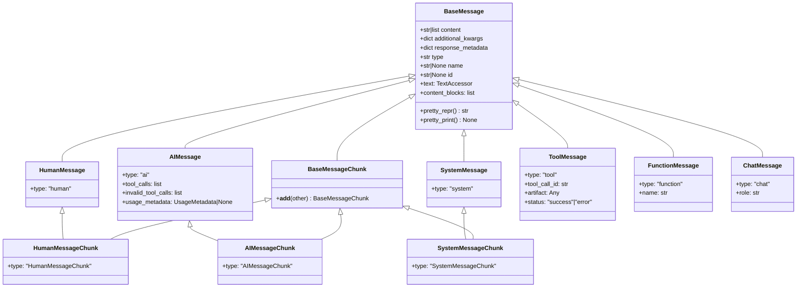
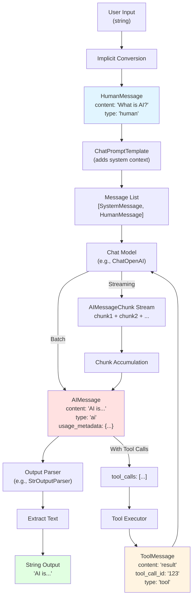

# Message Flow and Type Transformations

This document provides comprehensive documentation of the LangChain message type system, including message type conversions, class hierarchy, and message flow through LangChain components.

**Source:** `libs/core/langchain_core/messages/`

---

## Table of Contents

1. [Overview](#overview)
2. [Message Type Hierarchy](#message-type-hierarchy)
3. [Concrete Message Types](#concrete-message-types)
4. [Message Type Transformations](#message-type-transformations)
5. [Streaming Message Chunks](#streaming-message-chunks)
6. [Content Block Structure](#content-block-structure)
7. [Message Flow Through Components](#message-flow-through-components)
8. [Usage Examples](#usage-examples)
9. [Best Practices](#best-practices)

---

## Overview

Messages are the fundamental units of communication in LangChain, serving as both inputs and outputs for chat models. The message system provides:

- **Type Safety**: Strongly-typed message classes for different roles (user, AI, system, tool)
- **Multimodal Support**: Content blocks for text, images, audio, and other modalities
- **Streaming Support**: Message chunk variants for token-by-token streaming
- **Serialization**: Built-in serialization and deserialization capabilities
- **Metadata Tracking**: Response metadata, token usage, and additional context

**Key Insight**: Understanding message types and their transformations is critical for building type-safe LangChain applications, especially when composing chains with LCEL.

---

## Message Type Hierarchy

The message system is built on a hierarchical class structure with `BaseMessage` as the foundation:



**Source:** `libs/core/langchain_core/messages/base.py:92-140`

### BaseMessage Core Attributes

All message types inherit these core attributes from `BaseMessage`:

| Attribute | Type | Description |
|-----------|------|-------------|
| `content` | `str \| list[str \| dict]` | The message content (text or structured content blocks) |
| `additional_kwargs` | `dict` | Reserved for additional payload data (e.g., tool calls from model provider) |
| `response_metadata` | `dict` | Response headers, logprobs, token counts, model name |
| `type` | `str` | Unique identifier for the message type (used for serialization) |
| `name` | `str \| None` | Optional human-readable name for the message |
| `id` | `str \| None` | Optional unique identifier (ideally from provider/model) |

**Source:** `libs/core/langchain_core/messages/base.py:98-136`

---

## Concrete Message Types

### HumanMessage

Represents user input to the model.

```python
from langchain_core.messages import HumanMessage

# Simple text message
message = HumanMessage(content="What is the capital of France?")

# Message with multimodal content
message = HumanMessage(
    content=[
        {"type": "text", "text": "What's in this image?"},
        {"type": "image_url", "image_url": {"url": "https://example.com/image.jpg"}}
    ]
)
```

**Properties:**
- `type`: `"human"` (literal)
- Primary use: Conveying user queries, instructions, or input to the model

**Source:** `libs/core/langchain_core/messages/human.py:9-61`

### AIMessage

Represents model output or responses from an AI.

```python
from langchain_core.messages import AIMessage

# Simple AI response
message = AIMessage(content="The capital of France is Paris.")

# AI response with tool calls
message = AIMessage(
    content="",
    tool_calls=[
        {
            "name": "get_weather",
            "args": {"location": "Paris"},
            "id": "call_123"
        }
    ]
)

# AI response with usage metadata
message = AIMessage(
    content="Response text",
    usage_metadata={
        "input_tokens": 100,
        "output_tokens": 50,
        "total_tokens": 150
    }
)
```

**Properties:**
- `type`: `"ai"` (literal)
- `tool_calls`: List of tool invocations requested by the model
- `invalid_tool_calls`: List of malformed tool calls
- `usage_metadata`: Token usage information (input, output, total counts)

**Source:** `libs/core/langchain_core/messages/ai.py:148-150`

### SystemMessage

Primes AI behavior with system-level instructions.

```python
from langchain_core.messages import SystemMessage

# System prompt
message = SystemMessage(
    content="You are a helpful assistant that always responds in French."
)
```

**Properties:**
- `type`: `"system"` (literal)
- Primary use: Setting context, behavior, or constraints for the AI
- Typically passed as the first message in a conversation

**Source:** `libs/core/langchain_core/messages/system.py:9-61`

### ToolMessage

Returns the result of a tool execution back to the model.

```python
from langchain_core.messages import ToolMessage

# Simple tool result
message = ToolMessage(
    content="The weather in Paris is sunny, 22°C",
    tool_call_id="call_123"
)

# Tool result with artifact
tool_output = {
    "stdout": "Correlation between x and y is 0.85",
    "stderr": None,
    "artifacts": {"type": "image", "base64_data": "/9j/4gIcSU..."}
}

message = ToolMessage(
    content=tool_output["stdout"],
    artifact=tool_output,
    tool_call_id="call_123",
    status="success"
)
```

**Properties:**
- `type`: `"tool"` (literal)
- `tool_call_id`: Associates the response with the original tool call
- `artifact`: Full tool output (when different from content sent to model)
- `status`: `"success"` or `"error"`

**Source:** `libs/core/langchain_core/messages/tool.py:26-83`

### FunctionMessage (Deprecated)

Legacy message type for function call results. Use `ToolMessage` instead.

**Source:** `libs/core/langchain_core/messages/function.py`

### ChatMessage

Generic message with a custom role.

```python
from langchain_core.messages import ChatMessage

message = ChatMessage(
    content="Custom message content",
    role="moderator"
)
```

**Properties:**
- `type`: `"chat"` (literal)
- `role`: Custom role identifier (string)
- Use case: When predefined message types don't fit your use case

**Source:** `libs/core/langchain_core/messages/chat.py`

---

## Message Type Transformations

LangChain automatically handles several common type conversions to simplify chain development:

### String → HumanMessage Conversion

When a string is passed where a message is expected, it's automatically converted to a `HumanMessage`:

```python
# Explicit
from langchain_core.messages import HumanMessage
messages = [HumanMessage(content="Hello")]

# Implicit conversion
messages = ["Hello"]  # Automatically converted to HumanMessage
```

**Where This Happens:**
- `ChatPromptTemplate.invoke()` with string input
- Chain compositions expecting message inputs
- Memory systems loading context

### AIMessage → String Extraction

Extract text content from an `AIMessage` using the `.text` property:

```python
from langchain_core.messages import AIMessage

message = AIMessage(content="The capital of France is Paris.")

# Extract as string
text = message.text  # Returns: "The capital of France is Paris."

# Works with multimodal content (extracts only text blocks)
message = AIMessage(content=[
    {"type": "text", "text": "Hello "},
    {"type": "image_url", "image_url": {"url": "..."}},
    {"type": "text", "text": "world!"}
])
text = message.text  # Returns: "Hello world!"
```

**Important Notes:**
- The `.text` property is of type `TextAccessor` (string-like)
- Legacy `.text()` method call is deprecated (use property instead)
- Only text blocks are extracted from multimodal content

**Source:** `libs/core/langchain_core/messages/base.py:258-285`

### Dict → Message Conversion

Deserialize message dictionaries into message objects:

```python
from langchain_core.messages.utils import messages_from_dict

message_dicts = [
    {"type": "human", "data": {"content": "Hello"}},
    {"type": "ai", "data": {"content": "Hi there!"}}
]

messages = messages_from_dict(message_dicts)
# Returns: [HumanMessage(content="Hello"), AIMessage(content="Hi there!")]
```

**Source:** `libs/core/langchain_core/messages/utils.py:145-170`

### Message → String Serialization

Convert message sequences to formatted strings:

```python
from langchain_core.messages import HumanMessage, AIMessage
from langchain_core.messages.utils import get_buffer_string

messages = [
    HumanMessage(content="Hi, how are you?"),
    AIMessage(content="Good, how are you?")
]

formatted = get_buffer_string(messages)
# Returns: "Human: Hi, how are you?\nAI: Good, how are you?"

# Custom prefixes
formatted = get_buffer_string(messages, human_prefix="User", ai_prefix="Assistant")
# Returns: "User: Hi, how are you?\nAssistant: Good, how are you?"
```

**Source:** `libs/core/langchain_core/messages/utils.py:92-142`

---

## Streaming Message Chunks

For token-by-token streaming from models, LangChain provides message chunk variants:

### BaseMessageChunk

Base class for all message chunks, enabling concatenation:

```python
from langchain_core.messages import AIMessageChunk

chunk1 = AIMessageChunk(content="Hello")
chunk2 = AIMessageChunk(content=" world")

# Concatenate chunks
combined = chunk1 + chunk2
# Result: AIMessageChunk(content="Hello world")
```

**Source:** `libs/core/langchain_core/messages/base.py:370-420`

### Chunk Variants

Each message type has a corresponding chunk variant:

| Message Type | Chunk Type | Type Literal |
|--------------|------------|--------------|
| `HumanMessage` | `HumanMessageChunk` | `"HumanMessageChunk"` |
| `AIMessage` | `AIMessageChunk` | `"AIMessageChunk"` |
| `SystemMessage` | `SystemMessageChunk` | `"SystemMessageChunk"` |
| `ToolMessage` | `ToolMessageChunk` | `"ToolMessageChunk"` |
| `FunctionMessage` | `FunctionMessageChunk` | `"FunctionMessageChunk"` |
| `ChatMessage` | `ChatMessageChunk` | `"ChatMessageChunk"` |

### Streaming Usage Pattern

```python
from langchain_core.messages import AIMessageChunk

# Accumulate chunks from streaming model
full_message = AIMessageChunk(content="")

async for chunk in model.astream(messages):
    full_message += chunk  # Concatenate each chunk
    print(chunk.content, end="", flush=True)

print(f"\nFull message: {full_message.content}")
```

**Key Insight**: Message chunks support the `+` operator for efficient concatenation during streaming, merging content, tool calls, and metadata intelligently.

---

## Content Block Structure

Messages support multimodal content through structured content blocks:

### Content Block Types

| Block Type | Structure | Use Case |
|------------|-----------|----------|
| `text` | `{"type": "text", "text": str}` | Plain text content |
| `image_url` | `{"type": "image_url", "image_url": {"url": str}}` | Image from URL |
| `image_data` | `{"type": "image_data", "data": str, "mime_type": str}` | Base64-encoded image |
| `audio_url` | `{"type": "audio_url", "audio_url": {"url": str}}` | Audio from URL |
| `reasoning` | `{"type": "reasoning", "reasoning": str}` | Chain-of-thought reasoning |
| `tool_use` | `{"type": "tool_use", "name": str, "input": dict}` | Tool invocation |
| `non_standard` | `{"type": "non_standard", "value": dict}` | Provider-specific blocks |

**Source:** `libs/core/langchain_core/messages/content.py`

### Accessing Content Blocks

```python
from langchain_core.messages import HumanMessage

message = HumanMessage(content=[
    {"type": "text", "text": "Analyze this image:"},
    {"type": "image_url", "image_url": {"url": "https://example.com/photo.jpg"}}
])

# Access structured content blocks
blocks = message.content_blocks
# Returns: [
#     {"type": "text", "text": "Analyze this image:"},
#     {"type": "image_url", "image_url": {"url": "https://example.com/photo.jpg"}}
# ]

# Extract only text
text = message.text  # Returns: "Analyze this image:"
```

**Source:** `libs/core/langchain_core/messages/base.py:194-256`

---

## Message Flow Through Components

This diagram illustrates how messages flow and transform through a typical LangChain application:



### Detailed Flow Explanation

#### 1. Input Conversion
- **Input**: User provides a string
- **Transformation**: String automatically converted to `HumanMessage`
- **Result**: `HumanMessage(content="What is AI?", type="human")`

#### 2. Template Processing
- **Input**: `HumanMessage`
- **Transformation**: `ChatPromptTemplate` adds system message, formats variables
- **Result**: `[SystemMessage(...), HumanMessage(...)]`

#### 3. Model Invocation
- **Input**: List of messages
- **Processing**: Chat model generates response
- **Output Modes**:
  - **Batch**: Single `AIMessage` with complete response
  - **Streaming**: Stream of `AIMessageChunk` objects

#### 4. Streaming Accumulation (Optional)
- **Input**: Stream of `AIMessageChunk`
- **Processing**: Chunks concatenated using `+` operator
- **Result**: Complete `AIMessage`

#### 5. Text Extraction
- **Input**: `AIMessage`
- **Transformation**: Parser extracts text using `.text` property
- **Result**: Plain string output

#### 6. Tool Call Loop (Optional)
- **Input**: `AIMessage` with `tool_calls`
- **Processing**: Execute tools, create `ToolMessage` results
- **Result**: `ToolMessage` fed back to model for next iteration

---

## Usage Examples

### Example 1: Basic Message Construction

```python
from langchain_core.messages import HumanMessage, AIMessage, SystemMessage

# Create messages for a conversation
messages = [
    SystemMessage(content="You are a helpful math tutor."),
    HumanMessage(content="What is 15 * 24?"),
    AIMessage(content="15 * 24 = 360"),
    HumanMessage(content="Can you show the steps?")
]

# Pass to chat model
response = model.invoke(messages)
print(response.content)
```

### Example 2: Multimodal Message

```python
from langchain_core.messages import HumanMessage

message = HumanMessage(
    content=[
        {
            "type": "text",
            "text": "What's happening in this image?"
        },
        {
            "type": "image_url",
            "image_url": {
                "url": "https://example.com/scene.jpg"
            }
        }
    ]
)

response = vision_model.invoke([message])
```

### Example 3: Streaming with Chunks

```python
from langchain_core.messages import AIMessageChunk

# Stream tokens from model
full_response = AIMessageChunk(content="")

for chunk in model.stream(messages):
    full_response += chunk
    print(chunk.content, end="", flush=True)

print(f"\n\nTotal tokens: {full_response.usage_metadata['total_tokens']}")
```

### Example 4: Tool Message Flow

```python
from langchain_core.messages import HumanMessage, AIMessage, ToolMessage

# Initial query
messages = [HumanMessage(content="What's the weather in Paris?")]

# Model requests tool call
response = model.invoke(messages)
# AIMessage(content="", tool_calls=[{"name": "get_weather", "args": {"location": "Paris"}, "id": "call_123"}])

# Execute tool
tool_result = get_weather(location="Paris")

# Create tool message
messages.append(response)
messages.append(ToolMessage(
    content=tool_result,
    tool_call_id="call_123"
))

# Model generates final response
final_response = model.invoke(messages)
print(final_response.content)  # "The weather in Paris is sunny, 22°C"
```

### Example 5: Message Serialization

```python
from langchain_core.messages import messages_to_dict, messages_from_dict

# Serialize messages for storage
serialized = messages_to_dict(messages)
# [{"type": "human", "data": {"content": "Hello"}}, ...]

# Store in database
db.save("conversation_123", serialized)

# Later: deserialize from storage
loaded = db.load("conversation_123")
messages = messages_from_dict(loaded)
```

---

## Best Practices

### 1. Use Appropriate Message Types

Choose the correct message type for each role:

- **HumanMessage**: User input, queries, instructions
- **AIMessage**: Model outputs, assistant responses
- **SystemMessage**: Behavior instructions, context setting
- **ToolMessage**: Tool execution results

### 2. Leverage Automatic Conversions

Let LangChain handle common conversions:

```python
# Explicit (verbose)
messages = [HumanMessage(content="Hello")]

# Implicit (cleaner)
messages = ["Hello"]  # Auto-converted to HumanMessage
```

### 3. Extract Text Safely

Use the `.text` property for consistent text extraction:

```python
# Correct
text = message.text  # Works with both string and list content

# Avoid
text = message.content  # May return list, not string
```

### 4. Handle Streaming Efficiently

Accumulate chunks using the `+` operator:

```python
# Efficient chunk accumulation
full_message = AIMessageChunk(content="")
for chunk in stream:
    full_message += chunk

# Avoid string concatenation on content
# (loses metadata and tool calls)
```

### 5. Track Usage Metadata

Monitor token usage for cost and performance optimization:

```python
response = model.invoke(messages)

if response.usage_metadata:
    print(f"Input tokens: {response.usage_metadata['input_tokens']}")
    print(f"Output tokens: {response.usage_metadata['output_tokens']}")
    print(f"Total tokens: {response.usage_metadata['total_tokens']}")
```

### 6. Structure Multimodal Content

Use content blocks for multimodal inputs:

```python
# Good: Structured content blocks
content = [
    {"type": "text", "text": "Analyze:"},
    {"type": "image_url", "image_url": {"url": "..."}}
]

# Avoid: Mixing unstructured content
content = "Analyze: " + image_url  # Not multimodal-compatible
```

### 7. Associate Tool Messages Correctly

Always set `tool_call_id` to link tool results with requests:

```python
# Correct
tool_message = ToolMessage(
    content=result,
    tool_call_id=ai_message.tool_calls[0]["id"]
)

# Incorrect: Missing tool_call_id
# tool_message = ToolMessage(content=result)
```

### 8. Serialize for Persistence

Use built-in serialization for storing conversations:

```python
from langchain_core.messages import messages_to_dict, messages_from_dict

# Save
serialized = messages_to_dict(messages)
storage.save(conversation_id, serialized)

# Load
messages = messages_from_dict(storage.load(conversation_id))
```

---

## Related Documentation

- [Chain Lifecycle](./chain-lifecycle.md) - Understanding how messages flow through chains
- [LCEL Type System](./lcel-type-system.md) - Type transformations in LCEL compositions
- [Callback System](./callback-system.md) - Message events and callbacks
- [Prompts API Reference](../api-reference/prompts/templates.md) - ChatPromptTemplate usage
- [Memory Integration Guide](../guides/memory-integration.md) - Message persistence patterns

---

**Document Version**: 1.0  
**Last Updated**: 2024  
**Maintained By**: LangChain Documentation Team
