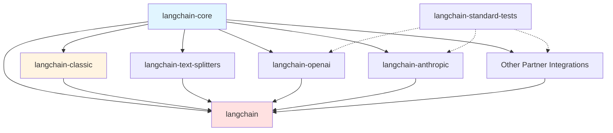
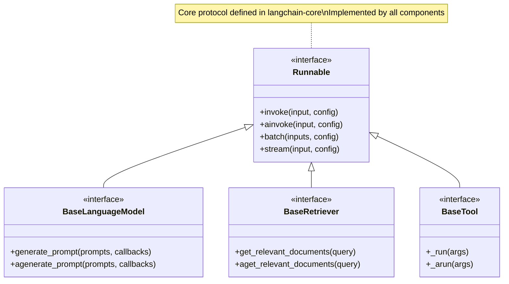
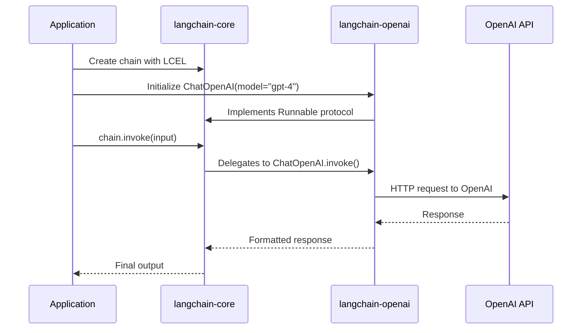

# Architecture Overview

This document provides a high-level architecture overview of the LangChain monorepo, covering the package structure, relationships between components, integration architecture, and key architectural principles that guide the design of the LangChain ecosystem.

## Table of Contents

- [Monorepo Structure](#monorepo-structure)
- [Core Packages](#core-packages)
- [Package Relationships](#package-relationships)
- [Integration Architecture](#integration-architecture)
- [Key Architectural Principles](#key-architectural-principles)
- [Development Organization](#development-organization)

## Monorepo Structure

The LangChain repository is organized as a monorepo with all packages located in the `libs/` directory. This structure enables coordinated development across multiple packages while maintaining clear separation of concerns.

**Source:** `libs/README.md:6-15`

```
langchain-monorepo/
├── libs/
│   ├── core/              # Core primitives and abstractions
│   ├── langchain/         # LangChain Classic (legacy chains and utilities)
│   ├── langchain_v1/      # LangChain v1 compatibility layer
│   ├── partners/          # Third-party provider integrations
│   ├── standard-tests/    # Standardized integration tests
│   └── text-splitters/    # Text splitting utilities
├── docs/                  # Centralized documentation
├── examples/              # Executable code examples
└── .github/               # CI/CD and repository configuration
```

### Package Directory Overview

| Directory | Purpose | PyPI Package | Description |
|-----------|---------|--------------|-------------|
| `core/` | Foundation abstractions | `langchain-core` | Base interfaces, protocols, and LCEL composition primitives |
| `langchain/` | Legacy implementation | `langchain-classic` | Legacy chains, community re-exports, deprecated functionality |
| `langchain_v1/` | Compatibility layer | `langchain` | Main distribution package with v1 API compatibility |
| `partners/` | Provider integrations | `langchain-{provider}` | Direct integrations with LLM providers (OpenAI, Anthropic, etc.) |
| `standard-tests/` | Test framework | `langchain-standard-tests` | Reusable test suites for integration validation |
| `text-splitters/` | Text utilities | `langchain-text-splitters` | Document chunking and splitting utilities |

## Core Packages

### langchain-core: Foundation Abstractions

**Source:** `libs/core/README.md:19-25`

LangChain Core contains the base abstractions that power the entire LangChain ecosystem. These abstractions are designed to be modular, simple, and provider-agnostic.

**Key Components:**

- **Runnables**: The foundational protocol for LCEL (LangChain Expression Language) composition
- **Prompts**: Base classes for prompt templates and message construction
- **Messages**: Type definitions for chat messages (HumanMessage, AIMessage, SystemMessage)
- **Output Parsers**: Interfaces for transforming LLM outputs into structured data
- **Callbacks**: Event-driven hooks for monitoring and debugging chain execution
- **Language Models**: Base interfaces for LLMs and chat models
- **Retrievers**: Abstract interfaces for document retrieval systems
- **Documents**: Schema definitions for document objects
- **Stores**: Storage abstractions for key-value and vector data

**Design Philosophy:**

```
"These abstractions are designed to be as modular and simple as possible.
The benefit of having these abstractions is that any provider can implement
the required interface and then easily be used in the rest of the LangChain ecosystem."
```
**Source:** `libs/core/README.md:23-25`

**Benefits of Building on langchain-core:**

- **Modularity**: Abstractions are independent of each other and not tied to specific model providers
- **Stability**: Committed to stable versioning with advance notice for breaking changes
- **Battle-tested**: Largest install base in the LLM ecosystem, used in production by many companies

**Source:** `libs/core/README.md:31-33`

### langchain-classic: Legacy Implementation

**Source:** `libs/langchain/README.md:19-23`

LangChain Classic maintains legacy chains, community re-exports, indexing API, and deprecated functionality for backward compatibility.

**Contents:**

- **Legacy Chains**: Original Chain implementations (LLMChain, SequentialChain, etc.)
- **Community Re-exports**: Functionality moved to community packages but re-exported for compatibility
- **Indexing API**: Document indexing and storage utilities
- **Deprecated Functionality**: Components maintained for migration support

**Usage Guidance:**

> In most cases, you should be using the main `langchain` package.

**Source:** `libs/langchain/README.md:23`

The `langchain-classic` package is primarily for:
- Maintaining existing codebases with legacy chain implementations
- Migration scenarios requiring gradual transition to LCEL
- Access to deprecated APIs during transition periods

For new projects, prefer the LCEL composition patterns available through `langchain-core`.

### langchain: Main Distribution Package

The `langchain` package (in `libs/langchain_v1/`) serves as the main distribution that developers should use for new applications. It provides:

- Modern LCEL-based composition patterns
- Stable v1 API surface
- Coordinated versioning across dependencies
- Production-ready chain implementations

## Package Relationships

The LangChain packages follow a layered architecture with clear dependency relationships.

### Dependency Hierarchy



**Legend:**
- Solid arrows (→): Runtime dependencies
- Dotted arrows (⇢): Development/testing dependencies
- Blue: Foundation layer (core abstractions)
- Yellow: Compatibility layer (legacy support)
- Pink: Distribution layer (main package)

### Layer Descriptions

**Layer 1: Foundation (langchain-core)**
- Provides base abstractions and protocols
- Zero dependencies on higher layers
- Designed for maximum stability and minimal breaking changes
- All other packages depend on this foundation

**Layer 2: Specialized Packages**
- **langchain-classic**: Implements legacy Chain patterns using core abstractions
- **langchain-text-splitters**: Provides text chunking utilities using core Document types
- **Partner packages**: Implement provider-specific LLMs, embeddings, and tools using core interfaces

**Layer 3: Distribution (langchain)**
- Aggregates functionality from core, classic, and partner packages
- Provides cohesive developer experience
- Coordinates versioning across dependencies
- Main entry point for application development

**Testing Layer: langchain-standard-tests**
- Provides reusable test suites for integration validation
- Not a runtime dependency
- Ensures consistent behavior across partner implementations

### Interface Contracts

All packages interact through well-defined interfaces from `langchain-core`:



This interface-based design enables:
- Seamless composition of components from different providers
- Type-safe LCEL pipe operations
- Consistent async/sync API patterns
- Unified callback and monitoring systems

## Integration Architecture

### Partner Packages

The `partners/` directory contains third-party provider integrations maintained directly by the LangChain team.

**Source:** `libs/README.md:19-28`

**Direct Integrations (in this repository):**

- **langchain-openai**: OpenAI GPT models and embeddings
- **langchain-anthropic**: Anthropic Claude models
- **langchain-ollama**: Ollama local model integration
- **langchain-deepseek**: DeepSeek model integration
- **langchain-xai**: xAI model integration

**External Integrations (separate repositories):**

Many integrations have been moved to dedicated repositories for improved:
- Versioning: Independent release cycles
- Dependency management: Provider-specific dependencies isolated
- Collaboration: Provider teams can maintain directly
- Testing: Provider-specific test infrastructure

Examples include:
- **langchain-google** (https://github.com/langchain-ai/langchain-google)
- **langchain-aws** (https://github.com/langchain-ai/langchain-aws)
- Third-party maintained packages

For the complete list of integrations, see: https://docs.langchain.com/oss/python/integrations/providers

### Integration Pattern

All provider integrations follow a consistent architectural pattern:



**Key Integration Principles:**

1. **Interface Implementation**: All integrations implement core interfaces (Runnable, BaseLanguageModel, etc.)
2. **Configuration Isolation**: Provider-specific configuration handled within partner package
3. **Error Handling**: Provider errors normalized to standard LangChain exceptions where appropriate
4. **Async Support**: Both sync and async methods implemented consistently
5. **Callback Integration**: Full support for LangChain callback system

## Key Architectural Principles

### 1. Runnable Protocol and LCEL Composition

The `Runnable` protocol is the fundamental abstraction enabling LangChain's composability.

**Core Concept:**
Every component (prompts, models, parsers, chains) implements the Runnable protocol, providing:
- `invoke()`: Synchronous execution
- `ainvoke()`: Asynchronous execution
- `batch()`: Batch processing
- `stream()`: Streaming outputs

**LCEL (LangChain Expression Language):**
Components compose using the pipe operator (`|`):

```python
chain = prompt | model | parser
```

**Type Flow:**
```
Dict[str, str] → PromptTemplate → List[BaseMessage] → ChatModel → AIMessage → StrOutputParser → str
```

This functional composition enables:
- Type-safe chaining
- Automatic async/sync adaptation
- Built-in batching and streaming
- Unified callback integration

### 2. Lazy Loading and Explicit Imports

**Design Philosophy:**
LangChain packages use explicit imports rather than implicit `__init__.py` re-exports to:
- Reduce initial import time
- Minimize unnecessary dependency loading
- Enable tree-shaking in deployment
- Improve IDE autocomplete performance

**Pattern:**
```python
# Explicit import (preferred)
from langchain_core.prompts import ChatPromptTemplate

# Avoid package-level imports that load everything
# from langchain_core import *  # NOT RECOMMENDED
```

### 3. Pydantic Models for Validation

**Type Safety:**
All complex data structures use Pydantic models for:
- Runtime type validation
- Automatic serialization/deserialization
- JSON schema generation
- IDE type hints and autocompletion

**Example:**
```python
from langchain_core.messages import HumanMessage
from pydantic import BaseModel, Field

class ChainInput(BaseModel):
    query: str = Field(..., description="User query")
    context: list[str] = Field(default_factory=list)
```

**Benefits:**
- Catch type errors at runtime before LLM invocation
- Generate documentation from model schemas
- Enable structured output parsing
- Facilitate API integrations

### 4. Callback System for Observability

**Event-Driven Architecture:**
The callback system provides hooks for:
- Logging and debugging
- Token usage tracking
- Latency monitoring
- Error handling
- Custom integrations (e.g., LangSmith, Weights & Biases)

**Event Types:**
- `on_chain_start` / `on_chain_end` / `on_chain_error`
- `on_llm_start` / `on_llm_end` / `on_llm_new_token`
- `on_tool_start` / `on_tool_end` / `on_tool_error`
- `on_retriever_start` / `on_retriever_end`

### 5. Async-First Design

**Dual API Surface:**
All I/O operations provide both synchronous and asynchronous methods:
- `invoke()` / `ainvoke()`
- `_run()` / `_arun()`
- `get_relevant_documents()` / `aget_relevant_documents()`

**Rationale:**
- Production applications typically benefit from async I/O
- Jupyter notebooks and scripts often prefer synchronous APIs
- Consistent patterns reduce cognitive load

### 6. Configuration Through RunnableConfig

**Centralized Configuration:**
`RunnableConfig` provides consistent configuration across all Runnable components:

```python
config = RunnableConfig(
    callbacks=[logging_callback],
    tags=["production", "user-123"],
    metadata={"version": "1.0"},
    max_concurrency=5,
)

result = chain.invoke(input, config=config)
```

**Propagation:**
Configuration automatically propagates through composed chains, ensuring:
- Callbacks apply to all sub-components
- Tags available for filtering and analysis
- Metadata accessible for debugging
- Concurrency limits respected

## Development Organization

### Repository Structure

```
langchain-monorepo/
├── libs/                          # All packages
│   ├── core/                      # langchain-core package
│   │   ├── langchain_core/        # Source code
│   │   ├── tests/                 # Unit and integration tests
│   │   ├── pyproject.toml         # Package configuration
│   │   └── README.md              # Package documentation
│   ├── langchain/                 # langchain-classic package
│   │   ├── langchain_classic/     # Source code
│   │   ├── tests/                 # Tests
│   │   └── pyproject.toml
│   └── partners/                  # Provider integrations
│       └── openai/                # Example: OpenAI integration
│           ├── langchain_openai/  # Source code
│           ├── tests/             # Integration tests
│           └── pyproject.toml
├── docs/                          # Centralized documentation
├── examples/                      # Executable examples
├── .github/                       # CI/CD workflows
│   └── workflows/
│       ├── integration_tests.yml  # Integration test automation
│       ├── unit_tests.yml         # Unit test automation
│       └── docs-build.yml         # Documentation validation
├── pyproject.toml                 # Workspace configuration
├── uv.lock                        # Dependency lock file
└── Makefile                       # Common development tasks
```

### Development Workflow

**Workspace Management:**
The repository uses `uv` (modern Python package manager) for workspace management:
- `uv.lock` ensures reproducible builds across packages
- Shared dependencies managed at workspace level
- Individual package versions independently controlled

**Testing Strategy:**
- **Unit tests**: Package-level tests in `libs/{package}/tests/unit_tests/`
- **Integration tests**: Provider-specific tests in `libs/{package}/tests/integration_tests/`
- **Standard tests**: Reusable test suites in `libs/standard-tests/`

**CI/CD Automation:**
- Separate workflows for unit tests (fast feedback) and integration tests (slower, provider-dependent)
- Documentation builds validated on every PR
- Type checking with `mypy --strict` enforced
- Code formatting with `ruff` validated

### Package Versioning

**Semantic Versioning:**
All packages follow semantic versioning (MAJOR.MINOR.PATCH):
- **MAJOR**: Breaking changes to public APIs
- **MINOR**: New features, backward-compatible
- **PATCH**: Bug fixes, no API changes

**Stability Commitment:**
From `langchain-core` README:
> We are committed to a stable versioning scheme, and will communicate any breaking changes with advance notice and version bumps.

**Source:** `libs/core/README.md:32`

**Coordinated Releases:**
- `langchain-core` serves as stability anchor
- Other packages specify minimum core version
- Breaking changes in core trigger major version bumps across ecosystem

## Summary

The LangChain monorepo architecture emphasizes:

1. **Modularity**: Clear separation between core abstractions, legacy compatibility, and provider integrations
2. **Stability**: Foundation (langchain-core) prioritizes backward compatibility
3. **Extensibility**: Interface-based design enables seamless provider integrations
4. **Developer Experience**: LCEL composition, type safety, and comprehensive tooling
5. **Production Readiness**: Async support, observability hooks, and battle-tested components

This architecture enables LangChain to serve both:
- **New applications**: Using modern LCEL patterns from `langchain` package
- **Legacy systems**: Maintaining compatibility through `langchain-classic`

For detailed documentation on specific components, see:
- [Chain Lifecycle](./chain-lifecycle.md) - Detailed chain execution flow
- [LCEL Type System](./lcel-type-system.md) - Type composition and safety
- [Callback System](./callback-system.md) - Event-driven observability

For API reference documentation, see:
- [Chains API Reference](../api-reference/chains/base.md)
- [Runnables API Reference](../api-reference/runnables/base.md)
- [Agents API Reference](../api-reference/agents/agent-types.md)
