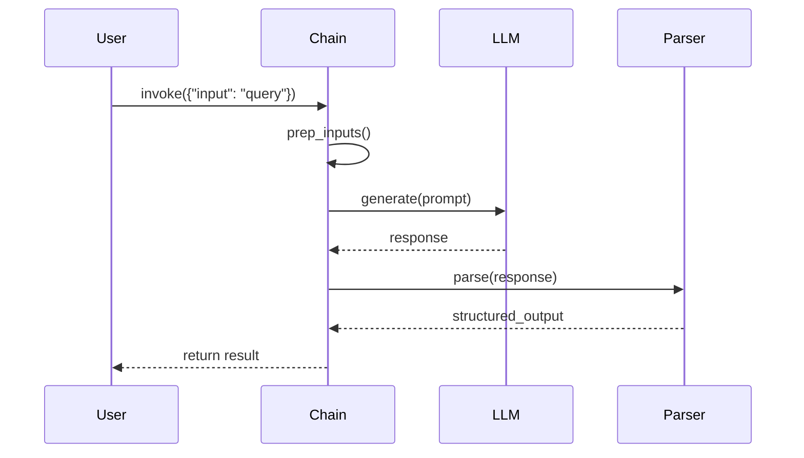
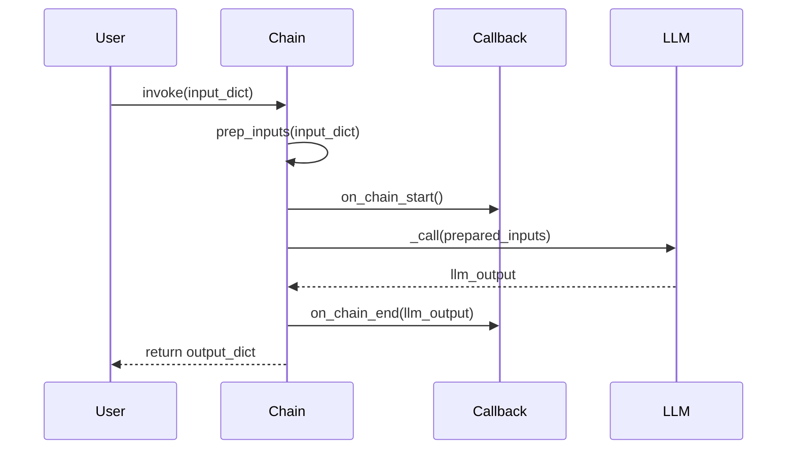
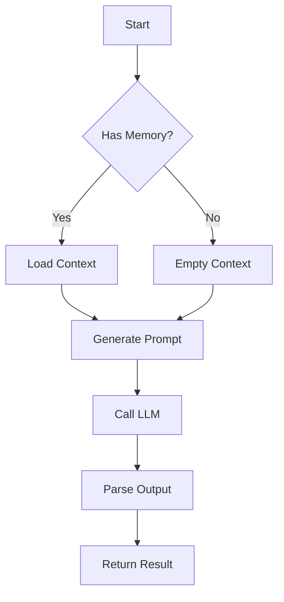
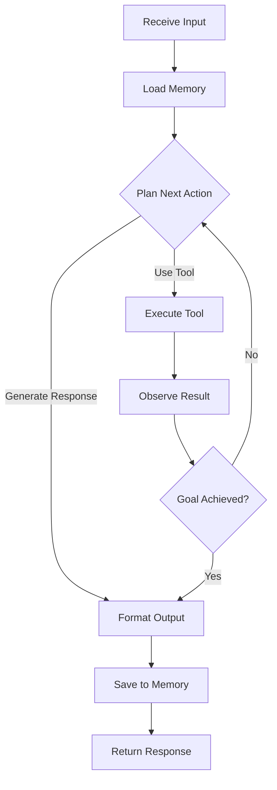
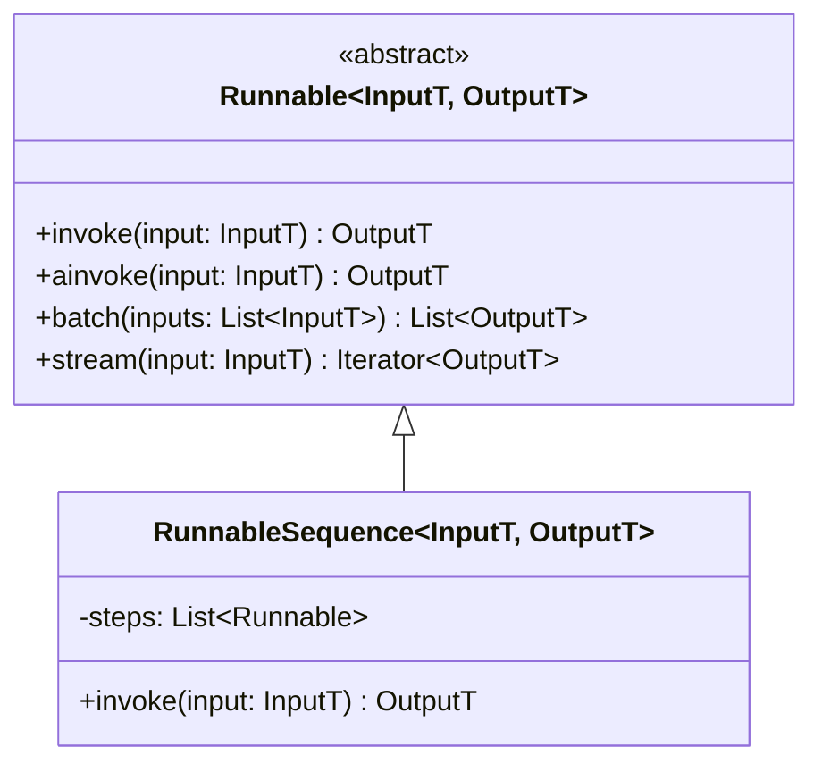
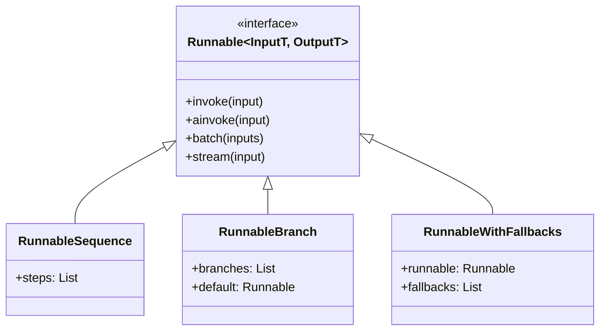
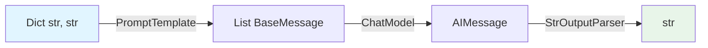
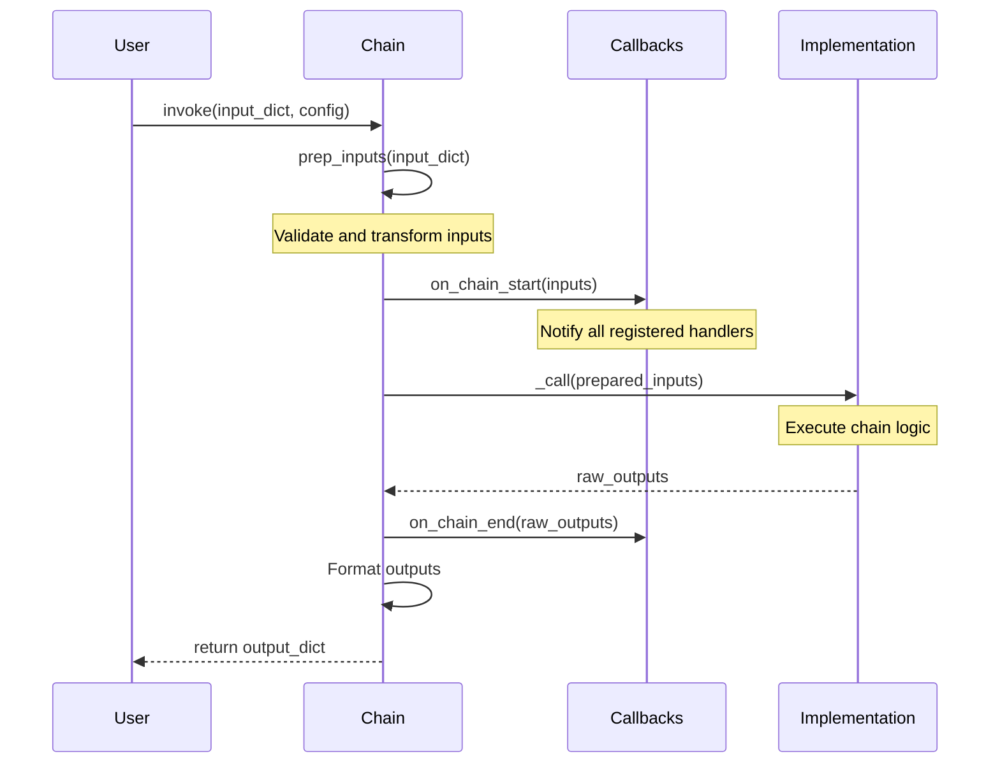

# Documentation Contribution Guide

This guide defines the required standards for contributing to LangChain integration documentation. All documentation contributions must meet these standards to ensure consistency, accuracy, and accessibility for developers at all experience levels.

## Table of Contents

- [Documentation Standards Overview](#documentation-standards-overview)
- [Google-Style Docstring Format](#google-style-docstring-format)
- [Type Annotation Standards](#type-annotation-standards)
- [Mermaid Diagram Specifications](#mermaid-diagram-specifications)
- [Source Code Citation Requirements](#source-code-citation-requirements)
- [Markdown Style Guidelines](#markdown-style-guidelines)
- [Example Templates](#example-templates)
- [Quality Criteria](#quality-criteria)
- [Validation and Testing](#validation-and-testing)

---

## Documentation Standards Overview

### Core Principles

All LangChain integration documentation must:

1. **Enable Junior Developer Success**: Documentation quality must enable developers with <2 years experience to independently implement new LangChain chains
2. **Provide Executable Examples**: All code examples must be complete, self-contained, and run without modification
3. **Maintain Type Safety**: Achieve 100% type annotation coverage with mypy strict mode compliance
4. **Ensure Traceability**: All technical details must include source code citations
5. **Follow Consistent Patterns**: Use standardized templates for all documentation types

### Target Audience

Documentation is written for:

- **Primary**: Python developers with 0-2 years experience new to LangChain
- **Secondary**: Experienced developers seeking quick reference
- **Tertiary**: Contributors maintaining and extending the codebase

### Documentation Types

This repository contains:

- **API Reference Documentation**: Type-annotated function/class documentation
- **Usage Guides**: Implementation patterns and best practices
- **Debugging Guides**: Common failure modes and troubleshooting
- **Executable Examples**: Complete, runnable code files
- **Architecture Documentation**: Chain composition patterns and data flows

---

## Google-Style Docstring Format

### Overview

All public functions and classes must use Google-style docstrings with complete `Args`, `Returns`, `Raises`, and `Example` sections.

**Source**: `AGENTS.md:131-172`

### Required Docstring Sections

#### Args Section

Document all parameters with:
- **Parameter name**: Must match function signature exactly
- **Description**: Clear explanation of purpose and usage
- **Constraints**: Value ranges, required dictionary keys, or validation rules
- **Type information**: Types go in function signatures, NOT in docstrings

**Format**:
```
Args:
    param_name: Description of the parameter and its purpose.
    another_param: Description with constraints (e.g., must be positive).
```

**Important Rules**:
- Types belong in function signatures using type hints
- Do NOT repeat default values in docstrings unless there is post-processing or conditional setting
- Focus on "why" rather than "what" in descriptions
- Use American English spelling (e.g., "behavior", not "behaviour")

#### Returns Section

Document return values with:
- **Type**: Defined in function signature
- **Structure description**: For dicts, list all keys with their meanings
- **Example value**: When structure is non-obvious

**Format**:
```
Returns:
    Description of the return value structure and meaning.
```

**When to Document**:
- Always document return values for public APIs
- Only skip documentation for obvious return types (e.g., simple boolean)
- Always document complex structures (dicts, nested types, Pydantic models)

#### Raises Section

Document all possible exceptions with:
- **Exception class name**: Use backticks for formatting
- **Trigger conditions**: Explain when this exception occurs
- **Example scenario**: Brief description of failure case

**Format**:
```
Raises:
    `ExceptionClassName`: Description of when this exception is raised.
    `AnotherException`: Description of another error condition.
```

#### Example Section

Provide executable code demonstrating usage:
- **Complete imports**: Include all necessary import statements
- **Sample input data**: Realistic example inputs
- **Function invocation**: Show how to call the function
- **Expected output**: Show or describe expected results

**Format**:
```
Example:
    ```python
    from langchain_core.prompts import ChatPromptTemplate
    
    template = ChatPromptTemplate.from_messages([
        ("system", "You are a helpful assistant"),
        ("human", "{input}")
    ])
    result = template.invoke({"input": "Hello"})
    print(result)
    # Output: [SystemMessage(content='You are a helpful assistant'), ...]
    ```
```

### Complete Docstring Template

```python
def send_email(to: str, msg: str, *, priority: str = "normal") -> bool:
    """
    Send an email to a recipient with specified priority.

    Args:
        to: The email address of the recipient.
        msg: The message body to send.
        priority: Email priority level (`'low'`, `'normal'`, `'high'`).

    Returns:
        `True` if email was sent successfully, `False` otherwise.

    Raises:
        `InvalidEmailError`: If the email address format is invalid.
        `SMTPConnectionError`: If unable to connect to email server.

    Example:
        ```python
        from mymodule import send_email
        
        success = send_email(
            to="user@example.com",
            msg="Hello, World!",
            priority="high"
        )
        print(f"Email sent: {success}")
        ```
    """
    # Implementation here
    pass
```

### Documentation Guidelines

**Best Practices**:

1. **Concise but Clear**: Keep descriptions focused but provide enough context
2. **Focus on Why**: Explain the purpose and reasoning, not just what the code does
3. **Document Behavior**: Explain side effects, state changes, or non-obvious behavior
4. **Use Consistent Terminology**: Reference terms defined in [glossary](../glossary.md)
5. **Be Specific**: Instead of "invalid input", specify what makes input invalid

**Common Mistakes to Avoid**:

❌ **Bad - Insufficient documentation**:
```python
def send_email(to, msg):
    """Send an email to a recipient."""
```

❌ **Bad - Types in docstring instead of signature**:
```python
def send_email(to, msg):
    """Send an email.
    
    Args:
        to (str): Email address
        msg (str): Message body
    """
```

❌ **Bad - Missing Raises section**:
```python
def send_email(to: str, msg: str) -> bool:
    """Send an email.
    
    Args:
        to: Email address.
        msg: Message body.
    
    Returns:
        True if successful.
    """
    if not validate_email(to):
        raise InvalidEmailError(f"Invalid email: {to}")  # Not documented!
```

✅ **Good - Complete documentation**:
```python
def send_email(to: str, msg: str, *, priority: str = "normal") -> bool:
    """
    Send an email to a recipient with specified priority.

    Args:
        to: The email address of the recipient.
        msg: The message body to send.
        priority: Email priority level (`'low'`, `'normal'`, `'high'`).

    Returns:
        `True` if email was sent successfully, `False` otherwise.

    Raises:
        `InvalidEmailError`: If the email address format is invalid.
        `SMTPConnectionError`: If unable to connect to email server.

    Example:
        ```python
        from mymodule import send_email
        
        success = send_email(
            to="user@example.com",
            msg="Hello, World!",
            priority="high"
        )
        ```
    """
```

---

## Type Annotation Standards

### Overview

Achieve 100% type annotation coverage on all LangChain integration public interfaces with mypy strict mode compliance.

**Source**: `libs/core/pyproject.toml:70-77`, `libs/langchain/pyproject.toml:95-100`

### Type Annotation Requirements

#### Basic Type Hints

All function signatures must include type hints for:
- **Parameters**: Every parameter must have a type annotation
- **Return values**: Every function must declare its return type
- **Class attributes**: Pydantic models and dataclass fields must be typed

**Required typing imports**:
```python
from typing import Any, Dict, List, Optional, Union, Sequence, Callable, TypeVar
```

**Examples**:
```python
from typing import List, Dict, Optional

def filter_users(
    users: List[str],
    known_users: set[str],
    max_results: Optional[int] = None
) -> List[str]:
    """Filter unknown users from a list."""
    result = [u for u in users if u not in known_users]
    return result[:max_results] if max_results else result
```

#### Complex Type Annotations

**Dictionary Types with Key Requirements**:

When using `Dict[str, Any]`, document required keys in the Args section:

```python
from typing import Dict, Any

def create_retrieval_chain(
    retriever: BaseRetriever,
    combine_docs_chain: Runnable[Dict[str, Any], str],
    *,
    input_key: str = "input"
) -> Runnable[Dict[str, Any], Dict[str, Any]]:
    """
    Create a retrieval chain that fetches relevant documents.

    Args:
        retriever: Document retriever to fetch relevant context.
        combine_docs_chain: Chain to process retrieved documents.
        input_key: Key in input dict containing the query.

    Returns:
        Runnable that accepts dict with keys:
        - `{input_key}` (str): The user query
        
        And returns dict with keys:
        - `"context"` (List[Document]): Retrieved documents
        - `"answer"` (str): Generated response

    Example:
        ```python
        from langchain_classic.chains import create_retrieval_chain
        
        chain = create_retrieval_chain(retriever, combine_chain)
        result = chain.invoke({"input": "What is LangChain?"})
        # result: {"context": [...], "answer": "LangChain is..."}
        ```
    """
```

**Generic Type Parameters**:

For [Runnable](../glossary.md#runnable) compositions, document type transformations:

```python
from typing import TypeVar, Generic
from langchain_core.runnables import Runnable

InputT = TypeVar("InputT")
OutputT = TypeVar("OutputT")

class MyChain(Runnable[InputT, OutputT]):
    """
    Custom chain with explicit input/output types.
    
    Type Parameters:
        InputT: Type of input accepted by this chain
        OutputT: Type of output produced by this chain
    """
```

#### Union Types

Use `Union` or `|` operator for multiple accepted types:

```python
from typing import Union
from langchain_core.language_models import BaseLLM, BaseChatModel

def create_chain(
    llm: Union[BaseLLM, BaseChatModel],
    prompt: str
) -> Runnable:
    """
    Create a chain with LLM or Chat model.
    
    Args:
        llm: Language model instance (LLM or Chat model).
        prompt: Prompt template string.
    """
```

**Python 3.10+ syntax**:
```python
def create_chain(
    llm: BaseLLM | BaseChatModel,
    prompt: str
) -> Runnable:
    """Create a chain with LLM or Chat model."""
```

#### Optional Parameters

Use `Optional[T]` for parameters that can be `None`:

```python
from typing import Optional

def load_memory(
    session_id: str,
    max_tokens: Optional[int] = None
) -> ConversationBufferMemory:
    """
    Load conversation memory for a session.
    
    Args:
        session_id: Unique identifier for the conversation session.
        max_tokens: Maximum tokens to retain (None for unlimited).
    """
```

### Type Checking with mypy

#### mypy Strict Mode

All code must pass mypy strict mode validation:

```bash
mypy --strict libs/langchain/langchain_classic libs/core/langchain_core
```

**Strict mode requirements** (from `libs/core/pyproject.toml:70-77`):
- `strict = true`
- All functions must have type annotations
- No `Any` types without explicit justification
- All returns must be typed
- Plugin: `pydantic.mypy` for Pydantic model support

#### Common mypy Issues and Solutions

**Issue**: Missing return type
```python
# ❌ Error: Function is missing a return type annotation
def get_user(user_id: str):
    return {"id": user_id, "name": "Alice"}
```

**Solution**: Add return type
```python
# ✅ Fixed
def get_user(user_id: str) -> Dict[str, str]:
    """Get user by ID."""
    return {"id": user_id, "name": "Alice"}
```

**Issue**: Untyped parameters
```python
# ❌ Error: Function is missing type annotation for parameter
def process(data):
    return [x.upper() for x in data]
```

**Solution**: Add parameter types
```python
# ✅ Fixed
def process(data: List[str]) -> List[str]:
    """Process list of strings."""
    return [x.upper() for x in data]
```

### Type Annotation Checklist

Before submitting documentation:

- [ ] All function parameters have type annotations
- [ ] All functions have return type annotations
- [ ] Complex Dict types document required keys in docstrings
- [ ] Generic type parameters are explicitly defined
- [ ] `mypy --strict` passes without errors
- [ ] Optional parameters use `Optional[T]` type
- [ ] Union types clearly document all accepted types
- [ ] Type annotations match actual runtime behavior

---

## Mermaid Diagram Specifications

### Overview

All architecture and flow documentation must use Mermaid diagrams for visual representation. Diagrams must be embedded directly in markdown files (no external image files).

**Source**: Agent Action Plan section 0.4.3

### Diagram Types

#### Sequence Diagrams

Use for documenting:
- [Chain](../glossary.md#chain) execution lifecycle
- [Callback](../glossary.md#callback) event sequences
- Multi-step workflows

**Format**:
````markdown

````

**Example - Chain Lifecycle**:


**Best Practices**:
- Use clear participant names (avoid abbreviations)
- Show both request (`->>`) and response (`-->>`) flows
- Include error paths when relevant
- Add notes for complex interactions: `Note over Chain,LLM: Processing step`

#### Flowcharts

Use for documenting:
- [Agent](../glossary.md#agent) decision loops
- Conditional logic flows
- Troubleshooting decision trees

**Format**:
````markdown

````

**Example - Agent Decision Loop**:


**Best Practices**:
- Use descriptive node labels
- Show decision points clearly with diamonds `{}`
- Use consistent arrow styles
- Keep graphs readable (max 10-12 nodes)

#### Class Diagrams

Use for documenting:
- [Runnable](../glossary.md#runnable) class hierarchy
- Interface relationships
- Type inheritance structures

**Format**:
````markdown

````

**Example - Runnable Hierarchy**:


**Best Practices**:
- Show inheritance with `<|--`
- Mark abstract classes/interfaces with `<<abstract>>` or `<<interface>>`
- Include key methods and attributes only
- Use generic type notation: `~TypeParam~`

### Diagram Validation

All Mermaid diagrams must:

1. **Be syntactically valid**: Test in [Mermaid Live Editor](https://mermaid.live/)
2. **Render correctly**: Preview in MkDocs before committing
3. **Include source citations**: Document which code files the diagram represents
4. **Have descriptive captions**: Explain the diagram's purpose

**Example with source citation**:
````markdown
### Chain Execution Lifecycle

The following diagram shows the complete execution flow for a Chain.invoke() call:

```mermaid
sequenceDiagram
    [diagram content]
```

**Source**: `libs/langchain/langchain_classic/chains/base.py:142-167`
````

### Diagram Checklist

Before submitting diagrams:

- [ ] Diagram renders correctly in Mermaid Live Editor
- [ ] All participant/node names are clear and descriptive
- [ ] Diagram includes source code citation
- [ ] Caption explains diagram purpose and context
- [ ] Diagram follows appropriate type (sequence/flowchart/class)
- [ ] Complex flows are broken into multiple focused diagrams
- [ ] Consistent styling with other diagrams in documentation

---

## Source Code Citation Requirements

### Overview

All technical details in documentation must include source code citations to enable verification and track changes when source code is updated.

**Source**: Agent Action Plan section 0.1.2, 0.7.2

### Citation Format

**Standard Format**:
```
Source: /relative/path/to/file.py:LineNumber
```

**Examples**:
```
Source: libs/langchain/langchain_classic/chains/base.py:142
Source: libs/core/langchain_core/runnables/base.py:150-167
Source: libs/langchain/langchain_classic/agents/agent.py:89
```

### When to Add Citations

**Required Citations**:

1. **API documentation**: Cite the source file defining the API
2. **Architecture diagrams**: Cite files represented in the diagram
3. **Implementation details**: Cite specific code being described
4. **Type flow documentation**: Cite where type transformations occur
5. **Behavioral descriptions**: Cite code implementing the behavior

**Example in API Documentation**:
````markdown
## Chain.invoke()

Execute the chain with a single input dictionary.

**Source**: `libs/langchain/langchain_classic/chains/base.py:142-167`

### Parameters

- `input`: Dictionary containing chain inputs
- `config`: Optional configuration for callbacks and tags

### Returns

Dictionary containing chain outputs with all output keys populated.
````

**Example in Architecture Documentation**:
````markdown
### Callback Event Flow

Callbacks are invoked at specific points during chain execution in the following order:

1. `on_chain_start` - Before chain execution begins
2. `on_llm_start` - Before LLM call
3. `on_llm_end` - After LLM returns
4. `on_chain_end` - After chain completes

**Source**: `libs/core/langchain_core/callbacks/base.py:45-98`
````

### Citation Best Practices

**Specific Line Ranges**:
- Single line: `:142`
- Line range: `:142-167`
- Multiple ranges: `:50-55, 89-92` (avoid if possible)

**When Source Spans Multiple Files**:
```
**Sources**:
- `libs/langchain/langchain_classic/chains/base.py:142` (Chain base class)
- `libs/core/langchain_core/runnables/base.py:150` (Runnable protocol)
```

**Relative Paths**:
- Always use repository-relative paths
- Start from repository root: `libs/...`
- Never use absolute paths: `~/projects/...` ❌

### Citation Validation

Citations must:

- [ ] Use repository-relative paths from root
- [ ] Include line numbers or line ranges
- [ ] Reference actual source files in repository
- [ ] Be updated when source code is refactored
- [ ] Be verified during documentation reviews

---

## Markdown Style Guidelines

### Overview

All documentation uses GitHub Flavored Markdown with specific formatting conventions for consistency.

**Source**: Agent Action Plan section 0.9.2

### Code Block Format

#### Language Tags

All code blocks must include language tags for syntax highlighting:

````markdown
```python
from langchain_core.prompts import ChatPromptTemplate

template = ChatPromptTemplate.from_messages([
    ("system", "You are a helpful assistant"),
    ("human", "{input}")
])
```
````

**Supported Languages**:
- `python` - Python code
- `bash` - Shell commands
- `json` - JSON data
- `yaml` - YAML configuration
- `mermaid` - Mermaid diagrams
- `text` - Plain text output

#### Complete, Executable Examples

All Python code examples must:

1. **Include all imports**: Never assume imports
2. **Be self-contained**: Can be copy-pasted and run
3. **Show expected output**: Use comments to indicate output
4. **Handle errors appropriately**: Demonstrate best practices

**Example**:
````markdown
```python
from langchain_core.prompts import ChatPromptTemplate
from langchain_openai import ChatOpenAI

# Initialize components
template = ChatPromptTemplate.from_messages([
    ("system", "You are a helpful assistant."),
    ("human", "{input}")
])
model = ChatOpenAI(model="gpt-3.5-turbo")

# Create and execute chain
chain = template | model
result = chain.invoke({"input": "What is LangChain?"})

print(result.content)
# Output: LangChain is a framework for developing applications...
```
````

### Table Format

Use GitHub-style markdown tables with alignment:

```markdown
| Parameter | Type | Description |
|-----------|------|-------------|
| `input` | `Dict[str, Any]` | Input dictionary with query |
| `config` | `Optional[RunnableConfig]` | Configuration for callbacks |
```

**Table Guidelines**:
- Use header row with `|---|---|---|` separator
- Align columns for readability in source
- Use backticks for code: \`parameter_name\`
- Keep tables simple (max 5-6 columns)

### Admonition Blocks

Use admonitions for callouts and warnings:

**Note** (informational):
````markdown
!!! note
    This is important information readers should be aware of.
````

**Warning** (caution):
````markdown
!!! warning
    This functionality is deprecated and will be removed in version 2.0.
````

**Tip** (helpful hint):
````markdown
!!! tip
    For better performance, use `ainvoke()` in async contexts.
````

**Example** (usage example):
````markdown
!!! example "Basic Usage"
    ```python
    chain = prompt | model | parser
    result = chain.invoke({"input": "query"})
    ```
````

### Link Patterns

#### Internal Links

Use relative paths for internal documentation links:

```markdown
[Chain Types Guide](../guides/chain-types.md)
[Runnable Protocol](../api-reference/runnables/base.md)
[Agent Definition](../glossary.md#agent)
```

**Best Practices**:
- Use relative paths from current file
- Include section anchors with `#section-name`
- Link to glossary for term definitions
- Test links before committing

#### External Links

Use full URLs for external resources:

```markdown
[LangChain Official Docs](https://docs.langchain.com/)
[Python Type Hints PEP 484](https://peps.python.org/pep-0484/)
```

### Markdown Formatting

**Emphasis**:
- *Italic*: `*italic*` or `_italic_`
- **Bold**: `**bold**` or `__bold__`
- ***Bold Italic***: `***bold italic***`

**Code Formatting**:
- Inline code: \`variable_name\`
- File paths: \`path/to/file.py\`
- Class names: \`ClassName\`
- Function names: \`function_name()\`

**Lists**:
- Unordered: `-` or `*` prefix
- Ordered: `1.`, `2.`, `3.` prefix
- Nested: Indent by 2 or 4 spaces

**Headings**:
- Use ATX style: `#`, `##`, `###`
- One `#` for page title
- Maximum depth: `####` (h4)

### Markdown Checklist

Before submitting documentation:

- [ ] All code blocks have language tags
- [ ] Python examples are complete and executable
- [ ] Tables are properly formatted
- [ ] Internal links use relative paths
- [ ] External links use full URLs
- [ ] Admonitions used appropriately
- [ ] Consistent formatting throughout
- [ ] No broken links

---

## Example Templates

### Complete Function Documentation Template

```python
from typing import Dict, Any, Optional, List
from langchain_core.runnables import Runnable
from langchain_core.retrievers import BaseRetriever

def create_retrieval_chain(
    retriever: BaseRetriever,
    combine_docs_chain: Runnable[Dict[str, Any], str],
    *,
    input_key: str = "input",
    output_key: str = "answer"
) -> Runnable[Dict[str, Any], Dict[str, Any]]:
    """
    Create a retrieval-augmented generation chain.
    
    This function constructs a chain that retrieves relevant documents
    and uses them to generate contextually grounded responses.

    Args:
        retriever: Document retriever to fetch relevant context based on query.
        combine_docs_chain: Chain that processes retrieved documents and
            generates the final answer.
        input_key: Key in input dictionary containing the user query.
        output_key: Key in output dictionary for the generated answer.

    Returns:
        Runnable that accepts dictionary with keys:
        - `{input_key}` (str): The user query string
        
        And returns dictionary with keys:
        - `"context"` (List[Document]): Retrieved documents
        - `{output_key}` (str): Generated response

    Raises:
        `ValueError`: If retriever or combine_docs_chain is None.
        `TypeError`: If combine_docs_chain does not accept Dict input.

    Example:
        ```python
        from langchain_classic.chains import create_retrieval_chain
        from langchain_core.retrievers import VectorStoreRetriever
        from langchain_openai import ChatOpenAI
        
        # Setup components
        retriever = VectorStoreRetriever(vectorstore=my_vectorstore)
        llm = ChatOpenAI()
        combine_chain = prompt | llm
        
        # Create retrieval chain
        chain = create_retrieval_chain(retriever, combine_chain)
        
        # Execute
        result = chain.invoke({"input": "What is LangChain?"})
        print(f"Answer: {result['answer']}")
        print(f"Context docs: {len(result['context'])}")
        # Output: Answer: LangChain is a framework...
        # Output: Context docs: 4
        ```
    
    Source: libs/langchain/langchain_classic/chains/retrieval.py:45-89
    """
    # Implementation
    pass
```

### [LCEL](../glossary.md#lcel) Type Flow Documentation Template

````markdown
### LCEL Chain Type Flow

This chain demonstrates type transformations through each composition stage:

```python
from langchain_core.prompts import ChatPromptTemplate
from langchain_core.output_parsers import StrOutputParser
from langchain_openai import ChatOpenAI

# Stage 1: Input (Dict[str, str])
input_dict = {"topic": "python"}

# Stage 2: Prompt Template (Dict → List[BaseMessage])
prompt = ChatPromptTemplate.from_messages([
    ("system", "You are an expert on {topic}"),
    ("human", "Explain {topic} briefly")
])

# Stage 3: Chat Model (List[BaseMessage] → AIMessage)
model = ChatOpenAI(model="gpt-3.5-turbo")

# Stage 4: Output Parser (AIMessage → str)
parser = StrOutputParser()

# Compose with LCEL
chain = prompt | model | parser
# Type: Runnable[Dict[str, str], str]

# Execute
result = chain.invoke(input_dict)
print(result)  # Type: str
```

**Type Flow Diagram**:



**Type Transformation Details**:

| Stage | Input Type | Component | Output Type |
|-------|-----------|-----------|-------------|
| 1 | `Dict[str, str]` | `ChatPromptTemplate` | `List[BaseMessage]` |
| 2 | `List[BaseMessage]` | `ChatOpenAI` | `AIMessage` |
| 3 | `AIMessage` | `StrOutputParser` | `str` |

**Source**: `libs/core/langchain_core/runnables/base.py:150-167`
````

### Architecture Documentation Template

````markdown
# Chain Execution Lifecycle

This document explains the complete execution flow when invoking a chain.

## Overview

When you call `chain.invoke(input_dict)`, the chain orchestrates several steps including input preparation, callback notifications, execution, and output formatting.

**Source**: `libs/langchain/langchain_classic/chains/base.py:142-167`

## Execution Sequence



## Lifecycle Phases

### Phase 1: Input Preparation

```python
def prep_inputs(self, inputs: Dict[str, Any]) -> Dict[str, Any]:
    """Prepare and validate inputs before execution."""
```

**Actions**:
- Validates required input keys are present
- Loads memory context if memory is configured
- Transforms input format if needed

### Phase 2: Callback Notification (Start)

```python
callbacks.on_chain_start(
    serialized=self.dict(),
    inputs=prepared_inputs
)
```

**Purpose**: Notify observers that chain execution is beginning

### Phase 3: Core Execution

```python
outputs = self._call(prepared_inputs)
```

**Implementation**: Subclass-specific logic

### Phase 4: Callback Notification (End)

```python
callbacks.on_chain_end(outputs=outputs)
```

**Purpose**: Notify observers of successful completion

### Phase 5: Output Formatting

Final outputs are formatted and returned to caller.

## Error Handling

If any phase raises an exception:

```python
callbacks.on_chain_error(error)
raise
```

**Source**: `libs/langchain/langchain_classic/chains/base.py:189-195`

## See Also

- [Callback System Architecture](callback-system.md)
- [Chain Base API Reference](../api-reference/chains/base.md)
- [Chain Types Guide](../guides/chain-types.md)
````

---

## Quality Criteria

### Accessibility for Junior Developers

Documentation must enable developers with <2 years experience to independently implement LangChain chains.

**Requirements**:

1. **No Assumed Knowledge**: Define all LangChain-specific terms on first use
2. **Progressive Disclosure**: Start with simple examples, build to advanced
3. **Complete Examples**: Every example must be copy-paste executable
4. **Clear Error Handling**: Show how to handle common errors
5. **Explain Why**: Don't just show what to do, explain reasoning

**Testing for Accessibility**:

Ask yourself:
- Can a junior developer understand this without asking questions?
- Are all prerequisites explicitly stated?
- Would a beginner know what to do next?
- Are all terms defined or linked to [glossary](../glossary.md)?

### Progressive Disclosure

Structure documentation from simple to complex:

**Level 1 - Quick Start** (5 minutes):
- Minimal working example
- Just enough to see results
- No explanations of internals

**Level 2 - Common Patterns** (15 minutes):
- Real-world usage patterns
- Error handling basics
- Configuration options

**Level 3 - Advanced Usage** (30+ minutes):
- Complex compositions
- Performance optimization
- Edge cases and troubleshooting

### Consistent Terminology

Use terminology consistently across all documentation:

**Standard Terms** (see [glossary](../glossary.md)):
- **Chain** - Not "chain object", "chain instance", or "chains"
- **Runnable** - Always capitalized
- **LCEL** - Use acronym, define on first use as "LangChain Expression Language"
- **invoke()** - Use code formatting for method names
- **Callback** - Not "callback handler" unless specifically referring to the handler class

**Prohibited Terms**:
- "Easy", "simply", "just" (assumes reader's skill level)
- "Obviously", "clearly" (what's obvious to you may not be to others)
- "Quickly", "fast" (subjective and may not be true for all readers)

### Template-Based Consistency

All documentation of the same type must follow identical structure:

**API Reference Pages**:
1. Title (function/class name)
2. One-line description
3. Source citation
4. Signature with type annotations
5. Detailed description
6. Parameters (Args section)
7. Returns section
8. Raises section
9. Example section
10. See Also links

**Guide Pages**:
1. Title
2. Overview (what, why, when to use)
3. Prerequisites
4. Basic example
5. Common patterns
6. Advanced usage
7. Troubleshooting
8. See Also links

### Maintainability Requirements

Documentation must be maintainable as code evolves:

**Traceability**:
- All technical details include source citations
- Citations include line numbers for precise references
- Links use descriptive text, not "click here"

**Update Triggers**:
- When source code refactored, update citations
- When API signatures change, update examples
- When new features added, create documentation
- Review documentation quarterly for accuracy

**Version Compatibility**:
- Note LangChain version requirements when relevant
- Mark deprecated features prominently
- Provide migration guides for breaking changes

---

## Validation and Testing

### Pre-Submission Checklist

Before submitting documentation:

**Docstring Validation**:
- [ ] All public functions have Google-style docstrings
- [ ] All parameters documented in Args section
- [ ] Returns section describes structure
- [ ] All exceptions documented in Raises section
- [ ] Example section has complete, executable code

**Type Annotation Validation**:
- [ ] All function parameters have type hints
- [ ] All functions have return type annotations
- [ ] `mypy --strict` passes without errors
- [ ] Complex Dict types document keys in docstrings
- [ ] Generic types properly defined

**Mermaid Diagram Validation**:
- [ ] All diagrams render in Mermaid Live Editor
- [ ] Diagrams include source citations
- [ ] Captions explain diagram purpose
- [ ] Appropriate diagram type selected

**Markdown Validation**:
- [ ] All code blocks have language tags
- [ ] All examples are complete and executable
- [ ] Internal links use relative paths
- [ ] All links resolve correctly
- [ ] Consistent formatting throughout

**Quality Validation**:
- [ ] Accessible to junior developers
- [ ] Progressive disclosure (simple to complex)
- [ ] Consistent terminology from glossary
- [ ] Source citations for all technical details
- [ ] No placeholders or TODOs

### Automated Validation Commands

```bash
# Type checking with strict mode
mypy --strict libs/langchain/langchain_classic libs/core/langchain_core

# Docstring style validation
pydocstyle --convention=google libs/

# Docstring coverage check
interrogate -vv libs/ --fail-under=100

# Markdown linting
markdownlint 'docs/**/*.md' 'examples/**/*.md'

# Link checking (after building docs)
mkdocs build --strict
linkchecker site/

# Example execution validation
pytest examples/ --tb=short
```

### Manual Review Checklist

**For Code Reviewers**:

1. **Accuracy**: Do examples actually work? Are type annotations correct?
2. **Completeness**: Are all sections present? Any missing documentation?
3. **Clarity**: Can a junior developer understand this?
4. **Consistency**: Does it match the style of other documentation?
5. **Citations**: Are sources properly cited?

**Review Questions**:
- Would I understand this if I were new to LangChain?
- Can I copy-paste the example and run it successfully?
- Are error messages and edge cases explained?
- Is the terminology consistent with the glossary?
- Are all links working and pointing to correct locations?

---

## Summary

This guide defines the comprehensive standards for LangChain integration documentation. All contributions must:

1. **Use Google-style docstrings** with complete Args, Returns, Raises, and Example sections
2. **Provide 100% type annotation coverage** with mypy strict mode compliance
3. **Include Mermaid diagrams** for all architecture and flow documentation
4. **Cite source code** for all technical details using standard format
5. **Follow markdown guidelines** with proper code blocks, tables, and links
6. **Use provided templates** for consistency across all documentation types
7. **Meet quality criteria** enabling junior developer success
8. **Pass validation tests** before submission

For questions or clarifications, please refer to:
- [Glossary](../glossary.md) - Terminology definitions
- [API Reference](../api-reference/) - Complete API documentation
- [Contributing Guide](testing.md) - Testing documentation changes

**Last Updated**: 2024
**Maintainer**: LangChain Documentation Team

