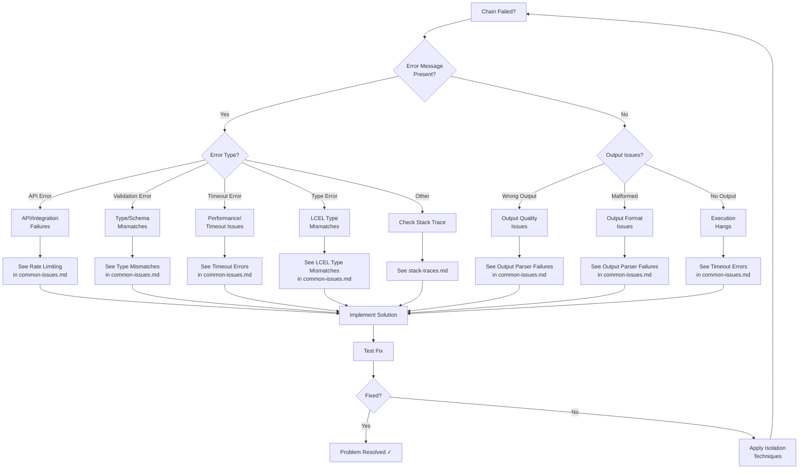

# Troubleshooting LangChain Chain Failures

This guide provides a systematic approach to diagnosing and resolving LangChain chain failures through structured problem identification and isolation techniques.

## Overview

When a LangChain chain fails, the complexity of composed operations (LCEL pipes, callbacks, memory, retrievers) can make root cause identification challenging. This guide provides a decision tree workflow to efficiently navigate from symptoms to solutions.

**Source References:**
- Chain execution lifecycle: `libs/langchain/langchain_classic/chains/base.py:150-238`
- Runnable composition: `libs/core/langchain_core/runnables/base.py:1-100`

---

## Quick Triage Process

Before diving into detailed debugging, perform this 60-second triage to categorize your issue:

### 1. Initial Symptom Identification

**Ask yourself these questions:**

- **Does the chain produce an error message?** → If yes, note the exception type
- **When does the failure occur?** (immediately, after delay, intermittently)
- **Is the failure reproducible?** (every time, sometimes, rarely)
- **What changed recently?** (code, dependencies, data, environment)

### 2. Error Message Categorization

If you have an error message, identify its category:

| Error Pattern | Category | Quick Fix |
|--------------|----------|-----------|
| `429`, `RateLimitError`, `TooManyRequests` | Rate Limiting | Add retry with exponential backoff |
| `KeyError`, `missing 1 required positional argument` | Template/Input Mismatch | Validate input keys match template variables |
| `ValidationError`, `pydantic` | Type/Schema Mismatch | Check Pydantic model fields and types |
| `TimeoutError`, `asyncio.TimeoutError` | Timeout | Increase timeout or optimize chain |
| `JSONDecodeError`, `OutputParserException` | Parser Failure | Validate output format matches parser expectations |
| `ConnectionError`, `APIError` | API/Integration Issue | Check API keys, network, service status |

### 3. Reproducibility Check

```python
# Create a minimal test case
from langchain_core.prompts import ChatPromptTemplate
from langchain_core.output_parsers import StrOutputParser

# Test with simplest possible chain
minimal_chain = (
    ChatPromptTemplate.from_template("Say hello")
    | llm  # Your LLM instance
    | StrOutputParser()
)

try:
    result = minimal_chain.invoke({})
    print(f"✓ Minimal chain works: {result}")
except Exception as e:
    print(f"✗ Minimal chain fails: {type(e).__name__}: {e}")
```

---

## Troubleshooting Decision Tree



---

## Diagnostic Categories

### Category 1: Execution Failures

**Symptoms:**
- Chain raises an exception
- Immediate failure on invoke/ainvoke
- Error during chain construction

**Investigation Steps:**

1. **Check Chain Construction**
   ```python
   # Verify chain components are properly initialized
   print(f"Prompt type: {type(prompt)}")
   print(f"LLM type: {type(llm)}")
   print(f"Parser type: {type(parser)}")
   
   # Test each component individually
   prompt_result = prompt.invoke({"input": "test"})
   print(f"Prompt output: {prompt_result}")
   ```

2. **Validate Inputs with Types**
   ```python
   # Check input dictionary structure
   inputs = {"query": "test"}
   print(f"Input keys: {list(inputs.keys())}")
   print(f"Expected keys: {chain.input_keys}")  # For Chain objects
   
   # Verify types match expectations
   for key, value in inputs.items():
       print(f"{key}: {type(value)} = {value}")
   ```

3. **Enable DEBUG Logging**
   ```python
   import logging
   logging.basicConfig(level=logging.DEBUG)
   logging.getLogger("langchain_classic").setLevel(logging.DEBUG)
   logging.getLogger("langchain_core").setLevel(logging.DEBUG)
   ```
   See [logging.md](./logging.md) for comprehensive logging configuration.

4. **Test Sync vs Async**
   ```python
   # If ainvoke fails, try invoke
   try:
       result = chain.invoke(inputs)
       print("✓ Sync invocation works")
   except Exception as e:
       print(f"✗ Sync also fails: {e}")
   
   # If invoke fails with async chain, check event loop
   import asyncio
   try:
       result = asyncio.run(chain.ainvoke(inputs))
       print("✓ Async invocation works")
   except Exception as e:
       print(f"✗ Async fails: {e}")
   ```

5. **Inspect Stack Trace**
   
   Follow the detailed stack trace interpretation guide: [stack-traces.md](./stack-traces.md)
   
   Look for:
   - Frame immediately before the error
   - User code vs library code distinction
   - Callback invocation patterns

**Common Issues:**
- Template variable mismatches → [common-issues.md#template-variable-mismatches](./common-issues.md)
- Type errors in LCEL composition → [common-issues.md#lcel-type-mismatches](./common-issues.md)
- API authentication failures → [common-issues.md#api-integration-errors](./common-issues.md)

---

### Category 2: Output Quality Issues

**Symptoms:**
- Chain executes successfully but produces unexpected output
- Output format doesn't match expectations
- Inconsistent results across invocations

**Investigation Steps:**

1. **Validate Prompt Templates**
   ```python
   # Inspect the formatted prompt
   from langchain_core.prompts import ChatPromptTemplate
   
   prompt = ChatPromptTemplate.from_messages([
       ("system", "You are a helpful assistant."),
       ("human", "{input}")
   ])
   
   # Check formatted output
   formatted = prompt.invoke({"input": "Hello"})
   print(f"Formatted messages: {formatted}")
   for msg in formatted.messages:
       print(f"  {msg.type}: {msg.content}")
   ```

2. **Check Model Parameters**
   ```python
   # Verify LLM configuration
   print(f"Model: {llm.model_name}")
   print(f"Temperature: {llm.temperature}")
   print(f"Max tokens: {llm.max_tokens}")
   
   # Test with different parameters
   from langchain_openai import ChatOpenAI
   deterministic_llm = ChatOpenAI(temperature=0, model="gpt-3.5-turbo")
   result = deterministic_llm.invoke("Count to 3")
   print(f"Deterministic result: {result.content}")
   ```

3. **Test Output Parsers in Isolation**
   ```python
   from langchain_core.output_parsers import StrOutputParser, JsonOutputParser
   
   # Test parser with known input
   test_output = '{"name": "John", "age": 30}'
   parser = JsonOutputParser()
   
   try:
       parsed = parser.parse(test_output)
       print(f"✓ Parser works: {parsed}")
   except Exception as e:
       print(f"✗ Parser fails: {e}")
       # Try alternative parser
       str_parser = StrOutputParser()
       print(f"Raw output: {str_parser.parse(test_output)}")
   ```

4. **Review Memory Context**
   ```python
   # For chains with memory, inspect loaded variables
   if hasattr(chain, 'memory') and chain.memory:
       memory_vars = chain.memory.load_memory_variables({})
       print(f"Memory variables: {memory_vars}")
       
       # Check history length
       if 'history' in memory_vars:
           history = memory_vars['history']
           print(f"History length: {len(history)} messages")
           print(f"Recent messages: {history[-3:]}")  # Last 3
   ```

**Common Issues:**
- Output parser failures → [common-issues.md#output-parser-failures](./common-issues.md)
- Memory context window overflow → [common-issues.md#memory-overflow](./common-issues.md)
- Inconsistent LLM responses → Check temperature and model parameters

---

### Category 3: Performance Issues

**Symptoms:**
- Chain executes very slowly
- Memory usage grows over time
- Timeouts on long-running operations

**Investigation Steps:**

1. **Profile Execution Time**
   ```python
   import time
   from langchain_core.callbacks import BaseCallbackHandler
   
   class TimingCallback(BaseCallbackHandler):
       def __init__(self):
           self.timings = {}
           self.start_times = {}
       
       def on_chain_start(self, serialized, inputs, **kwargs):
           run_id = kwargs.get('run_id')
           self.start_times[run_id] = time.time()
       
       def on_chain_end(self, outputs, **kwargs):
           run_id = kwargs.get('run_id')
           if run_id in self.start_times:
               elapsed = time.time() - self.start_times[run_id]
               self.timings[run_id] = elapsed
               print(f"Chain completed in {elapsed:.2f}s")
       
       def on_llm_start(self, serialized, prompts, **kwargs):
           run_id = kwargs.get('run_id')
           self.start_times[f"llm_{run_id}"] = time.time()
       
       def on_llm_end(self, response, **kwargs):
           run_id = kwargs.get('run_id')
           key = f"llm_{run_id}"
           if key in self.start_times:
               elapsed = time.time() - self.start_times[key]
               print(f"LLM call completed in {elapsed:.2f}s")
   
   # Use timing callback
   timing_cb = TimingCallback()
   result = chain.invoke(inputs, config={"callbacks": [timing_cb]})
   ```

2. **Check Token Counts**
   ```python
   from langchain_core.callbacks import BaseCallbackHandler
   
   class TokenCountingCallback(BaseCallbackHandler):
       def __init__(self):
           self.total_tokens = 0
           self.prompt_tokens = 0
           self.completion_tokens = 0
       
       def on_llm_end(self, response, **kwargs):
           if hasattr(response, 'llm_output') and response.llm_output:
               token_usage = response.llm_output.get('token_usage', {})
               self.prompt_tokens += token_usage.get('prompt_tokens', 0)
               self.completion_tokens += token_usage.get('completion_tokens', 0)
               self.total_tokens += token_usage.get('total_tokens', 0)
               print(f"Tokens - Prompt: {self.prompt_tokens}, "
                     f"Completion: {self.completion_tokens}, "
                     f"Total: {self.total_tokens}")
   
   token_cb = TokenCountingCallback()
   result = chain.invoke(inputs, config={"callbacks": [token_cb]})
   ```

3. **Analyze Memory Usage**
   ```python
   import tracemalloc
   
   # Start memory tracking
   tracemalloc.start()
   snapshot_before = tracemalloc.take_snapshot()
   
   # Execute chain
   result = chain.invoke(inputs)
   
   # Check memory delta
   snapshot_after = tracemalloc.take_snapshot()
   top_stats = snapshot_after.compare_to(snapshot_before, 'lineno')
   
   print("Top 10 memory allocations:")
   for stat in top_stats[:10]:
       print(stat)
   ```

4. **Review Callback Overhead**
   ```python
   # Test with and without callbacks
   import time
   
   # With callbacks
   start = time.time()
   result_with_cb = chain.invoke(inputs, config={"callbacks": [custom_callback]})
   time_with_cb = time.time() - start
   
   # Without callbacks
   start = time.time()
   result_no_cb = chain.invoke(inputs, config={"callbacks": []})
   time_no_cb = time.time() - start
   
   print(f"Time with callbacks: {time_with_cb:.2f}s")
   print(f"Time without callbacks: {time_no_cb:.2f}s")
   print(f"Callback overhead: {time_with_cb - time_no_cb:.2f}s")
   ```

**Common Issues:**
- Timeout errors → [common-issues.md#timeout-errors](./common-issues.md)
- Token limit exceeded → [common-issues.md#token-limits](./common-issues.md)
- Memory leaks in long-running chains

---

### Category 4: Integration Errors

**Symptoms:**
- API connection failures
- Authentication errors
- Retrieval returning empty results
- Tool execution failures

**Investigation Steps:**

1. **Validate API Keys**
   ```python
   import os
   
   # Check environment variables
   required_keys = ['OPENAI_API_KEY', 'ANTHROPIC_API_KEY']
   for key in required_keys:
       value = os.getenv(key)
       if value:
           print(f"✓ {key}: {'*' * 8}{value[-4:]}")
       else:
           print(f"✗ {key}: NOT SET")
   
   # Test API connection
   from langchain_openai import ChatOpenAI
   try:
       llm = ChatOpenAI(model="gpt-3.5-turbo", max_tokens=10)
       response = llm.invoke("Hi")
       print(f"✓ API connection successful: {response.content}")
   except Exception as e:
       print(f"✗ API connection failed: {e}")
   ```

2. **Check Rate Limits**
   ```python
   from langchain_core.runnables import RunnableConfig
   import time
   
   # Implement simple rate limiting
   def rate_limited_invoke(chain, inputs, delay=1.0):
       """Invoke chain with delay between calls."""
       try:
           result = chain.invoke(inputs)
           time.sleep(delay)
           return result
       except Exception as e:
           if "429" in str(e) or "rate" in str(e).lower():
               print(f"Rate limit hit, waiting {delay * 2}s...")
               time.sleep(delay * 2)
               return rate_limited_invoke(chain, inputs, delay * 2)
           raise
   ```
   
   See detailed rate limiting strategies: [common-issues.md#rate-limiting](./common-issues.md)

3. **Test Retrieval Queries**
   ```python
   # For chains with retrievers
   if hasattr(chain, 'retriever'):
       retriever = chain.retriever
       
       # Test retrieval directly
       test_query = "sample query"
       docs = retriever.get_relevant_documents(test_query)
       print(f"Retrieved {len(docs)} documents")
       
       if len(docs) == 0:
           print("⚠ No documents retrieved - check:")
           print("  - Vector store has documents")
           print("  - Similarity threshold not too high")
           print("  - Query embedding is working")
       
       for i, doc in enumerate(docs[:3]):
           print(f"\nDoc {i+1}:")
           print(f"  Content: {doc.page_content[:100]}...")
           print(f"  Metadata: {doc.metadata}")
   ```

4. **Verify Tool Interfaces**
   ```python
   # For agent chains with tools
   from langchain_core.tools import BaseTool
   
   def validate_tool(tool: BaseTool):
       """Validate tool implements required interface."""
       checks = {
           "has_name": hasattr(tool, 'name') and tool.name,
           "has_description": hasattr(tool, 'description') and tool.description,
           "has_run": hasattr(tool, '_run'),
           "has_arun": hasattr(tool, '_arun'),
       }
       
       for check, passed in checks.items():
           status = "✓" if passed else "✗"
           print(f"{status} {check}")
       
       # Test tool execution
       try:
           result = tool.run("test input")
           print(f"✓ Tool executes: {result}")
       except Exception as e:
           print(f"✗ Tool execution failed: {e}")
   
   # Validate all tools in agent
   if hasattr(chain, 'agent') and hasattr(chain.agent, 'tools'):
       for tool in chain.agent.tools:
           print(f"\nValidating tool: {tool.name}")
           validate_tool(tool)
   ```

**Common Issues:**
- Rate limiting errors → [common-issues.md#rate-limiting](./common-issues.md)
- Empty retrieval results → [common-issues.md#empty-retrieval](./common-issues.md)
- Agent tool failures → [common-issues.md#agent-tool-failures](./common-issues.md)

---

## Systematic Isolation Techniques

When the decision tree doesn't immediately resolve your issue, use these isolation techniques to narrow down the problem.

### Technique 1: Component-Level Testing

Test each component of your chain independently to identify which stage fails.

```python
# Example: LCEL chain: prompt | model | parser
from langchain_core.prompts import ChatPromptTemplate
from langchain_openai import ChatOpenAI
from langchain_core.output_parsers import StrOutputParser

# Define components
prompt = ChatPromptTemplate.from_template("Tell me about {topic}")
model = ChatOpenAI(model="gpt-3.5-turbo")
parser = StrOutputParser()

inputs = {"topic": "Python"}

# Test 1: Prompt alone
try:
    prompt_output = prompt.invoke(inputs)
    print(f"✓ Prompt stage works: {type(prompt_output)}")
    print(f"  Messages: {prompt_output.messages}")
except Exception as e:
    print(f"✗ Prompt stage fails: {e}")
    # STOP: Fix prompt before continuing

# Test 2: Prompt + Model
try:
    model_input = prompt.invoke(inputs)
    model_output = model.invoke(model_input)
    print(f"✓ Model stage works: {type(model_output)}")
    print(f"  Content: {model_output.content[:100]}...")
except Exception as e:
    print(f"✗ Model stage fails: {e}")
    # STOP: Fix model integration before continuing

# Test 3: Full chain
try:
    chain = prompt | model | parser
    final_output = chain.invoke(inputs)
    print(f"✓ Full chain works: {type(final_output)}")
    print(f"  Result: {final_output}")
except Exception as e:
    print(f"✗ Parser stage fails: {e}")
    # Parser is the problem
```

**When to Use:**
- Complex LCEL chains with multiple stages
- Unclear which component is causing the failure
- Type errors in composed chains

### Technique 2: Minimal Reproducible Example

Strip your chain to the simplest possible version that still exhibits the problem.

```python
# Original complex chain
complex_chain = (
    RunnablePassthrough.assign(
        context=lambda x: retriever.get_relevant_documents(x["query"])
    )
    | RunnablePassthrough.assign(
        formatted=lambda x: prompt_template.format(
            context=x["context"],
            query=x["query"],
            history=memory.load_memory_variables({})["history"]
        )
    )
    | llm
    | output_parser
    | RunnablePassthrough.assign(
        saved=lambda x: memory.save_context({"input": x["query"]}, {"output": x})
    )
)

# Minimal version: Remove everything except core logic
minimal_chain = prompt_template | llm | output_parser

# Test minimal version
try:
    result = minimal_chain.invoke({"query": "test"})
    print("✓ Minimal chain works")
    # Problem is in removed components (retriever, memory, etc.)
except Exception as e:
    print(f"✗ Minimal chain fails: {e}")
    # Problem is in core components

# Incrementally add components back
# Add retriever
chain_with_retriever = (
    RunnablePassthrough.assign(
        context=lambda x: retriever.get_relevant_documents(x["query"])
    )
    | prompt_template
    | llm
    | output_parser
)

try:
    result = chain_with_retriever.invoke({"query": "test"})
    print("✓ Chain with retriever works")
except Exception as e:
    print(f"✗ Retriever causes failure: {e}")
    # Retriever is the problem

# Continue adding components until failure reappears
```

**When to Use:**
- Complex chains with many components
- Intermittent failures
- Reporting bugs to library maintainers

### Technique 3: Enhanced Logging

Add comprehensive logging to trace execution flow through your chain.

```python
import logging
from langchain_core.callbacks import BaseCallbackHandler

# Configure detailed logging
logging.basicConfig(
    level=logging.DEBUG,
    format='%(asctime)s - %(name)s - %(levelname)s - %(message)s'
)

# Custom callback for detailed tracing
class DebugCallback(BaseCallbackHandler):
    """Callback that logs all chain events with full context."""
    
    def on_chain_start(self, serialized, inputs, **kwargs):
        print(f"\n{'='*60}")
        print(f"CHAIN START: {serialized.get('name', 'Unknown')}")
        print(f"Inputs: {inputs}")
        print(f"Run ID: {kwargs.get('run_id')}")
        print(f"{'='*60}\n")
    
    def on_chain_end(self, outputs, **kwargs):
        print(f"\n{'='*60}")
        print(f"CHAIN END")
        print(f"Outputs: {outputs}")
        print(f"Run ID: {kwargs.get('run_id')}")
        print(f"{'='*60}\n")
    
    def on_chain_error(self, error, **kwargs):
        print(f"\n{'='*60}")
        print(f"CHAIN ERROR")
        print(f"Error: {type(error).__name__}: {error}")
        print(f"Run ID: {kwargs.get('run_id')}")
        print(f"{'='*60}\n")
    
    def on_llm_start(self, serialized, prompts, **kwargs):
        print(f"\n--- LLM START ---")
        print(f"Model: {serialized.get('name', 'Unknown')}")
        print(f"Prompts ({len(prompts)}):")
        for i, prompt in enumerate(prompts):
            print(f"  Prompt {i+1}: {prompt[:200]}...")
    
    def on_llm_end(self, response, **kwargs):
        print(f"\n--- LLM END ---")
        print(f"Generations: {len(response.generations)}")
        if response.generations:
            print(f"First result: {response.generations[0][0].text[:200]}...")
    
    def on_llm_error(self, error, **kwargs):
        print(f"\n--- LLM ERROR ---")
        print(f"Error: {type(error).__name__}: {error}")

# Use debug callback
debug_cb = DebugCallback()
result = chain.invoke(inputs, config={"callbacks": [debug_cb]})
```

See comprehensive logging configuration: [logging.md](./logging.md)

**When to Use:**
- Silent failures (no error but wrong behavior)
- Understanding execution flow
- Timing and performance analysis

---

## Debugging Workflow Checklist

Use this systematic 10-step approach when troubleshooting any chain failure:

### Step 1: Capture the Error
```python
import traceback

try:
    result = chain.invoke(inputs)
except Exception as e:
    # Capture full context
    error_type = type(e).__name__
    error_msg = str(e)
    stack_trace = traceback.format_exc()
    
    print(f"Error Type: {error_type}")
    print(f"Error Message: {error_msg}")
    print(f"\nFull Stack Trace:\n{stack_trace}")
    
    # Save for analysis
    with open("error_log.txt", "w") as f:
        f.write(f"Error Type: {error_type}\n")
        f.write(f"Error Message: {error_msg}\n\n")
        f.write(f"Stack Trace:\n{stack_trace}\n")
```

### Step 2: Identify Error Category
Refer to the [Decision Tree](#troubleshooting-decision-tree) above to categorize the error.

### Step 3: Check Recent Changes
```bash
# Check git diff
git diff HEAD~1

# Check recent commits
git log --oneline -5

# Check environment changes
diff <(pip freeze) previous_requirements.txt
```

### Step 4: Verify Environment
```python
import sys
import os

# Check Python version
print(f"Python: {sys.version}")

# Check key packages
import langchain_core
import langchain_classic
print(f"langchain-core: {langchain_core.__version__}")
print(f"langchain-classic: {langchain_classic.__version__}")

# Check environment variables
critical_vars = ['OPENAI_API_KEY', 'ANTHROPIC_API_KEY']
for var in critical_vars:
    print(f"{var}: {'SET' if os.getenv(var) else 'NOT SET'}")
```

### Step 5: Enable Debug Logging
```python
import logging

# Enable all LangChain debug logs
logging.basicConfig(level=logging.DEBUG)
for logger_name in ['langchain_core', 'langchain_classic', 'langchain_openai']:
    logging.getLogger(logger_name).setLevel(logging.DEBUG)
```

### Step 6: Test in Isolation
Use [Component-Level Testing](#technique-1-component-level-testing) to isolate the failing component.

### Step 7: Create Minimal Reproduction
Use [Minimal Reproducible Example](#technique-2-minimal-reproducible-example) to create simplest failing case.

### Step 8: Search for Known Issues
```python
# Check error against common issues
error_msg = str(e).lower()

known_patterns = {
    "429": "Rate limiting - see common-issues.md#rate-limiting",
    "keyerror": "Template mismatch - see common-issues.md#template-mismatches",
    "timeout": "Timeout error - see common-issues.md#timeout-errors",
    "validation": "Type mismatch - see common-issues.md#type-mismatches",
}

for pattern, guide in known_patterns.items():
    if pattern in error_msg:
        print(f"⚠ Known issue detected: {guide}")
```

Consult: [common-issues.md](./common-issues.md) for detailed solutions.

### Step 9: Inspect Stack Trace
Follow the stack trace interpretation guide: [stack-traces.md](./stack-traces.md)

Key points to identify:
- Last frame in your code (your bug location)
- First frame in library code (library entry point)
- Callback invocations (on_chain_start, on_llm_end, etc.)

### Step 10: Implement and Test Fix
```python
# Document your fix
"""
Issue: [Brief description]
Root Cause: [What caused it]
Solution: [What fixed it]
Prevention: [How to avoid in future]
"""

# Test the fix
def test_fix():
    try:
        result = chain.invoke(inputs)
        print("✓ Fix successful")
        return True
    except Exception as e:
        print(f"✗ Fix unsuccessful: {e}")
        return False

# Verify fix multiple times
for i in range(3):
    print(f"\nTest {i+1}/3:")
    test_fix()
```

---

## Common Debugging Patterns

### Pattern 1: "It worked yesterday"
**Likely causes:**
- Dependency version changed (check requirements.txt)
- Environment variable modified/removed
- API quota exhausted
- External service outage

**Quick check:**
```bash
# Check recent changes
git log --since="yesterday" --oneline

# Verify dependencies
pip list | grep langchain

# Check API status
curl https://status.openai.com/api/v2/status.json
```

### Pattern 2: "It works sometimes"
**Likely causes:**
- Rate limiting (intermittent 429 errors)
- Non-deterministic LLM responses
- Concurrent execution issues
- Memory/context overflow on longer inputs

**Quick check:**
```python
# Test determinism
llm_deterministic = ChatOpenAI(temperature=0, model="gpt-3.5-turbo")
results = [chain.invoke(inputs) for _ in range(5)]
print(f"Unique results: {len(set(results))} / 5")
```

### Pattern 3: "It works in development but fails in production"
**Likely causes:**
- Environment variable differences
- Different dependency versions
- Timeout settings too aggressive
- Missing error handling for rate limits

**Quick check:**
```python
# Compare environments
import os
print("Environment comparison:")
print(f"  Dev OPENAI_API_KEY: {os.getenv('OPENAI_API_KEY')[:10] if os.getenv('OPENAI_API_KEY') else 'NOT SET'}")
print(f"  Python version: {sys.version}")
print(f"  Installed packages: {len(list(pkg_resources.working_set))}")
```

---

## Next Steps

Once you've identified your issue using this guide:

1. **Implement the solution** from [common-issues.md](./common-issues.md)
2. **Add logging** per [logging.md](./logging.md) to prevent recurrence
3. **Document the fix** in your codebase
4. **Add tests** to prevent regression

For deeper understanding of LangChain execution:
- [Chain Lifecycle](../architecture/chain-lifecycle.md) - Understand the execution flow
- [LCEL Type System](../architecture/lcel-type-system.md) - Master type-safe composition
- [Callback System](../architecture/callback-system.md) - Leverage callbacks for observability

---

**Source Citations:**
- Chain execution flow: `libs/langchain/langchain_classic/chains/base.py:150-238`
- Callback integration: `libs/langchain/langchain_classic/chains/base.py:203-234`
- Runnable interface: `libs/core/langchain_core/runnables/base.py:1-100`
