# Core Concepts

## Introduction

Understanding LangChain's core abstractions is critical for building effective applications with the framework. These concepts form the foundation of how you'll compose, execute, and monitor your LLM applications. Whether you're building simple prompt chains or complex multi-agent systems, mastering these abstractions will enable you to:

- **Build type-safe compositions** that catch errors at development time rather than runtime
- **Leverage standardized interfaces** that work consistently across different components
- **Debug and observe** your applications with built-in tracing and callback mechanisms
- **Scale your applications** with optimized batch processing and streaming support

This guide introduces five fundamental concepts that power LangChain applications:

1. **Runnables** - The standard interface for composable units of work
2. **LCEL (LangChain Expression Language)** - Declarative syntax for chaining components
3. **Chains** - Higher-level abstractions for common patterns (legacy approach)
4. **Messages** - Structured data types for chat interactions
5. **Callbacks** - Hooks for observability and monitoring

## Runnables

### What is a Runnable?

A `Runnable` is the core protocol in LangChain that defines a standard interface for units of work that can be invoked, batched, streamed, and composed together. Think of it as a contract that guarantees any component implementing it will have consistent methods for execution.

**Source:** `libs/core/langchain_core/runnables/base.py:122-254`

### Key Characteristics

- **Generic Types:** Runnables use `Generic[Input, Output]` to provide type safety
  - `Input`: The type of data the Runnable accepts
  - `Output`: The type of data the Runnable produces
- **Standard Methods:** All Runnables expose the same core methods regardless of their internal implementation
- **Built-in Optimizations:** Automatic parallelization for batch operations and async support

### Core Methods

Every Runnable implements these fundamental methods:

#### `invoke()` / `ainvoke()`

Transforms a single input into an output synchronously (or asynchronously).

```python
from langchain_core.runnables import RunnableLambda

def add_one(x: int) -> int:
    return x + 1

runnable = RunnableLambda(add_one)
result = runnable.invoke(5)  # Returns: 6

# Async version
result = await runnable.ainvoke(5)  # Returns: 6
```

**Source:** `libs/core/langchain_core/runnables/base.py:809-849`

#### `batch()` / `abatch()`

Efficiently transforms multiple inputs into outputs. By default, uses thread pool parallelization.

```python
runnable = RunnableLambda(add_one)
results = runnable.batch([1, 2, 3, 4, 5])
# Returns: [2, 3, 4, 5, 6]

# Async version
results = await runnable.abatch([1, 2, 3, 4, 5])
# Returns: [2, 3, 4, 5, 6]
```

**Source:** `libs/core/langchain_core/runnables/base.py:851-898`

#### `stream()` / `astream()`

Streams output as it's produced, enabling real-time responses for long-running operations.

```python
# For streaming-capable runnables (like LLMs)
for chunk in runnable.stream(input_data):
    print(chunk, end="", flush=True)

# Async version
async for chunk in runnable.astream(input_data):
    print(chunk, end="", flush=True)
```

**Source:** `libs/core/langchain_core/runnables/base.py:1109-1147`

### Configuration with RunnableConfig

All Runnable methods accept an optional `config` parameter for execution control:

```python
config = {
    "tags": ["production", "experiment-v2"],
    "metadata": {"user_id": "user_123"},
    "callbacks": [custom_callback_handler],
    "max_concurrency": 5
}

result = runnable.invoke(input_data, config=config)
```

**Common config options:**
- `tags`: List of strings for categorizing runs
- `metadata`: Dictionary for attaching custom data
- `callbacks`: List of callback handlers for observability
- `max_concurrency`: Maximum number of parallel executions in batch operations

**Source:** `libs/core/langchain_core/runnables/base.py:810-828`

## LCEL (LangChain Expression Language)

### What is LCEL?

LCEL is a declarative syntax for composing Runnables into chains using the pipe operator (`|`). It provides a clean, readable way to express data flow through multiple processing steps while automatically handling type composition, streaming, and error propagation.

**Source:** `libs/core/langchain_core/runnables/base.py:150-186`

### The Pipe Operator (`|`)

The pipe operator composes two Runnables sequentially, where the output of the first becomes the input of the second.

#### Type Flow

When you compose `Runnable[A, B] | Runnable[B, C]`, you get `Runnable[A, C]`:

```
Input Type A → [Runnable 1] → Intermediate Type B → [Runnable 2] → Output Type C
```

This type composition ensures type safety: the output type of one Runnable must match the input type of the next.

**Source:** `libs/core/langchain_core/runnables/base.py:608-627`

### Basic LCEL Example

```python
from langchain_core.runnables import RunnableLambda

# Define individual processing steps
add_one = RunnableLambda(lambda x: x + 1)
multiply_two = RunnableLambda(lambda x: x * 2)

# Compose them using the pipe operator
sequence = add_one | multiply_two

# Execute the composed chain
result = sequence.invoke(5)  # (5 + 1) * 2 = 12
```

**Source:** `libs/core/langchain_core/runnables/base.py:171-186`

### Real-World LCEL Pattern: Prompt | Model | Parser

The most common LCEL pattern chains together a prompt template, a language model, and an output parser:

```python
from langchain_core.prompts import ChatPromptTemplate
from langchain_core.output_parsers import StrOutputParser
from langchain_openai import ChatOpenAI

# Define the prompt template
prompt = ChatPromptTemplate.from_messages([
    ("system", "You are a helpful assistant."),
    ("human", "{question}")
])

# Define the model
model = ChatOpenAI(model="gpt-4")

# Define the output parser
parser = StrOutputParser()

# Compose the chain using LCEL
chain = prompt | model | parser

# Execute with type flow:
# dict → ChatPromptValue → AIMessage → str
result = chain.invoke({"question": "What is 2 + 2?"})
# Returns: "2 + 2 equals 4."
```

**Type flow visualization:**
```
{"question": str}  →  [PromptTemplate]  →  List[BaseMessage]
    ↓
List[BaseMessage]  →  [ChatModel]  →  AIMessage
    ↓
AIMessage  →  [StrOutputParser]  →  str
```

**Source:** `libs/cli/langchain_cli/package_template/package_template/chain.py`

### Parallel Composition

LCEL supports parallel execution using dictionary literals:

```python
from langchain_core.runnables import RunnableLambda

# Parallel branches
parallel_chain = {
    "double": RunnableLambda(lambda x: x * 2),
    "triple": RunnableLambda(lambda x: x * 3),
    "square": RunnableLambda(lambda x: x ** 2)
}

result = parallel_chain.invoke(5)
# Returns: {"double": 10, "triple": 15, "square": 25}
```

You can then pipe the parallel results to another Runnable:

```python
chain = RunnableLambda(lambda x: x + 1) | parallel_chain
result = chain.invoke(5)
# Returns: {"double": 12, "triple": 18, "square": 36}
```

**Source:** `libs/core/langchain_core/runnables/base.py:180-185`

### Benefits of LCEL

1. **Automatic Streaming:** Any chain built with LCEL automatically supports streaming
2. **Async Support:** Both sync and async execution without extra code
3. **Batch Optimization:** Parallel execution of batch operations
4. **Type Safety:** Compile-time type checking for compositions
5. **Observability:** Built-in tracing and callback integration

## Chains

### What are Chains?

Chains are higher-level abstractions that build on top of Runnables to provide structured sequences of calls to components. They represent the legacy approach to building LangChain applications, predating LCEL.

**Source:** `libs/langchain/langchain_classic/chains/base.py:52-73`

### Chain Base Class

The `Chain` abstract base class extends `RunnableSerializable[dict[str, Any], dict[str, Any]]`, meaning:
- **Input:** Always a dictionary
- **Output:** Always a dictionary
- **Runnable Compatibility:** Can be used anywhere Runnables are accepted

```python
from langchain_classic.chains import Chain

# All chains inherit from this base class
class CustomChain(Chain):
    # Must implement these abstract methods
    @property
    def input_keys(self) -> list[str]:
        """Return list of expected input keys."""
        return ["input"]
    
    @property
    def output_keys(self) -> list[str]:
        """Return list of output keys."""
        return ["output"]
    
    def _call(self, inputs: dict[str, Any]) -> dict[str, Any]:
        """Execute the chain logic."""
        # Your implementation here
        return {"output": "result"}
```

**Source:** `libs/langchain/langchain_classic/chains/base.py:52-102`

### Chain Execution Lifecycle

When you call `chain.invoke(inputs)`, the following sequence occurs:

1. **`prep_inputs()`** - Validates and prepares inputs, loads memory if configured
2. **Callback: `on_chain_start`** - Signals chain execution beginning
3. **`_call()`** - Executes the core chain logic (must be implemented by subclasses)
4. **Callback: `on_chain_end`** - Signals successful completion
5. **Memory save** - Saves outputs to memory if configured
6. **Return outputs** - Returns dictionary of results

If an error occurs, `on_chain_error` callback is triggered instead of `on_chain_end`.

**Source:** `libs/langchain/langchain_classic/chains/base.py`

### Memory Integration

Chains support optional memory for stateful conversations:

```python
from langchain_classic.memory import ConversationBufferMemory
from langchain_classic.chains import ConversationChain

memory = ConversationBufferMemory()
chain = ConversationChain(
    llm=llm,
    memory=memory,
    verbose=True
)

# Memory is automatically loaded at start and saved at end
result1 = chain.invoke({"input": "Hi, I'm Alice"})
result2 = chain.invoke({"input": "What's my name?"})
# Memory allows the chain to remember "Alice" from previous turn
```

**Source:** `libs/langchain/langchain_classic/chains/base.py:75-81`

### Deprecation Note

Many specific chain types (like `LLMChain`) are deprecated in favor of LCEL composition. The modern approach is:

**Old (Deprecated):**
```python
from langchain_classic.chains import LLMChain

chain = LLMChain(llm=model, prompt=prompt)
result = chain.invoke({"question": "What is 2+2?"})
```

**New (LCEL):**
```python
chain = prompt | model | parser
result = chain.invoke({"question": "What is 2+2?"})
```

The LCEL approach is more flexible, composable, and provides better type safety.

## Messages

### What are Messages?

Messages are structured data types that represent individual units in a conversation or prompt. They provide a standardized way to represent different roles (human, AI, system) and content types in chat-based interactions.

**Source:** `libs/core/langchain_core/messages/__init__.py:1`

### Core Message Types

#### HumanMessage

Represents input from a human user.

```python
from langchain_core.messages import HumanMessage

message = HumanMessage(content="What is the capital of France?")
```

**Source:** `libs/core/langchain_core/messages/__init__.py:46`

#### AIMessage

Represents output from an AI model.

```python
from langchain_core.messages import AIMessage

message = AIMessage(content="The capital of France is Paris.")
```

**Source:** `libs/core/langchain_core/messages/__init__.py:9-12`

#### SystemMessage

Represents system-level instructions that guide the AI's behavior.

```python
from langchain_core.messages import SystemMessage

message = SystemMessage(content="You are a helpful assistant that speaks like a pirate.")
```

**Source:** `libs/core/langchain_core/messages/__init__.py:48`

#### Other Message Types

- **`FunctionMessage`:** Represents the result of a function call (legacy)
- **`ToolMessage`:** Represents the result of a tool execution
- **`ChatMessage`:** Generic message with a custom role

**Source:** `libs/core/langchain_core/messages/__init__.py:45-54`

### Message Structure

All messages share common fields:

```python
from langchain_core.messages import BaseMessage

# Common fields across all message types:
# - content: str | list  # The message content
# - role: str           # The role identifier
# - additional_kwargs: dict  # Extra metadata
# - id: str             # Optional unique identifier
# - name: str           # Optional name for the message source
```

### Using Messages in Prompts

Messages are commonly used with `ChatPromptTemplate`:

```python
from langchain_core.prompts import ChatPromptTemplate
from langchain_core.messages import SystemMessage, HumanMessage

# Method 1: Using tuples (automatically converted to messages)
prompt = ChatPromptTemplate.from_messages([
    ("system", "You are a helpful assistant."),
    ("human", "{user_input}")
])

# Method 2: Using message objects directly
prompt = ChatPromptTemplate.from_messages([
    SystemMessage(content="You are a helpful assistant."),
    HumanMessage(content="{user_input}")
])

# Format the prompt
messages = prompt.format_messages(user_input="Hello!")
# Returns: [SystemMessage(...), HumanMessage(content="Hello!")]
```

**Source:** `libs/core/langchain_core/prompts/chat.py:84-100`

### Message Content Types

Messages can contain different types of content:

- **Plain text:** Simple string content
- **Structured content:** Lists of content blocks (text, images, audio, etc.)
- **Tool calls:** Structured tool invocations in AI messages
- **Citations:** Source references in AI messages

```python
from langchain_core.messages import HumanMessage

# Simple text message
text_message = HumanMessage(content="Hello")

# Multi-modal message with image
multimodal_message = HumanMessage(content=[
    {"type": "text", "text": "What's in this image?"},
    {"type": "image_url", "image_url": {"url": "https://..."}}
])
```

**Source:** `libs/core/langchain_core/messages/__init__.py:24-43`

## Callbacks

### What are Callbacks?

Callbacks are hooks that allow you to observe and react to events during chain execution. They provide visibility into the execution lifecycle, enabling logging, monitoring, debugging, and custom side effects.

**Source:** `libs/core/langchain_core/callbacks/base.py:1`

### Callback Event Sequence

During a typical chain execution, callbacks fire in this order:

1. **`on_chain_start`** - Chain execution begins
2. **`on_llm_start`** - LLM invocation begins (if chain includes LLM)
3. **`on_llm_new_token`** - New token generated (during streaming)
4. **`on_llm_end`** - LLM invocation completes
5. **`on_chain_end`** - Chain execution completes successfully

If errors occur:
- **`on_chain_error`** - Chain execution failed
- **`on_llm_error`** - LLM invocation failed
- **`on_tool_error`** - Tool execution failed

**Source:** `libs/core/langchain_core/callbacks/base.py:86-400`

### Key Callback Methods

#### Chain Callbacks

```python
def on_chain_start(
    self,
    serialized: dict[str, Any],
    inputs: dict[str, Any],
    *,
    run_id: UUID,
    parent_run_id: UUID | None = None,
    tags: list[str] | None = None,
    metadata: dict[str, Any] | None = None,
    **kwargs: Any,
) -> Any:
    """Run when a chain starts running."""
```

**Source:** `libs/core/langchain_core/callbacks/base.py:316-337`

#### LLM Callbacks

```python
def on_llm_start(
    self,
    serialized: dict[str, Any],
    prompts: list[str],
    *,
    run_id: UUID,
    parent_run_id: UUID | None = None,
    **kwargs: Any,
) -> Any:
    """Run when LLM starts running."""

def on_llm_new_token(
    self,
    token: str,
    *,
    chunk: GenerationChunk | ChatGenerationChunk | None = None,
    run_id: UUID,
    parent_run_id: UUID | None = None,
    **kwargs: Any,
) -> Any:
    """Run on new output token (streaming only)."""

def on_llm_end(
    self,
    response: LLMResult,
    *,
    run_id: UUID,
    parent_run_id: UUID | None = None,
    **kwargs: Any,
) -> Any:
    """Run when LLM ends running."""
```

**Source:** `libs/core/langchain_core/callbacks/base.py:234-100`

### Implementing a Custom Callback Handler

```python
from langchain_core.callbacks import BaseCallbackHandler
from uuid import UUID

class LoggingCallbackHandler(BaseCallbackHandler):
    """Custom callback handler that logs execution events."""
    
    def on_chain_start(
        self,
        serialized: dict[str, Any],
        inputs: dict[str, Any],
        *,
        run_id: UUID,
        **kwargs: Any,
    ) -> None:
        """Log when chain starts."""
        print(f"[Chain Start] Run ID: {run_id}")
        print(f"Inputs: {inputs}")
    
    def on_chain_end(
        self,
        outputs: dict[str, Any],
        *,
        run_id: UUID,
        **kwargs: Any,
    ) -> None:
        """Log when chain ends."""
        print(f"[Chain End] Run ID: {run_id}")
        print(f"Outputs: {outputs}")
    
    def on_llm_new_token(
        self,
        token: str,
        *,
        run_id: UUID,
        **kwargs: Any,
    ) -> None:
        """Log each new token during streaming."""
        print(token, end="", flush=True)

# Usage
callback_handler = LoggingCallbackHandler()
result = chain.invoke(
    {"input": "Hello"},
    config={"callbacks": [callback_handler]}
)
```

### Async Callback Considerations

When using async chains with `ainvoke`, use `AsyncCallbackHandler` for async callback methods:

```python
from langchain_core.callbacks import AsyncCallbackHandler

class AsyncLoggingHandler(AsyncCallbackHandler):
    async def on_chain_start(self, ...):
        """Async callback method."""
        await some_async_operation()
```

This ensures callbacks don't block the event loop during async execution.

## Relationship Diagram

The following diagram illustrates how these concepts relate to each other:

```mermaid
graph TB
    subgraph "Core Protocol"
        R[Runnable<Input, Output>]
        R --> |implements| Methods["invoke() / ainvoke()<br/>batch() / abatch()<br/>stream() / astream()"]
    end
    
    subgraph "Composition Layer"
        LCEL["LCEL (Pipe Operator |)"]
        LCEL --> |creates| RS[RunnableSequence]
        LCEL --> |creates| RP[RunnableParallel]
    end
    
    subgraph "Legacy Abstractions"
        C[Chain]
        C --> |extends| R
        C --> |uses| M[Memory]
    end
    
    subgraph "Data Types"
        Msg[Messages]
        Msg --> HM[HumanMessage]
        Msg --> AM[AIMessage]
        Msg --> SM[SystemMessage]
    end
    
    subgraph "Observability"
        CB[Callbacks]
        CB --> |events| Events["on_chain_start<br/>on_llm_start<br/>on_llm_new_token<br/>on_llm_end<br/>on_chain_end"]
    end
    
    R -.-> |uses| Msg
    R -.-> |emits| CB
    C -.-> |emits| CB
    LCEL -.-> |composes| R
    
    style R fill:#e1f5ff
    style LCEL fill:#fff4e1
    style C fill:#ffe1e1
    style Msg fill:#e1ffe1
    style CB fill:#f0e1ff
```



### Key Relationships

- **Runnable is the foundation:** All components implement the Runnable protocol
- **LCEL composes Runnables:** The pipe operator creates RunnableSequence and RunnableParallel compositions
- **Chains extend Runnables:** Legacy Chain class builds on Runnable for backward compatibility
- **Messages are data:** Used as inputs/outputs throughout the system
- **Callbacks provide observability:** All Runnables and Chains emit callback events

## Next Steps

Now that you understand these core concepts, you're ready to:

1. **[Build your first chain](quickstart.md)** - Apply these concepts in a working example
2. **[Explore LCEL patterns](../guides/lcel-composition.md)** - Learn advanced composition techniques
3. **[Implement custom chains](../guides/chain-types.md)** - Create reusable chain patterns
4. **[Add memory](../guides/memory-integration.md)** - Make your chains stateful
5. **[Debug with callbacks](../guides/callbacks.md)** - Implement custom observability

## Additional Resources

- **[API Reference: Runnables](../api-reference/runnables/base.md)** - Detailed Runnable API documentation
- **[API Reference: Chains](../api-reference/chains/base.md)** - Complete Chain class reference
- **[API Reference: Messages](../api-reference/prompts/message-types.md)** - Message type specifications
- **[API Reference: Callbacks](../api-reference/callbacks/handlers.md)** - Callback handler interfaces
- **[Architecture: LCEL Type System](../architecture/lcel-type-system.md)** - Deep dive into type composition
- **[Debugging Guide](../debugging/common-issues.md)** - Troubleshooting common problems
