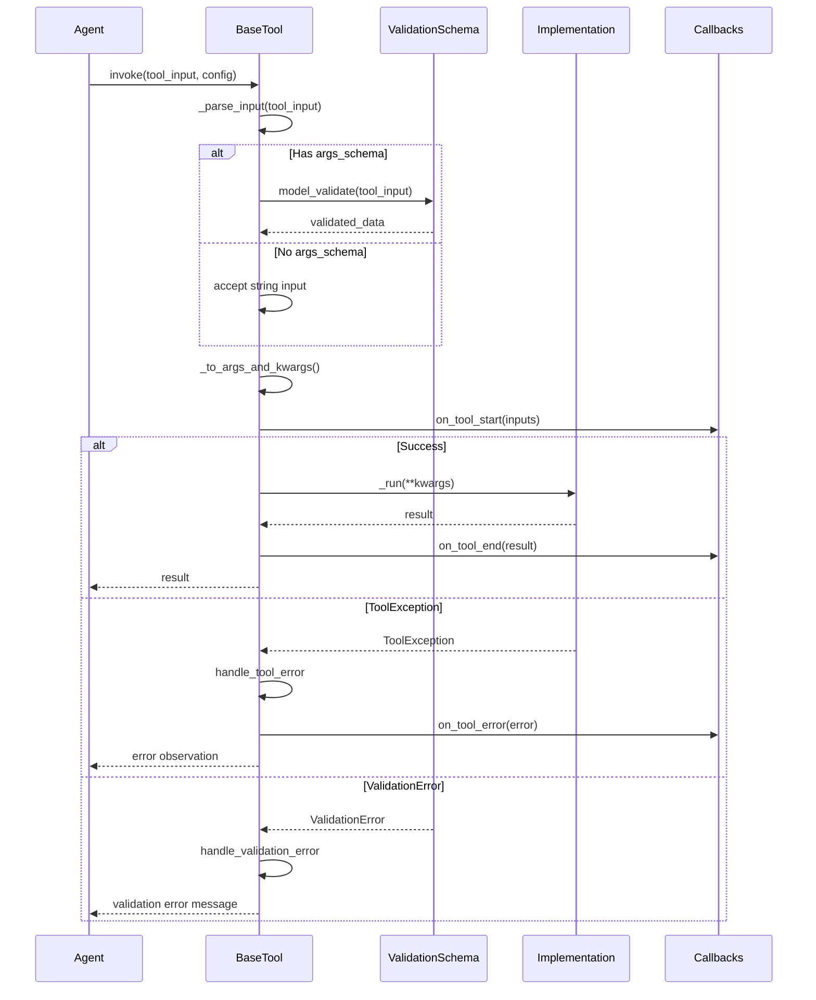
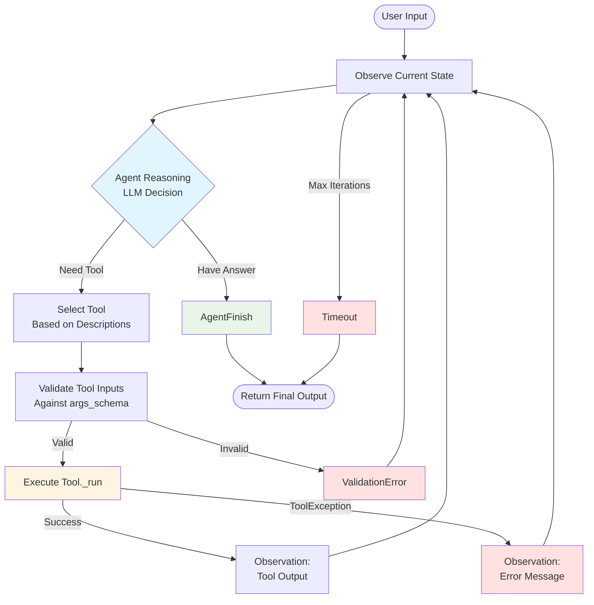
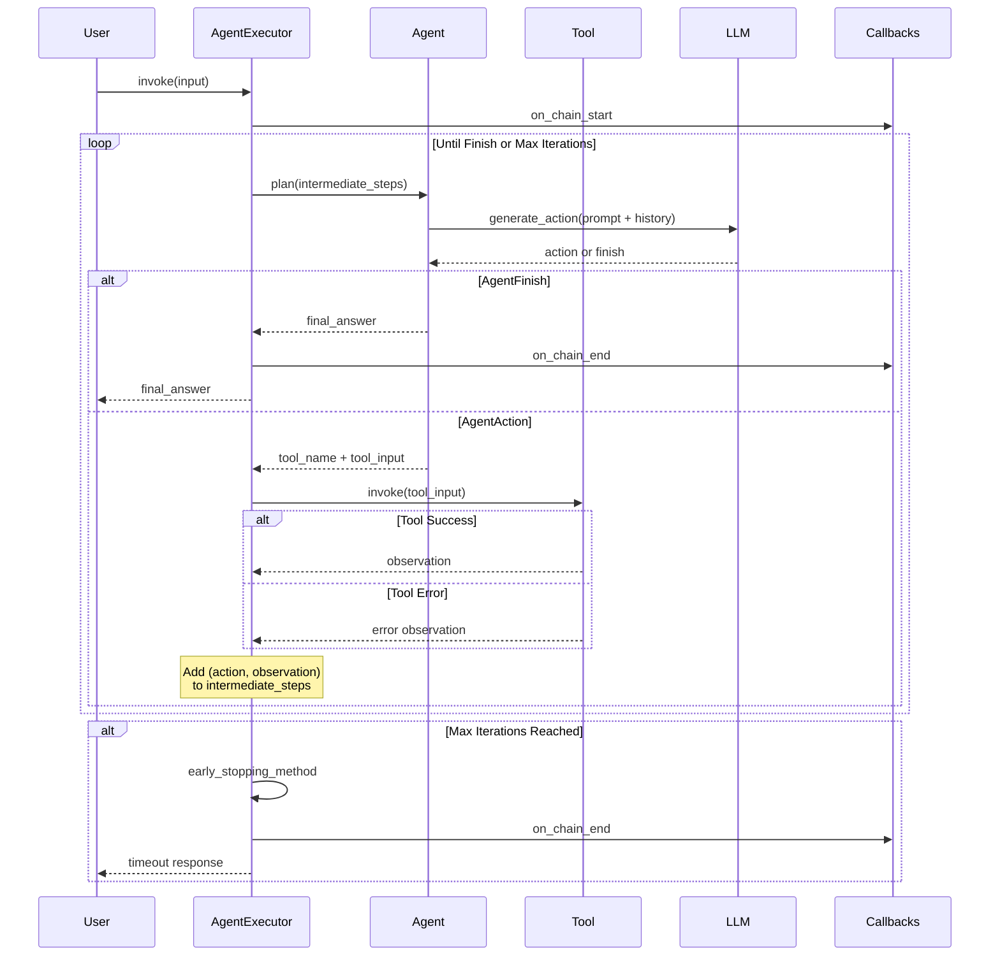

# Agent and Tool Development Guide

## Overview

This comprehensive tutorial guides you through implementing custom LangChain agents and tools with production-grade type validation. Whether you're new to LangChain or building advanced agent systems, you'll learn how to create tools that agents can reliably invoke, implement custom agents with sophisticated reasoning capabilities, and deploy agent systems to production.

**What You'll Learn:**

- Tool interface contracts and type validation requirements
- Three approaches to creating tools (BaseTool, StructuredTool, @tool decorator)
- Custom tool implementation with Pydantic schema validation
- Agent architecture and the decision loop (observation → thought → action)
- Production considerations for reliability, security, and monitoring
- Debugging strategies for agent and tool issues

**Prerequisites:**

- Python 3.10+ installed
- Basic understanding of LangChain [Chains](chain-types.md) and [Runnables](lcel-composition.md)
- Familiarity with [Pydantic](https://docs.pydantic.dev/) for data validation
- LangChain packages: `langchain-core`, `langchain-classic`, and an LLM integration

---

## Introduction: Agents and Tools

### What are Agents?

[Agents](../glossary.md#agent) are autonomous LLM-driven systems that use reasoning to accomplish tasks. Unlike [Chains](../glossary.md#chain) that follow predetermined execution paths, agents dynamically decide which actions to take based on observations and intermediate results.

**Agent Key Characteristics** (Source: `libs/langchain/langchain_classic/agents/agent.py:1-100`):

- **Autonomous Decision-Making**: Uses LLM reasoning to determine next actions
- **Tool Access**: Can invoke external tools (APIs, databases, calculators, etc.)
- **Iterative Execution**: Operates in a loop until task completion or max iterations reached
- **Goal-Oriented**: Works toward completing user objectives through multi-step reasoning

### What are Tools?

[Tools](../glossary.md#tool) are agent-callable functions with standardized interfaces. They provide the capabilities agents need to interact with external systems and perform specific operations.

**Tool Key Characteristics** (Source: `libs/core/langchain_core/tools/base.py:390-448`):

- **Standardized Interface**: All tools implement the `BaseTool` interface
- **Type-Safe Inputs**: Pydantic models validate tool inputs before execution
- **LLM-Friendly Descriptions**: Tools provide natural language descriptions for agent selection
- **Error Handling**: Built-in mechanisms for graceful failure recovery

### When to Use Agents vs Chains

**Use Agents When:**

- Task requires dynamic decision-making based on intermediate results
- Multiple tools are available and the agent must select appropriate ones
- Problem-solving requires iterative reasoning
- The path to solution is not predetermined

**Use Chains When:**

- Execution flow is deterministic and can be predefined
- Task requires simple sequential processing
- Predictable performance and latency are critical
- Problem domain is well-understood with a fixed solution path

---

## Tool Interface Overview

All LangChain tools inherit from `BaseTool`, which defines a standardized interface for agent-callable functions. Understanding this interface is essential for creating reliable custom tools.

### BaseTool Core Fields

Source: `libs/core/langchain_core/tools/base.py:430-480`

```python
class BaseTool(RunnableSerializable[str | dict | ToolCall, Any]):
    """Base class for all LangChain tools."""
    
    name: str
    # Required: Unique identifier for the tool (used by agents to select)
    # Format: lowercase with underscores (e.g., "search_web", "calculate_sum")
    
    description: str
    # Required: Explains when/how/why to use the tool
    # This is presented to the LLM - be descriptive and include examples
    # Example: "Useful for searching the web when you need current information
    #           about events, facts, or data not in your training. Input should
    #           be a search query string."
    
    args_schema: Type[BaseModel] | None = None
    # Optional but recommended: Pydantic model defining input validation
    # If None, tool accepts a single string argument
    # If provided, must be a Pydantic BaseModel subclass
    
    return_direct: bool = False
    # Optional: If True, agent stops after this tool and returns result directly
    # Useful for tools that produce final answers (e.g., "answer_question")
    
    verbose: bool = False
    # Optional: Enable detailed logging for debugging
    
    callbacks: Callbacks = None
    # Optional: Callback handlers for monitoring tool execution
    
    tags: list[str] | None = None
    # Optional: Tags for categorizing and filtering tools
    
    metadata: dict[str, Any] | None = None
    # Optional: Additional metadata for tool tracking
    
    handle_tool_error: bool | str | Callable[[ToolException], str] | None = False
    # Optional: Error handling configuration
    #   - False (default): Raise exceptions normally
    #   - True: Log error and continue with error message
    #   - str: Return this string as error observation
    #   - Callable: Custom error handler function
    
    handle_validation_error: bool | str | Callable[[ValidationError], str] | None = False
    # Optional: Handle Pydantic validation errors
    # Same options as handle_tool_error
```

### BaseTool Abstract Methods

Source: `libs/core/langchain_core/tools/base.py:684-708`

Every tool must implement at least the `_run` method. The `_arun` method has a default implementation that runs `_run` in an executor, but you should override it for truly async operations.

```python
@abstractmethod
def _run(self, *args: Any, **kwargs: Any) -> Any:
    """Execute the tool synchronously.
    
    Args:
        *args: Positional arguments (usually empty)
        **kwargs: Tool inputs from args_schema validation
        run_manager: Optional CallbackManagerForToolRun for tracing
    
    Returns:
        Tool execution result (any type)
    
    Raises:
        ToolException: For expected errors that agent should observe
        Other exceptions: For unexpected errors
    """
    pass

async def _arun(self, *args: Any, **kwargs: Any) -> Any:
    """Execute the tool asynchronously.
    
    Default implementation runs _run in executor. Override for true async.
    
    Args:
        *args: Positional arguments (usually empty)
        **kwargs: Tool inputs from args_schema validation
        run_manager: Optional AsyncCallbackManagerForToolRun for tracing
    
    Returns:
        Tool execution result (any type)
    """
    # Default: await run_in_executor(None, self._run, *args, **kwargs)
```

### Tool Invocation Flow

When an agent invokes a tool, the following sequence occurs:



---

## Tool Creation Methods

LangChain provides three approaches for creating tools, each suited to different use cases. Choose based on your requirements for control, validation complexity, and ease of use.

### Comparison: When to Use Each Approach

| Approach | Use When | Pros | Cons |
|----------|----------|------|------|
| **Subclass BaseTool** | Need full control, complex validation, stateful tools | Maximum flexibility, custom lifecycle | More boilerplate code |
| **StructuredTool.from_function** | Convert existing function to tool, multiple parameters | Automatic schema inference, less code | Limited customization |
| **@tool decorator** | Simple single-parameter tools, rapid prototyping | Minimal code, automatic parsing | Single string input only |

### Method 1: Subclassing BaseTool

**When to Use**: Full control over tool behavior, complex validation logic, or stateful operations.

**Implementation Pattern**:

```python
from typing import Type
from pydantic import BaseModel, Field
from langchain_core.tools import BaseTool
from langchain_core.callbacks import CallbackManagerForToolRun

# Step 1: Define Pydantic model for input validation
class CalculatorInput(BaseModel):
    """Input schema for calculator tool."""
    operation: str = Field(
        description="Math operation: 'add', 'subtract', 'multiply', 'divide'"
    )
    a: float = Field(description="First number")
    b: float = Field(description="Second number")

# Step 2: Subclass BaseTool
class CalculatorTool(BaseTool):
    """Tool for performing basic arithmetic operations."""
    
    name: str = "calculator"
    description: str = (
        "Useful for performing arithmetic calculations. "
        "Supports add, subtract, multiply, and divide operations. "
        "Input should be an operation name and two numbers. "
        "Example: operation='add', a=5, b=3 returns 8.0"
    )
    args_schema: Type[BaseModel] = CalculatorInput
    
    # Step 3: Implement _run method
    def _run(
        self,
        operation: str,
        a: float,
        b: float,
        run_manager: CallbackManagerForToolRun | None = None,
    ) -> float:
        """Execute the calculation."""
        if run_manager:
            run_manager.on_text(f"Calculating: {a} {operation} {b}\n")
        
        if operation == "add":
            return a + b
        elif operation == "subtract":
            return a - b
        elif operation == "multiply":
            return a * b
        elif operation == "divide":
            if b == 0:
                raise ToolException("Cannot divide by zero")
            return a / b
        else:
            raise ToolException(
                f"Unknown operation: {operation}. "
                f"Use 'add', 'subtract', 'multiply', or 'divide'."
            )
    
    # Step 4: Implement _arun for async support (optional)
    async def _arun(
        self,
        operation: str,
        a: float,
        b: float,
        run_manager: AsyncCallbackManagerForToolRun | None = None,
    ) -> float:
        """Execute the calculation asynchronously."""
        # For CPU-bound operations, delegate to _run
        return self._run(operation, a, b, run_manager.get_sync() if run_manager else None)
```

### Method 2: Using StructuredTool.from_function

**When to Use**: You have an existing function with multiple named arguments and want automatic schema inference.

Source: `libs/core/langchain_core/tools/structured.py:36-100`

**Implementation Pattern**:

```python
from langchain_core.tools import StructuredTool
from langchain_core.callbacks import CallbackManagerForToolRun

def search_web(
    query: str,
    num_results: int = 5,
    run_manager: CallbackManagerForToolRun | None = None,
) -> str:
    """Search the web for information.
    
    Args:
        query: The search query string
        num_results: Number of results to return (default 5)
        run_manager: Optional callback manager for tracing
    
    Returns:
        Search results as formatted string
    """
    if run_manager:
        run_manager.on_text(f"Searching for: {query}\n")
    
    # Your search implementation here
    # For example, using a search API
    results = perform_search(query, limit=num_results)  # Placeholder
    
    return f"Found {len(results)} results for '{query}': {results}"

# Create tool from function - schema inferred from type hints
search_tool = StructuredTool.from_function(
    func=search_web,
    name="search_web",
    description=(
        "Search the web when you need current information about events, "
        "facts, or data not in your training. Input is a search query string "
        "and optional number of results."
    ),
    # Optional: Override inferred schema for more control
    # args_schema=CustomSearchInput,
    # Optional: Error handling
    handle_tool_error=True,
    handle_validation_error=True,
)
```

**Async Function Support**:

```python
from langchain_core.tools import StructuredTool
import aiohttp

async def async_search_web(
    query: str,
    num_results: int = 5,
) -> str:
    """Async web search using aiohttp."""
    async with aiohttp.ClientSession() as session:
        async with session.get(
            "https://api.search.com/search",
            params={"q": query, "limit": num_results}
        ) as response:
            data = await response.json()
            return f"Found {len(data['results'])} results"

# StructuredTool automatically detects async functions
async_search_tool = StructuredTool.from_function(
    func=async_search_web,  # Can be sync or async
    coroutine=async_search_web,  # Explicitly set async version
    name="async_search_web",
    description="Async web search tool",
)
```

### Method 3: Using @tool Decorator

**When to Use**: Simplest tool creation for functions accepting a single string argument.

Source: `libs/core/langchain_core/tools/simple.py:30-100`

**Implementation Pattern**:

```python
from langchain_core.tools import tool

@tool
def get_word_length(word: str) -> int:
    """Calculate the length of a word.
    
    Useful when you need to know how many characters are in a word.
    Input should be a single word as a string.
    """
    return len(word)

# Tool name and description inferred from function name and docstring
# get_word_length.name == "get_word_length"
# get_word_length.description == "Calculate the length of a word. ..."
```

**With Custom Configuration**:

```python
@tool(
    name="word_counter",
    description="Count characters in a word",
    return_direct=False,
)
def count_word_characters(word: str) -> dict:
    """Count various character properties in a word."""
    return {
        "length": len(word),
        "vowels": sum(1 for c in word.lower() if c in "aeiou"),
        "consonants": sum(1 for c in word.lower() if c.isalpha() and c not in "aeiou"),
    }
```

---

## Custom Tool Implementation: Complete Tutorial

Let's build a production-grade database query tool step-by-step, demonstrating best practices for type validation, error handling, and security.

### Step 1: Define the Input Schema

Use Pydantic models with comprehensive validation to ensure type safety and provide clear error messages.

```python
from pydantic import BaseModel, Field, field_validator
from typing import Literal

class DatabaseQueryInput(BaseModel):
    """Input schema for database query tool."""
    
    query: str = Field(
        description=(
            "SQL query to execute. Only SELECT statements are allowed. "
            "Use parameterized queries with {param_name} placeholders."
        )
    )
    
    parameters: dict[str, str | int | float] = Field(
        default_factory=dict,
        description="Parameters to substitute in the query for safety"
    )
    
    database: Literal["users", "products", "orders"] = Field(
        description="Target database name. Must be one of: users, products, orders"
    )
    
    @field_validator("query")
    @classmethod
    def validate_query_is_select(cls, v: str) -> str:
        """Ensure only SELECT queries are allowed for security."""
        query_upper = v.strip().upper()
        if not query_upper.startswith("SELECT"):
            raise ValueError(
                "Only SELECT queries are allowed. "
                "DELETE, UPDATE, INSERT, DROP are forbidden for safety."
            )
        
        # Additional security: check for dangerous keywords
        dangerous_keywords = ["DROP", "DELETE", "UPDATE", "INSERT", "ALTER", "CREATE"]
        for keyword in dangerous_keywords:
            if keyword in query_upper:
                raise ValueError(
                    f"Query contains forbidden keyword '{keyword}'. "
                    f"Only SELECT statements are allowed."
                )
        
        return v
    
    @field_validator("parameters")
    @classmethod
    def validate_parameters(cls, v: dict) -> dict:
        """Validate parameter types for safe substitution."""
        for key, value in v.items():
            if not isinstance(value, (str, int, float)):
                raise ValueError(
                    f"Parameter '{key}' has invalid type {type(value).__name__}. "
                    f"Only str, int, and float are allowed."
                )
        return v
```

### Step 2: Implement the Tool Class

```python
from typing import Type
from langchain_core.tools import BaseTool, ToolException
from langchain_core.callbacks import (
    CallbackManagerForToolRun,
    AsyncCallbackManagerForToolRun,
)
import sqlalchemy
from sqlalchemy import create_engine, text
import os

class DatabaseQueryTool(BaseTool):
    """Tool for executing safe database queries."""
    
    name: str = "query_database"
    description: str = (
        "Execute SQL SELECT queries against allowed databases. "
        "Useful for retrieving data from users, products, or orders tables. "
        "Always use parameterized queries for security. "
        "Example: query='SELECT * FROM users WHERE id = :user_id', "
        "parameters={'user_id': 123}, database='users'"
    )
    args_schema: Type[BaseModel] = DatabaseQueryInput
    
    # Configuration
    connection_strings: dict[str, str] = {
        "users": os.getenv("USERS_DB_URL", "sqlite:///users.db"),
        "products": os.getenv("PRODUCTS_DB_URL", "sqlite:///products.db"),
        "orders": os.getenv("ORDERS_DB_URL", "sqlite:///orders.db"),
    }
    
    def _run(
        self,
        query: str,
        parameters: dict[str, str | int | float],
        database: str,
        run_manager: CallbackManagerForToolRun | None = None,
    ) -> str:
        """Execute the database query synchronously."""
        if run_manager:
            run_manager.on_text(f"Querying database '{database}'\n")
        
        try:
            # Create database connection
            engine = create_engine(self.connection_strings[database])
            
            # Execute query with parameters
            with engine.connect() as conn:
                result = conn.execute(text(query), parameters)
                rows = result.fetchall()
                
                if not rows:
                    return "Query executed successfully but returned no results."
                
                # Format results as string
                columns = result.keys()
                formatted_results = []
                formatted_results.append(" | ".join(columns))
                formatted_results.append("-" * (len(columns) * 15))
                
                for row in rows[:100]:  # Limit to 100 rows
                    formatted_results.append(" | ".join(str(val) for val in row))
                
                if len(rows) > 100:
                    formatted_results.append(f"... ({len(rows) - 100} more rows)")
                
                return "\n".join(formatted_results)
        
        except sqlalchemy.exc.SQLAlchemyError as e:
            # Catch database errors and return as tool exception
            raise ToolException(f"Database error: {str(e)}")
        except Exception as e:
            # Catch unexpected errors
            raise ToolException(f"Unexpected error executing query: {str(e)}")
    
    async def _arun(
        self,
        query: str,
        parameters: dict[str, str | int | float],
        database: str,
        run_manager: AsyncCallbackManagerForToolRun | None = None,
    ) -> str:
        """Execute the database query asynchronously."""
        # For true async support, use asyncpg or aiomysql
        # For simplicity, delegate to sync version
        sync_manager = run_manager.get_sync() if run_manager else None
        return self._run(query, parameters, database, sync_manager)
```

### Step 3: Test the Tool Independently

Before integrating with an agent, test the tool in isolation to verify behavior:

```python
def test_database_query_tool():
    """Test database query tool with various inputs."""
    tool = DatabaseQueryTool()
    
    # Test 1: Valid SELECT query
    result = tool.invoke({
        "query": "SELECT * FROM users WHERE age > :min_age",
        "parameters": {"min_age": 18},
        "database": "users"
    })
    print("Test 1 - Valid query:", result)
    
    # Test 2: Invalid query (should raise ValidationError)
    try:
        result = tool.invoke({
            "query": "DELETE FROM users WHERE id = 1",
            "parameters": {},
            "database": "users"
        })
        print("Test 2 - Should have raised validation error!")
    except Exception as e:
        print(f"Test 2 - Validation error (expected): {e}")
    
    # Test 3: Database error (should raise ToolException)
    try:
        result = tool.invoke({
            "query": "SELECT * FROM nonexistent_table",
            "parameters": {},
            "database": "users"
        })
        print("Test 3 - Should have raised tool exception!")
    except ToolException as e:
        print(f"Test 3 - Tool exception (expected): {e}")

if __name__ == "__main__":
    test_database_query_tool()
```

### Step 4: Configure Error Handling

Add robust error handling to make your tool agent-friendly:

```python
# Create tool with custom error handling
db_tool = DatabaseQueryTool(
    handle_tool_error=(
        "Database query failed. Please check your query syntax and parameters. "
        "Remember: only SELECT queries are allowed."
    ),
    handle_validation_error=(
        "Invalid query parameters. Check that: "
        "1) Query is a SELECT statement, "
        "2) Database is one of: users, products, orders, "
        "3) Parameters are str, int, or float types."
    ),
    verbose=True,  # Enable detailed logging
)

# Or use a custom error handler function
def custom_error_handler(error: ToolException) -> str:
    """Custom error handling logic."""
    logger.error(f"Tool error: {error}")
    if "syntax" in str(error).lower():
        return "SQL syntax error. Please check your query format."
    elif "not found" in str(error).lower():
        return "Table or column not found. Verify database schema."
    else:
        return f"Query failed: {str(error)}"

db_tool_with_custom_handler = DatabaseQueryTool(
    handle_tool_error=custom_error_handler
)
```

---

## Type Validation Best Practices

Effective type validation ensures tools are reliable, secure, and provide clear feedback when inputs are invalid.

### Pydantic Field Configuration

Use `Field()` to add descriptions, constraints, and examples that help both developers and LLMs understand tool inputs.

```python
from pydantic import BaseModel, Field
from typing import Annotated

class AdvancedToolInput(BaseModel):
    """Comprehensive input schema with best practices."""
    
    # Use Field with descriptive documentation
    query: str = Field(
        description=(
            "Natural language query to process. "
            "Should be a complete question or statement."
        ),
        min_length=3,
        max_length=500,
        examples=["What is the weather like?", "Calculate 15% of 200"],
    )
    
    # Constrained integer with validation
    limit: int = Field(
        default=10,
        description="Maximum number of results to return",
        ge=1,  # Greater than or equal to 1
        le=100,  # Less than or equal to 100
    )
    
    # Use Literal for enumerated choices
    from typing import Literal
    format: Literal["json", "text", "markdown"] = Field(
        default="text",
        description="Output format for results"
    )
    
    # Optional field with default
    include_metadata: bool = Field(
        default=False,
        description="Whether to include metadata in response"
    )
```

### Custom Validators

Use Pydantic validators for complex validation logic:

```python
from pydantic import BaseModel, Field, field_validator, model_validator
from typing import Any

class EmailToolInput(BaseModel):
    """Input for sending emails with validation."""
    
    to_address: str = Field(description="Recipient email address")
    subject: str = Field(description="Email subject line")
    body: str = Field(description="Email body content")
    attachments: list[str] = Field(
        default_factory=list,
        description="List of file paths to attach"
    )
    
    @field_validator("to_address")
    @classmethod
    def validate_email(cls, v: str) -> str:
        """Ensure email address is valid."""
        import re
        email_pattern = r'^[a-zA-Z0-9._%+-]+@[a-zA-Z0-9.-]+\.[a-zA-Z]{2,}$'
        if not re.match(email_pattern, v):
            raise ValueError(f"Invalid email address: {v}")
        return v
    
    @field_validator("subject")
    @classmethod
    def validate_subject(cls, v: str) -> str:
        """Ensure subject is not empty and reasonable length."""
        if not v.strip():
            raise ValueError("Email subject cannot be empty")
        if len(v) > 200:
            raise ValueError("Email subject too long (max 200 characters)")
        return v
    
    @field_validator("attachments")
    @classmethod
    def validate_attachments(cls, v: list[str]) -> list[str]:
        """Validate attachment file paths exist."""
        import os
        for path in v:
            if not os.path.exists(path):
                raise ValueError(f"Attachment file not found: {path}")
            if os.path.getsize(path) > 10 * 1024 * 1024:  # 10MB limit
                raise ValueError(f"Attachment too large: {path} (max 10MB)")
        return v
    
    @model_validator(mode="after")
    def validate_model(self) -> "EmailToolInput":
        """Cross-field validation."""
        if len(self.body) < 10 and not self.attachments:
            raise ValueError(
                "Email must have either substantial body content "
                "or attachments"
            )
        return self
```

### Nested Schemas

For complex tools, use nested Pydantic models:

```python
from pydantic import BaseModel, Field
from typing import Annotated

class Address(BaseModel):
    """Address subschema."""
    street: str = Field(description="Street address")
    city: str = Field(description="City name")
    state: str = Field(description="State or province code")
    postal_code: str = Field(description="Postal/ZIP code")
    country: str = Field(default="US", description="Country code")

class CreateUserInput(BaseModel):
    """Input for creating a user with nested address."""
    
    name: str = Field(description="Full name")
    email: str = Field(description="Email address")
    age: int = Field(ge=0, le=150, description="Age in years")
    
    # Nested model
    address: Address = Field(description="User's mailing address")
    
    # Optional nested model
    billing_address: Address | None = Field(
        default=None,
        description="Billing address if different from mailing address"
    )
```

### Type Hints for LLM Clarity

Make your types as specific as possible to help LLMs understand expectations:

```python
from typing import Annotated
from pydantic import Field

class SpecificTypesInput(BaseModel):
    """Use specific types instead of Any for clarity."""
    
    # Bad: Any is too vague
    # data: Any = Field(description="Some data")
    
    # Good: Specific type with constraints
    user_ids: list[int] = Field(
        description="List of integer user IDs to process",
        min_length=1,
        max_length=100,
    )
    
    # Good: Union of specific types
    value: int | float | str = Field(
        description="Value can be number or string"
    )
    
    # Good: Annotated types with metadata
    percentage: Annotated[float, Field(ge=0.0, le=100.0)] = Field(
        description="Percentage value between 0 and 100"
    )
```

---

## Agent Architecture Overview

Understanding the agent decision loop is crucial for building effective agent systems and debugging issues.

### Agent Decision Loop

Agents operate in an iterative observe-think-act cycle:



**Key Stages:**

1. **Observe**: Agent examines user input and previous tool outputs (observations)
2. **Think**: LLM reasons about next action - which tool to use and with what inputs
3. **Act**: Selected tool is invoked with validated inputs
4. **Observe**: Tool output becomes new observation for next iteration
5. **Finish**: Agent decides it has sufficient information to answer or reaches max iterations

Source: `libs/langchain/langchain_classic/agents/agent.py:67-100`

### AgentExecutor Workflow

`AgentExecutor` orchestrates the agent loop with built-in safety features:



Source: `libs/langchain/langchain_classic/agents/agent.py:200-500`

---

## Agent Implementation Patterns

### Basic Agent Setup

Create an agent with tools and configure execution parameters:

```python
from langchain_classic.agents import AgentExecutor, create_openai_tools_agent
from langchain_core.prompts import ChatPromptTemplate, MessagesPlaceholder
from langchain_openai import ChatOpenAI
from langchain_core.tools import BaseTool

# Step 1: Define your tools
tools: list[BaseTool] = [
    calculator_tool,  # From earlier example
    search_tool,
    database_tool,
]

# Step 2: Create LLM
llm = ChatOpenAI(model="gpt-4", temperature=0)

# Step 3: Define agent prompt
prompt = ChatPromptTemplate.from_messages([
    ("system", (
        "You are a helpful assistant with access to tools. "
        "Use tools when needed to answer questions accurately. "
        "Always explain your reasoning."
    )),
    ("human", "{input}"),
    MessagesPlaceholder("agent_scratchpad"),
])

# Step 4: Create agent
agent = create_openai_tools_agent(
    llm=llm,
    tools=tools,
    prompt=prompt,
)

# Step 5: Create AgentExecutor
agent_executor = AgentExecutor(
    agent=agent,
    tools=tools,
    verbose=True,  # Show intermediate steps
    max_iterations=10,  # Prevent infinite loops
    max_execution_time=60,  # Timeout after 60 seconds
    handle_parsing_errors=True,  # Gracefully handle LLM output errors
    return_intermediate_steps=False,  # Return only final answer
)

# Step 6: Execute agent
result = agent_executor.invoke({
    "input": "What is 25% of the square root of 144, rounded to 2 decimal places?"
})
print(result["output"])
```

### AgentExecutor Configuration Options

Source: `libs/langchain/langchain_classic/agents/agent.py:250-350`

```python
agent_executor = AgentExecutor(
    agent=agent,  # Required: Agent instance or agent type string
    tools=tools,  # Required: List of BaseTool instances
    
    # Execution Control
    max_iterations=15,  # Max number of tool invocations (default 15)
    max_execution_time=None,  # Max execution time in seconds (None = no limit)
    early_stopping_method="force",  # "force" or "generate" when max_iterations reached
    
    # Error Handling
    handle_parsing_errors=True,  # Handle LLM output parsing errors gracefully
    # Can also be string: "Check your output and try again"
    # Or callable: lambda e: f"Error: {e}, please try again"
    
    # Memory and Context
    memory=None,  # Optional BaseMemory for conversation history
    
    # Callbacks and Monitoring
    callbacks=None,  # Optional callback handlers
    verbose=True,  # Print intermediate steps to console
    
    # Output Control
    return_intermediate_steps=False,  # Include intermediate actions in output
    trim_intermediate_steps=-1,  # Keep last N steps (-1 = keep all)
    
    # Advanced
    handle_tool_error=True,  # Continue execution on tool errors
)
```

### Memory-Enabled Agents

Add conversation memory for context-aware agents:

```python
from langchain_classic.memory import ConversationBufferMemory
from langchain_core.prompts import MessagesPlaceholder

# Step 1: Create memory
memory = ConversationBufferMemory(
    memory_key="chat_history",
    return_messages=True,
    output_key="output",
)

# Step 2: Update prompt with memory placeholder
prompt_with_memory = ChatPromptTemplate.from_messages([
    ("system", "You are a helpful assistant. Use previous conversation context."),
    MessagesPlaceholder("chat_history"),  # Memory inserted here
    ("human", "{input}"),
    MessagesPlaceholder("agent_scratchpad"),
])

# Step 3: Create agent with memory-aware prompt
agent_with_memory = create_openai_tools_agent(
    llm=llm,
    tools=tools,
    prompt=prompt_with_memory,
)

# Step 4: Create executor with memory
agent_with_memory_executor = AgentExecutor(
    agent=agent_with_memory,
    tools=tools,
    memory=memory,
    verbose=True,
)

# Step 5: Have a multi-turn conversation
response1 = agent_with_memory_executor.invoke({
    "input": "My name is Alice. What tools do you have?"
})
print(response1["output"])

response2 = agent_with_memory_executor.invoke({
    "input": "What's my name?"  # Agent remembers from previous turn
})
print(response2["output"])  # "Your name is Alice"
```

---

## Async Tools and Agents

For I/O-bound operations (API calls, database queries), implement true async support for better performance.

### Implementing Async Tools

```python
import aiohttp
from langchain_core.tools import BaseTool
from langchain_core.callbacks import AsyncCallbackManagerForToolRun

class AsyncWebSearchTool(BaseTool):
    """Async tool for web searching."""
    
    name: str = "async_search_web"
    description: str = "Search the web asynchronously for current information"
    
    async def _arun(
        self,
        query: str,
        run_manager: AsyncCallbackManagerForToolRun | None = None,
    ) -> str:
        """Execute async web search."""
        if run_manager:
            await run_manager.on_text(f"Searching for: {query}\n")
        
        async with aiohttp.ClientSession() as session:
            async with session.get(
                "https://api.example.com/search",
                params={"q": query, "key": os.getenv("SEARCH_API_KEY")}
            ) as response:
                if response.status == 200:
                    data = await response.json()
                    results = data.get("results", [])
                    return f"Found {len(results)} results: {results[:3]}"
                else:
                    raise ToolException(
                        f"Search API error: {response.status}"
                    )
    
    def _run(self, query: str, run_manager: CallbackManagerForToolRun | None = None) -> str:
        """Sync fallback raises error - use ainvoke instead."""
        raise NotImplementedError("Use ainvoke for this async-only tool")
```

### Async Agent Execution

```python
import asyncio
from langchain_classic.agents import AgentExecutor, create_openai_tools_agent

# Create async tools
async_tools = [
    AsyncWebSearchTool(),
    AsyncDatabaseTool(),
    AsyncAPITool(),
]

# Create agent executor (same as sync)
async_agent_executor = AgentExecutor(
    agent=create_openai_tools_agent(llm, async_tools, prompt),
    tools=async_tools,
    verbose=True,
)

# Execute with ainvoke
async def run_async_agent():
    """Run agent asynchronously."""
    result = await async_agent_executor.ainvoke({
        "input": "Search for recent AI developments and summarize"
    })
    return result["output"]

# Run in event loop
output = asyncio.run(run_async_agent())
print(output)
```

### Mixing Sync and Async Tools

Agent executors handle both sync and async tools automatically:

```python
mixed_tools = [
    calculator_tool,  # Sync tool
    AsyncWebSearchTool(),  # Async tool
    database_tool,  # Sync tool
]

# AgentExecutor automatically handles both
# - Sync tools run in executor when called from async context
# - Async tools are awaited properly
mixed_agent = AgentExecutor(
    agent=create_openai_tools_agent(llm, mixed_tools, prompt),
    tools=mixed_tools,
)

# Works with both invoke and ainvoke
sync_result = mixed_agent.invoke({"input": "..."})
async_result = await mixed_agent.ainvoke({"input": "..."})
```

---

## Tool Error Handling

Robust error handling ensures agents can recover from failures and provide useful feedback.

### Error Types and Handling Strategies

Source: `libs/core/langchain_core/tools/base.py:474-480`

```python
from langchain_core.tools import BaseTool, ToolException
from pydantic import ValidationError

class RobustTool(BaseTool):
    """Tool demonstrating comprehensive error handling."""
    
    name: str = "robust_tool"
    description: str = "Example tool with error handling"
    
    # Strategy 1: Return error message string
    handle_tool_error: str = (
        "Tool execution failed. This is a recoverable error. "
        "The agent should try a different approach or tool."
    )
    
    # Strategy 2: Log and continue (boolean)
    # handle_tool_error = True  # Returns generic error message
    
    # Strategy 3: Custom error handler function
    # def custom_error_handler(self, error: ToolException) -> str:
    #     logger.error(f"Tool error: {error}")
    #     return f"Custom handling: {str(error)}"
    # handle_tool_error = custom_error_handler
    
    handle_validation_error: str = (
        "Invalid input parameters. Check the tool's args_schema "
        "for required fields and types."
    )
    
    def _run(self, **kwargs) -> str:
        """Implementation with explicit error raising."""
        try:
            # Your implementation
            result = perform_operation()
            return result
        except ValueError as e:
            # Expected errors: raise ToolException
            # Agent will observe error and potentially retry
            raise ToolException(f"Invalid value: {e}")
        except requests.RequestException as e:
            # Network errors: recoverable
            raise ToolException(f"API request failed: {e}")
        except Exception as e:
            # Unexpected errors: let them propagate or convert to ToolException
            raise ToolException(f"Unexpected error: {e}")
```

### Error Handling Configuration Examples

```python
# Example 1: Always continue with generic message
tool_continue = DatabaseTool(
    handle_tool_error=True,  # Returns "Tool execution failed"
    handle_validation_error=True,
)

# Example 2: Custom error messages
tool_custom_msg = DatabaseTool(
    handle_tool_error="Database query failed. Verify query syntax and parameters.",
    handle_validation_error="Invalid query format. Use SELECT statements only.",
)

# Example 3: Dynamic error handling with function
def smart_error_handler(error: ToolException) -> str:
    """Provide context-specific error messages."""
    error_str = str(error).lower()
    
    if "timeout" in error_str:
        return "Database query timed out. Try a more specific query with LIMIT."
    elif "syntax" in error_str:
        return "SQL syntax error. Check your query format."
    elif "permission" in error_str:
        return "Permission denied. This query requires admin access."
    else:
        return f"Query failed: {error}. Please try a different approach."

tool_smart = DatabaseTool(
    handle_tool_error=smart_error_handler
)

# Example 4: Let errors propagate (default behavior)
tool_strict = DatabaseTool(
    handle_tool_error=False,  # Raises exceptions normally
    handle_validation_error=False,
)
```

### Validation Error Handling

```python
from pydantic import ValidationError

# Validation errors occur when tool input doesn't match args_schema
try:
    result = tool.invoke({
        "query": "SELECT *",  # Valid
        "database": "invalid_db",  # Invalid: not in Literal options
    })
except ValidationError as e:
    print("Validation failed:")
    for error in e.errors():
        print(f"  Field: {error['loc']}")
        print(f"  Error: {error['msg']}")
        print(f"  Input: {error['input']}")
```

---

## Agent Configuration Best Practices

### Tool Description Guidelines

Tool descriptions are presented to the LLM for selection. Make them clear, specific, and include examples.

**Good Tool Descriptions:**

```python
# ✓ GOOD: Specific, includes when/how/why, with example
description=(
    "Search the web for current information about events, people, or facts "
    "not in your training data. Use this when you need recent information "
    "or real-time data. Input should be a concise search query. "
    "Example: 'latest Tesla stock price' or 'weather in Paris today'"
)

# ✓ GOOD: Clear constraints and use cases
description=(
    "Calculate arithmetic expressions. Supports +, -, *, /, and parentheses. "
    "Use for mathematical computations only, not for general reasoning. "
    "Input should be a valid mathematical expression like '(25 + 15) * 2'"
)

# ✗ BAD: Too vague
description="A tool for searching"

# ✗ BAD: No examples or constraints
description="Search the internet"
```

### Tool Naming Conventions

Source: `libs/core/langchain_core/tools/base.py:430`

```python
# ✓ GOOD: Clear verb_noun format
name = "search_web"
name = "calculate_math"
name = "query_database"
name = "send_email"

# ✗ BAD: Unclear or generic names
name = "tool1"
name = "helper"
name = "do_stuff"
```

### Optimal Tool Count

- **3-5 tools**: Ideal for most agents. LLMs select accurately.
- **6-10 tools**: Acceptable but increases selection errors. Use clear descriptions.
- **10+ tools**: Consider splitting into multiple specialized agents or using tool retrieval.

### Max Iterations Configuration

```python
# Conservative: Quick tasks with limited tool usage
max_iterations=3  # Prevents wasted API calls on complex unsolvable tasks

# Moderate: General purpose agents
max_iterations=10  # Default, good balance for most use cases

# Aggressive: Complex multi-step reasoning
max_iterations=20  # For tasks requiring many tool invocations

# Safety: Always set a limit to prevent infinite loops
max_iterations=None  # ✗ NEVER do this - risks infinite loops
```

---

## Production Considerations

### Tool Timeout Handling

Prevent tools from hanging indefinitely:

```python
import asyncio
from langchain_core.tools import BaseTool, ToolException

class TimeoutTool(BaseTool):
    """Tool with built-in timeout."""
    
    name: str = "timeout_tool"
    description: str = "Tool with timeout protection"
    timeout_seconds: int = 30  # Tool-specific timeout
    
    async def _arun(self, query: str, **kwargs) -> str:
        """Execute with timeout."""
        try:
            # Wrap execution in timeout
            result = await asyncio.wait_for(
                self._execute_query(query),
                timeout=self.timeout_seconds
            )
            return result
        except asyncio.TimeoutError:
            raise ToolException(
                f"Tool execution timed out after {self.timeout_seconds}s. "
                f"Try a simpler query or increase timeout."
            )
    
    async def _execute_query(self, query: str) -> str:
        """Actual implementation."""
        # Your potentially slow operation
        await asyncio.sleep(5)  # Simulate API call
        return "Results"
```

### Rate Limiting

Implement rate limiting for external API calls:

```python
import time
from collections import deque
from langchain_core.tools import BaseTool, ToolException

class RateLimitedTool(BaseTool):
    """Tool with rate limiting."""
    
    name: str = "rate_limited_tool"
    description: str = "Tool with API rate limiting"
    
    # Rate limit: 10 calls per minute
    max_calls_per_minute: int = 10
    _call_times: deque = deque(maxlen=10)
    
    def _check_rate_limit(self) -> None:
        """Enforce rate limit."""
        now = time.time()
        
        # Remove calls older than 60 seconds
        while self._call_times and now - self._call_times[0] > 60:
            self._call_times.popleft()
        
        # Check if at limit
        if len(self._call_times) >= self.max_calls_per_minute:
            wait_time = 60 - (now - self._call_times[0])
            raise ToolException(
                f"Rate limit exceeded. Wait {wait_time:.1f}s before retrying."
            )
        
        self._call_times.append(now)
    
    def _run(self, query: str, **kwargs) -> str:
        """Execute with rate limiting."""
        self._check_rate_limit()
        # Your API call here
        return "Results"
```

### Security Validation

Implement security checks for sensitive operations:

```python
import re
from pathlib import Path
from langchain_core.tools import BaseTool, ToolException

class SecureFileSystemTool(BaseTool):
    """File system tool with security validation."""
    
    name: str = "read_file"
    description: str = "Read file contents from allowed directories"
    
    # Whitelist of allowed directories
    allowed_directories: list[Path] = [
        Path("/app/data"),
        Path("/app/uploads"),
    ]
    
    def _validate_path(self, file_path: str) -> Path:
        """Validate file path for security."""
        path = Path(file_path).resolve()  # Resolve to absolute path
        
        # Check for path traversal attempts
        if ".." in file_path:
            raise ToolException("Path traversal detected. Access denied.")
        
        # Check if path is within allowed directories
        is_allowed = any(
            str(path).startswith(str(allowed_dir))
            for allowed_dir in self.allowed_directories
        )
        
        if not is_allowed:
            raise ToolException(
                f"Access denied. Path must be within: "
                f"{', '.join(str(d) for d in self.allowed_directories)}"
            )
        
        # Check file exists
        if not path.exists():
            raise ToolException(f"File not found: {file_path}")
        
        # Check file size (prevent reading huge files)
        if path.stat().st_size > 10 * 1024 * 1024:  # 10MB limit
            raise ToolException(f"File too large: {file_path} (max 10MB)")
        
        return path
    
    def _run(self, file_path: str, **kwargs) -> str:
        """Read file with security validation."""
        validated_path = self._validate_path(file_path)
        
        try:
            with open(validated_path, 'r', encoding='utf-8') as f:
                content = f.read()
            return content
        except UnicodeDecodeError:
            raise ToolException(f"File is not valid UTF-8 text: {file_path}")
        except Exception as e:
            raise ToolException(f"Error reading file: {e}")
```

### Cost Control

Monitor and limit API usage costs:

```python
from langchain_core.callbacks import BaseCallbackHandler

class CostMonitoringCallback(BaseCallbackHandler):
    """Monitor token usage and estimated costs."""
    
    def __init__(self, max_cost_dollars: float = 1.0):
        self.max_cost_dollars = max_cost_dollars
        self.total_tokens = 0
        self.total_cost = 0.0
        
        # Pricing (example - adjust for your model)
        self.cost_per_1k_tokens = 0.002  # $0.002 per 1K tokens
    
    def on_llm_end(self, response, **kwargs) -> None:
        """Track token usage after each LLM call."""
        if hasattr(response, 'llm_output') and response.llm_output:
            token_usage = response.llm_output.get('token_usage', {})
            tokens = token_usage.get('total_tokens', 0)
            
            self.total_tokens += tokens
            self.total_cost = (self.total_tokens / 1000) * self.cost_per_1k_tokens
            
            if self.total_cost >= self.max_cost_dollars:
                raise ValueError(
                    f"Cost limit exceeded: ${self.total_cost:.4f} >= "
                    f"${self.max_cost_dollars:.4f}"
                )

# Use with agent
cost_monitor = CostMonitoringCallback(max_cost_dollars=0.50)
agent_executor = AgentExecutor(
    agent=agent,
    tools=tools,
    callbacks=[cost_monitor],
    verbose=True,
)
```

---

## Testing Tools Independently

Always test tools in isolation before integrating with agents.

### Unit Testing Pattern

```python
import pytest
from langchain_core.tools import ToolException
from pydantic import ValidationError

def test_calculator_tool_success():
    """Test successful tool execution."""
    tool = CalculatorTool()
    
    result = tool.invoke({
        "operation": "add",
        "a": 5,
        "b": 3,
    })
    
    assert result == 8.0

def test_calculator_tool_validation_error():
    """Test input validation."""
    tool = CalculatorTool()
    
    with pytest.raises(ValidationError) as exc_info:
        tool.invoke({
            "operation": "invalid_op",  # Invalid operation
            "a": 5,
            "b": 3,
        })
    
    assert "operation" in str(exc_info.value)

def test_calculator_tool_execution_error():
    """Test tool exception handling."""
    tool = CalculatorTool(handle_tool_error=True)
    
    # Should return error message instead of raising
    result = tool.invoke({
        "operation": "divide",
        "a": 5,
        "b": 0,  # Division by zero
    })
    
    assert "error" in result.lower() or "failed" in result.lower()

@pytest.mark.asyncio
async def test_async_tool():
    """Test async tool execution."""
    tool = AsyncSearchTool()
    
    result = await tool.ainvoke({"query": "test query"})
    
    assert isinstance(result, str)
    assert len(result) > 0
```

### Integration Testing with Mock Agent

```python
def test_tool_with_agent():
    """Test tool integration with agent."""
    from langchain_classic.agents import AgentExecutor, create_openai_tools_agent
    from langchain_openai import ChatOpenAI
    from unittest.mock import MagicMock
    
    # Create tool
    tool = CalculatorTool()
    
    # Mock LLM to avoid API calls in tests
    mock_llm = MagicMock(spec=ChatOpenAI)
    
    # Create agent executor
    agent_executor = AgentExecutor(
        agent=create_openai_tools_agent(mock_llm, [tool], prompt),
        tools=[tool],
        max_iterations=3,
    )
    
    # Verify tool is accessible
    assert len(agent_executor.tools) == 1
    assert agent_executor.tools[0].name == "calculator"
```

### Debugging with Verbose Mode

```python
# Enable verbose output to see intermediate steps
tool = CalculatorTool(verbose=True)

result = tool.invoke({
    "operation": "multiply",
    "a": 7,
    "b": 6,
})

# Output:
# Calculating: 7 multiply 6
# Result: 42.0
```

### Testing with Callbacks

```python
from langchain_core.callbacks import BaseCallbackHandler

class TestCallbackHandler(BaseCallbackHandler):
    """Callback handler for testing."""
    
    def __init__(self):
        self.tool_starts = []
        self.tool_ends = []
        self.tool_errors = []
    
    def on_tool_start(self, serialized, input_str, **kwargs):
        self.tool_starts.append(input_str)
    
    def on_tool_end(self, output, **kwargs):
        self.tool_ends.append(output)
    
    def on_tool_error(self, error, **kwargs):
        self.tool_errors.append(str(error))

# Use in test
callback = TestCallbackHandler()
tool = CalculatorTool(callbacks=[callback])

result = tool.invoke({"operation": "add", "a": 2, "b": 3})

assert len(callback.tool_starts) == 1
assert len(callback.tool_ends) == 1
assert result == 5.0
```

---

## Troubleshooting

### Common Issues and Solutions

#### Issue 1: Tool Not Being Selected by Agent

**Symptoms:**
- Agent never uses a specific tool
- Agent tries to answer without tools when it should use them
- Agent uses wrong tool for the task

**Causes and Solutions:**

```python
# Cause 1: Vague or unclear tool description
# ✗ BAD
description = "A search tool"

# ✓ GOOD: Include when/why/how with examples
description = (
    "Search the web for current information when you need facts about "
    "recent events, current prices, or real-time data. "
    "Use this ONLY when information is time-sensitive. "
    "Example queries: 'Tesla stock price today', 'weather in Boston'"
)

# Cause 2: Tool name doesn't convey purpose
# ✗ BAD
name = "tool_1"

# ✓ GOOD: Clear verb_noun format
name = "search_web"

# Cause 3: Too many tools confusing the agent
# Solution: Reduce to 3-7 most essential tools
tools = [search_web, calculator, database_query]  # Not 20+ tools
```

#### Issue 2: Args Schema Validation Failing

**Symptoms:**
- `ValidationError` raised when tool is invoked
- Agent gets stuck retrying same invalid inputs
- Error messages about missing or incorrect fields

**Solutions:**

```python
# Solution 1: Check Pydantic model matches tool expectations
class ToolInput(BaseModel):
    query: str = Field(description="Search query")  # Clear description
    limit: int = Field(default=5, ge=1, le=100)  # Constraints
    
# Solution 2: Test with sample inputs
def test_schema():
    """Validate schema accepts expected inputs."""
    sample_input = {"query": "test", "limit": 10}
    validated = ToolInput(**sample_input)  # Should not raise
    assert validated.query == "test"

# Solution 3: Add custom validation with helpful errors
class ToolInput(BaseModel):
    query: str
    
    @field_validator("query")
    @classmethod
    def validate_query(cls, v: str) -> str:
        if len(v) < 3:
            raise ValueError(
                "Query too short (min 3 characters). "
                "Provide a more specific search query."
            )
        return v
```

#### Issue 3: Tool Execution Errors Not Handled Gracefully

**Symptoms:**
- Agent crashes on tool errors instead of recovering
- No useful error message for agent to learn from
- Stack traces instead of observations

**Solutions:**

```python
# Solution 1: Use handle_tool_error
tool = DatabaseTool(
    handle_tool_error=(
        "Database query failed. Check query syntax and parameters. "
        "Only SELECT statements are allowed."
    )
)

# Solution 2: Raise ToolException for expected errors
def _run(self, query: str, **kwargs) -> str:
    try:
        result = execute_query(query)
        return result
    except SQLSyntaxError as e:
        # Convert to ToolException with helpful message
        raise ToolException(
            f"SQL syntax error: {e}. "
            f"Check your SELECT statement format."
        )

# Solution 3: Implement custom error handler
def custom_handler(error: ToolException) -> str:
    """Provide context-specific error guidance."""
    if "timeout" in str(error):
        return "Query timed out. Try adding a LIMIT clause."
    elif "permission" in str(error):
        return "Access denied. This table requires admin access."
    return f"Error: {error}"

tool = DatabaseTool(handle_tool_error=custom_handler)
```

#### Issue 4: Agent Loops Infinitely

**Symptoms:**
- Agent reaches max_iterations without finishing
- Agent repeatedly uses same tool with same inputs
- Agent doesn't recognize when task is complete

**Solutions:**

```python
# Solution 1: Set reasonable max_iterations
agent_executor = AgentExecutor(
    agent=agent,
    tools=tools,
    max_iterations=10,  # Prevent infinite loops
    max_execution_time=60,  # 60 second timeout
)

# Solution 2: Improve stop conditions in agent prompt
prompt = ChatPromptTemplate.from_messages([
    ("system", (
        "Answer the user's question. When you have enough information "
        "to provide a complete answer, respond with your final answer. "
        "Do NOT keep searching for more information unnecessarily."
    )),
    ("human", "{input}"),
    MessagesPlaceholder("agent_scratchpad"),
])

# Solution 3: Check for circular dependencies in tools
# Ensure tool A doesn't always trigger tool B which triggers tool A

# Solution 4: Use early_stopping_method
agent_executor = AgentExecutor(
    agent=agent,
    tools=tools,
    max_iterations=10,
    early_stopping_method="generate",  # Force LLM to generate response
)
```

#### Issue 5: Async Tools Not Working

**Symptoms:**
- `NotImplementedError` when using async tools
- Tools hang or don't execute in async context
- Event loop errors

**Solutions:**

```python
# Solution 1: Implement _arun method
class AsyncTool(BaseTool):
    async def _arun(self, query: str, **kwargs) -> str:
        """True async implementation."""
        async with aiohttp.ClientSession() as session:
            async with session.get(f"https://api.example.com?q={query}") as resp:
                return await resp.text()
    
    def _run(self, query: str, **kwargs) -> str:
        """Raise error - async only."""
        raise NotImplementedError("Use ainvoke for this async tool")

# Solution 2: Use ainvoke for async execution
result = await async_tool.ainvoke({"query": "test"})

# Solution 3: Run agent with ainvoke
result = await agent_executor.ainvoke({"input": "..."})
```

---

## Cross-References

**Related API Documentation:**
- [Complete Tool API Reference](../api-reference/agents/tools.md) - Full BaseTool, StructuredTool, and @tool documentation
- [AgentExecutor API Reference](../api-reference/agents/agent-types.md) - Detailed agent configuration and execution options

**Related Guides:**
- [Chain Types Guide](chain-types.md) - When to use chains vs agents
- [LCEL Composition Guide](lcel-composition.md) - Understanding Runnables and composition
- [Callbacks Guide](callbacks.md) - Custom callback implementation for monitoring

**Example Code:**
- [Complete Agent Example](../../examples/advanced_chains/agent_with_tools.py) - Executable example with custom tools
- [Async Tool Example](../../examples/advanced_chains/async_chain_execution.py) - Async tool implementation patterns

**Architecture Documentation:**
- [Agent Decision Loop Architecture](../architecture/chain-lifecycle.md) - Deep dive into agent execution flow
- [Glossary](../glossary.md) - Definitions of key terms (Agent, Tool, Chain, etc.)

---

## Summary

You now have a comprehensive understanding of building custom LangChain agents and tools:

- **Tool Interface**: `BaseTool` with `name`, `description`, `args_schema`, `_run`, and `_arun` methods
- **Three Creation Methods**: Subclassing BaseTool (full control), StructuredTool.from_function (quick conversion), @tool decorator (simple cases)
- **Type Validation**: Pydantic models with Field descriptions, validators, and nested schemas
- **Agent Architecture**: Observation → Thought → Action → Observation decision loop orchestrated by AgentExecutor
- **Error Handling**: `ToolException` for expected errors, `handle_tool_error` configuration, validation error handling
- **Production Considerations**: Timeouts, rate limiting, security validation, cost control
- **Testing**: Unit tests, integration tests, verbose debugging, callback monitoring

**Next Steps:**

1. Start simple: Create a basic tool with the @tool decorator
2. Progress to StructuredTool for multi-parameter tools
3. Subclass BaseTool for complex tools requiring custom validation
4. Test tools independently before agent integration
5. Configure AgentExecutor with appropriate max_iterations and error handling
6. Monitor production agents with callbacks and logging
7. Review the [complete executable example](../../examples/advanced_chains/agent_with_tools.py)

For questions or issues, refer to the [Troubleshooting](#troubleshooting) section or consult the [API reference documentation](../api-reference/agents/tools.md).

---

**Document Information:**

- **Last Updated**: 2024
- **Source Code References**: 
  - `libs/core/langchain_core/tools/base.py:390-708`
  - `libs/core/langchain_core/tools/structured.py:36-100`
  - `libs/core/langchain_core/tools/simple.py:30-100`
  - `libs/langchain/langchain_classic/agents/agent.py:1-500`
- **LangChain Version**: Compatible with langchain-core >=1.0.0, langchain-classic >=1.0.0
