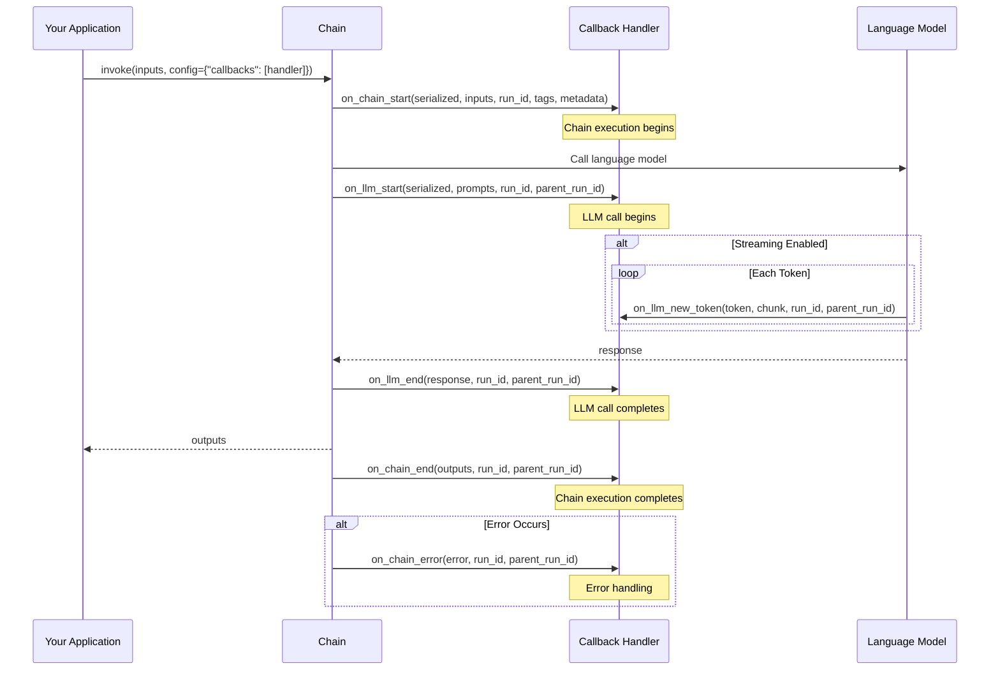

# Callbacks Implementation Guide

## Introduction

The LangChain callback system provides powerful hooks into chain execution lifecycle events, enabling logging, monitoring, debugging, and custom processing without modifying core chain logic. Callbacks are invoked at specific stages of execution—from the start of a chain through LLM calls, tool invocations, and final outputs—giving you complete visibility and control over your application's behavior.

**Use Cases for Callbacks**:
- **Logging**: Track inputs, outputs, and intermediate steps for debugging
- **Monitoring**: Measure execution time, token usage, and performance metrics
- **Streaming**: Send real-time updates to external systems or user interfaces
- **Debugging**: Inspect chain state and data transformations at each step
- **Cost Tracking**: Monitor API calls and token consumption across models
- **Custom Events**: Implement application-specific event handling

**Source**: `libs/core/langchain_core/callbacks/base.py`

**Related Documentation**:
- [Callback Handlers API Reference](../api-reference/callbacks/handlers.md) - Complete API documentation
- [Glossary: Callback](../glossary.md#callback) - Term definition
- [Architecture: Callback System](../architecture/callback-system.md) - System architecture

---

## Callback Lifecycle Overview

Understanding the callback event sequence is crucial for implementing effective handlers. The following diagram illustrates the complete lifecycle of callbacks during a typical chain execution with an LLM call:



**Source**: `libs/langchain/langchain_classic/chains/base.py:invoke()`, `libs/core/langchain_core/callbacks/base.py:24-424`

### Event Sequence Stages

**1. Chain Start (`on_chain_start`)**
- **When**: Immediately after `invoke()` is called, before any processing
- **Purpose**: Initialize tracking, log input, set up resources
- **Parameters**: `serialized` (chain info), `inputs` (user inputs), `run_id`, `tags`, `metadata`

**2. LLM Start (`on_llm_start` or `on_chat_model_start`)**
- **When**: Just before sending request to language model
- **Purpose**: Log prompts, start timing, track API calls
- **Parameters**: `serialized` (model info), `prompts` or `messages`, `run_id`, `parent_run_id`
- **Note**: Use `on_chat_model_start` for chat models, `on_llm_start` for legacy LLMs

**3. LLM Token Streaming (`on_llm_new_token`)**
- **When**: During streaming, for each generated token
- **Purpose**: Real-time output display, progressive rendering
- **Parameters**: `token` (text), `chunk` (full generation chunk), `run_id`, `parent_run_id`
- **Availability**: Only fires when streaming is enabled

**4. LLM End (`on_llm_end`)**
- **When**: After language model response is received
- **Purpose**: Log response, calculate token usage, stop timing
- **Parameters**: `response` (LLMResult with generations), `run_id`, `parent_run_id`

**5. Chain End (`on_chain_end`)**
- **When**: After all processing completes successfully
- **Purpose**: Log final output, cleanup resources, record success
- **Parameters**: `outputs` (chain results), `run_id`, `parent_run_id`

**6. Error Handling (`on_chain_error`, `on_llm_error`)**
- **When**: If any exception occurs during execution
- **Purpose**: Log errors, trigger alerts, attempt recovery
- **Parameters**: `error` (exception object), `run_id`, `parent_run_id`

---

## BaseCallbackHandler Reference

The `BaseCallbackHandler` class provides the foundation for all synchronous callback implementations. It combines multiple mixin classes to support different component types:

**Source**: `libs/core/langchain_core/callbacks/base.py:426-477`

### Handler Categories

LangChain organizes callback methods into specialized mixins:

| Mixin Class | Purpose | Key Methods |
|------------|---------|-------------|
| **LLMManagerMixin** | Language model events | `on_llm_start`, `on_llm_end`, `on_llm_error`, `on_llm_new_token`, `on_chat_model_start` |
| **ChainManagerMixin** | Chain execution events | `on_chain_start`, `on_chain_end`, `on_chain_error`, `on_agent_action`, `on_agent_finish` |
| **ToolManagerMixin** | Tool invocation events | `on_tool_start`, `on_tool_end`, `on_tool_error` |
| **RetrieverManagerMixin** | Document retrieval events | `on_retriever_start`, `on_retriever_end`, `on_retriever_error` |
| **RunManagerMixin** | General runtime events | `on_text`, `on_retry`, `on_custom_event` |

**Source**: `libs/core/langchain_core/callbacks/base.py:24-424`

### Configuration Properties

Control callback behavior with these class attributes:

```python
class BaseCallbackHandler:
    raise_error: bool = False
    """Whether to raise an exception if the callback handler encounters an error.
    If False, errors are logged but don't interrupt execution."""
    
    run_inline: bool = False
    """Whether to run the callback handler inline (synchronously) even in async contexts."""
    
    @property
    def ignore_llm(self) -> bool:
        """Return True to skip all LLM-related callbacks."""
        return False
    
    @property
    def ignore_chain(self) -> bool:
        """Return True to skip all chain-related callbacks."""
        return False
    
    @property
    def ignore_agent(self) -> bool:
        """Return True to skip all agent-related callbacks."""
        return False
    
    @property
    def ignore_retriever(self) -> bool:
        """Return True to skip all retriever-related callbacks."""
        return False
    
    @property
    def ignore_chat_model(self) -> bool:
        """Return True to skip all chat model callbacks."""
        return False
    
    @property
    def ignore_retry(self) -> bool:
        """Return True to skip retry event callbacks."""
        return False
    
    @property
    def ignore_custom_event(self) -> bool:
        """Return True to skip custom event callbacks."""
        return False
```

**Source**: `libs/core/langchain_core/callbacks/base.py:436-475`

---

## Custom Callback Implementation

### Example 1: Basic Logging Callback

This example demonstrates a simple callback handler that logs all chain execution events with timestamps:

```python
import time
from typing import Any
from uuid import UUID
from langchain_core.callbacks.base import BaseCallbackHandler
from langchain_core.outputs import LLMResult

class LoggingCallback(BaseCallbackHandler):
    """Custom callback handler for detailed execution logging."""
    
    def __init__(self):
        """Initialize the logging callback with execution tracking."""
        super().__init__()
        self.start_times = {}
    
    def on_chain_start(
        self,
        serialized: dict[str, Any],
        inputs: dict[str, Any],
        *,
        run_id: UUID,
        parent_run_id: UUID | None = None,
        tags: list[str] | None = None,
        metadata: dict[str, Any] | None = None,
        **kwargs: Any,
    ) -> Any:
        """Log when a chain starts execution."""
        self.start_times[run_id] = time.time()
        chain_name = serialized.get("name", "Unknown")
        print(f"[{time.strftime('%H:%M:%S')}] Chain '{chain_name}' started")
        print(f"  Run ID: {run_id}")
        print(f"  Inputs: {inputs}")
        if tags:
            print(f"  Tags: {tags}")
    
    def on_chain_end(
        self,
        outputs: dict[str, Any],
        *,
        run_id: UUID,
        parent_run_id: UUID | None = None,
        **kwargs: Any,
    ) -> Any:
        """Log when a chain completes successfully."""
        elapsed = time.time() - self.start_times.get(run_id, time.time())
        print(f"[{time.strftime('%H:%M:%S')}] Chain completed in {elapsed:.2f}s")
        print(f"  Outputs: {outputs}")
        # Clean up timing data
        if run_id in self.start_times:
            del self.start_times[run_id]
    
    def on_chain_error(
        self,
        error: BaseException,
        *,
        run_id: UUID,
        parent_run_id: UUID | None = None,
        **kwargs: Any,
    ) -> Any:
        """Log when a chain encounters an error."""
        elapsed = time.time() - self.start_times.get(run_id, time.time())
        print(f"[{time.strftime('%H:%M:%S')}] Chain failed after {elapsed:.2f}s")
        print(f"  Error: {type(error).__name__}: {error}")
        # Clean up timing data
        if run_id in self.start_times:
            del self.start_times[run_id]
    
    def on_llm_start(
        self,
        serialized: dict[str, Any],
        prompts: list[str],
        *,
        run_id: UUID,
        parent_run_id: UUID | None = None,
        tags: list[str] | None = None,
        metadata: dict[str, Any] | None = None,
        **kwargs: Any,
    ) -> Any:
        """Log when an LLM call starts."""
        self.start_times[run_id] = time.time()
        model_name = serialized.get("name", "Unknown")
        print(f"  └─ LLM '{model_name}' called with {len(prompts)} prompt(s)")
    
    def on_llm_end(
        self,
        response: LLMResult,
        *,
        run_id: UUID,
        parent_run_id: UUID | None = None,
        **kwargs: Any,
    ) -> Any:
        """Log when an LLM call completes."""
        elapsed = time.time() - self.start_times.get(run_id, time.time())
        token_usage = response.llm_output.get("token_usage", {}) if response.llm_output else {}
        print(f"  └─ LLM completed in {elapsed:.2f}s")
        if token_usage:
            print(f"     Tokens: {token_usage}")
        # Clean up timing data
        if run_id in self.start_times:
            del self.start_times[run_id]

# Usage Example
from langchain_core.prompts import ChatPromptTemplate
from langchain_openai import ChatOpenAI

# Create a simple chain
prompt = ChatPromptTemplate.from_template("Tell me a joke about {topic}")
model = ChatOpenAI(model="gpt-3.5-turbo")
chain = prompt | model

# Execute with logging callback
logging_callback = LoggingCallback()
result = chain.invoke(
    {"topic": "programming"},
    config={"callbacks": [logging_callback]}
)

# Output:
# [14:23:15] Chain 'RunnableSequence' started
#   Run ID: 12345678-1234-1234-1234-123456789abc
#   Inputs: {'topic': 'programming'}
#   └─ LLM 'ChatOpenAI' called with 1 prompt(s)
#   └─ LLM completed in 1.23s
#      Tokens: {'prompt_tokens': 15, 'completion_tokens': 45, 'total_tokens': 60}
# [14:23:16] Chain completed in 1.25s
#   Outputs: {...}
```

**Source Pattern**: `libs/core/langchain_core/callbacks/base.py:234-337`

### Example 2: Token Counting Callback

Track token usage across multiple LLM calls:

```python
from typing import Any
from uuid import UUID
from langchain_core.callbacks.base import BaseCallbackHandler
from langchain_core.outputs import LLMResult

class TokenCountingCallback(BaseCallbackHandler):
    """Callback handler for tracking token usage across all LLM calls."""
    
    def __init__(self):
        """Initialize token counters."""
        super().__init__()
        self.total_tokens = 0
        self.prompt_tokens = 0
        self.completion_tokens = 0
        self.llm_calls = 0
    
    def on_llm_end(
        self,
        response: LLMResult,
        *,
        run_id: UUID,
        parent_run_id: UUID | None = None,
        **kwargs: Any,
    ) -> Any:
        """Extract and accumulate token usage from LLM response."""
        self.llm_calls += 1
        
        if response.llm_output:
            token_usage = response.llm_output.get("token_usage", {})
            self.prompt_tokens += token_usage.get("prompt_tokens", 0)
            self.completion_tokens += token_usage.get("completion_tokens", 0)
            self.total_tokens += token_usage.get("total_tokens", 0)
    
    def get_summary(self) -> dict[str, int]:
        """Return summary of token usage."""
        return {
            "llm_calls": self.llm_calls,
            "prompt_tokens": self.prompt_tokens,
            "completion_tokens": self.completion_tokens,
            "total_tokens": self.total_tokens,
        }
    
    def reset(self) -> None:
        """Reset all counters."""
        self.total_tokens = 0
        self.prompt_tokens = 0
        self.completion_tokens = 0
        self.llm_calls = 0

# Usage Example
token_counter = TokenCountingCallback()

# Execute multiple chains with the same counter
result1 = chain.invoke({"topic": "python"}, config={"callbacks": [token_counter]})
result2 = chain.invoke({"topic": "rust"}, config={"callbacks": [token_counter]})

# Check accumulated usage
print(token_counter.get_summary())
# Output: {'llm_calls': 2, 'prompt_tokens': 30, 'completion_tokens': 90, 'total_tokens': 120}
```

### Example 3: Error Tracking Callback

Capture and categorize errors for analysis:

```python
from typing import Any
from uuid import UUID
from langchain_core.callbacks.base import BaseCallbackHandler

class ErrorTrackingCallback(BaseCallbackHandler):
    """Callback handler for capturing and categorizing execution errors."""
    
    def __init__(self):
        """Initialize error tracking storage."""
        super().__init__()
        self.errors = []
    
    def on_chain_error(
        self,
        error: BaseException,
        *,
        run_id: UUID,
        parent_run_id: UUID | None = None,
        **kwargs: Any,
    ) -> Any:
        """Record chain execution errors."""
        self.errors.append({
            "type": "chain",
            "error_class": type(error).__name__,
            "error_message": str(error),
            "run_id": str(run_id),
            "parent_run_id": str(parent_run_id) if parent_run_id else None,
        })
    
    def on_llm_error(
        self,
        error: BaseException,
        *,
        run_id: UUID,
        parent_run_id: UUID | None = None,
        **kwargs: Any,
    ) -> Any:
        """Record LLM call errors."""
        self.errors.append({
            "type": "llm",
            "error_class": type(error).__name__,
            "error_message": str(error),
            "run_id": str(run_id),
            "parent_run_id": str(parent_run_id) if parent_run_id else None,
        })
    
    def on_tool_error(
        self,
        error: BaseException,
        *,
        run_id: UUID,
        parent_run_id: UUID | None = None,
        **kwargs: Any,
    ) -> Any:
        """Record tool execution errors."""
        self.errors.append({
            "type": "tool",
            "error_class": type(error).__name__,
            "error_message": str(error),
            "run_id": str(run_id),
            "parent_run_id": str(parent_run_id) if parent_run_id else None,
        })
    
    def get_error_summary(self) -> dict[str, int]:
        """Return count of errors by type."""
        from collections import Counter
        return dict(Counter(e["type"] for e in self.errors))
    
    def get_errors_by_type(self, error_type: str) -> list[dict]:
        """Return all errors of a specific type."""
        return [e for e in self.errors if e["type"] == error_type]

# Usage Example
error_tracker = ErrorTrackingCallback()

try:
    result = chain.invoke(
        {"topic": "invalid"},
        config={"callbacks": [error_tracker]}
    )
except Exception:
    pass  # Error is captured by callback

print(error_tracker.get_error_summary())
# Output: {'llm': 1}

print(error_tracker.get_errors_by_type("llm"))
# Output: [{'type': 'llm', 'error_class': 'RateLimitError', ...}]
```

---

## Async Callbacks

For applications using asynchronous chains, implement `AsyncCallbackHandler` to ensure proper event loop integration and thread safety.

**Source**: `libs/core/langchain_core/callbacks/base.py:478-end`

### AsyncCallbackHandler Usage

The `AsyncCallbackHandler` class provides async versions of all callback methods:

```python
import asyncio
import time
from typing import Any
from uuid import UUID
from langchain_core.callbacks.base import AsyncCallbackHandler
from langchain_core.outputs import LLMResult

class AsyncLoggingCallback(AsyncCallbackHandler):
    """Async callback handler for non-blocking logging."""
    
    def __init__(self):
        """Initialize async logging callback."""
        super().__init__()
        self.start_times = {}
    
    async def on_chain_start(
        self,
        serialized: dict[str, Any],
        inputs: dict[str, Any],
        *,
        run_id: UUID,
        parent_run_id: UUID | None = None,
        tags: list[str] | None = None,
        metadata: dict[str, Any] | None = None,
        **kwargs: Any,
    ) -> None:
        """Asynchronously log chain start."""
        self.start_times[run_id] = time.time()
        chain_name = serialized.get("name", "Unknown")
        # Simulate async I/O (e.g., writing to database)
        await asyncio.sleep(0.01)
        print(f"[ASYNC] Chain '{chain_name}' started with inputs: {inputs}")
    
    async def on_chain_end(
        self,
        outputs: dict[str, Any],
        *,
        run_id: UUID,
        parent_run_id: UUID | None = None,
        **kwargs: Any,
    ) -> None:
        """Asynchronously log chain completion."""
        elapsed = time.time() - self.start_times.get(run_id, time.time())
        await asyncio.sleep(0.01)
        print(f"[ASYNC] Chain completed in {elapsed:.2f}s")
        if run_id in self.start_times:
            del self.start_times[run_id]
    
    async def on_llm_start(
        self,
        serialized: dict[str, Any],
        prompts: list[str],
        *,
        run_id: UUID,
        parent_run_id: UUID | None = None,
        tags: list[str] | None = None,
        metadata: dict[str, Any] | None = None,
        **kwargs: Any,
    ) -> None:
        """Asynchronously log LLM call start."""
        self.start_times[run_id] = time.time()
        model_name = serialized.get("name", "Unknown")
        await asyncio.sleep(0.01)
        print(f"[ASYNC] LLM '{model_name}' called")
    
    async def on_llm_end(
        self,
        response: LLMResult,
        *,
        run_id: UUID,
        parent_run_id: UUID | None = None,
        **kwargs: Any,
    ) -> None:
        """Asynchronously log LLM completion."""
        elapsed = time.time() - self.start_times.get(run_id, time.time())
        await asyncio.sleep(0.01)
        print(f"[ASYNC] LLM completed in {elapsed:.2f}s")
        if run_id in self.start_times:
            del self.start_times[run_id]

# Usage Example with Async Chain
async def main():
    from langchain_core.prompts import ChatPromptTemplate
    from langchain_openai import ChatOpenAI
    
    prompt = ChatPromptTemplate.from_template("Tell me about {topic}")
    model = ChatOpenAI(model="gpt-3.5-turbo")
    chain = prompt | model
    
    async_callback = AsyncLoggingCallback()
    
    # Asynchronous invocation
    result = await chain.ainvoke(
        {"topic": "async programming"},
        config={"callbacks": [async_callback]}
    )
    
    return result

# Run the async chain
asyncio.run(main())
```

### Async Callback Considerations

**Event Loop Requirements**:
- Async callbacks MUST be used with async chain methods (`ainvoke`, `abatch`, `astream`)
- Mixing sync callbacks with async chains is supported but may impact performance
- All async callback methods should use `await` for I/O operations

**Thread Safety**:
- Async callbacks run in the same event loop as the chain
- Avoid blocking operations (use `asyncio.to_thread` for blocking I/O)
- Multiple concurrent chains can safely share the same async callback instance

**Performance Benefits**:
- Non-blocking I/O for logging to external systems
- Parallel processing of callback events
- Reduced overhead for high-throughput applications

**Source**: `libs/core/langchain_core/callbacks/base.py:478-end`

---

## Callback Configuration

### Attaching Callbacks via RunnableConfig

The recommended way to attach callbacks is through the `config` parameter using `RunnableConfig`:

```python
from langchain_core.runnables import RunnableConfig

# Single callback
config = RunnableConfig(callbacks=[logging_callback])
result = chain.invoke({"input": "data"}, config=config)

# Multiple callbacks
config = RunnableConfig(callbacks=[logging_callback, token_counter, error_tracker])
result = chain.invoke({"input": "data"}, config=config)

# With additional configuration
config = RunnableConfig(
    callbacks=[logging_callback],
    tags=["production", "user_query"],
    metadata={"user_id": "12345", "session": "abc"},
)
result = chain.invoke({"input": "data"}, config=config)
```

**Tags and Metadata**:
- **tags**: List of strings associated with the execution, passed to all callbacks
- **metadata**: Dictionary of key-value pairs for additional context, available in callbacks

**Source**: `libs/core/langchain_core/runnables/config.py`

### Global vs Per-Invocation Callbacks

**Global Callbacks** (set on chain initialization):
```python
# Callbacks apply to all invocations of this chain
chain = prompt | model
chain_with_callbacks = chain.with_config(callbacks=[logging_callback])

# Every invoke uses the callback
result1 = chain_with_callbacks.invoke({"topic": "python"})
result2 = chain_with_callbacks.invoke({"topic": "rust"})
```

**Per-Invocation Callbacks** (set on invoke):
```python
# Callback applies only to this specific invocation
result = chain.invoke(
    {"topic": "python"},
    config={"callbacks": [logging_callback]}
)
```

**Combining Global and Per-Invocation**:
```python
# Both global and per-invocation callbacks will fire
chain_with_callbacks = chain.with_config(callbacks=[token_counter])
result = chain_with_callbacks.invoke(
    {"topic": "python"},
    config={"callbacks": [logging_callback]}
)
# Both token_counter and logging_callback receive events
```

---

## Integration Patterns

### Attaching Callbacks to Chains

**LCEL Chains (Recommended)**:
```python
from langchain_core.prompts import ChatPromptTemplate
from langchain_core.output_parsers import StrOutputParser
from langchain_openai import ChatOpenAI

# Build chain
prompt = ChatPromptTemplate.from_template("Translate {text} to {language}")
model = ChatOpenAI(model="gpt-3.5-turbo")
parser = StrOutputParser()
chain = prompt | model | parser

# Attach callbacks
result = chain.invoke(
    {"text": "Hello", "language": "Spanish"},
    config={"callbacks": [logging_callback]}
)
```

**Legacy Chain Classes**:
```python
from langchain_classic.chains import LLMChain
from langchain_classic.prompts import PromptTemplate
from langchain_openai import OpenAI

prompt = PromptTemplate.from_template("Write a poem about {topic}")
llm = OpenAI()
chain = LLMChain(llm=llm, prompt=prompt)

# Attach via invoke config
result = chain.invoke(
    {"topic": "nature"},
    config={"callbacks": [logging_callback]}
)

# Or set on chain instance
chain.callbacks = [logging_callback]
result = chain.invoke({"topic": "nature"})
```

**Source**: `libs/langchain/langchain_classic/chains/base.py:82-87`

### Attaching Callbacks to Agents

Callbacks can monitor agent decision-making and tool execution:

```python
from langchain_classic.agents import AgentExecutor, create_react_agent
from langchain_classic.tools import Tool
from langchain_openai import OpenAI

# Define tools
def calculator(input: str) -> str:
    return str(eval(input))

tools = [
    Tool(
        name="Calculator",
        func=calculator,
        description="Useful for math calculations"
    )
]

# Create agent
llm = OpenAI()
agent = create_react_agent(llm, tools)
agent_executor = AgentExecutor(agent=agent, tools=tools)

# Attach callbacks to capture agent actions
result = agent_executor.invoke(
    {"input": "What is 25 * 4?"},
    config={"callbacks": [logging_callback]}
)

# Callback will receive:
# - on_chain_start (agent executor)
# - on_agent_action (each tool decision)
# - on_tool_start, on_tool_end (tool execution)
# - on_agent_finish (final answer)
# - on_chain_end (complete)
```

**Agent-Specific Callback Methods**:
```python
class AgentActionCallback(BaseCallbackHandler):
    """Track agent reasoning and tool usage."""
    
    def on_agent_action(
        self,
        action: AgentAction,
        *,
        run_id: UUID,
        parent_run_id: UUID | None = None,
        **kwargs: Any,
    ) -> Any:
        """Called when agent decides to use a tool."""
        print(f"Agent Action: {action.tool}")
        print(f"  Tool Input: {action.tool_input}")
        print(f"  Log: {action.log}")
    
    def on_agent_finish(
        self,
        finish: AgentFinish,
        *,
        run_id: UUID,
        parent_run_id: UUID | None = None,
        **kwargs: Any,
    ) -> Any:
        """Called when agent produces final answer."""
        print(f"Agent Finished: {finish.return_values}")
```

**Source**: `libs/core/langchain_core/callbacks/base.py:158-190`

### Streaming with Callbacks

Callbacks enable real-time token streaming for responsive user interfaces:

```python
from langchain_core.callbacks.base import BaseCallbackHandler

class StreamingCallback(BaseCallbackHandler):
    """Callback for streaming LLM output token by token."""
    
    def __init__(self):
        """Initialize streaming callback."""
        super().__init__()
        self.tokens = []
    
    def on_llm_new_token(
        self,
        token: str,
        *,
        chunk: Any = None,
        run_id: UUID,
        parent_run_id: UUID | None = None,
        **kwargs: Any,
    ) -> Any:
        """Process each token as it's generated."""
        self.tokens.append(token)
        # Print token immediately for real-time display
        print(token, end="", flush=True)
    
    def get_complete_response(self) -> str:
        """Return the complete streamed response."""
        return "".join(self.tokens)

# Enable streaming
from langchain_openai import ChatOpenAI

streaming_callback = StreamingCallback()
model = ChatOpenAI(model="gpt-3.5-turbo", streaming=True)

chain = prompt | model

result = chain.invoke(
    {"topic": "space"},
    config={"callbacks": [streaming_callback]}
)

# Tokens print as they arrive
print("\n\nComplete response:")
print(streaming_callback.get_complete_response())
```

**Important**: The `on_llm_new_token` callback only fires when `streaming=True` is set on the language model.

**Source**: `libs/core/langchain_core/callbacks/base.py:65-84`

---

## Practical Use Cases

### Use Case 1: Execution Timing and Performance Monitoring

Track execution time at different granularities:

```python
import time
from typing import Any
from uuid import UUID
from langchain_core.callbacks.base import BaseCallbackHandler

class PerformanceMonitorCallback(BaseCallbackHandler):
    """Monitor performance metrics for chains and LLM calls."""
    
    def __init__(self):
        """Initialize performance monitoring."""
        super().__init__()
        self.timings = {}
        self.metrics = {
            "chain_count": 0,
            "llm_count": 0,
            "total_chain_time": 0,
            "total_llm_time": 0,
        }
    
    def on_chain_start(
        self, serialized: dict[str, Any], inputs: dict[str, Any],
        *, run_id: UUID, **kwargs: Any
    ) -> Any:
        """Record chain start time."""
        self.timings[f"chain_{run_id}"] = time.time()
    
    def on_chain_end(
        self, outputs: dict[str, Any], *, run_id: UUID, **kwargs: Any
    ) -> Any:
        """Calculate chain execution time."""
        key = f"chain_{run_id}"
        if key in self.timings:
            elapsed = time.time() - self.timings[key]
            self.metrics["chain_count"] += 1
            self.metrics["total_chain_time"] += elapsed
            del self.timings[key]
    
    def on_llm_start(
        self, serialized: dict[str, Any], prompts: list[str],
        *, run_id: UUID, **kwargs: Any
    ) -> Any:
        """Record LLM start time."""
        self.timings[f"llm_{run_id}"] = time.time()
    
    def on_llm_end(
        self, response: Any, *, run_id: UUID, **kwargs: Any
    ) -> Any:
        """Calculate LLM execution time."""
        key = f"llm_{run_id}"
        if key in self.timings:
            elapsed = time.time() - self.timings[key]
            self.metrics["llm_count"] += 1
            self.metrics["total_llm_time"] += elapsed
            del self.timings[key]
    
    def get_report(self) -> dict[str, float]:
        """Generate performance report."""
        avg_chain = (
            self.metrics["total_chain_time"] / self.metrics["chain_count"]
            if self.metrics["chain_count"] > 0 else 0
        )
        avg_llm = (
            self.metrics["total_llm_time"] / self.metrics["llm_count"]
            if self.metrics["llm_count"] > 0 else 0
        )
        return {
            "chain_count": self.metrics["chain_count"],
            "llm_count": self.metrics["llm_count"],
            "total_chain_time": self.metrics["total_chain_time"],
            "total_llm_time": self.metrics["total_llm_time"],
            "avg_chain_time": avg_chain,
            "avg_llm_time": avg_llm,
        }

# Usage
perf_monitor = PerformanceMonitorCallback()
for i in range(5):
    chain.invoke({"topic": f"topic_{i}"}, config={"callbacks": [perf_monitor]})

print(perf_monitor.get_report())
# Output: {'chain_count': 5, 'avg_chain_time': 1.23, ...}
```

### Use Case 2: Debugging with Intermediate Output Capture

Capture intermediate outputs for debugging complex chains:

```python
from typing import Any
from uuid import UUID
from langchain_core.callbacks.base import BaseCallbackHandler

class DebugCallback(BaseCallbackHandler):
    """Capture all intermediate outputs for debugging."""
    
    def __init__(self):
        """Initialize debug callback."""
        super().__init__()
        self.execution_log = []
    
    def on_chain_start(
        self, serialized: dict[str, Any], inputs: dict[str, Any],
        *, run_id: UUID, **kwargs: Any
    ) -> Any:
        """Log chain inputs."""
        self.execution_log.append({
            "event": "chain_start",
            "run_id": str(run_id),
            "name": serialized.get("name", "Unknown"),
            "inputs": inputs,
        })
    
    def on_llm_start(
        self, serialized: dict[str, Any], prompts: list[str],
        *, run_id: UUID, **kwargs: Any
    ) -> Any:
        """Log LLM prompts."""
        self.execution_log.append({
            "event": "llm_start",
            "run_id": str(run_id),
            "model": serialized.get("name", "Unknown"),
            "prompts": prompts,
        })
    
    def on_llm_end(
        self, response: Any, *, run_id: UUID, **kwargs: Any
    ) -> Any:
        """Log LLM responses."""
        generations = [g.text for g in response.generations[0]]
        self.execution_log.append({
            "event": "llm_end",
            "run_id": str(run_id),
            "response": generations,
        })
    
    def on_chain_end(
        self, outputs: dict[str, Any], *, run_id: UUID, **kwargs: Any
    ) -> Any:
        """Log chain outputs."""
        self.execution_log.append({
            "event": "chain_end",
            "run_id": str(run_id),
            "outputs": outputs,
        })
    
    def print_log(self) -> None:
        """Print execution log in readable format."""
        import json
        for entry in self.execution_log:
            print(json.dumps(entry, indent=2))
            print("-" * 40)
    
    def get_log(self) -> list[dict]:
        """Return complete execution log."""
        return self.execution_log

# Usage
debug_callback = DebugCallback()
result = chain.invoke({"topic": "testing"}, config={"callbacks": [debug_callback]})

debug_callback.print_log()
# Shows complete execution flow with all intermediate data
```

### Use Case 3: Cost Tracking Across Multiple Models

Track API costs when using multiple LLM providers:

```python
from typing import Any
from uuid import UUID
from langchain_core.callbacks.base import BaseCallbackHandler
from langchain_core.outputs import LLMResult

class CostTrackingCallback(BaseCallbackHandler):
    """Track estimated costs across multiple LLM providers."""
    
    # Cost per 1K tokens (example rates)
    COST_PER_1K_TOKENS = {
        "gpt-4": {"prompt": 0.03, "completion": 0.06},
        "gpt-3.5-turbo": {"prompt": 0.0015, "completion": 0.002},
        "claude-2": {"prompt": 0.008, "completion": 0.024},
    }
    
    def __init__(self):
        """Initialize cost tracking."""
        super().__init__()
        self.total_cost = 0.0
        self.costs_by_model = {}
    
    def on_llm_end(
        self, response: LLMResult, *, run_id: UUID, **kwargs: Any
    ) -> Any:
        """Calculate cost based on token usage."""
        if not response.llm_output:
            return
        
        # Extract token usage and model name
        token_usage = response.llm_output.get("token_usage", {})
        model_name = response.llm_output.get("model_name", "unknown")
        
        prompt_tokens = token_usage.get("prompt_tokens", 0)
        completion_tokens = token_usage.get("completion_tokens", 0)
        
        # Calculate cost
        cost = 0.0
        if model_name in self.COST_PER_1K_TOKENS:
            rates = self.COST_PER_1K_TOKENS[model_name]
            cost = (
                (prompt_tokens / 1000) * rates["prompt"] +
                (completion_tokens / 1000) * rates["completion"]
            )
        
        # Track costs
        self.total_cost += cost
        if model_name not in self.costs_by_model:
            self.costs_by_model[model_name] = 0.0
        self.costs_by_model[model_name] += cost
    
    def get_total_cost(self) -> float:
        """Return total estimated cost."""
        return self.total_cost
    
    def get_cost_breakdown(self) -> dict[str, float]:
        """Return cost breakdown by model."""
        return self.costs_by_model.copy()

# Usage
cost_tracker = CostTrackingCallback()

# Run multiple chains
result1 = chain1.invoke({"input": "data"}, config={"callbacks": [cost_tracker]})
result2 = chain2.invoke({"input": "data"}, config={"callbacks": [cost_tracker]})

print(f"Total cost: ${cost_tracker.get_total_cost():.4f}")
print(f"Breakdown: {cost_tracker.get_cost_breakdown()}")
# Output: Total cost: $0.0234
#         Breakdown: {'gpt-3.5-turbo': 0.0150, 'gpt-4': 0.0084}
```

---

## Best Practices

### Performance Considerations

**1. Avoid Blocking Operations in Callbacks**
```python
# BAD: Blocking I/O in callback
class BadCallback(BaseCallbackHandler):
    def on_chain_end(self, outputs, *, run_id, **kwargs):
        # This blocks the entire chain execution
        with open("log.txt", "a") as f:
            f.write(f"{outputs}\n")

# GOOD: Use async I/O or queue for later processing
class GoodCallback(BaseCallbackHandler):
    def __init__(self):
        self.log_queue = []
    
    def on_chain_end(self, outputs, *, run_id, **kwargs):
        # Queue for batch processing later
        self.log_queue.append(outputs)
    
    def flush_logs(self):
        # Process queue in batch
        with open("log.txt", "a") as f:
            for output in self.log_queue:
                f.write(f"{output}\n")
        self.log_queue.clear()
```

**2. Minimize Computation in Hot Paths**
```python
# BAD: Heavy computation in frequently-called callback
class HeavyCallback(BaseCallbackHandler):
    def on_llm_new_token(self, token, *, run_id, **kwargs):
        # Called for EVERY token - avoid heavy operations
        complex_analysis(token)  # Bad!

# GOOD: Accumulate and process in batch
class OptimizedCallback(BaseCallbackHandler):
    def __init__(self):
        self.tokens = []
    
    def on_llm_new_token(self, token, *, run_id, **kwargs):
        self.tokens.append(token)
    
    def on_llm_end(self, response, *, run_id, **kwargs):
        # Process all tokens once at the end
        complete_text = "".join(self.tokens)
        analyze(complete_text)
        self.tokens.clear()
```

**3. Use Property Flags to Skip Unwanted Events**
```python
class SelectiveCallback(BaseCallbackHandler):
    """Only track chain events, ignore LLM details."""
    
    @property
    def ignore_llm(self) -> bool:
        return True
    
    @property
    def ignore_retriever(self) -> bool:
        return True
    
    def on_chain_start(self, serialized, inputs, *, run_id, **kwargs):
        # Only chain callbacks will fire
        print("Chain started")
```

### Error Handling in Callbacks

**1. Graceful Error Handling**
```python
class RobustCallback(BaseCallbackHandler):
    """Callback with comprehensive error handling."""
    
    raise_error: bool = False  # Don't interrupt execution on callback errors
    
    def on_chain_end(self, outputs, *, run_id, **kwargs):
        try:
            # Potentially failing operation
            self.send_to_external_service(outputs)
        except Exception as e:
            # Log error but don't disrupt chain execution
            import logging
            logging.error(f"Callback error: {e}")
            # Optionally store for later review
            self.failed_callbacks.append({
                "error": str(e),
                "outputs": outputs,
                "run_id": str(run_id),
            })
```

**2. Conditional Error Raising**
```python
class StrictCallback(BaseCallbackHandler):
    """Callback that fails fast in development, logs in production."""
    
    def __init__(self, environment: str = "production"):
        super().__init__()
        self.raise_error = (environment == "development")
    
    def on_llm_end(self, response, *, run_id, **kwargs):
        # Critical validation
        if not self.validate_response(response):
            error_msg = "Response validation failed"
            if self.raise_error:
                raise ValueError(error_msg)
            else:
                logging.warning(error_msg)
```

### Callback Reusability Patterns

**1. Composable Callback Mixins**
```python
class TimingMixin:
    """Mixin for timing functionality."""
    
    def __init__(self, *args, **kwargs):
        super().__init__(*args, **kwargs)
        self.start_times = {}
    
    def start_timer(self, run_id):
        self.start_times[run_id] = time.time()
    
    def get_elapsed(self, run_id):
        return time.time() - self.start_times.get(run_id, time.time())

class TokenCountMixin:
    """Mixin for token counting."""
    
    def __init__(self, *args, **kwargs):
        super().__init__(*args, **kwargs)
        self.total_tokens = 0
    
    def add_tokens(self, count):
        self.total_tokens += count

class ComprehensiveCallback(TimingMixin, TokenCountMixin, BaseCallbackHandler):
    """Combined callback with multiple capabilities."""
    
    def on_chain_start(self, serialized, inputs, *, run_id, **kwargs):
        self.start_timer(run_id)
    
    def on_llm_end(self, response, *, run_id, **kwargs):
        if response.llm_output:
            tokens = response.llm_output.get("token_usage", {}).get("total_tokens", 0)
            self.add_tokens(tokens)
```

**2. Configurable Callbacks**
```python
class ConfigurableCallback(BaseCallbackHandler):
    """Callback with runtime configuration."""
    
    def __init__(
        self,
        log_inputs: bool = True,
        log_outputs: bool = True,
        log_timing: bool = False,
        verbose: bool = False,
    ):
        """Initialize with configuration options."""
        super().__init__()
        self.log_inputs = log_inputs
        self.log_outputs = log_outputs
        self.log_timing = log_timing
        self.verbose = verbose
        self.timings = {}
    
    def on_chain_start(self, serialized, inputs, *, run_id, **kwargs):
        if self.log_timing:
            self.timings[run_id] = time.time()
        if self.log_inputs:
            print(f"Inputs: {inputs}")
    
    def on_chain_end(self, outputs, *, run_id, **kwargs):
        if self.log_timing and run_id in self.timings:
            elapsed = time.time() - self.timings[run_id]
            print(f"Elapsed: {elapsed:.2f}s")
        if self.log_outputs:
            print(f"Outputs: {outputs}")

# Usage with different configurations
debug_callback = ConfigurableCallback(log_inputs=True, log_outputs=True, log_timing=True, verbose=True)
production_callback = ConfigurableCallback(log_inputs=False, log_outputs=False, log_timing=True)
```

---

## Troubleshooting

### Common Issues and Solutions

#### Issue 1: Callbacks Not Firing

**Symptom**: Callback methods are not being invoked during chain execution.

**Common Causes and Solutions**:

```python
# Cause 1: Callback not properly attached
# BAD
chain = prompt | model
result = chain.invoke({"input": "data"})  # No callback configuration

# GOOD
result = chain.invoke({"input": "data"}, config={"callbacks": [my_callback]})

# Cause 2: Ignore flags are enabled
class MyCallback(BaseCallbackHandler):
    @property
    def ignore_llm(self) -> bool:
        return True  # This prevents LLM callbacks from firing!

# SOLUTION: Ensure ignore flags are False for events you want
class MyCallback(BaseCallbackHandler):
    @property
    def ignore_llm(self) -> bool:
        return False  # Now LLM callbacks will fire

# Cause 3: Using sync callback with async chain without proper setup
callback = BaseCallbackHandler()  # Sync callback
result = await chain.ainvoke({"input": "data"}, config={"callbacks": [callback]})

# SOLUTION: Use AsyncCallbackHandler for async chains
callback = AsyncCallbackHandler()
result = await chain.ainvoke({"input": "data"}, config={"callbacks": [callback]})
```

#### Issue 2: Async Callbacks Blocking

**Symptom**: Async callbacks cause performance degradation or blocking.

**Solution**:
```python
# BAD: Blocking I/O in async callback
class BlockingAsyncCallback(AsyncCallbackHandler):
    async def on_chain_end(self, outputs, *, run_id, **kwargs):
        # time.sleep is blocking!
        time.sleep(1)

# GOOD: Use proper async operations
class NonBlockingAsyncCallback(AsyncCallbackHandler):
    async def on_chain_end(self, outputs, *, run_id, **kwargs):
        # asyncio.sleep is non-blocking
        await asyncio.sleep(1)
        
        # For blocking I/O, use to_thread
        await asyncio.to_thread(self.write_to_file, outputs)
    
    def write_to_file(self, outputs):
        with open("log.txt", "a") as f:
            f.write(f"{outputs}\n")
```

#### Issue 3: Memory Leaks in Long-Running Applications

**Symptom**: Memory usage grows over time when using callbacks.

**Solution**:
```python
# BAD: Unbounded storage in callback
class LeakyCallback(BaseCallbackHandler):
    def __init__(self):
        self.all_outputs = []  # Grows forever!
    
    def on_chain_end(self, outputs, *, run_id, **kwargs):
        self.all_outputs.append(outputs)

# GOOD: Bounded storage with cleanup
class BoundedCallback(BaseCallbackHandler):
    def __init__(self, max_size: int = 1000):
        self.outputs = []
        self.max_size = max_size
    
    def on_chain_end(self, outputs, *, run_id, **kwargs):
        self.outputs.append(outputs)
        # Keep only recent entries
        if len(self.outputs) > self.max_size:
            self.outputs = self.outputs[-self.max_size:]
    
    def on_chain_start(self, serialized, inputs, *, run_id, **kwargs):
        # Clean up old timing data
        if hasattr(self, 'start_times'):
            # Remove entries older than 1 hour
            cutoff = time.time() - 3600
            self.start_times = {
                k: v for k, v in self.start_times.items()
                if v > cutoff
            }
```

#### Issue 4: Callbacks Receiving Unexpected Parameters

**Symptom**: KeyError or AttributeError when accessing callback parameters.

**Solution**:
```python
# BAD: Assuming parameters always exist
class FragileCallback(BaseCallbackHandler):
    def on_llm_end(self, response, *, run_id, **kwargs):
        # May fail if llm_output is None
        tokens = response.llm_output["token_usage"]["total_tokens"]

# GOOD: Defensive parameter access
class RobustCallback(BaseCallbackHandler):
    def on_llm_end(self, response, *, run_id, **kwargs):
        # Safe access with defaults
        if response.llm_output:
            token_usage = response.llm_output.get("token_usage", {})
            tokens = token_usage.get("total_tokens", 0)
        else:
            tokens = 0
        
        # Process tokens...
```

### Debugging Checklist

When callbacks aren't working as expected:

1. **Verify Callback Attachment**
   - [ ] Callback is passed in `config={"callbacks": [handler]}`
   - [ ] Callback is an instance, not a class: `MyCallback()` not `MyCallback`

2. **Check Ignore Flags**
   - [ ] `ignore_llm`, `ignore_chain`, etc. are `False` for desired events
   - [ ] No property overrides preventing callback execution

3. **Validate Callback Type**
   - [ ] Using `BaseCallbackHandler` for sync chains
   - [ ] Using `AsyncCallbackHandler` for async chains (`ainvoke`, `astream`)

4. **Inspect Method Signatures**
   - [ ] All callback methods have correct signatures with `*` for keyword-only args
   - [ ] All methods include `**kwargs` to handle additional parameters

5. **Review Error Handling**
   - [ ] Check logs for callback exceptions
   - [ ] Set `raise_error = True` temporarily to surface hidden errors

6. **Test Isolation**
   - [ ] Test callback with minimal chain to isolate issues
   - [ ] Use print statements to verify methods are called

---

## Additional Resources

### Related Guides
- [Agent Development Guide](agent-development.md) - Using callbacks with agents
- [Error Handling Guide](error-handling.md) - Error recovery patterns
- [Async Usage Guide](async-usage.md) - Async programming patterns

### API References
- [BaseCallbackHandler API](../api-reference/callbacks/handlers.md) - Complete API documentation
- [CallbackManager API](../api-reference/callbacks/handlers.md#callbackmanager) - Manager classes
- [RunnableConfig API](../api-reference/runnables/base.md#runnableconfig) - Configuration options

### Architecture Documentation
- [Callback System Architecture](../architecture/callback-system.md) - System design
- [Chain Lifecycle](../architecture/chain-lifecycle.md) - Chain execution flow

### Example Code
- [Debugging Callback Example](../../examples/debugging/callback_debugger.py) - Complete debugging handler
- [Advanced Chain Examples](../../examples/advanced_chains/) - Callbacks in complex scenarios

**Source Files Referenced**:
- `libs/core/langchain_core/callbacks/base.py` - Callback base classes
- `libs/core/langchain_core/callbacks/manager.py` - Callback management
- `libs/langchain/langchain_classic/chains/base.py` - Chain callback integration

---

**Last Updated**: 2024
**Maintainer**: LangChain Integration Documentation Team
**LangChain Version Compatibility**: langchain-core >=1.0.0, langchain-classic >=1.0.0
