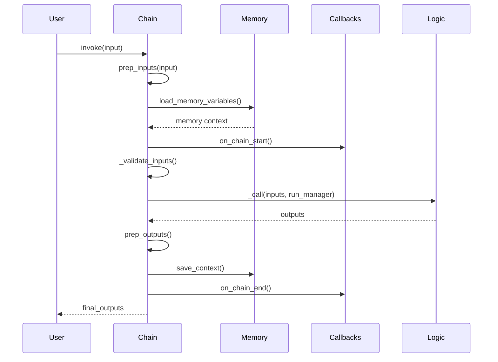
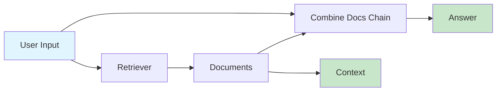

# Chain Types Guide

## Introduction

Chains in LangChain provide structured abstractions for composing sequences of calls to components like language models, document retrievers, prompts, output parsers, and other chains. Understanding the different chain types available helps you select the right architecture for your use case while avoiding deprecated patterns in favor of modern LCEL (LangChain Expression Language) compositions.

**Purpose**: Chains encode multi-step workflows with a standardized interface, enabling:
- **Stateful execution**: Add memory to maintain context across invocations
- **Observable operations**: Use callbacks for logging, monitoring, and debugging
- **Composable architecture**: Combine chains with other components seamlessly

**Source**: `libs/langchain/langchain_classic/chains/base.py:52-73`

This guide compares legacy chain types with modern LCEL alternatives, providing decision criteria, migration paths, and practical examples to help you choose the appropriate chain architecture for your requirements.

---

## Chain Base Class Overview

All legacy chains inherit from the abstract `Chain` base class, which implements the `RunnableSerializable` protocol with dictionary input/output types:

```python
class Chain(RunnableSerializable[dict[str, Any], dict[str, Any]], ABC):
    """Abstract base class for creating structured sequences of calls to components."""
```

**Source**: `libs/langchain/langchain_classic/chains/base.py:52`

### Core Interface

Every chain implements the following core methods and properties:

#### Required Properties

- **`input_keys`**: List of keys expected in the input dictionary
- **`output_keys`**: List of keys that will be present in the output dictionary

#### Execution Methods

- **`invoke(input, config=None, **kwargs)`**: Synchronous execution with dictionary input
- **`ainvoke(input, config=None, **kwargs)`**: Asynchronous execution with dictionary input
- **`_call(inputs, run_manager=None)`**: Abstract method implementing core chain logic (sync)
- **`_acall(inputs, run_manager=None)`**: Abstract method implementing core chain logic (async)

**Source**: `libs/langchain/langchain_classic/chains/base.py:131-238`

### Chain Execution Lifecycle

The chain execution follows this standardized lifecycle:



**Key Lifecycle Stages**:

1. **Input Preparation** (`prep_inputs`): Loads variables from memory and merges with input
2. **Callback Start** (`on_chain_start`): Notifies callbacks that chain execution is beginning
3. **Input Validation** (`_validate_inputs`): Ensures all required keys are present
4. **Core Execution** (`_call`): Executes the chain-specific logic
5. **Output Preparation** (`prep_outputs`): Saves context to memory and formats outputs
6. **Callback End** (`on_chain_end`): Notifies callbacks of successful completion

**Source**: `libs/langchain/langchain_classic/chains/base.py:131-184, 521-543, 471-494`

### Memory Integration

Chains optionally support memory via the `memory` field:

```python
memory: BaseMemory | None = None
```

- **At chain start**: `prep_inputs()` calls `memory.load_memory_variables(inputs)` to retrieve context
- **At chain end**: `prep_outputs()` calls `memory.save_context(inputs, outputs)` to persist state

**Source**: `libs/langchain/langchain_classic/chains/base.py:75-81, 540-542, 490-491`

### Callback Support

Chains support callbacks through the `callbacks` field:

```python
callbacks: Callbacks = Field(default=None, exclude=True)
```

Callbacks are invoked at key lifecycle points:
- `on_chain_start`: Before execution begins
- `on_chain_end`: After successful completion
- `on_chain_error`: When an exception occurs

**Source**: `libs/langchain/langchain_classic/chains/base.py:82-87, 158-163, 180`

---

## LLMChain (Deprecated)

> **⚠️ DEPRECATION NOTICE**: LLMChain is deprecated since version 0.1.17 and will be removed in version 1.0. Use modern LCEL composition (`prompt | llm | parser`) instead.

**Source**: `libs/langchain/langchain_classic/chains/llm.py:40-44`

### Overview

LLMChain was the original chain for combining a prompt template with a language model. While still functional, it has been superseded by LCEL's more composable and type-safe pipe operator syntax.

### Use Cases

LLMChain was designed for:
- Simple prompt + LLM workflows with template variable substitution
- Single-step text generation tasks
- Quick prototyping with minimal boilerplate

### Configuration Parameters

```python
from langchain_classic.chains import LLMChain
from langchain_core.prompts import PromptTemplate
from langchain_openai import ChatOpenAI

chain = LLMChain(
    prompt=PromptTemplate(...),        # Prompt template with input_variables
    llm=ChatOpenAI(),                  # Language model (Runnable)
    output_parser=StrOutputParser(),   # Optional parser (defaults to StrOutputParser)
    output_key="text",                 # Key for output in result dict
    memory=None,                       # Optional memory instance
)
```

**Key Parameters**:

- **`prompt`** (`BasePromptTemplate`): Template defining input variables and formatting
- **`llm`** (`Runnable[LanguageModelInput, str | BaseMessage]`): Language model to invoke
- **`output_parser`** (`BaseLLMOutputParser`): Parser for LLM output (default: `StrOutputParser`)
- **`output_key`** (`str`): Dictionary key for the output (default: `"text"`)

**Source**: `libs/langchain/langchain_classic/chains/llm.py:81-93`

### Legacy Usage Example

```python
from langchain_classic.chains import LLMChain
from langchain_core.prompts import PromptTemplate
from langchain_openai import ChatOpenAI

# Define template
prompt_template = "Tell me a {adjective} joke about {topic}"
prompt = PromptTemplate(
    input_variables=["adjective", "topic"],
    template=prompt_template
)

# Create chain
llm = ChatOpenAI(model="gpt-3.5-turbo")
chain = LLMChain(llm=llm, prompt=prompt)

# Execute
result = chain.invoke({"adjective": "funny", "topic": "programming"})
print(result["text"])  # Output key specified by output_key parameter
```

**Source**: Example based on `libs/langchain/langchain_classic/chains/llm.py:64-73`

### Migration to Modern LCEL

**Modern Equivalent** (Recommended):

```python
from langchain_core.output_parsers import StrOutputParser
from langchain_core.prompts import PromptTemplate
from langchain_openai import ChatOpenAI

# LCEL composition with pipe operator
prompt_template = "Tell me a {adjective} joke about {topic}"
prompt = PromptTemplate(
    input_variables=["adjective", "topic"],
    template=prompt_template
)
model = ChatOpenAI(model="gpt-3.5-turbo")
chain = prompt | model | StrOutputParser()

# Execute - returns string directly, not dict
result = chain.invoke({"adjective": "funny", "topic": "programming"})
print(result)  # Direct string output
```

**Benefits of LCEL Migration**:
- **Type Safety**: Explicit type flow through composition stages
- **Better Streaming**: Native support for token-by-token streaming
- **Composability**: Easy to insert additional processing steps
- **Reduced Overhead**: No dictionary wrapping/unwrapping

**Source**: Migration example from `libs/langchain/langchain_classic/chains/llm.py:51-62`

### Key Differences: LLMChain vs LCEL

| Aspect | LLMChain (Deprecated) | LCEL (Modern) |
|--------|----------------------|---------------|
| **Syntax** | `LLMChain(llm=llm, prompt=prompt)` | `prompt \| model \| parser` |
| **Output Type** | `dict[str, str]` with output_key | Direct type from parser |
| **Type Flow** | Opaque | Explicit through pipe stages |
| **Streaming** | Requires special handling | Native `.stream()` support |
| **Composition** | Limited | Highly composable |
| **Status** | Deprecated | Active development |

---

## SequentialChain

Sequential chains execute multiple chains in sequence, where outputs from one chain can feed as inputs to subsequent chains.

### Overview

`SequentialChain` manages multi-step workflows with explicit input/output variable mapping across chain boundaries. Unlike simple pipe compositions, it supports complex variable routing where multiple outputs from one chain feed into different inputs of following chains.

**Source**: `libs/langchain/langchain_classic/chains/sequential.py:16`

### Use Cases

SequentialChain is appropriate for:
- **Multi-step workflows**: Where Chain N outputs become Chain M inputs
- **Data transformation pipelines**: Sequential processing with intermediate results
- **Complex reasoning**: Decomposing problems into discrete analysis steps
- **Variable routing**: When you need explicit control over which outputs map to which inputs

### Configuration

```python
from langchain_classic.chains import SequentialChain

chain = SequentialChain(
    chains=[chain1, chain2, chain3],       # List of chains to execute
    input_variables=["initial_input"],     # Required inputs to the overall chain
    output_variables=["final_output"],     # Expected outputs from the overall chain
    return_all=False,                      # If True, returns all intermediate outputs
    memory=None,                           # Optional memory instance
)
```

**Key Parameters**:

- **`chains`** (`list[Chain]`): Ordered list of chains to execute sequentially
- **`input_variables`** (`list[str]`): Initial input keys required by the first chain(s)
- **`output_variables`** (`list[str]`): Final output keys to return (optional, defaults to last chain's outputs)
- **`return_all`** (`bool`): Whether to return all intermediate outputs (default: `False`)

**Source**: `libs/langchain/langchain_classic/chains/sequential.py:19-22`

### Input/Output Key Mapping

SequentialChain validates that each chain's inputs are satisfied by either:
1. Initial `input_variables`
2. Outputs from previous chains in the sequence
3. Memory variables (if memory is configured)

**Validation Rules**:

- Each chain's `input_keys` must be available in the `known_variables` set
- Each chain's `output_keys` are added to `known_variables` for subsequent chains
- No chain can output keys that already exist (prevents overwrites)
- Final `output_variables` must all be present in `known_variables` after all chains execute

**Source**: `libs/langchain/langchain_classic/chains/sequential.py:47-96`

### Example: Multi-Step Analysis Chain

```python
from langchain_classic.chains import SequentialChain, LLMChain
from langchain_core.prompts import PromptTemplate
from langchain_openai import ChatOpenAI

llm = ChatOpenAI(model="gpt-3.5-turbo")

# Step 1: Extract key information
extract_prompt = PromptTemplate(
    input_variables=["document"],
    template="Extract the key facts from this document:\n\n{document}\n\nKey facts:"
)
extract_chain = LLMChain(llm=llm, prompt=extract_prompt, output_key="facts")

# Step 2: Analyze extracted facts
analyze_prompt = PromptTemplate(
    input_variables=["facts"],
    template="Analyze these facts and identify the main theme:\n\n{facts}\n\nTheme:"
)
analyze_chain = LLMChain(llm=llm, prompt=analyze_prompt, output_key="theme")

# Step 3: Generate summary based on theme
summarize_prompt = PromptTemplate(
    input_variables=["facts", "theme"],
    template="Create a summary incorporating these facts and theme:\n\nFacts: {facts}\n\nTheme: {theme}\n\nSummary:"
)
summarize_chain = LLMChain(llm=llm, prompt=summarize_prompt, output_key="summary")

# Combine into sequential chain
sequential_chain = SequentialChain(
    chains=[extract_chain, analyze_chain, summarize_chain],
    input_variables=["document"],
    output_variables=["facts", "theme", "summary"],
    return_all=True,  # Return all intermediate results
)

# Execute
result = sequential_chain.invoke({"document": "Your document text here..."})
print("Facts:", result["facts"])
print("Theme:", result["theme"])
print("Summary:", result["summary"])
```

**Type Flow Through Chains**:

```
Input: {"document": str}
  ↓
Chain 1 (extract_chain): document → facts
  ↓
Known variables: {"document": str, "facts": str}
  ↓
Chain 2 (analyze_chain): facts → theme
  ↓
Known variables: {"document": str, "facts": str, "theme": str}
  ↓
Chain 3 (summarize_chain): facts, theme → summary
  ↓
Output: {"facts": str, "theme": str, "summary": str}
```

### SimpleSequentialChain

For workflows where each chain has exactly one input and one output that feeds directly into the next chain, use `SimpleSequentialChain` as a simplified variant:

```python
from langchain_classic.chains import SimpleSequentialChain

chain = SimpleSequentialChain(
    chains=[chain1, chain2, chain3],  # Each chain: single input → single output
    strip_outputs=False,              # Whether to strip whitespace between chains
    input_key="input",                # Input key name (default: "input")
    output_key="output",              # Output key name (default: "output")
)
```

**Constraints**:
- All chains must have exactly one input key
- All chains must have exactly one output key
- Output from chain N automatically becomes input to chain N+1

**Source**: `libs/langchain/langchain_classic/chains/sequential.py:129-174`

**Example**:

```python
from langchain_classic.chains import SimpleSequentialChain, LLMChain
from langchain_core.prompts import PromptTemplate
from langchain_openai import ChatOpenAI

llm = ChatOpenAI()

# Chain 1: Generate a topic
topic_prompt = PromptTemplate.from_template("Suggest a topic about {subject}")
topic_chain = LLMChain(llm=llm, prompt=topic_prompt, output_key="topic")

# Chain 2: Write about the topic
write_prompt = PromptTemplate.from_template("Write a paragraph about: {topic}")
write_chain = LLMChain(llm=llm, prompt=write_prompt, output_key="paragraph")

# Combine
simple_chain = SimpleSequentialChain(chains=[topic_chain, write_chain])

# Execute - input flows through automatically
result = simple_chain.invoke({"input": "artificial intelligence"})
print(result["output"])  # Final paragraph
```

**Source**: Example based on `libs/langchain/langchain_classic/chains/sequential.py:176-197`

---

## Retrieval Chains

Retrieval chains implement Retrieval-Augmented Generation (RAG) patterns by retrieving relevant documents and passing them to a language model for context-aware response generation.

### Overview

The `create_retrieval_chain` factory function creates an LCEL composition that:
1. Retrieves documents based on user input
2. Passes documents as context to a combine_docs_chain
3. Returns both retrieved context and generated answer

**Source**: `libs/langchain/langchain_classic/chains/retrieval.py:12`

### Use Cases

Retrieval chains are essential for:
- **Question answering**: Answering questions based on a document corpus
- **Document-grounded chat**: Conversational interactions with retrieved context
- **RAG workflows**: Augmenting LLM knowledge with specific documents
- **Fact-checking**: Verifying claims against retrieved sources

### Architecture



**Flow**:
1. User provides input with key `"input"`
2. Retriever queries vector store/search system
3. Retrieved documents assigned to `"context"` key
4. Combine chain receives original input + context
5. Returns dict with `"context"` and `"answer"` keys

### Configuration

```python
from langchain_classic.chains import create_retrieval_chain
from langchain_classic.chains.combine_documents import create_stuff_documents_chain
from langchain_core.prompts import ChatPromptTemplate
from langchain_openai import ChatOpenAI

# Define combine chain
prompt = ChatPromptTemplate.from_messages([
    ("system", "Answer using the following context:\n\n{context}"),
    ("human", "{input}"),
])
llm = ChatOpenAI(model="gpt-3.5-turbo")
combine_docs_chain = create_stuff_documents_chain(llm, prompt)

# Create retrieval chain
retrieval_chain = create_retrieval_chain(
    retriever=vector_store.as_retriever(),  # BaseRetriever instance
    combine_docs_chain=combine_docs_chain,  # Runnable that processes docs
)
```

**Parameters**:

- **`retriever`**: Either a `BaseRetriever` subclass or a `Runnable[dict, RetrieverOutput]`
  - If `BaseRetriever`: Uses `input["input"]` as the query
  - If `Runnable`: Receives full input dict
  
- **`combine_docs_chain`**: A `Runnable[dict[str, Any], str]` that:
  - Receives original inputs plus `"context"` key with retrieved documents
  - Receives `"chat_history"` key (defaults to `[]` if not present)
  - Returns a string answer

**Source**: `libs/langchain/langchain_classic/chains/retrieval.py:12-27`

### Input/Output Schemas

**Input Schema**:

```python
{
    "input": str,           # Required: Query string for retrieval
    "chat_history": list,   # Optional: Previous conversation turns
    # ... any other keys passed to combine_docs_chain
}
```

**Output Schema**:

```python
{
    "context": list[Document],  # Retrieved documents
    "answer": str,              # Generated answer from combine_docs_chain
    # ... any other outputs from combine_docs_chain
}
```

**Source**: `libs/langchain/langchain_classic/chains/retrieval.py:34-35`

### Example: Question Answering with Chroma

```python
from langchain_chroma import Chroma
from langchain_classic.chains import create_retrieval_chain
from langchain_classic.chains.combine_documents import create_stuff_documents_chain
from langchain_core.prompts import ChatPromptTemplate
from langchain_openai import ChatOpenAI, OpenAIEmbeddings

# Initialize vector store
embeddings = OpenAIEmbeddings()
vector_store = Chroma.from_documents(
    documents=documents,  # Your Document objects
    embedding=embeddings,
)

# Create retriever
retriever = vector_store.as_retriever(
    search_type="similarity",
    search_kwargs={"k": 4}
)

# Define QA prompt
qa_prompt = ChatPromptTemplate.from_messages([
    ("system", "You are an assistant for question-answering tasks. Use the following pieces of retrieved context to answer the question. If you don't know the answer, say that you don't know.\n\nContext: {context}"),
    ("human", "{input}"),
])

# Create combine chain
llm = ChatOpenAI(model="gpt-3.5-turbo", temperature=0)
combine_docs_chain = create_stuff_documents_chain(llm, qa_prompt)

# Create retrieval chain
qa_chain = create_retrieval_chain(retriever, combine_docs_chain)

# Execute
response = qa_chain.invoke({"input": "What is the main topic of the documents?"})
print("Answer:", response["answer"])
print("Sources:", len(response["context"]), "documents")
for i, doc in enumerate(response["context"]):
    print(f"Document {i+1}:", doc.page_content[:100], "...")
```

**Source**: Example based on `libs/langchain/langchain_classic/chains/retrieval.py:37-57`

### Implementation Details

The `create_retrieval_chain` function uses LCEL composition internally:

```python
def create_retrieval_chain(retriever, combine_docs_chain):
    # Convert BaseRetriever to Runnable if needed
    if isinstance(retriever, BaseRetriever):
        retrieval_docs = (lambda x: x["input"]) | retriever
    else:
        retrieval_docs = retriever
    
    # LCEL composition
    return (
        RunnablePassthrough.assign(
            context=retrieval_docs.with_config(run_name="retrieve_documents"),
        ).assign(answer=combine_docs_chain)
    ).with_config(run_name="retrieval_chain")
```

**Source**: `libs/langchain/langchain_classic/chains/retrieval.py:59-68`

**Type Flow**:

```
Input: {"input": str, ...}
  ↓
RunnablePassthrough.assign(context=...)
  ↓
{"input": str, "context": list[Document], ...}
  ↓
.assign(answer=combine_docs_chain)
  ↓
{"input": str, "context": list[Document], "answer": str, ...}
```

---

## Modern LCEL Alternatives

While legacy chains remain functional, LCEL (LangChain Expression Language) provides superior composability, type safety, and features. Here are modern alternatives to common legacy chain patterns:

### LLMChain → LCEL Pipe

**Legacy**:
```python
from langchain_classic.chains import LLMChain

chain = LLMChain(llm=llm, prompt=prompt)
result = chain.invoke({"variable": "value"})["text"]
```

**Modern LCEL**:
```python
chain = prompt | llm | StrOutputParser()
result = chain.invoke({"variable": "value"})  # Returns string directly
```

**Benefits**:
- Direct output type (no dictionary wrapping)
- Native streaming: `chain.stream({"variable": "value"})`
- Better type inference through composition

### SequentialChain → LCEL with RunnablePassthrough

**Legacy**:
```python
from langchain_classic.chains import SequentialChain

sequential = SequentialChain(
    chains=[extract_chain, analyze_chain],
    input_variables=["document"],
    output_variables=["facts", "analysis"],
)
```

**Modern LCEL**:
```python
from langchain_core.runnables import RunnablePassthrough

chain = (
    RunnablePassthrough.assign(facts=extract_chain)
    .assign(analysis=analyze_chain)
)
```

**Benefits**:
- Explicit data flow with `.assign()`
- Type-safe composition
- Easier to insert additional processing steps

### Complex Variable Routing with RunnableLambda

For complex transformations between steps:

```python
from langchain_core.runnables import RunnableLambda

def transform_output(data):
    """Transform data between chain steps."""
    return {
        "new_key": data["old_key"],
        "computed": data["value1"] + data["value2"],
    }

chain = (
    step1_chain
    | RunnableLambda(transform_output)
    | step2_chain
)
```

### Conditional Branching with RunnableBranch

For decision logic in chain execution:

```python
from langchain_core.runnables import RunnableBranch

branch = RunnableBranch(
    (lambda x: len(x["input"]) < 100, short_chain),
    (lambda x: len(x["input"]) < 500, medium_chain),
    long_chain  # default
)

chain = prompt | llm | branch
```

---

## Comparison Matrix

| Chain Type | Use Cases | Memory Support | Streaming | Async | Composability | Status | When to Use |
|------------|-----------|----------------|-----------|-------|---------------|--------|-------------|
| **Chain (Base)** | Custom implementations | ✅ Yes | ⚠️ Limited | ✅ Yes | ⚠️ Moderate | Active | Subclassing for specialized behavior |
| **LLMChain** | Simple prompt + LLM | ✅ Yes | ⚠️ Limited | ✅ Yes | ❌ Low | **Deprecated** | **Use LCEL instead** |
| **SequentialChain** | Multi-step workflows | ✅ Yes | ❌ No | ✅ Yes | ⚠️ Moderate | Active | Complex variable routing needs |
| **SimpleSequentialChain** | Linear pipelines | ✅ Yes | ❌ No | ✅ Yes | ❌ Low | Active | Simple chain-to-chain flow |
| **create_retrieval_chain** | RAG / QA systems | ⚠️ Via chains | ✅ Yes | ✅ Yes | ✅ High | Active | Document-based generation |
| **LCEL (prompt \| llm)** | All scenarios | ⚠️ Custom | ✅ Native | ✅ Yes | ✅ High | **Preferred** | **Default choice for new code** |

**Legend**:
- ✅ Full support / Recommended
- ⚠️ Partial support / Requires workarounds
- ❌ Not supported / Not recommended

---

## Decision Criteria

Use this decision flowchart to select the appropriate chain architecture:

```mermaid
flowchart TD
    Start[Choose Chain Type] --> Q1{New code or<br/>legacy migration?}
    
    Q1 -->|New code| LCEL[Use LCEL Composition]
    Q1 -->|Maintaining legacy| Q2{What pattern?}
    
    Q2 -->|Single prompt + LLM| Deprecated[LLMChain<br/>DEPRECATED<br/>→ Migrate to LCEL]
    Q2 -->|Multi-step workflow| Q3{Complex variable<br/>routing?}
    Q2 -->|Document retrieval| RAG[create_retrieval_chain]
    
    Q3 -->|Yes, complex routing| SeqChain[SequentialChain]
    Q3 -->|No, linear flow| SimpleSeq[SimpleSequentialChain<br/>or LCEL pipe]
    
    LCEL --> LECLDetails[prompt | model | parser<br/>✓ Type safe<br/>✓ Streamable<br/>✓ Composable]
    
    RAG --> RAGDetails[Retrieval + Generation<br/>✓ Built-in context passing<br/>✓ Streaming support]
    
    SeqChain --> SeqDetails[Multiple chains<br/>✓ Explicit I/O mapping<br/>⚠️ Consider LCEL alternatives]
    
    style LCEL fill:#c8e6c9
    style LECLDetails fill:#c8e6c9
    style Deprecated fill:#ffccbc
    style RAG fill:#e1f5ff
```

### Decision Questions

**Q1: Are you writing new code?**
- **Yes** → Default to LCEL composition (`prompt | model | parser`)
- **No** → Consider migration path for legacy code

**Q2: Do you need document retrieval?**
- **Yes** → Use `create_retrieval_chain` for RAG patterns
- **No** → Continue to next question

**Q3: Is it a simple single-step prompt + LLM?**
- **Yes** → Use LCEL: `prompt | model | parser`
- **No** → Continue to next question

**Q4: Do you need multi-step workflows with complex variable routing?**
- **Yes** → Use `SequentialChain` or LCEL with `RunnablePassthrough.assign()`
- **No** → Continue to next question

**Q5: Is it a linear pipeline (each step: one input → one output)?**
- **Yes** → Use `SimpleSequentialChain` or LCEL pipe
- **No** → Use LCEL with `RunnableBranch` for conditional logic

**Q6: Do you need streaming responses?**
- **Yes** → Strongly prefer LCEL (native `.stream()` support)
- **No** → Any option works

**Q7: Are you maintaining legacy LLMChain code?**
- **Yes** → Plan migration to LCEL at next refactor opportunity
- **No** → Avoid LLMChain entirely (deprecated)

---

## Practical Examples

### Example 1: LLMChain Migration to LCEL

**Before (Deprecated)**:

```python
from langchain_classic.chains import LLMChain
from langchain_core.prompts import PromptTemplate
from langchain_openai import ChatOpenAI

template = "Translate {text} to {language}"
prompt = PromptTemplate(input_variables=["text", "language"], template=template)
llm = ChatOpenAI(model="gpt-3.5-turbo")
chain = LLMChain(llm=llm, prompt=prompt)

result = chain.invoke({"text": "Hello world", "language": "French"})
print(result["text"])
```

**After (Modern LCEL)**:

```python
from langchain_core.output_parsers import StrOutputParser
from langchain_core.prompts import PromptTemplate
from langchain_openai import ChatOpenAI

template = "Translate {text} to {language}"
prompt = PromptTemplate(input_variables=["text", "language"], template=template)
model = ChatOpenAI(model="gpt-3.5-turbo")
chain = prompt | model | StrOutputParser()

result = chain.invoke({"text": "Hello world", "language": "French"})
print(result)  # Direct string output

# Bonus: Streaming now works natively
for chunk in chain.stream({"text": "Hello world", "language": "French"}):
    print(chunk, end="", flush=True)
```

### Example 2: SequentialChain for Multi-Step Analysis

```python
from langchain_classic.chains import SequentialChain, LLMChain
from langchain_core.prompts import PromptTemplate
from langchain_openai import ChatOpenAI

llm = ChatOpenAI(model="gpt-4", temperature=0)

# Step 1: Classify sentiment
sentiment_template = "Classify the sentiment of this review as positive, negative, or neutral:\n\n{review}\n\nSentiment:"
sentiment_prompt = PromptTemplate(input_variables=["review"], template=sentiment_template)
sentiment_chain = LLMChain(llm=llm, prompt=sentiment_prompt, output_key="sentiment")

# Step 2: Extract key points
points_template = "Extract 3 key points from this review:\n\n{review}\n\nKey points:"
points_prompt = PromptTemplate(input_variables=["review"], template=points_template)
points_chain = LLMChain(llm=llm, prompt=points_prompt, output_key="key_points")

# Step 3: Generate response based on sentiment and key points
response_template = """Generate a response to this review:

Review sentiment: {sentiment}
Key points: {key_points}

Response:"""
response_prompt = PromptTemplate(input_variables=["sentiment", "key_points"], template=response_template)
response_chain = LLMChain(llm=llm, prompt=response_prompt, output_key="response")

# Combine into sequential chain
review_processor = SequentialChain(
    chains=[sentiment_chain, points_chain, response_chain],
    input_variables=["review"],
    output_variables=["sentiment", "key_points", "response"],
    return_all=True,
)

# Execute
result = review_processor.invoke({
    "review": "The product exceeded my expectations. Great quality and fast shipping!"
})

print("Sentiment:", result["sentiment"])
print("Key Points:", result["key_points"])
print("Response:", result["response"])
```

### Example 3: LCEL Equivalent for Sequential Processing

```python
from langchain_core.output_parsers import StrOutputParser
from langchain_core.prompts import ChatPromptTemplate
from langchain_core.runnables import RunnablePassthrough
from langchain_openai import ChatOpenAI

llm = ChatOpenAI(model="gpt-4", temperature=0)

# Define prompts
sentiment_prompt = ChatPromptTemplate.from_template(
    "Classify the sentiment of this review as positive, negative, or neutral:\n\n{review}\n\nSentiment:"
)

points_prompt = ChatPromptTemplate.from_template(
    "Extract 3 key points from this review:\n\n{review}\n\nKey points:"
)

response_prompt = ChatPromptTemplate.from_template(
    """Generate a response to this review:

Review sentiment: {sentiment}
Key points: {key_points}

Response:"""
)

# LCEL composition
chain = (
    RunnablePassthrough.assign(
        sentiment=sentiment_prompt | llm | StrOutputParser()
    )
    .assign(
        key_points=points_prompt | llm | StrOutputParser()
    )
    .assign(
        response=response_prompt | llm | StrOutputParser()
    )
)

# Execute - returns dict with all values
result = chain.invoke({
    "review": "The product exceeded my expectations. Great quality and fast shipping!"
})

print("Sentiment:", result["sentiment"])
print("Key Points:", result["key_points"])
print("Response:", result["response"])
```

**LCEL Advantages**:
- Explicit type flow through each `.assign()` stage
- Native streaming support for each component
- Easier to modify or extend individual steps
- Better error messages with clear composition boundaries

### Example 4: Retrieval Chain for Question Answering

```python
from langchain_chroma import Chroma
from langchain_classic.chains import create_retrieval_chain
from langchain_classic.chains.combine_documents import create_stuff_documents_chain
from langchain_core.documents import Document
from langchain_core.prompts import ChatPromptTemplate
from langchain_openai import ChatOpenAI, OpenAIEmbeddings

# Sample documents
docs = [
    Document(page_content="LangChain is a framework for developing LLM applications."),
    Document(page_content="LCEL uses the pipe operator | for composition."),
    Document(page_content="Retrieval chains implement RAG patterns."),
]

# Create vector store
embeddings = OpenAIEmbeddings()
vector_store = Chroma.from_documents(docs, embeddings)
retriever = vector_store.as_retriever(search_kwargs={"k": 2})

# Define QA prompt with context
qa_prompt = ChatPromptTemplate.from_messages([
    ("system", "Answer the question using only the following context:\n\n{context}"),
    ("human", "{input}"),
])

# Create combine chain
llm = ChatOpenAI(model="gpt-3.5-turbo", temperature=0)
combine_chain = create_stuff_documents_chain(llm, qa_prompt)

# Create retrieval chain
qa_chain = create_retrieval_chain(retriever, combine_chain)

# Execute
response = qa_chain.invoke({"input": "What is LCEL?"})

print("Question:", "What is LCEL?")
print("Answer:", response["answer"])
print("\nRetrieved Context:")
for i, doc in enumerate(response["context"], 1):
    print(f"{i}. {doc.page_content}")
```

---

## Troubleshooting

### Common Issues and Solutions

#### Issue 1: Variable Name Mismatches in SequentialChain

**Symptom**: `ValueError: Missing some input keys: {'expected_key'}`

**Cause**: Chain N's output keys don't match Chain M's required input keys.

**Solution**: Ensure output_key parameters align with downstream input_variables:

```python
# Problem: Mismatch between chains
chain1 = LLMChain(..., output_key="result")  # Outputs "result"
chain2 = LLMChain(..., input_variables=["answer"])  # Expects "answer"

# Solution: Align key names
chain1 = LLMChain(..., output_key="answer")  # Now outputs "answer"
chain2 = LLMChain(..., input_variables=["answer"])  # Receives "answer"
```

Alternatively, use LCEL with explicit mapping:

```python
from langchain_core.runnables import RunnableLambda

chain = (
    chain1
    | RunnableLambda(lambda x: {"answer": x["result"]})  # Transform keys
    | chain2
)
```

#### Issue 2: Memory Not Loading/Saving Context

**Symptom**: Chain doesn't remember previous interactions despite memory configuration.

**Cause**: Memory not properly configured or input keys conflict with memory variables.

**Solution**:

```python
from langchain_classic.memory import ConversationBufferMemory

# Ensure memory keys don't overlap with input_variables
memory = ConversationBufferMemory(
    memory_key="chat_history",  # Different from input keys
    return_messages=True,
)

chain = SequentialChain(
    chains=[...],
    input_variables=["query"],  # No overlap with "chat_history"
    memory=memory,
)
```

**Source**: Memory key validation in `libs/langchain/langchain_classic/chains/sequential.py:52-62`

#### Issue 3: Unexpected Output Structure

**Symptom**: Output has unexpected keys or missing expected values.

**Cause**: Misunderstanding of output_key configuration or return_only_outputs setting.

**Solution**:

```python
# LLMChain wraps output in dictionary
chain = LLMChain(..., output_key="my_result")
result = chain.invoke({"input": "..."})
print(result["my_result"])  # Access via output_key

# LCEL returns direct type
chain = prompt | model | StrOutputParser()
result = chain.invoke({"input": "..."})
print(result)  # Direct string, no dictionary
```

#### Issue 4: SequentialChain Validation Errors

**Symptom**: `ValueError: Chain returned keys that already exist`

**Cause**: Multiple chains outputting the same key name.

**Solution**: Use unique output_key values for each chain:

```python
chain1 = LLMChain(..., output_key="step1_result")
chain2 = LLMChain(..., output_key="step2_result")  # Different key
chain3 = LLMChain(..., output_key="final_output")  # Different key

sequential = SequentialChain(
    chains=[chain1, chain2, chain3],
    input_variables=["input"],
    output_variables=["step1_result", "step2_result", "final_output"],
)
```

**Source**: Output key uniqueness validation in `libs/langchain/langchain_classic/chains/sequential.py:77-80`

#### Issue 5: Migration Failures from LLMChain to LCEL

**Symptom**: Code breaks after attempting to migrate from LLMChain to LCEL.

**Cause**: Output type changed from `dict[str, str]` to direct type.

**Solution**: Update code expecting dictionary outputs:

```python
# Before: LLMChain returns dict
result = llm_chain.invoke({"input": "..."})
text = result["text"]  # Access via output_key

# After: LCEL returns direct type
result = lcel_chain.invoke({"input": "..."})
text = result  # Already a string

# If you need dict output, wrap in RunnableLambda
from langchain_core.runnables import RunnableLambda

chain = (
    prompt
    | model
    | StrOutputParser()
    | RunnableLambda(lambda x: {"text": x})  # Wrap in dict for compatibility
)
```

#### Issue 6: Retrieval Chain Input Schema Errors

**Symptom**: `KeyError: 'input'` when invoking retrieval chain.

**Cause**: `create_retrieval_chain` expects input dict with `"input"` key when using BaseRetriever.

**Solution**: Ensure input has required key structure:

```python
# Correct usage
qa_chain = create_retrieval_chain(retriever, combine_chain)
result = qa_chain.invoke({"input": "Your question here"})

# Wrong usage
result = qa_chain.invoke("Your question here")  # Missing dict wrapper
```

**Source**: Input key requirement in `libs/langchain/langchain_classic/chains/retrieval.py:20-26, 62`

---

## See Also

### API Reference Documentation
- [Chain Base Class API Reference](../api-reference/chains/base.md) - Complete Chain interface documentation
- [LLMChain API Reference](../api-reference/chains/llm-chain.md) - Deprecated LLMChain class details
- [SequentialChain API Reference](../api-reference/chains/sequential.md) - Multi-step chain documentation
- [Retrieval Chain API Reference](../api-reference/chains/retrieval.md) - RAG pattern implementation

### User Guides
- [LCEL Composition Guide](lcel-composition.md) - Modern chain composition patterns
- [Memory Integration Guide](memory-integration.md) - Adding state to chains
- [Error Handling Guide](error-handling.md) - Retry logic and fallback strategies
- [Async Usage Guide](async-usage.md) - Asynchronous chain execution

### Examples
- [examples/basic_chains/sequential_chain.py](../../examples/basic_chains/sequential_chain.py) - Basic SequentialChain example
- [examples/advanced_chains/retrieval_qa_chain.py](../../examples/advanced_chains/retrieval_qa_chain.py) - Complete RAG implementation

### Glossary
- [Chain Definition](../glossary.md#chain) - Core concept definition
- [LCEL Definition](../glossary.md#lcel) - LangChain Expression Language overview
- [Memory Definition](../glossary.md#memory) - State management in chains

---

**Document Version**: 1.0  
**Last Updated**: 2024  
**Maintainer**: LangChain Documentation Team
