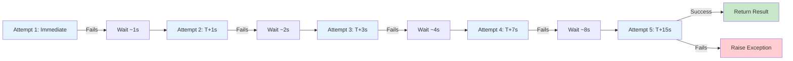
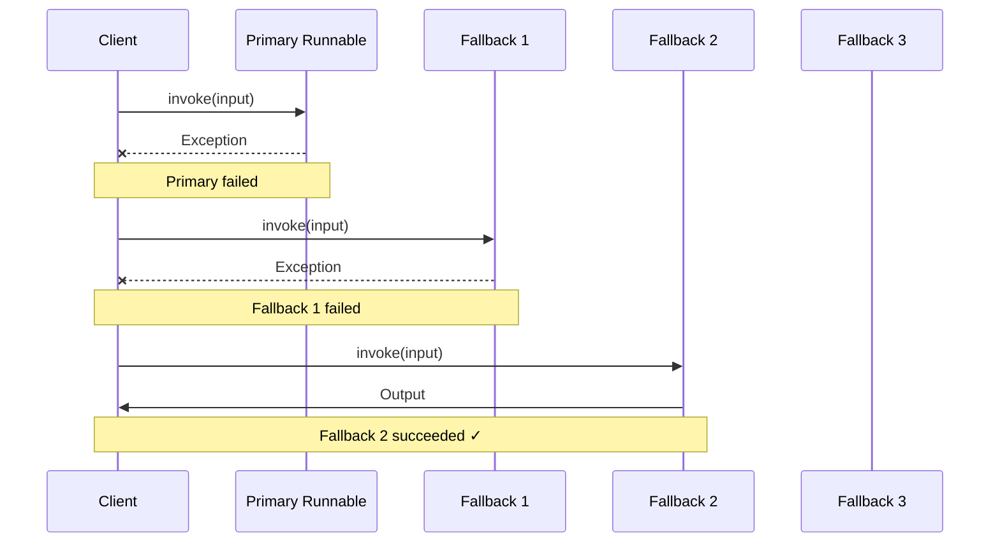
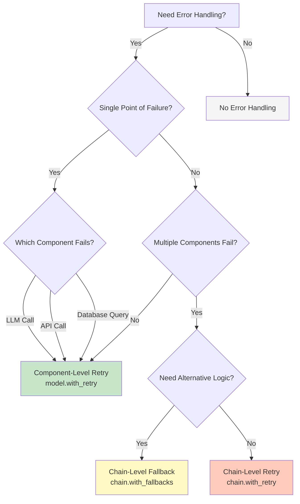

# Error Handling and Recovery in LangChain

A comprehensive guide to building resilient LangChain applications using retry logic, fallback chains, and error recovery patterns for production-grade reliability.

---

## Table of Contents

- [Introduction](#introduction)
- [Retry Logic](#retry-logic)
- [Exponential Backoff](#exponential-backoff)
- [Fallback Chains](#fallback-chains)
- [Exception Handling Strategies](#exception-handling-strategies)
- [Error Recovery Patterns](#error-recovery-patterns)
- [Chain-Level vs Component-Level Error Handling](#chain-level-vs-component-level-error-handling)
- [Practical Examples](#practical-examples)
- [Monitoring and Logging Errors](#monitoring-and-logging-errors)
- [Production Best Practices](#production-best-practices)
- [Troubleshooting](#troubleshooting)

---

## Introduction

External APIs (such as LLM providers, search engines, and databases) can experience transient failures, rate limiting, network issues, or temporary degradation. Building resilient LangChain applications requires implementing robust error handling mechanisms to gracefully handle these scenarios.

### Why Error Handling Matters

**Common Failure Scenarios**:
- **API Reliability Issues**: External services may experience temporary downtime or elevated error rates
- **Network Transience**: Intermittent connectivity problems causing request failures
- **Rate Limiting**: Exceeding API quotas triggering 429 Too Many Requests errors
- **Service Degradation**: Partial outages requiring fallback to alternative providers
- **Timeout Errors**: Long-running operations exceeding configured timeout thresholds

### LangChain Error Recovery Mechanisms

LangChain provides two primary mechanisms for handling errors:

1. **Retry Logic with Exponential Backoff**: Automatically retry failed operations with progressively longer wait times
2. **Fallback Chains for Graceful Degradation**: Switch to alternative implementations when primary components fail

Both mechanisms are available on all `Runnable` objects through the `.with_retry()` and `.with_fallbacks()` methods, enabling fine-grained control over error recovery behavior.

**Source**: `libs/core/langchain_core/runnables/base.py:1825-1984`

---

## Retry Logic

Retry logic automatically re-executes failed operations, allowing transient errors to resolve without manual intervention. LangChain implements retry functionality through the `RunnableRetry` class and the convenient `.with_retry()` method available on all Runnables.

### The `with_retry()` Method

**Source**: `libs/core/langchain_core/runnables/base.py:1825-1887`

Every Runnable in LangChain includes a `with_retry()` method that wraps the Runnable with automatic retry behavior:

```python
def with_retry(
    self,
    *,
    retry_if_exception_type: tuple[type[BaseException], ...] = (Exception,),
    wait_exponential_jitter: bool = True,
    exponential_jitter_params: ExponentialJitterParams | None = None,
    stop_after_attempt: int = 3,
) -> Runnable[Input, Output]:
    """Create a new Runnable that retries the original Runnable on exceptions."""
```

**Parameters**:
- `retry_if_exception_type`: Tuple of exception types to retry (default: `(Exception,)`)
- `wait_exponential_jitter`: Whether to add randomized jitter to backoff timing (default: `True`)
- `exponential_jitter_params`: Custom backoff configuration (initial, max, exp_base, jitter values)
- `stop_after_attempt`: Maximum retry attempts before giving up (default: `3`)

**Returns**: A new `Runnable` that automatically retries on specified exceptions

### RunnableRetry Class

**Source**: `libs/core/langchain_core/runnables/retry.py:48-112`

The `RunnableRetry` class implements the retry mechanism using the [tenacity](https://tenacity.readthedocs.io/) library for advanced retry strategies:

```python
class RunnableRetry(RunnableBindingBase[Input, Output]):
    """Retry a Runnable if it fails.
    
    RunnableRetry can be used to add retry logic to any object
    that subclasses the base Runnable.
    """
    
    retry_exception_types: tuple[type[BaseException], ...] = (Exception,)
    """The exception types to retry on. By default all exceptions are retried."""
    
    max_attempt_number: int = 3
    """The maximum number of attempts to retry the Runnable."""
    
    wait_exponential_jitter: bool = True
    """Whether to add jitter to the exponential backoff."""
    
    exponential_jitter_params: ExponentialJitterParams | None = None
    """Parameters for tenacity.wait_exponential_jitter."""
```

### Configuration Parameters

**Exception Type Specification** (`retry_exception_types`):

Controls which exceptions trigger retry behavior. By default, all exceptions are retried, but you should limit retries to transient errors:

```python
# Good: Retry only network-related errors
runnable.with_retry(
    retry_if_exception_type=(ConnectionError, TimeoutError, HTTPError),
    stop_after_attempt=5
)

# Bad: Retrying all exceptions including permanent failures
runnable.with_retry()  # Retries even authentication errors!
```

**Maximum Attempts** (`max_attempt_number`):

Controls how many times to attempt the operation before raising the exception:

```python
# 3 attempts total: 1 initial + 2 retries
model.with_retry(stop_after_attempt=3)

# 5 attempts total: 1 initial + 4 retries
model.with_retry(stop_after_attempt=5)
```

**Exponential Backoff with Jitter** (`wait_exponential_jitter`):

When enabled (default), adds randomized timing to prevent thundering herd problems. See [Exponential Backoff](#exponential-backoff) for details.

**Custom Backoff Parameters** (`exponential_jitter_params`):

**Source**: `libs/core/langchain_core/runnables/retry.py:35-45`

```python
class ExponentialJitterParams(TypedDict, total=False):
    """Parameters for tenacity.wait_exponential_jitter."""
    
    initial: float  # Initial wait time in seconds
    max: float      # Maximum wait time in seconds
    exp_base: float # Base for exponential calculation
    jitter: float   # Maximum random jitter in seconds
```

Example with custom backoff:

```python
runnable.with_retry(
    retry_if_exception_type=(ConnectionError,),
    stop_after_attempt=5,
    exponential_jitter_params={
        "initial": 1.0,     # Start with 1 second
        "max": 60.0,        # Cap at 60 seconds
        "exp_base": 2,      # Double each time
        "jitter": 5.0       # Add up to 5s random jitter
    }
)
```

### Tenacity Integration

LangChain's retry mechanism uses the `tenacity` library for advanced retry strategies:

**Source**: `libs/core/langchain_core/runnables/retry.py:10-18`

```python
from tenacity import (
    AsyncRetrying,
    RetryCallState,
    RetryError,
    Retrying,
    retry_if_exception_type,
    stop_after_attempt,
    wait_exponential_jitter,
)
```

**Key Tenacity Strategies Used**:

1. **`stop_after_attempt(n)`**: Stops after `n` total attempts
2. **`wait_exponential_jitter(**params)`**: Implements exponential backoff with jitter
3. **`retry_if_exception_type(exceptions)`**: Only retries specified exception types

### Best Practices for Retry Scope

**Source**: `libs/core/langchain_core/runnables/retry.py:92-111`

**Key Principle**: Retry the specific failing component, not the entire chain.

```python
from langchain_core.prompts import PromptTemplate
from langchain_core.chat_models import ChatOpenAI

template = PromptTemplate.from_template("Tell me a joke about {topic}.")
model = ChatOpenAI(temperature=0.5)

# Good: Retry only the LLM call (likely to fail)
chain = template | model.with_retry()

# Bad: Retry the entire chain including prompt formatting
chain = template | model
retryable_chain = chain.with_retry()
```

**Why This Matters**:
- Prompt formatting rarely fails and doesn't need retry
- Retrying the entire chain wastes API calls on repeated prompt processing
- Fine-grained retry scope reduces latency and cost

### Basic Retry Example

```python
from langchain_core.runnables import RunnableLambda
from langchain_core.chat_models import ChatOpenAI
import random

def flaky_api_call(input: str) -> str:
    """Simulates an API that fails 70% of the time."""
    if random.random() < 0.7:
        raise ConnectionError("Network connection failed")
    return f"Processed: {input}"

# Create a Runnable from the flaky function
flaky_runnable = RunnableLambda(flaky_api_call)

# Wrap with retry logic
reliable_runnable = flaky_runnable.with_retry(
    retry_if_exception_type=(ConnectionError, TimeoutError),
    stop_after_attempt=5,
    wait_exponential_jitter=True
)

# Now the operation will retry on connection errors
result = reliable_runnable.invoke("test input")
print(result)  # Will succeed after retries
```

---

## Exponential Backoff

Exponential backoff progressively increases wait time between retry attempts, preventing overload on failing services and improving success rates.

### How Exponential Backoff Works

With each retry attempt, the wait time doubles (by default), allowing transient issues to resolve:

```
Attempt 1: Execute immediately → Fails
Wait ~1 second

Attempt 2: Retry after ~1s → Fails
Wait ~2 seconds

Attempt 3: Retry after ~2s → Fails
Wait ~4 seconds

Attempt 4: Retry after ~4s → Fails
Wait ~8 seconds

Attempt 5: Retry after ~8s → Succeeds or final failure
```

**Formula**: `wait_time = initial * (exp_base ** (attempt_number - 1))`

With default parameters (`initial=1`, `exp_base=2`):
- Attempt 1: 1 * 2^0 = 1 second
- Attempt 2: 1 * 2^1 = 2 seconds
- Attempt 3: 1 * 2^2 = 4 seconds
- Attempt 4: 1 * 2^3 = 8 seconds

### Why Add Jitter?

Jitter adds randomness to wait times, preventing synchronized retry storms (thundering herd problem).

**Without Jitter** (synchronized retries):
```
100 clients all fail at time T
All wait exactly 2 seconds
All retry simultaneously at T+2s → Server overwhelmed again
```

**With Jitter** (randomized retries):
```
100 clients all fail at time T
Wait times: 1.2s, 1.8s, 2.3s, 1.5s, 2.1s, ... (randomized)
Retries spread out over T+1s to T+3s → Load distributed
```

**Source**: `libs/core/langchain_core/runnables/retry.py:124-125`

Jitter is enabled by default in LangChain:

```python
wait_exponential_jitter: bool = True
"""Whether to add jitter to the exponential backoff."""
```

### Customizing Backoff Behavior

**Example: Aggressive Retry** (short waits, quick attempts):

```python
model.with_retry(
    stop_after_attempt=10,
    exponential_jitter_params={
        "initial": 0.5,    # Start at 0.5 seconds
        "max": 10.0,       # Cap at 10 seconds
        "exp_base": 1.5,   # Slower growth (1.5x instead of 2x)
        "jitter": 2.0      # Add up to 2s jitter
    }
)
```

**Example: Conservative Retry** (longer waits, thorough attempts):

```python
model.with_retry(
    stop_after_attempt=5,
    exponential_jitter_params={
        "initial": 2.0,    # Start at 2 seconds
        "max": 120.0,      # Cap at 2 minutes
        "exp_base": 3,     # Faster growth (3x per attempt)
        "jitter": 10.0     # Add up to 10s jitter
    }
)
```

### Backoff Timing Visualization



---

## Fallback Chains

Fallback chains provide graceful degradation by switching to alternative implementations when the primary Runnable fails. This pattern is essential for maintaining service availability when external dependencies experience issues.

### The `with_fallbacks()` Method

**Source**: `libs/core/langchain_core/runnables/base.py:1912-1984`

Every Runnable includes a `with_fallbacks()` method that creates a `RunnableWithFallbacks` wrapper:

```python
def with_fallbacks(
    self,
    fallbacks: Sequence[Runnable[Input, Output]],
    *,
    exceptions_to_handle: tuple[type[BaseException], ...] = (Exception,),
    exception_key: str | None = None,
) -> RunnableWithFallbacks[Input, Output]:
    """Add fallbacks to a Runnable, returning a new Runnable.
    
    The new Runnable will try the original Runnable, and then each fallback
    in order, upon failures.
    """
```

**Parameters**:
- `fallbacks`: Sequence of alternative Runnables to try in order
- `exceptions_to_handle`: Tuple of exception types that trigger fallback (default: `(Exception,)`)
- `exception_key`: Optional string key to pass caught exceptions to fallbacks as input

**Returns**: A new `RunnableWithFallbacks` that tries alternatives on failure

### RunnableWithFallbacks Class

**Source**: `libs/core/langchain_core/runnables/fallbacks.py:37-87`

```python
class RunnableWithFallbacks(RunnableSerializable[Input, Output]):
    """Runnable that can fallback to other Runnables if it fails.
    
    External APIs (e.g., APIs for a language model) may at times experience
    degraded performance or even downtime.
    
    In these cases, it can be useful to have a fallback Runnable that can be
    used in place of the original Runnable (e.g., fallback to another LLM provider).
    
    Fallbacks can be defined at the level of a single Runnable, or at the level
    of a chain of Runnables. Fallbacks are tried in order until one succeeds or
    all fail.
    """
    
    runnable: Runnable[Input, Output]
    """The Runnable to run first."""
    
    fallbacks: Sequence[Runnable[Input, Output]]
    """A sequence of fallbacks to try."""
    
    exceptions_to_handle: tuple[type[BaseException], ...] = (Exception,)
    """The exceptions on which fallbacks should be tried.
    
    Any exception that is not a subclass of these exceptions will be raised immediately.
    """
    
    exception_key: str | None = None
    """If string is specified then handled exceptions will be passed to fallbacks as
    part of the input under the specified key. If None, exceptions will not be passed
    to fallbacks. If used, the base Runnable and its fallbacks must accept a
    dictionary as input."""
```

### Fallback Execution Order

Fallbacks are tried sequentially until one succeeds:



If all fallbacks fail, the last exception is raised.

### Component-Level Fallbacks

Fallback a single component (e.g., LLM provider):

```python
from langchain_core.chat_models import ChatOpenAI, ChatAnthropic

# Primary: OpenAI GPT-4
# Fallback 1: OpenAI GPT-3.5 (same provider, cheaper model)
# Fallback 2: Anthropic Claude (different provider)

model = ChatOpenAI(model="gpt-4").with_fallbacks([
    ChatOpenAI(model="gpt-3.5-turbo"),
    ChatAnthropic(model="claude-3-haiku-20240307")
])

# Will try GPT-4 → GPT-3.5 → Claude in order
response = model.invoke("Tell me a joke")
```

### Chain-Level Fallbacks

**Source**: `libs/core/langchain_core/runnables/fallbacks.py:81-86`

Apply fallbacks to entire LCEL chains:

```python
from langchain_core.prompts import PromptTemplate
from langchain_core.output_parsers import StrOutputParser
from langchain_core.runnables import RunnableLambda

def hardcoded_response(inputs):
    """Fallback response when all LLM providers fail."""
    return (
        "I apologize, but our AI services are temporarily unavailable. "
        "Please try again in a few moments. 🦜"
    )

# Primary chain
chain = (
    PromptTemplate.from_template("Tell me a joke about {topic}")
    | ChatOpenAI(model="gpt-4")
    | StrOutputParser()
)

# Chain with ultimate fallback
chain_with_fallback = chain.with_fallbacks([
    RunnableLambda(hardcoded_response)
])

# Always returns something, even if OpenAI is down
result = chain_with_fallback.invoke({"topic": "programming"})
```

### Multi-Level Fallback Example

**Source**: `libs/core/langchain_core/runnables/fallbacks.py:54-86`

```python
from langchain_core.chat_models import ChatOpenAI, ChatAnthropic, ChatGoogleGenerativeAI
from langchain_core.runnables import RunnableLambda

def emergency_response(inputs):
    return "Service temporarily unavailable. Here's a parrot emoji: 🦜"

# Comprehensive fallback strategy
model = ChatOpenAI(model="gpt-4").with_fallbacks([
    ChatOpenAI(model="gpt-3.5-turbo"),      # Same provider, cheaper model
    ChatAnthropic(model="claude-3-sonnet"), # Different provider #1
    ChatGoogleGenerativeAI(model="gemini-pro"), # Different provider #2
    RunnableLambda(emergency_response)      # Hardcoded last resort
])

# Tries 5 strategies before failing
response = model.invoke("Hello!")
```

### Exception Key Usage

Pass caught exceptions to fallback Runnables for context-aware recovery:

```python
from langchain_core.runnables import RunnableLambda

def primary_operation(inputs: dict) -> str:
    raise ValueError("Primary operation failed with error XYZ")

def fallback_with_error_context(inputs: dict) -> str:
    error = inputs.get("error")
    return f"Fallback activated due to: {error}"

runnable = RunnableLambda(primary_operation).with_fallbacks(
    [RunnableLambda(fallback_with_error_context)],
    exception_key="error"
)

result = runnable.invoke({"data": "test"})
print(result)  # "Fallback activated due to: Primary operation failed with error XYZ"
```

---

## Exception Handling Strategies

Effective error handling requires distinguishing between transient errors (should retry) and permanent errors (should fail immediately).

### Exception Type Classification

**Transient Errors** (Should Retry):
- `ConnectionError`, `TimeoutError` - Network connectivity issues
- HTTP 429 Too Many Requests - Rate limiting (with backoff)
- HTTP 5xx Server Errors - Temporary server issues
- `asyncio.TimeoutError` - Operation timeout (may succeed with more time)

**Permanent Errors** (Should Not Retry):
- HTTP 401 Unauthorized - Invalid authentication credentials
- HTTP 403 Forbidden - Insufficient permissions
- HTTP 400 Bad Request - Invalid input data
- `ValidationError` (Pydantic) - Schema validation failure
- `KeyError`, `AttributeError` - Programming errors

### Selective Exception Handling

Configure retry and fallback to handle only transient errors:

```python
from langchain_core.chat_models import ChatOpenAI
import httpx

# Only retry on network and rate limit errors
model = ChatOpenAI().with_retry(
    retry_if_exception_type=(
        ConnectionError,
        TimeoutError,
        httpx.TimeoutException,
        httpx.ConnectError,
    ),
    stop_after_attempt=5
)

# Immediately raise authentication errors
try:
    response = model.invoke("Hello")
except httpx.HTTPStatusError as e:
    if e.response.status_code == 401:
        raise  # Don't retry invalid credentials
```

### Pydantic Validation Errors

**Do NOT retry validation errors** - they indicate incorrect input schemas:

```python
from pydantic import BaseModel, ValidationError
from langchain_core.runnables import RunnableLambda

class UserInput(BaseModel):
    name: str
    age: int

def process_user(input: dict) -> str:
    user = UserInput(**input)  # May raise ValidationError
    return f"Processing user: {user.name}, age {user.age}"

# Do NOT retry validation errors
runnable = RunnableLambda(process_user).with_retry(
    retry_if_exception_type=(ConnectionError, TimeoutError)
    # ValidationError NOT included - indicates bad input
)

try:
    runnable.invoke({"name": "Alice", "age": "invalid"})  # Wrong type
except ValidationError as e:
    print(f"Invalid input: {e}")
    # Handle validation error without retry
```

### API Error Status Codes

Different HTTP status codes require different handling strategies:

| Status Code | Category | Retry? | Fallback? | Notes |
|-------------|----------|--------|-----------|-------|
| 429 Too Many Requests | Rate Limit | ✅ Yes | ✅ Yes | Retry with exponential backoff, respect Retry-After header |
| 500 Internal Server Error | Server Error | ✅ Yes | ✅ Yes | Temporary server issue |
| 502 Bad Gateway | Server Error | ✅ Yes | ✅ Yes | Upstream service issue |
| 503 Service Unavailable | Server Error | ✅ Yes | ✅ Yes | Temporary unavailability |
| 504 Gateway Timeout | Server Error | ✅ Yes | ✅ Yes | Upstream timeout |
| 401 Unauthorized | Auth Error | ❌ No | ❌ No | Invalid credentials - fix configuration |
| 403 Forbidden | Auth Error | ❌ No | ❌ No | Insufficient permissions |
| 400 Bad Request | Client Error | ❌ No | ❌ No | Invalid request format |
| 404 Not Found | Client Error | ❌ No | ❌ No | Resource doesn't exist |
| 422 Unprocessable Entity | Validation Error | ❌ No | ❌ No | Invalid request content |

Example implementation:

```python
import httpx

def should_retry_http_error(exception: BaseException) -> bool:
    """Determine if HTTP error should be retried."""
    if isinstance(exception, httpx.HTTPStatusError):
        status_code = exception.response.status_code
        # Retry on rate limits and server errors
        return status_code == 429 or 500 <= status_code < 600
    return False

# Custom retry logic
from tenacity import retry_if_exception
model.with_retry(
    retry_if_exception_type=(httpx.HTTPStatusError,),
    stop_after_attempt=5
)
```

---

## Error Recovery Patterns

Common patterns for handling specific failure scenarios in production LangChain applications.

### Pattern 1: LLM Provider Fallback

**Use Case**: Primary LLM provider experiences downtime or rate limiting

**Implementation**:

```python
from langchain_core.chat_models import ChatOpenAI, ChatAnthropic
from langchain_core.prompts import ChatPromptTemplate
from langchain_core.output_parsers import StrOutputParser
from langchain_core.runnables import RunnableLambda

# Define fallback chain
def last_resort_response(inputs):
    """Hardcoded response when all providers fail."""
    topic = inputs.get("topic", "a topic")
    return f"I apologize, but I'm unable to generate content about {topic} at the moment."

# Primary model with automatic retries
primary_model = ChatOpenAI(model="gpt-4").with_retry(
    retry_if_exception_type=(ConnectionError, TimeoutError),
    stop_after_attempt=3
)

# Fallback model with retries
fallback_model = ChatAnthropic(model="claude-3-sonnet").with_retry(
    retry_if_exception_type=(ConnectionError, TimeoutError),
    stop_after_attempt=3
)

# Complete chain with fallbacks
chain = (
    ChatPromptTemplate.from_template("Tell me about {topic}")
    | primary_model
    | StrOutputParser()
).with_fallbacks([
    ChatPromptTemplate.from_template("Tell me about {topic}")
    | fallback_model
    | StrOutputParser(),
    RunnableLambda(last_resort_response)
])

# Always returns something
result = chain.invoke({"topic": "quantum computing"})
```

### Pattern 2: API Retry with Circuit Breaker

**Use Case**: Prevent cascading failures when external service is consistently failing

**Implementation**:

```python
import time
from typing import Dict, Any

class CircuitBreaker:
    """Simple circuit breaker implementation."""
    
    def __init__(self, failure_threshold: int = 5, timeout: int = 60):
        self.failure_threshold = failure_threshold
        self.timeout = timeout
        self.failure_count = 0
        self.last_failure_time = None
        self.state = "CLOSED"  # CLOSED, OPEN, HALF_OPEN
    
    def call(self, func, *args, **kwargs):
        if self.state == "OPEN":
            if time.time() - self.last_failure_time > self.timeout:
                self.state = "HALF_OPEN"
            else:
                raise Exception("Circuit breaker is OPEN")
        
        try:
            result = func(*args, **kwargs)
            if self.state == "HALF_OPEN":
                self.state = "CLOSED"
                self.failure_count = 0
            return result
        except Exception as e:
            self.failure_count += 1
            self.last_failure_time = time.time()
            if self.failure_count >= self.failure_threshold:
                self.state = "OPEN"
            raise e

# Usage with LangChain
from langchain_core.runnables import RunnableLambda

circuit_breaker = CircuitBreaker(failure_threshold=5, timeout=60)

def api_call_with_circuit_breaker(input: str) -> str:
    return circuit_breaker.call(external_api_call, input)

safe_runnable = RunnableLambda(api_call_with_circuit_breaker).with_retry(
    retry_if_exception_type=(ConnectionError,),
    stop_after_attempt=3
)
```

### Pattern 3: Timeout Handling

**Use Case**: Prevent chains from hanging indefinitely on slow operations

**Implementation**:

```python
import asyncio
from langchain_core.runnables import RunnableLambda

async def long_running_operation(input: str) -> str:
    """Simulates a slow API call."""
    await asyncio.sleep(30)  # 30 second operation
    return f"Processed: {input}"

async def operation_with_timeout(input: str) -> str:
    """Wraps operation with timeout."""
    try:
        result = await asyncio.wait_for(
            long_running_operation(input),
            timeout=10.0  # 10 second timeout
        )
        return result
    except asyncio.TimeoutError:
        return f"Operation timed out for input: {input}"

# Create async Runnable with timeout
runnable = RunnableLambda(operation_with_timeout)

# Use in async context
import asyncio
result = asyncio.run(runnable.ainvoke("test"))
print(result)  # "Operation timed out for input: test"
```

### Pattern 4: Rate Limit Backoff

**Use Case**: Handle API rate limiting gracefully with intelligent backoff

**Implementation**:

```python
import httpx
from langchain_core.chat_models import ChatOpenAI

def get_retry_after(exception: BaseException) -> float:
    """Extract Retry-After header from rate limit response."""
    if isinstance(exception, httpx.HTTPStatusError):
        if exception.response.status_code == 429:
            retry_after = exception.response.headers.get("Retry-After")
            if retry_after:
                try:
                    return float(retry_after)
                except ValueError:
                    pass
    return 0.0

# Model with rate limit handling
model = ChatOpenAI().with_retry(
    retry_if_exception_type=(httpx.HTTPStatusError,),
    stop_after_attempt=5,
    exponential_jitter_params={
        "initial": 1.0,
        "max": 60.0,
        "exp_base": 2,
        "jitter": 5.0
    }
)

# Respect rate limits
try:
    response = model.invoke("Hello")
except httpx.HTTPStatusError as e:
    if e.response.status_code == 429:
        retry_after = get_retry_after(e)
        print(f"Rate limited. Retry after {retry_after} seconds")
        raise
```

### Pattern 5: Database Query with Retry

**Use Case**: Handle transient database connection failures

**Implementation**:

```python
from langchain_core.runnables import RunnableLambda
import psycopg2

def query_database(input: dict) -> list:
    """Query database with connection retry."""
    query = input["query"]
    try:
        conn = psycopg2.connect(
            host="localhost",
            database="mydb",
            user="user",
            password="password"
        )
        cursor = conn.cursor()
        cursor.execute(query)
        results = cursor.fetchall()
        conn.close()
        return results
    except psycopg2.OperationalError as e:
        # Connection error - should retry
        raise ConnectionError(f"Database connection failed: {e}")

# Runnable with database retry
db_runnable = RunnableLambda(query_database).with_retry(
    retry_if_exception_type=(ConnectionError,),
    stop_after_attempt=5,
    exponential_jitter_params={
        "initial": 0.5,
        "max": 10.0
    }
)

results = db_runnable.invoke({"query": "SELECT * FROM users WHERE id = 1"})
```

---

## Chain-Level vs Component-Level Error Handling

Choosing the right scope for error handling is crucial for efficiency and cost control.

### Decision Framework



### Component-Level Error Handling

**When to Use**:
- Single component is likely to fail (e.g., external API, LLM call)
- Other chain components rarely fail (e.g., prompt formatting, output parsing)
- Want to minimize retry cost (avoid re-executing entire chain)

**Example**:

```python
from langchain_core.prompts import PromptTemplate
from langchain_core.chat_models import ChatOpenAI
from langchain_core.output_parsers import StrOutputParser

# Retry ONLY the LLM call
chain = (
    PromptTemplate.from_template("Question: {question}")  # Rarely fails
    | ChatOpenAI().with_retry(                            # Likely to fail ✓
        retry_if_exception_type=(ConnectionError, TimeoutError),
        stop_after_attempt=5
    )
    | StrOutputParser()                                   # Rarely fails
)
```

**Benefits**:
- ✅ Efficient: Doesn't re-execute prompt formatting on each retry
- ✅ Cost-effective: Minimizes unnecessary API calls
- ✅ Fast: Reduces latency by retrying only failing component

### Chain-Level Error Handling

**When to Use**:
- Multiple components can fail independently
- Need to switch to alternative logic (not just retry)
- Complex recovery logic that requires different chain structure

**Example 1: Multiple Failure Points**

```python
# Both LLM and database can fail
chain = (
    PromptTemplate.from_template("Summarize: {text}")
    | ChatOpenAI().with_retry(stop_after_attempt=3)      # LLM retry
    | StrOutputParser()
    | db_store_runnable.with_retry(stop_after_attempt=3) # DB retry
)
```

**Example 2: Alternative Logic with Fallback**

```python
from langchain_core.runnables import RunnableLambda

# Primary: Complex chain with embeddings
primary_chain = embeddings_chain | vector_store | llm | parser

# Fallback: Simple chain without embeddings
fallback_chain = simple_prompt | llm | parser

# Chain-level fallback to alternative logic
chain_with_alternative = primary_chain.with_fallbacks([fallback_chain])
```

### Cost and Performance Comparison

**Scenario**: Chain with 3 steps, LLM call fails on attempt 1

**Component-Level Retry** (Recommended):
```
Attempt 1: Prompt → LLM (FAIL) → (stop)
Attempt 2: Prompt (skip) → LLM (SUCCESS) → Parser
Total operations: 1 prompt + 2 LLM + 1 parser = 4 operations
```

**Chain-Level Retry** (Inefficient):
```
Attempt 1: Prompt → LLM (FAIL) → (stop)
Attempt 2: Prompt → LLM (SUCCESS) → Parser
Total operations: 2 prompts + 2 LLM + 1 parser = 5 operations
```

**Recommendation**: Use component-level retry for efficiency, chain-level fallback for alternative logic.

---

## Practical Examples

Complete, executable examples demonstrating error handling patterns.

### Example 1: LLM Provider Fallback Chain

```python
"""Complete example: LLM provider fallback with retry logic."""

from langchain_core.chat_models import ChatOpenAI, ChatAnthropic
from langchain_core.prompts import ChatPromptTemplate
from langchain_core.output_parsers import StrOutputParser
from langchain_core.runnables import RunnableLambda
from typing import Any

# Step 1: Define hardcoded fallback
def emergency_response(inputs: Any) -> str:
    """Last resort response when all LLM providers fail."""
    if isinstance(inputs, dict):
        topic = inputs.get("topic", "your request")
        return f"I apologize, but I cannot process {topic} at the moment. Please try again later."
    return "Service temporarily unavailable."

# Step 2: Configure primary model with retry
primary_model = ChatOpenAI(
    model="gpt-4",
    temperature=0.7
).with_retry(
    retry_if_exception_type=(ConnectionError, TimeoutError),
    stop_after_attempt=3,
    wait_exponential_jitter=True
)

# Step 3: Configure fallback model with retry
fallback_model = ChatAnthropic(
    model="claude-3-sonnet-20240229"
).with_retry(
    retry_if_exception_type=(ConnectionError, TimeoutError),
    stop_after_attempt=3,
    wait_exponential_jitter=True
)

# Step 4: Build prompt template
prompt = ChatPromptTemplate.from_template(
    "You are a helpful assistant. {question}"
)

# Step 5: Construct chain with fallbacks
chain = (prompt | primary_model | StrOutputParser()).with_fallbacks([
    prompt | fallback_model | StrOutputParser(),
    RunnableLambda(emergency_response)
])

# Step 6: Use the resilient chain
if __name__ == "__main__":
    try:
        result = chain.invoke({
            "question": "What are the key principles of software architecture?"
        })
        print(f"Response: {result}")
    except Exception as e:
        print(f"All fallbacks exhausted: {e}")
```

### Example 2: API Call with Exponential Backoff

```python
"""Complete example: External API with retry and backoff."""

from langchain_core.runnables import RunnableLambda
import httpx
import time
from typing import Dict, Any

# Simulated external API (replace with real API)
def call_external_api(input: Dict[str, Any]) -> Dict[str, Any]:
    """Call external API that may fail transiently."""
    endpoint = "https://api.example.com/process"
    payload = input["data"]
    
    try:
        response = httpx.post(
            endpoint,
            json=payload,
            timeout=10.0
        )
        response.raise_for_status()
        return response.json()
    except httpx.TimeoutException:
        raise TimeoutError(f"API call timed out after 10 seconds")
    except httpx.ConnectError as e:
        raise ConnectionError(f"Failed to connect to API: {e}")
    except httpx.HTTPStatusError as e:
        if e.response.status_code == 429:
            # Rate limited - extract Retry-After header
            retry_after = e.response.headers.get("Retry-After", "60")
            raise ConnectionError(f"Rate limited. Retry after {retry_after}s")
        elif 500 <= e.response.status_code < 600:
            # Server error - transient
            raise ConnectionError(f"Server error: {e.response.status_code}")
        else:
            # Client error - permanent
            raise ValueError(f"Invalid request: {e.response.status_code}")

# Create Runnable with retry logic
api_runnable = RunnableLambda(call_external_api).with_retry(
    retry_if_exception_type=(ConnectionError, TimeoutError),
    stop_after_attempt=5,
    exponential_jitter_params={
        "initial": 1.0,    # Start with 1 second wait
        "max": 60.0,       # Maximum 60 second wait
        "exp_base": 2,     # Double wait time each retry
        "jitter": 5.0      # Add up to 5 seconds random jitter
    }
)

if __name__ == "__main__":
    try:
        result = api_runnable.invoke({
            "data": {"message": "Hello, API!"}
        })
        print(f"API Response: {result}")
    except ValueError as e:
        print(f"Permanent error (not retried): {e}")
    except Exception as e:
        print(f"All retries exhausted: {e}")
```

### Example 3: Validation Error Handling

```python
"""Complete example: Pydantic validation with proper error handling."""

from langchain_core.runnables import RunnableLambda
from pydantic import BaseModel, Field, ValidationError
from typing import Dict, Any

# Define strict input schema
class UserQuery(BaseModel):
    """Validated user query schema."""
    query: str = Field(..., min_length=1, max_length=500)
    user_id: int = Field(..., gt=0)
    language: str = Field(default="en", pattern="^[a-z]{2}$")

# Processing function with validation
def process_query(input: Dict[str, Any]) -> str:
    """Process user query with input validation."""
    try:
        # Validate input against schema
        validated = UserQuery(**input)
        
        # Process validated input
        return f"Processing query '{validated.query}' for user {validated.user_id}"
        
    except ValidationError as e:
        # DO NOT RETRY - validation errors indicate bad input
        error_messages = [f"{err['loc'][0]}: {err['msg']}" for err in e.errors()]
        raise ValueError(f"Invalid input: {', '.join(error_messages)}")

# Create Runnable - DO NOT retry validation errors
query_runnable = RunnableLambda(process_query).with_retry(
    retry_if_exception_type=(ConnectionError, TimeoutError),
    # ValidationError NOT included - indicates bad input, not transient failure
    stop_after_attempt=3
)

if __name__ == "__main__":
    # Valid input
    try:
        result = query_runnable.invoke({
            "query": "What is LangChain?",
            "user_id": 123,
            "language": "en"
        })
        print(f"Success: {result}")
    except Exception as e:
        print(f"Error: {e}")
    
    # Invalid input - will fail immediately without retry
    try:
        result = query_runnable.invoke({
            "query": "",  # Too short
            "user_id": -1,  # Invalid (must be > 0)
            "language": "invalid"  # Wrong format
        })
    except ValueError as e:
        print(f"Validation failed (not retried): {e}")
```

### Example 4: Streaming Chain with Timeout

```python
"""Complete example: Streaming LLM with timeout handling."""

import asyncio
from langchain_core.chat_models import ChatOpenAI
from langchain_core.prompts import ChatPromptTemplate
from langchain_core.output_parsers import StrOutputParser

async def stream_with_timeout(chain, input_data: dict, timeout: float = 30.0):
    """Stream chain output with timeout protection."""
    try:
        # Create async streaming iterator
        stream = chain.astream(input_data)
        
        # Collect chunks with timeout
        chunks = []
        async for chunk in asyncio.wait_for(stream, timeout=timeout):
            chunks.append(chunk)
            print(chunk, end="", flush=True)
        
        return "".join(chunks)
        
    except asyncio.TimeoutError:
        print(f"\n[Timeout after {timeout}s]")
        return "".join(chunks) + "\n[Response incomplete due to timeout]"

async def main():
    # Build streaming chain
    chain = (
        ChatPromptTemplate.from_template(
            "Write a detailed essay about {topic}. Be comprehensive."
        )
        | ChatOpenAI(model="gpt-4", streaming=True)
        | StrOutputParser()
    )
    
    # Stream with timeout
    result = await stream_with_timeout(
        chain,
        {"topic": "the history of artificial intelligence"},
        timeout=30.0
    )
    
    print(f"\n\nFinal result length: {len(result)} characters")

if __name__ == "__main__":
    asyncio.run(main())
```

---

## Monitoring and Logging Errors

Effective error monitoring is essential for understanding failure patterns and improving system reliability.

### Logging with Callbacks

Use LangChain callbacks to track errors throughout chain execution:

```python
from langchain_core.callbacks import BaseCallbackHandler
from langchain_core.outputs import LLMResult
from typing import Any, Dict
import logging

# Configure logging
logging.basicConfig(
    level=logging.INFO,
    format='%(asctime)s - %(name)s - %(levelname)s - %(message)s'
)
logger = logging.getLogger(__name__)

class ErrorTrackingCallback(BaseCallbackHandler):
    """Callback handler that logs all errors and retries."""
    
    def on_chain_error(
        self,
        error: Exception,
        *,
        run_id: Any,
        parent_run_id: Any | None = None,
        tags: list[str] | None = None,
        **kwargs: Any,
    ) -> Any:
        """Log chain errors."""
        logger.error(
            f"Chain error [run_id={run_id}]: {type(error).__name__}: {error}",
            exc_info=True,
            extra={
                "run_id": str(run_id),
                "parent_run_id": str(parent_run_id) if parent_run_id else None,
                "tags": tags,
                "error_type": type(error).__name__
            }
        )
    
    def on_llm_error(
        self,
        error: Exception,
        *,
        run_id: Any,
        parent_run_id: Any | None = None,
        tags: list[str] | None = None,
        **kwargs: Any,
    ) -> Any:
        """Log LLM errors."""
        logger.error(
            f"LLM error [run_id={run_id}]: {type(error).__name__}: {error}",
            extra={
                "run_id": str(run_id),
                "parent_run_id": str(parent_run_id) if parent_run_id else None,
                "tags": tags,
                "error_type": type(error).__name__
            }
        )
    
    def on_retry(
        self,
        retry_state: Any,
        *,
        run_id: Any,
        **kwargs: Any,
    ) -> Any:
        """Log retry attempts."""
        attempt = getattr(retry_state, 'attempt_number', 'unknown')
        logger.warning(
            f"Retry attempt {attempt} [run_id={run_id}]",
            extra={
                "run_id": str(run_id),
                "attempt_number": attempt
            }
        )

# Use the callback with chains
from langchain_core.chat_models import ChatOpenAI

error_tracker = ErrorTrackingCallback()

model = ChatOpenAI().with_retry(
    retry_if_exception_type=(ConnectionError, TimeoutError),
    stop_after_attempt=5
)

response = model.invoke(
    "Hello",
    config={"callbacks": [error_tracker]}
)
```

### Structured Error Logging

Log errors with structured context for analysis:

```python
import json
from datetime import datetime
from typing import Dict, Any

class StructuredErrorLogger:
    """Logger that outputs structured JSON error logs."""
    
    def __init__(self, log_file: str = "errors.jsonl"):
        self.log_file = log_file
    
    def log_error(
        self,
        error: Exception,
        context: Dict[str, Any],
        retry_attempt: int = 0
    ):
        """Log error with structured context."""
        error_entry = {
            "timestamp": datetime.utcnow().isoformat(),
            "error_type": type(error).__name__,
            "error_message": str(error),
            "retry_attempt": retry_attempt,
            "context": context,
            "stack_trace": self._format_stack_trace(error)
        }
        
        with open(self.log_file, "a") as f:
            f.write(json.dumps(error_entry) + "\n")
    
    def _format_stack_trace(self, error: Exception) -> list[str]:
        """Extract stack trace as list of strings."""
        import traceback
        return traceback.format_exception(type(error), error, error.__traceback__)

# Usage
error_logger = StructuredErrorLogger("langchain_errors.jsonl")

try:
    chain.invoke({"input": "test"})
except Exception as e:
    error_logger.log_error(
        e,
        context={
            "chain_type": "llm_chain",
            "model": "gpt-4",
            "input_length": 4
        },
        retry_attempt=3
    )
    raise
```

### Metrics Collection

Track error rates and retry patterns:

```python
from collections import defaultdict
from typing import Dict
import time

class ErrorMetrics:
    """Collect error metrics for monitoring."""
    
    def __init__(self):
        self.error_counts: Dict[str, int] = defaultdict(int)
        self.retry_counts: Dict[str, int] = defaultdict(int)
        self.success_counts: Dict[str, int] = defaultdict(int)
        self.last_errors: list = []
    
    def record_error(self, error_type: str, component: str):
        """Record an error occurrence."""
        key = f"{component}:{error_type}"
        self.error_counts[key] += 1
        self.last_errors.append({
            "time": time.time(),
            "component": component,
            "error_type": error_type
        })
        # Keep only last 100 errors
        self.last_errors = self.last_errors[-100:]
    
    def record_retry(self, component: str, attempt: int):
        """Record a retry attempt."""
        key = f"{component}:attempt_{attempt}"
        self.retry_counts[key] += 1
    
    def record_success(self, component: str):
        """Record a successful operation."""
        self.success_counts[component] += 1
    
    def get_error_rate(self, component: str) -> float:
        """Calculate error rate for component."""
        errors = sum(
            count for key, count in self.error_counts.items()
            if key.startswith(f"{component}:")
        )
        successes = self.success_counts.get(component, 0)
        total = errors + successes
        return errors / total if total > 0 else 0.0
    
    def get_summary(self) -> Dict[str, Any]:
        """Get metrics summary."""
        return {
            "total_errors": sum(self.error_counts.values()),
            "total_retries": sum(self.retry_counts.values()),
            "total_successes": sum(self.success_counts.values()),
            "error_breakdown": dict(self.error_counts),
            "retry_breakdown": dict(self.retry_counts)
        }

# Usage
metrics = ErrorMetrics()

try:
    result = chain.invoke(input_data)
    metrics.record_success("llm_chain")
except ConnectionError as e:
    metrics.record_error("ConnectionError", "llm_chain")
    raise

print(metrics.get_summary())
print(f"LLM chain error rate: {metrics.get_error_rate('llm_chain'):.2%}")
```

### Alerting on Persistent Errors

Detect patterns requiring human intervention:

```python
from datetime import datetime, timedelta
from typing import List, Dict

class ErrorAlerter:
    """Alert when error patterns indicate persistent problems."""
    
    def __init__(
        self,
        error_threshold: int = 10,
        time_window_minutes: int = 5
    ):
        self.error_threshold = error_threshold
        self.time_window = timedelta(minutes=time_window_minutes)
        self.recent_errors: List[Dict] = []
    
    def record_error(self, error_type: str, component: str):
        """Record error and check if alert should be triggered."""
        now = datetime.utcnow()
        
        # Add new error
        self.recent_errors.append({
            "time": now,
            "error_type": error_type,
            "component": component
        })
        
        # Remove old errors outside time window
        cutoff = now - self.time_window
        self.recent_errors = [
            e for e in self.recent_errors
            if e["time"] > cutoff
        ]
        
        # Check if alert should be triggered
        if len(self.recent_errors) >= self.error_threshold:
            self.trigger_alert(component, error_type)
    
    def trigger_alert(self, component: str, error_type: str):
        """Trigger alert for persistent errors."""
        message = (
            f"ALERT: {len(self.recent_errors)} {error_type} errors "
            f"in {component} within {self.time_window.total_seconds()/60} minutes"
        )
        print(f"🚨 {message}")
        # In production: send to monitoring system (PagerDuty, Slack, etc.)
        self.send_to_monitoring_system(message)
    
    def send_to_monitoring_system(self, message: str):
        """Send alert to external monitoring system."""
        # Implement integration with your monitoring system
        pass

# Usage
alerter = ErrorAlerter(error_threshold=10, time_window_minutes=5)

for _ in range(12):  # Simulate multiple errors
    try:
        chain.invoke(input_data)
    except ConnectionError:
        alerter.record_error("ConnectionError", "openai_model")
        # Will trigger alert after 10th error within 5 minutes
```

---

## Production Best Practices

Guidelines for implementing robust error handling in production LangChain applications.

### 1. Appropriate Retry Attempts

**Recommendation**: 3-5 retries for most API calls

```python
# Good: Reasonable retry count
model.with_retry(stop_after_attempt=3)  # 1 initial + 2 retries

# Bad: Too few retries (miss recovery opportunities)
model.with_retry(stop_after_attempt=1)  # No retries!

# Bad: Too many retries (wastes time and money)
model.with_retry(stop_after_attempt=20)  # Excessive
```

**Rationale**:
- Most transient failures resolve within 3-5 attempts
- More attempts increase latency without proportional benefit
- Excessive retries can amplify costs (API charges per call)

### 2. Exponential Backoff with Jitter

**Always enable jitter** to prevent synchronized retry storms:

```python
# Good: Exponential backoff with jitter (default)
model.with_retry(
    wait_exponential_jitter=True,
    stop_after_attempt=5
)

# Bad: No jitter (thundering herd risk)
model.with_retry(
    wait_exponential_jitter=False,
    stop_after_attempt=5
)
```

**Configuration**:
- Initial wait: 1-2 seconds
- Max wait: 60 seconds (most APIs recover within 1 minute)
- Exponential base: 2 (doubling wait time)
- Jitter: 20-50% of wait time

### 3. Circuit Breakers for Cascading Failures

Prevent domino effects when services are down:

```python
# Implement circuit breaker pattern
model_with_circuit_breaker = wrap_with_circuit_breaker(
    model,
    failure_threshold=5,
    recovery_timeout=60
)

# Fail fast when circuit is open
try:
    response = model_with_circuit_breaker.invoke(input)
except CircuitBreakerOpen:
    # Service is known to be down - don't even try
    return fallback_response()
```

### 4. Timeouts for All External Calls

**Never make unbounded calls** to external services:

```python
# Good: Timeout configured
model = ChatOpenAI(request_timeout=30.0)  # 30 second timeout

# Bad: No timeout (can hang indefinitely)
model = ChatOpenAI()  # Uses default, may be too long
```

**Timeout Guidelines**:
- Simple LLM calls: 30 seconds
- Complex generations: 60-120 seconds
- Streaming: 5 seconds for first token, then per-token timeout
- Database queries: 10 seconds
- External APIs: Based on SLA, typically 10-30 seconds

### 5. Fallback Chains for Critical Paths

**Always have graceful degradation** for user-facing features:

```python
# Critical user-facing feature
user_query_chain = (
    primary_expensive_model.with_retry(stop_after_attempt=3)
).with_fallbacks([
    cheaper_fallback_model.with_retry(stop_after_attempt=3),
    simple_rule_based_response  # Always works
])

# Guarantees some response to user
response = user_query_chain.invoke(user_input)
```

### 6. Structured Error Logging

**Log with sufficient context** for debugging:

```python
import logging
import json

logger = logging.getLogger(__name__)

try:
    response = chain.invoke(input_data)
except Exception as e:
    logger.error(
        "Chain execution failed",
        extra={
            "error_type": type(e).__name__,
            "error_message": str(e),
            "input_data": json.dumps(input_data),
            "chain_config": chain.dict(),
            "retry_attempts": 3
        },
        exc_info=True  # Include full stack trace
    )
    raise
```

### 7. Cost Control with Max Attempts

**Monitor and limit retry costs**:

```python
# Calculate maximum cost
MAX_RETRIES = 3
COST_PER_CALL = 0.002  # $0.002 per API call
MAX_COST_PER_REQUEST = COST_PER_CALL * MAX_RETRIES

print(f"Maximum cost with retries: ${MAX_COST_PER_REQUEST:.4f}")

# Configure based on budget
if is_high_priority_request:
    retries = 5
else:
    retries = 2  # Fewer retries for low-priority

model.with_retry(stop_after_attempt=retries)
```

### 8. Testing Error Paths

**Test error scenarios explicitly**:

```python
import pytest
from unittest.mock import Mock, patch

def test_llm_retry_on_connection_error():
    """Test that LLM retries on connection errors."""
    mock_model = Mock()
    mock_model.invoke.side_effect = [
        ConnectionError("Network failure"),
        ConnectionError("Network failure"),
        "Success!"
    ]
    
    runnable = RunnableLambda(mock_model.invoke).with_retry(
        retry_if_exception_type=(ConnectionError,),
        stop_after_attempt=3
    )
    
    result = runnable.invoke("test")
    
    assert result == "Success!"
    assert mock_model.invoke.call_count == 3  # 1 initial + 2 retries

def test_llm_fallback_on_failure():
    """Test that fallback is used when primary fails."""
    primary = Mock()
    primary.invoke.side_effect = ConnectionError("Primary failed")
    
    fallback = Mock()
    fallback.invoke.return_value = "Fallback response"
    
    chain = RunnableLambda(primary.invoke).with_fallbacks([
        RunnableLambda(fallback.invoke)
    ])
    
    result = chain.invoke("test")
    
    assert result == "Fallback response"
    assert primary.invoke.call_count == 1
    assert fallback.invoke.call_count == 1
```

### 9. Chaos Engineering for Resilience

**Test failure scenarios in staging**:

```python
import random

class ChaosMonkey:
    """Inject failures for resilience testing."""
    
    def __init__(self, failure_rate: float = 0.3):
        self.failure_rate = failure_rate
    
    def maybe_fail(self):
        """Randomly fail based on failure_rate."""
        if random.random() < self.failure_rate:
            raise ConnectionError("Chaos Monkey: Simulated failure")

# Use in testing
chaos = ChaosMonkey(failure_rate=0.3)  # 30% failure rate

def tested_operation(input: str) -> str:
    chaos.maybe_fail()  # May randomly fail
    return actual_operation(input)

# Runnable with chaos testing
runnable = RunnableLambda(tested_operation).with_retry(
    retry_if_exception_type=(ConnectionError,),
    stop_after_attempt=5
)

# Verify resilience
for i in range(100):
    result = runnable.invoke(f"test_{i}")
    assert result is not None  # Should eventually succeed
```

---

## Troubleshooting

Common error handling issues and solutions.

### Issue 1: Retries Not Working

**Symptoms**:
- Exceptions raised immediately without retry attempts
- Expected multiple attempts, but only one execution occurs

**Common Causes**:

**Cause A: Exception type mismatch**

```python
# Problem: Retrying wrong exception type
runnable.with_retry(
    retry_if_exception_type=(ConnectionError,),  # Only retries ConnectionError
    stop_after_attempt=5
)

try:
    runnable.invoke(input)
except TimeoutError:  # Different exception type!
    print("Not retried - TimeoutError not in retry_exception_types")
```

**Solution**: Include all relevant exception types

```python
runnable.with_retry(
    retry_if_exception_type=(ConnectionError, TimeoutError, HTTPError),
    stop_after_attempt=5
)
```

**Cause B: max_attempt_number is 0 or 1**

```python
# Problem: No retries configured
runnable.with_retry(stop_after_attempt=1)  # 1 attempt = no retries
```

**Solution**: Set appropriate retry count

```python
runnable.with_retry(stop_after_attempt=3)  # 1 initial + 2 retries
```

**Cause C: Exception raised before Runnable execution**

```python
# Problem: Exception during setup, not during execution
def problematic_function(input):
    if not input:
        raise ValueError("Empty input")  # Raised before retry wrapper
    return process(input)

runnable = RunnableLambda(problematic_function).with_retry(...)
runnable.invoke(None)  # ValueError raised immediately, not retried
```

**Solution**: Ensure exceptions occur within Runnable execution

### Issue 2: Fallbacks Not Triggered

**Symptoms**:
- Exception raised despite fallbacks configured
- Fallback Runnable never executed

**Common Causes**:

**Cause A: Exception type not in exceptions_to_handle**

```python
# Problem: Handling wrong exceptions
runnable.with_fallbacks(
    [fallback],
    exceptions_to_handle=(ValueError,)  # Only handles ValueError
)

try:
    runnable.invoke(input)  # Raises ConnectionError
except ConnectionError:  # Not handled - fallback not tried
    pass
```

**Solution**: Include relevant exception types

```python
runnable.with_fallbacks(
    [fallback],
    exceptions_to_handle=(ValueError, ConnectionError, TimeoutError)
)
```

**Cause B: Fallback Runnable has incompatible input type**

```python
# Problem: Type mismatch between primary and fallback
primary = RunnableLambda(lambda x: x["data"])  # Expects dict
fallback = RunnableLambda(lambda x: x.upper())  # Expects string

chain = primary.with_fallbacks([fallback])
chain.invoke({"data": "test"})  # Fallback will also fail!
```

**Solution**: Ensure fallbacks accept same input type

```python
primary = RunnableLambda(lambda x: x["data"])
fallback = RunnableLambda(lambda x: x.get("data", "default"))  # Compatible

chain = primary.with_fallbacks([fallback])
```

**Cause C: Fallback Runnable not tested independently**

```python
# Problem: Fallback itself is broken
def broken_fallback(input):
    return undefined_variable  # NameError!

runnable.with_fallbacks([RunnableLambda(broken_fallback)])
# Primary fails → Fallback fails → Exception raised
```

**Solution**: Test fallbacks independently

```python
# Test fallback works
fallback_runnable = RunnableLambda(working_fallback)
assert fallback_runnable.invoke(test_input) is not None

# Then use in chain
runnable.with_fallbacks([fallback_runnable])
```

### Issue 3: Infinite Retry Loops

**Symptoms**:
- Operation retries indefinitely
- Application hangs without progress

**Common Causes**:

**Cause: Missing stop_after_attempt limit**

```python
# Problem: Default may allow too many retries
runnable.with_retry()  # Uses default stop_after_attempt=3
```

**Solution**: Always set explicit limits

```python
runnable.with_retry(
    retry_if_exception_type=(ConnectionError,),
    stop_after_attempt=5  # Explicit limit
)
```

**Additional Solutions**:

**Add circuit breaker**:
```python
circuit_breaker = CircuitBreaker(failure_threshold=10, timeout=60)
runnable_with_cb = wrap_with_circuit_breaker(runnable, circuit_breaker)
```

**Add overall timeout**:
```python
import asyncio

async def invoke_with_timeout(runnable, input, timeout=30.0):
    return await asyncio.wait_for(
        runnable.ainvoke(input),
        timeout=timeout
    )
```

### Issue 4: Error Swallowed Silently

**Symptoms**:
- Operation fails but no exception raised
- Missing error logs or traces

**Common Causes**:

**Cause A: Exception caught and not re-raised**

```python
# Problem: Swallowing exceptions
try:
    runnable.invoke(input)
except Exception:
    pass  # Silent failure!
```

**Solution**: Always log and re-raise or handle explicitly

```python
try:
    runnable.invoke(input)
except Exception as e:
    logger.error(f"Chain failed: {e}", exc_info=True)
    raise  # Re-raise after logging
```

**Cause B: Fallback returns success without indication**

```python
# Problem: Fallback doesn't indicate it was used
def silent_fallback(input):
    return "default"  # Looks like success

chain = primary.with_fallbacks([RunnableLambda(silent_fallback)])
result = chain.invoke(input)  # Can't tell if primary or fallback was used
```

**Solution**: Log fallback usage

```python
def logged_fallback(input):
    logger.warning("Using fallback response")
    return "default [fallback]"
```

**Cause C: Callback errors not checked**

```python
# Problem: Callback exceptions ignored by default
class BrokenCallback(BaseCallbackHandler):
    def on_chain_error(self, error, **kwargs):
        undefined_function()  # Raises NameError, but ignored

# Callbacks don't break chain execution
chain.invoke(input, config={"callbacks": [BrokenCallback()]})
```

**Solution**: Test callbacks and enable verbose logging

```python
import logging
logging.getLogger("langchain").setLevel(logging.DEBUG)
```

### Issue 5: Excessive API Costs from Retries

**Symptoms**:
- API bills higher than expected
- Many redundant API calls in logs

**Common Causes**:

**Cause A: Retrying entire chain instead of component**

```python
# Problem: Retrying all steps including successful ones
chain = (prompt | expensive_model | parser).with_retry(stop_after_attempt=5)
# Prompt re-executed on each retry (unnecessary)
```

**Solution**: Retry only failing component

```python
chain = prompt | expensive_model.with_retry(stop_after_attempt=5) | parser
# Only model retried, prompt executed once
```

**Cause B: Too many retry attempts**

```python
# Problem: Excessive retries
model.with_retry(stop_after_attempt=20)  # 20 API calls per request!
```

**Solution**: Reduce retry count

```python
model.with_retry(stop_after_attempt=3)  # Maximum 3 API calls
```

**Cause C: No circuit breaker for persistent failures**

```python
# Problem: Continues retrying when service is down
for request in requests:
    model.with_retry(stop_after_attempt=5).invoke(request)
    # Wastes 5 attempts per request when service is down
```

**Solution**: Implement circuit breaker

```python
circuit_breaker = CircuitBreaker(failure_threshold=5, timeout=60)
for request in requests:
    if circuit_breaker.is_open():
        return fallback_response()
    result = circuit_breaker.call(model.invoke, request)
```

---

## See Also

**Related Documentation**:
- [Runnable Utilities API Reference](../api-reference/runnables/utilities.md) - Complete API for `RunnableWithFallbacks` and `RunnableRetry`
- [LCEL Composition Guide](lcel-composition.md) - Chain composition patterns and best practices
- [Callbacks Guide](callbacks.md) - Implementing custom error monitoring callbacks
- [LangChain Glossary](../glossary.md) - Key concepts and terminology

**External Resources**:
- [Tenacity Documentation](https://tenacity.readthedocs.io/) - Advanced retry strategies and customization
- [Circuit Breaker Pattern](https://martinfowler.com/bliki/CircuitBreaker.html) - Martin Fowler's explanation of circuit breakers

**Related Examples**:
- `examples/advanced_chains/fallback_chains.py` - Executable fallback chain examples
- `examples/debugging/error_tracking.py` - Error monitoring and logging patterns

---

*Last Updated: 2024*  
*LangChain Version: 1.0+*  
*Python Version: 3.10+*
