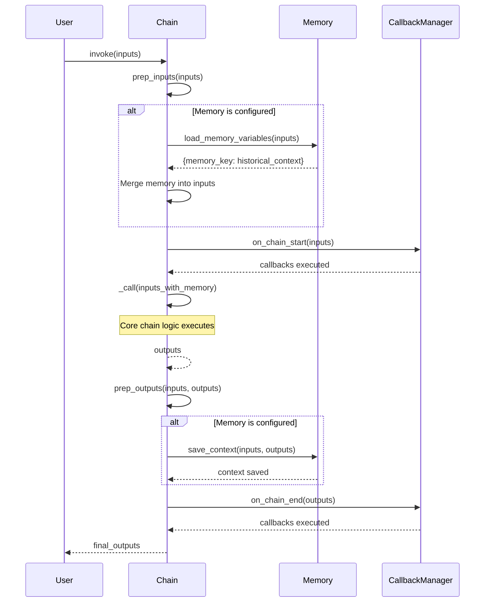
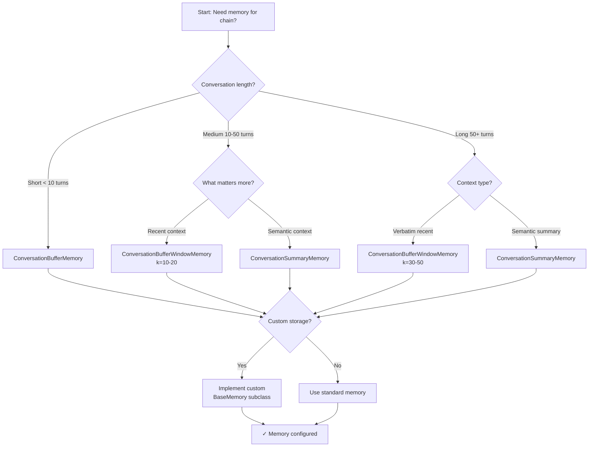

# Memory Integration Guide

## Introduction

Memory is a critical component in LangChain chains that enables **maintaining conversation context and state across multiple chain invocations**. Without memory, each chain execution is independent and has no knowledge of previous interactions. Memory implementations allow chains to "remember" past conversations, making them suitable for chatbots, conversational agents, and any application requiring contextual awareness.

**Purpose of Memory**: Memory provides chains with the ability to:
- Store and retrieve conversation history across multiple turns
- Maintain contextual awareness for coherent multi-turn interactions
- Load relevant historical context before chain execution
- Save new conversation turns after chain completion

Source: `libs/langchain/langchain_classic/base_memory.py:1-6,27-36`

!!! warning "Deprecation Notice"
    All memory classes discussed in this guide are deprecated since version 0.3.1 and will be removed in version 1.0.0. For new applications, please use the modern patterns described in the [migration guide](https://python.langchain.com/docs/versions/migrating_memory/).
    
    These legacy abstractions were created before chat models had native tool calling capabilities and **do NOT support native tool calling**. The modern approach uses `RunnableWithMessageHistory` for LCEL chains.
    
    Source: `libs/langchain/langchain_classic/memory/buffer.py:13-19`

---

## BaseMemory Interface

All memory implementations in LangChain extend the `BaseMemory` abstract base class, which defines the core contract for memory integration with chains.

### Core Abstract Methods

#### `memory_variables` Property

```python
@property
@abstractmethod
def memory_variables(self) -> list[str]:
    """The string keys this memory class will add to chain inputs."""
```

**Description**: Returns a list of variable names that this memory implementation will inject into chain inputs. These keys are used by chains to identify which input parameters come from memory.

**Common Values**: `["history"]`, `["chat_history"]`, `["context"]`

Source: `libs/langchain/langchain_classic/base_memory.py:63-66`

#### `load_memory_variables()` Method

```python
@abstractmethod
def load_memory_variables(self, inputs: dict[str, Any]) -> dict[str, Any]:
    """Return key-value pairs given the text input to the chain.
    
    Args:
        inputs: The inputs to the chain.
    
    Returns:
        A dictionary of key-value pairs.
    """
```

**Description**: Called at the beginning of chain execution (during `prep_inputs` phase) to retrieve stored memory variables. The returned dictionary is merged with the chain's input dictionary, making historical context available to the chain logic.

**Execution Timing**: Invoked in `Chain.prep_inputs()` before `Chain._call()` executes

Source: `libs/langchain/langchain_classic/base_memory.py:68-77`

#### `save_context()` Method

```python
@abstractmethod
def save_context(self, inputs: dict[str, Any], outputs: dict[str, str]) -> None:
    """Save the context of this chain run to memory.
    
    Args:
        inputs: The inputs to the chain.
        outputs: The outputs of the chain.
    """
```

**Description**: Called at the end of chain execution (during `prep_outputs` phase) to store the current conversation turn in memory. This method receives both the input that was sent to the chain and the output that was generated, allowing the memory to store the complete interaction.

**Execution Timing**: Invoked in `Chain.prep_outputs()` after `Chain._call()` completes

Source: `libs/langchain/langchain_classic/base_memory.py:90-97`

#### `clear()` Method

```python
@abstractmethod
def clear(self) -> None:
    """Clear memory contents."""
```

**Description**: Resets the memory to its initial empty state, removing all stored conversation history.

Source: `libs/langchain/langchain_classic/base_memory.py:110-112`

### Async Variants

The `BaseMemory` class also defines async versions of the core methods:

- `aload_memory_variables()`: Async variant of `load_memory_variables()`
- `asave_context()`: Async variant of `save_context()`
- `aclear()`: Async variant of `clear()`

By default, these async methods delegate to their synchronous counterparts using `run_in_executor()`, but implementations can override them for true async behavior.

Source: `libs/langchain/langchain_classic/base_memory.py:79-116`

---

## Memory Types

LangChain provides three primary memory implementations, each optimized for different use cases and conversation lengths.

### ConversationBufferMemory

`ConversationBufferMemory` stores the **complete conversation history** without any truncation or summarization. It maintains every message from the conversation and returns all messages when loaded by a chain.

**Use Cases:**
- Short conversations (typically < 10 exchanges)
- Applications where full historical context is required
- Debugging and development scenarios
- When model context limits are not a concern

**Configuration Parameters:**

| Parameter | Type | Default | Description |
|-----------|------|---------|-------------|
| `memory_key` | `str` | `"history"` | Key name used to store memory in chain inputs |
| `return_messages` | `bool` | `False` | If `True`, returns list of `BaseMessage` objects; if `False`, returns formatted string |
| `human_prefix` | `str` | `"Human"` | Prefix for human messages in string formatting |
| `ai_prefix` | `str` | `"AI"` | Prefix for AI messages in string formatting |

Source: `libs/langchain/langchain_classic/memory/buffer.py:21-33`

**Example Usage:**

```python
from langchain_classic.chains import LLMChain
from langchain_classic.memory import ConversationBufferMemory
from langchain_classic.prompts import PromptTemplate
from langchain_openai import ChatOpenAI

# Initialize memory with default settings
memory = ConversationBufferMemory(
    memory_key="history",
    return_messages=False  # Returns string format
)

# Create a simple conversational chain
template = """You are a helpful assistant. Use the conversation history to provide context-aware responses.

Conversation history:
{history}

Current question: {question}

Answer:"""

prompt = PromptTemplate(input_variables=["history", "question"], template=template)
llm = ChatOpenAI(temperature=0)
chain = LLMChain(llm=llm, prompt=prompt, memory=memory)

# First conversation turn
response1 = chain.invoke({"question": "What is the capital of France?"})
print(response1)  # Output includes answer about Paris

# Second conversation turn - memory provides context
response2 = chain.invoke({"question": "What is the population of that city?"})
print(response2)  # Output references Paris from conversation history

# View current memory buffer
print(memory.buffer)  # Shows complete formatted conversation
```

**Memory Behavior**: Each call to `chain.invoke()` triggers:
1. `memory.load_memory_variables()` before execution (loads all previous messages)
2. Chain executes with historical context available
3. `memory.save_context()` after execution (stores the new turn)

Source: `libs/langchain/langchain_classic/memory/buffer.py:83-92`

**Context Window Considerations**: ConversationBufferMemory stores **unlimited history**, which can exceed model context windows in long conversations. Monitor conversation length and switch to `ConversationBufferWindowMemory` or `ConversationSummaryMemory` for longer interactions.

---

### ConversationBufferWindowMemory

`ConversationBufferWindowMemory` keeps track of the **last k turns** of a conversation, automatically discarding older messages when the conversation exceeds the specified window size. This provides a fixed-size memory footprint suitable for longer conversations.

**Use Cases:**
- Long conversations with bounded memory requirements
- Applications where recent context is more important than distant history
- Memory-constrained environments
- Cost-sensitive applications (limiting tokens sent to model)

**Configuration Parameters:**

| Parameter | Type | Default | Description |
|-----------|------|---------|-------------|
| `k` | `int` | `5` | Number of conversation turns to keep in the buffer |
| `memory_key` | `str` | `"history"` | Key name used to store memory in chain inputs |
| `return_messages` | `bool` | `False` | If `True`, returns list of `BaseMessage` objects; if `False`, returns formatted string |
| `human_prefix` | `str` | `"Human"` | Prefix for human messages in string formatting |
| `ai_prefix` | `str` | `"AI"` | Prefix for AI messages in string formatting |

Source: `libs/langchain/langchain_classic/memory/buffer_window.py:18-29`

**Window Size Calculation**: The parameter `k` represents the number of **conversation turns** (question-answer pairs). Each turn consists of **2 messages** (one human message and one AI message), so `k=5` stores **10 total messages**: 5 human + 5 AI.

Source: `libs/langchain/langchain_classic/memory/buffer_window.py:39-49`

**Example Usage:**

```python
from langchain_classic.memory import ConversationBufferWindowMemory

# Keep only the last 3 conversation turns (6 messages total)
memory = ConversationBufferWindowMemory(
    k=3,
    memory_key="history",
    return_messages=False
)

# Simulate multiple conversation turns
for i in range(10):
    chain.invoke({"question": f"Question {i}"})

# Memory only contains last 3 turns, oldest 7 turns discarded
print(f"Messages in memory: {len(memory.buffer_as_messages)}")  # Output: 6
```

**Memory Management**: Old messages are automatically dropped when new messages are added:
- Turn 1-3: All stored
- Turn 4 added: Turn 1 dropped
- Turn 5 added: Turn 2 dropped
- Pattern continues maintaining window of k turns

**Choosing Window Size (`k`)**: 

- **k=1-3**: Very limited context, suitable for simple Q&A
- **k=5-10**: Moderate context, good for most conversational applications
- **k=20+**: Extensive context, approaching full buffer behavior

**Token Implications**: Estimate total tokens as `k * (avg_tokens_per_turn) * 2`. For k=5 with 50 tokens per message: 5 * 50 * 2 = 500 tokens of context.

---

### ConversationSummaryMemory

`ConversationSummaryMemory` uses an LLM to create **progressive summaries** of the conversation rather than storing verbatim message history. After each turn, the memory generates or updates a summary of the conversation, providing semantic context in a compact form.

**Use Cases:**
- Very long conversations (100+ turns)
- Applications requiring semantic context over verbatim history
- Token cost optimization for expensive models
- Conversations where specific phrasing is less important than semantic content

**Configuration Parameters:**

| Parameter | Type | Default | Description |
|-----------|------|---------|-------------|
| `llm` | `BaseLanguageModel` | **Required** | The language model used for generating summaries |
| `memory_key` | `str` | `"history"` | Key name used to store memory in chain inputs |
| `return_messages` | `bool` | `False` | If `True`, returns `SystemMessage` with summary; if `False`, returns summary string |
| `human_prefix` | `str` | `"Human"` | Prefix for human messages when generating summaries |
| `ai_prefix` | `str` | `"AI"` | Prefix for AI messages when generating summaries |
| `prompt` | `BasePromptTemplate` | `SUMMARY_PROMPT` | Custom prompt template for summarization |

Source: `libs/langchain/langchain_classic/memory/summary.py:91-100`

**Summarization Process**: After each conversation turn:
1. Memory loads the last 2 messages (current turn)
2. Calls `predict_new_summary(messages, existing_summary)` to generate updated summary
3. Stores the new summary, discarding the verbatim messages

Source: `libs/langchain/langchain_classic/memory/summary.py:160-166`

**Example Usage:**

```python
from langchain_classic.memory import ConversationSummaryMemory
from langchain_openai import ChatOpenAI

# Initialize memory with LLM for summarization
summary_llm = ChatOpenAI(temperature=0, model="gpt-3.5-turbo")
memory = ConversationSummaryMemory(
    llm=summary_llm,
    memory_key="history",
    return_messages=False
)

# Use with chain
chain = LLMChain(llm=llm, prompt=prompt, memory=memory)

# After multiple turns, memory contains compact summary
for i in range(50):
    chain.invoke({"question": f"Tell me about topic {i}"})

# View the summary (much shorter than 50 verbatim turns)
print(memory.buffer)  # Output: Summary of conversation topics
```

**Trade-offs**:

| Aspect | ConversationBufferMemory | ConversationSummaryMemory |
|--------|-------------------------|---------------------------|
| **Storage** | Complete verbatim history | Compact summary only |
| **Context Fidelity** | Exact previous messages | Semantic content only |
| **Token Cost** | High (linear growth) | Low (bounded by summary length) |
| **LLM Overhead** | None | Summarization call each turn |
| **Latency** | Fast (no extra LLM calls) | Slower (extra summarization) |

**Cost Consideration**: Summarization requires an additional LLM call per turn. Use less expensive models for summarization (e.g., GPT-3.5-turbo for summaries, GPT-4 for main chain).

---

## Memory Lifecycle in Chains

Understanding how memory integrates with chain execution is crucial for effective usage and debugging. The Chain base class orchestrates memory loading and saving at specific points in the execution lifecycle.

### Complete Execution Flow



### 1. Memory Loading Phase (`prep_inputs`)

**Location**: `libs/langchain/langchain_classic/chains/base.py:521-543`

**Code Flow**:
```python
def prep_inputs(self, inputs: dict[str, Any] | Any) -> dict[str, str]:
    """Prepare chain inputs, including adding inputs from memory."""
    # Convert non-dict inputs to dict
    if not isinstance(inputs, dict):
        _input_keys = set(self.input_keys)
        if self.memory is not None:
            _input_keys = _input_keys.difference(self.memory.memory_variables)
        inputs = {next(iter(_input_keys)): inputs}
    
    # Load memory variables and merge with inputs
    if self.memory is not None:
        external_context = self.memory.load_memory_variables(inputs)
        inputs = dict(inputs, **external_context)
    
    return inputs
```

**Key Points**:
- Called **before** `_call()` executes
- Loads historical context from memory
- Merges memory variables into input dictionary
- Memory keys (e.g., "history") become available to prompts

**Debug Tip**: Print `inputs` after `prep_inputs()` to verify memory loading

---

### 2. Chain Execution Phase (`_call`)

**Location**: Chain subclasses implement `_call()` method

**Memory Availability**: At this point, the `inputs` dictionary contains:
- Original user inputs (e.g., "question")
- Memory variables (e.g., "history" with conversation context)

**Example Input Dictionary**:
```python
{
    "question": "What is the capital of Spain?",
    "history": "Human: What is the capital of France?\nAI: The capital of France is Paris."
}
```

---

### 3. Memory Saving Phase (`prep_outputs`)

**Location**: `libs/langchain/langchain_classic/chains/base.py:471-494`

**Code Flow**:
```python
def prep_outputs(
    self,
    inputs: dict[str, str],
    outputs: dict[str, str],
    return_only_outputs: bool = False,
) -> dict[str, str]:
    """Validate and prepare chain outputs, and save info about this run to memory."""
    self._validate_outputs(outputs)
    
    # Save conversation turn to memory
    if self.memory is not None:
        self.memory.save_context(inputs, outputs)
    
    if return_only_outputs:
        return outputs
    return {**inputs, **outputs}
```

**Key Points**:
- Called **after** `_call()` completes successfully
- Saves both inputs and outputs to memory
- Memory stores the complete conversation turn
- Not called if `_call()` raises an exception

**Important**: If chain execution fails, `save_context()` is **not called**, preventing partial/failed turns from polluting conversation history.

---

## State Management Patterns

###  Memory Initialization

**Single-User Applications**:
```python
from langchain_classic.memory import ConversationBufferMemory

# Create memory instance once
memory = ConversationBufferMemory()

# Use the same memory instance for all chain calls
chain = LLMChain(llm=llm, prompt=prompt, memory=memory)

# Conversation context persists across invocations
chain.invoke({"question": "Hello"})
chain.invoke({"question": "How are you?"})  # Has context from previous call
```

**Multi-User Applications**:
```python
# Store separate memory instances per user session
user_memories = {}

def get_chain_for_user(user_id: str):
    """Get or create a chain with user-specific memory."""
    if user_id not in user_memories:
        user_memories[user_id] = ConversationBufferMemory()
    
    return LLMChain(
        llm=llm,
        prompt=prompt,
        memory=user_memories[user_id]
    )

# Each user has independent conversation history
chain_user_a = get_chain_for_user("user_a")
chain_user_b = get_chain_for_user("user_b")

chain_user_a.invoke({"question": "My name is Alice"})
chain_user_b.invoke({"question": "My name is Bob"})

# Memories are isolated
chain_user_a.invoke({"question": "What is my name?"})  # Knows Alice
chain_user_b.invoke({"question": "What is my name?"})  # Knows Bob
```

### Memory Persistence

**In-Memory Storage** (default behavior):
- Memory contents stored in Python object
- Lost when process terminates
- Suitable for: Development, testing, short-lived sessions

**Database Persistence** (custom implementation):
```python
from langchain_classic.base_memory import BaseMemory
from typing import Any
import redis
import json

class RedisConversationMemory(BaseMemory):
    """Custom memory implementation with Redis persistence."""
    
    def __init__(self, session_id: str, redis_client):
        self.session_id = session_id
        self.redis = redis_client
        self._memory_key = "history"
    
    @property
    def memory_variables(self) -> list[str]:
        return [self._memory_key]
    
    def load_memory_variables(self, inputs: dict[str, Any]) -> dict[str, Any]:
        """Load conversation history from Redis."""
        history = self.redis.get(f"conversation:{self.session_id}")
        if history:
            return {self._memory_key: history.decode('utf-8')}
        return {self._memory_key: ""}
    
    def save_context(self, inputs: dict[str, Any], outputs: dict[str, str]) -> None:
        """Save conversation turn to Redis."""
        history = self.redis.get(f"conversation:{self.session_id}")
        history = history.decode('utf-8') if history else ""
        
        # Append new turn
        new_turn = f"\nHuman: {inputs.get('question', '')}\nAI: {outputs.get('answer', '')}"
        updated_history = history + new_turn
        
        # Save with expiration (e.g., 24 hours)
        self.redis.setex(
            f"conversation:{self.session_id}",
            86400,  # 24 hours in seconds
            updated_history
        )
    
    def clear(self) -> None:
        """Clear conversation history from Redis."""
        self.redis.delete(f"conversation:{self.session_id}")

# Usage
redis_client = redis.Redis(host='localhost', port=6379, db=0)
memory = RedisConversationMemory(session_id="user_123", redis_client=redis_client)
chain = LLMChain(llm=llm, prompt=prompt, memory=memory)
```

### Memory Cleanup

**Session Termination**:
```python
# Clear memory when conversation ends
memory.clear()

# For multi-user systems, remove from cache
if user_id in user_memories:
    user_memories[user_id].clear()
    del user_memories[user_id]
```

**Periodic Cleanup** (prevent memory leaks):
```python
import time

# Track last access time
last_access = {}

def cleanup_inactive_memories(timeout_seconds=3600):
    """Remove memories inactive for more than timeout_seconds."""
    current_time = time.time()
    to_remove = []
    
    for user_id, last_time in last_access.items():
        if current_time - last_time > timeout_seconds:
            to_remove.append(user_id)
    
    for user_id in to_remove:
        if user_id in user_memories:
            user_memories[user_id].clear()
            del user_memories[user_id]
            del last_access[user_id]

# Call periodically (e.g., every 10 minutes)
cleanup_inactive_memories()
```

---

## Context Window Considerations

### Understanding Context Limits

Different models have different context window sizes (maximum total tokens including prompt + completion):

| Model | Context Window | Typical Reserve | Available for History |
|-------|----------------|-----------------|----------------------|
| GPT-3.5-turbo | 4,096 tokens | ~1,000 tokens | ~3,000 tokens |
| GPT-4 | 8,192 tokens | ~1,500 tokens | ~6,500 tokens |
| GPT-4-32k | 32,768 tokens | ~5,000 tokens | ~27,000 tokens |
| GPT-4-turbo | 128,000 tokens | ~10,000 tokens | ~118,000 tokens |
| Claude 2 | 100,000 tokens | ~10,000 tokens | ~90,000 tokens |

**Reserve Tokens**: Account for system prompt, user question, response generation space

### Context Overflow Symptoms

**Common Error Messages**:
```
OpenAI API Error: This model's maximum context length is 4096 tokens. 
However, you requested 5200 tokens (4800 in the messages, 400 in the completion).
```

**Symptoms**:
- Chain execution failures with token limit errors
- Truncated responses
- Model confusion due to incomplete context
- Increased API costs before failure

### Mitigation Strategies

#### Strategy 1: Use Window Memory

```python
# Switch from unlimited buffer to windowed buffer
memory = ConversationBufferWindowMemory(
    k=10,  # Keep only last 10 turns
    memory_key="history"
)
```

**Calculation**: For k=10, approximately 20 messages * ~50 tokens/message = ~1,000 tokens

#### Strategy 2: Use Summary Memory

```python
# Use LLM to compress history into summary
memory = ConversationSummaryMemory(
    llm=ChatOpenAI(temperature=0, model="gpt-3.5-turbo"),
    memory_key="history"
)
```

**Typical Savings**: 10:1 compression ratio (1,000 tokens of history → 100 token summary)

#### Strategy 3: Manual Token Counting

```python
import tiktoken

def count_tokens(text: str, model: str = "gpt-3.5-turbo") -> int:
    """Count tokens in text for given model."""
    encoding = tiktoken.encoding_for_model(model)
    return len(encoding.encode(text))

# Check memory size before chain invocation
history_text = memory.buffer_as_str
history_tokens = count_tokens(history_text)

if history_tokens > 3000:  # Threshold for GPT-3.5-turbo
    # Option 1: Switch to smaller window
    memory = ConversationBufferWindowMemory(k=5)
    
    # Option 2: Clear old history
    memory.clear()
    
    # Option 3: Switch to summary memory
    memory = ConversationSummaryMemory(llm=summary_llm)
```

#### Strategy 4: Custom Truncation

```python
from langchain_classic.base_memory import BaseMemory

class TruncatedBufferMemory(ConversationBufferMemory):
    """Buffer memory with automatic token-based truncation."""
    
    def __init__(self, max_tokens: int = 3000, **kwargs):
        super().__init__(**kwargs)
        self.max_tokens = max_tokens
    
    def load_memory_variables(self, inputs: dict[str, Any]) -> dict[str, Any]:
        """Load memory with automatic truncation to token limit."""
        messages = self.chat_memory.messages
        
        # Count tokens from most recent to oldest
        tokens = 0
        included_messages = []
        
        for message in reversed(messages):
            message_tokens = count_tokens(message.content)
            if tokens + message_tokens > self.max_tokens:
                break
            included_messages.insert(0, message)
            tokens += message_tokens
        
        # Format included messages
        if self.return_messages:
            return {self.memory_key: included_messages}
        else:
            return {self.memory_key: self._buffer_as_str(included_messages)}
```

---

## Integration Patterns

### Legacy Chain Integration (Deprecated)

**Direct Memory Parameter**:
```python
from langchain_classic.chains import LLMChain
from langchain_classic.memory import ConversationBufferMemory

memory = ConversationBufferMemory(memory_key="chat_history")

chain = LLMChain(
    llm=llm,
    prompt=prompt,
    memory=memory  # Memory passed at chain construction
)

# Memory automatically integrates with invoke()
result = chain.invoke({"question": "Hello"})
```

Source: `libs/langchain/langchain_classic/chains/base.py:75-81`

### Modern LCEL with RunnableWithMessageHistory

!!! info "Recommended Approach"
    For new applications, use `RunnableWithMessageHistory` with LCEL chains instead of legacy memory classes.

**LCEL Memory Pattern**:
```python
from langchain_core.chat_history import BaseChatMessageHistory
from langchain_core.runnables.history import RunnableWithMessageHistory
from langchain_core.prompts import ChatPromptTemplate, MessagesPlaceholder
from langchain_openai import ChatOpenAI

# Define prompt with message placeholder
prompt = ChatPromptTemplate.from_messages([
    ("system", "You are a helpful assistant."),
    MessagesPlaceholder(variable_name="history"),
    ("human", "{question}")
])

# Create chain
chain = prompt | ChatOpenAI()

# Define session store
store = {}

def get_session_history(session_id: str) -> BaseChatMessageHistory:
    """Get or create chat history for session."""
    from langchain_core.chat_history import InMemoryChatMessageHistory
    
    if session_id not in store:
        store[session_id] = InMemoryChatMessageHistory()
    return store[session_id]

# Wrap chain with message history
chain_with_history = RunnableWithMessageHistory(
    chain,
    get_session_history,
    input_messages_key="question",
    history_messages_key="history"
)

# Use with session ID
response = chain_with_history.invoke(
    {"question": "What is my name?"},
    config={"configurable": {"session_id": "user_123"}}
)
```

**Advantages of LCEL Approach**:
- Native support for chat models with tool calling
- Better type safety and composition
- Async support out of the box
- More flexible session management
- Active development and support

**Migration Guide**: See [https://python.langchain.com/docs/versions/migrating_memory/](https://python.langchain.com/docs/versions/migrating_memory/)

---

## Choosing the Right Memory Type

Use this decision flowchart to select the appropriate memory implementation:



### Selection Criteria

| Criterion | Buffer | Window | Summary |
|-----------|--------|--------|---------|
| **Best for conversation length** | < 10 turns | 10-50 turns | 50+ turns |
| **Memory footprint** | O(n) unbounded | O(k) fixed | O(1) constant |
| **Context fidelity** | Perfect | Recent perfect | Semantic only |
| **Token cost** | High (grows linear) | Medium (bounded) | Low (fixed summary) |
| **Latency** | Low | Low | High (summarization) |
| **LLM calls per turn** | 1 (main) | 1 (main) | 2 (main + summary) |
| **Implementation complexity** | Simple | Simple | Moderate |

---

## Troubleshooting

### Memory Not Loading

**Symptom**: Chain executes without historical context, behaves as if memory is empty

**Common Causes**:

1. **Memory not passed to chain constructor**:
   ```python
   # Wrong - memory not provided
   chain = LLMChain(llm=llm, prompt=prompt)
   
   # Correct
   chain = LLMChain(llm=llm, prompt=prompt, memory=memory)
   ```

2. **memory_key mismatch with prompt template**:
   ```python
   # Memory uses key "history"
   memory = ConversationBufferMemory(memory_key="history")
   
   # But prompt expects "chat_history"
   template = "Context: {chat_history}\nQuestion: {question}"
   
   # Solution: Match the keys
   memory = ConversationBufferMemory(memory_key="chat_history")
   ```

3. **Input key conflicts**:
   ```python
   # If you manually provide a key that memory uses
   chain.invoke({"question": "Hi", "history": "manual history"})
   
   # Memory's history gets overwritten by manual value
   # Solution: Don't provide memory keys in inputs
   ```

**Debugging Steps**:
```python
# 1. Verify memory is attached
print(f"Chain has memory: {chain.memory is not None}")

# 2. Check memory variables
print(f"Memory variables: {chain.memory.memory_variables}")

# 3. Manually load memory
loaded = chain.memory.load_memory_variables({})
print(f"Loaded memory: {loaded}")

# 4. Verify prompt template expects memory key
print(f"Prompt variables: {chain.prompt.input_variables}")
```

### Memory Not Saving

**Symptom**: Conversation history doesn't accumulate across chain invocations

**Common Causes**:

1. **Chain execution fails before save_context**:
   ```python
   try:
       chain.invoke({"question": "..."})
   except Exception as e:
       # If exception occurs in _call(), save_context never called
       print("Chain failed, memory not saved")
   ```

2. **save_context() overridden incorrectly**:
   ```python
   # Custom memory with broken save_context
   class BrokenMemory(BaseMemory):
       def save_context(self, inputs, outputs):
           # BUG: Forgot to actually store the context
           pass  # Does nothing!
   ```

3. **output_key mismatch**:
   ```python
   # Chain outputs {"answer": "..."}
   # But memory expects {"output": "..."}
   
   # Some memory implementations allow configuring output_key
   memory = ConversationStringBufferMemory(output_key="answer")
   ```

**Debugging Steps**:
```python
# 1. Check if memory is being called
class DebugMemory(ConversationBufferMemory):
    def save_context(self, inputs, outputs):
        print(f"save_context called with inputs={inputs}, outputs={outputs}")
        super().save_context(inputs, outputs)

memory = DebugMemory()

# 2. Verify chain completes successfully
result = chain.invoke({"question": "Test"})
print(f"Chain completed: {result}")

# 3. Check memory contents after
print(f"Memory after invoke: {memory.buffer}")
```

### Context Overflow

**Symptom**: Chain fails with token limit errors or produces truncated/confused responses

**Error Example**:
```
openai.BadRequestError: Error code: 400 - {'error': {'message': 
"This model's maximum context length is 4096 tokens. However, you requested 
5200 tokens (4800 in the messages, 400 in the completion).", 'type': 
'invalid_request_error'}}
```

**Solutions**:

1. **Switch to Window Memory** (immediate fix):
   ```python
   # Replace unlimited buffer with windowed buffer
   memory = ConversationBufferWindowMemory(k=5)
   ```

2. **Switch to Summary Memory** (for long conversations):
   ```python
   # Compress history semantically
   memory = ConversationSummaryMemory(
       llm=ChatOpenAI(model="gpt-3.5-turbo", temperature=0)
   )
   ```

3. **Implement Token Monitoring** (proactive):
   ```python
   def invoke_with_monitoring(chain, inputs):
       """Invoke chain with token count monitoring."""
       history = chain.memory.buffer_as_str
       tokens = count_tokens(history)
       
       print(f"Memory using {tokens} tokens")
       
       if tokens > 3000:  # Warning threshold
           print("WARNING: Approaching context limit")
       
       return chain.invoke(inputs)
   ```

4. **Periodic Memory Pruning**:
   ```python
   # Clear memory periodically for long sessions
   turn_count = 0
   
   for question in questions:
       result = chain.invoke({"question": question})
       turn_count += 1
       
       # Reset every 20 turns to prevent overflow
       if turn_count >= 20:
           chain.memory.clear()
           turn_count = 0
           print("Memory cleared to prevent overflow")
   ```

### Memory Leaking Across Users

**Symptom**: Different users see each other's conversation history

**Common Causes**:

1. **Shared memory instance across users**:
   ```python
   # WRONG - All users share same memory
   global_memory = ConversationBufferMemory()
   
   def handle_request(user_id, question):
       chain = LLMChain(llm=llm, prompt=prompt, memory=global_memory)
       return chain.invoke({"question": question})
   ```

2. **Incorrect session management**:
   ```python
   # WRONG - user_id not used to isolate memory
   memories = {}
   
   def get_chain(user_id):
       if "shared_key" not in memories:  # BUG: always same key
           memories["shared_key"] = ConversationBufferMemory()
       return LLMChain(llm=llm, prompt=prompt, memory=memories["shared_key"])
   ```

**Solution - Proper Session Isolation**:
```python
# Correct approach with per-user memory
user_memories = {}

def get_chain_for_user(user_id: str):
    """Get or create chain with user-specific memory."""
    if user_id not in user_memories:
        user_memories[user_id] = ConversationBufferMemory()
        print(f"Created new memory for user: {user_id}")
    
    return LLMChain(
        llm=llm,
        prompt=prompt,
        memory=user_memories[user_id]
    )

# Usage
chain_a = get_chain_for_user("user_123")
chain_b = get_chain_for_user("user_456")

# Memories are completely isolated
chain_a.invoke({"question": "My name is Alice"})
chain_b.invoke({"question": "My name is Bob"})

# Each chain only knows its own user
chain_a.invoke({"question": "What is my name?"})  # "Alice"
chain_b.invoke({"question": "What is my name?"})  # "Bob"
```

**For LCEL Chains**:
```python
# Use RunnableWithMessageHistory with session IDs
chain_with_history = RunnableWithMessageHistory(
    chain,
    get_session_history,  # Function that isolates by session_id
    input_messages_key="question",
    history_messages_key="history"
)

# Pass unique session ID per user
response_a = chain_with_history.invoke(
    {"question": "Hi"},
    config={"configurable": {"session_id": "user_123"}}
)

response_b = chain_with_history.invoke(
    {"question": "Hi"},
    config={"configurable": {"session_id": "user_456"}}
)
```

### Memory Performance Issues

**Symptom**: Chain execution becomes progressively slower as conversation lengthens

**Causes and Solutions**:

1. **Linear growth in token processing**:
   - **Problem**: Buffer memory grows unbounded, each turn processes more tokens
   - **Solution**: Use `ConversationBufferWindowMemory` with fixed window

2. **Summarization overhead**:
   - **Problem**: `ConversationSummaryMemory` calls LLM every turn
   - **Solution**: Use cheaper model for summarization (GPT-3.5-turbo instead of GPT-4)
   
   ```python
   # Use fast, cheap model for summaries
   summary_llm = ChatOpenAI(
       model="gpt-3.5-turbo",
       temperature=0,
       request_timeout=10  # Fast timeout for summaries
   )
   
   memory = ConversationSummaryMemory(llm=summary_llm)
   ```

3. **Database query latency** (custom memory):
   - **Problem**: Loading/saving from database adds latency
   - **Solution**: Implement caching layer
   
   ```python
   class CachedRedisMemory(BaseMemory):
       def __init__(self, session_id, redis_client):
           self.session_id = session_id
           self.redis = redis_client
           self._cache = None  # In-memory cache
           self._cache_dirty = False
       
       def load_memory_variables(self, inputs):
           if self._cache is None:
               # Load from Redis only on first access
               self._cache = self.redis.get(f"conv:{self.session_id}")
           return {"history": self._cache or ""}
       
       def save_context(self, inputs, outputs):
           # Update cache immediately
           self._cache = self._cache + f"\n{inputs}\n{outputs}"
           self._cache_dirty = True
           
           # Async write to Redis (implement with background task)
           self._schedule_redis_write()
   ```

---

## Configuration Best Practices

### Memory Key Naming

**Convention**: Use descriptive, consistent names for `memory_key`

```python
# Good - Clear and descriptive
memory = ConversationBufferMemory(memory_key="chat_history")
memory = ConversationBufferMemory(memory_key="conversation_context")
memory = ConversationBufferMemory(memory_key="history")

# Avoid - Ambiguous or conflicting with common input keys
memory = ConversationBufferMemory(memory_key="input")  # Conflicts with typical input
memory = ConversationBufferMemory(memory_key="data")   # Too generic
```

### Return Format Configuration

**Choose format based on chain requirements**:

```python
# For string-based chains (legacy LLMChain with string prompts)
memory = ConversationBufferMemory(
    return_messages=False,  # Returns formatted string
    human_prefix="User",
    ai_prefix="Assistant"
)

# For chat model chains (modern approach with message objects)
memory = ConversationBufferMemory(
    return_messages=True  # Returns list of BaseMessage objects
)
```

**When to use each**:
- `return_messages=False`: Legacy chains with `PromptTemplate` expecting string input
- `return_messages=True`: Modern chains with `ChatPromptTemplate` expecting message lists

### Prompt Template Design

**Ensure prompt templates include memory placeholder**:

```python
# String-based prompt
template = """You are a helpful assistant.

Conversation history:
{chat_history}

Current question: {question}
Answer:"""

prompt = PromptTemplate(
    input_variables=["chat_history", "question"],
    template=template
)

memory = ConversationBufferMemory(
    memory_key="chat_history",  # Must match template variable
    return_messages=False
)
```

```python
# Message-based prompt (modern)
from langchain_core.prompts import ChatPromptTemplate, MessagesPlaceholder

prompt = ChatPromptTemplate.from_messages([
    ("system", "You are a helpful assistant."),
    MessagesPlaceholder(variable_name="chat_history"),
    ("human", "{question}")
])

memory = ConversationBufferMemory(
    memory_key="chat_history",  # Must match MessagesPlaceholder
    return_messages=True  # Must return message objects
)
```

---

## Complete Working Examples

### Example 1: Basic Question-Answering with Memory

```python
"""
Basic conversational QA chain with memory.
Demonstrates memory loading and saving across multiple turns.
"""
from langchain_classic.chains import LLMChain
from langchain_classic.memory import ConversationBufferMemory
from langchain_classic.prompts import PromptTemplate
from langchain_openai import ChatOpenAI

# Initialize LLM
llm = ChatOpenAI(
    model="gpt-3.5-turbo",
    temperature=0.7
)

# Create memory
memory = ConversationBufferMemory(
    memory_key="history",
    return_messages=False
)

# Define prompt template
template = """You are a friendly assistant. Use the conversation history to provide context-aware responses.

Conversation history:
{history}

Current question: {question}

Answer:"""

prompt = PromptTemplate(
    input_variables=["history", "question"],
    template=template
)

# Create chain with memory
chain = LLMChain(
    llm=llm,
    prompt=prompt,
    memory=memory,
    verbose=True
)

# Conversation turns
print("Turn 1:")
response1 = chain.invoke({"question": "My favorite color is blue. What's yours?"})
print(f"Assistant: {response1['text']}\n")

print("Turn 2:")
response2 = chain.invoke({"question": "What color did I say I liked?"})
print(f"Assistant: {response2['text']}\n")

print("Turn 3:")
response3 = chain.invoke({"question": "Can you suggest clothes in that color?"})
print(f"Assistant: {response3['text']}\n")

# View accumulated memory
print("Conversation History:")
print(memory.buffer)
```

**Expected Output**:
```
Turn 1:
Assistant: I appreciate all colors, but if I had to choose, I'd say I enjoy green...

Turn 2:
Assistant: You said your favorite color is blue!

Turn 3:
Assistant: Sure! For blue clothing, you could consider a navy blazer, light blue jeans...

Conversation History:
Human: My favorite color is blue. What's yours?
AI: I appreciate all colors, but if I had to choose, I'd say I enjoy green...
Human: What color did I say I liked?
AI: You said your favorite color is blue!
Human: Can you suggest clothes in that color?
AI: Sure! For blue clothing, you could consider a navy blazer, light blue jeans...
```

### Example 2: Window Memory for Long Conversations

```python
"""
Long conversation with windowed memory to prevent context overflow.
"""
from langchain_classic.memory import ConversationBufferWindowMemory
from langchain_classic.chains import LLMChain
from langchain_classic.prompts import PromptTemplate
from langchain_openai import ChatOpenAI

# Use window memory - keep only last 3 turns
memory = ConversationBufferWindowMemory(
    k=3,
    memory_key="recent_history",
    return_messages=False
)

# Simple prompt
template = """Assistant with short-term memory.

Recent conversation:
{recent_history}

Question: {question}
Answer:"""

prompt = PromptTemplate(
    input_variables=["recent_history", "question"],
    template=template
)

llm = ChatOpenAI(model="gpt-3.5-turbo", temperature=0)
chain = LLMChain(llm=llm, prompt=prompt, memory=memory)

# Simulate 10 turns
topics = [
    "My name is Alice",
    "I live in Paris",
    "I work as a teacher",
    "I have two cats",
    "I enjoy reading",
    "My favorite book is 1984",
    "I also like sci-fi movies",
    "Last movie I saw was Dune",
    "What is my name?",  # This was 8 turns ago - outside window!
    "What movie did I mention?"  # This was 1 turn ago - inside window!
]

for i, question in enumerate(topics, 1):
    print(f"\nTurn {i}: {question}")
    response = chain.invoke({"question": question})
    print(f"Response: {response['text']}")

# Check memory window
print(f"\nMessages in memory: {len(memory.buffer_as_messages)}")
print(f"Should be: {min(10, 3 * 2)} messages (k=3 means 6 messages max)")
```

**Expected Behavior**: 
- Turns 1-7: Assistant remembers all previous information
- Turn 9: Assistant **cannot** recall name (outside 3-turn window)
- Turn 10: Assistant **can** recall movie (within window)

### Example 3: LCEL Chain with Message History (Modern Approach)

```python
"""
Modern LCEL chain with RunnableWithMessageHistory.
Recommended for new applications.
"""
from langchain_core.chat_history import BaseChatMessageHistory, InMemoryChatMessageHistory
from langchain_core.prompts import ChatPromptTemplate, MessagesPlaceholder
from langchain_core.runnables.history import RunnableWithMessageHistory
from langchain_openai import ChatOpenAI

# Create prompt with message placeholder
prompt = ChatPromptTemplate.from_messages([
    ("system", "You are a helpful assistant. Answer based on conversation history."),
    MessagesPlaceholder(variable_name="history"),
    ("human", "{question}")
])

# Create chain
llm = ChatOpenAI(model="gpt-3.5-turbo", temperature=0)
chain = prompt | llm

# Session storage
store = {}

def get_session_history(session_id: str) -> BaseChatMessageHistory:
    """Get or create chat history for a session."""
    if session_id not in store:
        store[session_id] = InMemoryChatMessageHistory()
    return store[session_id]

# Wrap chain with history management
chain_with_history = RunnableWithMessageHistory(
    chain,
    get_session_history,
    input_messages_key="question",
    history_messages_key="history"
)

# Use with session IDs for multi-user support
session_config_alice = {"configurable": {"session_id": "alice_123"}}
session_config_bob = {"configurable": {"session_id": "bob_456"}}

# Alice's conversation
print("Alice's conversation:")
response1 = chain_with_history.invoke(
    {"question": "My favorite food is pizza"},
    config=session_config_alice
)
print(f"Assistant: {response1.content}\n")

response2 = chain_with_history.invoke(
    {"question": "What food do I like?"},
    config=session_config_alice
)
print(f"Assistant: {response2.content}\n")

# Bob's independent conversation
print("Bob's conversation:")
response3 = chain_with_history.invoke(
    {"question": "I prefer sushi"},
    config=session_config_bob
)
print(f"Assistant: {response3.content}\n")

response4 = chain_with_history.invoke(
    {"question": "What food do I like?"},
    config=session_config_bob
)
print(f"Assistant: {response4.content}\n")

# Verify isolation
print(f"Alice's history has {len(store['alice_123'].messages)} messages")
print(f"Bob's history has {len(store['bob_456'].messages)} messages")
```

---

## Migration Guide: Legacy to Modern Memory

For developers maintaining legacy code using deprecated memory classes, here's a migration path to modern LCEL patterns:

### Legacy Pattern (Deprecated)

```python
from langchain_classic.chains import LLMChain
from langchain_classic.memory import ConversationBufferMemory
from langchain_classic.prompts import PromptTemplate

memory = ConversationBufferMemory(memory_key="history")
prompt = PromptTemplate(
    input_variables=["history", "question"],
    template="History: {history}\nQuestion: {question}\nAnswer:"
)
chain = LLMChain(llm=llm, prompt=prompt, memory=memory)

response = chain.invoke({"question": "Hello"})
```

### Modern LCEL Pattern (Recommended)

```python
from langchain_core.prompts import ChatPromptTemplate, MessagesPlaceholder
from langchain_core.runnables.history import RunnableWithMessageHistory
from langchain_core.chat_history import InMemoryChatMessageHistory

# Create prompt with message placeholder
prompt = ChatPromptTemplate.from_messages([
    MessagesPlaceholder(variable_name="history"),
    ("human", "{question}")
])

# Create LCEL chain
chain = prompt | llm

# Setup history management
store = {}
def get_history(session_id: str):
    if session_id not in store:
        store[session_id] = InMemoryChatMessageHistory()
    return store[session_id]

# Wrap chain
chain_with_history = RunnableWithMessageHistory(
    chain,
    get_history,
    input_messages_key="question",
    history_messages_key="history"
)

# Use with session ID
response = chain_with_history.invoke(
    {"question": "Hello"},
    config={"configurable": {"session_id": "user_1"}}
)
```

**Key Differences**:
1. Memory is externalized from chain (session management via config)
2. Uses message-based history (not string formatting)
3. Session IDs passed at invocation time (more flexible)
4. Native support for async and streaming
5. Better type safety with LCEL composition

**Migration Resources**:
- Official Migration Guide: [https://python.langchain.com/docs/versions/migrating_memory/](https://python.langchain.com/docs/versions/migrating_memory/)
- LangGraph Memory Patterns: [https://langchain-ai.github.io/langgraph/how-tos/memory/](https://langchain-ai.github.io/langgraph/how-tos/memory/)

---

## Cross-References

### Related API Documentation

- [ConversationBufferMemory API Reference](../api-reference/memory/buffer-memory.md#conversationbuffermemory) - Complete API documentation with all methods and parameters
- [ConversationBufferWindowMemory API Reference](../api-reference/memory/buffer-memory.md#conversationbufferwindowmemory) - Window memory API details
- [BaseMemory Interface](../api-reference/memory/buffer-memory.md#basememory-interface) - Abstract base class documentation
- [Chain Base Class API](../api-reference/chains/base.md) - Chain execution lifecycle and memory integration points

### Related Guides

- [Chain Types Guide](chain-types.md) - Overview of different chain types and when to use each
- [LCEL Composition Guide](lcel-composition.md) - Modern chain composition with RunnableWithMessageHistory
- [Error Handling Guide](error-handling.md) - Retry strategies and fallback patterns for memory-related errors
- [Production Deployment Guide](production-deployment.md) - Best practices for memory in production environments

### Related Architecture Documentation

- [Chain Lifecycle Architecture](../architecture/chain-lifecycle.md) - Detailed lifecycle diagrams showing memory integration points
- [Message Flow Architecture](../architecture/message-flow.md) - Understanding message types and transformations

### Example Code

- [Basic Memory Example](../../examples/advanced_chains/memory_enabled_chain.py) - Executable example with ConversationBufferMemory
- [Window Memory Example](../../examples/advanced_chains/memory_enabled_chain.py) - Executable example with ConversationBufferWindowMemory
- [LCEL Message History Example](../../examples/advanced_chains/memory_enabled_chain.py) - Modern LCEL pattern with RunnableWithMessageHistory

### Glossary Terms

- [Memory](../glossary.md#memory) - Definition and key concepts
- [Chain](../glossary.md#chain) - Understanding chain execution
- [LCEL](../glossary.md#lcel) - LangChain Expression Language fundamentals
- [Runnable](../glossary.md#runnable) - Runnable protocol and composition

---

## Summary

This guide covered comprehensive memory integration patterns for LangChain chains:

**Key Takeaways**:

1. **Memory Types**: Choose based on conversation length and requirements
   - `ConversationBufferMemory`: Short conversations, full context needed
   - `ConversationBufferWindowMemory`: Medium conversations, recent context focus
   - `ConversationSummaryMemory`: Long conversations, semantic compression

2. **Memory Lifecycle**: Understand when memory loads and saves
   - Load: `prep_inputs()` before chain execution
   - Save: `prep_outputs()` after successful execution

3. **Context Management**: Monitor token usage to prevent overflow
   - Use window memory for bounded context
   - Implement token counting for proactive monitoring
   - Switch to summary memory for very long conversations

4. **Modern Patterns**: Migrate to LCEL with `RunnableWithMessageHistory`
   - Better session management
   - Native async and streaming support
   - Improved type safety

5. **Multi-User Applications**: Implement proper session isolation
   - Use unique memory instances per user
   - Implement periodic cleanup to prevent memory leaks
   - Consider persistent storage (Redis, database) for production

**Next Steps**:
- Review [API Reference](../api-reference/memory/buffer-memory.md) for complete method signatures
- Explore [Example Code](../../examples/advanced_chains/memory_enabled_chain.py) for working implementations
- Consult [Migration Guide](https://python.langchain.com/docs/versions/migrating_memory/) for modernizing legacy code
- Study [Production Deployment Guide](production-deployment.md) for operational best practices