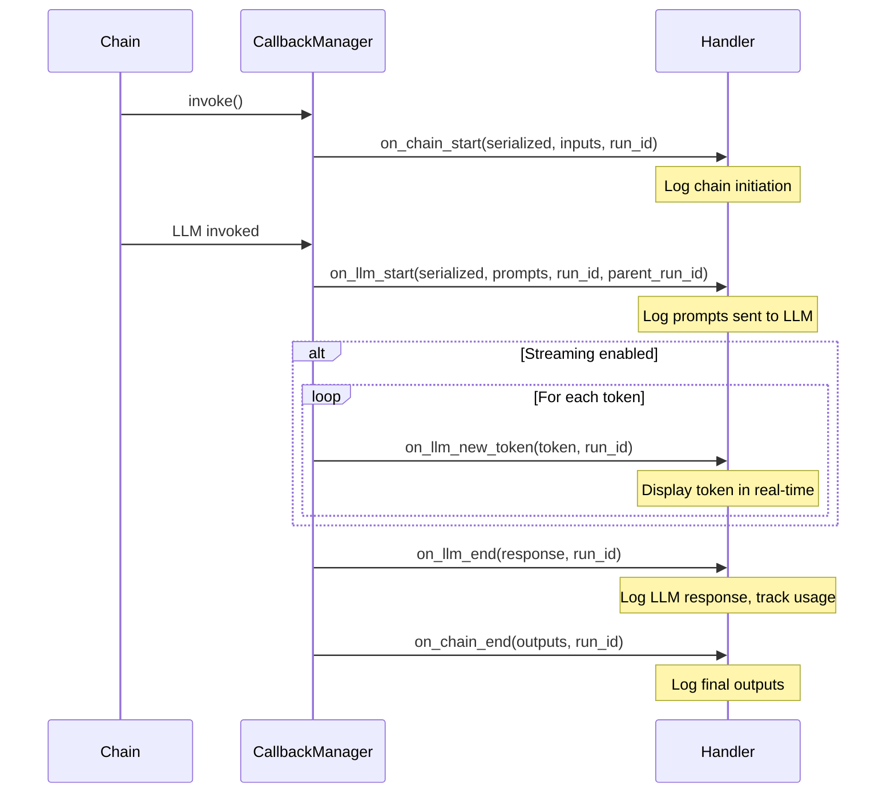
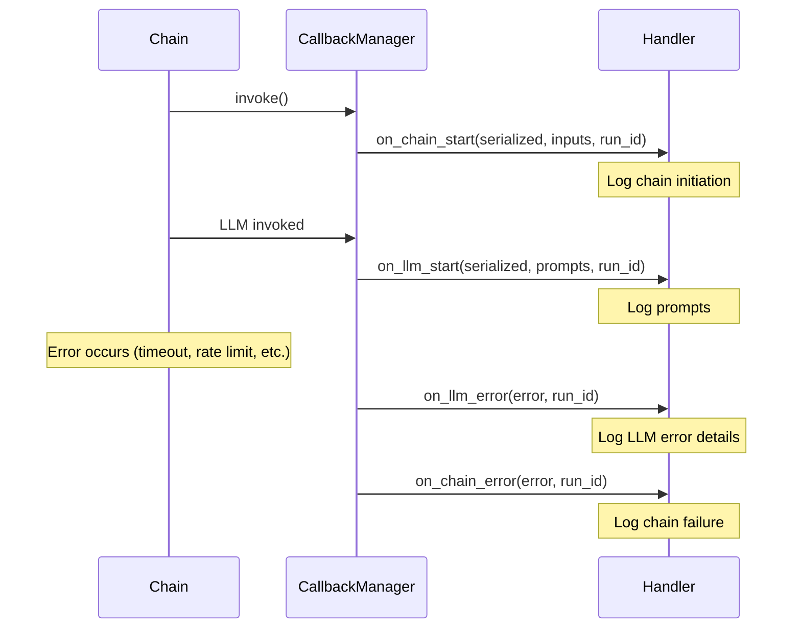
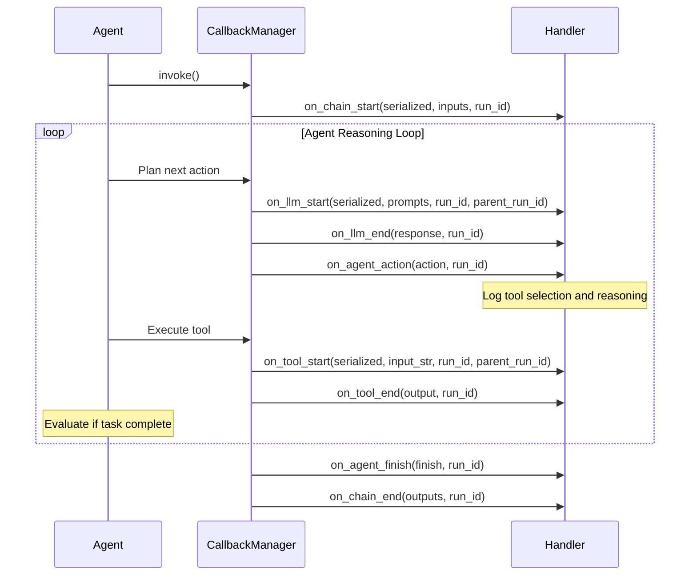

# LangChain Callbacks Module

## Overview

The LangChain callbacks module provides a comprehensive event-driven system that enables observability, logging, tracing, and debugging of LangChain chain execution. Through lifecycle hook methods invoked at key execution points, callbacks offer real-time visibility into chain operations, custom logging and metrics collection, debugging capabilities for complex chains, and seamless integration with external monitoring systems.

**Key Benefits:**

- **Real-time Observability**: Track chain execution as it happens, with visibility into inputs, outputs, and intermediate steps
- **Custom Metrics Collection**: Gather performance data, token usage statistics, and custom business metrics
- **Debugging Support**: Identify bottlenecks, errors, and unexpected behavior in complex chains
- **Integration-Friendly**: Connect to logging frameworks, monitoring systems, and analytics platforms
- **Flexible Architecture**: Implement only the callbacks you need, ignore others

## Callback System Architecture

### Purpose and Benefits

The callback system is built on an event-driven architecture that separates concerns between chain execution logic and observability. This design provides:

1. **Non-Invasive Monitoring**: Observe chain behavior without modifying production code
2. **Modular Design**: Choose which events to handle through selective method overriding
3. **Async Support**: Full support for both synchronous and asynchronous chains
4. **Hierarchical Tracking**: Track parent-child relationships in nested chain executions via run_id and parent_run_id
5. **Error Visibility**: Dedicated error callbacks for each component type (chain, LLM, tool, retriever)

### Handler Interface

The module provides two primary base classes for implementing custom callbacks:

**BaseCallbackHandler** (Synchronous)
- Used for synchronous chain execution (`invoke`, `batch`, `stream`)
- All callback methods are regular (non-async) functions
- Suitable for CPU-bound operations, simple logging, in-memory metrics
- Source: `libs/core/langchain_core/callbacks/base.py:426-476`

**AsyncCallbackHandler** (Asynchronous)
- Used for asynchronous chain execution (`ainvoke`, `abatch`, `astream`)
- All callback methods are async functions (defined with `async def`)
- Required for I/O-bound operations (network calls, async database writes)
- Inherits from BaseCallbackHandler, provides async versions of all methods
- Source: `libs/core/langchain_core/callbacks/base.py:478-885`

### Mixin Pattern

The callback system uses a mixin architecture for modular organization of callback methods:

| Mixin Class | Purpose | Key Methods |
|-------------|---------|-------------|
| **RetrieverManagerMixin** | Retriever lifecycle callbacks | `on_retriever_start`, `on_retriever_end`, `on_retriever_error` |
| **LLMManagerMixin** | LLM and chat model callbacks | `on_llm_start`, `on_llm_end`, `on_llm_error`, `on_llm_new_token`, `on_chat_model_start` |
| **ChainManagerMixin** | Chain and agent callbacks | `on_chain_start`, `on_chain_end`, `on_chain_error`, `on_agent_action`, `on_agent_finish` |
| **ToolManagerMixin** | Tool execution callbacks | `on_tool_start`, `on_tool_end`, `on_tool_error` |
| **CallbackManagerMixin** | Text and general callbacks | `on_text` |
| **RunManagerMixin** | Retry and custom event callbacks | `on_retry`, `on_custom_event` |

Each mixin provides no-op default implementations, allowing handlers to override only the methods they need.

## Complete Callback Methods Reference

### Chain Callbacks

| Method | Purpose | Key Parameters | Use Cases |
|--------|---------|---------------|-----------|
| `on_chain_start` | Invoked when any chain begins execution | `serialized` (chain config), `inputs` (input dict), `run_id`, `parent_run_id`, `tags`, `metadata` | Logging chain initiation, starting timers, recording inputs |
| `on_chain_end` | Invoked when chain completes successfully | `outputs` (output dict), `run_id`, `parent_run_id` | Logging results, stopping timers, calculating metrics |
| `on_chain_error` | Invoked when chain raises an exception | `error` (exception), `run_id`, `parent_run_id` | Error logging, alerting, retry decision making |

**Source**: `libs/core/langchain_core/callbacks/base.py:121-191`

### LLM Callbacks

| Method | Purpose | Key Parameters | Use Cases |
|--------|---------|---------------|-----------|
| `on_llm_start` | Invoked when LLM (non-chat) begins generation | `serialized` (LLM config), `prompts` (list of prompts), `run_id`, `parent_run_id`, `tags`, `metadata` | Logging prompts, tracking LLM invocations, cost tracking setup |
| `on_chat_model_start` | Invoked when chat model begins generation | `serialized` (model config), `messages` (list of message lists), `run_id`, `parent_run_id`, `tags`, `metadata` | Logging chat messages, tracking conversations |
| `on_llm_end` | Invoked when LLM completes generation | `response` (LLMResult with generations), `run_id`, `parent_run_id` | Logging outputs, token usage tracking, cost calculation |
| `on_llm_error` | Invoked when LLM raises an exception | `error` (exception), `run_id`, `parent_run_id` | Error handling, retry logic, fallback mechanisms |
| `on_llm_new_token` | Invoked for each token during streaming | `token` (str), `chunk` (generation chunk), `run_id`, `parent_run_id` | Real-time streaming display, progressive output collection |

**Source**: `libs/core/langchain_core/callbacks/base.py:62-119`

### Retriever Callbacks

| Method | Purpose | Key Parameters | Use Cases |
|--------|---------|---------------|-----------|
| `on_retriever_start` | Invoked when retriever begins document search | `serialized` (retriever config), `query` (search query), `run_id`, `parent_run_id` | Logging search queries, tracking retrieval operations |
| `on_retriever_end` | Invoked when retriever returns documents | `documents` (list of Documents), `run_id`, `parent_run_id` | Logging retrieved documents, analyzing relevance |
| `on_retriever_error` | Invoked when retriever raises an exception | `error` (exception), `run_id`, `parent_run_id` | Error handling, fallback to alternative retrievers |

**Source**: `libs/core/langchain_core/callbacks/base.py:24-60`

### Agent Callbacks

| Method | Purpose | Key Parameters | Use Cases |
|--------|---------|---------------|-----------|
| `on_agent_action` | Invoked when agent decides on an action | `action` (AgentAction with tool, input, log), `run_id`, `parent_run_id` | Logging agent reasoning, tracking tool selections |
| `on_agent_finish` | Invoked when agent completes its task | `finish` (AgentFinish with output), `run_id`, `parent_run_id` | Logging final agent output, recording completion |

**Source**: `libs/core/langchain_core/callbacks/base.py:158-190`

### Tool Callbacks

| Method | Purpose | Key Parameters | Use Cases |
|--------|---------|---------------|-----------|
| `on_tool_start` | Invoked when tool execution begins | `serialized` (tool config), `input_str` (tool input), `run_id`, `parent_run_id` | Logging tool invocations, tracking tool usage |
| `on_tool_end` | Invoked when tool execution completes | `output` (tool output), `run_id`, `parent_run_id` | Logging tool results, measuring tool performance |
| `on_tool_error` | Invoked when tool raises an exception | `error` (exception), `run_id`, `parent_run_id` | Error handling, tool failure alerting |

**Source**: `libs/core/langchain_core/callbacks/base.py:193-246`

### Specialized Callbacks

| Method | Purpose | Key Parameters | Use Cases |
|--------|---------|---------------|-----------|
| `on_text` | Invoked for generic text output | `text` (str), `run_id`, `parent_run_id` | Logging intermediate text, streaming text display |
| `on_retry` | Invoked when operation is retried | `retry_state` (RetryCallState), `run_id`, `parent_run_id` | Tracking retry attempts, debugging retry logic |
| `on_custom_event` | Invoked for user-defined custom events | `name` (event name), `data` (event data), `run_id`, `tags`, `metadata` | Custom business metrics, application-specific tracking |

**Source**: `libs/core/langchain_core/callbacks/base.py:248-424`

## Event Lifecycle Documentation

### Typical Chain Execution Flow

The following diagram illustrates the callback invocation sequence during a typical chain execution that invokes an LLM:



**Key Observations:**
- Each callback receives a unique `run_id` for the operation
- Nested operations (LLM within chain) pass `parent_run_id` to track hierarchy
- Streaming callbacks (`on_llm_new_token`) are called multiple times
- Error callbacks interrupt the normal flow

### Error Path Flow

When an error occurs during chain execution, the callback flow changes:



**Key Observations:**
- Error callbacks receive the exception object for analysis
- `on_chain_error` is called even if nested component (LLM) failed
- No `on_chain_end` callback is invoked when errors occur
- Handlers can inspect error type for conditional logic

### Agent Execution Flow

Agent execution involves multiple iterations of the reasoning loop:



**Key Observations:**
- Agent execution involves multiple LLM calls (reasoning) and tool calls
- `on_agent_action` provides visibility into agent decision-making
- The loop continues until agent determines task is complete
- All nested operations share the same parent chain `run_id`

## Custom Callback Implementation Guide

### Step-by-Step Tutorial

Implementing a custom callback handler involves these steps:

1. **Choose Base Class**: Subclass `BaseCallbackHandler` (sync) or `AsyncCallbackHandler` (async)
2. **Override Methods**: Implement only the `on_*` methods relevant to your use case
3. **Implement Logic**: Add custom logging, metrics, persistence, or analysis code
4. **Register Handler**: Pass handler to chains via `config={"callbacks": [handler]}`

### Example 1: Simple Logging Callback

A basic callback that logs chain execution events to the console:

```python
from langchain_core.callbacks import BaseCallbackHandler
from typing import Any, Dict
from uuid import UUID


class LoggingCallback(BaseCallbackHandler):
    """Simple callback that logs chain execution to console."""
    
    def on_chain_start(
        self,
        serialized: Dict[str, Any],
        inputs: Dict[str, Any],
        *,
        run_id: UUID,
        parent_run_id: UUID | None = None,
        tags: list[str] | None = None,
        **kwargs: Any,
    ) -> None:
        """Log when chain starts.
        
        Args:
            serialized: Serialized chain configuration
            inputs: Input dictionary passed to chain
            run_id: Unique identifier for this run
            parent_run_id: ID of parent run if nested
            tags: Tags associated with this run
            **kwargs: Additional keyword arguments
        """
        class_name = serialized.get("name", "<unknown>")
        print(f"[Chain Start] {class_name}")
        print(f"  run_id: {run_id}")
        print(f"  inputs: {inputs}")
        if tags:
            print(f"  tags: {tags}")
    
    def on_chain_end(
        self,
        outputs: Dict[str, Any],
        *,
        run_id: UUID,
        parent_run_id: UUID | None = None,
        **kwargs: Any,
    ) -> None:
        """Log when chain completes.
        
        Args:
            outputs: Output dictionary from chain
            run_id: Unique identifier for this run
            parent_run_id: ID of parent run if nested
            **kwargs: Additional keyword arguments
        """
        print(f"[Chain End] run_id: {run_id}")
        print(f"  outputs: {outputs}")
    
    def on_chain_error(
        self,
        error: BaseException,
        *,
        run_id: UUID,
        parent_run_id: UUID | None = None,
        **kwargs: Any,
    ) -> None:
        """Log when chain encounters error.
        
        Args:
            error: Exception that occurred
            run_id: Unique identifier for this run
            parent_run_id: ID of parent run if nested
            **kwargs: Additional keyword arguments
        """
        print(f"[Chain Error] run_id: {run_id}")
        print(f"  error: {type(error).__name__}: {error}")


# Usage example
from langchain_core.runnables import RunnableLambda

handler = LoggingCallback()
chain = RunnableLambda(lambda x: {"result": x["input"].upper()})
result = chain.invoke({"input": "hello"}, config={"callbacks": [handler]})
print(f"Final result: {result}")
```

**Expected Output:**
```
[Chain Start] RunnableLambda
  run_id: 12345678-1234-1234-1234-123456789abc
  inputs: {'input': 'hello'}
[Chain End] run_id: 12345678-1234-1234-1234-123456789abc
  outputs: {'result': 'HELLO'}
Final result: {'result': 'HELLO'}
```

### Example 2: Metrics Collection Callback

A callback that collects execution time and performance metrics:

```python
from langchain_core.callbacks import BaseCallbackHandler
from typing import Any, Dict
from uuid import UUID
from time import time


class MetricsCallback(BaseCallbackHandler):
    """Callback that collects execution time metrics."""
    
    def __init__(self):
        """Initialize metrics storage."""
        super().__init__()
        self.metrics = {}
        self.start_times = {}
    
    def on_chain_start(
        self,
        serialized: Dict[str, Any],
        inputs: Dict[str, Any],
        *,
        run_id: UUID,
        parent_run_id: UUID | None = None,
        **kwargs: Any,
    ) -> None:
        """Record start time for chain.
        
        Args:
            serialized: Serialized chain configuration
            inputs: Input dictionary
            run_id: Unique identifier for this run
            parent_run_id: ID of parent run if nested
            **kwargs: Additional keyword arguments
        """
        self.start_times[run_id] = {
            "start_time": time(),
            "chain_name": serialized.get("name", "<unknown>"),
            "input_size": len(str(inputs)),
        }
    
    def on_chain_end(
        self,
        outputs: Dict[str, Any],
        *,
        run_id: UUID,
        parent_run_id: UUID | None = None,
        **kwargs: Any,
    ) -> None:
        """Calculate and store metrics for completed chain.
        
        Args:
            outputs: Output dictionary from chain
            run_id: Unique identifier for this run
            parent_run_id: ID of parent run if nested
            **kwargs: Additional keyword arguments
        """
        if run_id in self.start_times:
            start_data = self.start_times[run_id]
            elapsed = time() - start_data["start_time"]
            
            self.metrics[run_id] = {
                "chain_name": start_data["chain_name"],
                "elapsed_seconds": elapsed,
                "input_size_bytes": start_data["input_size"],
                "output_size_bytes": len(str(outputs)),
                "status": "success",
            }
            del self.start_times[run_id]
    
    def on_chain_error(
        self,
        error: BaseException,
        *,
        run_id: UUID,
        parent_run_id: UUID | None = None,
        **kwargs: Any,
    ) -> None:
        """Record metrics for failed chain.
        
        Args:
            error: Exception that occurred
            run_id: Unique identifier for this run
            parent_run_id: ID of parent run if nested
            **kwargs: Additional keyword arguments
        """
        if run_id in self.start_times:
            start_data = self.start_times[run_id]
            elapsed = time() - start_data["start_time"]
            
            self.metrics[run_id] = {
                "chain_name": start_data["chain_name"],
                "elapsed_seconds": elapsed,
                "input_size_bytes": start_data["input_size"],
                "status": "error",
                "error_type": type(error).__name__,
            }
            del self.start_times[run_id]
    
    def get_metrics(self) -> Dict[UUID, Dict[str, Any]]:
        """Retrieve collected metrics.
        
        Returns:
            Dictionary mapping run_id to metrics
        """
        return self.metrics
    
    def get_summary(self) -> Dict[str, Any]:
        """Get summary statistics across all runs.
        
        Returns:
            Summary statistics including average time, success rate
        """
        if not self.metrics:
            return {"total_runs": 0}
        
        total_runs = len(self.metrics)
        successful_runs = sum(1 for m in self.metrics.values() if m["status"] == "success")
        total_time = sum(m["elapsed_seconds"] for m in self.metrics.values())
        
        return {
            "total_runs": total_runs,
            "successful_runs": successful_runs,
            "failed_runs": total_runs - successful_runs,
            "success_rate": successful_runs / total_runs if total_runs > 0 else 0,
            "average_time_seconds": total_time / total_runs if total_runs > 0 else 0,
        }


# Usage example
handler = MetricsCallback()
chain = RunnableLambda(lambda x: {"result": x["input"] * 2})

# Run multiple invocations
for i in range(5):
    result = chain.invoke({"input": i}, config={"callbacks": [handler]})

# Analyze metrics
print("Individual metrics:")
for run_id, metrics in handler.get_metrics().items():
    print(f"  {run_id}: {metrics}")

print("\nSummary statistics:")
summary = handler.get_summary()
for key, value in summary.items():
    print(f"  {key}: {value}")
```

**Expected Output:**
```
Individual metrics:
  UUID('...'): {'chain_name': 'RunnableLambda', 'elapsed_seconds': 0.0012, ...}
  UUID('...'): {'chain_name': 'RunnableLambda', 'elapsed_seconds': 0.0008, ...}
  ...

Summary statistics:
  total_runs: 5
  successful_runs: 5
  failed_runs: 0
  success_rate: 1.0
  average_time_seconds: 0.001
```

### Example 3: Database Persistence Callback

A callback that persists chain execution records to a database:

```python
from langchain_core.callbacks import BaseCallbackHandler
from typing import Any, Dict
from uuid import UUID
import json
import sqlite3
from datetime import datetime


class DatabaseCallback(BaseCallbackHandler):
    """Callback that persists chain execution to database."""
    
    def __init__(self, db_path: str = "chain_executions.db"):
        """Initialize database connection and create table if needed.
        
        Args:
            db_path: Path to SQLite database file
        """
        super().__init__()
        self.db_path = db_path
        self.conn = sqlite3.connect(db_path)
        self._create_table()
    
    def _create_table(self) -> None:
        """Create chain_runs table if it doesn't exist."""
        self.conn.execute("""
            CREATE TABLE IF NOT EXISTS chain_runs (
                run_id TEXT PRIMARY KEY,
                parent_run_id TEXT,
                chain_name TEXT,
                inputs TEXT,
                outputs TEXT,
                error TEXT,
                tags TEXT,
                metadata TEXT,
                status TEXT,
                started_at TEXT,
                completed_at TEXT
            )
        """)
        self.conn.commit()
    
    def on_chain_start(
        self,
        serialized: Dict[str, Any],
        inputs: Dict[str, Any],
        *,
        run_id: UUID,
        parent_run_id: UUID | None = None,
        tags: list[str] | None = None,
        metadata: Dict[str, Any] | None = None,
        **kwargs: Any,
    ) -> None:
        """Persist chain start event to database.
        
        Args:
            serialized: Serialized chain configuration
            inputs: Input dictionary
            run_id: Unique identifier for this run
            parent_run_id: ID of parent run if nested
            tags: Tags associated with this run
            metadata: Metadata associated with this run
            **kwargs: Additional keyword arguments
        """
        self.conn.execute(
            """
            INSERT INTO chain_runs 
            (run_id, parent_run_id, chain_name, inputs, tags, metadata, status, started_at)
            VALUES (?, ?, ?, ?, ?, ?, ?, ?)
            """,
            (
                str(run_id),
                str(parent_run_id) if parent_run_id else None,
                serialized.get("name", "<unknown>"),
                json.dumps(inputs),
                json.dumps(tags or []),
                json.dumps(metadata or {}),
                "started",
                datetime.utcnow().isoformat(),
            )
        )
        self.conn.commit()
    
    def on_chain_end(
        self,
        outputs: Dict[str, Any],
        *,
        run_id: UUID,
        **kwargs: Any,
    ) -> None:
        """Update database record with chain completion.
        
        Args:
            outputs: Output dictionary from chain
            run_id: Unique identifier for this run
            **kwargs: Additional keyword arguments
        """
        self.conn.execute(
            """
            UPDATE chain_runs 
            SET outputs = ?, status = ?, completed_at = ?
            WHERE run_id = ?
            """,
            (
                json.dumps(outputs),
                "completed",
                datetime.utcnow().isoformat(),
                str(run_id),
            )
        )
        self.conn.commit()
    
    def on_chain_error(
        self,
        error: BaseException,
        *,
        run_id: UUID,
        **kwargs: Any,
    ) -> None:
        """Update database record with error information.
        
        Args:
            error: Exception that occurred
            run_id: Unique identifier for this run
            **kwargs: Additional keyword arguments
        """
        self.conn.execute(
            """
            UPDATE chain_runs 
            SET error = ?, status = ?, completed_at = ?
            WHERE run_id = ?
            """,
            (
                f"{type(error).__name__}: {str(error)}",
                "failed",
                datetime.utcnow().isoformat(),
                str(run_id),
            )
        )
        self.conn.commit()
    
    def query_runs(self, status: str | None = None) -> list[Dict[str, Any]]:
        """Query chain execution records from database.
        
        Args:
            status: Filter by status (started, completed, failed), or None for all
        
        Returns:
            List of chain run records as dictionaries
        """
        if status:
            cursor = self.conn.execute(
                "SELECT * FROM chain_runs WHERE status = ?", (status,)
            )
        else:
            cursor = self.conn.execute("SELECT * FROM chain_runs")
        
        columns = [desc[0] for desc in cursor.description]
        return [dict(zip(columns, row)) for row in cursor.fetchall()]
    
    def close(self) -> None:
        """Close database connection."""
        self.conn.close()


# Usage example
handler = DatabaseCallback("my_chains.db")

try:
    chain = RunnableLambda(lambda x: {"result": x["input"].upper()})
    result = chain.invoke(
        {"input": "hello"},
        config={
            "callbacks": [handler],
            "tags": ["example", "test"],
            "metadata": {"user": "alice"},
        }
    )
    
    # Query completed runs
    completed_runs = handler.query_runs(status="completed")
    print(f"Completed runs: {len(completed_runs)}")
    for run in completed_runs:
        print(f"  Chain: {run['chain_name']}, Status: {run['status']}")
        
finally:
    handler.close()
```

### Example 4: Token Usage Tracking Callback

A callback that tracks LLM token usage for cost estimation:

```python
from langchain_core.callbacks import BaseCallbackHandler
from typing import Any, Dict
from uuid import UUID


class TokenUsageCallback(BaseCallbackHandler):
    """Callback that tracks token usage for cost estimation."""
    
    def __init__(self):
        """Initialize token tracking storage."""
        super().__init__()
        self.total_tokens = 0
        self.total_prompt_tokens = 0
        self.total_completion_tokens = 0
        self.llm_calls = 0
    
    def on_llm_start(
        self,
        serialized: Dict[str, Any],
        prompts: list[str],
        *,
        run_id: UUID,
        **kwargs: Any,
    ) -> None:
        """Track LLM invocation.
        
        Args:
            serialized: Serialized LLM configuration
            prompts: List of prompts sent to LLM
            run_id: Unique identifier for this run
            **kwargs: Additional keyword arguments
        """
        self.llm_calls += 1
    
    def on_llm_end(
        self,
        response: Any,
        *,
        run_id: UUID,
        **kwargs: Any,
    ) -> None:
        """Extract and accumulate token usage from LLM response.
        
        Args:
            response: LLMResult containing generations and metadata
            run_id: Unique identifier for this run
            **kwargs: Additional keyword arguments
        """
        # Extract token usage from response metadata
        if hasattr(response, "llm_output") and response.llm_output:
            token_usage = response.llm_output.get("token_usage", {})
            
            prompt_tokens = token_usage.get("prompt_tokens", 0)
            completion_tokens = token_usage.get("completion_tokens", 0)
            total_tokens = token_usage.get("total_tokens", 0)
            
            self.total_prompt_tokens += prompt_tokens
            self.total_completion_tokens += completion_tokens
            self.total_tokens += total_tokens
    
    def get_usage_summary(self) -> Dict[str, Any]:
        """Get summary of token usage.
        
        Returns:
            Dictionary with token usage statistics
        """
        return {
            "llm_calls": self.llm_calls,
            "total_tokens": self.total_tokens,
            "total_prompt_tokens": self.total_prompt_tokens,
            "total_completion_tokens": self.total_completion_tokens,
        }
    
    def estimate_cost(
        self,
        prompt_cost_per_1k: float = 0.0015,
        completion_cost_per_1k: float = 0.002,
    ) -> float:
        """Estimate cost based on token usage.
        
        Args:
            prompt_cost_per_1k: Cost per 1000 prompt tokens (default: GPT-3.5 rate)
            completion_cost_per_1k: Cost per 1000 completion tokens
        
        Returns:
            Estimated cost in dollars
        """
        prompt_cost = (self.total_prompt_tokens / 1000) * prompt_cost_per_1k
        completion_cost = (self.total_completion_tokens / 1000) * completion_cost_per_1k
        return prompt_cost + completion_cost


# Usage example (pseudo-code, requires actual LLM)
# from langchain_openai import ChatOpenAI
#
# handler = TokenUsageCallback()
# llm = ChatOpenAI(model="gpt-3.5-turbo")
# 
# response = llm.invoke("Tell me a joke", config={"callbacks": [handler]})
#
# summary = handler.get_usage_summary()
# print(f"Token usage: {summary}")
# print(f"Estimated cost: ${handler.estimate_cost():.4f}")
```

## Async Callback Considerations

### When to Use AsyncCallbackHandler vs BaseCallbackHandler

Choose the appropriate base class based on your execution context and callback operations:

**Use `AsyncCallbackHandler` when:**
- Chain execution is asynchronous (using `ainvoke`, `astream`, `abatch`)
- Callback operations involve I/O-bound tasks:
  - Network requests to remote APIs
  - Async database writes
  - Async file I/O operations
  - Async message queue operations
- You need to `await` async operations within callback methods
- Your monitoring system has async-only APIs

**Use `BaseCallbackHandler` when:**
- Chain execution is synchronous (using `invoke`, `stream`, `batch`)
- Callback operations are CPU-bound or simple operations:
  - In-memory data structure updates
  - Simple console logging
  - Synchronous calculations
- Your logging/monitoring system has synchronous APIs
- You want to minimize async complexity

**Important**: Mixing sync handlers with async chains or vice versa can lead to performance issues or blocking behavior.

### Event Loop Requirements

When implementing `AsyncCallbackHandler`:

1. **All callback methods must be async**: Define methods with `async def` syntax
2. **All callbacks will be awaited**: The callback manager awaits each async callback
3. **Proper event loop context required**: Ensure callbacks run within an async context
4. **Avoid blocking operations**: Use `asyncio.to_thread()` for CPU-bound work in async callbacks
5. **Exception handling**: Async exceptions are propagated through the callback system

### Example: Async Callback Implementation

A callback that sends logs to a remote API asynchronously:

```python
from langchain_core.callbacks import AsyncCallbackHandler
from typing import Any, Dict
from uuid import UUID
import aiohttp
import asyncio


class AsyncLoggingCallback(AsyncCallbackHandler):
    """Async callback that sends logs to remote API."""
    
    def __init__(self, api_url: str, api_key: str):
        """Initialize with API configuration.
        
        Args:
            api_url: URL of the logging API endpoint
            api_key: API key for authentication
        """
        super().__init__()
        self.api_url = api_url
        self.api_key = api_key
    
    async def on_chain_start(
        self,
        serialized: Dict[str, Any],
        inputs: Dict[str, Any],
        *,
        run_id: UUID,
        parent_run_id: UUID | None = None,
        tags: list[str] | None = None,
        metadata: Dict[str, Any] | None = None,
        **kwargs: Any,
    ) -> None:
        """Send chain start event to remote API.
        
        Args:
            serialized: Serialized chain configuration
            inputs: Input dictionary
            run_id: Unique identifier for this run
            parent_run_id: ID of parent run if nested
            tags: Tags associated with this run
            metadata: Metadata associated with this run
            **kwargs: Additional keyword arguments
        """
        async with aiohttp.ClientSession() as session:
            async with session.post(
                f"{self.api_url}/events",
                json={
                    "event": "chain_start",
                    "run_id": str(run_id),
                    "parent_run_id": str(parent_run_id) if parent_run_id else None,
                    "chain_name": serialized.get("name", "<unknown>"),
                    "inputs": inputs,
                    "tags": tags or [],
                    "metadata": metadata or {},
                },
                headers={"Authorization": f"Bearer {self.api_key}"},
            ) as response:
                if response.status != 200:
                    print(f"Warning: Failed to send chain_start event: {response.status}")
    
    async def on_chain_end(
        self,
        outputs: Dict[str, Any],
        *,
        run_id: UUID,
        **kwargs: Any,
    ) -> None:
        """Send chain end event to remote API.
        
        Args:
            outputs: Output dictionary from chain
            run_id: Unique identifier for this run
            **kwargs: Additional keyword arguments
        """
        async with aiohttp.ClientSession() as session:
            async with session.post(
                f"{self.api_url}/events",
                json={
                    "event": "chain_end",
                    "run_id": str(run_id),
                    "outputs": outputs,
                },
                headers={"Authorization": f"Bearer {self.api_key}"},
            ) as response:
                if response.status != 200:
                    print(f"Warning: Failed to send chain_end event: {response.status}")
    
    async def on_chain_error(
        self,
        error: BaseException,
        *,
        run_id: UUID,
        **kwargs: Any,
    ) -> None:
        """Send chain error event to remote API.
        
        Args:
            error: Exception that occurred
            run_id: Unique identifier for this run
            **kwargs: Additional keyword arguments
        """
        async with aiohttp.ClientSession() as session:
            async with session.post(
                f"{self.api_url}/events",
                json={
                    "event": "chain_error",
                    "run_id": str(run_id),
                    "error_type": type(error).__name__,
                    "error_message": str(error),
                },
                headers={"Authorization": f"Bearer {self.api_key}"},
            ) as response:
                if response.status != 200:
                    print(f"Warning: Failed to send chain_error event: {response.status}")


# Usage example with async chain
async def main():
    """Example of using async callback with async chain."""
    from langchain_core.runnables import RunnableLambda
    
    # Initialize async callback
    handler = AsyncLoggingCallback(
        api_url="https://api.example.com",
        api_key="your-api-key-here"
    )
    
    # Create and invoke chain asynchronously
    chain = RunnableLambda(lambda x: {"result": x["input"].upper()})
    result = await chain.ainvoke(
        {"input": "hello"},
        config={"callbacks": [handler]}
    )
    
    print(f"Result: {result}")


# Run the async example
if __name__ == "__main__":
    asyncio.run(main())
```

**Key Async Patterns:**

1. **Session Management**: Create `aiohttp.ClientSession` within callback (or reuse connection pool)
2. **Error Handling**: Catch exceptions from async operations to prevent callback failures
3. **Timeouts**: Use `asyncio.timeout()` or `aiohttp` timeout to prevent hanging callbacks
4. **Concurrency**: Multiple callbacks can execute concurrently within async chains

## Concrete Handler Examples

The callbacks module includes several built-in concrete handlers for common use cases:

### 1. FileCallbackHandler

**Purpose**: Writes lifecycle messages to a file for persistent logging

**Source**: `libs/core/langchain_core/callbacks/file.py`

**Features**:
- Context manager support for automatic file handling
- Configurable file mode (append, write, etc.)
- UTF-8 encoding
- Deprecated direct instantiation (use context manager instead)

**Usage Example**:
```python
from langchain_core.callbacks.file import FileCallbackHandler

with FileCallbackHandler("execution.log", mode="a") as handler:
    result = chain.invoke(inputs, config={"callbacks": [handler]})
# File is automatically closed after context exits
```

**Use Cases**:
- Persistent logging to disk
- Audit trails for chain executions
- Debugging production issues by reviewing logs

### 2. StdOutCallbackHandler

**Purpose**: Prints lifecycle messages to standard output (console)

**Source**: `libs/core/langchain_core/callbacks/stdout.py`

**Features**:
- Configurable text color
- Formatted output for chains, agents, tools
- Useful for development and debugging

**Usage Example**:
```python
from langchain_core.callbacks.stdout import StdOutCallbackHandler

handler = StdOutCallbackHandler(color="green")
result = chain.invoke(inputs, config={"callbacks": [handler]})
```

**Output Format**:
```
> Entering new AgentExecutor chain...
Thought: I need to search for information
Action: search
Action Input: "LangChain documentation"
Observation: ...
> Finished chain.
```

**Use Cases**:
- Console debugging during development
- Interactive demonstrations
- Simple logging without additional dependencies

### 3. StreamingStdOutCallbackHandler

**Purpose**: Streams LLM tokens to stdout in real-time for progressive display

**Source**: `libs/core/langchain_core/callbacks/streaming_stdout.py`

**Features**:
- Implements `on_llm_new_token` for token-by-token streaming
- Flushes stdout after each token
- Only works with LLMs that support streaming

**Usage Example**:
```python
from langchain_core.callbacks.streaming_stdout import StreamingStdOutCallbackHandler

handler = StreamingStdOutCallbackHandler()
# LLM must support streaming
result = llm.invoke("Tell me a story", config={"callbacks": [handler]})
# Tokens are printed progressively as they're generated
```

**Use Cases**:
- Real-time token visualization
- User experience improvement (show progress)
- Debugging streaming implementations

### 4. UsageMetadataCallbackHandler

**Purpose**: Aggregates token usage per model for cost tracking

**Source**: `libs/core/langchain_core/callbacks/usage.py`

**Features**:
- Tracks token usage from `AIMessage.usage_metadata`
- Aggregates across multiple model calls
- Thread-safe accumulation
- Supports multiple models simultaneously

**Usage Example**:
```python
from langchain_core.callbacks.usage import UsageMetadataCallbackHandler
from langchain_openai import ChatOpenAI

callback = UsageMetadataCallbackHandler()

llm = ChatOpenAI(model="gpt-4o-mini")
response = llm.invoke("Hello", config={"callbacks": [callback]})

# Access aggregated usage
print(callback.usage_metadata)
# Output: {'gpt-4o-mini-2024-07-18': {'input_tokens': 8, 'output_tokens': 10, ...}}
```

**Use Cases**:
- API cost tracking and estimation
- Token budget monitoring
- Usage analytics across multiple models
- Billing and quota management

## Best Practices

### 1. Error Handling

Always handle exceptions gracefully in callback methods to avoid disrupting chain execution:

```python
class SafeCallback(BaseCallbackHandler):
    def on_chain_start(self, serialized, inputs, **kwargs):
        try:
            # Your callback logic here
            self.log_to_external_system(inputs)
        except Exception as e:
            # Log the error but don't raise
            print(f"Callback error (non-critical): {e}")
            # Optionally set self.raise_error = True if errors should propagate
```

**Rationale**: Callback failures should not interrupt chain execution unless explicitly configured with `raise_error = True`.

### 2. Performance Considerations

Keep callback operations lightweight to avoid impacting chain performance:

```python
# GOOD: Async I/O for network calls
class AsyncMetricsCallback(AsyncCallbackHandler):
    async def on_chain_end(self, outputs, **kwargs):
        # Non-blocking network call
        await self.send_metrics_async(outputs)

# BAD: Blocking I/O in sync callback
class BlockingCallback(BaseCallbackHandler):
    def on_chain_end(self, outputs, **kwargs):
        # This blocks chain execution!
        time.sleep(2)  # Don't do this
        requests.post("http://api.example.com", json=outputs)
```

**Guidelines**:
- Use async callbacks for I/O-bound operations
- Consider buffering and batch sending for high-frequency callbacks
- Profile callback overhead if performance is critical

### 3. Run ID Management

Use `run_id` and `parent_run_id` to track nested chain execution and build call graphs:

```python
class HierarchyTracker(BaseCallbackHandler):
    def __init__(self):
        self.call_graph = {}
    
    def on_chain_start(self, serialized, inputs, *, run_id, parent_run_id, **kwargs):
        self.call_graph[run_id] = {
            "parent": parent_run_id,
            "chain_name": serialized.get("name"),
            "children": [],
        }
        
        if parent_run_id and parent_run_id in self.call_graph:
            self.call_graph[parent_run_id]["children"].append(run_id)
```

**Benefits**:
- Visualize complex nested chain structures
- Trace errors to specific sub-chains
- Calculate cumulative metrics per call tree

### 4. Selective Method Overriding

Only override callbacks you need; inherit no-op behavior for others:

```python
# GOOD: Override only what you need
class MinimalCallback(BaseCallbackHandler):
    def on_chain_start(self, serialized, inputs, **kwargs):
        print(f"Chain started: {serialized.get('name')}")
    # All other callbacks are no-ops (inherited)

# BAD: Overriding every method with pass
class VerboseCallback(BaseCallbackHandler):
    def on_chain_start(self, serialized, inputs, **kwargs):
        pass
    def on_chain_end(self, outputs, **kwargs):
        pass
    # ... unnecessary boilerplate
```

### 5. Thread Safety

Use thread-safe data structures when collecting metrics across concurrent chains:

```python
import threading

class ThreadSafeMetrics(BaseCallbackHandler):
    def __init__(self):
        self._lock = threading.Lock()
        self.metrics = {}
    
    def on_chain_end(self, outputs, *, run_id, **kwargs):
        # Protect shared state with lock
        with self._lock:
            self.metrics[run_id] = {"outputs": outputs}
```

**When Needed**:
- Batch processing with concurrent chains
- Shared callback instances across threads
- Aggregating metrics from parallel invocations

### 6. Testing Callbacks

Test callbacks independently from chains using mock run_ids and sample data:

```python
import pytest
from uuid import uuid4

def test_logging_callback():
    handler = LoggingCallback()
    run_id = uuid4()
    
    # Test on_chain_start
    handler.on_chain_start(
        serialized={"name": "TestChain"},
        inputs={"query": "test"},
        run_id=run_id,
    )
    
    # Test on_chain_end
    handler.on_chain_end(
        outputs={"result": "success"},
        run_id=run_id,
    )
    
    # Assert expected behavior
    assert run_id in handler.logs
    assert handler.logs[run_id]["status"] == "completed"
```

**Benefits**:
- Unit test callback logic without running actual chains
- Faster test execution
- Easier debugging of callback behavior

## Module Structure

```
callbacks/
├── __init__.py                 # Package entrypoint with lazy imports
├── base.py                     # BaseCallbackHandler, AsyncCallbackHandler, mixins
├── manager.py                  # CallbackManager, run managers, event dispatch
├── file.py                     # FileCallbackHandler concrete implementation
├── stdout.py                   # StdOutCallbackHandler concrete implementation
├── streaming_stdout.py         # StreamingStdOutCallbackHandler concrete implementation
├── usage.py                    # UsageMetadataCallbackHandler concrete implementation
└── README.md                   # This documentation file
```

**Key Files**:

- **base.py**: Defines the callback interface (BaseCallbackHandler, AsyncCallbackHandler) and mixin classes for organizing callback methods by component type
- **manager.py**: Implements CallbackManager for coordinating callback invocations, run managers for context management, and event dispatch logic
- **file.py**: Concrete file logging handler with context manager support
- **stdout.py**: Concrete console logging handler with formatted output
- **streaming_stdout.py**: Concrete streaming handler for real-time token display
- **usage.py**: Concrete handler for tracking and aggregating token usage metadata

## Source Citations

- **BaseCallbackHandler interface**: `libs/core/langchain_core/callbacks/base.py:426-476`
- **AsyncCallbackHandler interface**: `libs/core/langchain_core/callbacks/base.py:478-885`
- **Mixin definitions** (RetrieverManagerMixin, LLMManagerMixin, ChainManagerMixin, ToolManagerMixin, CallbackManagerMixin, RunManagerMixin): `libs/core/langchain_core/callbacks/base.py:24-424`
- **CallbackManager implementation**: `libs/core/langchain_core/callbacks/manager.py:1291-1629`
- **AsyncCallbackManager implementation**: `libs/core/langchain_core/callbacks/manager.py:1762-2149`
- **Event dispatch logic**: `libs/core/langchain_core/callbacks/manager.py:59-443`
- **FileCallbackHandler**: `libs/core/langchain_core/callbacks/file.py:21-262`
- **StdOutCallbackHandler**: `libs/core/langchain_core/callbacks/stdout.py:16-137`
- **StreamingStdOutCallbackHandler**: `libs/core/langchain_core/callbacks/streaming_stdout.py:18-150`
- **UsageMetadataCallbackHandler**: `libs/core/langchain_core/callbacks/usage.py:18-89`

## References

- **Agent Action Plan Section 0.5.1**: Documentation transformation mapping and requirements
- **Agent Action Plan Section 0.1.2**: Google-style docstring format and type annotation standards
- **PEP 484**: Python type annotation specification for type hints
- **LangSmith Integration**: The callback system integrates with LangSmith tracing via `LANGCHAIN_TRACING_V2` environment variable
- **Callback Manager Context**: Use `trace_as_chain_group` context manager for grouping related operations (`libs/core/langchain_core/callbacks/manager.py:64-113`)

## Additional Resources

For more detailed API reference, consult the docstrings in:
- `base.py` - Complete callback method signatures with parameter documentation
- `manager.py` - CallbackManager API and run manager context managers
- Individual concrete handler files for implementation examples

For usage in production chains, see:
- Chain execution documentation: `libs/langchain/langchain_classic/chains/README.md`
- LCEL composition documentation: `libs/core/langchain_core/runnables/README.md`
- Agent development guide: `docs/guides/agent-development.md`
