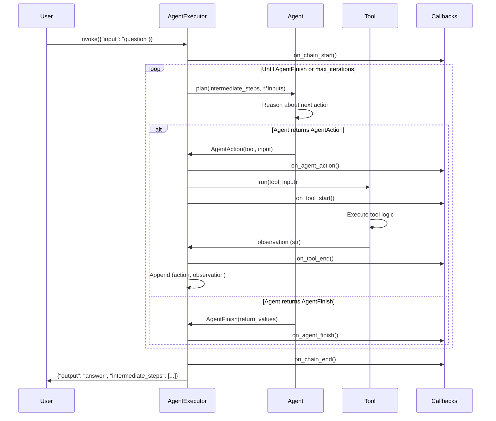

# LangChain Classic Agents Module

## Module Purpose

The `langchain_classic.agents` module provides **agent implementations for autonomous tool-using workflows**. Agents are AI systems that can reason about tasks, select appropriate tools to gather information or take actions, and iteratively work toward completing objectives. Unlike simple chains that follow predefined paths, agents make dynamic decisions based on intermediate observations.

**Core Capabilities:**
- **Autonomous Reasoning**: Agents plan next actions based on task requirements and prior observations
- **Tool Selection and Execution**: Dynamically choose and invoke tools from an available toolkit
- **Iterative Problem Solving**: Execute multi-step reasoning loops (thought → action → observation → repeat)
- **Error Recovery**: Handle tool failures, parsing errors, and iteration limits gracefully
- **Callback Integration**: Comprehensive instrumentation for monitoring agent decisions and tool executions

**Source**: libs/langchain/langchain_classic/agents/agent.py, libs/langchain/langchain_classic/agents/__init__.py

---

## Agent Types Overview

LangChain Classic provides several agent implementations optimized for different use cases:

### 1. **ReAct Agents** (Reasoning and Acting)
- **Pattern**: Interleave reasoning ("thoughts") with actions
- **Best For**: Tasks requiring explicit step-by-step reasoning
- **Example Use Cases**: Question answering with search, multi-step data analysis
- **Implementation**: `libs/langchain/langchain_classic/agents/react/`
- **Prompt Structure**: "Thought: [reasoning] → Action: [tool] → Action Input: [args] → Observation: [result]"

**Source**: libs/langchain/langchain_classic/agents/react/base.py, libs/langchain/langchain_classic/agents/agent_types.py:21-22

### 2. **Conversational Agents** (Chat-Based)
- **Pattern**: Maintain conversation context with memory integration
- **Best For**: Multi-turn dialogues requiring context retention
- **Example Use Cases**: Customer support bots, conversational search assistants
- **Implementation**: `libs/langchain/langchain_classic/agents/conversational/` and `conversational_chat/`
- **Key Feature**: Integrates ConversationBufferMemory for dialog history

**Source**: libs/langchain/langchain_classic/agents/conversational/base.py, libs/langchain/langchain_classic/agents/agent_types.py:37-44

### 3. **OpenAI Functions Agents**
- **Pattern**: Leverage OpenAI's native function calling API
- **Best For**: Structured tool invocation with OpenAI models (GPT-3.5-turbo, GPT-4)
- **Example Use Cases**: API integrations, database queries with validated inputs
- **Implementation**: `libs/langchain/langchain_classic/agents/openai_functions_agent/`
- **Key Feature**: Automatic JSON schema generation from tool definitions

**Source**: libs/langchain/langchain_classic/agents/openai_functions_agent/base.py, libs/langchain/langchain_classic/agents/agent_types.py:54-57

### 4. **Structured Chat Agents**
- **Pattern**: Optimized for tools requiring multiple structured inputs
- **Best For**: Complex tools with multi-field argument schemas
- **Example Use Cases**: Form filling, complex API calls with nested parameters
- **Implementation**: `libs/langchain/langchain_classic/agents/structured_chat/`

**Source**: libs/langchain/langchain_classic/agents/structured_chat/base.py, libs/langchain/langchain_classic/agents/agent_types.py:46-52

### 5. **Self-Ask with Search**
- **Pattern**: Decompose complex questions into sub-questions
- **Best For**: Multi-hop reasoning requiring iterative information gathering
- **Example Use Cases**: "Who is the spouse of the director of movie X?"
- **Implementation**: `libs/langchain/langchain_classic/agents/self_ask_with_search/`

**Source**: libs/langchain/langchain_classic/agents/self_ask_with_search/base.py, libs/langchain/langchain_classic/agents/agent_types.py:31-36

---

## Key Classes

### **1. Agent Base Classes**

#### `BaseSingleActionAgent`
Abstract base class for agents that return **one action per planning step**.

```python
from langchain_classic.agents import BaseSingleActionAgent
from langchain_core.agents import AgentAction, AgentFinish

class CustomAgent(BaseSingleActionAgent):
    def plan(self, intermediate_steps, callbacks=None, **kwargs):
        # Return single AgentAction or AgentFinish
        return AgentAction(tool="Search", tool_input="query", log="thinking...")
    
    async def aplan(self, intermediate_steps, callbacks=None, **kwargs):
        # Async version
        return await self.plan(intermediate_steps, callbacks, **kwargs)
    
    @property
    def input_keys(self):
        return ["input"]
```

**Source**: libs/langchain/langchain_classic/agents/agent.py:55-222

#### `BaseMultiActionAgent`
Abstract base class for agents that can return **multiple actions per planning step** for parallel tool execution.

**Source**: libs/langchain/langchain_classic/agents/agent.py:224-364

---

### **2. AgentExecutor (Orchestration Wrapper)**

The **primary class for running agents**. Wraps an agent with tools and manages the execution loop.

**Architecture**:
```
┌─────────────────────────────────────────────────────────────┐
│ AgentExecutor                                               │
│  ┌─────────────┐      ┌──────────────┐     ┌─────────────┐ │
│  │   Agent     │─────>│   Tool       │────>│ Observation │ │
│  │ (Planning)  │      │  Execution   │     │             │ │
│  └─────────────┘      └──────────────┘     └─────────────┘ │
│         ▲                                          │        │
│         └──────────────────────────────────────────┘        │
│                 Iterative Loop                              │
└─────────────────────────────────────────────────────────────┘
```

**Key Configuration Parameters**:
- `agent`: BaseSingleActionAgent | BaseMultiActionAgent | Runnable
- `tools`: Sequence[BaseTool] - Available tools for the agent
- `max_iterations`: int (default 15) - Maximum reasoning steps
- `max_execution_time`: float | None - Wall clock timeout in seconds
- `return_intermediate_steps`: bool - Include reasoning trajectory in output
- `handle_parsing_errors`: bool | str | Callable - Error recovery strategy
- `early_stopping_method`: "force" | "generate" - How to handle max iterations

**Source**: libs/langchain/langchain_classic/agents/agent.py:1021-1807

---

### **3. Agent Decision Schemas**

#### `AgentAction`
Represents a **decision to use a tool**.

```python
from langchain_core.agents import AgentAction

action = AgentAction(
    tool="Search",           # Tool name to invoke
    tool_input="LangChain",  # Input argument(s)
    log="I need to search"   # Agent's reasoning trace
)
```

**Source**: langchain_core.agents (imported in libs/langchain/langchain_classic/agents/agent.py:21)

#### `AgentFinish`
Represents the **final output** when agent completes.

```python
from langchain_core.agents import AgentFinish

finish = AgentFinish(
    return_values={"output": "Final answer"},
    log="I now know the answer"
)
```

**Source**: langchain_core.agents (imported in libs/langchain/langchain_classic/agents/agent.py:21)

#### `AgentStep`
Combines an **AgentAction with its observation** for tracking execution history.

**Source**: langchain_core.agents (imported in libs/langchain/langchain_classic/agents/agent.py:21)

---

## Tool Integration Patterns

### Tool Interface Contracts

All tools used by agents must satisfy this interface:

```python
from langchain_core.tools import BaseTool, tool
from pydantic import BaseModel, Field

class CalculatorInput(BaseModel):
    """Input schema for calculator."""
    expression: str = Field(description="Mathematical expression to evaluate")

class CalculatorTool(BaseTool):
    name: str = "Calculator"  # REQUIRED: Unique identifier
    description: str = "Useful for mathematical calculations. Input should be a valid math expression."  # REQUIRED: Natural language description
    args_schema: type[BaseModel] = CalculatorInput  # REQUIRED: Pydantic schema defining input structure
    
    def _run(self, expression: str) -> str:
        """Execute the tool synchronously."""
        try:
            result = eval(expression)  # Simplified example
            return str(result)
        except Exception as e:
            return f"Error: {e}"
    
    async def _arun(self, expression: str) -> str:
        """Execute the tool asynchronously."""
        return self._run(expression)
```

**Critical Tool Requirements**:

1. **`name` (str, required)**: Unique tool identifier used in agent reasoning and selection. Must be descriptive and unique within the toolkit.

2. **`description` (str, required)**: Natural language description explaining tool purpose, when to use it, and input format. **This is critical for tool selection** - agents use descriptions to decide which tool to invoke.

3. **`args_schema` (Pydantic BaseModel, required)**: Structured input validation schema defining expected arguments with types, descriptions, and constraints. Enables automatic validation and helps agents format inputs correctly.

**Source**: libs/langchain/langchain_classic/agents/agent.py:1024-1028, libs/core/langchain_core/tools.py

---

### Tool Description Best Practices

**Good Description** (enables correct tool selection):
```python
description = """
Useful for searching the web for current information. 
Input should be a search query string.
Use this when you need up-to-date facts, news, or information not in your training data.
"""
```

**Poor Description** (ambiguous, agent may misuse):
```python
description = "Search tool"  # Too vague - when to use? what input format?
```

**Impact on Agent Behavior**: Agents rely heavily on tool descriptions for selection. Comprehensive descriptions directly improve agent accuracy and reduce tool misuse errors.

**Source**: libs/langchain/langchain_classic/agents/tools.py:11-45, libs/langchain/tests/unit_tests/agents/test_agent.py:93-100

---

## Agent Lifecycle

### Complete Execution Flow



### Detailed Lifecycle Stages

**1. Initialization**
```python
from langchain_classic.agents import AgentExecutor, create_react_agent
from langchain_core.tools import Tool

tools = [Tool(name="Search", func=search_func, description="Search the web")]
agent = create_react_agent(llm, tools, prompt)
executor = AgentExecutor(agent=agent, tools=tools, max_iterations=10)
```

**2. Planning Loop** (repeated until termination)
- `agent.plan(intermediate_steps, **inputs)` → Generates AgentAction or AgentFinish
- Type flow: `Dict[str, Any]` inputs → agent reasoning → `AgentAction | AgentFinish`

**3. Tool Execution** (if AgentAction returned)
- Lookup tool by `action.tool` name
- Invoke `tool.run(action.tool_input)`
- Capture observation as string
- Append `(action, observation)` to intermediate_steps

**4. Termination Conditions**
- Agent returns `AgentFinish` → Success, return final output
- `max_iterations` reached → Trigger early stopping
- `max_execution_time` exceeded → Trigger early stopping
- Parsing error with `handle_parsing_errors=False` → Raise exception

**5. Output Packaging**
```python
{
    "output": "Final answer text",
    "intermediate_steps": [  # If return_intermediate_steps=True
        (AgentAction(...), "observation 1"),
        (AgentAction(...), "observation 2"),
    ]
}
```

**Source**: libs/langchain/langchain_classic/agents/agent.py:1316-1394, 1585-1638

---

## Custom Agent Implementation Guide

### Step-by-Step: Building a Custom Agent

**Scenario**: Create an agent that always searches first, then calculates.

```python
from langchain_classic.agents import BaseSingleActionAgent, AgentExecutor
from langchain_core.agents import AgentAction, AgentFinish
from langchain_core.tools import Tool
from typing import Any

class SearchThenCalculateAgent(BaseSingleActionAgent):
    """Custom agent with fixed two-step workflow."""
    
    tools: list[Tool]
    
    @property
    def input_keys(self) -> list[str]:
        return ["question"]
    
    def plan(
        self, 
        intermediate_steps: list[tuple[AgentAction, str]], 
        callbacks=None, 
        **kwargs: Any
    ) -> AgentAction | AgentFinish:
        """
        Execute fixed strategy:
        1. First call: Search for information
        2. Second call: Calculate based on search result
        3. Return finish with combined result
        """
        question = kwargs.get("question", "")
        
        if len(intermediate_steps) == 0:
            # Step 1: Search
            return AgentAction(
                tool="Search",
                tool_input=question,
                log="First, I'll search for information"
            )
        elif len(intermediate_steps) == 1:
            # Step 2: Calculate using search result
            search_result = intermediate_steps[0][1]
            return AgentAction(
                tool="Calculator",
                tool_input=f"extract_number({search_result})",
                log="Now I'll calculate using the search result"
            )
        else:
            # Step 3: Finish
            calc_result = intermediate_steps[1][1]
            return AgentFinish(
                return_values={"output": f"Final answer: {calc_result}"},
                log="Task complete"
            )
    
    async def aplan(self, intermediate_steps, callbacks=None, **kwargs):
        """Async planning (same logic as plan)."""
        return self.plan(intermediate_steps, callbacks, **kwargs)

# Usage
search_tool = Tool(name="Search", func=lambda x: "Population: 8.3 million", description="Search web")
calc_tool = Tool(name="Calculator", func=lambda x: str(eval(x)), description="Calculate")

agent = SearchThenCalculateAgent(tools=[search_tool, calc_tool])
executor = AgentExecutor(agent=agent, tools=[search_tool, calc_tool], verbose=True)

result = executor.invoke({"question": "What is the population of NYC?"})
print(result["output"])  # "Final answer: 8.3"
```

**Key Implementation Points**:

1. **Subclass `BaseSingleActionAgent` or `BaseMultiActionAgent`**
2. **Implement `plan()` method**: Core reasoning logic returning AgentAction or AgentFinish
3. **Implement `aplan()` method**: Async version (can delegate to plan() if not truly async)
4. **Define `input_keys` property**: List of required input fields
5. **Use `intermediate_steps`**: Access prior (action, observation) pairs for stateful reasoning
6. **Return `AgentFinish` to terminate**: Signals completion with final output

**Source**: libs/langchain/langchain_classic/agents/agent.py:55-222, libs/langchain/tests/unit_tests/agents/test_agent.py:83-110

---

## Custom Tool Development

### Implementing Tools with Validation

**Decorator Approach** (Simplest):
```python
from langchain_core.tools import tool
from pydantic import BaseModel, Field

class SearchInput(BaseModel):
    query: str = Field(description="Search query string")
    max_results: int = Field(default=5, description="Maximum results to return")

@tool("web_search", args_schema=SearchInput, return_direct=False)
def web_search(query: str, max_results: int = 5) -> str:
    """
    Search the web for current information.
    
    Args:
        query: Search query string
        max_results: Maximum number of results (default 5)
    
    Returns:
        Formatted search results as string
    """
    # Actual implementation would call search API
    results = [f"Result {i}: {query}" for i in range(max_results)]
    return "\n".join(results)
```

**Class-Based Approach** (Full Control):
```python
from langchain_core.tools import BaseTool
from langchain_core.callbacks import CallbackManagerForToolRun
from pydantic import BaseModel, Field
from typing import Optional

class DatabaseQueryInput(BaseModel):
    """Input schema for database queries."""
    sql: str = Field(description="SQL query to execute (SELECT only)")
    timeout: int = Field(default=30, description="Query timeout in seconds")

class DatabaseQueryTool(BaseTool):
    """Tool for querying a database safely."""
    
    name: str = "database_query"
    description: str = """
    Execute read-only SQL queries against the database.
    Input should be a valid SELECT statement.
    Use this when you need to retrieve data from tables.
    """
    args_schema: type[BaseModel] = DatabaseQueryInput
    return_direct: bool = False  # Return to agent, not directly to user
    
    def _run(
        self, 
        sql: str, 
        timeout: int = 30,
        run_manager: Optional[CallbackManagerForToolRun] = None
    ) -> str:
        """Execute query synchronously."""
        try:
            # Validate SELECT only
            if not sql.strip().upper().startswith("SELECT"):
                return "Error: Only SELECT queries allowed"
            
            # Execute query (placeholder implementation)
            results = [(1, "Alice"), (2, "Bob")]  # Mock results
            
            # Format results
            return f"Query returned {len(results)} rows: {results}"
        except Exception as e:
            return f"Database error: {e}"
    
    async def _arun(
        self, 
        sql: str, 
        timeout: int = 30,
        run_manager: Optional[CallbackManagerForToolRun] = None
    ) -> str:
        """Execute query asynchronously."""
        # In real implementation, use async database driver
        return self._run(sql, timeout, run_manager)
```

**Tool Validation Best Practices**:

1. **Use Pydantic `args_schema`**: Automatic validation of input types and constraints
2. **Descriptive Field Definitions**: Add `Field(description=...)` for agent understanding
3. **Error Handling**: Return error messages as strings (don't raise exceptions unless critical)
4. **Async Support**: Implement `_arun` even if just calling sync version
5. **Callbacks**: Accept `run_manager` parameter for instrumentation

**Source**: libs/langchain/langchain_classic/agents/tools.py:11-45, libs/core/langchain_core/tools.py

---

## Error Handling Patterns

### 1. Tool Execution Failures

**Scenario**: Tool raises exception during execution.

```python
from langchain_core.tools import Tool, ToolException

def risky_api_call(input: str) -> str:
    if "error" in input:
        raise ToolException("API returned error 500")
    return f"Success: {input}"

tool = Tool(
    name="API",
    func=risky_api_call,
    description="Call external API",
    handle_tool_error=True  # Return exception message to agent
)

executor = AgentExecutor(agent=agent, tools=[tool], verbose=True)
# If tool fails, agent receives observation: "Error: API returned error 500"
```

**Handling Strategy**:
- `handle_tool_error=True`: Exception message becomes observation, agent can retry/adjust
- `handle_tool_error=False`: Exception propagates, stops execution
- Custom handler: `handle_tool_error=lambda e: f"Custom error: {e}"`

**Source**: libs/langchain/langchain_classic/agents/agent.py:1395-1450, libs/core/langchain_core/tools.py

---

### 2. Parsing Errors

**Scenario**: Agent output doesn't match expected AgentAction/AgentFinish format.

```python
executor = AgentExecutor(
    agent=agent,
    tools=tools,
    handle_parsing_errors=True  # Send parsing errors back to agent as observations
)

# If agent produces malformed output:
# - Error is caught
# - Observation: "Invalid or incomplete response"
# - Agent gets another chance to produce valid output
```

**Configuration Options**:
- `handle_parsing_errors=False`: Raise `OutputParserException` immediately (default)
- `handle_parsing_errors=True`: Send error as observation, agent can retry
- `handle_parsing_errors="Custom error message"`: Send custom string to agent
- `handle_parsing_errors=callable`: Pass exception to function, return observation

**Source**: libs/langchain/langchain_classic/agents/agent.py:1337-1376

---

### 3. Max Iterations Reached

**Scenario**: Agent doesn't finish within `max_iterations` limit.

```python
executor = AgentExecutor(
    agent=agent,
    tools=tools,
    max_iterations=5,
    early_stopping_method="force"  # or "generate"
)
```

**Early Stopping Methods**:

- **`"force"`** (default): Return fixed message: "Agent stopped due to iteration limit or time limit."
- **`"generate"`**: Call agent's LLM one final time to generate answer from partial progress

**Best Practices**:
- Set `max_iterations` based on task complexity (simple: 5-10, complex: 15-25)
- Use `"generate"` for graceful degradation with partial results
- Monitor `intermediate_steps` to understand why agent didn't finish

**Source**: libs/langchain/langchain_classic/agents/agent.py:113-139, 1250-1253

---

### 4. Timeout Handling

**Scenario**: Agent execution exceeds wall clock time limit.

```python
executor = AgentExecutor(
    agent=agent,
    tools=tools,
    max_execution_time=60.0  # Stop after 60 seconds
)

result = executor.invoke({"input": "Complex task"})
# If timeout: triggers early_stopping_method
```

**Use Cases**:
- Production APIs with strict SLA requirements
- Preventing runaway agents in multi-user systems
- Cost control for expensive LLM calls

**Source**: libs/langchain/langchain_classic/agents/agent.py:1037-1040, 1250-1253

---

## Callback Integration

### Monitoring Agent Execution

Agents emit comprehensive callback events for instrumentation:

```python
from langchain_core.callbacks import StdOutCallbackHandler

class AgentMonitorCallback(StdOutCallbackHandler):
    """Custom callback for monitoring agent decisions."""
    
    def on_agent_action(self, action, **kwargs):
        print(f"[AGENT ACTION] Tool: {action.tool}, Input: {action.tool_input}")
        print(f"[REASONING] {action.log}")
    
    def on_agent_finish(self, finish, **kwargs):
        print(f"[AGENT FINISH] Output: {finish.return_values}")
    
    def on_tool_start(self, serialized, input_str, **kwargs):
        print(f"[TOOL START] {serialized.get('name')}: {input_str}")
    
    def on_tool_end(self, output, **kwargs):
        print(f"[TOOL END] Result: {output}")
    
    def on_tool_error(self, error, **kwargs):
        print(f"[TOOL ERROR] {error}")

executor = AgentExecutor(
    agent=agent, 
    tools=tools, 
    callbacks=[AgentMonitorCallback()]
)
```

**Available Callback Events**:

| Event | When Triggered | Use Case |
|-------|----------------|----------|
| `on_agent_action` | Agent selects tool to use | Log decisions, track tool usage patterns |
| `on_agent_finish` | Agent completes successfully | Record final outputs, success metrics |
| `on_tool_start` | Before tool execution | Log tool invocations, start timing |
| `on_tool_end` | After successful tool execution | Log observations, end timing |
| `on_tool_error` | Tool raises exception | Error tracking, alerting |
| `on_chain_start` | AgentExecutor.invoke() begins | Track request initiation |
| `on_chain_end` | AgentExecutor.invoke() completes | Track request completion, duration |

**Source**: libs/langchain/langchain_classic/agents/agent.py:1262, 1275, 1366, libs/core/langchain_core/callbacks/base.py

---

## Complete Executable Examples

### Example 1: Simple Agent with Built-in Tools

```python
"""
Simple ReAct agent with search and calculator tools.

Requirements:
- langchain-classic
- langchain-openai
- python-dotenv

Setup:
export OPENAI_API_KEY=your-key-here
"""

from langchain_classic.agents import AgentExecutor, create_react_agent
from langchain_core.prompts import PromptTemplate
from langchain_core.tools import Tool
from langchain_openai import ChatOpenAI

# Define tools
def search_tool(query: str) -> str:
    """Mock search tool."""
    results = {
        "langchain": "LangChain is a framework for building LLM applications",
        "python": "Python is a high-level programming language"
    }
    return results.get(query.lower(), "No results found")

def calculator_tool(expression: str) -> str:
    """Simple calculator."""
    try:
        return str(eval(expression))
    except Exception as e:
        return f"Error: {e}"

tools = [
    Tool(
        name="Search",
        func=search_tool,
        description="Useful for searching for information. Input should be a search query."
    ),
    Tool(
        name="Calculator", 
        func=calculator_tool,
        description="Useful for math calculations. Input should be a valid Python expression."
    )
]

# Create agent
llm = ChatOpenAI(model="gpt-3.5-turbo", temperature=0)

prompt = PromptTemplate.from_template(
    """Answer the following questions as best you can. You have access to the following tools:

{tools}

Use the following format:

Question: the input question you must answer
Thought: you should always think about what to do
Action: the action to take, should be one of [{tool_names}]
Action Input: the input to the action
Observation: the result of the action
... (this Thought/Action/Action Input/Observation can repeat N times)
Thought: I now know the final answer
Final Answer: the final answer to the original input question

Question: {input}
Thought: {agent_scratchpad}
"""
)

agent = create_react_agent(llm, tools, prompt)
executor = AgentExecutor(
    agent=agent, 
    tools=tools, 
    verbose=True,
    max_iterations=5,
    return_intermediate_steps=True
)

# Execute
result = executor.invoke({"input": "What is LangChain and what is 25 * 4?"})
print(f"\nFinal Answer: {result['output']}")
print(f"\nSteps taken: {len(result['intermediate_steps'])}")
```

**Expected Output**:
```
> Entering new AgentExecutor chain...
I need to search for LangChain and then calculate 25 * 4

Action: Search
Action Input: langchain

Observation: LangChain is a framework for building LLM applications

Thought: Now I know about LangChain, let me calculate 25 * 4

Action: Calculator
Action Input: 25 * 4

Observation: 100

Thought: I now know the final answer

Final Answer: LangChain is a framework for building LLM applications, and 25 * 4 equals 100.

Steps taken: 2
```

**Source**: libs/langchain/tests/unit_tests/agents/test_agent.py:83-110, libs/langchain/langchain_classic/agents/react/base.py

---

### Example 2: Agent with Custom Tool and Error Handling

```python
"""
Agent with custom tool and comprehensive error handling.

Demonstrates:
- Custom tool with Pydantic validation
- Parsing error recovery
- Max iteration handling
- Callback monitoring
"""

from langchain_classic.agents import AgentExecutor, create_react_agent
from langchain_core.tools import BaseTool
from langchain_core.callbacks import StdOutCallbackHandler
from langchain_core.prompts import PromptTemplate
from langchain_openai import ChatOpenAI
from pydantic import BaseModel, Field, validator
from typing import Optional

class WeatherInput(BaseModel):
    """Input for weather tool."""
    location: str = Field(description="City name or zip code")
    units: str = Field(default="celsius", description="Temperature units: celsius or fahrenheit")
    
    @validator("units")
    def validate_units(cls, v):
        if v not in ["celsius", "fahrenheit"]:
            raise ValueError("Units must be celsius or fahrenheit")
        return v

class WeatherTool(BaseTool):
    """Custom weather lookup tool with validation."""
    
    name: str = "get_weather"
    description: str = """
    Get current weather for a location.
    Input should include location (city name or zip) and optionally units (celsius/fahrenheit).
    Use this when user asks about weather, temperature, or conditions.
    """
    args_schema: type[BaseModel] = WeatherInput
    
    def _run(self, location: str, units: str = "celsius") -> str:
        """Mock weather API call."""
        # Simulate API error for "error" location
        if "error" in location.lower():
            return "Error: Weather service unavailable"
        
        # Mock weather data
        weather_data = {
            "new york": {"temp": 22, "condition": "Sunny"},
            "london": {"temp": 15, "condition": "Cloudy"},
            "tokyo": {"temp": 28, "condition": "Rainy"}
        }
        
        data = weather_data.get(location.lower(), {"temp": 20, "condition": "Unknown"})
        temp = data["temp"] if units == "celsius" else int(data["temp"] * 9/5 + 32)
        unit_symbol = "°C" if units == "celsius" else "°F"
        
        return f"{location}: {data['condition']}, {temp}{unit_symbol}"
    
    async def _arun(self, location: str, units: str = "celsius") -> str:
        return self._run(location, units)

class MonitoringCallback(StdOutCallbackHandler):
    """Track agent decisions and tool usage."""
    
    def on_agent_action(self, action, **kwargs):
        print(f"\n[🤖 AGENT] Decided to use: {action.tool}")
        print(f"[📝 REASONING] {action.log[:100]}...")
    
    def on_tool_end(self, output, **kwargs):
        print(f"[✅ RESULT] {output[:100]}...")

# Setup
llm = ChatOpenAI(model="gpt-3.5-turbo", temperature=0)
tools = [WeatherTool()]

prompt = PromptTemplate.from_template(
    """Answer questions using available tools.

Tools:
{tools}

Format:
Question: {input}
Thought: {agent_scratchpad}
"""
)

agent = create_react_agent(llm, tools, prompt)
executor = AgentExecutor(
    agent=agent,
    tools=tools,
    callbacks=[MonitoringCallback()],
    max_iterations=3,
    handle_parsing_errors=True,  # Recover from malformed outputs
    return_intermediate_steps=True,
    verbose=True
)

# Test cases
test_queries = [
    "What's the weather in New York?",
    "Tell me the weather in error city",  # Will trigger tool error
]

for query in test_queries:
    print(f"\n{'='*60}")
    print(f"Query: {query}")
    print('='*60)
    
    try:
        result = executor.invoke({"input": query})
        print(f"\n✅ Success: {result['output']}")
    except Exception as e:
        print(f"\n❌ Error: {e}")
```

**Expected Output**:
```
============================================================
Query: What's the weather in New York?
============================================================

[🤖 AGENT] Decided to use: get_weather
[📝 REASONING] I need to check the weather for New York...

[✅ RESULT] new york: Sunny, 22°C...

✅ Success: The weather in New York is Sunny with a temperature of 22°C.

============================================================
Query: Tell me the weather in error city
============================================================

[🤖 AGENT] Decided to use: get_weather
[📝 REASONING] Let me look up the weather...

[✅ RESULT] Error: Weather service unavailable...

✅ Success: I apologize, but the weather service is currently unavailable for that location.
```

**Source**: libs/langchain/langchain_classic/agents/agent.py:1337-1376, libs/langchain/langchain_classic/agents/tools.py:11-45

---

### Example 3: Conversational Agent with Memory

```python
"""
Conversational agent that maintains dialog context.

Demonstrates:
- Memory integration for multi-turn conversations
- Conversational agent pattern
- Context-aware responses
"""

from langchain_classic.agents import AgentExecutor, create_react_agent
from langchain_classic.memory import ConversationBufferMemory
from langchain_core.prompts import PromptTemplate
from langchain_core.tools import Tool
from langchain_openai import ChatOpenAI

# Simple user database tool
user_db = {
    "alice": {"age": 30, "city": "New York", "job": "Engineer"},
    "bob": {"age": 25, "city": "London", "job": "Designer"}
}

def lookup_user(name: str) -> str:
    """Look up user information."""
    user = user_db.get(name.lower())
    if user:
        return f"{name}: Age {user['age']}, works as {user['job']} in {user['city']}"
    return f"User {name} not found"

tools = [
    Tool(
        name="UserLookup",
        func=lookup_user,
        description="Look up user information by name. Input should be a user name."
    )
]

# Memory configuration
memory = ConversationBufferMemory(
    memory_key="chat_history",
    return_messages=True
)

# Conversational prompt
prompt = PromptTemplate.from_template(
    """You are a helpful assistant. You have access to the following tools:

{tools}

Previous conversation:
{chat_history}

Question: {input}
Thought: {agent_scratchpad}
"""
)

llm = ChatOpenAI(model="gpt-3.5-turbo", temperature=0.7)
agent = create_react_agent(llm, tools, prompt)

executor = AgentExecutor(
    agent=agent,
    tools=tools,
    memory=memory,
    verbose=True,
    max_iterations=3
)

# Multi-turn conversation
conversation = [
    "Can you look up information about Alice?",
    "What city does she live in?",  # Requires memory of previous query
    "And what about Bob?",
    "Who is older?"  # Requires memory of both Alice and Bob
]

for turn, user_input in enumerate(conversation, 1):
    print(f"\n{'='*60}")
    print(f"Turn {turn}: {user_input}")
    print('='*60)
    
    result = executor.invoke({"input": user_input})
    print(f"Assistant: {result['output']}")
```

**Expected Output**:
```
============================================================
Turn 1: Can you look up information about Alice?
============================================================
Assistant: Alice is 30 years old, works as an Engineer in New York.

============================================================
Turn 2: What city does she live in?
============================================================
Assistant: Based on the information I just retrieved, Alice lives in New York.

============================================================
Turn 3: And what about Bob?
============================================================
Assistant: Bob is 25 years old, works as a Designer in London.

============================================================
Turn 4: Who is older?
============================================================
Assistant: Alice is older. She is 30 years old while Bob is 25 years old.
```

**Source**: libs/langchain/langchain_classic/agents/conversational/base.py, libs/langchain/langchain_classic/memory/buffer.py

---

## Related Documentation

### Internal Links
- **Tools Module**: `libs/langchain/langchain_classic/tools/` - Tool base classes and implementations
- **Chains Module**: `libs/langchain/langchain_classic/chains/` - Chain abstractions that agents build upon
- **Memory Module**: `libs/langchain/langchain_classic/memory/` - Memory implementations for conversational agents
- **Callbacks**: `libs/core/langchain_core/callbacks/` - Callback system for monitoring

### Core Abstractions
- **langchain_core.agents**: AgentAction, AgentFinish, AgentStep schemas
- **langchain_core.tools**: BaseTool interface and tool decorator
- **langchain_core.runnables**: Runnable protocol used by RunnableAgent

### External Resources
- [LangChain Documentation](https://python.langchain.com/docs/)
- [Agent API Reference](https://python.langchain.com/api_reference/langchain/agents/)
- [ReAct Paper](https://arxiv.org/abs/2210.03629) - Original ReAct reasoning pattern

---

## Troubleshooting Common Issues

### Issue 1: "Tool X is not a valid tool"

**Cause**: Agent generated tool name that doesn't match any tool in the toolkit.

**Solution**:
```python
# Ensure tool names in toolkit match names agent can generate
tools = [Tool(name="Search", ...)]  # Agent must output exactly "Search"

# Or use InvalidTool for better error messages
from langchain_classic.agents.tools import InvalidTool
executor = AgentExecutor(agent=agent, tools=tools + [InvalidTool()])
```

### Issue 2: Agent loops without finishing

**Cause**: Agent stuck in reasoning loop, never returns AgentFinish.

**Solution**:
```python
executor = AgentExecutor(
    agent=agent,
    tools=tools,
    max_iterations=10,  # Force termination
    early_stopping_method="generate"  # Generate answer from partial progress
)
```

### Issue 3: Parsing errors

**Cause**: Agent output doesn't match expected "Action: X\nAction Input: Y" format.

**Solution**:
```python
executor = AgentExecutor(
    agent=agent,
    tools=tools,
    handle_parsing_errors=True  # Send error back to agent for retry
)
```

### Issue 4: Tool receives wrong input format

**Cause**: Tool args_schema not properly defined or agent misunderstands description.

**Solution**:
```python
# Use clear, detailed tool descriptions
tool = Tool(
    name="Calculator",
    func=calc,
    description="""
    Performs mathematical calculations.
    Input MUST be a valid Python expression (e.g., "25 * 4" or "10 + 5").
    Do NOT include text like "calculate" or "equals" - only the expression.
    """
)
```

**Source**: libs/langchain/langchain_classic/agents/agent.py:1239-1248, 1337-1376

---

## Migration Notes

**⚠️ Deprecation Warning**: Many agent types in `agent_types.py` are deprecated as of LangChain 0.1.0 and will be removed in 1.0.

**Recommended Migration Path**:
- **Old**: `initialize_agent(tools, llm, agent=AgentType.ZERO_SHOT_REACT_DESCRIPTION)`
- **New**: `create_react_agent(llm, tools, prompt)` + `AgentExecutor`

**Benefits of New Pattern**:
- More explicit and customizable
- Better type safety
- Improved streaming support
- Clearer separation of concerns

**Source**: libs/langchain/langchain_classic/agents/agent_types.py:10-14, libs/langchain/langchain_classic/_api/deprecation.py

---

## Contributing

When adding new agent types or tools:

1. **Follow naming conventions**: Tool names should be descriptive verbs (e.g., "Search", "Calculate")
2. **Comprehensive descriptions**: Tool descriptions are critical for agent selection
3. **Pydantic schemas**: Always define args_schema for input validation
4. **Error handling**: Return error strings rather than raising exceptions when possible
5. **Async support**: Implement both `_run` and `_arun` methods
6. **Testing**: Add integration tests demonstrating agent usage patterns
7. **Documentation**: Update this README with new agent types or significant tool additions

**Source**: libs/langchain/langchain_classic/agents/agent.py, AGENTS.md, CLAUDE.md

---

## Version Compatibility

- **Python**: >=3.10.0
- **LangChain Core**: ^1.0.0
- **LangChain Classic**: ^1.0.0
- **Pydantic**: ^2.0.0

**Source**: libs/langchain/pyproject.toml, libs/core/pyproject.toml
