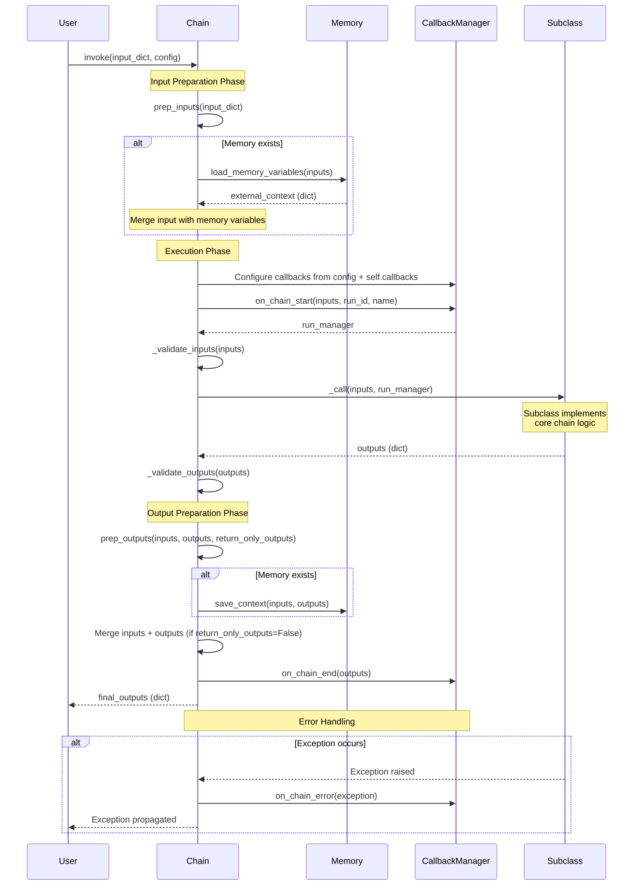

# LangChain Classic Chains Module

## Module Purpose

The `langchain_classic.chains` package houses legacy "classic" Chain implementations for composing LangChain workflows into structured sequences of operations. Chains provide a structured way to link together calls to various components such as language models, document retrievers, output parsers, and other chains, offering a simple interface to orchestrate complex multi-step operations.

**Important Context**: The LangChain ecosystem is transitioning from classic Chain-based composition to modern **LCEL (LangChain Expression Language)** composition patterns. Many chain classes in this module are now deprecated in favor of the more flexible and type-safe LCEL pipe operator (`|`). While Chain classes remain supported for backward compatibility and custom implementations, **all new development should use LCEL composition patterns** for better type safety, streaming support, and composability.

Chains excel at creating applications that are:
- **Stateful**: Integrate Memory to maintain conversation history and context across invocations
- **Observable**: Pass Callbacks to execute logging, monitoring, and debugging functionality outside the main execution flow
- **Composable**: Combine chains with other components including models, retrievers, and other chains through flexible interfaces

*Source: libs/langchain/langchain_classic/chains/base.py:52-73*

---

## Key Classes

### Chain (Abstract Base Class)

The foundational abstract base class defining the canonical lifecycle for all chain implementations.

**Core Functionality**:
- **Lifecycle Methods**: `invoke()` and `ainvoke()` orchestrate the complete execution flow including input preparation, callback management, validation, execution, and output processing
- **Memory Integration**: Automatic loading of memory variables via `prep_inputs()` before execution and saving context via `prep_outputs()` after execution
- **Callback Orchestration**: Built-in callback hooks for `on_chain_start`, `on_chain_end`, and `on_chain_error` events throughout the execution lifecycle
- **Input/Output Contracts**: Abstract properties `input_keys` and `output_keys` define the expected dictionary structure for chain inputs and outputs

**Subclass Requirements**:
- Implement `input_keys` property returning list of expected input dictionary keys
- Implement `output_keys` property returning list of expected output dictionary keys
- Implement `_call(inputs, run_manager)` method containing the core chain logic

*Source: libs/langchain/langchain_classic/chains/base.py:52-73, 131-184, 318-338*

---

### LLMChain (DEPRECATED)

**⚠️ Deprecation Notice**: `LLMChain` is deprecated since version 0.1.17 and will be removed in version 1.0. Use LCEL composition instead: `prompt | llm | output_parser`.

Legacy class for composing a prompt template with a language model, representing the most basic chain pattern of formatting input and calling an LLM.

**Why Deprecated**: LCEL provides superior type safety, native streaming support, better async handling, and more intuitive composition syntax.

**Migration Path**: Replace `LLMChain(llm=model, prompt=prompt)` with `prompt | model | StrOutputParser()`.

*Source: libs/langchain/langchain_classic/chains/llm.py:40-74*

---

### SequentialChain

Multi-step chain composition where the outputs of chain N become available as inputs to chain M through explicit key mapping.

**Core Features**:
- **Variable Accumulation**: Each chain's outputs are added to a shared `known_values` dictionary that accumulates across all chain executions
- **Flexible Routing**: Map specific output keys from one chain to required input keys of subsequent chains
- **Output Control**: `return_all` parameter controls whether to return all accumulated variables or only the final chain's outputs

**Key Validation**: At initialization, validates that:
- All chains receive their required `input_keys` from either initial inputs, memory, or prior chain outputs
- No chain produces `output_keys` that conflict with existing variables
- All specified `output_variables` are produced by at least one chain in the sequence

*Source: libs/langchain/langchain_classic/chains/sequential.py:16-126*

---

### SimpleSequentialChain

Simplified sequential chaining with single string input/output per chain, where each chain receives the direct output string from the previous chain.

**Constraints**:
- Each chain must have exactly one `input_key` and one `output_key`
- Automatically pipes the string output from chain N directly to chain N+1
- Ideal for linear, single-threaded data transformations (e.g., generate text → summarize → translate)

*Source: libs/langchain/langchain_classic/chains/sequential.py:129-183*

---

### create_retrieval_chain()

Factory function implementing the RAG (Retrieval-Augmented Generation) pattern by combining a document retriever with a document combination chain.

**Function Signature**:
```python
def create_retrieval_chain(
    retriever: BaseRetriever | Runnable[dict, RetrieverOutput],
    combine_docs_chain: Runnable[dict[str, Any], str],
) -> Runnable
```

**Parameters**:
- `retriever`: Retriever that fetches relevant documents. If a `BaseRetriever`, expects an `"input"` key in the input dictionary. If a custom `Runnable`, receives the full input dictionary.
- `combine_docs_chain`: Runnable that takes the original inputs plus a new `"context"` key (containing retrieved documents) and produces a string answer.

**Return Value**: LCEL Runnable producing a dictionary with at minimum:
- `"context"`: List of retrieved documents
- `"answer"`: String response from the combine_docs_chain

*Source: libs/langchain/langchain_classic/chains/retrieval.py:12-68*

---

## Chain Execution Lifecycle

The following Mermaid sequence diagram illustrates the complete execution flow when invoking a chain, showing the orchestration of input preparation, callback events, validation, execution, and output processing.



**Lifecycle Stages**:

1. **Input Preparation** (`prep_inputs`): Load memory variables and merge with user inputs
   - *Source: libs/langchain/langchain_classic/chains/base.py:521-543*

2. **Callback Configuration**: Set up callback manager with callbacks from config and chain attributes
   - *Source: libs/langchain/langchain_classic/chains/base.py:147-155*

3. **Chain Start Event**: Trigger `on_chain_start` callback with inputs
   - *Source: libs/langchain/langchain_classic/chains/base.py:158-163*

4. **Input Validation**: Verify all required `input_keys` are present
   - *Source: libs/langchain/langchain_classic/chains/base.py:289-309*

5. **Core Execution**: Call subclass `_call()` method with run_manager for child callbacks
   - *Source: libs/langchain/langchain_classic/chains/base.py:166-170*

6. **Output Validation**: Verify all required `output_keys` are present
   - *Source: libs/langchain/langchain_classic/chains/base.py:311-315*

7. **Output Preparation** (`prep_outputs`): Save context to memory and merge inputs/outputs
   - *Source: libs/langchain/langchain_classic/chains/base.py:475-494*

8. **Chain End Event**: Trigger `on_chain_end` callback with outputs
   - *Source: libs/langchain/langchain_classic/chains/base.py:180*

9. **Error Handling**: Trigger `on_chain_error` callback if exception occurs at any stage
   - *Source: libs/langchain/langchain_classic/chains/base.py:177-179*

---

## Usage Patterns: Modern LCEL vs Legacy Chains

### Modern LCEL Pattern (✅ Recommended)

LCEL (LangChain Expression Language) uses the pipe operator (`|`) for composing runnables with superior type safety and streaming support.

```python
from langchain_core.prompts import PromptTemplate
from langchain_core.output_parsers import StrOutputParser
from langchain_openai import ChatOpenAI

# Define components
prompt = PromptTemplate.from_template("Tell me a {adjective} joke")
model = ChatOpenAI()
parser = StrOutputParser()

# Compose using pipe operator
chain = prompt | model | parser

# Execute
result = chain.invoke({"adjective": "funny"})
print(result)  # String output: "Why did the chicken cross the road?..."

# Streaming support (native with LCEL)
for chunk in chain.stream({"adjective": "funny"}):
    print(chunk, end="", flush=True)

# Async support
result = await chain.ainvoke({"adjective": "funny"})
```

**LCEL Advantages**:
- ✅ **Type Safety**: Explicit type transformations from `Dict[str,str]` → `PromptValue` → `AIMessage` → `str`
- ✅ **Streaming**: Native token-by-token streaming via `.stream()` method
- ✅ **Async First**: Designed for async/await patterns with proper event loop handling
- ✅ **Composability**: Intuitive pipe syntax mirrors functional programming patterns
- ✅ **Fallbacks**: Easy error recovery with `chain.with_fallbacks([fallback_chain])`

---

### Legacy LLMChain Pattern (⚠️ Deprecated)

```python
from langchain_classic.chains import LLMChain
from langchain_core.prompts import PromptTemplate
from langchain_openai import ChatOpenAI

# Define components
prompt = PromptTemplate.from_template("Tell me a {adjective} joke")
model = ChatOpenAI()

# Create chain (deprecated approach)
chain = LLMChain(llm=model, prompt=prompt)

# Execute
result = chain.invoke({"adjective": "funny"})
print(result)  # Dict output: {"adjective": "funny", "text": "Why did..."}

# Access output
answer = result["text"]
```

**Why Not Use LLMChain**:
- ❌ Returns dict instead of direct output (requires key lookup)
- ❌ Limited streaming support
- ❌ Less intuitive composition syntax
- ❌ Planned for removal in version 1.0

**Migration Example**:
```python
# Before (LLMChain)
chain = LLMChain(llm=model, prompt=prompt, output_parser=parser)
result = chain.invoke({"adjective": "funny"})
answer = result["text"]

# After (LCEL)
chain = prompt | model | parser
answer = chain.invoke({"adjective": "funny"})
```

---

## Deprecation Guidance

### Deprecated Chain Classes and Migration Paths

| Deprecated Class | Migration Target | Migration Pattern |
|-----------------|------------------|-------------------|
| `LLMChain` | `prompt \| llm \| parser` | Direct LCEL composition |
| `ConversationChain` | `prompt \| llm` + `RunnableWithMessageHistory` | LCEL with message history wrapper |
| `ChatVectorDBChain` | `create_retrieval_chain()` or custom LCEL | RAG pattern with retrieval chain |
| `LLMRouterChain` | `RunnableBranch` | Conditional routing with LCEL |
| `TransformChain` | `RunnableLambda` | Custom transformations as runnables |

*Source: libs/langchain/langchain_classic/chains/llm.py:40-44*

### What Remains Supported

- **Chain Base Class**: Fully supported for custom chain implementations requiring complex state management or specialized lifecycle control
- **SequentialChain**: Supported for explicit multi-step workflows with complex key mapping requirements
- **create_retrieval_chain()**: Actively maintained as the recommended RAG pattern implementation
- **Custom Chains**: Subclassing `Chain` for domain-specific logic remains a valid pattern

### Recommendation for New Development

**Use LCEL for**:
- Simple to moderate complexity workflows
- Type-safe composition requirements
- Streaming or async-heavy applications
- Rapid prototyping and iteration

**Use Chain subclasses for**:
- Complex state management not achievable with LCEL
- Deep integration with legacy systems expecting Chain interface
- Specialized validation or error handling logic

---

## Memory Integration Patterns

Chains provide automatic memory integration through the `prep_inputs()` and `prep_outputs()` lifecycle hooks.

### Memory Lifecycle

1. **Load Phase** (`prep_inputs`): Memory variables are loaded and merged into inputs before chain execution
2. **Execution Phase**: Chain executes with both user inputs and memory-loaded variables
3. **Save Phase** (`prep_outputs`): Conversation context (inputs + outputs) is saved to memory after successful execution

*Source: libs/langchain/langchain_classic/chains/base.py:521-543, 475-494*

### Example: ConversationBufferMemory with Chain

```python
from langchain_classic.chains import LLMChain
from langchain_classic.memory import ConversationBufferMemory
from langchain_core.prompts import PromptTemplate
from langchain_openai import ChatOpenAI

# Initialize memory with memory_key
memory = ConversationBufferMemory(memory_key="chat_history")

# Create prompt template that uses memory variable
prompt = PromptTemplate(
    input_variables=["input", "chat_history"],
    template="""Previous conversation:
{chat_history}

Current input: {input}

AI response:"""
)

# Create chain with memory
model = ChatOpenAI()
chain = LLMChain(llm=model, prompt=prompt, memory=memory)

# First invocation - no history
result1 = chain.invoke({"input": "My name is Alice"})
print(result1["text"])  # "Nice to meet you, Alice!"

# Second invocation - history automatically loaded
result2 = chain.invoke({"input": "What is my name?"})
print(result2["text"])  # "Your name is Alice."

# Memory automatically maintains conversation context
print(memory.load_memory_variables({}))
# Output: {"chat_history": "Human: My name is Alice\nAI: Nice to meet you, Alice!\n..."}
```

**Key Memory Concepts**:

- **memory_key**: The dictionary key name where memory variables are injected (e.g., `"chat_history"`)
- **Variable Injection**: Memory variables must be included in the prompt's `input_variables` list
- **Automatic Context**: The chain automatically calls `memory.load_memory_variables()` before execution and `memory.save_context()` after execution
- **Input Key Exclusion**: When memory provides certain keys, those keys don't need to be in the user input (the chain automatically merges them)

*Source: libs/langchain/langchain_classic/chains/base.py:534-542, 490-491*

---

## Callback Integration Patterns

Chains provide built-in callback orchestration throughout the execution lifecycle, enabling logging, monitoring, and debugging without modifying core chain logic.

### Callback Lifecycle Events

**Standard Chain Events**:
- `on_chain_start(serialized, inputs, *, run_id, parent_run_id, tags, metadata, **kwargs)`: Triggered at the start of chain execution
- `on_chain_end(outputs, *, run_id, parent_run_id, **kwargs)`: Triggered after successful chain completion
- `on_chain_error(error, *, run_id, parent_run_id, **kwargs)`: Triggered when an exception occurs during execution

**Child Component Events**: When chains call LLMs, retrievers, or other chains, they trigger additional events:
- `on_llm_start`, `on_llm_new_token`, `on_llm_end`, `on_llm_error`
- `on_retriever_start`, `on_retriever_end`, `on_retriever_error`
- Nested `on_chain_*` events for child chains

*Source: libs/langchain/langchain_classic/chains/base.py:82-87, 158-163, 177-180*

### Example: Custom Logging Callback

```python
from langchain_core.callbacks import BaseCallbackHandler
from langchain_classic.chains import LLMChain
from langchain_core.prompts import PromptTemplate
from langchain_openai import ChatOpenAI
import datetime

class LoggingCallback(BaseCallbackHandler):
    """Custom callback handler for detailed execution logging."""
    
    def on_chain_start(self, serialized, inputs, **kwargs):
        """Log when chain execution begins."""
        timestamp = datetime.datetime.now().isoformat()
        run_id = kwargs.get("run_id")
        print(f"[{timestamp}] Chain started (run_id={run_id})")
        print(f"  Inputs: {inputs}")
    
    def on_chain_end(self, outputs, **kwargs):
        """Log when chain execution completes."""
        timestamp = datetime.datetime.now().isoformat()
        run_id = kwargs.get("run_id")
        print(f"[{timestamp}] Chain completed (run_id={run_id})")
        print(f"  Outputs: {outputs}")
    
    def on_chain_error(self, error, **kwargs):
        """Log when chain execution fails."""
        timestamp = datetime.datetime.now().isoformat()
        run_id = kwargs.get("run_id")
        print(f"[{timestamp}] Chain error (run_id={run_id})")
        print(f"  Error: {error}")

# Create chain with custom callback
prompt = PromptTemplate.from_template("Translate to French: {text}")
model = ChatOpenAI()
chain = LLMChain(llm=model, prompt=prompt, callbacks=[LoggingCallback()])

# Execute - callback methods are triggered automatically
result = chain.invoke({"text": "Hello, world!"})

# Output:
# [2024-01-15T10:30:00] Chain started (run_id=abc-123)
#   Inputs: {'text': 'Hello, world!'}
# [2024-01-15T10:30:02] Chain completed (run_id=abc-123)
#   Outputs: {'text': 'Hello, world!', 'output': 'Bonjour, le monde!'}
```

### Run Manager for Child Callbacks

The `run_manager` parameter passed to `_call()` enables child callbacks for nested components:

```python
from langchain_core.callbacks import CallbackManagerForChainRun
from langchain_classic.chains import Chain

class CustomChain(Chain):
    # ... properties ...
    
    def _call(
        self,
        inputs: dict[str, Any],
        run_manager: CallbackManagerForChainRun | None = None,
    ) -> dict[str, Any]:
        """Execute chain with child component callbacks."""
        _run_manager = run_manager or CallbackManagerForChainRun.get_noop_manager()
        
        # Get child callback manager for nested component
        callbacks = _run_manager.get_child()
        
        # Pass callbacks to child components
        llm_result = self.llm.invoke(inputs["prompt"], callbacks=callbacks)
        
        return {"output": llm_result}
```

**Callback Hierarchy**: The `run_manager.get_child()` method creates a child callback manager that:
- Inherits tags and metadata from parent
- Links child events to parent run via `parent_run_id`
- Enables full execution trace from root chain through all nested components

*Source: libs/langchain/langchain_classic/chains/sequential.py:104-107*

---

## Complete Executable Examples

### Example 1: Basic SequentialChain

A 2-step chain composition that generates a company name and then creates a tagline.

```python
from langchain_classic.chains import LLMChain, SequentialChain
from langchain_core.prompts import PromptTemplate
from langchain_openai import ChatOpenAI

# Step 1: Generate company name
name_prompt = PromptTemplate(
    input_variables=["product"],
    template="Generate a creative company name for a company that makes {product}."
)
name_chain = LLMChain(
    llm=ChatOpenAI(temperature=0.9),
    prompt=name_prompt,
    output_key="company_name"  # Output key for next chain
)

# Step 2: Generate tagline based on company name
tagline_prompt = PromptTemplate(
    input_variables=["company_name"],
    template="Write a catchy tagline for {company_name}."
)
tagline_chain = LLMChain(
    llm=ChatOpenAI(temperature=0.9),
    prompt=tagline_prompt,
    output_key="tagline"
)

# Compose sequential chain
sequential_chain = SequentialChain(
    chains=[name_chain, tagline_chain],
    input_variables=["product"],  # Initial input
    output_variables=["company_name", "tagline"],  # Final outputs
    verbose=True
)

# Execute
result = sequential_chain.invoke({"product": "eco-friendly water bottles"})
print(f"Company: {result['company_name']}")
print(f"Tagline: {result['tagline']}")

# Expected Output:
# Company: AquaPure Innovations
# Tagline: Refreshing the world, one bottle at a time.
```

*Pattern Note*: The `output_key` from `name_chain` becomes available as `company_name` input to `tagline_chain`. SequentialChain validates this key mapping at initialization.

---

### Example 2: SimpleSequentialChain

String-to-string chaining for linear data transformations.

```python
from langchain_classic.chains import LLMChain, SimpleSequentialChain
from langchain_core.prompts import PromptTemplate
from langchain_openai import ChatOpenAI

# Chain 1: Generate synopsis
synopsis_chain = LLMChain(
    llm=ChatOpenAI(),
    prompt=PromptTemplate.from_template(
        "Write a one-sentence synopsis for a movie about {topic}."
    )
)

# Chain 2: Write review based on synopsis
review_chain = LLMChain(
    llm=ChatOpenAI(),
    prompt=PromptTemplate.from_template(
        "Write a short review of this movie: {synopsis}"
    )
)

# Chain 3: Extract rating from review
rating_chain = LLMChain(
    llm=ChatOpenAI(),
    prompt=PromptTemplate.from_template(
        "Extract the rating (1-5 stars) from this review: {review}"
    )
)

# Compose simple sequential chain (output of N → input of N+1)
simple_chain = SimpleSequentialChain(
    chains=[synopsis_chain, review_chain, rating_chain],
    verbose=True
)

# Execute with single string input
result = simple_chain.invoke("a robot learning to love")
print(result["output"])  # Final rating: "4 stars"
```

*Pattern Note*: `SimpleSequentialChain` automatically pipes the string output from each chain as the input to the next chain. Each chain must have exactly one input and one output key.

---

### Example 3: Retrieval Chain (RAG Pattern)

Implement Retrieval-Augmented Generation with retriever and document combination.

```python
from langchain_classic.chains import create_retrieval_chain
from langchain_classic.chains.combine_documents import create_stuff_documents_chain
from langchain_community.vectorstores import Chroma
from langchain_openai import ChatOpenAI, OpenAIEmbeddings
from langchain_core.prompts import ChatPromptTemplate
from langchain_core.documents import Document

# Setup: Create vector store with documents (in production, load from persistent storage)
documents = [
    Document(page_content="LangChain is a framework for building LLM applications."),
    Document(page_content="LCEL uses the pipe operator for composition."),
    Document(page_content="Chains provide structured sequences of component calls."),
]
vectorstore = Chroma.from_documents(
    documents=documents,
    embedding=OpenAIEmbeddings()
)
retriever = vectorstore.as_retriever(search_kwargs={"k": 2})

# Create prompt for combining retrieved documents with question
prompt = ChatPromptTemplate.from_template(
    """Answer the question based only on the following context:

Context: {context}

Question: {input}

Answer:"""
)

# Create document combination chain
model = ChatOpenAI()
combine_docs_chain = create_stuff_documents_chain(model, prompt)

# Create retrieval chain
retrieval_chain = create_retrieval_chain(retriever, combine_docs_chain)

# Execute retrieval chain
result = retrieval_chain.invoke({"input": "What is LCEL?"})
print(f"Answer: {result['answer']}")
print(f"Retrieved {len(result['context'])} documents")
for i, doc in enumerate(result['context']):
    print(f"  Doc {i+1}: {doc.page_content[:50]}...")

# Expected Output:
# Answer: LCEL (LangChain Expression Language) uses the pipe operator for composition.
# Retrieved 2 documents
#   Doc 1: LCEL uses the pipe operator for composition...
#   Doc 2: LangChain is a framework for building LLM ap...
```

*Pattern Note*: The retrieval chain automatically:
1. Extracts `"input"` key and passes to retriever
2. Stores retrieved documents in `"context"` key
3. Passes both original input and context to `combine_docs_chain`
4. Returns dictionary with `"context"` and `"answer"` keys

*Source: libs/langchain/langchain_classic/chains/retrieval.py:12-68*

---

## Troubleshooting Common Issues

### Issue 1: Missing Input Keys Error

**Symptom**:
```
ValueError: Missing some input keys: {'history', 'question'}
```

**Cause**: Chain expects specific input keys that are not provided in the input dictionary.

**Solution**:
```python
# Check required input keys
print(chain.input_keys)  # ['history', 'question']

# Provide all required keys
result = chain.invoke({
    "history": "",
    "question": "What is LangChain?"
})
```

**Memory Exception**: If using memory, some input keys may be provided by memory. Check `memory.memory_variables`:
```python
print(chain.memory.memory_variables)  # ['history']
# Only need to provide: ['question']
result = chain.invoke({"question": "What is LangChain?"})
```

---

### Issue 2: Variable Name Mismatch in SequentialChain

**Symptom**:
```
ValueError: Missing required input keys: {'summary'}, only had {'text', 'topic'}
```

**Cause**: Chain N's `output_keys` don't match Chain M's `input_keys`.

**Solution**: Verify key mapping between sequential chains:
```python
# Check chain outputs and inputs
print(chain1.output_keys)  # ['generated_text']
print(chain2.input_keys)   # ['summary']  ← Mismatch!

# Fix: Ensure output_key matches next chain's input
chain1 = LLMChain(
    llm=model,
    prompt=prompt1,
    output_key="summary"  # ← Now matches chain2 input
)
```

---

### Issue 3: Memory Not Persisting

**Symptom**: Chain doesn't remember previous conversation context.

**Cause**: Memory's `save_context()` is only called in `prep_outputs()`, which requires successful chain execution.

**Solutions**:

1. **Check memory configuration**:
```python
# Verify memory is attached to chain
print(chain.memory)  # Should not be None

# Verify memory_key matches prompt template variable
print(chain.memory.memory_variables)  # ['chat_history']
print(chain.prompt.input_variables)   # Must include 'chat_history'
```

2. **Check return_only_outputs parameter**:
```python
# Memory save happens in prep_outputs regardless of return_only_outputs
result = chain.invoke({"input": "Hello"}, return_only_outputs=True)
# Memory is still saved ✓
```

3. **Verify memory after execution**:
```python
# Manually check memory contents
context = chain.memory.load_memory_variables({})
print(context)  # Should show saved conversation history
```

*Source: libs/langchain/langchain_classic/chains/base.py:490-491*

---

### Issue 4: Callback Not Triggered

**Symptom**: Custom callback handler methods are not being called.

**Cause**: Callbacks must be passed correctly to chain, and handler must inherit from `BaseCallbackHandler`.

**Solution**:
```python
from langchain_core.callbacks import BaseCallbackHandler

# 1. Ensure handler inherits from BaseCallbackHandler
class MyCallback(BaseCallbackHandler):  # ← Must inherit
    def on_chain_start(self, serialized, inputs, **kwargs):
        print(f"Chain started with: {inputs}")

# 2. Pass callbacks to chain at initialization or invocation
# Option A: At initialization
chain = LLMChain(llm=model, prompt=prompt, callbacks=[MyCallback()])

# Option B: At invocation
chain = LLMChain(llm=model, prompt=prompt)
result = chain.invoke({"input": "Hello"}, config={"callbacks": [MyCallback()]})

# Option C: Using verbose mode for built-in logging
chain = LLMChain(llm=model, prompt=prompt, verbose=True)
```

---

## Additional Resources

### Related Documentation
- [LCEL Composition Guide](../../core/langchain_core/runnables/README.md) - Modern composition patterns
- [Memory Integration Guide](../memory/README.md) - Memory types and usage patterns
- [Callback System Guide](../../core/langchain_core/callbacks/README.md) - Custom callback development

### Example Code
- [Basic Chain Examples](../../../../examples/basic_chains/) - Runnable examples for common patterns
- [Advanced Chain Examples](../../../../examples/advanced_chains/) - Complex compositions and patterns

### Migration Resources
- [LLMChain Migration Guide](https://python.langchain.com/docs/guides/migration/llm_chain) - Detailed migration from LLMChain to LCEL
- [Chain Migration Overview](https://python.langchain.com/docs/guides/migration) - General migration guidance

---

## Quick Reference

### When to Use Each Chain Type

| Use Case | Recommended Approach | Reason |
|----------|---------------------|---------|
| Simple prompt + LLM | LCEL: `prompt \| model \| parser` | Type-safe, streaming support |
| Multi-step with explicit key mapping | `SequentialChain` | Complex variable routing between steps |
| Linear string transformations | `SimpleSequentialChain` | Simple pipeline with automatic piping |
| RAG pattern | `create_retrieval_chain()` | Built-in retriever + document combination |
| Conversation with memory | LCEL + `RunnableWithMessageHistory` | Modern memory integration |
| Custom complex logic | Subclass `Chain` | Full lifecycle control |

### Key Method Reference

| Method | Purpose | When to Use |
|--------|---------|-------------|
| `invoke(inputs, config)` | Synchronous chain execution | Standard synchronous workflows |
| `ainvoke(inputs, config)` | Asynchronous chain execution | Async/await applications |
| `batch(inputs_list, config)` | Process multiple inputs in parallel | Bulk processing |
| `stream(inputs, config)` | Stream outputs incrementally | Real-time response display |
| `prep_inputs(inputs)` | Prepare inputs + load memory | Overridden in custom chains |
| `prep_outputs(inputs, outputs)` | Prepare outputs + save memory | Overridden in custom chains |
| `_call(inputs, run_manager)` | Core chain logic | Must implement in subclasses |

### Configuration Options

```python
from langchain_core.runnables import RunnableConfig

config = RunnableConfig(
    callbacks=[my_callback],     # Custom callback handlers
    tags=["production", "v1"],   # Tags for filtering and organization
    metadata={"user": "alice"},  # Metadata for logging and tracking
    run_name="my_custom_chain",  # Name for debugging and logs
)

result = chain.invoke(inputs, config=config)
```

---

## Summary

The `langchain_classic.chains` module provides the foundational Chain abstraction for orchestrating multi-step LLM workflows with built-in memory, callback, and composition support. While many chain classes are deprecated in favor of modern LCEL composition, the Chain base class and specialized chains like `SequentialChain` and `create_retrieval_chain()` remain valuable tools for complex workflows and legacy system integration.

**Key Takeaways**:
- ✅ Use LCEL (`prompt | model | parser`) for new development
- ✅ Leverage Chain subclasses for complex state management requirements
- ✅ Integrate memory via chain properties for stateful conversations
- ✅ Use callbacks for observability without modifying chain logic
- ✅ Follow migration guides when modernizing legacy LLMChain code

For modern LangChain development, start with LCEL composition and only reach for Chain classes when you need specialized lifecycle control or complex variable routing not achievable through LCEL operators.
